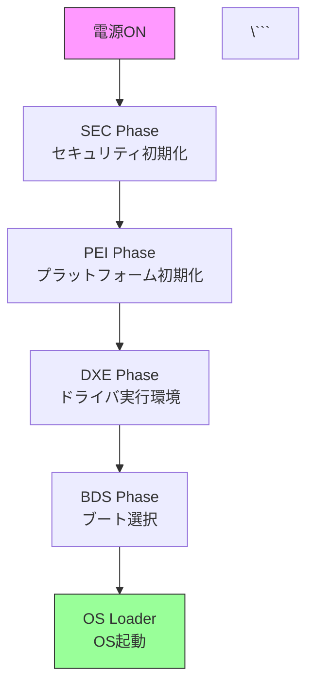

# BIOS入門 - 生成AI執筆ガイドライン

このドキュメントは、Claude（生成AI）が本書を体系的に執筆するための計画書です。

---

## 📋 執筆の全体戦略

### 基本方針

1. **段階的執筆**: Part 0 → Part VI の順に執筆
2. **完全性**: 各章は独立して読めるが、前の章の知識を前提とする
3. **理解重視**: 目的・構成・仕組み・役割の解説を中心に、概念の理解を促進する
4. **初心者配慮**: 専門用語には必ず説明を添え、図解を多用する

### 執筆優先度

#### Phase 1: 基礎（必須） - 最優先
- Part 0（全体像の理解）
- Part I（x86_64 ブート基礎）
- Part II 前半（EDK II アーキテクチャ）

#### Phase 2: 詳細理解（重要）
- Part II 後半（各サブシステム）
- Part III（プラットフォーム初期化）

#### Phase 3: 発展（推奨）
- Part IV（セキュリティアーキテクチャ）
- Part V（デバッグ・最適化の原理）

#### Phase 4: 比較と展望（オプショナル）
- Part VI（他のファームウェア実装、ARM64、将来展望）

### 目標

- **最小構成**: Phase 1 完成で BIOS/UEFI の基本概念とブートプロセスを理解する
- **標準構成**: Phase 1-2 完成で EDK II アーキテクチャとプラットフォーム初期化の仕組みを理解する
- **完全版**: Phase 1-4 完成でプロフェッショナルレベルの知識と全体像を把握する

---

## 📖 章構成テンプレート

### 標準的な章の構成

```markdown
# 章タイトル

🎯 **この章で学ぶこと**
- 学習目標1
- 学習目標2
- 学習目標3

📚 **前提知識**
- 前提となる知識・章

---

## セクション1: 概要と目的

[導入・背景説明・なぜこの技術が必要か]

## セクション2: 全体構成

[アーキテクチャ・構造の全体像]
[図解・ブロック図を多用]

## セクション3: 動作原理と仕組み

[技術的な詳細・内部メカニズム]

### サブセクション: 各コンポーネントの役割

[各部品の責務と連携方法]

## セクション4: 設計思想と背景

[なぜこのような設計になっているか]
[歴史的経緯・技術的制約]

## セクション5: 具体例（オプショナル）

[理解を助けるためのコード断片や疑似コード]
[完全なコードではなく、概念を示すための例]

```c
// 概念を示すための簡略化されたコード例
// 実際の実装とは異なる場合がある
```

## まとめ

この章で学んだことの要約
- 重要なポイント1
- 重要なポイント2
- 重要なポイント3

---

次章では...

📚 **参考資料**
- [UEFI仕様書 該当セクション](URL)
- [関連技術ドキュメント](URL)
```

### セクションの種類と使い分け

| アイコン | 用途 | 必須/任意 |
|---------|------|-----------|
| 🎯 | 学習目標 | 必須 |
| 📚 | 前提知識・参考資料 | 必須 |
| 🏗️ | 構成・アーキテクチャ | 推奨 |
| ⚙️ | 動作原理・メカニズム | 推奨 |
| 🔗 | 外部リンク | 任意 |
| ⚠️ | 警告・注意 | 必要に応じて |
| 💡 | Tips・豆知識 | 任意 |

### 引用ブロックの使い分け

```markdown
> **Note**: 補足説明や追加情報

> **Warning**: 注意事項や危険な操作

> **Tip**: 便利なテクニックやショートカット

> **Important**: 重要なポイント
```

---

## ✍️ 執筆ガイドライン

### トーン＆スタイル

1. **簡潔性**: 1文は短く（～40文字程度）
2. **明確性**: 曖昧な表現を避ける（「多分」「恐らく」は使わない）
3. **親しみやすさ**: 堅苦しすぎず、初心者に優しい語調
4. **専門性**: 正確な技術用語を使用し、必ず説明を添える

### 技術レベル設定

| Part | 対象レベル | 説明スタイル |
|------|----------|-------------|
| Part 0-I | 初心者 | 丁寧・具体的・図解多め |
| Part II | 中級者 | 概念的・構造理解中心・アーキテクチャ解説 |
| Part III-IV | 中級～上級 | 詳細・仕様準拠・設計思想の説明 |
| Part V-VI | 上級者 | 発展的トピック・比較分析 |

### 用語の統一ルール

| 用語 | 表記 | 備考 |
|------|------|------|
| UEFI | 大文字 | Unified Extensible Firmware Interface |
| BIOS | 大文字 | Basic Input/Output System |
| ブートローダ | カタカナ | bootloader |
| ファームウェア | カタカナ | firmware |
| プラットフォーム | カタカナ | platform |
| CPU | 大文字 | プロセッサでも可 |
| メモリ | カタカナ | RAM, DRAM は文脈により |
| x86_64 | 小文字+数字 | アーキテクチャ名 |

### コード例の方針

#### 基本的な考え方

コード例は**概念を理解するための補助**として使用します。完全に動作するコードである必要はなく、重要な部分を抽出・簡略化して示します。

#### コード例の要件

1. **目的明示**: コードの目的と示したい概念を明記
2. **簡潔性**: 理解に必要な部分のみを抽出（完全なコードは不要）
3. **コメント**: 重要な行に日本語コメントで説明
4. **スタイル**: 一貫したコーディングスタイル
   - インデント: 2スペース（C言語）
   - 変数名: CamelCase（UEFI準拠）
   - 関数名: CamelCase（UEFI準拠）

#### コード例テンプレート

```c
/**
  この例の目的: XXXの仕組みを理解する

  注: 実際の実装は異なる場合があります。
      概念を理解するための簡略化されたコードです。
**/

// 重要な処理の流れを示す
EFI_STATUS Status;

// ステップ1: 初期化
Status = InitializeComponent();

// ステップ2: 設定
Status = ConfigureComponent();

// ステップ3: 実行
Status = ExecuteOperation();
```

### 図表の方針（重要）

**解説主体の本では図解が最重要**です。各章には必ず複数の図を含めます。

#### 図の優先順位と使い分け

1. **Mermaid図**: フローチャート、シーケンス図、ブロック図（最優先）
2. **表**: データ構造、比較、仕様の整理
3. **ASCII art**: 簡単なメモリマップやレイアウト
4. **画像**: 必要に応じて `src/images/` に配置

#### 各章に推奨される図

- アーキテクチャ全体図（ブロック図）
- 処理の流れ（フローチャート）
- コンポーネント間の相互作用（シーケンス図）
- データ構造（クラス図・構造図）

#### Mermaid 例

```markdown


---

## 🎯 各Partの執筆方針

### Part 0: BIOS/UEFIの全体像

**目標**: BIOS/UEFIの役割とファームウェアエコシステムの全体像を理解する

**重点**:
- 本書の目的と構成の説明
- BIOS/UEFIの歴史的経緯と存在意義
- ファームウェアエコシステム全体（ツール、仕様、コミュニティ）
- 学習環境の位置づけ（なぜQEMU、EDK IIを使うか）

**執筆時の注意**:
- 「なぜファームウェアが必要か」から始める
- 全体の見取り図を提供する
- 環境構築の詳細は避け、ツールの目的のみ説明
- 読者のモチベーションを高める

**章の構成**:
1. 本書のゴールと学習ロードマップ
2. BIOS/UEFIとは何か：歴史と役割
3. ファームウェアエコシステム全体像
4. 学習環境の概要とツールの位置づけ
5. Part 0 まとめ

### Part I: x86_64 ブート基礎：CPUとメモリ

**目標**: x86_64 アーキテクチャにおけるブートプロセスの全体像を理解する

**重点**:
- リセットから最初の命令実行までの流れ
- メモリマップの構造と目的
- CPU モード遷移の仕組みと理由
- UEFI ブートフェーズの役割分担
- 図解を多用して流れを可視化

**執筆時の注意**:
- 「なぜそうなっているか」を重視
- 実モード→プロテクトモード→ロングモードの遷移理由を説明
- GDT/IDT の目的と役割を明確に
- Intel/AMD のマニュアル参照
- UEFI 仕様書の該当セクションを明記

**章の構成**:
1. リセットから最初の命令まで
2. メモリマップと E820
3. CPU モード遷移の全体像
4. 割り込みとタイマの仕組み
5. UEFI ブートフェーズの全体像
6. 各ブートフェーズの役割と責務
7. Part I まとめ

### Part II: EDK II アーキテクチャ

**目標**: EDK II の設計思想とアーキテクチャを理解する

**重点**:
- EDK II の全体構成と設計思想
- モジュール、プロトコル、ライブラリの役割
- ビルドシステムの仕組み（INF/DEC/DSC の目的）
- 各コンポーネントの責務と連携

**執筆時の注意**:
- 「なぜこのような設計になっているか」を重点的に説明
- コード例は概念を示すための最小限の例に留める
- 実装手順よりも、アーキテクチャの理解を優先
- 図解を多用して全体像を示す

**章の構成**:
1. EDK II の設計思想と全体構成
2. モジュール構造とビルドシステム
3. プロトコルとドライバモデル
4. ライブラリアーキテクチャ
5. ハードウェア抽象化の仕組み
6. グラフィックスサブシステム (GOP)
7. ストレージスタックの構造
8. USB スタックの構造
9. ブートマネージャとブートローダの役割
10. Part II まとめ

### Part III: プラットフォーム初期化の仕組み

**目標**: プラットフォーム初期化の流れと各コンポーネントの役割を理解する

**重点**:
- PEI フェーズの役割と構造
- DRAM 初期化の仕組みと重要性
- CPU、チップセット、PCH/SoC の初期化順序と理由
- PCIe の仕組みとデバイス列挙
- ACPI の目的と構造
- SMBIOS、MP テーブルの役割

**執筆時の注意**:
- 各コンポーネントが「なぜ必要か」を説明
- FSP/AGESA の役割と位置づけを明確に
- 実装の詳細よりも、仕組みと設計思想を重視
- ACPI 仕様書の該当セクション参照
- 図解で初期化の流れを可視化

**章の構成**:
1. PEI フェーズの役割と構造
2. DRAM 初期化の仕組み
3. CPU とチップセット初期化
4. PCH/SoC の役割と初期化
5. PCIe の仕組みとデバイス列挙
6. ACPI の目的と構造
7. ACPI テーブルの役割
8. SMBIOS と MP テーブルの役割
9. Part III まとめ

### Part IV: セキュリティアーキテクチャ

**目標**: UEFI セキュリティの仕組みと設計思想を理解する

**重点**:
- ファームウェアセキュリティ全体像
- 信頼チェーンの構築方法
- Secure Boot のアーキテクチャ
- TPM の役割と Measured Boot
- ベンダー固有のセキュリティ機構（Boot Guard、PSP）
- SPI フラッシュ保護、SMM セキュリティ
- 実際の攻撃事例から学ぶ設計原則

**執筆時の注意**:
- 「なぜこのセキュリティ機構が必要か」を明確に
- 信頼チェーンの構築方法を図解
- CVE 事例から設計の教訓を抽出
- 倫理的配慮（攻撃手法は教育目的のみ）
- セキュリティのトレードオフを説明

**章の構成**:
1. ファームウェアセキュリティの全体像
2. 信頼チェーンの構築
3. UEFI Secure Boot の仕組み
4. TPM と Measured Boot
5. Intel Boot Guard の役割と仕組み
6. AMD PSP の役割と仕組み
7. SPI フラッシュ保護機構
8. SMM の仕組みとセキュリティ
9. 攻撃事例から学ぶ設計原則
10. Part IV まとめ

### Part V: デバッグと最適化の原理

**目標**: デバッグ手法の原理と最適化の考え方を理解する

**重点**:
- ファームウェアデバッグの基本原理
- デバッグツールの仕組み（gdb、シリアルコンソールなど）
- 典型的な問題パターンと原因
- ログとトレースの設計思想
- パフォーマンス測定の原理
- ブート時間最適化の考え方
- 電源管理の仕組み
- ファームウェア更新の仕組み

**執筆時の注意**:
- ツールの使い方よりも、「なぜそうなっているか」を説明
- 問題パターンと根本原因の関係を明確に
- 最適化のトレードオフを説明
- ログ設計の原則を示す

**章の構成**:
1. ファームウェアデバッグの基礎
2. デバッグツールの仕組み
3. 典型的な問題パターンと原因
4. ログとトレースの設計
5. パフォーマンス測定の原理
6. ブート時間最適化の考え方
7. 電源管理の仕組み (S3/Modern Standby)
8. ファームウェア更新の仕組み
9. Part V まとめ

### Part VI: 他のファームウェア実装と発展

**目標**: 他のファームウェア実装・アーキテクチャの設計思想を理解する

**重点**:
- ファームウェアの多様性とその理由
- coreboot の設計哲学と EDK II との比較
- レガシー BIOS アーキテクチャ
- ネットワークブートの仕組み
- プラットフォーム別の特性（サーバ/組込み/モバイル）
- ARM64 ブートアーキテクチャと x86 との違い
- ファームウェアの将来展望

**執筆時の注意**:
- 実装よりも設計思想の比較を重視
- 「なぜ異なる設計が選ばれたか」を説明
- Device Tree の目的と x86 との違い
- 各プラットフォームの要件の違いを明確に
- 将来の技術動向を考察

**章の構成**:
1. ファームウェアの多様性
2. coreboot の設計思想
3. coreboot と EDK II の比較
4. レガシー BIOS アーキテクチャ
5. ネットワークブートの仕組み
6. プラットフォーム別の特性：サーバ/組込み/モバイル
7. ARM64 ブートアーキテクチャ
8. ARM と x86 の違い
9. ファームウェアの将来展望
10. Part VI まとめ

---

## ✅ 品質チェックリスト

### 各章完成時の確認項目

- [ ] 🎯 学習目標が明記されている
- [ ] 📚 前提知識が明記されている
- [ ] 🏗️ 全体構成・アーキテクチャ図がある（必須）
- [ ] ⚙️ 動作原理・仕組みの説明がある（必須）
- [ ] 設計思想・目的が説明されている
- [ ] コンポーネントの役割が明確に説明されている
- [ ] 図表が適切に配置されている（最低2つ以上）
- [ ] 参考資料へのリンクがある
- [ ] 専門用語に説明がある
- [ ] まとめセクションで重要ポイントを整理している
- [ ] 誤字脱字がない
- [ ] リンク切れがない

### コード例の確認（該当する場合）

- [ ] コードの目的が明記されている
- [ ] 概念を理解するために必要な部分のみを抽出している
- [ ] 簡潔で読みやすい（完全なコードである必要はない）
- [ ] 重要な箇所にコメントがある

### リンク・参照の整合性

- [ ] 用語集へのリンクが正しい
- [ ] 他章への参照が正しい
- [ ] 外部リンクが有効
- [ ] UEFI 仕様書の参照が正確

---

## 📊 進捗管理

### 章の完成度マーカー

各章のファイル先頭に以下を記載：

```markdown
<!-- Status: draft | in-review | completed -->
<!-- Last Updated: YYYY-MM-DD -->
<!-- Word Count: XXXX -->
```

### 完成度の定義

| Status | 説明 | 次のアクション |
|--------|------|---------------|
| `draft` | 執筆中 | 執筆を継続 |
| `in-review` | レビュー待ち | レビュー・修正 |
| `completed` | 完成 | なし |

### 未執筆章のプレースホルダー

現在、多くの章が以下のプレースホルダー状態：

```markdown
# 章タイトル

（執筆予定）
```

執筆時は必ずこのプレースホルダーを削除し、完全な章に置き換える。

---

## 📚 参考資料リスト

### 必読仕様書

1. **UEFI Specification**
   - https://uefi.org/specifications
   - 最新版を参照（執筆時点で v2.10）

2. **ACPI Specification**
   - https://uefi.org/specifications
   - ACPI 6.5 以降

3. **Intel® 64 and IA-32 Architectures Software Developer Manuals**
   - https://www.intel.com/sdm
   - Volume 3: System Programming Guide

4. **AMD64 Architecture Programmer's Manual**
   - https://www.amd.com/en/support/tech-docs

### EDK II ドキュメント

1. **EDK II Documentation**
   - https://github.com/tianocore/tianocore.github.io/wiki

2. **EDK II Module Writer's Guide**
   - https://tianocore-docs.github.io/edk2-ModuleWriteGuide/

3. **EDK II Build Specification**
   - https://tianocore-docs.github.io/edk2-BuildSpecification/

### coreboot

1. **coreboot Documentation**
   - https://doc.coreboot.org/

2. **coreboot Developer Manual**
   - https://doc.coreboot.org/getting_started/index.html

### コミュニティ

1. **TianoCore (EDK II)**
   - Mailing List: https://edk2.groups.io/
   - GitHub: https://github.com/tianocore/edk2

2. **coreboot**
   - IRC: #coreboot on libera.chat
   - Mailing List: https://www.coreboot.org/Mailinglist

3. **UEFI Forum**
   - https://uefi.org/

---

## 🚀 執筆開始手順

### Step 1: 最初の章を選ぶ

推奨順序:
1. **Part 0 の第1章** (`src/part0/01-goals-and-roadmap.md`) - 本書の目的と構成
2. **Part 0 の第2章** (`src/part0/02-what-is-bios-uefi.md`) - BIOS/UEFIの基本概念
3. その後、Part 0 → Part I → Part II の順に進める

### Step 2: 章を執筆

1. プレースホルダーを削除
2. 上記テンプレートに従って執筆
3. 図解を先に作成（全体像を把握）
4. 目的・構成・仕組み・役割の順に執筆
5. 品質チェックリスト確認

### Step 3: ビルド確認

```bash
mdbook build
mdbook serve
```

ブラウザで確認し、レイアウト・リンクをチェック

### Step 4: コミット

```bash
git add src/partX/YY-chapter-name.md
git commit -m "完成: Part X - 章タイトル"
git push
```

### Step 5: 次の章へ

Part 0 → Part I → Part II... の順に進める

---

## 📝 執筆時のよくある質問

### Q1: コード例はどこまで詳しく書くべき？

A: **概念を理解するための最小限のコード**を提供します：
- 完全に動作する必要はない（概念を示すための疑似コードでも可）
- 重要な部分のみを抽出・簡略化
- 目的を明記し、「実際の実装は異なる場合がある」と注記

### Q2: 図はどう作る？

A: **図解を最優先**します：
1. Mermaid（最優先）- フローチャート、シーケンス図、ブロック図
2. 表（データ構造、比較）
3. ASCII art（メモリマップなど）
4. 画像（必要に応じて）

各章には最低2つ以上の図を含めます。

### Q3: 実装手順とアーキテクチャ解説のバランスは？

A: **アーキテクチャ解説を優先**します：
- 「どうやるか」より「なぜそうなっているか」を重視
- 実装手順は参考程度に留める
- 設計思想、目的、役割の説明を充実させる

### Q4: 専門用語はどこまで説明する？

A: **初出時に必ず説明**し、用語集にも追加します。

### Q5: 参考文献のフォーマットは？

A:
```markdown
📚 **参考資料**
- [UEFI Specification v2.10 - Section X.Y](https://uefi.org/specifications)
- [Intel SDM Volume 3 - Chapter Z](https://www.intel.com/sdm)
```

仕様書の該当セクションまで明記します。

### Q6: 他の章への参照方法は？

A:
```markdown
詳細は [Part I: リセットから最初の命令まで](../part1/01-reset-vector.md) を参照してください。
```

---

## 🎯 執筆の最終目標

### 完成基準

- [ ] 全60章が `completed` 状態
- [ ] すべての章にアーキテクチャ図がある
- [ ] 目的・構成・仕組み・役割が明確に説明されている
- [ ] 用語集が網羅的
- [ ] 付録が充実
- [ ] mdbook build がエラーなく完了
- [ ] GitHub Pages で正常に表示

### 読者が得られる成果

**本書を読み終えた読者は：**

1. ✅ BIOS/UEFI の全体像とブートプロセスを理解している
2. ✅ EDK II のアーキテクチャと設計思想を理解している
3. ✅ プラットフォーム初期化の流れと各フェーズの役割を理解している
4. ✅ セキュリティ機構の仕組みと設計原則を理解している
5. ✅ 他のファームウェア実装（coreboot等）との違いを理解している
6. ✅ BIOS/UEFI 開発者として必要な知識体系を獲得している

---

**Happy Writing! 📝**
