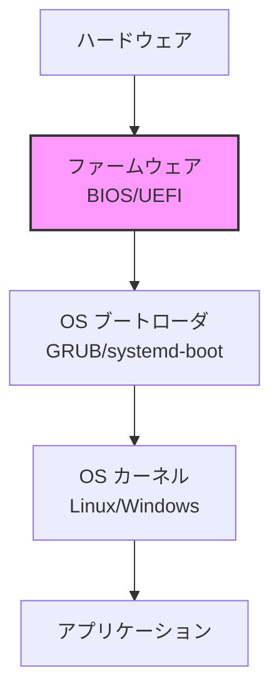
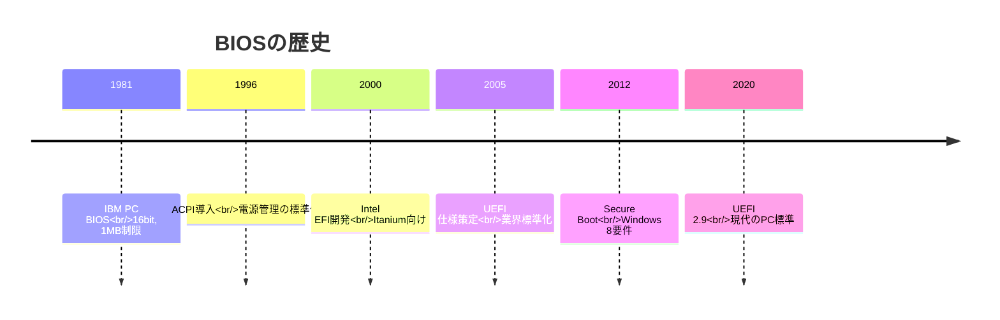
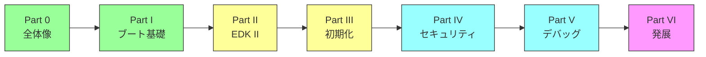

# 本書のゴールと学習ロードマップ

🎯 **この章で学ぶこと**
- 本書の目的と対象読者
- BIOS/UEFIファームウェアとは何か
- 本書の構成と学習の進め方
- 読了後に得られる知識

📚 **前提知識**
- C言語の基礎知識
- Linux/Unixコマンドの基本操作
- コンピュータアーキテクチャの基本概念

---

## 本書の目的

本書は、**BIOS/UEFIファームウェアの仕組みを体系的に理解する**ことを目的としています。ファームウェアは、コンピュータシステムの最も基礎的な層でありながら、その詳細は一般的にあまり知られていません。本書を通じて、この重要な技術領域の全体像を把握し、各コンポーネントがどのように連携してシステムを起動させるかを学んでいきます。

### なぜファームウェアを学ぶのか

コンピュータの電源を入れてから OS が起動するまで、わずか数秒の間に膨大な処理が行われています。この「見えない部分」を担うのがファームウェアです。ファームウェアがなければ、CPU は動作せず、メモリは初期化されず、デバイスは認識されません。つまり、ファームウェアはコンピュータシステムの基盤となる存在なのです。

ファームウェアは、第一に**ハードウェアの初期化**という重要な責務を担っています。電源投入直後、CPU やメモリ、チップセットは未初期化の状態にあります。ファームウェアはこれらのハードウェアコンポーネントを適切に設定し、動作可能な状態にします。また、システムに接続されているデバイスを検出し、それぞれに必要な設定を行います。

次に、ファームウェアは**プラットフォームの抽象化**という役割を果たします。ハードウェアの詳細な仕様は、メーカーやモデルによって大きく異なります。ファームウェアは、これらの違いを隠蔽し、OS に対して標準化されたインターフェースを提供します。これにより、OS は特定のハードウェアに依存せず、統一的な方法でシステムを制御できるようになります。

さらに、現代のファームウェアは**セキュリティの確立**においても中心的な役割を担います。信頼できるコードから始まり、各段階で次のコンポーネントを検証する「信頼チェーン」を構築します。これにより、不正なコードや改ざんされたソフトウェアがシステムに侵入することを防ぎます。

### 本書が目指すゴール

本書を読み終えた時、あなたは BIOS/UEFI の全体像とブートプロセスを理解し、なぜそのような設計になっているのかを説明できるようになるでしょう。EDK II アーキテクチャと設計思想についても深く理解し、各コンポーネントの役割と相互関係を把握できます。

また、プラットフォーム初期化の仕組みについても詳しく学びます。CPU、メモリ、チップセットがどのような順序で、どのような方法で初期化されるのか、その背景にある技術的な理由まで理解できるようになります。セキュリティアーキテクチャの原理についても学び、現代のファームウェアがどのように脅威に対抗しているかを知ることができます。

こうした知識を通じて、あなたはファームウェア開発者として必要な知識体系を獲得します。実装の細かな手順よりも、「なぜそうなっているか」という本質的な理解を重視していることが、本書の大きな特徴です。完全に動くコードを書くことよりも、設計思想と仕組みの理解を優先しています。

## BIOS/UEFIとは何か

### ファームウェアの位置づけ

ファームウェアは、コンピュータシステムにおいて**ハードウェアとソフトウェアの橋渡し**という重要な役割を担っています。システムの最下層にあるハードウェアは、そのままでは OS から直接制御することが困難です。ファームウェアは、この間に位置し、ハードウェアを初期化して使える状態にし、OS に対して標準化されたインターフェースを提供します。

コンピュータの起動時、ファームウェアは最初に実行されるソフトウェアです。ハードウェアの状態を確認し、必要な初期化を行った後、OS ブートローダに制御を渡します。ブートローダは OS カーネルをメモリにロードし、カーネルが起動するとアプリケーションを実行できる環境が整います。このように、ファームウェアは起動プロセス全体の基盤となる存在です。

**補足図**: 以下の図は、ファームウェアがシステムのどの層に位置するかを示したものです。

### レガシーBIOS から UEFI への進化

ファームウェア技術は、コンピュータの歴史とともに進化してきました。1981年、IBM PC が登場した際、BIOS (Basic Input/Output System) が標準的なファームウェアとして採用されました。この初期の BIOS は 16bit のリアルモードで動作し、1MB のメモリしか扱えないという制限がありました。

1990年代後半になると、ACPI (Advanced Configuration and Power Interface) が導入され、電源管理の標準化が進みました。しかし、BIOS の基本的な設計は変わらず、新しいハードウェアや大容量ディスクへの対応が困難になっていきました。

2000年代に入り、Intel は Itanium プロセッサ向けに EFI (Extensible Firmware Interface) を開発しました。これは従来の BIOS の制約を克服し、モダンなアーキテクチャを提供するものでした。2005年には、業界標準として UEFI 仕様が策定され、様々なベンダーが採用するようになりました。2012年には Secure Boot が Windows 8 の要件となり、セキュリティ機能も強化されました。

**補足図**: 以下のタイムラインは、BIOS から UEFI への進化の歴史を示したものです。

### 主な違い

レガシーBIOS と UEFI の違いは、アーキテクチャの根本から異なります。レガシーBIOS は 16bit のリアルモードで動作するため、現代の 64bit プロセッサの能力を活かせませんでした。一方、UEFI は 32bit または 64bit のプロテクトモードで動作し、モダンなプロセッサの機能を十分に活用できます。

設計思想においても大きな違いがあります。レガシーBIOS はモノリシック（一枚岩）な設計で、機能の追加や変更が困難でした。UEFI はモジュラー設計を採用し、必要な機能をドライバやアプリケーションとして追加できる柔軟性を持っています。

ディスク容量の制限も重要な違いです。レガシーBIOS が使用する MBR (Master Boot Record) パーティション方式では、2TB までのディスクしか扱えませんでした。UEFI が採用する GPT (GUID Partition Table) では、実質的に無制限の容量を扱うことができます。さらに、UEFI は Secure Boot というセキュリティ機能を提供し、署名されていないコードの実行を防ぐことができます。

## 本書の構成

本書は6つのPartと付録から構成されています。各Partは段階的に知識を積み上げていく構成になっており、前のPartで学んだ内容を基礎として、次のPartでより深い理解を目指します。

### Part 0: BIOS/UEFIの全体像（本Part）

この Part では、ファームウェアとは何か、どのようなエコシステムが存在するかを理解することを目的としています。BIOS/UEFI の歴史的な経緯から始まり、現代のファームウェアが担う役割を学びます。また、ファームウェアを取り巻くエコシステム全体を俯瞰し、開発に必要なツールや仕様書、コミュニティについても紹介します。学習環境がどのような位置づけにあるのかを理解することで、以降の学習をスムーズに進められるようになります。

### Part I: x86_64 ブート基礎

Part I では、x86_64 アーキテクチャにおけるブートプロセスを理解することを目的としています。コンピュータの電源が入った瞬間、CPU はどのようにして最初の命令を実行するのか、リセットベクタという概念から学んでいきます。メモリマップの構造を理解し、なぜ特定のアドレスに特定の機能が配置されているのかを知ります。また、CPU がリアルモードからプロテクトモード、そしてロングモードへと遷移する仕組みと、その理由を詳しく学びます。UEFI のブートフェーズについても、各フェーズの役割を理解します。

### Part II: EDK II アーキテクチャの理解

Part II では、EDK II の設計思想とアーキテクチャを理解することを目的としています。EDK II は UEFI の参照実装であり、そのアーキテクチャを理解することは UEFI 全体の理解につながります。モジュールがどのように構成され、プロトコルを通じてどのように連携するのか、ライブラリがどのような役割を果たすのかを学びます。また、グラフィックス、ストレージ、USB といった各サブシステムの構造についても詳しく見ていきます。

### Part III: プラットフォーム初期化の仕組み

Part III では、プラットフォーム初期化の流れを理解することを目的としています。PEI (Pre-EFI Initialization) フェーズがどのような役割を持ち、なぜ DXE フェーズの前に必要なのかを学びます。DRAM の初期化は特に重要で、メモリが使えるようになる前の状態でどのように処理を進めるのか、その仕組みを理解します。CPU やチップセットの初期化についても、その順序と理由を詳しく学びます。ACPI テーブルが OS にどのような情報を提供するのかについても理解を深めます。

### Part IV: セキュリティアーキテクチャ

Part IV では、ファームウェアセキュリティの仕組みを理解することを目的としています。信頼チェーンの構築がどのように行われ、なぜそれが重要なのかを学びます。Secure Boot の動作原理や、TPM (Trusted Platform Module) がどのように測定と検証を行うのかについても詳しく見ていきます。実際の攻撃事例から、ファームウェアの脆弱性がどのように悪用されるのかを学び、それを防ぐための設計原則を理解します。

### Part V: デバッグと最適化の原理

Part V では、デバッグ手法と最適化の考え方を理解することを目的としています。ファームウェアのデバッグは通常のソフトウェアとは異なる課題があり、それに対応するツールや手法を学びます。典型的な問題パターンとその根本原因を理解することで、効率的にトラブルシューティングができるようになります。パフォーマンス測定の原理を学び、ブート時間の最適化やファームウェア更新の仕組みについても理解を深めます。

### Part VI: 他のファームウェア実装と発展

Part VI では、他のファームウェア実装の設計思想を理解することを目的としています。coreboot と EDK II を比較することで、それぞれの設計哲学の違いとトレードオフを学びます。ARM64 アーキテクチャにおけるブートプロセスは x86_64 とは大きく異なり、その違いを理解することでアーキテクチャごとの特性を把握できます。最後に、ファームウェアの将来展望について考察し、技術の方向性を理解します。

### 付録

付録では、本書で使用する用語をまとめた用語集、さらなる学習のための参考文献とリソース、頻繁に参照する仕様書のクイックリファレンスを提供しています。これらは本編の理解を深めるための補助資料として活用できます。

## 学習ロードマップ

### 推奨される学習順序

本書の学習は、Part 0 から順番に進めることを強く推奨します。各 Part は前の Part で学んだ知識を前提としているため、順序を守ることで理解が深まります。まず Part 0 で全体像を把握し、Part I でブート基礎を学びます。これらは必須の内容で、ファームウェアを理解する上での土台となります。

次に、Part II と Part III に進みます。これらは EDK II のアーキテクチャとプラットフォーム初期化という重要なトピックを扱います。ここまでで、ファームウェアの基本的な仕組みと構造を理解できるようになります。

Part IV から Part VI は発展的・応用的な内容です。セキュリティやデバッグといった実践的なトピックや、coreboot や ARM64 といった他の実装について学びます。これらは、より深い理解を求める読者向けの内容となっています。

**補足図**: 以下の図は、推奨される学習の流れを示したものです。色分けは、必須（緑）、重要（黄）、発展（青）、応用（紫）を表しています。

### 学習時間の目安

本書を完走するには、およそ 40 時間から 60 時間程度の学習時間を見込んでいます。Part 0 は導入部分なので比較的短く、2〜3時間程度で読み終えることができます。難易度も低く、前提知識がなくても理解できる内容です。

Part I は x86_64 の基礎を扱うため、5〜7時間程度の学習時間が必要です。難易度は中程度で、アセンブリやアーキテクチャの知識があると理解しやすくなります。Part II と Part III は、それぞれ 8〜12時間程度を見込んでいます。これらは本書の中核となる内容で、EDK II のアーキテクチャとプラットフォーム初期化という複雑なトピックを扱うため、じっくりと時間をかけて学ぶ必要があります。

Part IV はセキュリティという高度なトピックですが、6〜10時間程度で学べます。Part V はデバッグと最適化を扱い、4〜6時間程度です。Part VI は 6〜8時間程度で、他のファームウェア実装との比較を通じて視野を広げます。

### 学習の進め方

本書では**段階的アプローチ**を推奨しています。一度にすべてを理解しようとせず、3つの段階に分けて学習を進めることで、確実に知識を積み上げていくことができます。

第1段階では、Part 0 と Part I を学習します。これには約 10 時間を見込んでいます。この段階では、ファームウェアとは何か、なぜ必要なのかという基本的な問いに答えます。ブートプロセスの全体的な流れを理解し、以降の学習の土台を築きます。

第2段階では、Part II と Part III に進みます。これには約 20 時間を見込んでいます。EDK II の構造を詳しく学び、プロトコルやドライバモデルといった重要な概念を理解します。プラットフォーム初期化の仕組みを学ぶことで、ハードウェアがどのように初期化され、OS に引き継がれるかを理解します。

第3段階では、Part IV から Part VI を学習します。これにも約 20 時間を見込んでいます。セキュリティアーキテクチャを学び、現代のファームウェアがどのように脅威に対抗しているかを理解します。デバッグ手法を学び、実践的なスキルを身につけます。最後に、他のファームウェア実装を学ぶことで、UEFI 以外の選択肢についても知識を広げます。

なお、本書は実装スキルよりも理解を重視しているため、実際にコードを書く時間は最小限に抑えられています。読んで理解することに集中できるよう設計されています。

## 対象読者

### 想定する読者層

本書は、ファームウェアという技術領域に初めて触れる方から、既に一定の知識を持つ方まで、幅広い読者を対象としています。まず第一に、ファームウェア開発に興味を持つソフトウェアエンジニアの方々を想定しています。アプリケーション開発やシステムプログラミングの経験はあるものの、ハードウェアに近い層での開発経験が少ない方でも、本書を通じてファームウェアの世界を体系的に理解できるよう構成されています。

また、組込みシステムやプラットフォーム開発に携わる方々にとっても、本書は有用な知識を提供します。組込みシステムでは、ハードウェアとソフトウェアの境界領域での理解が重要となります。ファームウェアがどのようにハードウェアを初期化し、OS やアプリケーションに実行環境を提供するかを理解することで、より効果的なシステム設計が可能になります。

さらに、OS 開発者でブートプロセスをより深く理解したい方、セキュリティ研究者でファームウェア層のセキュリティを学びたい方、そしてコンピュータサイエンスを学ぶ学生の方々も、本書の主要な対象読者です。特にセキュリティの観点では、ファームウェア層での脆弱性が近年注目されており、この層を理解することは現代のシステムセキュリティにおいて不可欠となっています。

### 必要な前提知識

本書を効果的に学習するためには、いくつかの前提知識が必要です。まず必須となるのは、C言語の基礎知識です。特にポインタと構造体の理解は重要で、UEFI のコードはこれらの概念を多用します。次に、Linux や Unix のコマンドライン操作の基本も必須です。本書の実習では、シェルでのビルドやデバッグを行うため、基本的なコマンド操作に慣れている必要があります。また、コンピュータアーキテクチャの基礎知識として、CPU、メモリ、I/O といった概念を理解していることが求められます。

一方、あると望ましい知識もあります。x86 や x86_64 のアセンブリ言語の基礎を知っていれば、ブートプロセスの詳細な理解がより容易になります。ただし、本書では必要に応じてアセンブリの説明も行うため、必須ではありません。また、OS の起動プロセスの概要を知っていること、Git の基本操作ができることも、学習をスムーズに進める上で役立ちます。これらの知識がなくても本書を読み進めることは可能ですが、並行して学習することをお勧めします。

## 本書の特徴

### 解説重視のアプローチ

本書は、ハンズオン形式のチュートリアルではなく、**ファームウェアの仕組みと設計思想を理解すること**に重点を置いています。完全に動作するコードを一から実装したり、ステップバイステップで機能を追加していくような形式ではありません。また、実機での検証手順を詳細に解説するものでもありません。こうしたアプローチではなく、本書が目指すのは「なぜそのような設計になっているのか」「各コンポーネントがどのような役割を果たしているのか」といった本質的な理解です。

この方針により、読者はファームウェア全体のアーキテクチャを俯瞰的に理解することができます。個別の実装の詳細に埋もれることなく、システム全体の設計思想を把握できるよう、各章では原理や概念の説明に十分な文章を割いています。実装の詳細が必要な場合は、公式の仕様書やリファレンス実装のコードを参照できるよう、適切なリンクを提供しています。

### 文章による丁寧な説明

本書では、文章による説明を主体としています。各章は、まず文章で概念や仕組みを丁寧に解説し、その理解を助けるために図表を補助的に使用する構成になっています。段落を使って論理的に説明を展開することで、読者が順を追って理解を深められるよう配慮しています。図や表は、文章で説明した内容を視覚的に補完するために用いられます。

具体的には、Mermaid 図を使ったフローチャートやシーケンス図で処理の流れを示したり、表を使ってデータ構造や比較情報を整理したり、ASCII アートでメモリマップを表現したりしています。しかし、これらの図表は常に文章の説明の後に配置され、「補足図」「参考表」として提示されます。図表から学習を始めるのではなく、文章をしっかり読んでから図表で理解を確認する、という流れを意識しています。

### 仕様書との対応

本書で扱う各技術トピックには、該当する公式仕様書のセクションを明記しています。これにより、より詳細な情報が必要な場合や、最新の仕様を確認したい場合に、すぐに一次情報源にアクセスできます。主に参照する仕様書は、UEFI Specification、ACPI Specification、そして Intel や AMD のアーキテクチャマニュアルです。これらの仕様書は膨大な情報量を持つため、本書では重要なポイントを抽出して説明し、詳細は仕様書を参照するという形をとっています。このアプローチにより、本書を読み終えた後も、読者が自力で仕様書を読み解く力を身につけられるよう配慮しています。

## まとめ

この章では、本書の目的と構成について詳しく説明しました。本書は、BIOS や UEFI といったファームウェア技術の仕組みを体系的に理解することを主眼としています。単にコードの書き方を学ぶのではなく、なぜそのような設計になっているのか、各コンポーネントがどのような役割を果たしているのかといった、設計思想と本質的な理解を重視しています。

本書は Part 0 から Part VI までの6つの Part と付録から構成されており、段階的に知識を積み上げていく構成になっています。基礎から応用まで、約 40 時間から 60 時間で完走できるよう設計されています。各 Part では文章による丁寧な説明を主体とし、図表は理解を助けるための補助として用いています。この学習を通じて、読者はファームウェア開発の全体像を把握し、実務や研究に活かせる知識を身につけることができます。

次章では、BIOS と UEFI とは具体的に何なのか、その歴史的な経緯と現代における役割について、さらに詳しく見ていきます。ファームウェアがどのように進化してきたか、そして現代のコンピュータシステムでどのような位置づけにあるかを理解することで、以降の章での学習がより深いものになるでしょう。

---

📚 **参考資料**
- [UEFI Forum - About UEFI](https://uefi.org/about)
- [UEFI Specification v2.10](https://uefi.org/specifications)
- [EDK II Documentation](https://github.com/tianocore/tianocore.github.io/wiki)
