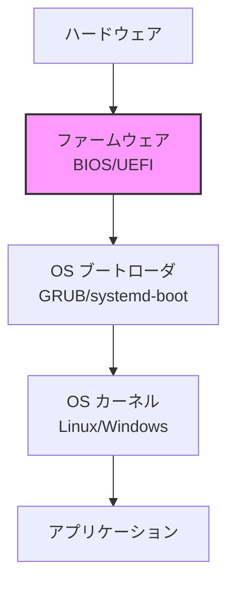
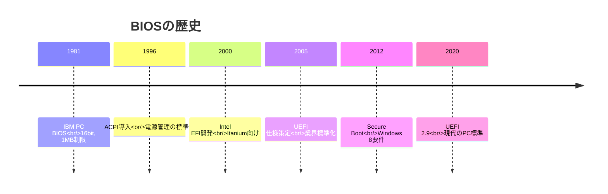
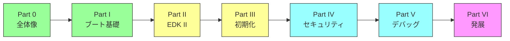

# 本書のゴールと学習ロードマップ

🎯 **この章で学ぶこと**
- 本書の目的と対象読者
- BIOS/UEFIファームウェアとは何か
- 本書の構成と学習の進め方
- 読了後に得られる知識

📚 **前提知識**
- C言語の基礎知識
- Linux/Unixコマンドの基本操作
- コンピュータアーキテクチャの基本概念

---

## 本書の目的

本書は、**BIOS/UEFIファームウェアの仕組みを体系的に理解する**ことを目的としています。

### なぜファームウェアを学ぶのか

コンピュータの電源を入れてから OS が起動するまで、わずか数秒の間に膨大な処理が行われています。この「見えない部分」を担うのがファームウェアです。

**ファームウェアは以下の責務を持ちます：**

1. **ハードウェアの初期化**
   - CPU、メモリ、チップセットの設定
   - デバイスの検出と設定

2. **プラットフォームの抽象化**
   - ハードウェアの詳細を隠蔽
   - OS に標準化されたインターフェースを提供

3. **セキュリティの確立**
   - 信頼チェーンの構築
   - 不正なコードの起動を防止

### 本書が目指すゴール

本書を読み終えた時、あなたは以下を理解しているでしょう：

- ✅ BIOS/UEFIの全体像とブートプロセス
- ✅ EDK II アーキテクチャと設計思想
- ✅ プラットフォーム初期化の仕組み
- ✅ セキュリティアーキテクチャの原理
- ✅ ファームウェア開発者として必要な知識体系

**注**: 本書は解説中心です。完全に動くコードを書くことよりも、「なぜそうなっているか」を理解することを重視します。

## BIOS/UEFIとは何か

### ファームウェアの位置づけ

ファームウェアは、**ハードウェアとソフトウェアの橋渡し**をします。

### レガシーBIOS から UEFI への進化

**UEFI (Unified Extensible Firmware Interface)** は、1980年代から使われてきたレガシーBIOSの制約を克服するために開発されました。

### 主な違い

| 側面 | レガシーBIOS | UEFI |
|------|-------------|------|
| アーキテクチャ | 16bit リアルモード | 32/64bit プロテクトモード |
| 設計思想 | モノリシック | モジュラー |
| ディスク容量 | 2TB制限 (MBR) | 実質無制限 (GPT) |
| セキュリティ | なし | Secure Boot |
| 拡張性 | Option ROM | ドライバモデル |
| インターフェース | BIOS割り込み | プロトコルベース |

## 本書の構成

本書は6つのPartと付録から構成されています。

### Part 0: BIOS/UEFIの全体像（本Part）

**目的**: ファームウェアとは何か、どのようなエコシステムが存在するかを理解する

**内容**:
- BIOS/UEFIの歴史と役割
- ファームウェアエコシステム
- 学習環境の位置づけ

### Part I: x86_64 ブート基礎

**目的**: x86_64 アーキテクチャにおけるブートプロセスを理解する

**内容**:
- リセットベクタと最初の命令
- メモリマップの構造
- CPU モード遷移
- UEFI ブートフェーズ

### Part II: EDK II アーキテクチャの理解

**目的**: EDK II の設計思想とアーキテクチャを理解する

**内容**:
- EDK II の全体構成
- モジュール、プロトコル、ライブラリ
- 各サブシステムの構造

### Part III: プラットフォーム初期化の仕組み

**目的**: プラットフォーム初期化の流れを理解する

**内容**:
- PEI フェーズの役割
- DRAM、CPU、チップセット初期化
- ACPI テーブルの役割

### Part IV: セキュリティアーキテクチャ

**目的**: ファームウェアセキュリティの仕組みを理解する

**内容**:
- 信頼チェーンの構築
- Secure Boot、TPM
- 攻撃事例から学ぶ設計原則

### Part V: デバッグと最適化の原理

**目的**: デバッグ手法と最適化の考え方を理解する

**内容**:
- デバッグツールの仕組み
- 典型的な問題パターン
- パフォーマンス測定の原理

### Part VI: 他のファームウェア実装と発展

**目的**: 他のファームウェア実装の設計思想を理解する

**内容**:
- coreboot と EDK II の比較
- ARM64 アーキテクチャ
- ファームウェアの将来展望

### 付録

- 用語集
- 参考文献とリソース
- 仕様書クイックリファレンス

## 学習ロードマップ

### 推奨される学習順序

**色分け:**
- 🟢 緑: 必須（Part 0-I）
- 🟡 黄: 重要（Part II-III）
- 🔵 青: 発展（Part IV-V）
- 🟣 紫: 応用（Part VI）

### 学習時間の目安

| Part | 推定時間 | 難易度 |
|------|---------|--------|
| Part 0 | 2-3時間 | ★☆☆☆☆ |
| Part I | 5-7時間 | ★★☆☆☆ |
| Part II | 8-12時間 | ★★★☆☆ |
| Part III | 8-12時間 | ★★★★☆ |
| Part IV | 6-10時間 | ★★★★☆ |
| Part V | 4-6時間 | ★★★☆☆ |
| Part VI | 6-8時間 | ★★★☆☆ |
| **合計** | **40-60時間** | - |

### 学習の進め方

**段階的アプローチ**を推奨します：

1. **第1段階: 全体像の把握**（Part 0-I）
   - ファームウェアとは何か
   - ブートプロセスの流れ
   - 約10時間

2. **第2段階: アーキテクチャ理解**（Part II-III）
   - EDK II の構造
   - プラットフォーム初期化
   - 約20時間

3. **第3段階: 発展的トピック**（Part IV-VI）
   - セキュリティ、デバッグ、他実装
   - 約20時間

**注**: 実装スキルよりも理解を重視しているため、コードを書く時間は最小限です。

## 対象読者

### 想定する読者層

本書は以下のような方を対象としています：

- ファームウェア開発に興味があるソフトウェアエンジニア
- 組込みシステムやプラットフォーム開発者
- OS開発者でブートプロセスを深く理解したい方
- セキュリティ研究者でファームウェア層を学びたい方
- コンピュータサイエンスの学生

### 必要な前提知識

**必須:**
- C言語の基礎（ポインタ、構造体）
- Linux/Unixコマンドラインの基本操作
- コンピュータアーキテクチャの基礎知識（CPU、メモリ、I/O）

**あると望ましい:**
- x86/x86_64 アセンブリの基礎
- OS の起動プロセスの概要
- Git の基本操作

## 本書の特徴

### 解説重視のアプローチ

本書は**ハンズオンよりも解説を重視**しています：

❌ **本書ではないこと:**
- 完全に動くコードの実装
- ステップバイステップのチュートリアル
- 実機での検証手順

✅ **本書で学べること:**
- 仕組みと設計思想の理解
- 「なぜそうなっているか」の説明
- アーキテクチャの全体像
- 各コンポーネントの役割

### 図解の活用

各章には**最低2つ以上の図**を含めています：

- Mermaid図（フローチャート、シーケンス図）
- 表（比較、データ構造）
- ASCII アート（メモリマップ）

### 仕様書との対応

各技術トピックには、該当する仕様書のセクションを明記しています：

- UEFI Specification
- ACPI Specification
- Intel/AMD マニュアル

## まとめ

この章では、本書の目的と構成を説明しました。

**重要なポイント:**

- 本書はBIOS/UEFIファームウェアの**仕組みを理解すること**が目的
- 解説重視で、実装よりも**設計思想**を重視
- Part 0-VI の6つのPartで段階的に学習
- 約40-60時間で完走可能

---

**次章では、BIOS/UEFIとは何か、その歴史と役割を詳しく見ていきます。**

📚 **参考資料**
- [UEFI Forum - About UEFI](https://uefi.org/about)
- [UEFI Specification v2.10](https://uefi.org/specifications)
- [EDK II Documentation](https://github.com/tianocore/tianocore.github.io/wiki)
