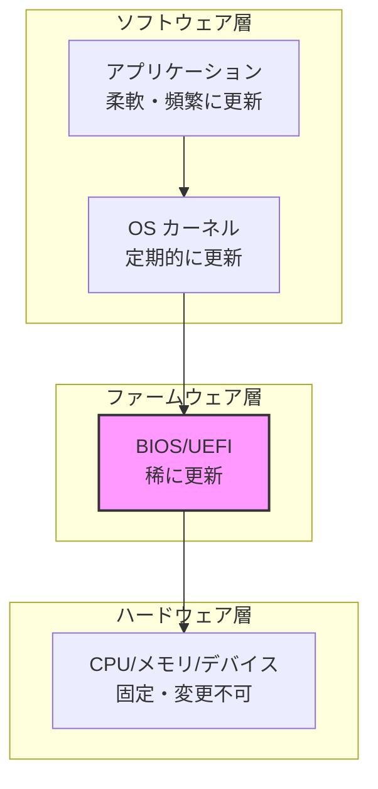
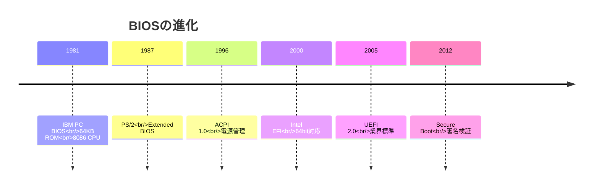
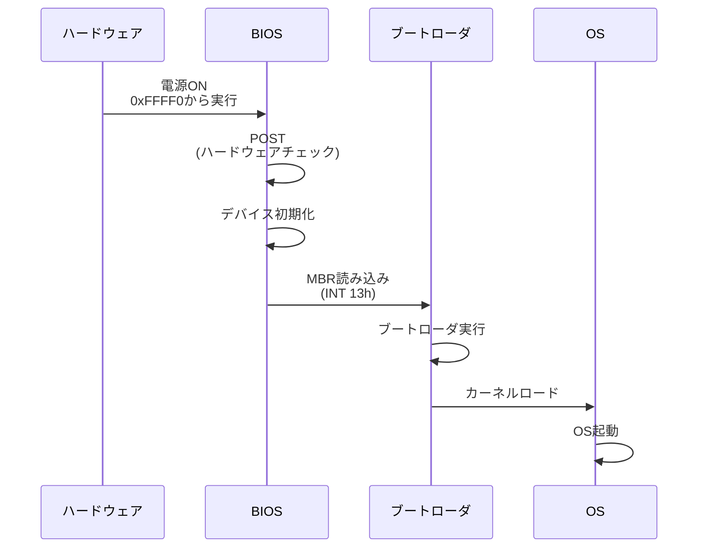
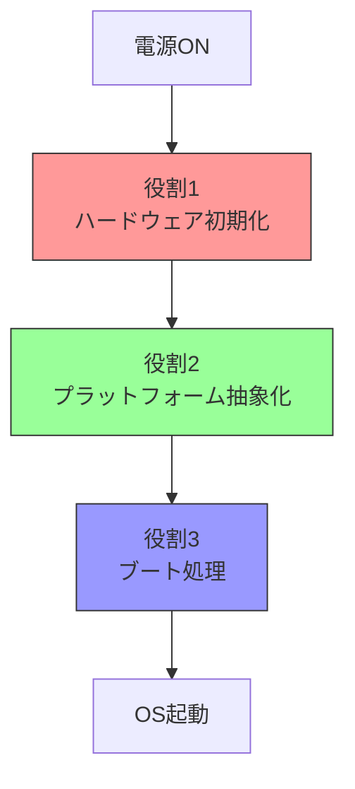
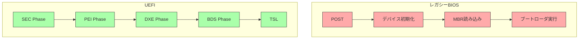
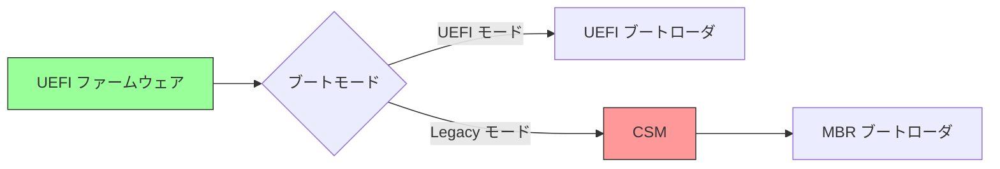

# BIOS/UEFIとは何か：歴史と役割

🎯 **この章で学ぶこと**
- BIOSの歴史的経緯と設計上の制約
- UEFIが開発された理由と目的
- BIOS/UEFIが果たす役割
- レガシーBIOSとUEFIの根本的な違い

📚 **前提知識**
- コンピュータの基本構成（CPU、メモリ、ストレージ）
- プログラムの実行プロセスの概要

---

## ファームウェアとは何か

### ソフトウェアとハードウェアの間

**ファームウェア (Firmware)** は、「固い (Firm)」という名の通り、ハードウェアとソフトウェアの中間に位置するソフトウェアです。



**ファームウェアの特徴:**

1. **電源投入直後から動作**
   - OS が起動する前に実行される
   - ハードウェアを直接制御

2. **ハードウェアに深く結びつく**
   - プラットフォーム固有の処理を実装
   - ハードウェアの初期化を担当

3. **変更が困難**
   - 更新には特別な手順が必要
   - 失敗するとシステムが起動不能に

## BIOSの歴史

### 誕生：IBM PC (1981年)

BIOS (Basic Input/Output System) は、1981年にIBM PCとともに誕生しました。



### 設計上の制約

IBM PC BIOSは、当時のハードウェア制約の中で設計されました：

**主な制約:**

| 制約 | 内容 | 影響 |
|------|------|------|
| 16bit リアルモード | 8086 CPU のモード | 1MB メモリ空間のみ |
| INT 13h | ディスクアクセス | CHS アドレッシング限界 |
| Option ROM | 拡張カードの初期化 | サイズ制限あり |
| MBR | パーティション管理 | 2TB ディスク制限 |

### レガシーBIOSの動作



### なぜレガシーBIOSは限界に達したか

**1. アーキテクチャの制約**

16bit リアルモードでは、1MBのメモリ空間しか扱えません：

```
0x00000 - 0x003FF : 割り込みベクタテーブル (IVT)
0x00400 - 0x004FF : BIOS データエリア
0x00500 - 0x9FFFF : 利用可能RAM
0xA0000 - 0xBFFFF : ビデオメモリ
0xC0000 - 0xFFFFF : BIOS ROM / Option ROM
```

現代のシステムでは、この空間は全く不足しています。

**2. ディスク容量の限界**

MBR (Master Boot Record) は、以下の制約があります：

- パーティション情報: 4エントリのみ
- セクタアドレス: 32bit → 2TB制限
- ブートコード: 446バイトのみ

**3. 拡張性の欠如**

- モノリシックな設計
- ドライバモデルがない
- ネットワークブート、USB ブートが困難

**4. セキュリティの不在**

- ブートローダの検証機構がない
- ルートキットの挿入が容易

## UEFIの誕生

### Intel EFI (2000年)

Intel は、Itanium (IA-64) プロセッサ向けに **EFI (Extensible Firmware Interface)** を開発しました。

**開発の動機:**

1. **64bit アーキテクチャへの対応**
   - Itanium は 64bit プロセッサ
   - レガシーBIOS は 16bit

2. **大規模サーバの要件**
   - 大容量メモリ
   - 多数のデバイス
   - リモート管理

3. **拡張性の実現**
   - ドライバモデル
   - プロトコルベースのアーキテクチャ

### UEFI 仕様の策定 (2005年)

Intel EFI は、業界標準として **UEFI** に発展しました。

**UEFI Forum の設立:**
- Intel, AMD, Microsoft, Apple など主要ベンダーが参加
- オープンな仕様策定
- 定期的な仕様改定

**主なマイルストーン:**

| バージョン | 年 | 主な追加機能 |
|-----------|-------|--------------|
| UEFI 2.0 | 2006 | 基本仕様確立 |
| UEFI 2.1 | 2007 | ネットワークブート |
| UEFI 2.3 | 2009 | セキュリティ強化 |
| UEFI 2.3.1 | 2012 | Secure Boot |
| UEFI 2.7 | 2017 | HTTP ブート |
| UEFI 2.10 | 2022 | 最新仕様 |

## BIOS/UEFIの役割

### 3つの主要な役割



### 役割1: ハードウェア初期化

**目的**: 使用可能な状態にする

**主な処理:**

1. **CPU 初期化**
   - マイクロコードロード
   - キャッシュ設定
   - マルチコア有効化

2. **メモリ初期化**
   - DRAM トレーニング
   - メモリマップ構築
   - ECC設定

3. **チップセット初期化**
   - I/O コントローラ設定
   - PCIe リンクトレーニング
   - タイマー、割り込みコントローラ設定

4. **デバイス初期化**
   - ストレージコントローラ
   - ネットワークコントローラ
   - USB コントローラ

### 役割2: プラットフォーム抽象化

**目的**: ハードウェアの詳細を隠蔽

**提供するもの:**

1. **標準化されたインターフェース**
   - ディスクアクセス
   - グラフィックス出力
   - ネットワーク通信

2. **設定情報**
   - ACPI テーブル（ハードウェア構成）
   - SMBIOS テーブル（システム情報）
   - デバイスツリー（ARM64）

3. **ランタイムサービス**
   - NVRAM アクセス
   - 時刻取得
   - リセット・シャットダウン

### 役割3: ブート処理

**目的**: OS を起動する

**処理の流れ:**


**UEFI のブートプロセス:**

1. EFI System Partition (ESP) をマウント
2. `\EFI\BOOT\BOOTx64.EFI` を検索
3. ブートローダを実行
4. OS カーネルをロード

## レガシーBIOSとUEFIの違い

### アーキテクチャの比較



### 詳細な比較表

| 項目 | レガシーBIOS | UEFI | 理由・背景 |
|------|-------------|------|-----------|
| **CPUモード** | 16bit リアルモード | 32/64bit プロテクト/ロングモード | モダンCPUの活用 |
| **メモリ空間** | 1MB (0x00000-0xFFFFF) | 理論上無制限 | 大容量メモリ対応 |
| **プログラミング言語** | アセンブリ主体 | C言語主体 | 開発効率向上 |
| **ディスク** | MBR (2TB制限) | GPT (9.4ZB) | 大容量ディスク対応 |
| **ブートローダ** | 512バイト (MBR) | EFI アプリケーション | 複雑な処理が可能 |
| **ドライバ** | Option ROM (制限あり) | DXE ドライバ | 拡張性 |
| **セキュリティ** | なし | Secure Boot, Measured Boot | セキュリティ要件 |
| **ネットワーク** | PXE (制限あり) | HTTP Boot, iSCSI | モダンなプロトコル |
| **GUI** | テキストモード | グラフィカル UI | ユーザビリティ |
| **仕様** | 事実上の標準 (IBM互換) | オープン仕様 (UEFI Forum) | 標準化 |

### 設計思想の違い

**レガシーBIOS:**
- モノリシックな設計
- ハードウェアへの直接アクセス
- 互換性重視

**UEFI:**
- モジュラーな設計
- 抽象化レイヤの提供
- 拡張性重視

### 互換性

現代のUEFI実装は、**CSM (Compatibility Support Module)** を通じてレガシーBIOSモードもサポートしています：



ただし、CSMは段階的に廃止されつつあります。

## なぜUEFIへの移行が必要だったか

### 技術的要因

1. **ハードウェアの進化**
   - 64bit CPU の普及
   - 大容量メモリ (数百GB〜TB)
   - 大容量ディスク (数TB〜PB)

2. **セキュリティ要件の高まり**
   - ブートキット、ルートキットの脅威
   - 信頼できるブートプロセスの必要性

3. **複雑化するシステム**
   - 多様なデバイス
   - ネットワークブート
   - リモート管理

### ビジネス要因

1. **Windows 8 の要件 (2012年)**
   - UEFI Secure Boot が必須
   - OEM はUEFI対応を強制された

2. **エンタープライズ要件**
   - 大規模サーバの管理
   - セキュリティコンプライアンス

3. **エコシステムの成熟**
   - Linux、BSD の UEFI サポート
   - ブートローダ (GRUB2, systemd-boot) の対応

## まとめ

この章では、BIOS/UEFIの歴史と役割を説明しました。

**重要なポイント:**

- **ファームウェア**はハードウェアとソフトウェアの橋渡し
- **レガシーBIOS**は1981年以来の設計で、現代のハードウェアには不適合
- **UEFI**は拡張性、セキュリティ、大容量対応を実現
- BIOS/UEFIの主な役割は：**初期化**、**抽象化**、**ブート処理**
- UEFIはモジュラーな設計思想で、C言語で開発可能

**歴史の流れ:**
```
1981: IBM PC BIOS
  ↓
2000: Intel EFI (Itanium)
  ↓
2005: UEFI 仕様策定
  ↓
2012: Secure Boot 普及
  ↓
現在: UEFI が標準
```

---

**次章では、ファームウェアエコシステム全体像を見ていきます。**

📚 **参考資料**
- [UEFI Specification v2.10 - Section 2: Overview](https://uefi.org/specifications)
- [ACPI Specification v6.5](https://uefi.org/specifications)
- [Intel® Platform Innovation Framework for EFI](https://www.intel.com/content/www/us/en/architecture-and-technology/unified-extensible-firmware-interface/efi-homepage-general-technology.html)
- [History of BIOS - Wikipedia](https://en.wikipedia.org/wiki/BIOS)
