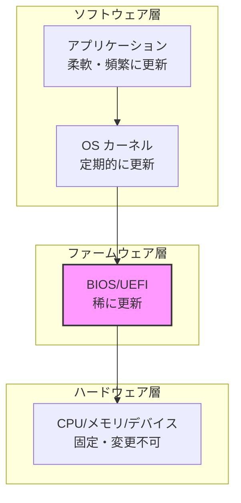
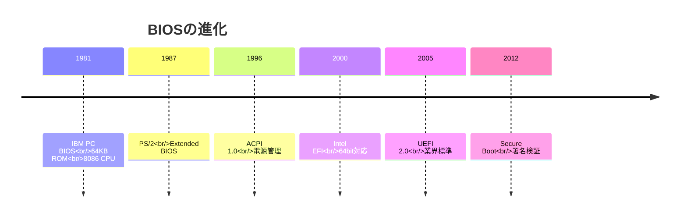
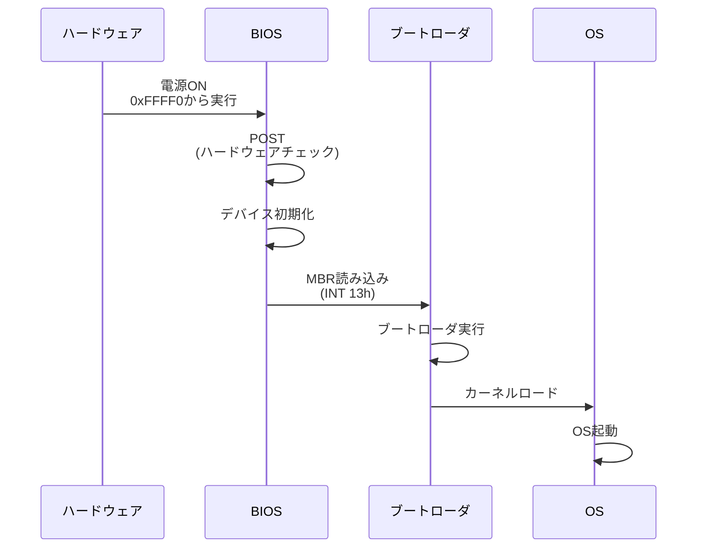
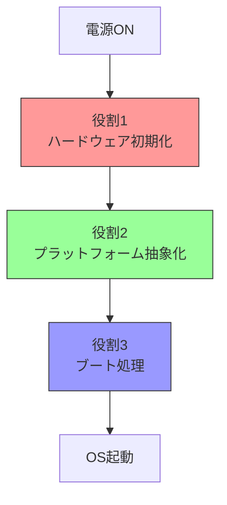
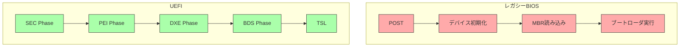
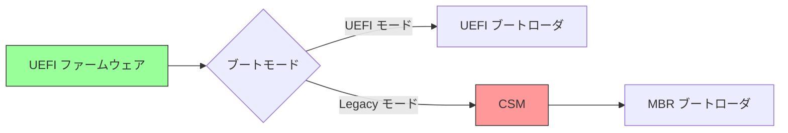

# BIOS/UEFIとは何か：歴史と役割

🎯 **この章で学ぶこと**
- BIOSの歴史的経緯と設計上の制約
- UEFIが開発された理由と目的
- BIOS/UEFIが果たす役割
- レガシーBIOSとUEFIの根本的な違い

📚 **前提知識**
- コンピュータの基本構成（CPU、メモリ、ストレージ）
- プログラムの実行プロセスの概要

---

## ファームウェアとは何か

### ソフトウェアとハードウェアの間

ファームウェア (Firmware) という言葉は、「固い (Firm)」という語源が示すように、ハードウェアとソフトウェアの中間的な性質を持つソフトウェアを指します。一般的なアプリケーションソフトウェアは頻繁に更新され、柔軟に機能を変更できます。一方、ハードウェアは物理的に固定されており、基本的に変更することはできません。ファームウェアは、この両者の中間に位置し、ハードウェアに密接に結びついているため更新頻度は低いものの、ソフトウェアであるため原理的には書き換え可能です。

コンピュータシステムにおいて、ファームウェアは最も下位の層に位置します。アプリケーションはオペレーティングシステム (OS) の上で動作し、OS はファームウェアが提供する機能を使ってハードウェアを制御します。ファームウェアは、ハードウェアを直接操作できる唯一のソフトウェア層であり、システム全体の基盤となっています。この階層構造により、上位の層は下位の層の詳細を知らなくても動作できるようになっています。

**補足図**: 以下の図は、ファームウェアがシステムのどの層に位置するかを示したものです。

ファームウェアには、いくつかの重要な特徴があります。第一に、ファームウェアは電源投入直後から動作を開始します。OS が起動する前の段階で、ファームウェアがハードウェアを直接制御し、システムを使用可能な状態にします。この段階では、まだ OS が存在しないため、ファームウェアがすべての責任を担います。

第二に、ファームウェアはハードウェアに深く結びついています。プラットフォーム固有の処理を実装し、特定のハードウェア構成に合わせた初期化を行います。例えば、特定のチップセットの設定や、メモリコントローラの初期化など、ハードウェアの詳細な知識が必要な処理を担当します。

第三に、ファームウェアの変更は困難です。更新には特別な手順が必要であり、失敗するとシステムが起動不能になるリスクがあります。そのため、ファームウェアの更新は慎重に行われ、通常は重大な不具合の修正やセキュリティパッチの適用時のみ実施されます。

## BIOSの歴史

### 誕生：IBM PC (1981年)

BIOS (Basic Input/Output System) は、1981年に IBM PC とともに誕生しました。当時、パーソナルコンピュータはまだ黎明期にあり、各メーカーが独自のハードウェアアーキテクチャを採用していました。IBM は、自社の PC に搭載するファームウェアとして BIOS を開発し、これが後の業界標準となる基礎を築きました。初期の BIOS は 64KB の ROM に格納され、8086 CPU で動作するシンプルなものでした。

BIOS は、その後約 40 年にわたって進化を続けてきました。1987年には IBM PS/2 とともに拡張 BIOS が登場し、より多くの機能が追加されました。1996年には ACPI 1.0 仕様が策定され、電源管理機能が標準化されました。そして 2000年、Intel が Itanium プロセッサ向けに EFI を開発したことで、BIOS の次世代への道が開かれました。2005年には UEFI 2.0 が業界標準として確立され、2012年には Secure Boot 機能が普及し、ブートプロセスのセキュリティが大幅に強化されました。

**補足図**: 以下のタイムラインは、BIOS から UEFI への進化の歴史を示したものです。

---

## 💡 コラム: IBM PC BIOSの誕生秘話と互換機革命

**🕰️ 歴史的エピソード**

1981年8月12日、IBM は IBM Personal Computer Model 5150（通称 IBM PC）を発表しました。このコンピュータに搭載された BIOS は、わずか 8KB のコードでしたが、後のパーソナルコンピュータ業界全体を形作る基盤となります。IBM PC の開発は、当時としては異例のスピードで進められ、わずか1年で完成しました。IBM は従来の「すべてを自社開発する」方針を転換し、Intel 8088 CPU、Microsoft の DOS など、外部企業の技術を積極的に採用するオープンアーキテクチャ戦略を取りました。しかし、この戦略には大きなリスクがありました。ハードウェア仕様が公開されれば、他社が互換機を作ることが容易になるからです。

IBM が唯一秘密にしたのが、BIOS のコードでした。BIOS は IBM 独自の著作物であり、法的に保護されていました。他社が IBM PC 互換機を作るには、BIOS を独自に実装する必要がありました。ここで伝説となったのが、**Compaq Computer** による「リバースエンジニアリング」です。1982年、Compaq は IBM PC の完全互換機「Compaq Portable」を開発しました。Compaq は、IBM BIOS のコードを直接コピーするのではなく、BIOS の入出力動作を観察し、同じ動作をする独自の BIOS を一から書き起こしました。この手法により、Compaq は著作権侵害を回避しつつ、IBM PC と完全に互換性のあるコンピュータを製造することに成功しました。

さらに重要だったのが、**Phoenix Technologies** と **Award Software** による「クリーンルーム実装」です。クリーンルーム実装とは、2つのチームに分けて開発を行う手法です。第1チームは IBM BIOS の動作を詳細に分析し、機能仕様書を作成します。第2チームは、IBM BIOS を一切見ずに、仕様書のみに基づいて BIOS を実装します。この手法により、著作権侵害の疑いを完全に排除できます。Phoenix と Award は、この手法で開発した BIOS を他の PC メーカーにライセンス販売し、IBM 互換機市場の急成長を支えました。1980年代後半には、Dell、Gateway、AST など、数十社の IBM 互換機メーカーが市場に参入しました。

IBM PC BIOS には、もう一つの有名なエピソードがあります。それが **Ctrl+Alt+Delete** の発明です。IBM の開発者 David Bradley 氏は、開発中に頻繁に発生するシステムハングアップを解決するため、この3つのキーの同時押しでシステムをリセットする機能を実装しました。当初は開発者の便利機能に過ぎませんでしたが、製品版にもそのまま残され、やがて Windows のログイン画面で使われる標準機能となりました。Bradley 氏は後のインタビューで「私が発明したが、有名にしたのは Bill Gates だ」と冗談めかして語っています。

IBM のオープンアーキテクチャ戦略は、結果的に IBM 自身のシェアを失わせることになりました。互換機メーカーは、IBM よりも安価で高性能な PC を次々と投入し、1990年代には IBM の PC 市場シェアは急速に低下しました。しかし、この戦略は業界全体にとっては大きな成功でした。標準化されたアーキテクチャにより、ソフトウェア開発者は単一のプラットフォーム向けに開発すれば、すべての互換機で動作するソフトウェアを提供できるようになりました。これが PC 市場の爆発的成長を生み、Microsoft Windows や Intel プロセッサの成功につながりました。

BIOS の互換性は、40年以上経った現代でも維持されています。現代の UEFI ファームウェアも、CSM（Compatibility Support Module）を通じて、レガシー BIOS モードをエミュレートできます。これにより、1980年代に開発された MS-DOS アプリケーションが、2020年代の最新 PC でも（理論上は）動作します。この驚異的な互換性の維持は、x86 アーキテクチャの強みであり、同時に複雑性の源泉でもあります。

本章で学ぶ BIOS の「設計上の制約」は、まさにこの1981年の IBM PC BIOS の設計判断に由来しています。16bit リアルモード、1MB メモリ空間、MBR の 512 バイト制限といった制約は、すべて当時のハードウェア環境に最適化された結果です。しかし、これらの制約が40年後まで引き継がれることになるとは、当時の開発者も予想していなかったでしょう。歴史を知ることで、「なぜ現代のファームウェアはこんなに複雑なのか」という疑問が、「互換性を維持するためだったのか」という理解に変わります。

**📚 参考資料**
- David Bradley, ["The Inventor of Ctrl+Alt+Delete"](https://www.youtube.com/watch?v=K_lg7w8gAXQ) - インタビュー動画
- "Fire in the Valley" (Paul Freiberger & Michael Swaine) - PC 革命の歴史
- ["How Compaq Cloned the IBM PC"](https://www.pcworld.com/article/2025446/how-compaq-clone-ibm-pc.html) - PC World 記事

---

### 設計上の制約

IBM PC BIOS は、1981年当時のハードウェア環境に合わせて設計されました。当時の CPU である 8086 は 16bit プロセッサであり、BIOS もこのアーキテクチャに最適化されていました。しかし、この設計は後の時代において大きな制約となりました。BIOS は 16bit リアルモードで動作するため、1MB のメモリ空間しか扱えません。現代のシステムが数十 GB から数百 GB のメモリを搭載することを考えると、これは極めて厳しい制限です。

ディスクアクセスにも制約がありました。BIOS は INT 13h という割り込みベクタを使ってディスクにアクセスしますが、これは CHS (Cylinder-Head-Sector) アドレッシングを使用しており、大容量ディスクへの対応が困難でした。また、拡張カードの初期化に使われる Option ROM にもサイズ制限があり、複雑なドライバを格納することができませんでした。さらに、パーティション管理に使われる MBR (Master Boot Record) は、2TB 以上のディスクをサポートできないという根本的な制限を抱えていました。

**参考表**: 以下の表は、レガシー BIOS の主要な制約とその影響をまとめたものです。

| 制約 | 内容 | 影響 |
|------|------|------|
| 16bit リアルモード | 8086 CPU のモード | 1MB メモリ空間のみ |
| INT 13h | ディスクアクセス | CHS アドレッシング限界 |
| Option ROM | 拡張カードの初期化 | サイズ制限あり |
| MBR | パーティション管理 | 2TB ディスク制限 |

### レガシーBIOSの動作

レガシー BIOS の動作プロセスは、電源投入から OS 起動まで、いくつかの段階を経て進行します。まず、コンピュータの電源がオンになると、CPU はリセットベクタと呼ばれる固定アドレス (0xFFFF0) から実行を開始します。このアドレスには BIOS のコードが配置されており、BIOS が制御を得ます。BIOS は最初に POST (Power-On Self Test) と呼ばれるハードウェアチェックを実行し、CPU、メモリ、基本的なデバイスが正常に動作しているかを確認します。

POST が完了すると、BIOS はシステムに接続されているデバイスを初期化します。ストレージコントローラ、ビデオカード、キーボードなどの基本的なデバイスが使用可能な状態にされます。次に、BIOS は設定されたブート順序に従って、ブート可能なデバイスを探します。ブートデバイスが見つかると、BIOS は INT 13h 割り込みを使ってそのデバイスの先頭セクタ (MBR) を読み込み、メモリにロードします。そして、MBR に含まれるブートローダに制御を渡します。ブートローダは OS カーネルをメモリにロードし、OS が起動します。

**補足図**: 以下のシーケンス図は、レガシー BIOS のブートプロセスを示したものです。

### なぜレガシーBIOSは限界に達したか

レガシー BIOS が現代のシステムに適さなくなった理由は、複数の技術的制約にあります。最も根本的な問題は、アーキテクチャの制約です。BIOS は 16bit リアルモードで動作するため、1MB のメモリ空間しか扱うことができません。このメモリ空間は、割り込みベクタテーブル、BIOS データエリア、利用可能な RAM、ビデオメモリ、BIOS ROM などに細かく分割されています。例えば、0x00000 から 0x003FF は割り込みベクタテーブル、0x00400 から 0x004FF は BIOS データエリア、0x00500 から 0x9FFFF が利用可能な RAM、0xA0000 から 0xBFFFF がビデオメモリ、0xC0000 から 0xFFFFF が BIOS ROM と Option ROM に割り当てられています。現代のシステムでは、この空間は全く不足しており、初期化処理の複雑化に対応できません。

ディスク容量の限界も深刻な問題でした。MBR はパーティション情報を 4 エントリしか持てず、セクタアドレスが 32bit であるため 2TB 以上のディスクをサポートできません。また、ブートコードはわずか 446 バイトしか使えないため、複雑なブートローダを格納することが困難でした。これらの制限は、大容量ストレージが一般的となった現代では致命的な問題です。

拡張性の欠如も大きな問題でした。BIOS はモノリシックな設計であり、機能を追加するための明確なドライバモデルが存在しませんでした。ネットワークブートや USB ブートといった新しいブート方法への対応は、後付けの拡張として実装されましたが、統一的な仕組みがないため、実装はベンダーごとに異なり、互換性の問題を引き起こしました。

さらに、セキュリティの不在という致命的な欠陥がありました。BIOS にはブートローダを検証する機構がなく、悪意のあるコードが MBR に挿入されても、BIOS はそれを正当なブートローダとして実行してしまいます。これにより、ルートキットの挿入が容易であり、OS レベルでは検出が困難な攻撃が可能でした。

## UEFIの誕生

### Intel EFI (2000年)

Intel は、2000年に Itanium (IA-64) プロセッサ向けに EFI (Extensible Firmware Interface) を開発しました。Itanium は Intel が開発した 64bit サーバ向けプロセッサであり、従来の x86 アーキテクチャとは異なる全く新しい設計でした。しかし、レガシー BIOS は 16bit アーキテクチャを前提としており、64bit プロセッサを十分に活用することができませんでした。Intel は、この新しいプロセッサに相応しいファームウェアが必要だと判断し、EFI の開発に着手しました。

EFI 開発の動機は、単に 64bit 対応だけではありませんでした。大規模サーバ市場では、大容量メモリ、多数のデバイス、リモート管理といった要件が高まっていました。レガシー BIOS はこれらの要件を満たすことができず、新しいアーキテクチャが求められていました。Intel は、ドライバモデルとプロトコルベースのアーキテクチャを採用することで、拡張性の高いファームウェア環境を実現しました。EFI では、各デバイスが独立したドライバを持ち、標準化されたプロトコルを通じて通信することで、柔軟な拡張が可能になりました。

### UEFI 仕様の策定 (2005年)

Intel EFI は、当初 Itanium 専用の技術でしたが、その優れた設計は業界の注目を集めました。2005年、Intel は EFI を業界標準として普及させるため、仕様をオープンにし、UEFI (Unified Extensible Firmware Interface) として策定しました。UEFI Forum が設立され、Intel、AMD、Microsoft、Apple などの主要ベンダーが参加しました。この団体は、オープンな仕様策定プロセスを通じて、定期的に UEFI 仕様を改定し続けています。

UEFI 仕様は、その後も継続的に進化してきました。2006年の UEFI 2.0 で基本仕様が確立され、2007年の UEFI 2.1 でネットワークブート機能が追加されました。2009年の UEFI 2.3 ではセキュリティが強化され、2012年の UEFI 2.3.1 で Secure Boot 機能が正式に追加されました。Secure Boot は、ブートプロセスのセキュリティを大幅に向上させる重要な機能です。2017年の UEFI 2.7 では HTTP ブート機能が追加され、インターネット経由でのブートが可能になりました。そして、2022年には UEFI 2.10 が最新仕様として公開されています。

**参考表**: 以下の表は、UEFI 仕様の主要なマイルストーンを示したものです。

| バージョン | 年 | 主な追加機能 |
|-----------|-------|--------------|
| UEFI 2.0 | 2006 | 基本仕様確立 |
| UEFI 2.1 | 2007 | ネットワークブート |
| UEFI 2.3 | 2009 | セキュリティ強化 |
| UEFI 2.3.1 | 2012 | Secure Boot |
| UEFI 2.7 | 2017 | HTTP ブート |
| UEFI 2.10 | 2022 | 最新仕様 |

## BIOS/UEFIの役割

### 3つの主要な役割

BIOS や UEFI といったファームウェアは、システムにおいて3つの主要な役割を果たします。これらの役割は、電源投入から OS 起動までの一連のプロセスの中で、順次実行されます。第一の役割はハードウェア初期化であり、システムを使用可能な状態にします。第二の役割はプラットフォーム抽象化であり、ハードウェアの詳細を隠蔽して OS に統一的なインターフェースを提供します。第三の役割はブート処理であり、OS を起動するための準備とローダの実行を担当します。これらの役割は密接に連携し、システムの起動プロセス全体を支えています。

**補足図**: 以下の図は、ファームウェアの3つの主要な役割を示したものです。

### 役割1: ハードウェア初期化

ファームウェアの最初の役割は、ハードウェアを使用可能な状態にすることです。電源投入直後、システム内のハードウェアコンポーネントは未初期化の状態にあり、そのままでは動作できません。ファームウェアは、各コンポーネントを適切に設定し、動作可能な状態にします。

まず、CPU の初期化を行います。マイクロコードをロードして CPU の機能を最新の状態にし、キャッシュを設定して性能を最適化し、マルチコア CPU の場合は各コアを有効化します。次に、メモリの初期化を行います。DRAM トレーニングと呼ばれる手順で、メモリの動作パラメータを調整し、メモリマップを構築して OS がメモリを利用できるようにし、ECC (Error Correcting Code) を設定してメモリエラーを検出・訂正できるようにします。

さらに、チップセットの初期化も重要です。I/O コントローラを設定し、PCIe リンクトレーニングを行って高速なデバイス通信を可能にし、タイマーや割り込みコントローラを設定してシステムの基本的な機能を有効にします。最後に、各種デバイスの初期化を行います。ストレージコントローラ、ネットワークコントローラ、USB コントローラなどを設定し、OS がこれらのデバイスを利用できるようにします。

### 役割2: プラットフォーム抽象化

ファームウェアの第二の役割は、ハードウェアの詳細を隠蔽し、OS に統一的なインターフェースを提供することです。各ハードウェアベンダーは独自の実装を持っており、OS が直接これらの詳細を扱うのは困難です。ファームウェアは抽象化レイヤとして機能し、OS がハードウェアの違いを意識せずに動作できるようにします。

まず、標準化されたインターフェースを提供します。ディスクアクセス、グラフィックス出力、ネットワーク通信といった基本的な操作を、統一的な API を通じて実行できるようにします。これにより、OS は特定のハードウェアに依存せず、汎用的なコードで動作できます。

次に、設定情報を OS に提供します。ACPI テーブルを通じてハードウェア構成情報を伝え、SMBIOS テーブルを通じてシステム情報を提供し、ARM64 アーキテクチャではデバイスツリーを使ってハードウェア構成を記述します。これらの情報により、OS は動作環境を正しく認識できます。

さらに、ランタイムサービスを提供します。OS 起動後もファームウェアの一部機能は利用可能であり、NVRAM へのアクセス、時刻の取得、システムのリセットやシャットダウンといった操作を実行できます。これらのサービスは、OS がハードウェアを直接操作することなく、システム管理機能を利用できるようにします。

### 役割3: ブート処理

ファームウェアの第三の役割は、OS を起動することです。ハードウェアの初期化とプラットフォーム抽象化が完了すると、ファームウェアはブート処理を開始します。この処理は、ブートデバイスの選択、ブートローダの検索、ブートローダの実行、そして OS カーネルの起動という段階を経て進行します。

**補足図**: 以下の図は、ブート処理の流れを示したものです。

UEFI のブートプロセスは、EFI System Partition (ESP) と呼ばれる特別なパーティションを使用します。まず、ESP をマウントし、その中から `\EFI\BOOT\BOOTx64.EFI` というパスのブートローダを検索します。ブートローダが見つかると、それを実行します。ブートローダは、OS カーネルをメモリにロードし、制御を OS に渡します。これにより、OS の起動プロセスが開始されます。

## レガシーBIOSとUEFIの違い

### アーキテクチャの比較

レガシー BIOS と UEFI は、根本的に異なるアーキテクチャを持っています。レガシー BIOS は、POST、デバイス初期化、MBR 読み込み、ブートローダ実行という比較的シンプルな流れで動作します。一方、UEFI は、SEC (Security) Phase、PEI (Pre-EFI Initialization) Phase、DXE (Driver Execution Environment) Phase、BDS (Boot Device Selection) Phase、TSL (Transient System Load) という、より構造化された段階的なブートプロセスを持っています。この違いは、UEFI が複雑なシステムに対応するために、より洗練されたアーキテクチャを採用していることを示しています。

**補足図**: 以下の図は、レガシー BIOS と UEFI のアーキテクチャの違いを示したものです。

レガシー BIOS と UEFI の違いは、多岐にわたります。CPU モードの違いは特に重要です。レガシー BIOS は 16bit リアルモードで動作しますが、UEFI は 32bit または 64bit のプロテクトモード/ロングモードで動作します。これにより、UEFI はモダン CPU の機能を十分に活用できます。メモリ空間も大きく異なり、レガシー BIOS は 1MB に制限されますが、UEFI は理論上無制限のメモリにアクセスできます。

プログラミング言語の違いも開発効率に大きく影響します。レガシー BIOS はアセンブリ言語が主体ですが、UEFI は C 言語で開発できるため、開発効率が大幅に向上します。ディスクフォーマットも異なり、レガシー BIOS は MBR を使用して 2TB までしかサポートしませんが、UEFI は GPT を使用して理論上 9.4ZB までの大容量ディスクに対応します。

ブートローダのサイズ制限も解消されました。レガシー BIOS では MBR の 512 バイトに制限されますが、UEFI では EFI アプリケーションとして任意のサイズのブートローダを使用できます。ドライバモデルも、レガシー BIOS の制限のある Option ROM から、UEFI の拡張性の高い DXE ドライバへと進化しました。セキュリティ面では、レガシー BIOS には検証機構がありませんが、UEFI は Secure Boot や Measured Boot といったセキュリティ機能を提供します。

**参考表**: 以下の表は、レガシー BIOS と UEFI の主要な違いをまとめたものです。

| 項目 | レガシーBIOS | UEFI | 理由・背景 |
|------|-------------|------|-----------|
| **CPUモード** | 16bit リアルモード | 32/64bit プロテクト/ロングモード | モダンCPUの活用 |
| **メモリ空間** | 1MB (0x00000-0xFFFFF) | 理論上無制限 | 大容量メモリ対応 |
| **プログラミング言語** | アセンブリ主体 | C言語主体 | 開発効率向上 |
| **ディスク** | MBR (2TB制限) | GPT (9.4ZB) | 大容量ディスク対応 |
| **ブートローダ** | 512バイト (MBR) | EFI アプリケーション | 複雑な処理が可能 |
| **ドライバ** | Option ROM (制限あり) | DXE ドライバ | 拡張性 |
| **セキュリティ** | なし | Secure Boot, Measured Boot | セキュリティ要件 |
| **ネットワーク** | PXE (制限あり) | HTTP Boot, iSCSI | モダンなプロトコル |
| **GUI** | テキストモード | グラフィカル UI | ユーザビリティ |
| **仕様** | 事実上の標準 (IBM互換) | オープン仕様 (UEFI Forum) | 標準化 |

### 設計思想の違い

レガシー BIOS と UEFI は、設計思想においても大きく異なります。レガシー BIOS はモノリシックな設計を採用しており、すべての機能が一体化されています。ハードウェアへの直接アクセスを基本とし、互換性を最重視した設計となっています。これは、IBM PC 互換機という歴史的な経緯から来る特徴です。

一方、UEFI はモジュラーな設計を採用しています。各機能が独立したモジュールとして実装され、必要に応じて組み合わせることができます。抽象化レイヤを提供し、ハードウェアの詳細を隠蔽することで、拡張性を重視した設計となっています。この設計により、新しいハードウェアやプロトコルへの対応が容易になりました。

### 互換性

現代の UEFI 実装は、後方互換性のために CSM (Compatibility Support Module) を通じてレガシー BIOS モードもサポートしています。CSM は UEFI ファームウェアの一部として動作し、レガシー BIOS のエミュレーションを提供します。ブートモードとして UEFI モードが選択された場合は UEFI ブートローダが起動し、Legacy モードが選択された場合は CSM を経由して MBR ブートローダが起動します。

**補足図**: 以下の図は、UEFI の互換性サポートを示したものです。

ただし、CSM は段階的に廃止されつつあります。セキュリティ上の理由から、多くのベンダーが CSM を無効化または削除する方向に進んでおり、純粋な UEFI 環境への移行が加速しています。

## なぜUEFIへの移行が必要だったか

### 技術的要因

UEFI への移行は、複数の技術的要因によって推進されました。最も重要な要因は、ハードウェアの進化です。2000年代以降、64bit CPU が急速に普及しましたが、レガシー BIOS は 16bit アーキテクチャを前提としており、64bit CPU の性能を十分に引き出すことができませんでした。また、サーバやワークステーションでは数百 GB から TB 単位の大容量メモリが一般的となりましたが、レガシー BIOS の 1MB メモリ空間制限では、これらのメモリを初期化することすら困難でした。ストレージに関しても、数 TB から PB 単位の大容量ディスクが登場し、MBR の 2TB 制限は大きな障害となりました。

セキュリティ要件の高まりも、UEFI 移行の重要な要因でした。2000年代後半から、ブートキットやルートキットといった、ファームウェア層やブートプロセスを標的とする攻撃が増加しました。これらの攻撃は OS レベルでは検出が困難であり、システム全体を制御される危険性がありました。信頼できるブートプロセスを実現するためには、ブートローダを検証する機構が必要であり、UEFI の Secure Boot がこの要件を満たしました。

さらに、システムの複雑化も移行を後押ししました。多様なデバイス、ネットワークブート、リモート管理といった要件は、レガシー BIOS の単純なアーキテクチャでは対応が困難でした。UEFI のモジュラーな設計とプロトコルベースのアーキテクチャは、これらの複雑な要件に柔軟に対応できました。

### ビジネス要因

技術的要因に加えて、ビジネス要因も UEFI 移行を加速させました。最も影響力が大きかったのは、2012年の Windows 8 のリリースでした。Microsoft は、Windows 8 を搭載する PC に対して UEFI Secure Boot を必須としました。これにより、OEM メーカーは UEFI 対応を強制され、市場全体が UEFI へと移行しました。この決定は、セキュリティ向上を目的としたものでしたが、結果として UEFI の普及を決定づけました。

エンタープライズ市場の要件も重要でした。大規模サーバの管理では、リモートからのファームウェア更新、ネットワークブート、詳細なハードウェア情報の取得といった機能が求められます。また、セキュリティコンプライアンスの観点から、Measured Boot や TPM との統合といった機能も必要とされました。UEFI はこれらの要件を標準機能として提供し、エンタープライズ市場での採用が進みました。

さらに、エコシステムの成熟も移行を後押ししました。Linux や BSD といったオープンソース OS が UEFI をサポートし、GRUB2 や systemd-boot といった主要なブートローダが UEFI に対応しました。これにより、UEFI は特定の OS やベンダーに依存しない、真の業界標準として確立されました。

## まとめ

この章では、BIOS と UEFI の歴史、そしてファームウェアが果たす役割について詳しく説明しました。ファームウェアは、ハードウェアとソフトウェアの橋渡しという重要な役割を担っており、システムの最下層で動作します。電源投入直後から OS 起動までの全プロセスを制御し、システムを使用可能な状態にします。

レガシー BIOS は、1981年の IBM PC 以来、長年にわたって PC の標準ファームウェアとして機能してきました。しかし、16bit アーキテクチャ、1MB メモリ空間制限、2TB ディスク制限といった根本的な制約により、現代のハードウェアには適合しなくなりました。これに対して UEFI は、64bit 対応、理論上無制限のメモリ空間、大容量ディスクサポート、そしてセキュリティ機能を実現し、現代のシステム要件を満たしています。

BIOS や UEFI の主な役割は、ハードウェア初期化、プラットフォーム抽象化、そしてブート処理の3つです。これらの役割を通じて、ファームウェアは OS に統一的な実行環境を提供します。UEFI はモジュラーな設計思想を採用し、C 言語で開発できるため、開発効率と拡張性が大幅に向上しました。

ファームウェア技術の歴史を振り返ると、1981年の IBM PC BIOS に始まり、2000年の Intel EFI、2005年の UEFI 仕様策定、2012年の Secure Boot 普及を経て、現在では UEFI が業界標準として確立されています。この進化は、ハードウェアの進歩とセキュリティ要件の高まりに対応するための、必然的な流れでした。

次章では、ファームウェアを取り巻くエコシステム全体像を見ていきます。UEFI だけでなく、EDK II、coreboot といった実装や、関連する仕様、ツール、コミュニティについて理解を深めます。

---

📚 **参考資料**
- [UEFI Specification v2.10 - Section 2: Overview](https://uefi.org/specifications)
- [ACPI Specification v6.5](https://uefi.org/specifications)
- [Intel® Platform Innovation Framework for EFI](https://www.intel.com/content/www/us/en/architecture-and-technology/unified-extensible-firmware-interface/efi-homepage-general-technology.html)
- [History of BIOS - Wikipedia](https://en.wikipedia.org/wiki/BIOS)
