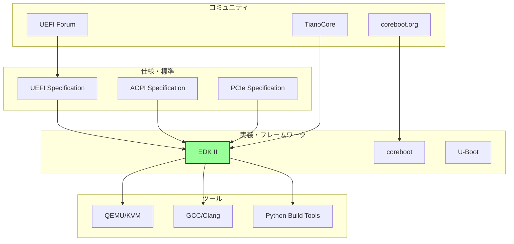
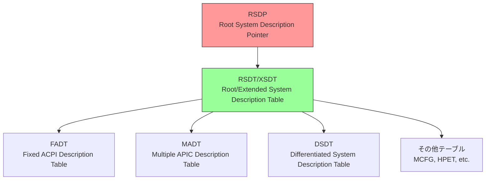
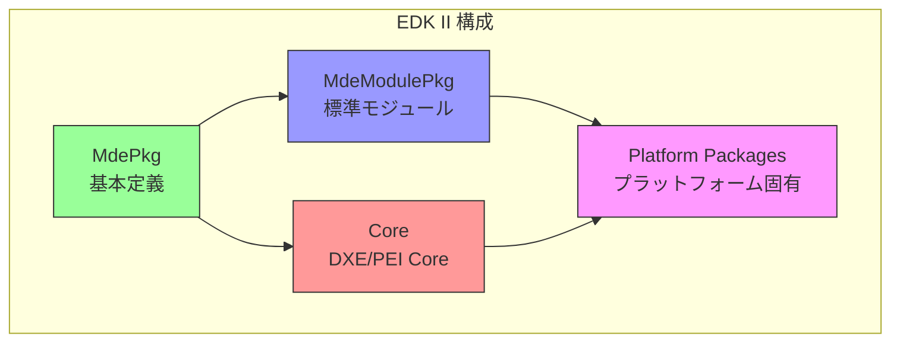
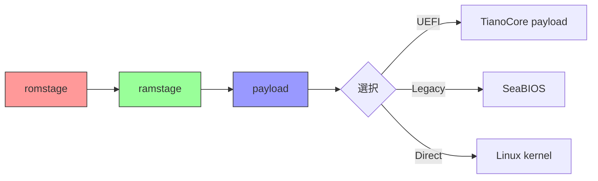
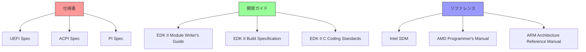
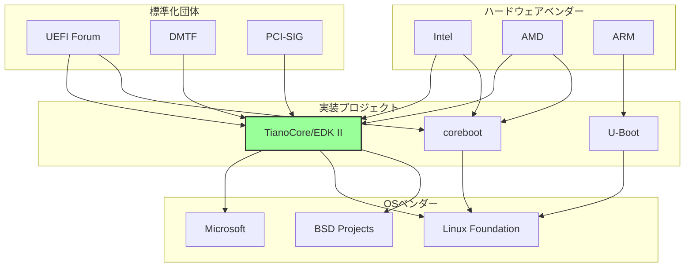
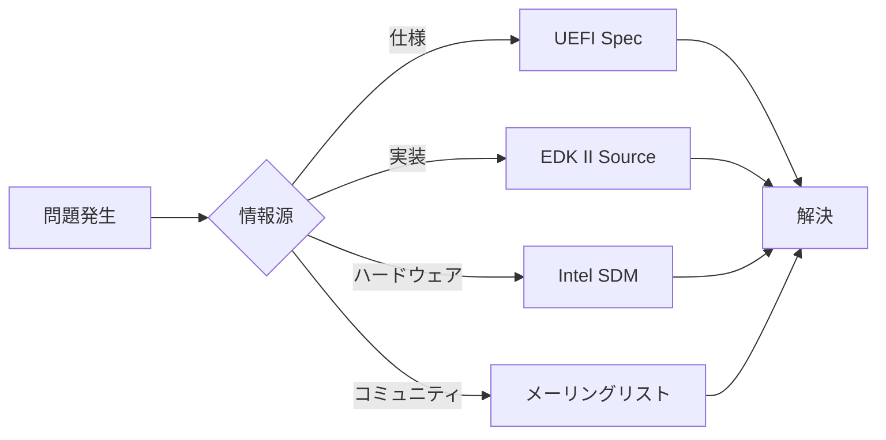

# ファームウェアエコシステム全体像

🎯 **この章で学ぶこと**
- ファームウェア開発のエコシステム全体像
- 主要な仕様書と標準規格
- 開発ツールとフレームワーク
- コミュニティとリソース

📚 **前提知識**
- BIOS/UEFIの基本概念（前章）
- オープンソースソフトウェアの基礎知識

---

## ファームウェアエコシステムとは

ファームウェア開発は、単独のコードベースを書くだけでは完結しません。仕様、実装、ツール、そしてコミュニティが複雑に連携し、大きなエコシステムを形成しています。このエコシステムを理解することは、効果的なファームウェア開発を行う上で不可欠です。仕様は、何を実装すべきかを定義し、実装フレームワークは、どのように実装するかを提供し、ツールは、開発とデバッグを支援し、コミュニティは、知識の共有と問題解決を促進します。

ファームウェアエコシステムは、複数の層から構成されています。最上位には、UEFI Specification、ACPI Specification、PCIe Specification といった仕様と標準規格があります。これらは、ファームウェアが準拠すべき技術的な要件を定義します。次の層には、EDK II、coreboot、U-Boot といった実装フレームワークがあり、仕様を実際のコードに落とし込むための基盤を提供します。さらに、QEMU/KVM、GCC/Clang、Python ビルドツールといった開発ツールが、これらのフレームワークを使った開発を支援します。そして、UEFI Forum、TianoCore、coreboot.org といったコミュニティが、エコシステム全体を推進し、サポートしています。

この章では、このエコシステムの全体像を俯瞰し、各構成要素がどのように連携しているかを理解します。それぞれの要素の役割を把握することで、ファームウェア開発における情報の入手方法や、問題解決のアプローチが明確になります。

**補足図**: 以下の図は、ファームウェアエコシステムの主要な構成要素と、それらの関係を示したものです。



## 主要な仕様と標準規格

### UEFI Specification

UEFI Specification は、UEFI Forum によって策定された、UEFI ファームウェアの中核となる仕様書です。最新版は v2.10 (2022年) であり、UEFI Forum の公式サイト (https://uefi.org/specifications) から入手できます。この仕様書は、UEFI のすべての側面を詳細に定義しており、ファームウェア開発者が準拠すべき技術的要件を明確にしています。

UEFI Specification の内容は多岐にわたります。まず、UEFI のブートプロセス全体の流れを定義し、各フェーズでの処理内容を規定しています。次に、プロトコルの定義があります。プロトコルは、UEFI における機能の抽象化単位であり、デバイスやサービスへのアクセス方法を標準化します。また、Boot Services と Runtime Services という2つの主要なサービス群を定義しています。Boot Services は OS 起動前に利用可能なサービスであり、Runtime Services は OS 起動後も利用可能なサービスです。さらに、ドライバモデルを規定し、デバイスドライバの実装方法を標準化しています。セキュリティ面では、Secure Boot の詳細な仕様が含まれています。

UEFI Specification は非常に大部な文書ですが、特に重要なセクションがあります。Section 2 は概要とアーキテクチャを説明しており、UEFI の全体像を理解する上で最も重要です。Section 3 から 6 は Boot Services を詳細に説明しており、メモリ管理、プロトコル操作、イベント処理などの基本機能が含まれます。Section 7 と 8 は Runtime Services とプロトコルを扱い、OS 起動後の動作を定義します。Section 27 は Secure Boot の仕様であり、セキュアなブートプロセスの実現に不可欠です。Section 32 はネットワークプロトコルを定義し、HTTP Boot などの高度な機能を説明しています。

**参考表**: 以下の表は、UEFI Specification の主要セクションをまとめたものです。

| セクション | 内容 | 重要度 |
|-----------|------|--------|
| Section 2 | 概要とアーキテクチャ | ★★★★★ |
| Section 3-6 | Boot Services | ★★★★☆ |
| Section 7-8 | Runtime Services, Protocol | ★★★★☆ |
| Section 27 | Secure Boot | ★★★★★ |
| Section 32 | Network Protocols | ★★★☆☆ |

### ACPI Specification

ACPI (Advanced Configuration and Power Interface) Specification も、UEFI Forum によって策定されています。最新版は v6.5 (2022年) であり、UEFI Specification と同じく UEFI Forum の公式サイトから入手できます。ACPI の主な目的は、ハードウェア構成を OS に伝えることです。ファームウェアは、システムのハードウェア構成を ACPI テーブルという形式で記述し、OS がこれを読み取ることで、ハードウェアの詳細を把握します。

ACPI Specification の内容は、ハードウェア抽象化、電源管理、デバイス列挙、そして ASL/AML (ACPI Source Language / ACPI Machine Language) といった分野をカバーしています。ハードウェア抽象化により、OS はハードウェアの違いを意識せずに動作できます。電源管理機能により、システムのスリープ、ハイバネーション、電源オフといった状態遷移を制御できます。デバイス列挙により、システムに接続されているデバイスの情報を OS に提供します。ASL/AML は、ACPI の記述言語であり、複雑なハードウェア構成を柔軟に表現できます。

ACPI は、複数のテーブルから構成されています。最上位には RSDP (Root System Description Pointer) があり、これが他のテーブルへのエントリポイントとなります。RSDP は RSDT または XSDT (Root/Extended System Description Table) を指し、これが他のすべてのテーブルへのポインタを保持します。主要なテーブルとしては、FADT (Fixed ACPI Description Table) があり、固定的なハードウェア情報を含みます。MADT (Multiple APIC Description Table) は、割り込みコントローラの構成を記述します。DSDT (Differentiated System Description Table) は、デバイス固有の情報を ASL/AML で記述したものです。その他にも、MCFG (PCI Express メモリマップ構成) や HPET (高精度イベントタイマー) といった多数のテーブルが存在します。

**補足図**: 以下の図は、ACPI テーブルの階層構造を示したものです。



### その他の重要な仕様

UEFI と ACPI 以外にも、ファームウェア開発に関わる重要な仕様がいくつかあります。PCIe (PCI Express) は、PCI-SIG によって策定された高速デバイスバスの仕様です。現代のシステムでは、ほとんどのデバイスが PCIe で接続されており、デバイスの列挙と設定に不可欠な仕様です。

SMBIOS は、DMTF (Distributed Management Task Force) によって策定されたシステム管理情報の仕様です。BIOS やマザーボードの製造情報、CPU やメモリの詳細といったハードウェアインベントリ情報を提供し、OS やシステム管理ツールがこれを利用します。

TCG (Trusted Computing Group) が策定する TPM (Trusted Platform Module) 仕様も重要です。TPM は、暗号化鍵の安全な保管や、Measured Boot によるシステムの完全性検証を実現するハードウェアモジュールです。セキュリティ機能の実装に不可欠な要素となっています。

USB 仕様は、USB-IF (USB Implementers Forum) によって策定されており、USB コントローラと周辺機器の動作を定義します。キーボード、マウス、ストレージといった多くのデバイスが USB で接続されるため、ファームウェアでの USB サポートは必須となっています。

## 実装とフレームワーク

### EDK II (EFI Development Kit II)

EDK II (EFI Development Kit II) は、UEFI 仕様の参照実装であり、業界標準のファームウェア開発フレームワークです。元々 Intel によって開発されましたが、現在は TianoCore プロジェクトとしてオープンソース化されています。ライセンスは BSD-2-Clause Plus Patent であり、商用利用も可能です。C 言語で記述されており、GitHub (https://github.com/tianocore/edk2) でホストされています。

EDK II の最大の特徴は、UEFI 仕様の参照実装であることです。UEFI Forum が策定した仕様を忠実に実装しており、他のファームウェア実装のベースとして広く利用されています。業界標準のフレームワークとして、Intel、AMD、ARM といった主要なハードウェアベンダーが採用しています。また、モジュラーな設計を採用しており、必要な機能だけを選択してビルドすることができます。

EDK II のアーキテクチャは、複数のパッケージから構成されています。Core パッケージには、DXE Core や PEI Core といったブートプロセスの中核となるコンポーネントが含まれます。MdePkg (Module Development Environment Package) は、UEFI と PI (Platform Initialization) の基本定義を提供し、すべてのモジュールがこれに依存します。MdeModulePkg は、USB、ネットワーク、ディスクといった標準ドライバ群を含みます。Platform Packages は、特定のプラットフォーム固有のコードを格納します。

**補足図**: 以下の図は、EDK II の構成を示したものです。



EDK II には、多数のパッケージが用意されています。MdePkg はすべてのモジュールが依存する基本定義を提供します。MdeModulePkg には、USB、ネットワーク、ディスクといった標準ドライバ群が含まれます。SecurityPkg は、Secure Boot や TPM といったセキュリティ機能を実装します。NetworkPkg は、HTTP Boot や iSCSI といったネットワークスタックを提供します。OvmfPkg (Open Virtual Machine Firmware Package) は、QEMU/KVM といった仮想環境向けのファームウェアであり、実機なしでの開発とテストを可能にします。

**参考表**: 以下の表は、EDK II の主なパッケージをまとめたものです。

| パッケージ | 内容 | 用途 |
|-----------|------|------|
| MdePkg | UEFI/PI 基本定義 | すべてのモジュールが依存 |
| MdeModulePkg | 標準ドライバ群 | USB, ネットワーク, ディスクなど |
| SecurityPkg | セキュリティ機能 | Secure Boot, TPM |
| NetworkPkg | ネットワークスタック | HTTP Boot, iSCSI |
| OvmfPkg | QEMU/KVM 向け | 仮想環境での開発 |

### coreboot

**開発**: coreboot コミュニティ
**ライセンス**: GPL v2
**言語**: C言語
**URL**: https://www.coreboot.org/

**特徴:**
- 軽量・高速
- モジュラーな設計
- ペイロード方式（UEFI, SeaBIOS, Linux）

**設計思想:**



### U-Boot

**開発**: DENX Software Engineering
**ライセンス**: GPL v2
**言語**: C言語
**用途**: 組込み、ARM、RISC-V

**特徴:**
- 組込みシステム向け
- 多様なアーキテクチャ対応
- EFI サポート

### その他の実装

**SlimBootloader (Intel)**
- 高速起動に特化
- モジュラーな構成

**Heads**
- セキュリティ重視
- Measured Boot

---

<div style="border: 2px solid #4a90e2; border-radius: 8px; padding: 20px; margin: 20px 0; background-color: #f8f9fa;">

## 💡 コラム: 3大BIOSベンダー - AMI vs Insyde vs Phoenix

**🏢 ベンダー固有の話**

PC を起動して表示される BIOS 設定画面には、「American Megatrends」「Insyde H2O」「Phoenix SecureCore」といったロゴが表示されます。これらは、世界の PC ファームウェア市場を支配する3大 BIOS ベンダーです。Dell、HP、Lenovo、ASUS、MSI といった OEM メーカーは、自社でファームウェアを一から開発するのではなく、これらのベンダーから BIOS を購入し、自社のハードウェアに合わせてカスタマイズします。この章で学んだ EDK II は、まさにこれらのベンダーが実際に使用している開発フレームワークです。それでは、3大ベンダーはどのように異なるのでしょうか。

**AMI (American Megatrends Inc.)** は、1985年に設立された最大手の BIOS ベンダーであり、世界市場シェアの約 40-50% を占めています。AMI の BIOS は「Aptio」というブランド名で提供されており、特にデスクトップ PC とマザーボード市場で圧倒的なシェアを持っています。ASUS、Gigabyte、MSI といった DIY 向けマザーボードメーカーのほとんどが AMI BIOS を採用しています。AMI の強みは、高い互換性と安定性です。膨大な数のハードウェア構成をテストし、あらゆる周辺機器との互換性を保証しています。また、豊富な設定項目を提供し、オーバークロックやファン制御といった高度なカスタマイズが可能です。技術的には、AMI は EDK II をベースに独自の拡張を加えた「Aptio V」という最新バージョンを提供しており、UEFI Specification への完全準拠を謳っています。

**Insyde Software** は、1998年に台湾で設立された、モバイルと組込み市場に強いベンダーです。世界市場シェアは約 30-35% であり、特にノート PC とウルトラブック市場で高いシェアを持っています。Dell XPS、HP Spectre、Lenovo ThinkPad といったプレミアムノート PC の多くが Insyde BIOS を採用しています。Insyde の BIOS は「H2O (Hardware-2-Operating System)」というブランド名であり、軽量で高速起動に最適化されていることが特徴です。モバイル機器では、起動時間とバッテリー寿命が重要な指標であり、Insyde はこれらを最適化するための独自技術を持っています。また、Insyde は Intel の参照デザイン（Reference Design）に準拠したファームウェアを提供することで、OEM メーカーが短期間で製品化できるよう支援しています。

**Phoenix Technologies** は、1979年に設立された最も歴史のある BIOS ベンダーであり、IBM 互換機革命の立役者です。前章のコラムで触れた「クリーンルーム実装」を行ったのが、まさに Phoenix です。現在の市場シェアは約 15-20% であり、主にサーバとエンタープライズ市場に特化しています。HP ProLiant サーバや Dell PowerEdge サーバの一部が Phoenix BIOS（SecureCore）を採用しています。Phoenix の強みは、セキュリティとエンタープライズ機能です。TPM 2.0、Secure Boot、Intel Boot Guard といった高度なセキュリティ機能を早期にサポートし、金融機関や政府機関といったセキュリティ重視の顧客に選ばれています。また、IPMI（Intelligent Platform Management Interface）や BMC（Baseboard Management Controller）といったサーバ管理機能の実装において、豊富な経験を持っています。

3社の技術的な違いは、実装の詳細とカスタマイズの方針にあります。AMI は、幅広いハードウェアサポートと豊富な設定項目を提供し、DIY ユーザーやオーバークロッカーに人気があります。BIOS 設定画面は詳細で、CPU 電圧やメモリタイミングといった低レベルの設定まで可能です。Insyde は、シンプルで洗練された UI と高速起動を重視し、一般消費者向けノート PC に最適化されています。BIOS 設定項目は最小限に絞られ、わかりやすいグラフィカル UI を提供します。Phoenix は、堅牢性とセキュリティを最優先し、エンタープライズ環境での長期運用を想定した設計を採用しています。ログ機能が充実しており、障害診断や監査が容易です。

すべてのベンダーは、EDK II を基盤として使用しています。しかし、EDK II はあくまで「参照実装」であり、実際の製品では各ベンダーが独自の拡張とカスタマイズを加えています。例えば、AMI は独自のユーザーインターフェース（Setup Browser）を実装し、Insyde は独自の電源管理（Power Management）を最適化し、Phoenix は独自のセキュリティモジュール（TrustCore）を統合しています。また、各ベンダーは Intel FSP（Firmware Support Package）や AMD AGESA を統合し、プラットフォーム固有の初期化を実装しています。この統合作業には、高度な技術力と膨大なテストが必要であり、これこそが BIOS ベンダーの付加価値です。

興味深いのは、近年のオープンソース化の動きです。Google Chromebook は coreboot を採用し、AMI や Insyde といった従来のベンダーを使用していません。これは、Chromebook が特定の OS（Chrome OS）のみをサポートすれば良く、汎用的な BIOS の豊富な機能が不要だからです。また、System76 や Purism といった一部の PC メーカーも、coreboot を採用したオープンソース BIOS を提供しています。しかし、大多数の OEM メーカーは、依然として AMI、Insyde、Phoenix といった商用 BIOS ベンダーに依存しています。その理由は、Windows の完全サポート、Secure Boot の実装、膨大なハードウェアテスト、そして法的責任の担保です。

ファームウェア開発者にとって、どのベンダーの BIOS を使用するかは、ターゲット市場によって決まります。デスクトップ PC やゲーミング PC を開発するなら AMI、プレミアムノート PC なら Insyde、サーバやワークステーションなら Phoenix が選択肢となります。また、完全にオープンソースで開発したい場合や、特定の OS のみをサポートする場合は、coreboot が選択肢となります。本書では主に EDK II を使用しますが、EDK II は AMI、Insyde、Phoenix すべての基盤となっているため、本書で学ぶ知識はどのベンダーの BIOS にも応用できます。

**参考表: 3大BIOSベンダーの比較**

| 項目 | AMI | Insyde | Phoenix |
|------|-----|--------|---------|
| **設立年** | 1985 | 1998 | 1979 |
| **市場シェア** | 40-50% | 30-35% | 15-20% |
| **主要市場** | デスクトップ、マザーボード | ノートPC、ウルトラブック | サーバ、エンタープライズ |
| **ブランド名** | Aptio V | H2O | SecureCore |
| **強み** | 互換性、豊富な設定 | 軽量、高速起動 | セキュリティ、堅牢性 |
| **主要顧客** | ASUS、Gigabyte、MSI | Dell、HP、Lenovo | HP ProLiant、Dell PowerEdge |
| **UI 特性** | 詳細・技術的 | シンプル・グラフィカル | 堅牢・ログ充実 |
| **EDK II使用** | あり（独自拡張） | あり（独自拡張） | あり（独自拡張） |

**📚 参考資料**
- [AMI Aptio](https://www.ami.com/aptio/) - AMI 公式サイト
- [Insyde H2O UEFI BIOS](https://www.insyde.com/) - Insyde 公式サイト
- [Phoenix SecureCore](https://www.phoenix.com/) - Phoenix Technologies 公式サイト
- "The BIOS Companion" (Phil Croucher) - BIOS ベンダーの歴史と技術

</div>

---

## 開発ツールとエミュレータ

### QEMU/KVM

**用途**: x86_64 仮想化
**URL**: https://www.qemu.org/

**OVMF との組み合わせ:**

```bash
# UEFI ファームウェアで起動
qemu-system-x86_64 \
  -bios /usr/share/ovmf/OVMF.fd \
  -hda disk.img
```

**メリット:**
- 高速な試行錯誤
- デバッグ容易
- 実機を壊すリスクなし

### コンパイラとビルドツール

**GCC / Clang**
- C言語コンパイラ
- EDK II は GCC 5+ を推奨

**Python**
- ビルドスクリプト
- 設定ファイル生成

**NASM / YASM**
- アセンブラ
- 初期起動コード

### デバッグツール

**GDB**
- QEMU と組み合わせてステップ実行
- シンボル情報付きデバッグ

**シリアルコンソール**
- ログ出力
- 実機デバッグに必須

**JTAG/SWD**
- ハードウェアデバッガ
- 実機での低レベルデバッグ

## コミュニティとリソース

### UEFI Forum

**URL**: https://uefi.org/

**役割:**
- UEFI/ACPI 仕様の策定
- 業界標準の推進
- ワーキンググループの運営

**メンバー:**
- AMD, Intel, ARM, Microsoft, Apple など主要ベンダー
- 300以上の企業・組織

### TianoCore

**URL**: https://www.tianocore.org/
**GitHub**: https://github.com/tianocore

**役割:**
- EDK II の開発・保守
- コミュニティサポート

**リソース:**
- メーリングリスト: https://edk2.groups.io/
- Wiki: https://github.com/tianocore/tianocore.github.io/wiki
- バグトラッカー: https://bugzilla.tianocore.org/

### coreboot コミュニティ

**URL**: https://www.coreboot.org/

**リソース:**
- IRC: #coreboot @ libera.chat
- メーリングリスト
- ドキュメント: https://doc.coreboot.org/

### その他のコミュニティ

**LKML (Linux Kernel Mailing List)**
- カーネル側のブート処理

**OSdev.org**
- OS開発者向けフォーラム
- UEFI/BIOS の質問も活発

## ドキュメントとリソース

### 公式ドキュメント



### 推奨される学習リソース

**書籍:**
- "Beyond BIOS: Developing with the Unified Extensible Firmware Interface" (Intel Press)
- "Harnessing the UEFI Shell" (Intel Press)

**オンラインコース:**
- Intel の UEFI トレーニング資料
- coreboot の Documentation

**ブログ・記事:**
- TianoCore ブログ
- OSDev Wiki

## エコシステムの関係図



## なぜエコシステムの理解が重要か

### 相互依存性

ファームウェア開発は、以下の要素が複雑に絡み合います：

1. **仕様への準拠**
   - UEFI仕様に従った実装
   - ACPIテーブルの正確な生成

2. **ハードウェアとの協調**
   - チップセット固有の初期化
   - ベンダー提供のFSP/AGESA

3. **OS との互換性**
   - ブートローダの期待する動作
   - ランタイムサービスの提供

### 情報源の多様性

問題解決には、複数の情報源を参照する必要があります：



## まとめ

この章では、ファームウェアエコシステムの全体像を説明しました。ファームウェア開発は、単独のコードベースだけでなく、仕様、実装、ツール、コミュニティという4つの要素が統合されたエコシステムの中で行われます。これらの要素は相互に依存し、互いに影響を与えながら進化しています。

エコシステムの中核となるのは、UEFI Specification と ACPI Specification という2つの主要な仕様です。UEFI Specification は、ファームウェアのアーキテクチャ、プロトコル、サービスを定義し、ACPI Specification は、ハードウェア構成を OS に伝える方法を規定します。これらの仕様に準拠することで、異なるベンダーのファームウェアと OS が相互運用できるようになります。

実装フレームワークとしては、EDK II が業界標準となっています。UEFI 仕様の参照実装であり、モジュラーな設計により、様々なプラットフォームに対応できます。coreboot や U-Boot といった代替実装も存在し、それぞれ異なる設計思想と用途を持っています。開発とテストには、QEMU/OVMF といった仮想環境が広く利用され、実機なしでの開発を可能にしています。GCC や GDB といった標準的な開発ツールも、ファームウェア開発において重要な役割を果たします。

エコシステム全体を推進しているのは、TianoCore や UEFI Forum といったコミュニティです。TianoCore は EDK II の開発とサポートを行い、UEFI Forum は仕様の策定と業界標準の推進を担当しています。これらのコミュニティを通じて、開発者は知識を共有し、問題を解決し、技術の進化に貢献しています。

**参考表**: 以下の表は、エコシステムの構成要素をまとめたものです。

| 要素 | 主要なもの | 役割 |
|------|----------|------|
| 仕様 | UEFI, ACPI, PCIe | 標準化 |
| 実装 | EDK II, coreboot | コードベース |
| ツール | QEMU, GCC, GDB | 開発環境 |
| コミュニティ | TianoCore, UEFI Forum | サポート・推進 |

次章では、実際の学習環境の構築について説明します。QEMU や EDK II のセットアップ方法、そして各ツールがエコシステムの中でどのような位置づけにあるかを、具体的に見ていきます。

---

📚 **参考資料**
- [UEFI Forum](https://uefi.org/)
- [TianoCore](https://www.tianocore.org/)
- [EDK II GitHub](https://github.com/tianocore/edk2)
- [coreboot Documentation](https://doc.coreboot.org/)
- [QEMU Documentation](https://www.qemu.org/documentation/)
