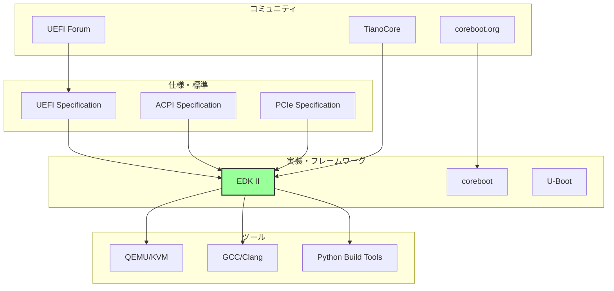
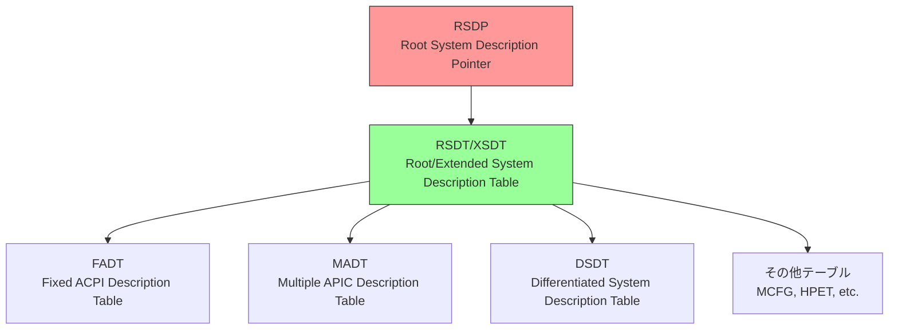
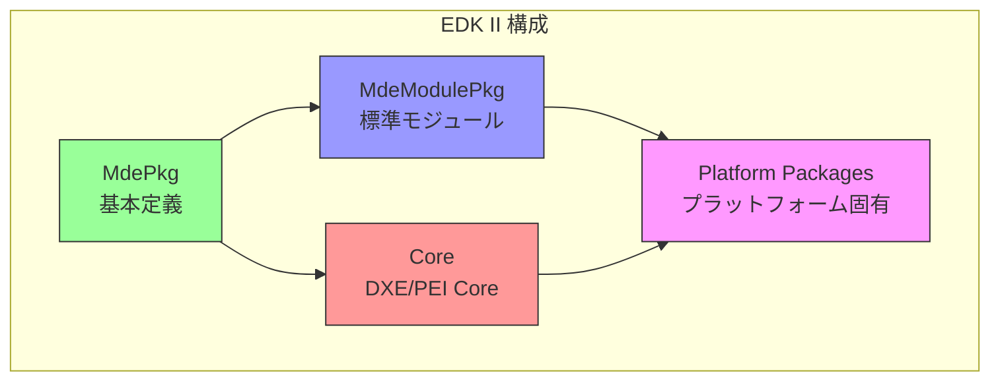
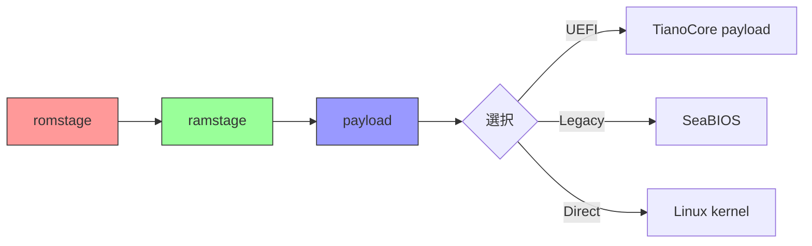
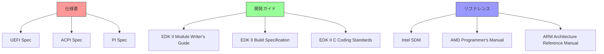
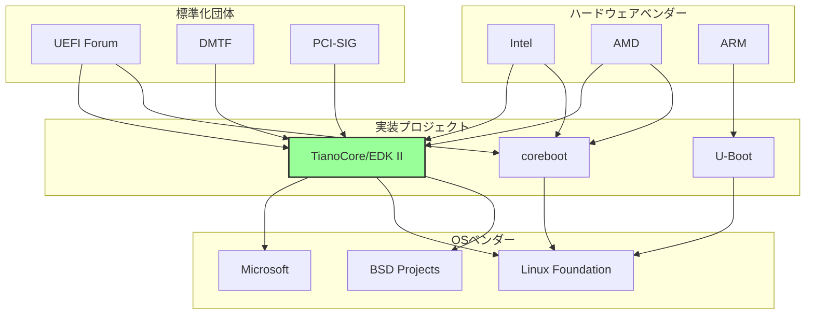
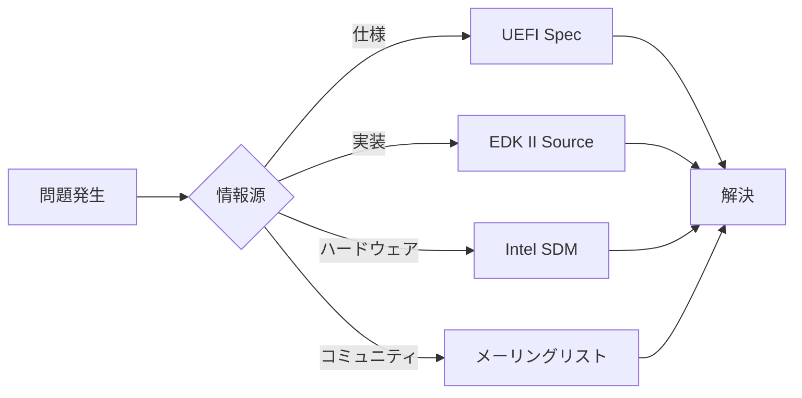

# ファームウェアエコシステム全体像

🎯 **この章で学ぶこと**
- ファームウェア開発のエコシステム全体像
- 主要な仕様書と標準規格
- 開発ツールとフレームワーク
- コミュニティとリソース

📚 **前提知識**
- BIOS/UEFIの基本概念（前章）
- オープンソースソフトウェアの基礎知識

---

## ファームウェアエコシステムとは

ファームウェア開発は、単独のコードベースだけでなく、**仕様、ツール、コミュニティ**が連携する大きなエコシステムの中で行われます。



この章では、このエコシステムの全体像を俯瞰します。

## 主要な仕様と標準規格

### UEFI Specification

**策定**: UEFI Forum
**最新版**: v2.10 (2022年)
**URL**: https://uefi.org/specifications

**内容:**
- UEFI のブートプロセス
- プロトコル定義
- サービス定義（Boot Services, Runtime Services）
- ドライバモデル
- セキュリティ（Secure Boot）

**主要セクション:**

| セクション | 内容 | 重要度 |
|-----------|------|--------|
| Section 2 | 概要とアーキテクチャ | ★★★★★ |
| Section 3-6 | Boot Services | ★★★★☆ |
| Section 7-8 | Runtime Services, Protocol | ★★★★☆ |
| Section 27 | Secure Boot | ★★★★★ |
| Section 32 | Network Protocols | ★★★☆☆ |

### ACPI Specification

**策定**: UEFI Forum
**最新版**: v6.5 (2022年)
**URL**: https://uefi.org/specifications

**目的**: ハードウェア構成をOSに伝える

**内容:**
- ハードウェア抽象化
- 電源管理
- デバイス列挙
- ASL/AML (ACPI Source/Machine Language)

**主要テーブル:**



### その他の重要な仕様

**PCIe (PCI Express)**
- **策定**: PCI-SIG
- **内容**: 高速デバイスバスの仕様
- **重要性**: デバイス列挙と設定に必須

**SMBIOS**
- **策定**: DMTF
- **内容**: システム管理情報
- **用途**: ハードウェアインベントリ

**TCG (Trusted Computing Group)**
- **内容**: TPM仕様
- **用途**: セキュリティ、Measured Boot

**USB**
- **策定**: USB-IF
- **内容**: USBコントローラと周辺機器

## 実装とフレームワーク

### EDK II (EFI Development Kit II)

**開発**: Intel → TianoCore (オープンソース化)
**ライセンス**: BSD-2-Clause Plus Patent
**言語**: C言語
**URL**: https://github.com/tianocore/edk2

**特徴:**
- UEFI仕様の参照実装
- 業界標準のフレームワーク
- モジュラーな設計

**アーキテクチャ:**



**主なパッケージ:**

| パッケージ | 内容 | 用途 |
|-----------|------|------|
| MdePkg | UEFI/PI 基本定義 | すべてのモジュールが依存 |
| MdeModulePkg | 標準ドライバ群 | USB, ネットワーク, ディスクなど |
| SecurityPkg | セキュリティ機能 | Secure Boot, TPM |
| NetworkPkg | ネットワークスタック | HTTP Boot, iSCSI |
| OvmfPkg | QEMU/KVM 向け | 仮想環境での開発 |

### coreboot

**開発**: coreboot コミュニティ
**ライセンス**: GPL v2
**言語**: C言語
**URL**: https://www.coreboot.org/

**特徴:**
- 軽量・高速
- モジュラーな設計
- ペイロード方式（UEFI, SeaBIOS, Linux）

**設計思想:**



### U-Boot

**開発**: DENX Software Engineering
**ライセンス**: GPL v2
**言語**: C言語
**用途**: 組込み、ARM、RISC-V

**特徴:**
- 組込みシステム向け
- 多様なアーキテクチャ対応
- EFI サポート

### その他の実装

**SlimBootloader (Intel)**
- 高速起動に特化
- モジュラーな構成

**Heads**
- セキュリティ重視
- Measured Boot

## 開発ツールとエミュレータ

### QEMU/KVM

**用途**: x86_64 仮想化
**URL**: https://www.qemu.org/

**OVMF との組み合わせ:**

```bash
# UEFI ファームウェアで起動
qemu-system-x86_64 \
  -bios /usr/share/ovmf/OVMF.fd \
  -hda disk.img
```

**メリット:**
- 高速な試行錯誤
- デバッグ容易
- 実機を壊すリスクなし

### コンパイラとビルドツール

**GCC / Clang**
- C言語コンパイラ
- EDK II は GCC 5+ を推奨

**Python**
- ビルドスクリプト
- 設定ファイル生成

**NASM / YASM**
- アセンブラ
- 初期起動コード

### デバッグツール

**GDB**
- QEMU と組み合わせてステップ実行
- シンボル情報付きデバッグ

**シリアルコンソール**
- ログ出力
- 実機デバッグに必須

**JTAG/SWD**
- ハードウェアデバッガ
- 実機での低レベルデバッグ

## コミュニティとリソース

### UEFI Forum

**URL**: https://uefi.org/

**役割:**
- UEFI/ACPI 仕様の策定
- 業界標準の推進
- ワーキンググループの運営

**メンバー:**
- AMD, Intel, ARM, Microsoft, Apple など主要ベンダー
- 300以上の企業・組織

### TianoCore

**URL**: https://www.tianocore.org/
**GitHub**: https://github.com/tianocore

**役割:**
- EDK II の開発・保守
- コミュニティサポート

**リソース:**
- メーリングリスト: https://edk2.groups.io/
- Wiki: https://github.com/tianocore/tianocore.github.io/wiki
- バグトラッカー: https://bugzilla.tianocore.org/

### coreboot コミュニティ

**URL**: https://www.coreboot.org/

**リソース:**
- IRC: #coreboot @ libera.chat
- メーリングリスト
- ドキュメント: https://doc.coreboot.org/

### その他のコミュニティ

**LKML (Linux Kernel Mailing List)**
- カーネル側のブート処理

**OSdev.org**
- OS開発者向けフォーラム
- UEFI/BIOS の質問も活発

## ドキュメントとリソース

### 公式ドキュメント



### 推奨される学習リソース

**書籍:**
- "Beyond BIOS: Developing with the Unified Extensible Firmware Interface" (Intel Press)
- "Harnessing the UEFI Shell" (Intel Press)

**オンラインコース:**
- Intel の UEFI トレーニング資料
- coreboot の Documentation

**ブログ・記事:**
- TianoCore ブログ
- OSDev Wiki

## エコシステムの関係図



## なぜエコシステムの理解が重要か

### 相互依存性

ファームウェア開発は、以下の要素が複雑に絡み合います：

1. **仕様への準拠**
   - UEFI仕様に従った実装
   - ACPIテーブルの正確な生成

2. **ハードウェアとの協調**
   - チップセット固有の初期化
   - ベンダー提供のFSP/AGESA

3. **OS との互換性**
   - ブートローダの期待する動作
   - ランタイムサービスの提供

### 情報源の多様性

問題解決には、複数の情報源を参照する必要があります：



## まとめ

この章では、ファームウェアエコシステム全体像を説明しました。

**重要なポイント:**

- ファームウェア開発は**仕様、実装、ツール、コミュニティ**の統合
- **UEFI Specification** と **ACPI Specification** が中核
- **EDK II** が業界標準の実装フレームワーク
- **QEMU/OVMF** で開発・テストを行う
- **TianoCore** と **UEFI Forum** がエコシステムを推進

**エコシステムの構成要素:**

| 要素 | 主要なもの | 役割 |
|------|----------|------|
| 仕様 | UEFI, ACPI, PCIe | 標準化 |
| 実装 | EDK II, coreboot | コードベース |
| ツール | QEMU, GCC, GDB | 開発環境 |
| コミュニティ | TianoCore, UEFI Forum | サポート・推進 |

---

**次章では、学習環境の概要とツールの位置づけを見ていきます。**

📚 **参考資料**
- [UEFI Forum](https://uefi.org/)
- [TianoCore](https://www.tianocore.org/)
- [EDK II GitHub](https://github.com/tianocore/edk2)
- [coreboot Documentation](https://doc.coreboot.org/)
- [QEMU Documentation](https://www.qemu.org/documentation/)
