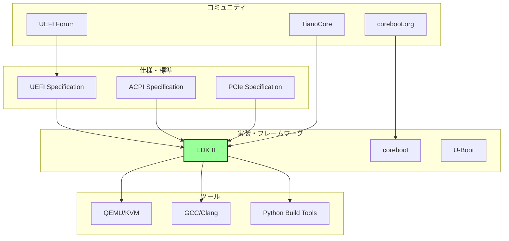
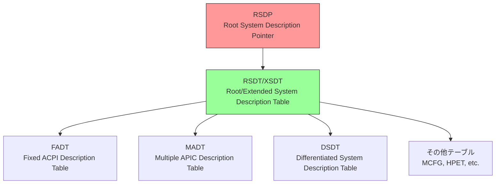
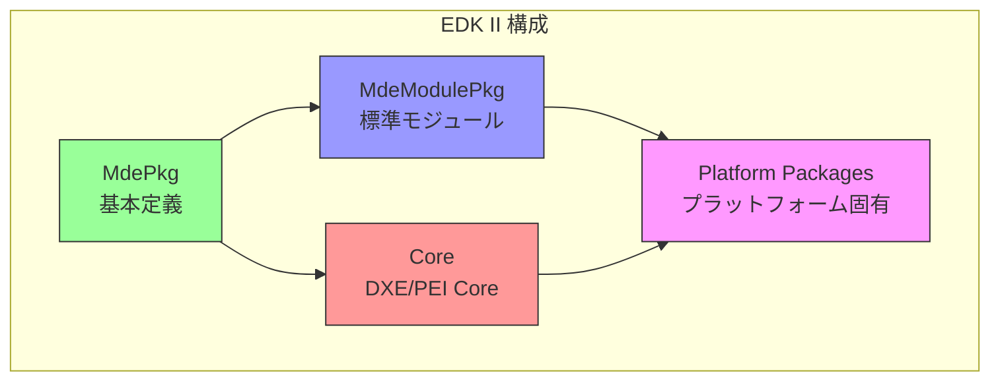
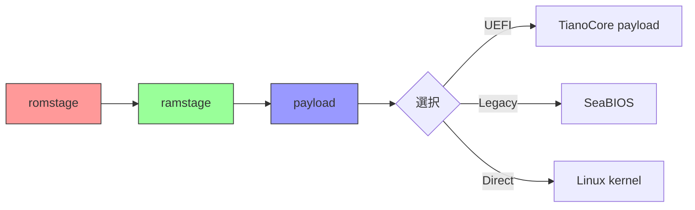
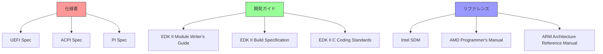
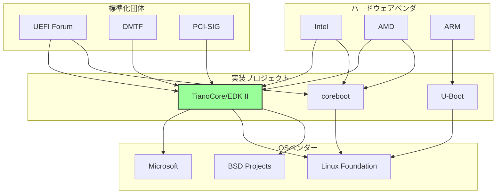
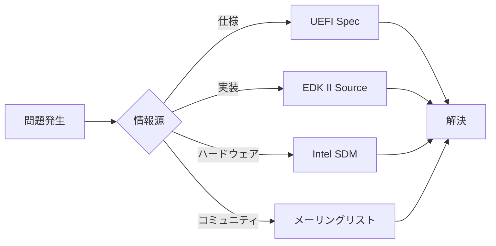

# ファームウェアエコシステム全体像

🎯 **この章で学ぶこと**
- ファームウェア開発のエコシステム全体像
- 主要な仕様書と標準規格
- 開発ツールとフレームワーク
- コミュニティとリソース

📚 **前提知識**
- BIOS/UEFIの基本概念（前章）
- オープンソースソフトウェアの基礎知識

---

## ファームウェアエコシステムとは

ファームウェア開発は、単独のコードベースを書くだけでは完結しません。仕様、実装、ツール、そしてコミュニティが複雑に連携し、大きなエコシステムを形成しています。このエコシステムを理解することは、効果的なファームウェア開発を行う上で不可欠です。仕様は、何を実装すべきかを定義し、実装フレームワークは、どのように実装するかを提供し、ツールは、開発とデバッグを支援し、コミュニティは、知識の共有と問題解決を促進します。

ファームウェアエコシステムは、複数の層から構成されています。最上位には、UEFI Specification、ACPI Specification、PCIe Specification といった仕様と標準規格があります。これらは、ファームウェアが準拠すべき技術的な要件を定義します。次の層には、EDK II、coreboot、U-Boot といった実装フレームワークがあり、仕様を実際のコードに落とし込むための基盤を提供します。さらに、QEMU/KVM、GCC/Clang、Python ビルドツールといった開発ツールが、これらのフレームワークを使った開発を支援します。そして、UEFI Forum、TianoCore、coreboot.org といったコミュニティが、エコシステム全体を推進し、サポートしています。

この章では、このエコシステムの全体像を俯瞰し、各構成要素がどのように連携しているかを理解します。それぞれの要素の役割を把握することで、ファームウェア開発における情報の入手方法や、問題解決のアプローチが明確になります。

**補足図**: 以下の図は、ファームウェアエコシステムの主要な構成要素と、それらの関係を示したものです。



## 主要な仕様と標準規格

### UEFI Specification

UEFI Specification は、UEFI Forum によって策定された、UEFI ファームウェアの中核となる仕様書です。最新版は v2.10 (2022年) であり、UEFI Forum の公式サイト (https://uefi.org/specifications) から入手できます。この仕様書は、UEFI のすべての側面を詳細に定義しており、ファームウェア開発者が準拠すべき技術的要件を明確にしています。

UEFI Specification の内容は多岐にわたります。まず、UEFI のブートプロセス全体の流れを定義し、各フェーズでの処理内容を規定しています。次に、プロトコルの定義があります。プロトコルは、UEFI における機能の抽象化単位であり、デバイスやサービスへのアクセス方法を標準化します。また、Boot Services と Runtime Services という2つの主要なサービス群を定義しています。Boot Services は OS 起動前に利用可能なサービスであり、Runtime Services は OS 起動後も利用可能なサービスです。さらに、ドライバモデルを規定し、デバイスドライバの実装方法を標準化しています。セキュリティ面では、Secure Boot の詳細な仕様が含まれています。

UEFI Specification は非常に大部な文書ですが、特に重要なセクションがあります。Section 2 は概要とアーキテクチャを説明しており、UEFI の全体像を理解する上で最も重要です。Section 3 から 6 は Boot Services を詳細に説明しており、メモリ管理、プロトコル操作、イベント処理などの基本機能が含まれます。Section 7 と 8 は Runtime Services とプロトコルを扱い、OS 起動後の動作を定義します。Section 27 は Secure Boot の仕様であり、セキュアなブートプロセスの実現に不可欠です。Section 32 はネットワークプロトコルを定義し、HTTP Boot などの高度な機能を説明しています。

**参考表**: 以下の表は、UEFI Specification の主要セクションをまとめたものです。

| セクション | 内容 | 重要度 |
|-----------|------|--------|
| Section 2 | 概要とアーキテクチャ | ★★★★★ |
| Section 3-6 | Boot Services | ★★★★☆ |
| Section 7-8 | Runtime Services, Protocol | ★★★★☆ |
| Section 27 | Secure Boot | ★★★★★ |
| Section 32 | Network Protocols | ★★★☆☆ |

### ACPI Specification

ACPI (Advanced Configuration and Power Interface) Specification も、UEFI Forum によって策定されています。最新版は v6.5 (2022年) であり、UEFI Specification と同じく UEFI Forum の公式サイトから入手できます。ACPI の主な目的は、ハードウェア構成を OS に伝えることです。ファームウェアは、システムのハードウェア構成を ACPI テーブルという形式で記述し、OS がこれを読み取ることで、ハードウェアの詳細を把握します。

ACPI Specification の内容は、ハードウェア抽象化、電源管理、デバイス列挙、そして ASL/AML (ACPI Source Language / ACPI Machine Language) といった分野をカバーしています。ハードウェア抽象化により、OS はハードウェアの違いを意識せずに動作できます。電源管理機能により、システムのスリープ、ハイバネーション、電源オフといった状態遷移を制御できます。デバイス列挙により、システムに接続されているデバイスの情報を OS に提供します。ASL/AML は、ACPI の記述言語であり、複雑なハードウェア構成を柔軟に表現できます。

ACPI は、複数のテーブルから構成されています。最上位には RSDP (Root System Description Pointer) があり、これが他のテーブルへのエントリポイントとなります。RSDP は RSDT または XSDT (Root/Extended System Description Table) を指し、これが他のすべてのテーブルへのポインタを保持します。主要なテーブルとしては、FADT (Fixed ACPI Description Table) があり、固定的なハードウェア情報を含みます。MADT (Multiple APIC Description Table) は、割り込みコントローラの構成を記述します。DSDT (Differentiated System Description Table) は、デバイス固有の情報を ASL/AML で記述したものです。その他にも、MCFG (PCI Express メモリマップ構成) や HPET (高精度イベントタイマー) といった多数のテーブルが存在します。

**補足図**: 以下の図は、ACPI テーブルの階層構造を示したものです。



### その他の重要な仕様

UEFI と ACPI 以外にも、ファームウェア開発に関わる重要な仕様がいくつかあります。PCIe (PCI Express) は、PCI-SIG によって策定された高速デバイスバスの仕様です。現代のシステムでは、ほとんどのデバイスが PCIe で接続されており、デバイスの列挙と設定に不可欠な仕様です。

SMBIOS は、DMTF (Distributed Management Task Force) によって策定されたシステム管理情報の仕様です。BIOS やマザーボードの製造情報、CPU やメモリの詳細といったハードウェアインベントリ情報を提供し、OS やシステム管理ツールがこれを利用します。

TCG (Trusted Computing Group) が策定する TPM (Trusted Platform Module) 仕様も重要です。TPM は、暗号化鍵の安全な保管や、Measured Boot によるシステムの完全性検証を実現するハードウェアモジュールです。セキュリティ機能の実装に不可欠な要素となっています。

USB 仕様は、USB-IF (USB Implementers Forum) によって策定されており、USB コントローラと周辺機器の動作を定義します。キーボード、マウス、ストレージといった多くのデバイスが USB で接続されるため、ファームウェアでの USB サポートは必須となっています。

## 実装とフレームワーク

### EDK II (EFI Development Kit II)

EDK II (EFI Development Kit II) は、UEFI 仕様の参照実装であり、業界標準のファームウェア開発フレームワークです。元々 Intel によって開発されましたが、現在は TianoCore プロジェクトとしてオープンソース化されています。ライセンスは BSD-2-Clause Plus Patent であり、商用利用も可能です。C 言語で記述されており、GitHub (https://github.com/tianocore/edk2) でホストされています。

EDK II の最大の特徴は、UEFI 仕様の参照実装であることです。UEFI Forum が策定した仕様を忠実に実装しており、他のファームウェア実装のベースとして広く利用されています。業界標準のフレームワークとして、Intel、AMD、ARM といった主要なハードウェアベンダーが採用しています。また、モジュラーな設計を採用しており、必要な機能だけを選択してビルドすることができます。

EDK II のアーキテクチャは、複数のパッケージから構成されています。Core パッケージには、DXE Core や PEI Core といったブートプロセスの中核となるコンポーネントが含まれます。MdePkg (Module Development Environment Package) は、UEFI と PI (Platform Initialization) の基本定義を提供し、すべてのモジュールがこれに依存します。MdeModulePkg は、USB、ネットワーク、ディスクといった標準ドライバ群を含みます。Platform Packages は、特定のプラットフォーム固有のコードを格納します。

**補足図**: 以下の図は、EDK II の構成を示したものです。



EDK II には、多数のパッケージが用意されています。MdePkg はすべてのモジュールが依存する基本定義を提供します。MdeModulePkg には、USB、ネットワーク、ディスクといった標準ドライバ群が含まれます。SecurityPkg は、Secure Boot や TPM といったセキュリティ機能を実装します。NetworkPkg は、HTTP Boot や iSCSI といったネットワークスタックを提供します。OvmfPkg (Open Virtual Machine Firmware Package) は、QEMU/KVM といった仮想環境向けのファームウェアであり、実機なしでの開発とテストを可能にします。

**参考表**: 以下の表は、EDK II の主なパッケージをまとめたものです。

| パッケージ | 内容 | 用途 |
|-----------|------|------|
| MdePkg | UEFI/PI 基本定義 | すべてのモジュールが依存 |
| MdeModulePkg | 標準ドライバ群 | USB, ネットワーク, ディスクなど |
| SecurityPkg | セキュリティ機能 | Secure Boot, TPM |
| NetworkPkg | ネットワークスタック | HTTP Boot, iSCSI |
| OvmfPkg | QEMU/KVM 向け | 仮想環境での開発 |

### coreboot

**開発**: coreboot コミュニティ
**ライセンス**: GPL v2
**言語**: C言語
**URL**: https://www.coreboot.org/

**特徴:**
- 軽量・高速
- モジュラーな設計
- ペイロード方式（UEFI, SeaBIOS, Linux）

**設計思想:**



### U-Boot

**開発**: DENX Software Engineering
**ライセンス**: GPL v2
**言語**: C言語
**用途**: 組込み、ARM、RISC-V

**特徴:**
- 組込みシステム向け
- 多様なアーキテクチャ対応
- EFI サポート

### その他の実装

**SlimBootloader (Intel)**
- 高速起動に特化
- モジュラーな構成

**Heads**
- セキュリティ重視
- Measured Boot

<div style="border: 2px solid #4a90e2; border-radius: 8px; padding: 10px 20px 20px 20px; margin: 20px 0;">

## 💡 コラム: 3大BIOSベンダー - AMI vs Insyde vs Phoenix

**🏢 ベンダー固有の話**

PC を起動して表示される BIOS 設定画面には、「American Megatrends」「Insyde H2O」「Phoenix SecureCore」といったロゴが表示されます。これらは、世界の PC ファームウェア市場を支配する3大 BIOS ベンダーです。Dell、HP、Lenovo、ASUS、MSI といった OEM メーカーは、自社でファームウェアを一から開発するのではなく、これらのベンダーから BIOS を購入し、自社のハードウェアに合わせてカスタマイズします。この章で学んだ EDK II は、まさにこれらのベンダーが実際に使用している開発フレームワークです。それでは、3大ベンダーはどのように異なるのでしょうか。

**AMI (American Megatrends Inc.)** は、1985年に設立された最大手の BIOS ベンダーであり、世界市場シェアの約 40-50% を占めています。AMI の BIOS は「Aptio」というブランド名で提供されており、特にデスクトップ PC とマザーボード市場で圧倒的なシェアを持っています。ASUS、Gigabyte、MSI といった DIY 向けマザーボードメーカーのほとんどが AMI BIOS を採用しています。AMI の強みは、高い互換性と安定性です。膨大な数のハードウェア構成をテストし、あらゆる周辺機器との互換性を保証しています。また、豊富な設定項目を提供し、オーバークロックやファン制御といった高度なカスタマイズが可能です。技術的には、AMI は EDK II をベースに独自の拡張を加えた「Aptio V」という最新バージョンを提供しており、UEFI Specification への完全準拠を謳っています。

**Insyde Software** は、1998年に台湾で設立された、モバイルと組込み市場に強いベンダーです。世界市場シェアは約 30-35% であり、特にノート PC とウルトラブック市場で高いシェアを持っています。Dell XPS、HP Spectre、Lenovo ThinkPad といったプレミアムノート PC の多くが Insyde BIOS を採用しています。Insyde の BIOS は「H2O (Hardware-2-Operating System)」というブランド名であり、軽量で高速起動に最適化されていることが特徴です。モバイル機器では、起動時間とバッテリー寿命が重要な指標であり、Insyde はこれらを最適化するための独自技術を持っています。また、Insyde は Intel の参照デザイン（Reference Design）に準拠したファームウェアを提供することで、OEM メーカーが短期間で製品化できるよう支援しています。

**Phoenix Technologies** は、1979年に設立された最も歴史のある BIOS ベンダーであり、IBM 互換機革命の立役者です。前章のコラムで触れた「クリーンルーム実装」を行ったのが、まさに Phoenix です。現在の市場シェアは約 15-20% であり、主にサーバとエンタープライズ市場に特化しています。HP ProLiant サーバや Dell PowerEdge サーバの一部が Phoenix BIOS（SecureCore）を採用しています。Phoenix の強みは、セキュリティとエンタープライズ機能です。TPM 2.0、Secure Boot、Intel Boot Guard といった高度なセキュリティ機能を早期にサポートし、金融機関や政府機関といったセキュリティ重視の顧客に選ばれています。また、IPMI（Intelligent Platform Management Interface）や BMC（Baseboard Management Controller）といったサーバ管理機能の実装において、豊富な経験を持っています。

3社の技術的な違いは、実装の詳細とカスタマイズの方針にあります。AMI は、幅広いハードウェアサポートと豊富な設定項目を提供し、DIY ユーザーやオーバークロッカーに人気があります。BIOS 設定画面は詳細で、CPU 電圧やメモリタイミングといった低レベルの設定まで可能です。Insyde は、シンプルで洗練された UI と高速起動を重視し、一般消費者向けノート PC に最適化されています。BIOS 設定項目は最小限に絞られ、わかりやすいグラフィカル UI を提供します。Phoenix は、堅牢性とセキュリティを最優先し、エンタープライズ環境での長期運用を想定した設計を採用しています。ログ機能が充実しており、障害診断や監査が容易です。

すべてのベンダーは、EDK II を基盤として使用しています。しかし、EDK II はあくまで「参照実装」であり、実際の製品では各ベンダーが独自の拡張とカスタマイズを加えています。例えば、AMI は独自のユーザーインターフェース（Setup Browser）を実装し、Insyde は独自の電源管理（Power Management）を最適化し、Phoenix は独自のセキュリティモジュール（TrustCore）を統合しています。また、各ベンダーは Intel FSP（Firmware Support Package）や AMD AGESA を統合し、プラットフォーム固有の初期化を実装しています。この統合作業には、高度な技術力と膨大なテストが必要であり、これこそが BIOS ベンダーの付加価値です。

興味深いのは、近年のオープンソース化の動きです。Google Chromebook は coreboot を採用し、AMI や Insyde といった従来のベンダーを使用していません。これは、Chromebook が特定の OS（Chrome OS）のみをサポートすれば良く、汎用的な BIOS の豊富な機能が不要だからです。また、System76 や Purism といった一部の PC メーカーも、coreboot を採用したオープンソース BIOS を提供しています。しかし、大多数の OEM メーカーは、依然として AMI、Insyde、Phoenix といった商用 BIOS ベンダーに依存しています。その理由は、Windows の完全サポート、Secure Boot の実装、膨大なハードウェアテスト、そして法的責任の担保です。

ファームウェア開発者にとって、どのベンダーの BIOS を使用するかは、ターゲット市場によって決まります。デスクトップ PC やゲーミング PC を開発するなら AMI、プレミアムノート PC なら Insyde、サーバやワークステーションなら Phoenix が選択肢となります。また、完全にオープンソースで開発したい場合や、特定の OS のみをサポートする場合は、coreboot が選択肢となります。本書では主に EDK II を使用しますが、EDK II は AMI、Insyde、Phoenix すべての基盤となっているため、本書で学ぶ知識はどのベンダーの BIOS にも応用できます。

**参考表: 3大BIOSベンダーの比較**

| 項目 | AMI | Insyde | Phoenix |
|------|-----|--------|---------|
| **設立年** | 1985 | 1998 | 1979 |
| **市場シェア** | 40-50% | 30-35% | 15-20% |
| **主要市場** | デスクトップ、マザーボード | ノートPC、ウルトラブック | サーバ、エンタープライズ |
| **ブランド名** | Aptio V | H2O | SecureCore |
| **強み** | 互換性、豊富な設定 | 軽量、高速起動 | セキュリティ、堅牢性 |
| **主要顧客** | ASUS、Gigabyte、MSI | Dell、HP、Lenovo | HP ProLiant、Dell PowerEdge |
| **UI 特性** | 詳細・技術的 | シンプル・グラフィカル | 堅牢・ログ充実 |
| **EDK II使用** | あり（独自拡張） | あり（独自拡張） | あり（独自拡張） |

**📚 参考資料**
- [AMI Aptio](https://www.ami.com/aptio/) - AMI 公式サイト
- [Insyde H2O UEFI BIOS](https://www.insyde.com/) - Insyde 公式サイト
- [Phoenix SecureCore](https://www.phoenix.com/) - Phoenix Technologies 公式サイト
- "The BIOS Companion" (Phil Croucher) - BIOS ベンダーの歴史と技術

</div>

## 開発ツールとエミュレータ

### QEMU/KVM

QEMU (Quick Emulator) は、オープンソースのマシンエミュレータ・バーチャライザであり、ファームウェア開発において最も重要なツールの一つです。QEMU を使用することで、実機なしでファームウェアの開発とテストが可能になり、開発サイクルを大幅に加速できます。KVM (Kernel-based Virtual Machine) は、Linux カーネルに統合された仮想化技術であり、QEMU と組み合わせることで高速な仮想化環境を実現します。

**QEMU の主な機能：**

QEMU は、完全なシステムエミュレーションを提供します。CPU、メモリ、ディスク、ネットワーク、グラフィックスといったすべてのハードウェアコンポーネントをソフトウェアでエミュレートし、実機と同じ動作をシミュレートします。さらに、GDB との統合により、ファームウェアのステップ実行、ブレークポイントの設定、メモリダンプといった高度なデバッグが可能です。また、スナップショット機能により、特定の状態を保存し、後で復元できるため、再現性のあるテストが実現できます。

**OVMF との組み合わせ：**

OVMF (Open Virtual Machine Firmware) は、EDK II ベースの UEFI ファームウェアであり、QEMU/KVM 環境で動作するように設計されています。OvmfPkg パッケージとして EDK II に含まれており、仮想環境での UEFI 開発の標準となっています。以下は、QEMU で OVMF を使用して仮想マシンを起動する例です。

```bash
# UEFI ファームウェア (OVMF) で起動
qemu-system-x86_64 \
  -bios /usr/share/ovmf/OVMF.fd \
  -hda disk.img \
  -m 4G \
  -smp 4 \
  -serial stdio

# デバッグ用オプション付き
qemu-system-x86_64 \
  -bios /usr/share/ovmf/OVMF.fd \
  -hda disk.img \
  -m 4G \
  -s -S \
  -serial stdio
# -s: GDB サーバをポート 1234 で起動
# -S: 起動時に一時停止（GDB 接続待ち）
```

**QEMU を使用するメリット：**

QEMU を使用する最大のメリットは、高速な試行錯誤が可能になることです。実機では、BIOS の更新に数分かかる場合がありますが、QEMU では数秒で起動できます。また、実機を壊すリスクがないため、安全に実験できます。BIOS Flash の書き込みに失敗すると、実機が起動不能になる可能性がありますが、QEMU ではその心配がありません。さらに、デバッグが容易であり、GDB との統合により、ブートプロセスのあらゆる段階でステップ実行やメモリダンプが可能です。再現性の高いテストも実現でき、スナップショット機能により、特定の状態を保存し、何度でも同じ条件でテストできます。

**QEMU の制約：**

QEMU は万能ではなく、いくつかの制約があります。完全なハードウェアエミュレーションではないため、実機固有の問題（タイミング、割り込み、ハードウェアバグなど）は再現されません。また、パフォーマンスが実機と異なるため、起動時間やメモリアクセス速度が実機とは一致しません。実機固有デバイス（特定のチップセット、組込みコントローラなど）は、QEMU でエミュレートできないこともあります。

### コンパイラとビルドツール

ファームウェア開発には、複数のコンパイラとビルドツールが必要です。これらのツールは、ソースコードを実行可能なバイナリに変換し、ファームウェアイメージを生成します。

**GCC / Clang**

GCC (GNU Compiler Collection) と Clang は、C 言語コンパイラであり、EDK II のビルドに使用されます。EDK II は GCC 5 以降を推奨しており、クロスコンパイル（x86_64 ホストから ARM64 ターゲットへのビルドなど）にも対応しています。GCC は、最適化オプション（-O2、-Os など）により、コードサイズと実行速度のバランスを調整できます。ファームウェアでは、Flash ROM のサイズ制約があるため、コードサイズの最適化が重要です。

Clang は、LLVM プロジェクトの一部であり、GCC との互換性を持ちつつ、より詳細なエラーメッセージと静的解析機能を提供します。一部の組織では、Clang を使用してファームウェアをビルドし、コード品質を向上させています。

**Python**

Python は、EDK II のビルドシステムで広く使用されています。EDK II の build コマンド自体が Python で実装されており、.inf ファイルや .dec ファイルの解析、依存関係の解決、ビルドスクリプトの生成を行います。また、設定ファイル（.dsc ファイル）の解析や、プラットフォーム固有のビルドオプションの適用にも Python が使用されます。

Python スクリプトは、ACPI テーブルの生成、バイナリのパッチ適用、署名の追加といったビルド後の処理にも使用されます。ファームウェア開発者は、Python の基本的な知識を持っていることが推奨されます。

**NASM / YASM**

NASM (Netwide Assembler) と YASM (Yet Another ASseMbler) は、x86/x86_64 アセンブラです。ファームウェアの初期起動コードは、C 言語ではなくアセンブリ言語で記述する必要があります。リセットベクタから最初の命令、リアルモードからプロテクトモードへの遷移、GDT や IDT の設定といった低レベルの処理は、アセンブリでしか記述できません。

EDK II では、.nasm ファイルと .asm ファイルが初期起動コードとして含まれており、NASM でアセンブルされます。YASM は NASM 互換のアセンブラであり、一部のプラットフォームで使用されます。

**IASL (iASL Compiler)**

IASL は、ACPI Source Language (ASL) を ACPI Machine Language (AML) にコンパイルするツールです。ACPI テーブルは、ハードウェア構成を OS に伝えるために不可欠であり、DSDT や SSDT といったテーブルを ASL で記述し、IASL でコンパイルします。

IASL は、構文エラーのチェックだけでなく、セマンティックエラー（論理的な矛盾）や警告も報告します。ACPI テーブルの誤りは、OS の起動失敗やデバイスの認識不良につながるため、IASL の出力を注意深く確認する必要があります。

### デバッグツール

ファームウェアのデバッグは、通常のアプリケーション開発よりもはるかに困難です。OS が起動していない状態でのデバッグであり、標準的なデバッグツールが使用できないためです。以下のツールは、ファームウェア開発において不可欠です。

**GDB (GNU Debugger)**

GDB は、標準的なデバッガであり、QEMU と組み合わせてファームウェアのデバッグに使用されます。QEMU の GDB サーバ機能（-s オプション）により、GDB をリモートデバッガとして接続できます。以下は、GDB を使用してファームウェアをデバッグする例です。

```bash
# Terminal 1: QEMU を GDB サーバモードで起動
qemu-system-x86_64 \
  -bios OVMF.fd \
  -s -S \
  -hda disk.img

# Terminal 2: GDB を接続
gdb
(gdb) target remote :1234
(gdb) break *0xFFFFFFF0  # リセットベクタにブレークポイント
(gdb) continue
```

GDB を使用することで、レジスタの確認（info registers）、メモリダンプ（x/32x 0xFFFFFFF0）、ステップ実行（stepi）、バックトレース（bt）といった操作が可能になります。シンボル情報（.debug ファイル）を読み込むことで、関数名や変数名でデバッグできます。

**シリアルコンソール**

シリアルコンソールは、ファームウェアからのログ出力を受け取るための通信チャネルです。実機デバッグでは、画面出力（GOP）が使用できない場合があり、シリアルポート経由でのログ出力が唯一のデバッグ手段となります。

EDK II では、DebugLib を使用してデバッグメッセージを出力できます。DebugLib は、シリアルポート経由でメッセージを送信し、ホスト側のターミナルエミュレータ（minicom、screen、putty など）で受信できます。

```c
DEBUG ((DEBUG_INFO, "Initializing PCIe...\n"));
DEBUG ((DEBUG_ERROR, "Failed to initialize SATA: %r\n", Status));
```

QEMU では、`-serial stdio` オプションにより、シリアル出力を標準出力にリダイレクトできます。実機では、USB シリアルアダプタや UART コネクタを使用して、ホスト PC に接続します。

**JTAG/SWD (ハードウェアデバッガ)**

JTAG (Joint Test Action Group) と SWD (Serial Wire Debug) は、ハードウェアレベルのデバッグインターフェースです。CPU に直接接続し、プロセッサの内部状態（レジスタ、メモリ、実行フロー）を監視・制御できます。

JTAG デバッガは、実機での低レベルデバッグに不可欠です。Flash ROM の書き込みに失敗してシステムが起動しなくなった場合でも、JTAG デバッガを使用して復旧できます。また、タイミングクリティカルな問題（割り込み、キャッシュコヒーレンシなど）のデバッグにも使用されます。

商用の JTAG デバッガとしては、Lauterbach TRACE32、Segger J-Link、ARM DSTREAM などがあります。これらは高価ですが、プロフェッショナルなファームウェア開発では標準的なツールです。

## コミュニティとリソース

ファームウェア開発は、単独では完結しません。エコシステム全体を支えるコミュニティが、知識の共有、問題解決、技術の進化を推進しています。これらのコミュニティに参加することで、最新の技術動向を把握し、困難な問題を解決できます。

### UEFI Forum

UEFI Forum は、UEFI と ACPI 仕様を策定する業界団体です。1994年に Intel が EFI 仕様を開発し、2005年に業界標準化のために UEFI Forum が設立されました。現在、AMD、Intel、ARM、Microsoft、Apple、IBM、Lenovo、HP といった主要ベンダーを含む 300 以上の企業・組織がメンバーとして参加しています。

**UEFI Forum の役割：**

UEFI Forum の最も重要な役割は、UEFI Specification と ACPI Specification の策定と維持です。仕様の策定は、複数のワーキンググループによって行われます。例えば、Security Sub-team は Secure Boot や Measured Boot といったセキュリティ機能を担当し、Platform Initialization Working Group は PEI フェーズや DXE フェーズの仕様を策定します。Network Sub-team は HTTP Boot や Wi-Fi といったネットワーク機能を扱います。

仕様の更新は、定期的に行われます。通常、年に 1-2 回のマイナーアップデートがあり、新機能の追加やバグ修正が含まれます。メジャーアップデート（例: v2.9 から v2.10）は、2-3 年ごとに行われ、大幅な機能追加やアーキテクチャの変更が含まれます。

**参加方法：**

UEFI Forum への参加は、Promoter、Contributor、Adopter の3つのレベルがあります。Promoter メンバーは、仕様策定の意思決定に参加でき、年会費は高額です。Contributor メンバーは、ワーキンググループに参加し、技術的な貢献ができます。Adopter メンバーは、仕様へのアクセスと技術サポートを受けられます。

個人開発者にとって、UEFI Forum の仕様書は無料で公開されており、誰でも https://uefi.org/specifications からダウンロードできます。仕様書を読むことで、UEFI の詳細を理解し、正しい実装を行えます。

### TianoCore

TianoCore は、EDK II の開発とサポートを行うオープンソースコミュニティです。元々 Intel によって開発された EDK II は、2004年にオープンソース化され、TianoCore プロジェクトとして独立しました。現在、Intel、AMD、ARM、HP、IBM といった企業のエンジニアが、ボランティアとしてコードレビューやバグ修正に貢献しています。

**TianoCore の活動：**

TianoCore の中核活動は、EDK II のコードベースの保守とレビューです。GitHub (https://github.com/tianocore/edk2) でコードがホストされており、誰でもプルリクエストを送信できます。コードレビューは、TianoCore のメンテナによって行われ、コーディング規約への準拠、バグの有無、パフォーマンスへの影響がチェックされます。

TianoCore は、複数のサブプロジェクトを持っています。edk2-platforms は、特定のプラットフォーム（Raspberry Pi、Intel Platform など）の実装を提供します。edk2-test は、UEFI Specification への適合性をテストするツールです。edk2-staging は、実験的な機能の開発を行う場所です。

**コミュニティリソース：**

TianoCore の主要なコミュニケーションチャネルは、メーリングリスト (https://edk2.groups.io/) です。devel@edk2.groups.io では、技術的な議論、パッチのレビュー、質問が行われます。メーリングリストのアーカイブは公開されており、過去の議論を検索できます。

Wiki (https://github.com/tianocore/tianocore.github.io/wiki) には、ドキュメント、チュートリアル、FAQが含まれています。特に、"Getting Started with EDK II" や "Build Instructions" といったページは、初心者にとって有用です。

バグトラッカー (https://bugzilla.tianocore.org/) では、バグレポートと機能要求が管理されています。EDK II の既知の問題を確認したり、新しいバグを報告したりできます。

**TianoCore への貢献：**

TianoCore への貢献は、コードだけでなく、ドキュメントの改善、バグレポート、質問への回答といった形でも可能です。プルリクエストを送信する際は、Developer Certificate of Origin (DCO) に署名し、TianoCore のコーディング規約 (EDK II C Coding Standards Specification) に従う必要があります。

### coreboot コミュニティ

coreboot は、オープンソースのファームウェアプロジェクトであり、軽量で高速な起動を実現します。Google Chromebook で広く採用されており、組込みシステムやセキュリティ重視のユーザーに人気があります。coreboot コミュニティは、Linux カーネルコミュニティと同様に、メーリングリストと IRC を中心に活動しています。

**coreboot の特徴：**

coreboot の設計思想は、最小限の初期化のみをファームウェアで行い、残りはペイロード（OS やブートローダ）に委ねることです。これにより、ファームウェアのサイズが小さくなり、起動時間が短縮されます。また、ペイロードとして UEFI (TianoCore payload)、SeaBIOS (Legacy BIOS)、Linux kernel (LinuxBoot) を選択できます。

**コミュニティリソース：**

coreboot の主要なコミュニケーションチャネルは、IRC (#coreboot @ libera.chat) とメーリングリスト (coreboot@coreboot.org) です。IRC では、リアルタイムで技術的な議論や質問ができます。メーリングリストでは、パッチのレビューや長期的な議論が行われます。

coreboot のドキュメント (https://doc.coreboot.org/) は、非常に充実しており、ビルド手順、ポーティングガイド、アーキテクチャの説明が含まれています。特に、"Getting Started" と "Supported Motherboards" は、初心者にとって有用です。

**coreboot への貢献：**

coreboot は、新しいマザーボードのサポート追加を歓迎しています。ポーティングガイド (https://doc.coreboot.org/getting_started/porting.html) に従って、新しいボードの初期化コードを追加できます。また、バグ修正やドキュメントの改善も重要な貢献です。

### その他のコミュニティ

**LKML (Linux Kernel Mailing List)**

Linux カーネルのメーリングリスト (https://lkml.org/) では、カーネル側のブート処理に関する議論が行われます。UEFI ブートスタブ、EFI Runtime Services、ACPI ドライバといったトピックが扱われます。ファームウェア開発者にとって、カーネルがファームウェアに何を期待しているかを理解することは重要です。

**OSdev.org**

OSdev.org (https://forum.osdev.org/) は、OS 開発者向けのフォーラムであり、UEFI/BIOS に関する質問も活発です。初心者からエキスパートまで、幅広いレベルの開発者が参加しています。特に、"Getting Started" と "Boot Process" のセクションは、ブートプロセスの理解に役立ちます。

OSdev Wiki (https://wiki.osdev.org/) には、BIOS、UEFI、ブートローダ、メモリマップといったトピックの詳細な説明があります。実装例やコードスニペットも豊富であり、実践的な学習リソースとなっています。

**Reddit と Stack Overflow**

Reddit の r/osdev (https://www.reddit.com/r/osdev/) や Stack Overflow の UEFI タグ (https://stackoverflow.com/questions/tagged/uefi) でも、UEFI に関する質問と議論が行われます。これらは非公式なコミュニティですが、迅速な回答が得られることが多いです。

## ドキュメントとリソース

ファームウェア開発には、膨大なドキュメントとリソースがあります。これらを効果的に活用することで、開発効率が大幅に向上します。ドキュメントは、仕様書、開発ガイド、リファレンスマニュアルの3つのカテゴリに分類できます。

### 公式ドキュメント



**仕様書：**

仕様書は、何を実装すべきかを定義します。UEFI Specification (https://uefi.org/specifications) は、UEFI のすべての側面を詳細に定義しており、2,000 ページを超える包括的な文書です。ACPI Specification (https://uefi.org/specifications) は、ハードウェア構成を OS に伝える方法を規定しており、1,000 ページ以上のボリュームがあります。PI (Platform Initialization) Specification は、PEI フェーズと DXE フェーズの詳細を定義しており、UEFI Specification の補完文書として位置づけられます。

これらの仕様書は、非常に詳細ですが、すべてを読む必要はありません。まず、UEFI Specification の Section 2 (Overview) を読み、全体像を把握します。その後、必要な部分（例: Boot Services、Protocol、Secure Boot など）を深く読みます。仕様書は、リファレンスとして使用し、実装中に疑問が生じたときに参照します。

**開発ガイド：**

開発ガイドは、どのように実装するかを説明します。EDK II Module Writer's Guide (https://tianocore-docs.github.io/edk2-ModuleWriteGuide/) は、EDK II でモジュール（ドライバやアプリケーション）を書く方法を説明しており、初心者にとって最も重要なドキュメントです。EDK II Build Specification (https://tianocore-docs.github.io/edk2-BuildSpecification/) は、ビルドシステムの詳細を説明しており、.inf、.dec、.dsc ファイルの書き方が含まれます。EDK II C Coding Standards Specification (https://tianocore-docs.github.io/edk2-CCodingStandardsSpecification/) は、コーディング規約を定義しており、TianoCore にコードを貢献する際に必須です。

これらのガイドは、実践的な知識を提供します。仕様書が「何を」定義するのに対し、開発ガイドは「どのように」を説明します。EDK II でコードを書く際は、まず Module Writer's Guide を読み、具体的な実装方法を理解します。

**リファレンスマニュアル：**

リファレンスマニュアルは、ハードウェアの詳細を説明します。Intel SDM (Software Developer's Manual) (https://www.intel.com/sdm) は、Intel CPU のすべての命令、レジスタ、動作モードを詳細に定義しており、3,000 ページを超える包括的な文書です。特に Volume 3 (System Programming Guide) は、ファームウェア開発者にとって不可欠であり、メモリ管理、割り込み処理、プロテクトモードといったトピックが含まれます。AMD Programmer's Manual (https://www.amd.com/en/support/tech-docs) は、AMD CPU の同等の情報を提供します。ARM Architecture Reference Manual (https://developer.arm.com/architectures) は、ARM アーキテクチャの詳細を説明しており、ARM ベースのファームウェア開発に必須です。

これらのリファレンスマニュアルは、非常に詳細ですが、低レベルの実装（リセットベクタ、GDT/IDT 設定、ページテーブルなど）を行う際に必要です。仕様書やガイドでは説明されていない、CPU やチップセット固有の動作を理解するために参照します。

### 推奨される学習リソース

**書籍：**

"Beyond BIOS: Developing with the Unified Extensible Firmware Interface" (Intel Press) は、UEFI 開発の包括的な入門書であり、UEFI の歴史、アーキテクチャ、開発方法を詳しく説明しています。この本は、UEFI の公式解説書として位置づけられており、初心者から中級者まで推奨されます。

"Harnessing the UEFI Shell" (Intel Press) は、UEFI Shell の使い方を詳しく説明した書籍です。UEFI Shell は、UEFI アプリケーションのテストとデバッグに非常に有用であり、この本でその活用方法を学べます。

"Low-Level Programming: C, Assembly, and Program Execution on Intel® 64 Architecture" (Apress) は、低レベルプログラミングの基礎を説明しており、アセンブリ言語、メモリ管理、システムコールといったトピックが含まれます。ファームウェア開発に必要な低レベルの知識を習得できます。

**オンラインコース：**

Intel の UEFI トレーニング資料 (https://www.intel.com/content/www/us/en/developer/topic-technology/open/uefi/overview.html) は、無料で公開されており、UEFI の基礎から応用まで幅広くカバーしています。スライド、ビデオ、サンプルコードが含まれており、自習に最適です。

coreboot の Documentation (https://doc.coreboot.org/) は、coreboot の公式ドキュメントであり、ビルド手順、ポーティングガイド、アーキテクチャの詳細が含まれます。coreboot を学びたい場合は、ここから始めるべきです。

Coursera や edX といったオンライン学習プラットフォームでは、"Embedded Systems" や "Operating Systems" といったコースが提供されており、ファームウェア開発の基礎知識を習得できます。

**ブログ・記事：**

TianoCore ブログ (https://www.tianocore.org/blog/) では、EDK II の最新情報、技術記事、チュートリアルが公開されています。新機能やベストプラクティスを学ぶのに有用です。

OSDev Wiki (https://wiki.osdev.org/) は、コミュニティによって維持されているWikiであり、BIOS、UEFI、ブートローダ、メモリマップといったトピックの詳細な説明があります。実装例やコードスニペットも豊富です。

Phrack Magazine (http://phrack.org/) や PoC||GTFO (https://www.alchemistowl.org/pocorgtfo/) といったハッカーズマガジンには、ファームウェアセキュリティに関する高度な技術記事が含まれています。セキュリティ面での深い知識を得たい場合に推奨されます。

個人ブログでは、Alex Ionescu (https://www.alex-ionescu.com/)、Matthew Garrett (https://mjg59.dreamwidth.org/)、Ronald Minnich (coreboot 開発者) といった著名なファームウェアエンジニアのブログが有用です。最新の技術動向や実装の詳細を学べます。

## エコシステムの関係図



## なぜエコシステムの理解が重要か

### 相互依存性

ファームウェア開発は、以下の要素が複雑に絡み合います：

1. **仕様への準拠**
   - UEFI仕様に従った実装
   - ACPIテーブルの正確な生成

2. **ハードウェアとの協調**
   - チップセット固有の初期化
   - ベンダー提供のFSP/AGESA

3. **OS との互換性**
   - ブートローダの期待する動作
   - ランタイムサービスの提供

### 情報源の多様性

問題解決には、複数の情報源を参照する必要があります：



## まとめ

この章では、ファームウェアエコシステムの全体像を説明しました。ファームウェア開発は、単独のコードベースだけでなく、仕様、実装、ツール、コミュニティという4つの要素が統合されたエコシステムの中で行われます。これらの要素は相互に依存し、互いに影響を与えながら進化しています。

エコシステムの中核となるのは、UEFI Specification と ACPI Specification という2つの主要な仕様です。UEFI Specification は、ファームウェアのアーキテクチャ、プロトコル、サービスを定義し、ACPI Specification は、ハードウェア構成を OS に伝える方法を規定します。これらの仕様に準拠することで、異なるベンダーのファームウェアと OS が相互運用できるようになります。

実装フレームワークとしては、EDK II が業界標準となっています。UEFI 仕様の参照実装であり、モジュラーな設計により、様々なプラットフォームに対応できます。coreboot や U-Boot といった代替実装も存在し、それぞれ異なる設計思想と用途を持っています。開発とテストには、QEMU/OVMF といった仮想環境が広く利用され、実機なしでの開発を可能にしています。GCC や GDB といった標準的な開発ツールも、ファームウェア開発において重要な役割を果たします。

エコシステム全体を推進しているのは、TianoCore や UEFI Forum といったコミュニティです。TianoCore は EDK II の開発とサポートを行い、UEFI Forum は仕様の策定と業界標準の推進を担当しています。これらのコミュニティを通じて、開発者は知識を共有し、問題を解決し、技術の進化に貢献しています。

**参考表**: 以下の表は、エコシステムの構成要素をまとめたものです。

| 要素 | 主要なもの | 役割 |
|------|----------|------|
| 仕様 | UEFI, ACPI, PCIe | 標準化 |
| 実装 | EDK II, coreboot | コードベース |
| ツール | QEMU, GCC, GDB | 開発環境 |
| コミュニティ | TianoCore, UEFI Forum | サポート・推進 |

次章では、実際の学習環境の構築について説明します。QEMU や EDK II のセットアップ方法、そして各ツールがエコシステムの中でどのような位置づけにあるかを、具体的に見ていきます。

---

📚 **参考資料**
- [UEFI Forum](https://uefi.org/)
- [TianoCore](https://www.tianocore.org/)
- [EDK II GitHub](https://github.com/tianocore/edk2)
- [coreboot Documentation](https://doc.coreboot.org/)
- [QEMU Documentation](https://www.qemu.org/documentation/)
