# 学習環境の概要とツールの位置づけ

🎯 **この章で学ぶこと**
- 学習に使用するツールの目的と役割
- QEMU/OVMFを使う理由
- EDK IIの位置づけ
- 実機との違いと使い分け

📚 **前提知識**
- ファームウェアエコシステム（前章）
- 仮想化の基本概念

---

## なぜ学習環境が必要か

### ファームウェア開発の課題

ファームウェア開発には、通常のアプリケーション開発とは異なる課題があります：

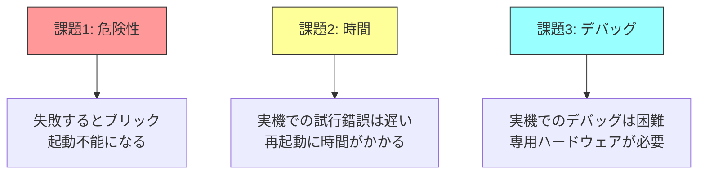

### 解決策：仮想化環境

これらの課題を解決するのが**仮想化環境**です：

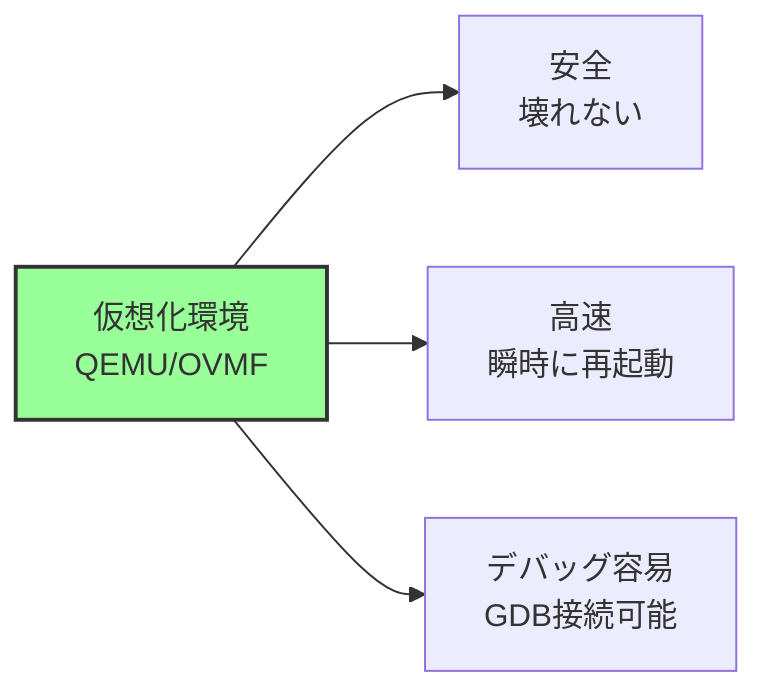

## 学習環境の全体像

### 構成要素

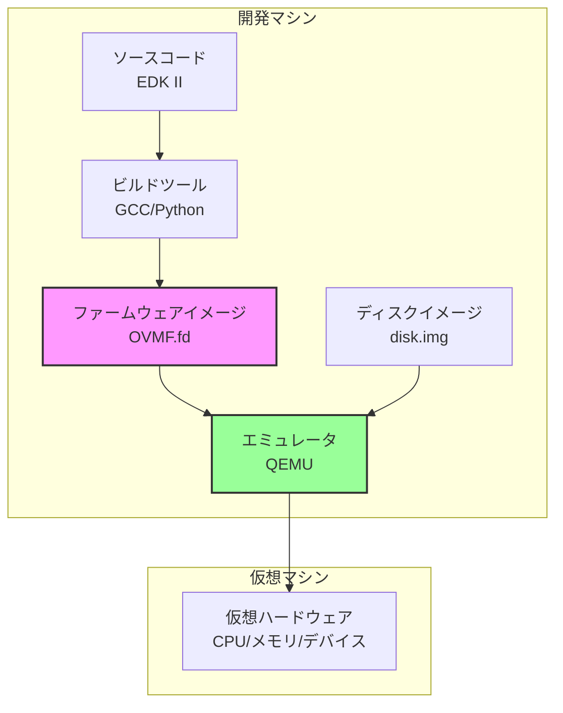

### ワークフロー

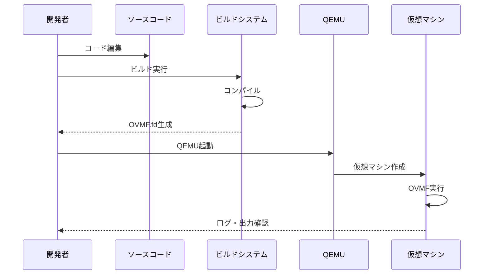

## QEMU とは

### QEMUの役割

**QEMU (Quick Emulator)** は、オープンソースのエミュレータ・仮想化ソフトウェアです。

**主な機能:**

1. **CPU エミュレーション**
   - x86_64, ARM, RISC-V など多数対応
   - 命令レベルのエミュレーション

2. **デバイスエミュレーション**
   - チップセット、PCIe、USB、ネットワークなど
   - 実機に近い動作

3. **デバッグ機能**
   - GDB サーバー機能
   - シリアルコンソール出力

### QEMUの仕組み

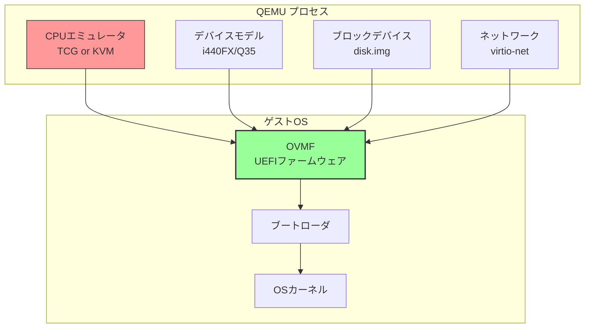

### QEMU の2つのモード

**1. TCG (Tiny Code Generator) モード**
- 純粋なエミュレーション
- 異なるアーキテクチャでも動作（例: ARM上でx86をエミュレート）
- 速度は遅い

**2. KVM (Kernel-based Virtual Machine) モード**
- ハードウェア仮想化支援機能を利用
- ホストとゲストが同じアーキテクチャの場合のみ
- 速度はネイティブに近い

**本書では主にKVMモードを使用します。**

## OVMF とは

### OVMFの位置づけ

**OVMF (Open Virtual Machine Firmware)** は、QEMU/KVM向けのUEFIファームウェア実装です。

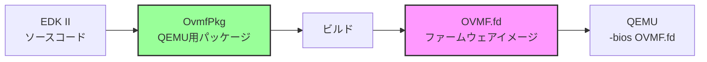

### OVMFの特徴

**メリット:**
- EDK IIベースなので、実機のUEFIと同じアーキテクチャ
- 完全なUEFI環境
- Secure Boot対応

**制限:**
- 仮想ハードウェアのみ対応
- 実機特有の問題は再現できない

### OVMF の構成

```
OVMF.fd
├─ SEC (Security Phase)
├─ PEI (Pre-EFI Initialization)
│   ├─ メモリ初期化
│   └─ CPUフェーズ移行
├─ DXE (Driver Execution Environment)
│   ├─ PCIバスドライバ
│   ├─ ディスクドライバ
│   └─ ネットワークドライバ
└─ BDS (Boot Device Selection)
    └─ ブートマネージャ
```

## EDK II とは

### EDK IIの役割

**EDK II (EFI Development Kit II)** は、UEFIファームウェアを開発するための**フレームワーク**です。

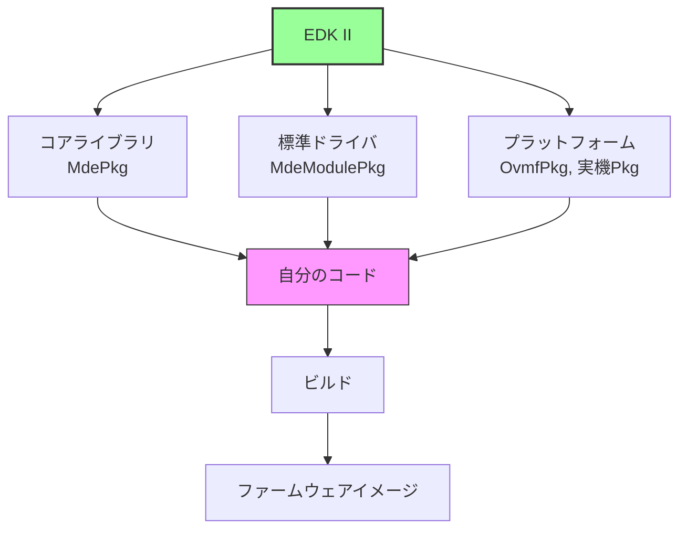

### なぜEDK IIを使うのか

**1. 業界標準**
- Intel, AMD, ARM など主要ベンダーが使用
- 実機のファームウェアも多くがEDK IIベース

**2. 豊富なライブラリ**
- UEFI仕様のプロトコルがすべて実装済み
- ドライバ、ライブラリが充実

**3. モジュラーな設計**
- 再利用可能なコンポーネント
- プラットフォーム固有部分と共通部分の分離

### EDK IIのディレクトリ構造

```
edk2/
├─ MdePkg/               # 基本定義・ライブラリ
├─ MdeModulePkg/         # 標準モジュール
├─ SecurityPkg/          # セキュリティ関連
├─ NetworkPkg/           # ネットワークスタック
├─ OvmfPkg/              # QEMU/KVM 用
├─ EmulatorPkg/          # エミュレータ用
├─ ArmPkg/               # ARM アーキテクチャ
└─ ...
```

## 学習に使用するツール

### 最小限の構成

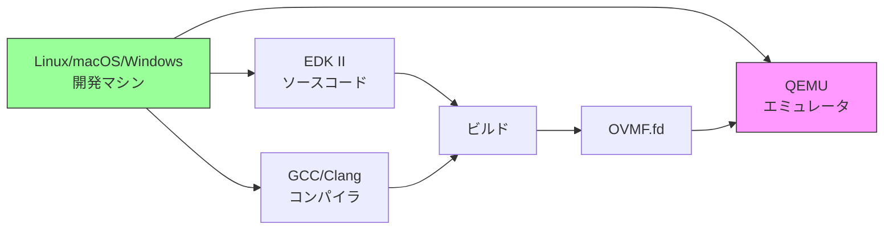

### 各ツールの目的

| ツール | 目的 | 必須度 |
|--------|------|--------|
| **QEMU** | 仮想マシン実行 | ★★★★★ |
| **EDK II** | ファームウェア開発 | ★★★★★ |
| **GCC/Clang** | C言語コンパイラ | ★★★★★ |
| **Python** | ビルドスクリプト | ★★★★★ |
| **NASM** | アセンブラ | ★★★★☆ |
| **GDB** | デバッガ | ★★★☆☆ |
| **Git** | バージョン管理 | ★★★☆☆ |

### 推奨される開発環境

**Linux (推奨)**
- 公式サポート
- ビルドが高速
- デバッグツールが充実

**macOS**
- Xcode Command Line Tools
- Homebrew でツール導入

**Windows**
- WSL2 (Windows Subsystem for Linux) 推奨
- Visual Studio も可

## 実機との違い

### 仮想環境と実機の比較

| 項目 | QEMU/OVMF | 実機 |
|------|-----------|------|
| **安全性** | ◎ 壊れない | △ ブリックのリスク |
| **速度** | ◎ 瞬時に再起動 | △ 数十秒かかる |
| **デバッグ** | ◎ GDB接続可能 | △ JTAG等が必要 |
| **ハードウェア** | △ 仮想デバイスのみ | ◎ 実物 |
| **性能測定** | △ 不正確 | ◎ 正確 |
| **実機特有の問題** | × 再現不可 | ◎ 発見可能 |

### 使い分けの指針

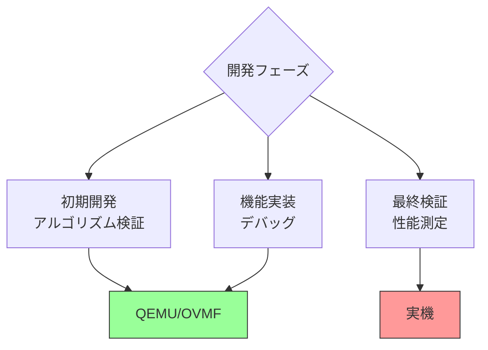

**推奨ワークフロー:**

1. **QEMU で開発・デバッグ**（90%の時間）
   - 機能実装
   - 基本的なテスト
   - デバッグ

2. **実機で最終検証**（10%の時間）
   - 互換性確認
   - 性能測定
   - 実機特有の問題発見

## なぜこの環境で学ぶのか

### 安全性

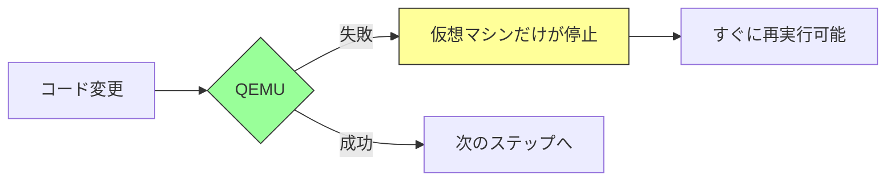

実機なら失敗すると文鎮化のリスクがありますが、QEMUなら**何度でも試せます**。

### 学習効率

**反復速度の比較:**

| 操作 | QEMU | 実機 |
|------|------|------|
| 起動 | 1-2秒 | 10-30秒 |
| ファームウェア更新 | ファイルコピーのみ | SPI書き込み必要 |
| デバッグ | GDB即座に接続 | JTAG設定が必要 |

QEMUなら、**1時間で数十回の試行錯誤**が可能です。

### 再現性

QEMUは完全に決定的な動作をするため：

- 問題の再現が容易
- デバッグが効率的
- 他の学習者と環境を揃えられる

## 本書でのツール使用方針

### 基本方針

本書は**解説中心**なので、ツールの詳細な使い方は最小限にします：

❌ **本書で詳しく説明しないこと:**
- QEMUの全オプション
- EDK IIのビルドシステム詳細
- GDBの使い方

✅ **本書で説明すること:**
- なぜこのツールを使うのか（目的）
- ツールの位置づけ（役割）
- 最小限の使用例（参考程度）

### 環境構築について

**本書のスタンス:**

- 詳細な環境構築手順は**提供しない**
- 各ツールの公式ドキュメントを参照することを推奨
- 環境が整っている前提で解説を進める

**理由:**

1. 環境構築はOS・バージョンにより異なる
2. 本書の焦点は「仕組みの理解」
3. 公式ドキュメントが最も正確

### 参考情報の提供

代わりに、**各ツールの公式リソース**を紹介します：

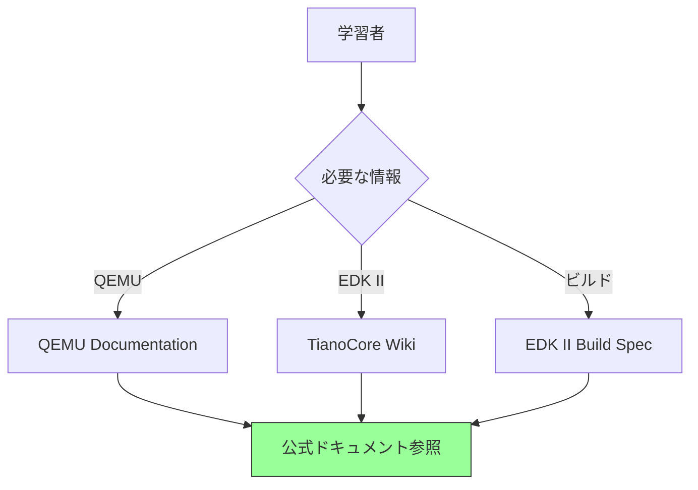

## まとめ

この章では、学習環境の概要とツールの位置づけを説明しました。

**重要なポイント:**

- **QEMU/OVMF** は安全で高速な学習環境
- **EDK II** は業界標準のUEFI開発フレームワーク
- 仮想環境で開発・デバッグ、実機で最終検証が基本
- 本書は解説重視で、環境構築の詳細は扱わない

**ツールの役割:**

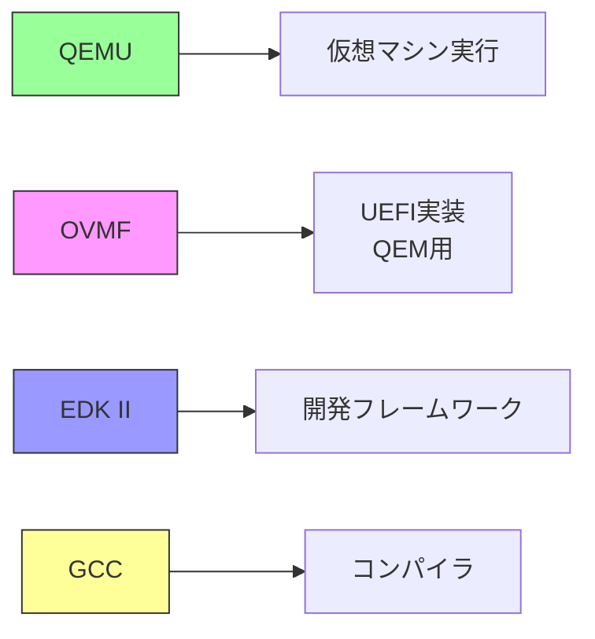

**学習の進め方:**

1. 本書でファームウェアの仕組みを理解
2. 必要に応じて公式ドキュメントを参照
3. QEMU/EDK IIで実験（オプショナル）

---

**次章では、Part 0のまとめを行います。**

📚 **参考資料**
- [QEMU Documentation](https://www.qemu.org/docs/master/)
- [EDK II Documentation](https://github.com/tianocore/tianocore.github.io/wiki)
- [OvmfPkg README](https://github.com/tianocore/edk2/blob/master/OvmfPkg/README)
- [Getting Started with EDK II](https://github.com/tianocore/tianocore.github.io/wiki/Getting-Started-with-EDK-II)
