# 学習環境の概要とツールの位置づけ

🎯 **この章で学ぶこと**
- 学習に使用するツールの目的と役割
- QEMU/OVMFを使う理由
- EDK IIの位置づけ
- 実機との違いと使い分け

📚 **前提知識**
- ファームウェアエコシステム（前章）
- 仮想化の基本概念

---

## なぜ学習環境が必要か

### ファームウェア開発の課題

ファームウェア開発には、通常のアプリケーション開発とは異なる固有の課題があります。これらの課題を理解することは、適切な学習環境を構築する上で重要です。第一の課題は危険性です。ファームウェアはシステムの最も低レベルで動作するため、開発中のコードに不具合があると、システム全体が起動不能になる可能性があります。これは一般に「ブリック」と呼ばれる状態であり、実機で発生すると復旧が困難または不可能になることもあります。

第二の課題は時間です。実機でファームウェアを試す場合、コードを変更するたびにシステム全体を再起動する必要があります。このプロセスには数十秒から数分かかることもあり、試行錯誤を繰り返す開発では大きな時間的ロスとなります。頻繁な再起動は、開発効率を著しく低下させます。

第三の課題はデバッグの困難さです。実機でのファームウェアデバッグには、JTAG や SWD といった専用のハードウェアデバッガが必要です。これらのツールは高価であり、セットアップも複雑です。また、ファームウェアの初期段階ではシリアルコンソールすら利用できないことがあり、問題の特定が極めて困難になります。

**補足図**: 以下の図は、ファームウェア開発における主な課題を示したものです。

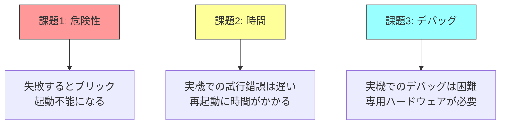

### 解決策：仮想化環境

これらの課題を解決するのが仮想化環境です。QEMU と OVMF を組み合わせた仮想化環境を使用することで、安全に、高速に、そして容易にデバッグしながらファームウェア開発を学習できます。

まず、安全性の面では、仮想環境内でどのようなコードを実行しても、ホストシステムには影響しません。ファームウェアが起動しなくなっても、仮想マシンを削除して新しく作り直すだけです。実機が壊れる心配は一切ありません。

次に、速度の面では、仮想マシンの再起動は瞬時に完了します。実機のように BIOS POST を待つ必要がなく、コードの変更から実行までのサイクルを数秒で完了できます。これにより、試行錯誤を高速に繰り返すことができ、学習効率が大幅に向上します。

さらに、デバッグの面では、QEMU は GDB との連携をサポートしています。特別なハードウェアを用意することなく、標準的な GDB を使ってファームウェアのステップ実行、ブレークポイント設定、変数の確認といったデバッグ作業を行えます。これにより、コードの動作を詳細に観察し、問題を迅速に特定できます。

**補足図**: 以下の図は、仮想化環境が提供する利点を示したものです。

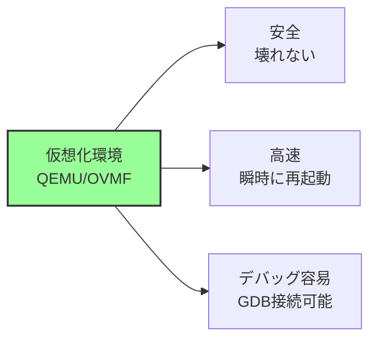

## 学習環境の全体像

### 構成要素

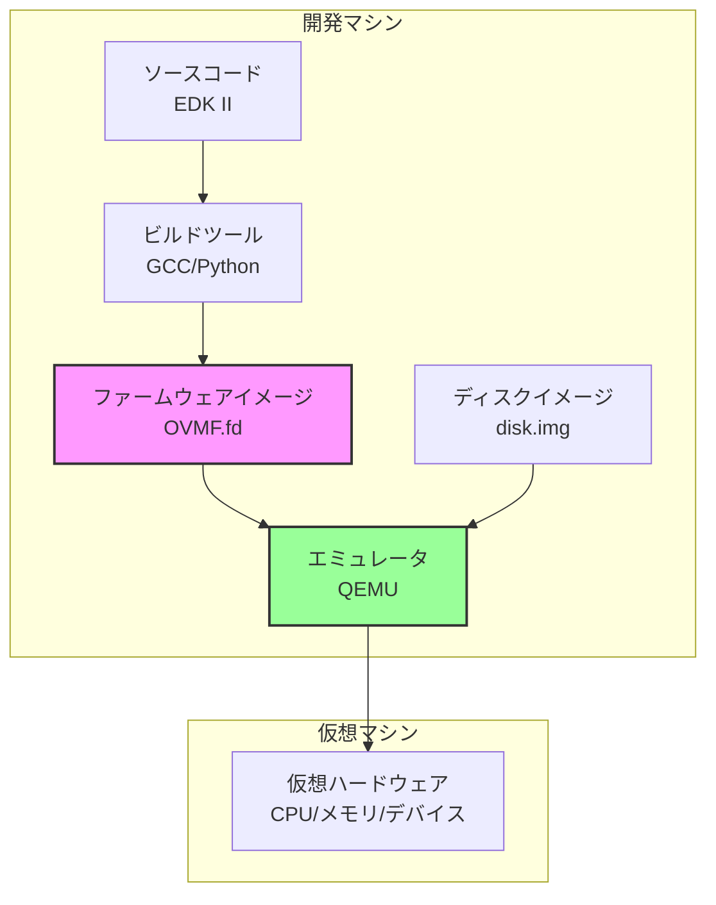

### ワークフロー

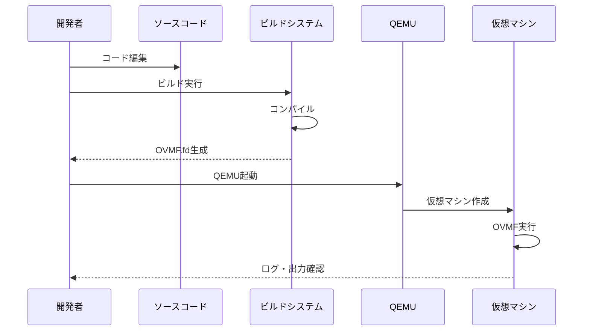

## QEMU とは

### QEMUの役割

**QEMU (Quick Emulator)** は、Fabrice Bellard によって開発されたオープンソースのエミュレータ・仮想化ソフトウェアです。2003年に最初にリリースされて以来、Linux カーネルの KVM (Kernel-based Virtual Machine) と統合され、現代の仮想化技術の中核となっています。QEMU は、完全なシステムエミュレーション機能を提供し、CPU、メモリ、周辺デバイスのすべてをソフトウェアで再現します。

**主な機能：**

QEMU の最も重要な機能は、**CPU エミュレーション**です。QEMU は、x86_64、ARM、RISC-V、MIPS、PowerPC など、30 種類以上のアーキテクチャをサポートしています。各 CPU の命令セットを忠実にエミュレートし、ゲスト OS が期待する動作を提供します。命令レベルのエミュレーションにより、異なるアーキテクチャ間でのクロスプラットフォーム実行が可能です。例えば、x86_64 ホスト上で ARM ファームウェアを実行したり、ARM ホスト上で RISC-V OS を実行したりできます。

次に重要な機能は、**デバイスエミュレーション**です。QEMU は、実際のハードウェアデバイスをソフトウェアでエミュレートします。チップセット（i440FX、Q35）、PCIe バス、USB コントローラ、ネットワークカード、ディスクコントローラといった主要なデバイスがサポートされています。これらのデバイスは、実機とほぼ同じレジスタマップと動作を持ち、ゲストファームウェアやOS がハードウェアの違いを意識することなく動作できます。また、virtio という準仮想化デバイスもサポートされており、ネイティブに近いパフォーマンスを実現できます。

QEMU のもう一つの重要な機能は、**デバッグ機能**です。QEMU は、GDB サーバー機能を内蔵しており、`-s` オプションで有効化できます。GDB を QEMU に接続することで、ゲスト OS やファームウェアのステップ実行、ブレークポイント設定、レジスタやメモリの確認が可能です。また、シリアルコンソール出力をサポートしており、`-serial stdio` オプションで標準出力にリダイレクトできます。これにより、ファームウェアからのデバッグメッセージをリアルタイムで確認できます。さらに、QEMU モニターコンソール（`Ctrl-A c` で切り替え）により、仮想マシンの状態確認、デバイスの追加・削除、スナップショットの作成といった操作が可能です。

### QEMUの仕組み

QEMU の内部アーキテクチャは、複数のコンポーネントで構成されています。以下の図は、QEMU の主要コンポーネントとゲスト OS の関係を示しています。

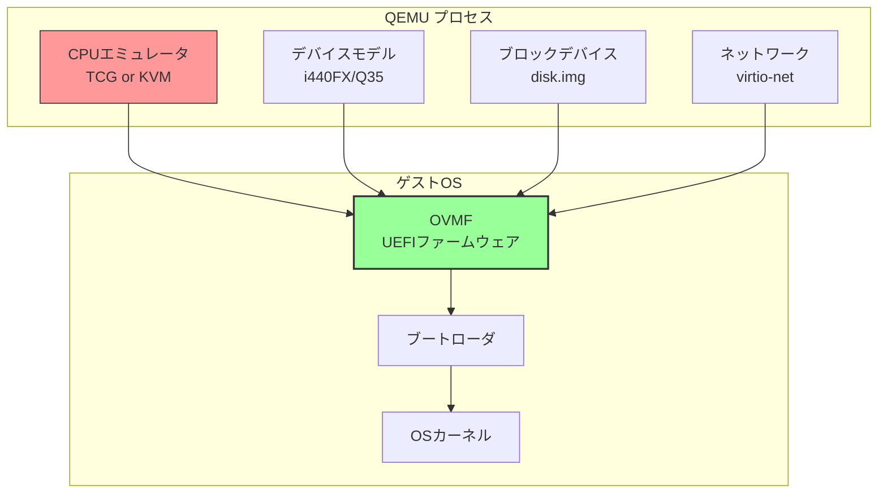

**CPU エミュレータ**は、ゲスト CPU の命令を実行する責任を持ちます。QEMU は、TCG (Tiny Code Generator) と KVM (Kernel-based Virtual Machine) の2つの実行モードをサポートしています。TCG モードでは、ゲスト命令をホスト命令に動的に変換（JIT コンパイル）して実行します。KVM モードでは、Linux カーネルの KVM 機能を利用して、ハードウェア仮想化支援機能（Intel VT-x、AMD-V）により、ゲスト命令を直接 CPU で実行します。

**デバイスモデル**は、チップセットと周辺デバイスをエミュレートします。i440FX は古い Intel チップセットのエミュレーションであり、Q35 は現代の Intel チップセットをエミュレートします。Q35 は PCIe をネイティブサポートし、AHCI、Intel HD Audio といった現代的なデバイスを提供します。本書では、主に Q35 を使用します。

**ブロックデバイス**は、ディスクイメージ（disk.img、qcow2 など）をエミュレートされたストレージデバイスとして提供します。IDE、SATA、virtio-blk といった様々なインターフェースをサポートします。**ネットワーク**は、virtio-net、e1000 といったネットワークカードをエミュレートし、ゲスト OS にネットワーク接続を提供します。

### QEMU の2つのモード

QEMU は、CPU エミュレーションの方法として、TCG と KVM の2つのモードを提供します。これらのモードの違いを理解することは、適切な環境選択に重要です。

**1. TCG (Tiny Code Generator) モード**

TCG は、純粋なソフトウェアエミュレーションです。ゲスト CPU の命令を逐次解釈し、ホスト CPU の命令に変換して実行します。このプロセスは、JIT (Just-In-Time) コンパイルによって最適化されており、命令ブロック単位で変換されたコードがキャッシュされます。

TCG モードの最大の利点は、**クロスアーキテクチャエミュレーション**が可能なことです。例えば、x86_64 ホスト上で ARM ファームウェアを実行したり、ARM ホスト上で RISC-V OS を実行したりできます。これにより、ターゲットアーキテクチャのハードウェアを持っていなくても、ファームウェア開発が可能です。

しかし、TCG モードの欠点は、**速度が遅い**ことです。命令の変換オーバーヘッドにより、実機の 1/10 から 1/50 程度の速度になります。メモリアクセスや I/O 操作も、すべてソフトウェアでエミュレートされるため、さらに遅くなります。大規模なファームウェアや OS のブートには、数分かかることもあります。

**2. KVM (Kernel-based Virtual Machine) モード**

KVM は、Linux カーネルに統合された仮想化技術です。Intel VT-x や AMD-V といったハードウェア仮想化支援機能を利用し、ゲスト CPU 命令を直接ホスト CPU で実行します。QEMU は、KVM の制御インターフェースとして機能し、デバイスエミュレーションと I/O 処理を担当します。

KVM モードの最大の利点は、**速度がネイティブに近い**ことです。ゲスト命令は、ハードウェアによって直接実行されるため、オーバーヘッドは最小限です。通常、実機の 80-95% の性能を発揮します。メモリアクセスも、ハードウェアのメモリ仮想化機能（Intel EPT、AMD NPT）により高速化されます。

KVM モードの制約は、**ホストとゲストが同じアーキテクチャである必要がある**ことです。x86_64 ホストでは x86_64 ゲストのみ、ARM ホストでは ARM ゲストのみが KVM で実行できます。また、KVM は Linux ホストでのみ利用可能です（Windows では Hyper-V、macOS では Hypervisor.framework が類似の機能を提供）。

**本書での使用方針：**

本書では、主に **KVM モード**を使用します。x86_64 ホスト上で x86_64 UEFI ファームウェア（OVMF）を実行するため、KVM の恩恵を最大限に受けられます。高速な起動と実行により、試行錯誤を効率的に繰り返せます。ただし、ARM や RISC-V ファームウェアを扱う章では、TCG モードも使用します。

## OVMF とは

### OVMFの位置づけ

**OVMF (Open Virtual Machine Firmware)** は、QEMU/KVM 向けの UEFI ファームウェア実装です。EDK II の OvmfPkg パッケージとして提供されており、QEMU の仮想ハードウェア上で完全な UEFI 環境を提供します。OVMF は、実機の UEFI ファームウェアと同じアーキテクチャを持ち、UEFI Specification に完全準拠しています。

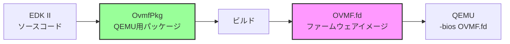

OVMF の開発は、2006年に Intel によって開始されました。当初の目的は、仮想マシンで UEFI 環境をテストすることでした。従来、仮想マシンは Legacy BIOS（SeaBIOS など）しかサポートしておらず、UEFI の開発とテストには実機が必要でした。OVMF の登場により、仮想環境での UEFI 開発が可能になり、開発効率が大幅に向上しました。

### OVMFの特徴

OVMF は、仮想環境での UEFI 開発に最適化された設計を持っています。以下は、OVMF の主な特徴です。

**メリット：**

第一のメリットは、**EDK II ベースであること**です。OVMF は、EDK II のコードベースを使用しているため、実機の UEFI ファームウェアと同じアーキテクチャと API を持ちます。EDK II で開発したドライバやアプリケーションは、OVMF でテストでき、実機でもそのまま動作します。逆に、OVMF でデバッグしたコードは、実機にも適用できます。この互換性により、開発とテストのサイクルが効率化されます。

第二のメリットは、**完全な UEFI 環境**を提供することです。OVMF は、UEFI Specification のすべての主要機能をサポートしています。Boot Services、Runtime Services、プロトコル、ドライバモデル、UEFI Shell といった標準機能がすべて利用可能です。また、GOP (Graphics Output Protocol) による画面出力、Simple File System Protocol によるファイルアクセス、Network Protocol による HTTP Boot といった高度な機能もサポートされています。

第三のメリットは、**Secure Boot 対応**です。OVMF は、UEFI Secure Boot を完全にサポートしており、署名検証、鍵管理、信頼チェーンといった機能をテストできます。Secure Boot の実装とテストは実機では困難ですが、OVMF を使用することで、安全に実験できます。

第四のメリットは、**高速なビルドとデプロイ**です。OVMF のビルドは、実機のファームウェアよりも高速です（通常 1-2 分）。ビルドした OVMF.fd ファイルを QEMU に渡すだけで、即座にテストできます。実機では Flash ROM への書き込みが必要ですが、OVMF ではファイルコピーだけで済みます。

**制限：**

OVMF の主な制限は、**仮想ハードウェアのみ対応**していることです。OVMF は、QEMU が提供する仮想デバイス（Q35 チップセット、virtio、e1000 など）にのみ対応しており、実機固有のデバイス（特定のチップセット、組込みコントローラ、センサーなど）はサポートしません。したがって、実機固有のドライバ開発には使用できません。

もう一つの制限は、**実機特有の問題は再現できない**ことです。ハードウェアタイミング、割り込みレイテンシ、キャッシュコヒーレンシ、電源管理といった実機固有の問題は、OVMF では再現されません。また、実機の BIOS ベンダー（AMI、Insyde、Phoenix）が実装している独自機能や最適化も、OVMF には含まれません。

### OVMF の構成

OVMF.fd ファイルは、単一のバイナリイメージですが、内部的には複数のブートフェーズで構成されています。以下は、OVMF の内部構造を示したものです。

```
OVMF.fd (4MB または 2MB)
├─ SEC (Security Phase)
│   └─ ResetVector.asm (リセット時の最初の命令)
│   └─ SEC Core (PEI への遷移)
├─ PEI (Pre-EFI Initialization)
│   ├─ PEI Core (PEI フェーズの制御)
│   ├─ Memory Initialization PEIM (仮想メモリの検出)
│   ├─ CPU Initialization PEIM (仮想 CPU の設定)
│   └─ DXE IPL PEIM (DXE への遷移)
├─ DXE (Driver Execution Environment)
│   ├─ DXE Core (DXE フェーズの制御)
│   ├─ PCIe Bus Driver (PCIe デバイス列挙)
│   ├─ Disk Driver (virtio-blk, AHCI)
│   ├─ Network Driver (virtio-net, e1000)
│   ├─ GOP Driver (Graphics Output Protocol)
│   └─ ACPI Table Driver (ACPI テーブル生成)
├─ BDS (Boot Device Selection)
│   ├─ Boot Manager (ブートデバイス選択)
│   └─ UEFI Shell (組込みシェル、オプション)
└─ Runtime Services
    ├─ Variable Services (UEFI 変数の読み書き)
    └─ Time Services (RTC アクセス)
```

**SEC (Security Phase)** は、リセット後の最初のフェーズです。ResetVector.asm が CPU のリセットベクタ（0xFFFFFFF0）に配置され、ここから実行が始まります。SEC は、CPU を 16-bit リアルモードから 32-bit プロテクトモード、そして 64-bit ロングモードへ遷移させます。また、最小限のスタック（一時 RAM）を設定し、PEI Core を呼び出します。

**PEI (Pre-EFI Initialization)** は、プラットフォームの初期化を担当します。OVMF の PEI は、QEMU が提供する fw_cfg インターフェースを使用して、仮想マシンのメモリサイズや CPU 数を取得します。メモリマップを構築し、HOB (Hand-Off Block) として DXE に渡します。CPU の初期化（GDT、IDT の設定）も行います。

**DXE (Driver Execution Environment)** は、ドライバの実行環境です。DXE Core が起動し、Protocol Database を初期化します。その後、各種ドライバがロードされ、デバイスが列挙されます。OVMF の DXE ドライバは、QEMU の仮想デバイス（PCIe、virtio-blk、virtio-net、GOP など）をサポートします。また、ACPI テーブルを生成し、OS に渡す準備をします。

**BDS (Boot Device Selection)** は、ブートデバイスの選択とブートマネージャの実行を担当します。OVMF の BDS は、ディスク、ネットワーク、UEFI Shell といったブートオプションを列挙し、優先順位に従ってブートを試みます。UEFI Shell が組み込まれている場合、対話的にコマンドを実行できます。

**Runtime Services** は、OS 起動後も利用可能なサービスです。UEFI 変数（Boot Order、Secure Boot の設定など）の読み書きや、RTC (Real-Time Clock) へのアクセスを提供します。これらのサービスは、OS カーネルから呼び出されます。

## EDK II とは

### EDK IIの役割

**EDK II (EFI Development Kit II)** は、UEFI ファームウェアを開発するための**フレームワーク**です。元々 Intel によって開発され、2004年にオープンソース化されました。現在は TianoCore プロジェクトとして、業界標準の UEFI 開発環境として広く使用されています。EDK II は、単なるコード集ではなく、ビルドシステム、ライブラリ、ドライバ、ツールを統合した完全な開発フレームワークです。

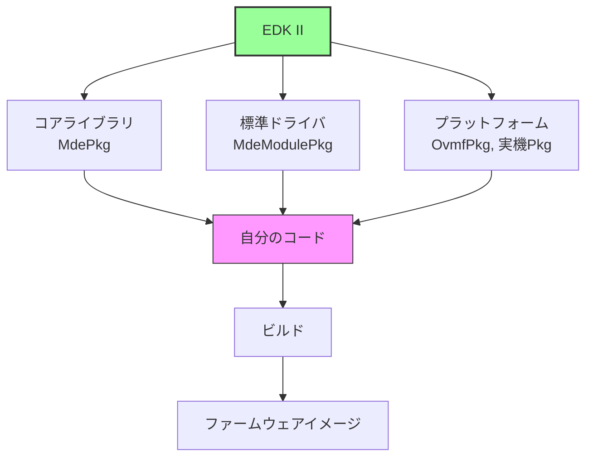

EDK II の役割は、UEFI 開発の複雑さを抽象化することです。UEFI Specification は、2,000 ページを超える膨大な仕様書であり、すべてを一から実装するのは現実的ではありません。EDK II は、仕様のほぼすべてを実装済みのライブラリとして提供し、開発者はプラットフォーム固有の部分だけを実装すれば良いようにします。

### なぜEDK IIを使うのか

EDK II を使用する理由は、複数の観点から説明できます。

**1. 業界標準**

EDK II は、UEFI ファームウェア開発の事実上の業界標準です。Intel、AMD、ARM といった主要な CPU ベンダーは、すべて EDK II をベースにリファレンス実装を提供しています。また、AMI、Insyde、Phoenix という3大 BIOS ベンダーも、EDK II を基盤として独自の製品を構築しています。

EDK II が業界標準となった理由は、UEFI Forum との密接な関係です。UEFI Specification の策定と EDK II の開発は、相互にフィードバックを受けながら進化しています。仕様書に新しい機能が追加されると、EDK II にもその参照実装が追加されます。逆に、EDK II で実装された機能が仕様書に反映されることもあります。この協調により、EDK II は常に最新の UEFI Specification に準拠しています。

業界標準であることの利点は、互換性とエコシステムです。EDK II で開発したコードは、様々なプラットフォーム（Intel、AMD、ARM）で再利用できます。また、膨大な数のサンプルコード、ドキュメント、コミュニティサポートが利用可能です。

**2. 豊富なライブラリ**

EDK II は、UEFI Specification で定義されているすべてのプロトコルを実装済みです。例えば、EFI_SIMPLE_FILE_SYSTEM_PROTOCOL、EFI_GRAPHICS_OUTPUT_PROTOCOL、EFI_USB_IO_PROTOCOL といった主要プロトコルは、すべて MdeModulePkg に含まれています。開発者は、これらのプロトコルを利用するだけで、複雑な機能を実装できます。

また、EDK II は、豊富なライブラリを提供しています。BaseLib は、文字列操作、メモリ操作、ビット操作といった基本的な関数を提供します。UefiLib は、UEFI 固有の操作（プロトコルのインストール、イベント処理など）を簡単に行える関数を提供します。DebugLib は、デバッグメッセージの出力を統一的に扱えるようにします。PrintLib は、printf 風の文字列フォーマット機能を提供します。

これらのライブラリは、実機で動作することが検証されており、バグが少なく、パフォーマンスも最適化されています。ゼロから実装する場合と比べて、開発時間を大幅に短縮できます。

**3. モジュラーな設計**

EDK II の設計は、モジュラー性を重視しています。コードは、INF (Information) ファイルで定義されたモジュール単位で構成されます。各モジュールは、独立してビルド可能であり、依存関係が明示的に定義されています。

このモジュラー設計により、再利用性が向上します。例えば、USB ホストコントローラドライバは、MdeModulePkg に含まれており、どのプラットフォームでも使用できます。プラットフォーム開発者は、USB 固有のコードを書く必要がなく、既存のドライバをリンクするだけです。

また、プラットフォーム固有部分と共通部分が明確に分離されています。MdePkg と MdeModulePkg は、プラットフォームに依存しない共通コードであり、OvmfPkg や実機の Platform Package は、プラットフォーム固有のコードです。この分離により、プラットフォームの移植が容易になります。

### EDK IIのディレクトリ構造

EDK II のソースコードは、パッケージ単位で構成されています。各パッケージは、特定の目的や機能を持ち、独立してビルド可能です。以下は、EDK II の主要なディレクトリ構造です。

```
edk2/
├─ MdePkg/               # Module Development Environment Package
│                        # UEFI/PI の基本定義、ライブラリ
│                        # すべてのモジュールが依存
├─ MdeModulePkg/         # Module Development Environment Module Package
│                        # 標準ドライバ、コアコンポーネント
│                        # DXE Core, PEI Core, USB, Disk, Network など
├─ SecurityPkg/          # セキュリティ関連
│                        # Secure Boot, TPM, Hash ライブラリ
├─ NetworkPkg/           # ネットワークスタック
│                        # HTTP Boot, iSCSI, DNS, TLS
├─ CryptoPkg/            # 暗号化ライブラリ
│                        # OpenSSL ラッパー、Hash, RSA, AES
├─ OvmfPkg/              # Open Virtual Machine Firmware Package
│                        # QEMU/KVM 用プラットフォーム
├─ EmulatorPkg/          # エミュレータ用プラットフォーム
│                        # ホスト OS 上で実行可能な UEFI
├─ ArmPkg/               # ARM アーキテクチャ共通
│                        # ARM 固有の CPU、MMU、割り込み処理
├─ ArmPlatformPkg/       # ARM プラットフォーム固有
│                        # 特定の ARM ボード向け実装
├─ ShellPkg/             # UEFI Shell
│                        # コマンドラインインターフェース
├─ FatPkg/               # FAT ファイルシステム
│                        # FAT12/16/32 サポート
├─ UefiCpuPkg/           # x86/x64 CPU 関連
│                        # CPU 初期化、MP Services
├─ PcAtChipsetPkg/       # レガシー PC/AT チップセット
│                        # 8259 PIC, 8254 PIT, RTC
└─ BaseTools/            # ビルドツール
                         # Python ベースのビルドシステム
```

**MdePkg (Module Development Environment Package)** は、最も重要なパッケージです。UEFI Specification と PI (Platform Initialization) Specification の基本定義（データ型、構造体、プロトコル定義）が含まれます。また、BaseLib、UefiLib、DebugLib といった基本ライブラリも提供します。すべての EDK II モジュールは、MdePkg に依存します。

**MdeModulePkg (Module Development Environment Module Package)** は、標準的なドライバとコアコンポーネントを提供します。DXE Core、PEI Core、BDS (Boot Device Selection) といったブートフェーズの実装が含まれます。また、USB ホストコントローラドライバ、ディスクドライバ、ネットワークドライバといった汎用ドライバも含まれます。MdeModulePkg は、プラットフォームに依存しない実装を提供し、様々なプラットフォームで再利用されます。

**OvmfPkg (Open Virtual Machine Firmware Package)** は、QEMU/KVM 向けのプラットフォーム実装です。本書で主に使用するパッケージであり、QEMU の仮想ハードウェアに対応したファームウェアを提供します。OvmfPkg は、MdePkg と MdeModulePkg を利用しつつ、QEMU 固有の初期化コード（fw_cfg インターフェース、Q35 チップセット対応など）を実装しています。

**SecurityPkg** は、セキュリティ関連の機能を提供します。Secure Boot の実装、TPM (Trusted Platform Module) ドライバ、Hash ライブラリ（SHA-256、SHA-512 など）が含まれます。セキュアなファームウェアの実装に不可欠なパッケージです。

**NetworkPkg** は、ネットワークスタックを提供します。HTTP Boot、iSCSI、DNS、TLS といった高度なネットワーク機能が実装されています。ネットワーク経由でのブート（PXE、HTTP Boot）をサポートする場合に使用します。

**ShellPkg** は、UEFI Shell の実装です。UEFI Shell は、コマンドラインインターフェースであり、ファイル操作、デバイス情報の表示、簡単なスクリプト実行が可能です。開発とデバッグに非常に有用です。

これらのパッケージは、明確な依存関係を持っています。MdePkg は他のパッケージに依存せず、すべての基盤となります。MdeModulePkg は MdePkg に依存します。OvmfPkg は MdePkg と MdeModulePkg に依存し、必要に応じて SecurityPkg や NetworkPkg も使用します。この階層構造により、コードの再利用性と保守性が向上しています。

## 学習に使用するツール

### 最小限の構成

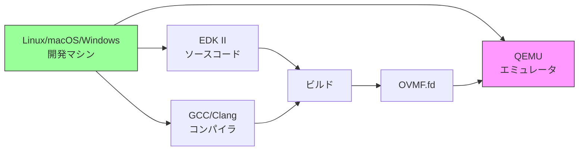

### 各ツールの目的

| ツール | 目的 | 必須度 |
|--------|------|--------|
| **QEMU** | 仮想マシン実行 | ★★★★★ |
| **EDK II** | ファームウェア開発 | ★★★★★ |
| **GCC/Clang** | C言語コンパイラ | ★★★★★ |
| **Python** | ビルドスクリプト | ★★★★★ |
| **NASM** | アセンブラ | ★★★★☆ |
| **GDB** | デバッガ | ★★★☆☆ |
| **Git** | バージョン管理 | ★★★☆☆ |

### 推奨される開発環境

**Linux (推奨)**
- 公式サポート
- ビルドが高速
- デバッグツールが充実

**macOS**
- Xcode Command Line Tools
- Homebrew でツール導入

**Windows**
- WSL2 (Windows Subsystem for Linux) 推奨
- Visual Studio も可

## 実機との違い

### 仮想環境と実機の比較

| 項目 | QEMU/OVMF | 実機 |
|------|-----------|------|
| **安全性** | ◎ 壊れない | △ ブリックのリスク |
| **速度** | ◎ 瞬時に再起動 | △ 数十秒かかる |
| **デバッグ** | ◎ GDB接続可能 | △ JTAG等が必要 |
| **ハードウェア** | △ 仮想デバイスのみ | ◎ 実物 |
| **性能測定** | △ 不正確 | ◎ 正確 |
| **実機特有の問題** | × 再現不可 | ◎ 発見可能 |

### 使い分けの指針

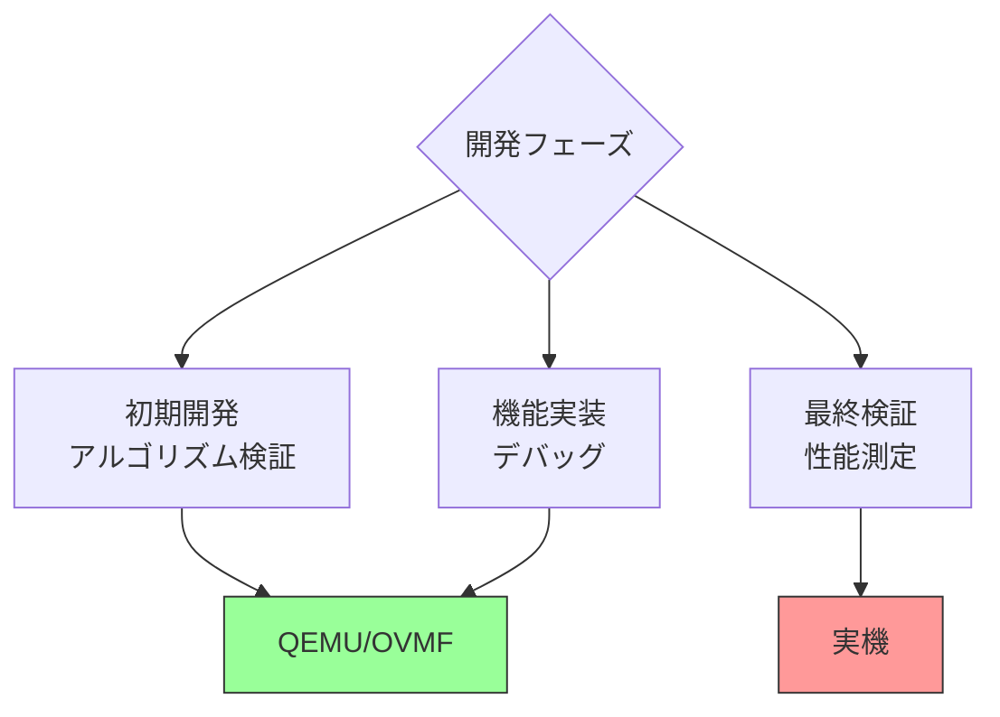

**推奨ワークフロー:**

1. **QEMU で開発・デバッグ**（90%の時間）
   - 機能実装
   - 基本的なテスト
   - デバッグ

2. **実機で最終検証**（10%の時間）
   - 互換性確認
   - 性能測定
   - 実機特有の問題発見

## なぜこの環境で学ぶのか

### 安全性

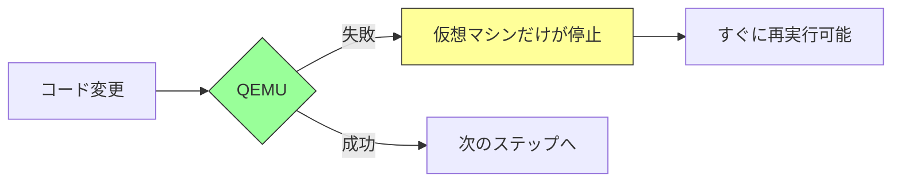

実機なら失敗すると文鎮化のリスクがありますが、QEMUなら**何度でも試せます**。

### 学習効率

**反復速度の比較:**

| 操作 | QEMU | 実機 |
|------|------|------|
| 起動 | 1-2秒 | 10-30秒 |
| ファームウェア更新 | ファイルコピーのみ | SPI書き込み必要 |
| デバッグ | GDB即座に接続 | JTAG設定が必要 |

QEMUなら、**1時間で数十回の試行錯誤**が可能です。

### 再現性

QEMUは完全に決定的な動作をするため：

- 問題の再現が容易
- デバッグが効率的
- 他の学習者と環境を揃えられる

## 本書でのツール使用方針

### 基本方針

本書は**解説中心**なので、ツールの詳細な使い方は最小限にします：

❌ **本書で詳しく説明しないこと:**
- QEMUの全オプション
- EDK IIのビルドシステム詳細
- GDBの使い方

✅ **本書で説明すること:**
- なぜこのツールを使うのか（目的）
- ツールの位置づけ（役割）
- 最小限の使用例（参考程度）

### 環境構築について

**本書のスタンス:**

- 詳細な環境構築手順は**提供しない**
- 各ツールの公式ドキュメントを参照することを推奨
- 環境が整っている前提で解説を進める

**理由:**

1. 環境構築はOS・バージョンにより異なる
2. 本書の焦点は「仕組みの理解」
3. 公式ドキュメントが最も正確

### 参考情報の提供

代わりに、**各ツールの公式リソース**を紹介します：

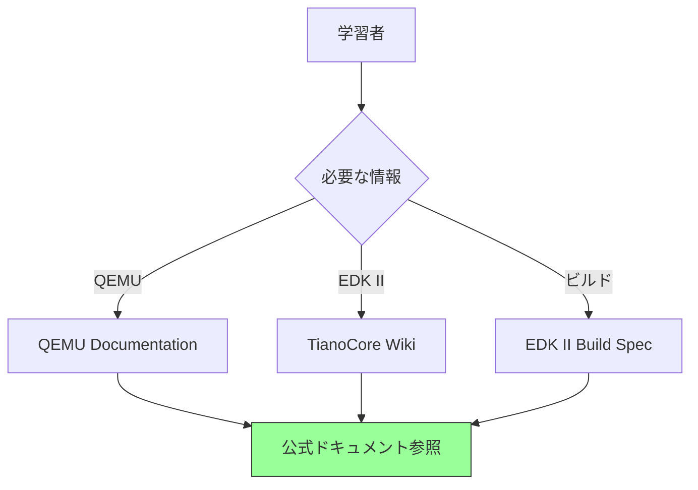

## まとめ

この章では、学習環境の概要と、各ツールがファームウェア開発においてどのような位置づけにあるかを説明しました。ファームウェア開発には、危険性、時間、デバッグの困難さという3つの固有の課題があり、これらを解決するために仮想化環境を使用します。

QEMU と OVMF を組み合わせた環境は、安全で高速な学習環境を提供します。実機を壊す心配なく、瞬時に再起動でき、GDB を使った詳細なデバッグが可能です。EDK II は、業界標準の UEFI 開発フレームワークであり、モジュラーな設計により、様々なプラットフォームに対応できます。基本的な開発とデバッグは仮想環境で行い、最終的な検証のみを実機で行うというのが、効率的な開発フローです。

本書は、ファームウェアの仕組みを理解することを目的としており、環境構築の詳細な手順は扱いません。環境構築については、公式ドキュメントや既存のチュートリアルを参照してください。本書で学んだ知識は、どのような環境でも応用できる普遍的なものです。

各ツールは、明確な役割を持っています。QEMU は仮想マシンの実行環境を提供し、OVMF は QEMU 上で動作する UEFI ファームウェアの実装です。EDK II は開発フレームワークとして、UEFI アプリケーションやドライバの開発を支援します。GCC はコンパイラとして、C 言語のソースコードを実行可能なバイナリに変換します。これらのツールが連携することで、完全なファームウェア開発環境が構築されます。

**補足図**: 以下の図は、各ツールの役割を示したものです。


本書での学習の進め方は、まず本書を通じてファームウェアの仕組みを理解し、必要に応じて公式ドキュメントを参照するというスタイルです。QEMU や EDK II での実験は任意であり、コードを実際に動かしてみたい場合に行います。理論の理解を優先し、実践はその理解を深めるための補助として位置づけています。

次章では、Part 0 全体のまとめを行います。ここまで学んだ内容を振り返り、次の Part への橋渡しとします。

---

📚 **参考資料**
- [QEMU Documentation](https://www.qemu.org/docs/master/)
- [EDK II Documentation](https://github.com/tianocore/tianocore.github.io/wiki)
- [OvmfPkg README](https://github.com/tianocore/edk2/blob/master/OvmfPkg/README)
- [Getting Started with EDK II](https://github.com/tianocore/tianocore.github.io/wiki/Getting-Started-with-EDK-II)
