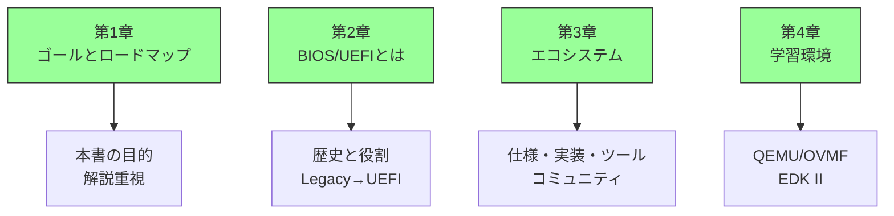
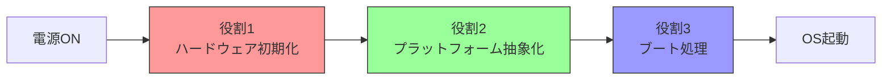
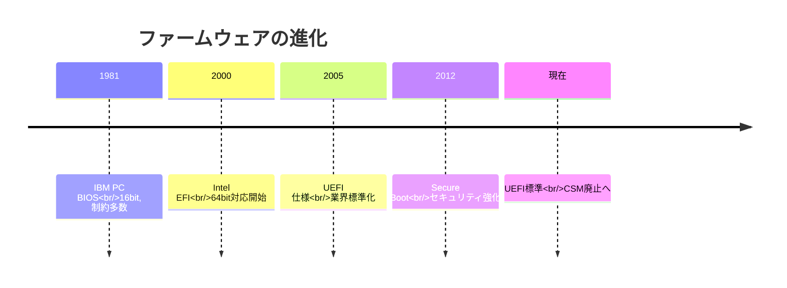
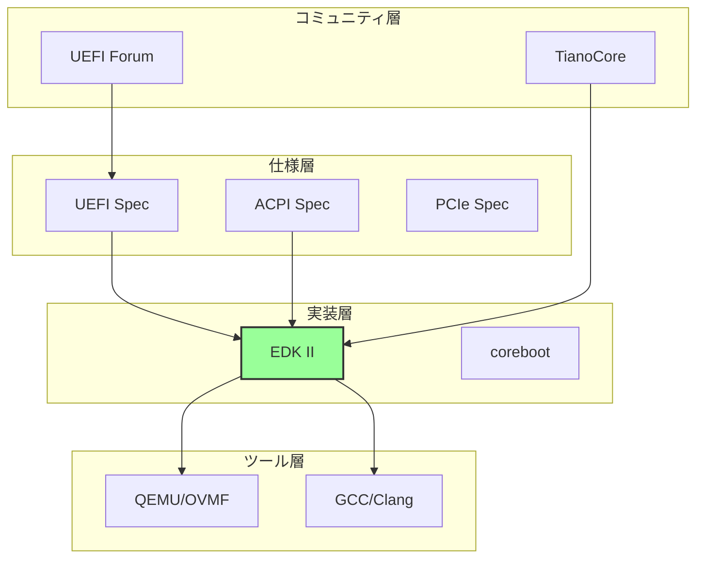
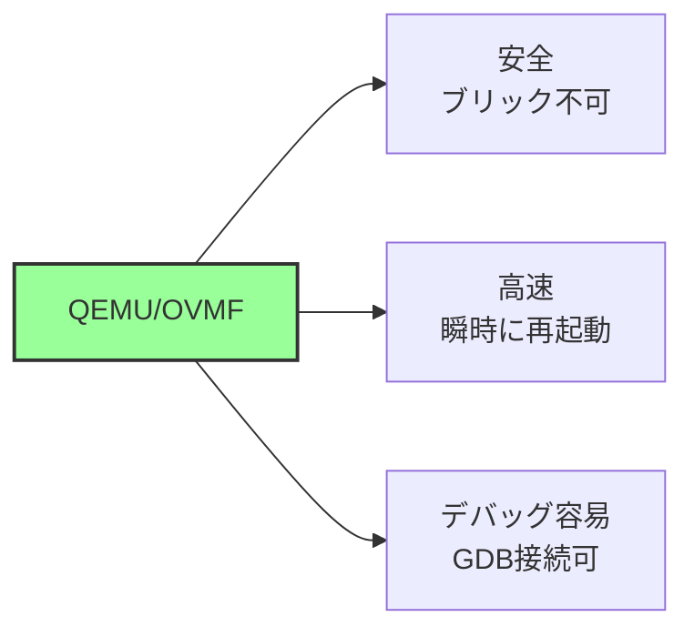
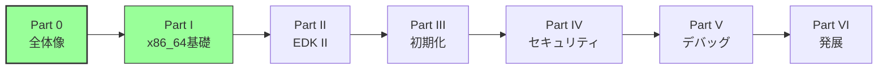
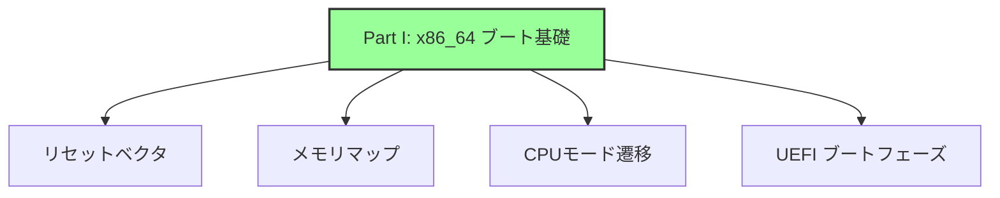
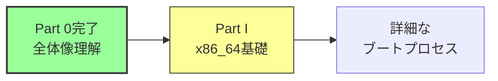

# Part 0 まとめ

🎯 **この章で学ぶこと**
- Part 0で学んだ内容の振り返り
- 重要な概念の再確認
- Part I への準備

---

## Part 0 で学んだこと

Part 0 では、BIOS と UEFI ファームウェアの全体像を理解してきました。ファームウェアが果たす役割、その歴史的な進化、開発を支えるエコシステム、そして学習環境について、段階的に学んできました。これらの知識は、以降の Part でより詳細な技術を学ぶための基盤となります。

### 各章の要点

第1章では、本書のゴールと学習ロードマップを説明しました。本書は、ファームウェアの仕組みを体系的に理解することを目的としており、実装よりも理解を重視する解説主体のアプローチを取ります。6つの Part で段階的に知識を積み上げ、約 40 時間から 60 時間で完走できる構成となっています。

第2章では、BIOS と UEFI とは何かを学びました。ファームウェアの歴史的な経緯を振り返り、レガシー BIOS が 1981年の IBM PC から始まり、現代の UEFI へと進化してきた過程を理解しました。レガシー BIOS の制約と、UEFI がそれをどのように解決したかを、技術的な観点から詳しく見てきました。ファームウェアの3つの主要な役割である、ハードウェア初期化、プラットフォーム抽象化、ブート処理についても学びました。

第3章では、ファームウェアエコシステムの全体像を理解しました。ファームウェア開発は、仕様、実装、ツール、コミュニティという4つの要素が連携するエコシステムの中で行われます。UEFI Specification や ACPI Specification といった中核的な仕様、EDK II や coreboot といった実装フレームワーク、QEMU や GCC といった開発ツール、そして UEFI Forum や TianoCore といったコミュニティが、互いに影響を与えながら進化しています。

第4章では、学習環境の概要とツールの位置づけを学びました。QEMU と OVMF を組み合わせた仮想環境が、安全で高速なファームウェア学習環境を提供することを理解しました。EDK II が業界標準の開発フレームワークとして、どのような役割を果たしているかも学びました。実機での開発には危険性、時間、デバッグの困難さという課題があり、仮想環境がこれらを解決することを確認しました。

**補足図**: 以下の図は、Part 0 の各章で学んだ要点を示したものです。



## 重要な概念の再確認

### 1. ファームウェアの役割

ファームウェア（BIOS/UEFI）は、ハードウェアとソフトウェアの橋渡しをします。

**3つの主要な役割:**



| 役割 | 内容 | 例 |
|------|------|-----|
| **初期化** | ハードウェアを使用可能な状態にする | CPU, メモリ, PCIe設定 |
| **抽象化** | OSにハードウェア情報を提供 | ACPI, SMBIOS テーブル |
| **ブート** | OSを起動する | ブートローダの実行 |

### 2. レガシーBIOS から UEFI への進化



**進化の理由:**

| 課題 | レガシーBIOSの限界 | UEFIの解決策 |
|------|-------------------|-------------|
| アーキテクチャ | 16bit リアルモード | 32/64bit モード |
| ディスク容量 | 2TB制限 (MBR) | 実質無制限 (GPT) |
| セキュリティ | 検証機構なし | Secure Boot |
| 拡張性 | モノリシック | モジュラー設計 |

### 3. エコシステムの構成

ファームウェア開発は、複数の要素が連携するエコシステムです。



**4つの層:**

1. **仕様層**: UEFI, ACPI, PCIe などの標準規格
2. **実装層**: EDK II, coreboot などのコードベース
3. **ツール層**: QEMU, コンパイラ、デバッガ
4. **コミュニティ層**: UEFI Forum, TianoCore などの組織

### 4. 学習環境

**QEMU/OVMF を使う理由:**



**EDK II の位置づけ:**

- 業界標準のUEFI開発フレームワーク
- 豊富なライブラリとドライバ
- 実機のファームウェアもEDK IIベース

## 本書の学習方針

### 解説重視のアプローチ

本書は、**実装よりも理解を重視**します：

❌ **やらないこと:**
- 完全に動くコードの実装
- 詳細な環境構築手順
- ステップバイステップのチュートリアル

✅ **やること:**
- 仕組みと設計思想の解説
- 「なぜそうなっているか」の説明
- アーキテクチャの全体像の提示

### 学習の進め方



**推奨される学習順序:**

1. **必須**: Part 0-I（全体像とブート基礎）
2. **重要**: Part II-III（アーキテクチャと初期化）
3. **発展**: Part IV-V（セキュリティとデバッグ）
4. **応用**: Part VI（他実装と展望）

## キーワード復習

Part 0で登場した重要なキーワード：

### ファームウェア関連

| 用語 | 説明 |
|------|------|
| **BIOS** | Basic Input/Output System - レガシーなファームウェア |
| **UEFI** | Unified Extensible Firmware Interface - モダンなファームウェア |
| **ファームウェア** | ハードウェアとソフトウェアの中間層 |

### 仕様・標準

| 用語 | 説明 |
|------|------|
| **UEFI Specification** | UEFIの仕様書（UEFI Forumが策定） |
| **ACPI Specification** | ハードウェア構成記述の仕様 |
| **GPT** | GUID Partition Table - UEFIのパーティション方式 |
| **MBR** | Master Boot Record - レガシーBIOSのパーティション方式 |

### 実装・ツール

| 用語 | 説明 |
|------|------|
| **EDK II** | UEFI開発フレームワーク |
| **QEMU** | オープンソースのエミュレータ |
| **OVMF** | QEMU向けのUEFIファームウェア実装 |
| **coreboot** | 軽量・オープンソースのファームウェア |

### コミュニティ

| 用語 | 説明 |
|------|------|
| **UEFI Forum** | UEFI仕様を策定する業界団体 |
| **TianoCore** | EDK IIの開発コミュニティ |

## よくある質問と回答

### Q1: UEFIを学ぶには実機が必要ですか？

**A**: いいえ、QEMU/OVMFで学習できます。

- 初期学習は仮想環境で十分
- 最終的な検証で実機を使用
- 本書は仮想環境を想定

### Q2: プログラミングスキルはどの程度必要ですか？

**A**: C言語の基礎があれば十分です。

- ポインタ、構造体の理解
- アセンブリは最小限
- 本書はコード実装よりも理解重視

### Q3: レガシーBIOSも学ぶ必要がありますか？

**A**: 基本的には不要ですが、比較のために理解しておくと有益です。

- 現代のシステムはUEFI標準
- レガシーBIOSは歴史的背景として
- Part VIで比較を扱う

### Q4: どのくらいの時間で習得できますか？

**A**: 約40-60時間で本書を完読できます。

- Part 0-I: 約10時間（全体像）
- Part II-III: 約20時間（詳細理解）
- Part IV-VI: 約20時間（発展）

### Q5: 実務でファームウェア開発をするには？

**A**: 本書は基礎知識を提供しますが、実務には追加の学習が必要です。

- 本書: 仕組みの理解
- 実務: プラットフォーム固有の知識、実装スキル
- 実機でのデバッグ経験が重要

## Part I への準備

### Part I で学ぶこと

次のPart Iでは、**x86_64 アーキテクチャにおけるブート基礎**を学びます。

**主なトピック:**



### 準備しておくこと

**知識面:**

1. **CPUアーキテクチャの基礎**
   - レジスタ、命令セット
   - メモリアドレッシング

2. **コンピュータの起動プロセス**
   - 電源ONから何が起こるか
   - なぜファームウェアが必要か

**（オプショナル）環境面:**

もし実際に試したい場合：

1. **QEMU のインストール**
   - 各OSの公式手順に従う

2. **EDK II のクローン**
   ```bash
   git clone https://github.com/tianocore/edk2.git
   ```

ただし、**本書は環境がなくても理解できる**ように執筆されています。

## まとめ

Part 0 では、BIOS と UEFI ファームウェアの全体像を俯瞰してきました。ファームウェアという、普段は意識することの少ない技術領域について、その役割、歴史、エコシステム、学習環境という4つの観点から理解を深めました。これらの知識は、Part I 以降でより詳細な技術を学ぶための土台となります。

Part 0 を通じて、読者は以下の目標を達成しました。まず、ファームウェアがハードウェアとソフトウェアの橋渡しとして、ハードウェア初期化、プラットフォーム抽象化、ブート処理という3つの主要な役割を果たすことを理解しました。次に、レガシー BIOS と UEFI の根本的な違いを理解し、なぜ現代のシステムで UEFI が必要とされるのかを把握しました。さらに、ファームウェア開発を支えるエコシステム全体像を理解し、仕様、実装、ツール、コミュニティがどのように連携しているかを学びました。最後に、QEMU/OVMF や EDK II といった学習環境が、どのような位置づけにあり、どのように活用すべきかを理解しました。

これから Part I では、x86_64 アーキテクチャにおけるブートプロセスの詳細に入っていきます。Part 0 で得た全体像の理解をベースに、CPU のリセットベクタから始まる具体的なブートシーケンスを学んでいきます。メモリマップ、CPU モード遷移、UEFI の各ブートフェーズといった、より技術的な内容を扱いますが、Part 0 で学んだ知識があれば、これらの詳細を適切に位置づけることができるでしょう。

**補足図**: 以下の図は、Part 0 完了後の次のステップを示したものです。



ファームウェアを学ぶ上で重要なマインドセットは、理解を重視することです。実装の詳細よりも、「なぜそのような設計になっているのか」を理解することが、長期的には最も有益です。また、一度にすべてを理解しようとせず、段階的に学習を進めることも重要です。わからないことがあれば、UEFI Specification や ACPI Specification といった公式の仕様書を参照し、それでも解決しない場合は、TianoCore のメーリングリストなどのコミュニティを活用して質問しましょう。ファームウェア開発のコミュニティは、初心者にも親切に対応してくれます。

それでは、Part I で x86_64 ブートプロセスの詳細を見ていきましょう。Part 0 で築いた基盤の上に、より深い技術的理解を積み上げていきます。

---

📚 **Part 0 参考資料まとめ**
- [UEFI Specification v2.10](https://uefi.org/specifications)
- [ACPI Specification v6.5](https://uefi.org/specifications)
- [EDK II Documentation](https://github.com/tianocore/tianocore.github.io/wiki)
- [QEMU Documentation](https://www.qemu.org/docs/master/)
- [TianoCore Community](https://www.tianocore.org/)
- [UEFI Forum](https://uefi.org/)
