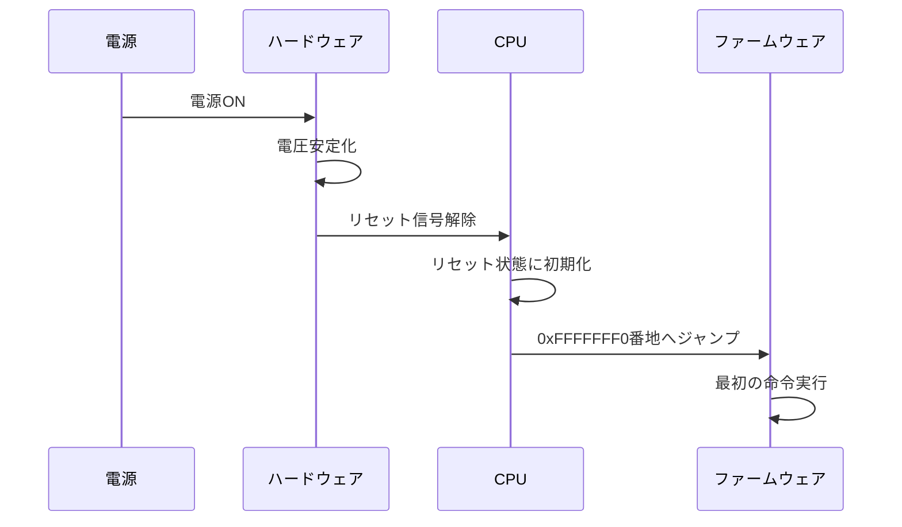
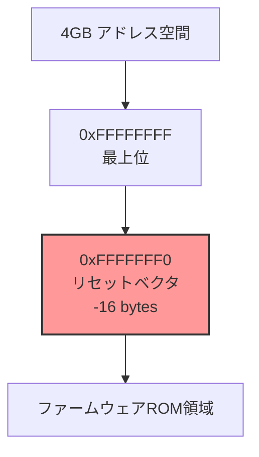
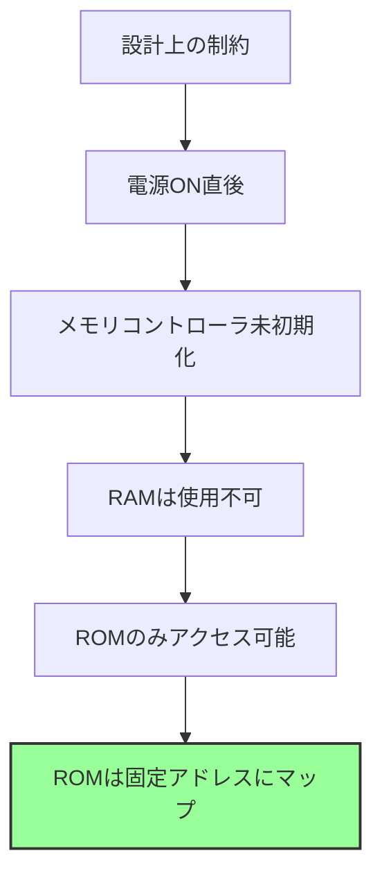
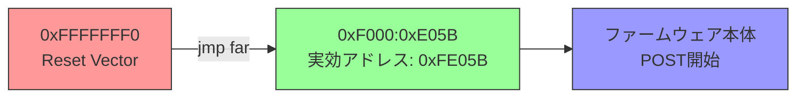
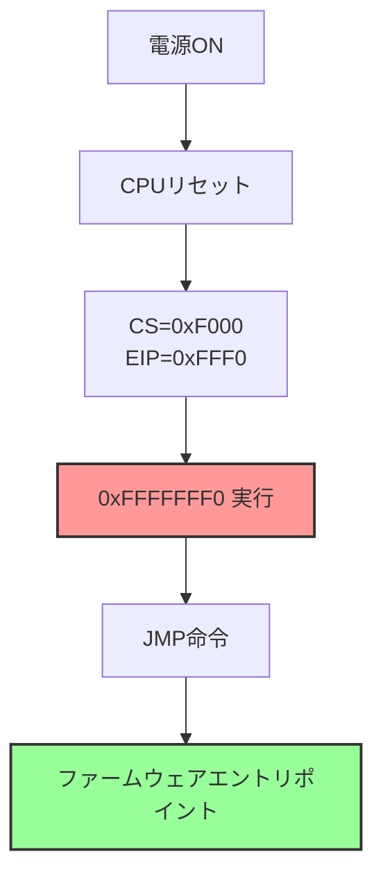
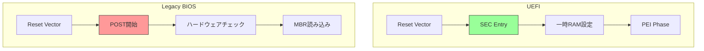
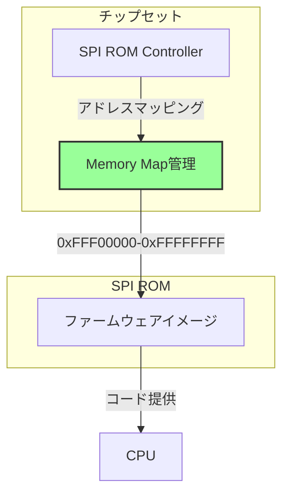
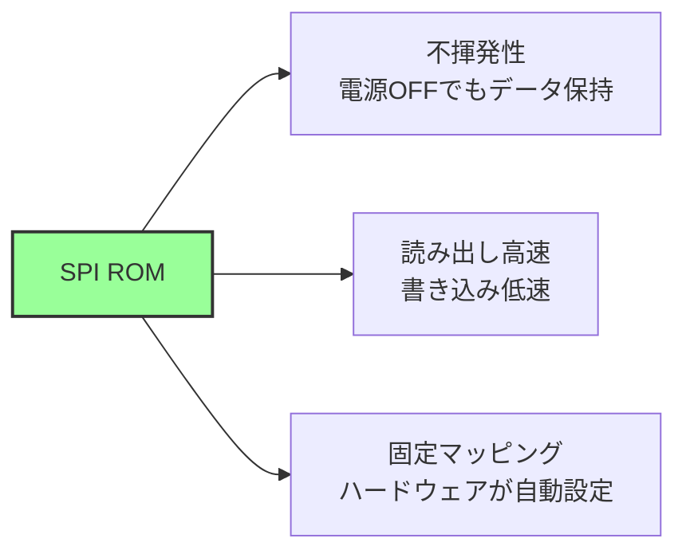
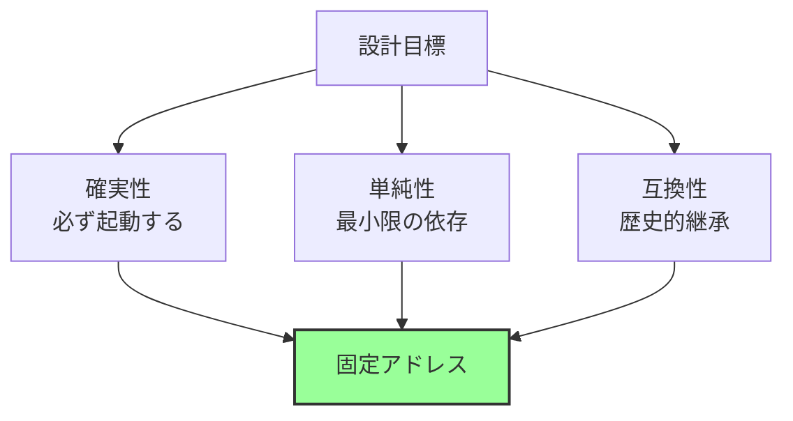

# リセットから最初の命令まで

🎯 **この章で学ぶこと**
- x86_64 CPUのリセット時の状態
- リセットベクタとは何か
- 最初の命令が実行されるまでの流れ
- ファームウェアがどこに配置されるか

📚 **前提知識**
- CPUとメモリの基本概念
- アドレス空間の概念

---

## 電源投入の瞬間

コンピュータの電源を入れた瞬間、何が起こるのでしょうか。この単純な行為の背後では、極めて精密に設計された一連のプロセスが始動します。電源が供給されると、まずハードウェアが電圧を安定化させます。電源電圧が規定値に達するまで、CPU はリセット信号によって動作を停止した状態に保たれます。電圧が安定すると、リセット信号が解除され、CPU が動作を開始します。

CPU はリセット信号が解除されると、すべてのレジスタを初期状態にリセットします。この初期状態は、x86_64 アーキテクチャで厳密に定義されており、すべての CPU が同じ状態から実行を開始します。そして、CPU は特定のアドレス、0xFFFFFFF0 番地へジャンプします。このアドレスには、ファームウェアの最初の命令が配置されています。ファームウェアは、この最初の命令から実行を開始し、システムの初期化プロセスを進めていきます。

この章では、CPU がリセット状態から最初の命令を実行するまでの流れを詳しく見ていきます。なぜ CPU は 0xFFFFFFF0 番地から実行を開始するのか、このアドレスにはどのような命令が配置されているのか、そしてファームウェアがどこに配置されるのかを理解します。

**補足図**: 以下のシーケンス図は、電源投入から最初の命令実行までの流れを示したものです。



## CPUリセット時の状態

### x86_64 のリセット動作

x86_64 アーキテクチャの CPU は、リセット時に厳密に定義された状態になります。この初期状態は、Intel Software Developer's Manual (SDM) で規定されており、すべての x86_64 CPU が同じ振る舞いをします。この一貫性により、ファームウェアは CPU の初期状態を前提として、確実に動作することができます。

リセット時の主要なレジスタは、特定の値に初期化されます。コードセグメントレジスタ (CS) は 0xF000 に、命令ポインタ (EIP) は 0xFFF0 に設定されます。これらの値を組み合わせると、実効アドレスは 0xFFFFFFF0 となります。制御レジスタ CR0 は 0x60000010 に設定され、CPU はリアルモードで動作を開始します。フラグレジスタ (EFLAGS) は 0x00000002 に初期化されます。

**参考表**: 以下の表は、リセット時の主要なレジスタの初期値をまとめたものです。

| レジスタ | 初期値 | 意味 |
|---------|--------|------|
| **CS** (Code Segment) | 0xF000 | コードセグメント |
| **EIP** (Instruction Pointer) | 0xFFF0 | 命令ポインタ |
| **実効アドレス** | 0xFFFFFFF0 | 実際のアドレス |
| **CR0** | 0x60000010 | 制御レジスタ（リアルモード） |
| **EFLAGS** | 0x00000002 | フラグレジスタ |

### なぜ 0xFFFFFFF0 なのか

CPU がリセット後に 0xFFFFFFF0 番地から実行を開始するのには、設計上の重要な理由があります。まず、このアドレスは 4GB アドレス空間の最上位付近に位置します。32bit アドレス空間の上端である 0xFFFFFFFF から、わずか 16 バイト下のアドレスです。この位置にリセットベクタを配置することで、ファームウェア ROM を固定的な場所にマッピングできます。

ファームウェア ROM は、メモリマップ上の固定位置に配置されます。電源投入直後、DRAM はまだ初期化されていませんが、ROM は電源が入れば即座にアクセス可能です。そのため、CPU が最初にアクセスするアドレスは、必ず ROM 領域になければなりません。4GB 空間の最上位付近にファームウェア ROM をマッピングすることで、この要件を満たしています。

また、この設計には後方互換性という側面もあります。8086 以来、x86 アーキテクチャは常にリセット時に最上位アドレス付近から実行を開始してきました。この伝統を引き継ぐことで、既存のファームウェア設計を維持しながら、新しいアーキテクチャへ移行できました。

**補足図**: 以下の図は、リセットベクタが 4GB アドレス空間のどこに位置するかを示したものです。



### リセットベクタ (Reset Vector)

**リセットベクタ**とは、CPUがリセット後に最初に実行する命令が配置されるアドレスです。

```
アドレス 0xFFFFFFF0:
  EA 5B E0 00 F0    ; jmp far F000:E05B
```

このアドレスには、通常**ジャンプ命令**が配置されています。

**理由:**
- 16バイトしかスペースがない
- 実際のファームウェアコードは別の場所にある
- ジャンプ命令で本体へ移動

## メモリマップとファームウェアの配置

### リセット直後のメモリマップ

```
0xFFFFFFFF ┌──────────────────┐
           │                  │
0xFFFFFFF0 │  Reset Vector    │ ← CPU が最初にここへ
           │                  │
0xFFF00000 │  BIOS ROM (1MB)  │
           │  ファームウェア    │
0xFEF00000 ├──────────────────┤
           │                  │
           │  (未使用)         │
           │                  │
0x00100000 ├──────────────────┤
           │  Extended Memory │
0x000A0000 ├──────────────────┤
           │  Video Memory    │
0x00000000 └──────────────────┘
```

### ファームウェアROMの配置

**なぜ最上位に配置されるのか:**



**重要な点:**

1. **RAMは初期化されていない**
   - 電源ON直後、DRAMは未初期化
   - ファームウェアがDRAMを初期化する

2. **ROMは常にアクセス可能**
   - フラッシュメモリ（SPI ROM）
   - チップセットが固定アドレスにマップ

3. **ハードウェアによる自動マッピング**
   - CPUとチップセットの協調動作
   - ソフトウェアの介入不要

## 最初の命令の実行

### リセットベクタの命令

x86_64 では、リセットベクタに**JMP命令**が配置されます：

```asm
; アドレス 0xFFFFFFF0
jmp far 0xF000:0xE05B    ; セグメント:オフセット形式
```

**この命令の意味:**



### セグメント:オフセット形式

x86 CPUはリセット時に**リアルモード**で起動します。

**リアルモードのアドレス計算:**

```
実効アドレス = (セグメント << 4) + オフセット
            = (0xF000 << 4) + 0xE05B
            = 0xF0000 + 0xE05B
            = 0xFE05B
```

**なぜセグメント形式なのか:**

| 理由 | 説明 |
|------|------|
| 後方互換性 | 8086 以来のアーキテクチャ |
| 20bitアドレッシング | リアルモードの制約 |
| 歴史的経緯 | 1MBメモリ空間の時代の設計 |

## ファームウェアの起動プロセス

### ステージ1: リセットベクタ



### ステージ2: ファームウェアエントリポイント

ジャンプ先で、ファームウェアが本格的に動作を開始します：

```asm
; 0xFE05B (例)
cli                      ; 割り込み禁止
cld                      ; 方向フラグクリア
mov  ax, 0xF000          ; データセグメント設定
mov  ds, ax
mov  es, ax
mov  ss, ax
; ... 初期化処理継続
```

**主な処理:**

1. **レジスタ初期化**
   - セグメントレジスタ設定
   - スタックポインタ設定

2. **基本的なハードウェアチェック**
   - CPU IDの確認
   - キャッシュの設定

3. **次のステージへ遷移**
   - UEFIの場合: SEC フェーズ
   - レガシーBIOSの場合: POST

## UEFI と レガシーBIOS の違い

### リセットベクタの扱い



### 共通点と相違点

| 項目 | UEFI | レガシーBIOS |
|------|------|-------------|
| **リセットベクタ** | 0xFFFFFFF0 | 0xFFFFFFF0（同じ） |
| **初期モード** | リアルモード | リアルモード（同じ） |
| **次のフェーズ** | SEC → PEI | POST |
| **メモリ初期化** | PEI で実施 | POST で実施 |
| **モード遷移** | 早期に64bitへ | 16bitを継続 |

## ハードウェアの役割

### チップセットの責務



**チップセットの役割:**

1. **SPIフラッシュROMのマッピング**
   - 物理デバイスをメモリ空間に配置
   - 固定アドレス（通常 4GB 付近）

2. **電源シーケンス制御**
   - 電圧の安定化
   - リセット信号の管理

3. **初期バス設定**
   - CPU-メモリ間のバス
   - 低速デバイスへのアクセス

### SPI ROM (Flash Memory)

**SPIフラッシュの特性:**



## なぜこの設計なのか

### 設計思想



**重要な設計原則:**

1. **決定論的動作**
   - リセット時の状態は完全に決まっている
   - デバッグ容易

2. **最小限の依存**
   - RAM不要
   - 他のハードウェア不要

3. **後方互換性**
   - 30年以上継承されている
   - 既存のツール・知識が使える

## まとめ

この章では、CPU がリセットされてから最初の命令を実行するまでの流れを詳しく説明しました。コンピュータの電源を入れるという単純な行為の背後で、精密に設計されたプロセスが始動することを学びました。

x86_64 CPU はリセット時に、厳密に定義された初期状態になります。すべてのレジスタが特定の値に初期化され、CPU は 0xFFFFFFF0 番地から実行を開始します。この位置をリセットベクタと呼びます。リセットベクタには、わずか 16 バイトのスペースしかないため、通常は JMP 命令が配置されており、ファームウェア本体へジャンプします。

ファームウェアは、SPI ROM に格納されています。チップセットは、この ROM を 4GB アドレス空間の最上位付近に固定的にマッピングします。リセット直後は RAM がまだ初期化されていないため、CPU がアクセスできるのは ROM のみです。したがって、リセットベクタは必ず ROM 領域に配置される必要があり、これが 0xFFFFFFF0 という位置が選ばれた理由の一つです。

この一連の流れは、x86 アーキテクチャの長い歴史の中で洗練されてきました。8086 以来の後方互換性を維持しながら、現代の 64bit CPU でも同じ基本原理が使われています。電源投入から最初の命令実行までのこのプロセスは、すべてのファームウェアの出発点であり、以降のブートプロセス全体の基盤となります。

**補足図**: 以下の図は、電源投入からファームウェアエントリポイントまでの流れを要約したものです。


次章では、メモリマップと E820 の仕組みを見ていきます。ファームウェアは、システムのメモリ構成を把握し、OS に伝える必要があります。E820 は、この情報を提供する重要な仕組みです。

---

📚 **参考資料**
- [Intel® 64 and IA-32 Architectures Software Developer's Manual - Volume 3, Chapter 9: Processor Management and Initialization](https://www.intel.com/sdm)
- [AMD64 Architecture Programmer's Manual - Volume 2, Chapter 14: Processor Initialization and Long Mode](https://www.amd.com/en/support/tech-docs)
- [UEFI Specification v2.10 - Section 2.3: Boot Phases](https://uefi.org/specifications)
