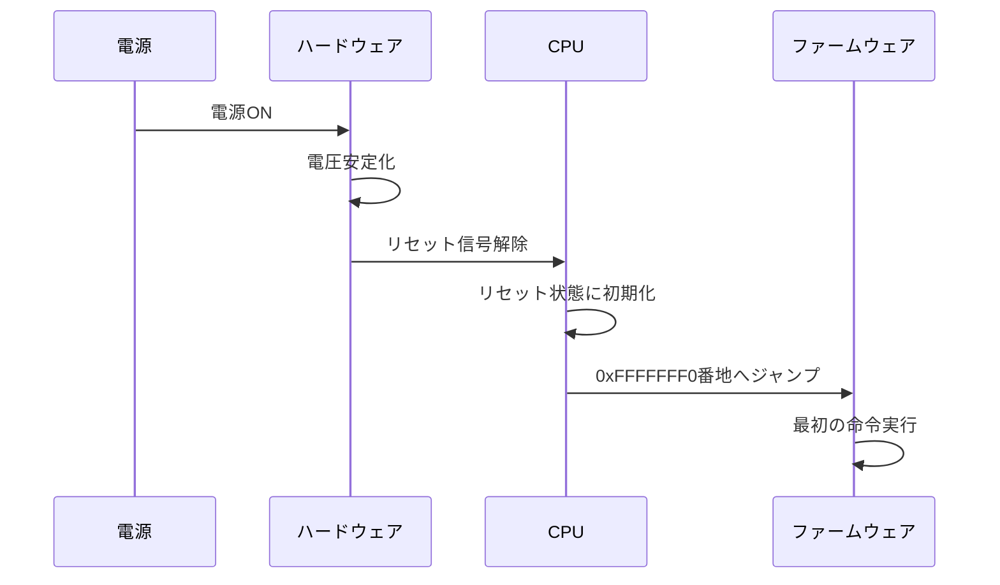
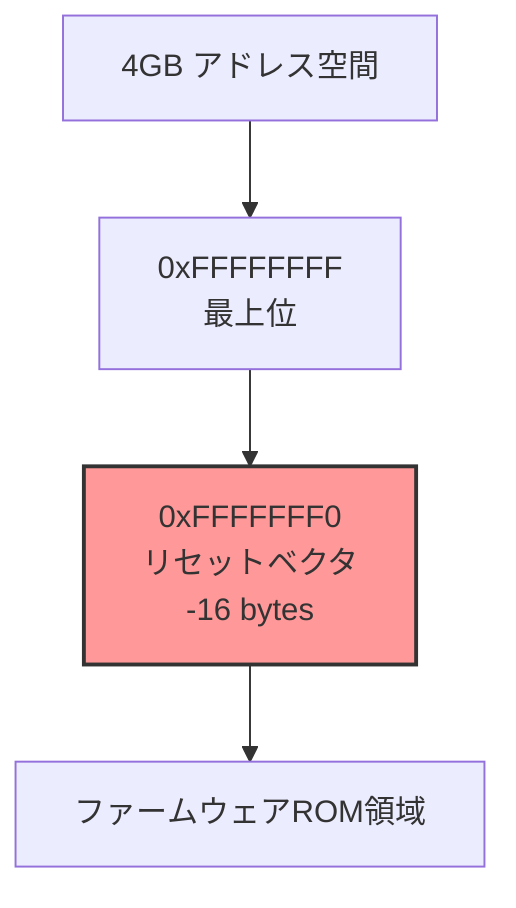
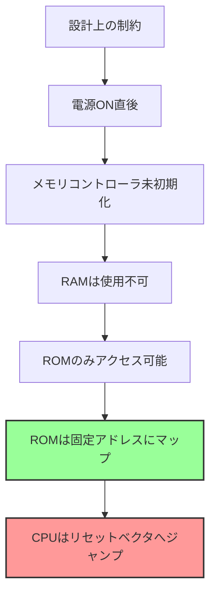
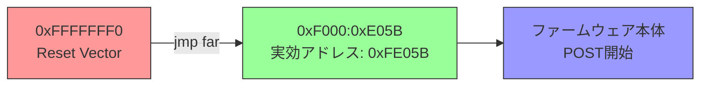
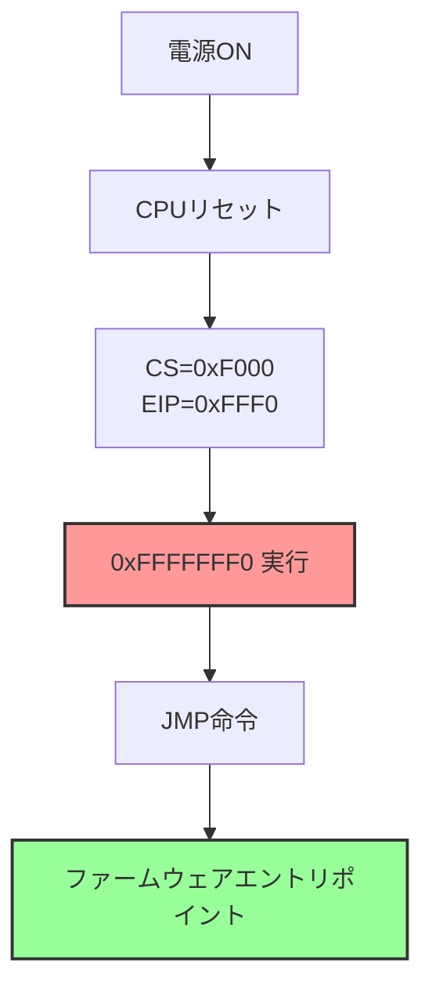
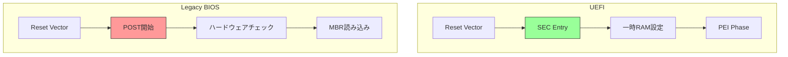
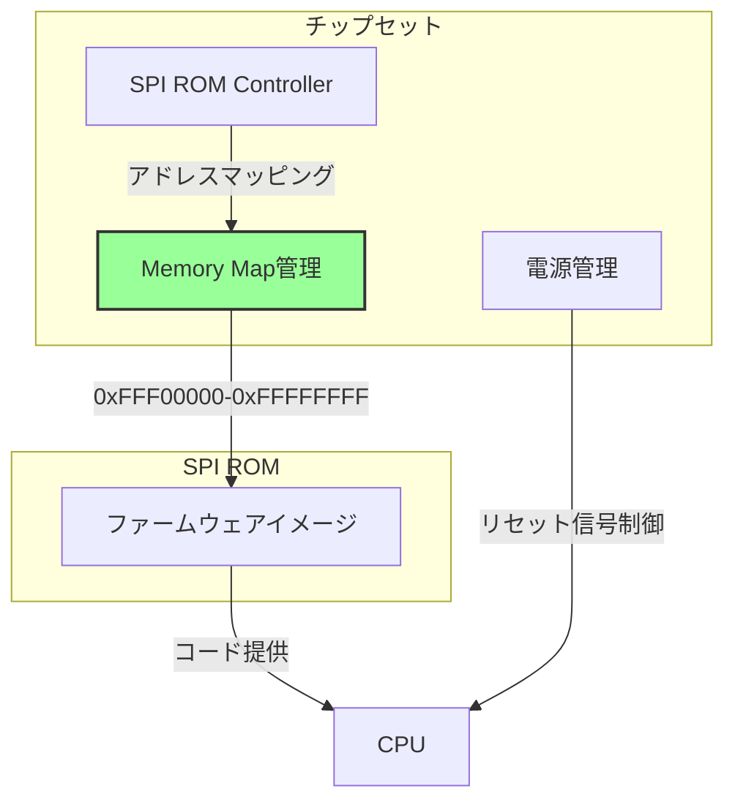
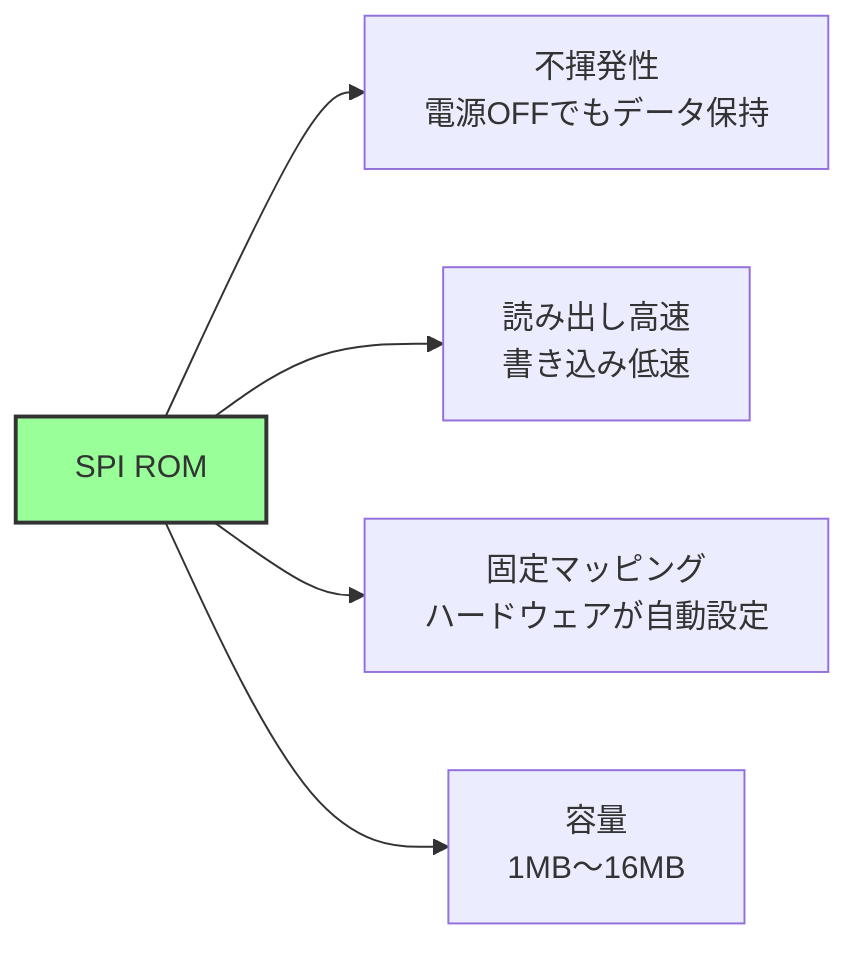
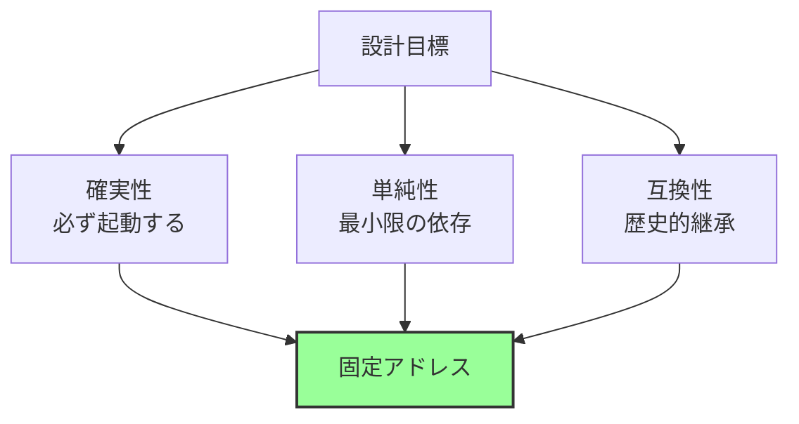

# リセットから最初の命令まで

🎯 **この章で学ぶこと**
- x86_64 CPUのリセット時の状態
- リセットベクタとは何か
- 最初の命令が実行されるまでの流れ
- ファームウェアがどこに配置されるか

📚 **前提知識**
- CPUとメモリの基本概念
- アドレス空間の概念

---

## 電源投入の瞬間

コンピュータの電源を入れた瞬間、何が起こるのでしょうか。この単純な行為の背後では、極めて精密に設計された一連のプロセスが始動します。電源が供給されると、まずハードウェアが電圧を安定化させます。電源電圧が規定値に達するまで、CPU はリセット信号によって動作を停止した状態に保たれます。電圧が安定すると、リセット信号が解除され、CPU が動作を開始します。

CPU はリセット信号が解除されると、すべてのレジスタを初期状態にリセットします。この初期状態は、x86_64 アーキテクチャで厳密に定義されており、すべての CPU が同じ状態から実行を開始します。そして、CPU は特定のアドレス、0xFFFFFFF0 番地へジャンプします。このアドレスには、ファームウェアの最初の命令が配置されています。ファームウェアは、この最初の命令から実行を開始し、システムの初期化プロセスを進めていきます。

この章では、CPU がリセット状態から最初の命令を実行するまでの流れを詳しく見ていきます。なぜ CPU は 0xFFFFFFF0 番地から実行を開始するのか、このアドレスにはどのような命令が配置されているのか、そしてファームウェアがどこに配置されるのかを理解します。

**補足図**: 以下のシーケンス図は、電源投入から最初の命令実行までの流れを示したものです。



## CPUリセット時の状態

### x86_64 のリセット動作

x86_64 アーキテクチャの CPU は、リセット時に厳密に定義された状態になります。この初期状態は、Intel Software Developer's Manual (SDM) で規定されており、すべての x86_64 CPU が同じ振る舞いをします。この一貫性により、ファームウェアは CPU の初期状態を前提として、確実に動作することができます。

リセット時の主要なレジスタは、特定の値に初期化されます。コードセグメントレジスタ (CS) は 0xF000 に、命令ポインタ (EIP) は 0xFFF0 に設定されます。これらの値を組み合わせると、実効アドレスは 0xFFFFFFF0 となります。制御レジスタ CR0 は 0x60000010 に設定され、CPU はリアルモードで動作を開始します。フラグレジスタ (EFLAGS) は 0x00000002 に初期化されます。

**参考表**: 以下の表は、リセット時の主要なレジスタの初期値をまとめたものです。

| レジスタ | 初期値 | 意味 |
|---------|--------|------|
| **CS** (Code Segment) | 0xF000 | コードセグメント |
| **EIP** (Instruction Pointer) | 0xFFF0 | 命令ポインタ |
| **実効アドレス** | 0xFFFFFFF0 | 実際のアドレス |
| **CR0** | 0x60000010 | 制御レジスタ（リアルモード） |
| **EFLAGS** | 0x00000002 | フラグレジスタ |

### なぜ 0xFFFFFFF0 なのか

CPU がリセット後に 0xFFFFFFF0 番地から実行を開始するのには、設計上の重要な理由があります。まず、このアドレスは 4GB アドレス空間の最上位付近に位置します。32bit アドレス空間の上端である 0xFFFFFFFF から、わずか 16 バイト下のアドレスです。この位置にリセットベクタを配置することで、ファームウェア ROM を固定的な場所にマッピングできます。

ファームウェア ROM は、メモリマップ上の固定位置に配置されます。電源投入直後、DRAM はまだ初期化されていませんが、ROM は電源が入れば即座にアクセス可能です。そのため、CPU が最初にアクセスするアドレスは、必ず ROM 領域になければなりません。4GB 空間の最上位付近にファームウェア ROM をマッピングすることで、この要件を満たしています。

また、この設計には後方互換性という側面もあります。8086 以来、x86 アーキテクチャは常にリセット時に最上位アドレス付近から実行を開始してきました。この伝統を引き継ぐことで、既存のファームウェア設計を維持しながら、新しいアーキテクチャへ移行できました。

**補足図**: 以下の図は、リセットベクタが 4GB アドレス空間のどこに位置するかを示したものです。



<div style="border: 2px solid #4a90e2; border-radius: 8px; padding: 10px 20px 20px 20px; margin: 20px 0;">

## 💡 コラム: なぜリセットベクタは 0xFFFFFFF0 なのか - 40年続く設計判断

**🕰️ 歴史的エピソード**

x86 CPU がリセット後に 0xFFFFFFF0 番地から実行を開始するという設計は、1978年の Intel 8086 に由来する歴史的な決定です。しかし、8086 は 16bit CPU であり、アドレス空間は 1MB (0x00000 - 0xFFFFF) しかありませんでした。なぜ当時は 0xFFFF0 だったリセットベクタが、現代の 64bit CPU でも 0xFFFFFFF0 として維持されているのでしょうか。その答えは、x86 アーキテクチャの「互換性への執念」にあります。

Intel 8086 がリセット後に実行を開始するアドレスは、CS:IP = 0xFFFF:0x0000 であり、実効アドレスは 0xFFFF0 でした。これは 1MB 空間の最上位から 16 バイト下のアドレスです。なぜ Intel はこのアドレスを選んだのでしょうか。第一の理由は、ROM の配置です。当時の ROM は高価であり、サイズも限られていました（通常 8KB から 16KB）。ROM を最上位アドレスに配置することで、ROM のサイズに関わらず、常に同じリセットベクタを使用できます。例えば、8KB ROM なら 0xFE000 から 0xFFFFF に配置し、16KB ROM なら 0xFC000 から 0xFFFFF に配置します。いずれの場合も、最上位 16 バイトにリセットベクタを配置できます。

第二の理由は、ハードウェア設計の単純化です。CPU がリセット時に「最上位アドレス付近」へジャンプすると決めておけば、チップセット設計者は ROM を最上位にマッピングするだけで済みます。下位アドレスから実行を開始する設計だと、ROM のサイズが変わるたびにメモリマップを調整する必要があります。最上位から配置する方式により、ROM サイズの柔軟性が確保されました。

1982年、Intel は 80286 を発表しました。80286 は 16MB のアドレス空間を持つ 16bit プロテクトモードをサポートしましたが、リセット時は 8086 互換のリアルモードで起動しました。そのため、リセットベクタも 0xFFFF0 のままでした。1985年、80386 が登場し、32bit アドレス空間（4GB）をサポートしました。ここで Intel は重要な決断を下しました。80386 のリセットベクタを 0xFFFFFFF0 に変更したのです。これは、8086 の 0xFFFF0 を 32bit 空間に拡張したアドレスです。この変更により、32bit 空間全体でファームウェアを配置できるようになりました。

80386 以降、すべての x86 CPU は 0xFFFFFFF0 からリセット後の実行を開始します。64bit モード（Long Mode）をサポートする x86_64 CPU も、リセット時は 32bit プロテクトモード（実際にはリアルモードエミュレーション）で起動し、0xFFFFFFF0 から実行を開始します。64bit 空間の最上位（0xFFFFFFFFFFFFFFF0）から実行するのではなく、あくまで 32bit 空間の最上位から実行します。これは、既存の BIOS との互換性を保つためです。

興味深いのは、他のアーキテクチャとの比較です。ARM アーキテクチャでは、リセットベクタは SoC（System on Chip）によって異なります。ARM は「リセット後は 0x00000000 番地から実行する」という規約がありますが、これは論理アドレスであり、物理アドレスは SoC 設計者が自由に決められます。多くの ARM SoC では、0x00000000 を ROM にマッピングするか、または外部 Flash にマッピングします。RISC-V アーキテクチャも同様に、リセットベクタは実装依存です。RISC-V では、mtvec レジスタでベクタアドレスを設定できます。

x86 の「0xFFFFFFF0 固定」という設計は、柔軟性に欠けると批判されることもあります。SoC 設計者は、必ず最上位アドレスに ROM または Flash をマッピングしなければならず、メモリマップの自由度が制限されます。しかし、この「不自由さ」こそが、x86 の互換性を保証しています。どのベンダーの x86 CPU でも、どのベンダーのマザーボードでも、リセット後の動作は全く同じです。BIOS ベンダーは、CPU やチップセットの違いを気にせず、0xFFFFFFF0 にコードを配置すれば良いのです。

現代の UEFI ファームウェアでも、この 0xFFFFFFF0 リセットベクタは健在です。EDK II のコードを見ると、`ResetVector` ディレクトリに、まさにこのアドレスに配置されるアセンブリコードがあります。このコードは、わずか数命令で構成され、実際のファームウェア本体（SEC Core）へジャンプします。40年前の設計判断が、現代の最新ファームウェアにも引き継がれているのです。

本章で学ぶ「なぜ 0xFFFFFFF0 なのか」という疑問は、単なる技術的な仕様ではなく、x86 アーキテクチャの歴史と互換性への執念を物語っています。8086 の 1MB 制約から始まり、80286 の 16MB、80386 の 4GB、そして x86_64 の 64bit 空間へと拡張されながらも、リセットベクタの位置は一貫して「最上位から 16 バイト下」に保たれています。この一貫性こそが、40年以上にわたって x86 が市場を支配し続けた理由の一つです。

**📚 参考資料**
- Intel 8086 User's Manual (1978) - 初代 x86 の仕様書
- Intel® 64 and IA-32 Architectures Software Developer's Manual, Volume 3 - Chapter 9: Processor Management and Initialization
- ["The Evolution of x86 Reset Vector"](https://wiki.osdev.org/Reset_Vector) - OSDev Wiki
- ARM Architecture Reference Manual - Exception Handling

</div>

### リセットベクタ (Reset Vector)

**リセットベクタ**とは、CPU がリセット後に最初に実行する命令が配置されるアドレスです。x86_64 アーキテクチャでは、このアドレスは 0xFFFFFFF0 に固定されています。リセットベクタは、ファームウェアの実行が始まる出発点であり、すべてのブートプロセスの起点となります。

リセットベクタに配置される命令は、通常**ジャンプ命令**です。以下は、実際のバイトコードの例です：

```
アドレス 0xFFFFFFF0:
  EA 5B E0 00 F0    ; jmp far F000:E05B
```

このバイトコードは、x86 の far jump 命令であり、セグメント:オフセット形式で別のアドレスへジャンプします。`EA` は far jump のオペコード、`5B E0` はオフセット 0xE05B、`00 F0` はセグメント 0xF000 を表します。

**なぜジャンプ命令なのか：**

リセットベクタにジャンプ命令が配置される理由は、スペースの制約にあります。0xFFFFFFF0 から 4GB アドレス空間の最上位 0xFFFFFFFF までは、わずか 16 バイトしかありません。このわずかなスペースに、ファームウェア全体を配置することは不可能です。したがって、リセットベクタには、実際のファームウェアコードが配置されている場所へジャンプする命令だけを配置します。

実際のファームウェアコード（ファームウェアエントリポイント）は、別のアドレスに配置されています。通常、このアドレスは 4GB 空間のやや下位（例: 0xFE000000 付近）にあり、十分なスペースが確保されています。リセットベクタのジャンプ命令により、CPU はこのエントリポイントへジャンプし、そこから本格的なファームウェアの実行が始まります。

**UEFI と Legacy BIOS でのリセットベクタ：**

UEFI と Legacy BIOS の両方で、リセットベクタの基本的な役割は同じです。どちらも 0xFFFFFFF0 にジャンプ命令を配置し、ファームウェアエントリポイントへジャンプします。しかし、ジャンプ先での処理内容は異なります。

UEFI の場合、ジャンプ先は SEC (Security Phase) のエントリポイントです。SEC Core は、CPU を保護モードや ロングモードへ遷移させ、一時 RAM を設定し、PEI フェーズへ移行します。EDK II では、`ResetVector` ディレクトリにこのコードが含まれています。

Legacy BIOS の場合、ジャンプ先は POST (Power-On Self-Test) のエントリポイントです。POST は、ハードウェアの自己診断を実行し、基本的なデバイスを初期化し、MBR (Master Boot Record) をロードしてブートローダを起動します。

**EDK II でのリセットベクタの実装：**

EDK II では、リセットベクタは `OvmfPkg/ResetVector` ディレクトリに含まれています。以下は、簡略化されたリセットベクタのコード例です：

```asm
; ResetVector.asm
BITS 16

; リセットベクタ（0xFFFFFFF0 に配置）
ALIGN 16
resetVector:
    ; FFFFFFFx から 16 バイト戻った位置
    nop
    nop
    jmp     short EarlyBspInitReal16  ; 短いジャンプで近くのコードへ

; 実際のエントリポイント
EarlyBspInitReal16:
    cli                    ; 割り込み禁止
    mov     ax, 0xF000     ; セグメント設定
    mov     ds, ax
    ; ... さらなる初期化処理
    jmp     TransitionTo32BitFlat  ; 32-bit モードへ遷移
```

このコードは、まず短いジャンプ命令で近くの `EarlyBspInitReal16` ラベルへジャンプします。そこで、基本的なレジスタ初期化を行い、その後 32-bit プロテクトモードへの遷移を行います。このように、リセットベクタは単なる「入口」であり、実際の処理は別の場所で行われます。

## メモリマップとファームウェアの配置

### リセット直後のメモリマップ

コンピュータのメモリ空間は、電源投入直後から特定の構造を持っています。CPU がリセットされた瞬間、メモリコントローラはまだ初期化されていませんが、チップセットによって基本的なメモリマップが設定されています。このメモリマップは、ファームウェアが動作を開始するために不可欠です。

```
0xFFFFFFFF ┌──────────────────┐ ← 4GB の最上位
           │                  │
0xFFFFFFF0 │  Reset Vector    │ ← CPU が最初にここへジャンプ
           │  (16 bytes)      │
0xFFF00000 ├──────────────────┤
           │  BIOS ROM (1MB)  │ ← ファームウェアイメージ全体
           │  ファームウェア    │    （通常 1MB～16MB）
           │                  │
0xFEF00000 ├──────────────────┤ ← ROM の下端（サイズにより変動）
           │                  │
           │  (未使用領域)     │ ← この領域は使用されない
           │  または           │    または PCIe MMIO など
           │  PCIe MMIO       │
           │                  │
0x00100000 ├──────────────────┤ ← 1MB 境界
           │  Extended Memory │ ← 拡張メモリ領域
           │  (DRAM)          │    （未初期化状態）
0x000A0000 ├──────────────────┤ ← 640KB 境界
           │  Video Memory    │ ← ビデオ RAM（VGA 互換）
           │  (VGA)           │    0xA0000～0xBFFFF
0x00080000 ├──────────────────┤
           │  Conventional    │ ← 従来メモリ
           │  Memory          │    （DRAM、未初期化）
           │  (DRAM)          │
0x00000000 └──────────────────┘ ← アドレス空間の最下位
```

**メモリマップの詳細説明：**

**0xFFF00000 - 0xFFFFFFFF (16MB の最上位 1MB)：BIOS ROM 領域**

この領域には、ファームウェアイメージが配置されています。チップセットは、SPI Flash ROM をこの領域にマッピングします。ファームウェアのサイズは、プラットフォームによって異なりますが、通常 1MB から 16MB です。現代の UEFI ファームウェアは、Legacy BIOS よりも大きく、8MB 以上のサイズが一般的です。

リセットベクタ（0xFFFFFFF0）も、この ROM 領域の一部です。リセットベクタから 4GB の最上位（0xFFFFFFFF）までの 16 バイトには、ジャンプ命令とパディングが配置されています。

**0x000A0000 - 0x000FFFFF (640KB から 1MB まで)：レガシー領域**

この領域は、IBM PC 互換機の歴史的な制約により、特別な用途に予約されています。0xA0000 から 0xBFFFF までの 128KB は、ビデオ RAM (VGA) として使用されます。0xC0000 から 0xFFFFF までは、BIOS 拡張 ROM や BIOS データ領域として使用されます。現代のシステムでも、互換性のためにこの領域は維持されています。

**0x00000000 - 0x0009FFFF (0 から 640KB まで)：従来メモリ**

この領域は、DOS 時代の「従来メモリ（Conventional Memory）」と呼ばれる領域です。リセット直後、この領域の DRAM は未初期化状態です。ファームウェアが DRAM を初期化した後、この領域は OS やアプリケーションによって使用されます。

**0x00100000 以降：拡張メモリ**

1MB 以上の領域は、拡張メモリと呼ばれます。現代のシステムでは、数 GB から数百 GB の DRAM がこの領域に配置されます。リセット直後、この DRAM も未初期化状態です。

### ファームウェアROMの配置

ファームウェア ROM が最上位アドレスに配置される理由は、ハードウェアの制約と設計思想にあります。

**なぜ最上位に配置されるのか：**



**詳細な理由：**

**1. RAM は初期化されていない**

電源 ON 直後、DRAM（Dynamic RAM）は未初期化状態です。DRAM は、電荷をキャパシタに保持することでデータを記憶しますが、電源投入直後はこの電荷が不定です。したがって、DRAM の内容はランダムであり、信頼できるコードを配置することはできません。

DRAM を使用可能にするには、メモリコントローラの初期化が必要です。メモリコントローラは、DRAM のタイミングパラメータを設定し、リフレッシュサイクルを開始します。さらに、DRAM トレーニング（最適なタイミング設定の探索）を実行し、各メモリモジュールに対して最適な設定を決定します。この初期化処理は、ファームウェアの PEI フェーズで実行されます。

したがって、ファームウェアの最初のコードは、DRAM に配置することはできません。DRAM が使用可能になる前に、ファームウェア自身が DRAM を初期化する必要があるからです。

**2. ROM は常にアクセス可能**

フラッシュメモリ（SPI ROM）は、不揮発性メモリであり、電源が投入された瞬間からアクセス可能です。初期化は不要であり、チップセットが自動的にメモリ空間にマッピングします。このマッピングは、ハードウェアによって固定的に行われ、ソフトウェアの介入は必要ありません。

SPI ROM は、Serial Peripheral Interface (SPI) バスを介してチップセットに接続されています。チップセットの SPI コントローラは、SPI ROM を読み取り、その内容をメモリ空間にマッピングします。このマッピングは、メモリマップド I/O として実装されており、CPU は通常のメモリアクセス命令で ROM の内容を読み取れます。

**3. ハードウェアによる自動マッピング**

チップセットは、電源投入時に自動的に SPI ROM を 4GB アドレス空間の最上位にマッピングします。この動作は、ハードウェアによって固定的に定義されており、BIOS 設定や OS の設定とは無関係です。CPU がリセットされると、0xFFFFFFF0 へジャンプしますが、このアドレスは既に SPI ROM にマッピングされているため、CPU は即座にファームウェアのコードを実行できます。

このハードウェアによる自動マッピングにより、ファームウェアの起動は確実で決定論的です。ソフトウェアの設定ミスや状態の不整合によって、起動に失敗するリスクが最小化されます。

**SPI ROM のサイズとマッピング：**

SPI ROM のサイズは、プラットフォームによって異なります。一般的なサイズは、1MB、2MB、4MB、8MB、16MB です。チップセットは、ROM のサイズを自動検出し、適切なアドレスにマッピングします。

例えば、8MB の SPI ROM の場合、0xFF800000 から 0xFFFFFFFF までの領域にマッピングされます。16MB の場合は、0xFF000000 から 0xFFFFFFFF までです。いずれの場合も、リセットベクタ（0xFFFFFFF0）は ROM 領域の一部であり、CPU は正しくファームウェアのコードを実行できます。

**ROM のアクセス特性：**

SPI ROM は、読み取り専用（Read-Only）としてマッピングされます。書き込み命令を実行しても、実際には書き込まれません（または例外が発生します）。ファームウェアの更新（BIOS アップデート）を行う場合は、専用の書き込み手順が必要です。通常、SPI コントローラを直接制御し、ROM へのアクセスを一時的に書き込み可能モードに切り替えます。

## 最初の命令の実行

### リセットベクタの命令

x86_64 では、リセットベクタに**JMP命令**が配置されます：

```asm
; アドレス 0xFFFFFFF0
jmp far 0xF000:0xE05B    ; セグメント:オフセット形式
```

**この命令の意味:**



### セグメント:オフセット形式

x86 CPUはリセット時に**リアルモード**で起動します。

**リアルモードのアドレス計算:**

```
実効アドレス = (セグメント << 4) + オフセット
            = (0xF000 << 4) + 0xE05B
            = 0xF0000 + 0xE05B
            = 0xFE05B
```

**なぜセグメント形式なのか:**

| 理由 | 説明 |
|------|------|
| 後方互換性 | 8086 以来のアーキテクチャ |
| 20bitアドレッシング | リアルモードの制約 |
| 歴史的経緯 | 1MBメモリ空間の時代の設計 |

## ファームウェアの起動プロセス

### ステージ1: リセットベクタ



### ステージ2: ファームウェアエントリポイント

ジャンプ先で、ファームウェアが本格的に動作を開始します：

```asm
; 0xFE05B (例)
cli                      ; 割り込み禁止
cld                      ; 方向フラグクリア
mov  ax, 0xF000          ; データセグメント設定
mov  ds, ax
mov  es, ax
mov  ss, ax
; ... 初期化処理継続
```

**主な処理:**

1. **レジスタ初期化**
   - セグメントレジスタ設定
   - スタックポインタ設定

2. **基本的なハードウェアチェック**
   - CPU IDの確認
   - キャッシュの設定

3. **次のステージへ遷移**
   - UEFIの場合: SEC フェーズ
   - レガシーBIOSの場合: POST

## UEFI と レガシーBIOS の違い

### リセットベクタの扱い



### 共通点と相違点

| 項目 | UEFI | レガシーBIOS |
|------|------|-------------|
| **リセットベクタ** | 0xFFFFFFF0 | 0xFFFFFFF0（同じ） |
| **初期モード** | リアルモード | リアルモード（同じ） |
| **次のフェーズ** | SEC → PEI | POST |
| **メモリ初期化** | PEI で実施 | POST で実施 |
| **モード遷移** | 早期に64bitへ | 16bitを継続 |

## ハードウェアの役割

ファームウェアの起動は、CPU 単独では実現できません。チップセット、SPI ROM、電源回路といった複数のハードウェアコンポーネントが協調して動作することで、初めて実現されます。このセクションでは、各ハードウェアコンポーネントの役割と、それらがどのように連携するかを詳しく見ていきます。

### チップセットの責務

チップセットは、CPU とその他のハードウェアコンポーネントを橋渡しする重要な役割を持ちます。特に、ファームウェアの起動において、チップセットは不可欠な機能を提供します。



**チップセットの主要な役割：**

**1. SPI フラッシュ ROM のマッピング**

チップセットの最も重要な役割の一つは、SPI フラッシュ ROM をメモリ空間にマッピングすることです。SPI ROM は、Serial Peripheral Interface (SPI) バスを介してチップセットに接続されています。SPI バスは、シリアル通信プロトコルであり、データを 1 ビットずつ転送します。

チップセットの SPI コントローラは、SPI ROM からデータを読み取り、それをメモリアドレス空間にマッピングします。このマッピングは、メモリマップド I/O として実装されており、CPU は通常のメモリアクセス命令（mov、jmp など）で ROM の内容を読み取れます。CPU から見ると、ROM は単なるメモリ領域であり、SPI バスの存在を意識する必要はありません。

マッピングアドレスは、通常 4GB アドレス空間の最上位付近です。例えば、8MB の SPI ROM の場合、0xFF800000 から 0xFFFFFFFF までにマッピングされます。このアドレスは、チップセットのハードウェア設計によって固定されており、ファームウェアや OS によって変更することはできません。

SPI コントローラは、キャッシュ機能も提供します。SPI ROM からの読み取りは、DRAM からの読み取りよりも遅いため、頻繁にアクセスされるデータをキャッシュすることで、パフォーマンスを向上させます。ただし、このキャッシュは CPU のキャッシュとは別物であり、チップセット内部で管理されます。

**2. 電源シーケンス制御**

チップセットは、電源投入時の複雑なシーケンスを制御します。コンピュータの電源を入れると、複数の電源レール（3.3V、5V、12V など）が順次立ち上がります。各電源レールが安定するまで、チップセットはリセット信号を発行し続け、CPU の動作を停止させます。

すべての電源レールが安定すると、チップセットはリセット信号を解除します。この瞬間、CPU はリセット状態から動作を開始し、0xFFFFFFF0 へジャンプします。リセット信号の解除タイミングは、非常に重要です。電源が不安定な状態で CPU が動作を開始すると、誤動作や破損のリスクがあります。

チップセットは、電圧監視機能も提供します。動作中に電源電圧が規定値を下回ると、チップセットは即座にリセット信号を発行し、システムを安全な状態に戻します。これにより、データの破損やハードウェアの損傷を防ぎます。

**3. 初期バス設定**

チップセットは、CPU と各種デバイス間のバスを初期設定します。リセット直後、チップセットは CPU-メモリ間のバス（Front Side Bus、QPI、DMI など）を特定のクロック周波数と幅で動作させます。この初期設定は、ハードウェアストラップピン（基板上の抵抗やジャンパで設定される値）によって決定されます。

また、チップセットは低速デバイス（PS/2 キーボード、シリアルポート、パラレルポートなど）へのアクセスも初期化します。これらのデバイスは、LPC (Low Pin Count) バスや eSPI (Enhanced SPI) バスを介してチップセットに接続されており、ファームウェアが POST 処理でこれらのデバイスにアクセスできるように準備されます。

### SPI ROM (Flash Memory)

SPI ROM は、ファームウェアを格納する不揮発性メモリです。フラッシュメモリ技術を使用しており、電源が切れてもデータを保持します。ファームウェアの起動において、SPI ROM は重要な役割を果たします。

**SPI フラッシュの特性：**



**詳細な特性：**

**不揮発性メモリ**

SPI ROM は、フラッシュメモリ技術（通常は NOR フラッシュ）を使用しています。NOR フラッシュは、電源が切れてもデータを保持する不揮発性メモリであり、数年から数十年の データ保持期間を持ちます。この特性により、ファームウェアを永続的に格納できます。

DRAM とは異なり、フラッシュメモリは電源投入直後から読み取り可能です。リフレッシュや初期化は不要であり、チップセットが SPI バスを介してアクセスするだけで、即座にデータを読み取れます。

**読み出し高速、書き込み低速**

NOR フラッシュは、読み出し速度が速く、書き込み速度が遅いという特性を持ちます。読み出し速度は、通常 50-100 MHz のクロック周波数で動作し、数十 MB/s のスループットを実現します。これは、DRAM の数 GB/s には及びませんが、ファームウェアの実行には十分な速度です。

書き込み速度は、読み出し速度よりもはるかに遅いです。フラッシュメモリへの書き込みは、ページ単位（通常 256 バイト）で行われ、1 ページの書き込みに数ミリ秒かかります。さらに、書き込み前に消去（Erase）が必要であり、消去はブロック単位（通常 4KB から 64KB）で行われます。1 ブロックの消去には、数十ミリ秒から数百ミリ秒かかります。

この読み書きの非対称性は、フラッシュメモリの物理的な仕組みによるものです。読み出しは、単にセルの電荷状態を検出するだけですが、書き込みは、セルに電荷を注入する必要があり、消去は、セルの電荷を完全に除去する必要があります。これらのプロセスは、高電圧を印加する必要があり、時間がかかります。

**固定マッピング**

SPI ROM のメモリマッピングは、チップセットのハードウェア設計によって固定されています。ファームウェアや OS は、このマッピングを変更できません。この固定マッピングにより、ファームウェアの起動は確実で決定論的です。

マッピングアドレスは、プラットフォームによって異なる場合がありますが、通常は 4GB アドレス空間の最上位付近です。Intel プラットフォームでは、0xFF000000 から 0xFFFFFFFF が一般的です。AMD プラットフォームでも、同様のアドレス範囲が使用されます。

**容量と構成**

現代の SPI ROM の容量は、1MB から 16MB が一般的です。Legacy BIOS は通常 1-2MB ですが、UEFI ファームウェアは機能が豊富であり、4MB から 16MB のサイズになることもあります。大きなファームウェアイメージは、より多くのドライバ、アプリケーション、設定データを含むことができます。

SPI ROM は、複数の領域（Region）に分割されることがあります。Intel プラットフォームでは、Flash Descriptor、Management Engine (ME) ファームウェア、GbE (Gigabit Ethernet) 設定、BIOS ファームウェアといった領域が定義されます。各領域は、アクセス権限が異なり、一部の領域はハードウェアによって保護されています。

**書き込み保護**

SPI ROM は、書き込み保護機能を提供します。チップセット は、ROM の特定の領域を読み取り専用に設定でき、悪意のあるソフトウェアによるファームウェアの改ざんを防ぎます。この保護は、ハードウェアレジスタで制御され、ファームウェアが起動した後に有効化されます。

また、物理的な書き込み保護ピン（WP# ピン）も存在します。このピンを Low に設定すると、ROM への書き込みが完全に禁止されます。一部のマザーボードでは、ジャンパスイッチでこのピンを制御できます。

## なぜこの設計なのか

### 設計思想



**重要な設計原則:**

1. **決定論的動作**
   - リセット時の状態は完全に決まっている
   - デバッグ容易

2. **最小限の依存**
   - RAM不要
   - 他のハードウェア不要

3. **後方互換性**
   - 30年以上継承されている
   - 既存のツール・知識が使える

## まとめ

この章では、CPU がリセットされてから最初の命令を実行するまでの流れを詳しく説明しました。コンピュータの電源を入れるという単純な行為の背後で、精密に設計されたプロセスが始動することを学びました。

x86_64 CPU はリセット時に、厳密に定義された初期状態になります。すべてのレジスタが特定の値に初期化され、CPU は 0xFFFFFFF0 番地から実行を開始します。この位置をリセットベクタと呼びます。リセットベクタには、わずか 16 バイトのスペースしかないため、通常は JMP 命令が配置されており、ファームウェア本体へジャンプします。

ファームウェアは、SPI ROM に格納されています。チップセットは、この ROM を 4GB アドレス空間の最上位付近に固定的にマッピングします。リセット直後は RAM がまだ初期化されていないため、CPU がアクセスできるのは ROM のみです。したがって、リセットベクタは必ず ROM 領域に配置される必要があり、これが 0xFFFFFFF0 という位置が選ばれた理由の一つです。

この一連の流れは、x86 アーキテクチャの長い歴史の中で洗練されてきました。8086 以来の後方互換性を維持しながら、現代の 64bit CPU でも同じ基本原理が使われています。電源投入から最初の命令実行までのこのプロセスは、すべてのファームウェアの出発点であり、以降のブートプロセス全体の基盤となります。

**補足図**: 以下の図は、電源投入からファームウェアエントリポイントまでの流れを要約したものです。


次章では、メモリマップと E820 の仕組みを見ていきます。ファームウェアは、システムのメモリ構成を把握し、OS に伝える必要があります。E820 は、この情報を提供する重要な仕組みです。

---

📚 **参考資料**
- [Intel® 64 and IA-32 Architectures Software Developer's Manual - Volume 3, Chapter 9: Processor Management and Initialization](https://www.intel.com/sdm)
- [AMD64 Architecture Programmer's Manual - Volume 2, Chapter 14: Processor Initialization and Long Mode](https://www.amd.com/en/support/tech-docs)
- [UEFI Specification v2.10 - Section 2.3: Boot Phases](https://uefi.org/specifications)
