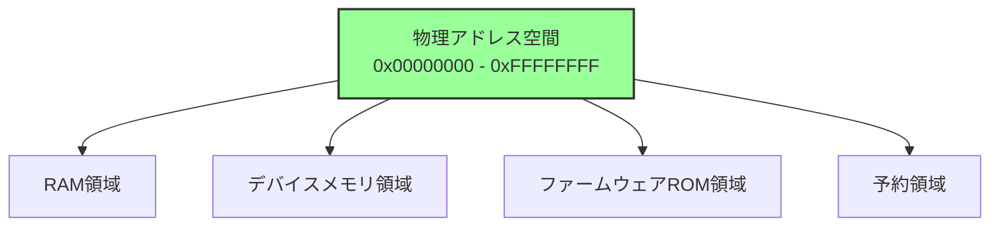
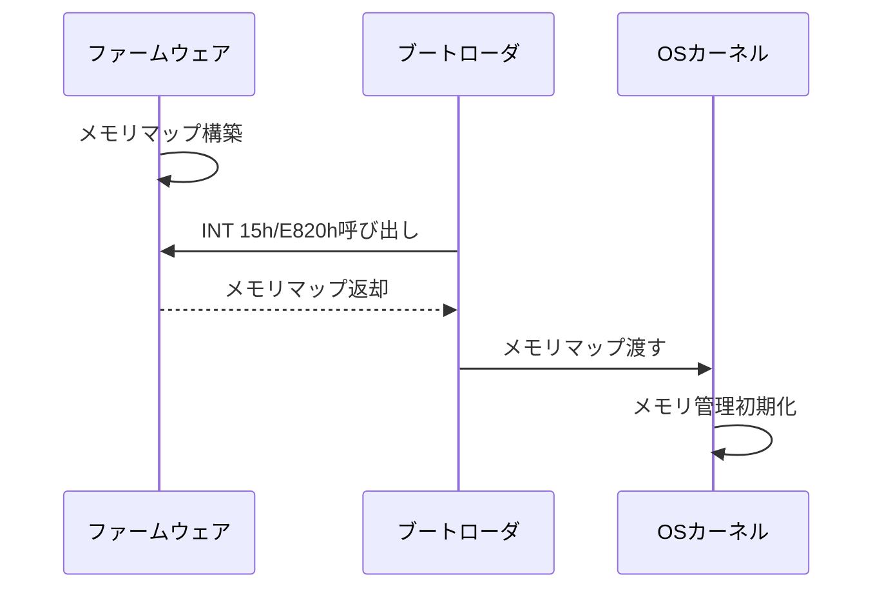
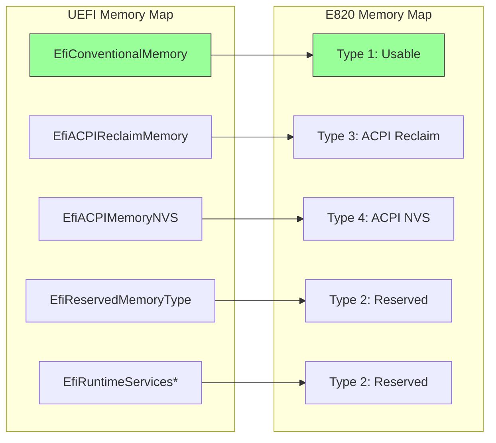
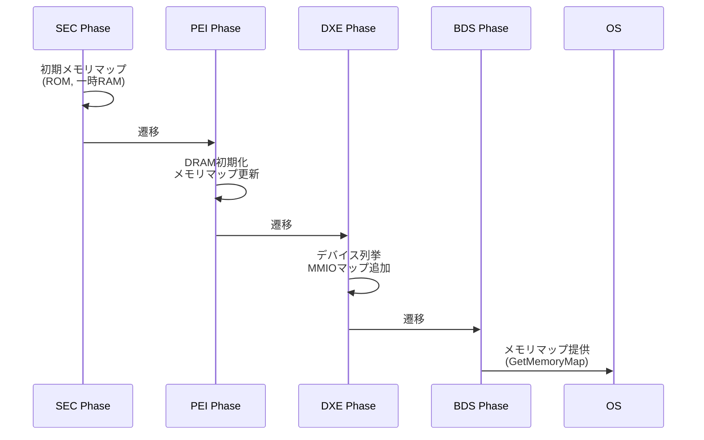
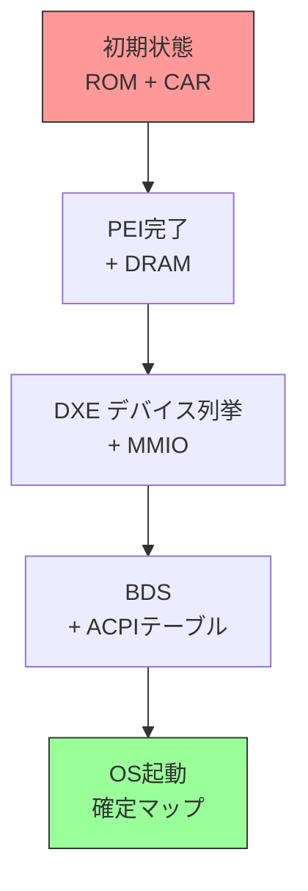
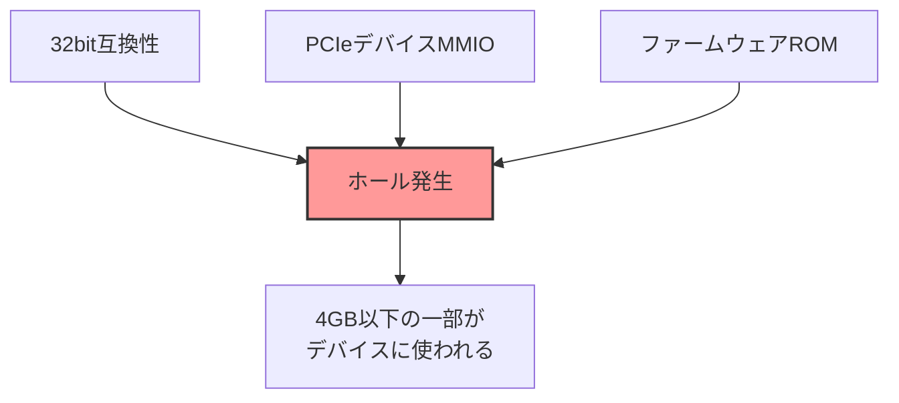
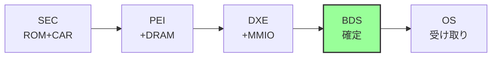

# メモリマップと E820

🎯 **この章で学ぶこと**
- x86_64 アーキテクチャのメモリマップ構造
- E820 メモリマップとは何か
- メモリ領域の種類と用途
- ファームウェアがメモリマップを構築する仕組み

📚 **前提知識**
- リセットベクタ（前章）
- メモリアドレスの基本概念

---

## メモリマップとは

### 物理アドレス空間の構造

メモリマップ (Memory Map) とは、物理アドレス空間における各領域の配置と用途を定義したものです。コンピュータシステムの物理アドレス空間は、単純に連続した RAM だけで構成されているわけではありません。RAM 領域、デバイスメモリ領域、ファームウェア ROM 領域、予約領域など、様々な種類の領域が混在しています。メモリマップは、これらの領域がどこに配置され、どのような用途で使われるかを明確に定義します。

x86_64 アーキテクチャでは、物理アドレス空間は 0x00000000 から始まり、64bit アドレッシングをサポートしています。しかし、実際のメモリマップは、4GB (32bit アドレス空間) の範囲内に多くの重要な領域が配置されています。これは、後方互換性と、MMIO (Memory-Mapped I/O) デバイスの配置の都合によるものです。

**補足図**: 以下の図は、物理アドレス空間の主要な領域を示したものです。



### なぜメモリマップが必要か

メモリマップが必要な理由は、OS がシステムのメモリ構成を正確に把握する必要があるからです。OS カーネルは起動時に、メモリマップを取得し、使用可能な RAM を識別します。この情報を基に、ページ管理システムを初期化し、メモリアロケータを構築します。メモリマップなしでは、OS はどこが安全に使えるメモリで、どこが使ってはいけない領域かを判断できません。

まず、RAM の識別が重要です。システムには物理的な RAM が搭載されていますが、そのすべてが OS から利用できるわけではありません。ファームウェアが使用している領域や、ハードウェアデバイスにマッピングされている領域は、RAM として使うことができません。メモリマップは、どこが実際に使用可能な RAM であるかを明示します。

次に、衝突の回避です。ファームウェアは起動プロセスの中で、一時的にメモリを使用します。また、MMIO デバイスは、メモリアドレス空間の一部を占有しています。OS がこれらの領域を誤って RAM として使用すると、システムが不安定になったり、クラッシュしたりします。メモリマップは、これらの危険な領域を明確に示し、OS が回避できるようにします。

最後に、OS の初期化に不可欠です。ページング機構を設定するには、物理メモリの構成を知る必要があります。メモリアロケータも、利用可能なメモリの範囲を把握しなければ動作できません。メモリマップは、これらすべての基盤となる情報を提供します。

**補足図**: 以下の図は、メモリマップが OS 初期化で果たす役割を示したものです。


## 典型的なx86_64メモリマップ

### 全体像

```
0xFFFFFFFF ┌────────────────────┐
           │ Firmware ROM (BIOS)│ ← リセットベクタ
0xFEE00000 ├────────────────────┤
           │ LAPIC (Local APIC) │ ← 割り込みコントローラ
0xFEC00000 ├────────────────────┤
           │ I/O APIC           │
0xE0000000 ├────────────────────┤
           │ PCIe MMIO          │ ← デバイスメモリ
           │ (拡張設定空間)      │
0xC0000000 ├────────────────────┤
           │ PCIe MMIO          │
           │ (通常設定空間)      │
0x100000000├────────────────────┤
 (4GB)     │ Extended RAM       │ ← 64bit空間のRAM
           │ (4GB以上のメモリ)   │
0x00100000 ├────────────────────┤
           │ Extended Memory    │ ← 1MB以上のRAM
0x000F0000 ├────────────────────┤
           │ System BIOS        │
0x000C0000 ├────────────────────┤
           │ Video BIOS / ROM   │
0x000A0000 ├────────────────────┤
           │ Video Memory       │ ← VGA フレームバッファ
0x00009FC00├────────────────────┤
           │ EBDA               │ ← Extended BIOS Data Area
0x00007C00 ├────────────────────┤
           │ Boot Sector Load   │ ← MBR/VBRロード位置
0x00000500 ├────────────────────┤
           │ Free for use       │
0x00000400 ├────────────────────┤
           │ BIOS Data Area     │
0x00000000 └────────────────────┘
           IVT (Int Vector Tbl)
```

### 主要領域の詳細

| アドレス範囲 | 名称 | 用途 | タイプ |
|-------------|------|------|--------|
| 0x00000-0x003FF | IVT | 割り込みベクタテーブル | RAM |
| 0x00400-0x004FF | BDA | BIOS Data Area | RAM |
| 0x00500-0x07BFF | Free | 使用可能 | RAM |
| 0x07C00-0x07DFF | Boot Sector | ブートセクタ | RAM |
| 0x80000-0x9FBFF | Extended Low | 使用可能 | RAM |
| 0x9FC00-0x9FFFF | EBDA | Extended BIOS Data | RAM |
| 0xA0000-0xBFFFF | Video Memory | VGAフレームバッファ | デバイス |
| 0xC0000-0xFFFFF | ROM Area | Option ROM, System BIOS | ROM |
| 0x100000- | Extended Memory | 使用可能RAM（1MB以上） | RAM |

## E820 メモリマップ

### E820 とは

**E820**は、BIOSがOSにメモリマップを伝えるための**標準インターフェース**です。

**名称の由来:**
- INT 15h, AX=E820h
- レガシーBIOS時代のBIOS割り込み番号

### E820 の役割



### E820 エントリの構造

各メモリ領域は、以下の構造で記述されます：

```c
struct E820Entry {
    UINT64  BaseAddr;    // 開始アドレス
    UINT64  Length;      // 長さ（バイト）
    UINT32  Type;        // メモリタイプ
    UINT32  Attributes;  // 属性（拡張）
};
```

### メモリタイプの種類

| Type | 名称 | 説明 | OS の扱い |
|------|------|------|-----------|
| 1 | Usable RAM | 使用可能なRAM | ページ管理対象 |
| 2 | Reserved | 予約済み | 使用禁止 |
| 3 | ACPI Reclaimable | ACPIテーブル | ACPI解析後に再利用可 |
| 4 | ACPI NVS | ACPI Non-Volatile Storage | 保護必須 |
| 5 | Bad Memory | 不良メモリ | 使用禁止 |
| 6+ | その他 | ベンダー固有など | Reserved扱い |

### E820 の例

```
Base Address       Length             Type
0x0000000000000000 0x000000000009FC00 Usable (1)
0x000000000009FC00 0x0000000000000400 Reserved (2)
0x00000000000F0000 0x0000000000010000 Reserved (2)
0x0000000000100000 0x000000007FEF0000 Usable (1)
0x000000007FFF0000 0x0000000000010000 ACPI Reclaim (3)
0x00000000E0000000 0x0000000010000000 Reserved (2)
0x00000000FEC00000 0x0000000000001000 Reserved (2)
0x00000000FEE00000 0x0000000000001000 Reserved (2)
0x0000000100000000 0x0000000080000000 Usable (1)
```

この例では:
- 0-640KB: 使用可能RAM
- 2GB以上: 64bitアドレス空間のRAM
- 0xFEC00000, 0xFEE00000: I/O APIC, Local APIC

## UEFI におけるメモリマップ

### UEFI Memory Map

UEFIは、レガシーBIOSのE820よりも**詳細なメモリマップ**を提供します。

```c
typedef struct {
    UINT32                  Type;           // メモリタイプ
    EFI_PHYSICAL_ADDRESS    PhysicalStart;  // 開始物理アドレス
    EFI_VIRTUAL_ADDRESS     VirtualStart;   // 開始仮想アドレス
    UINT64                  NumberOfPages;  // ページ数 (4KB単位)
    UINT64                  Attribute;      // 属性フラグ
} EFI_MEMORY_DESCRIPTOR;
```

### UEFIメモリタイプ

| Type | 名称 | 説明 |
|------|------|------|
| EfiReservedMemoryType | 予約 | 使用禁止 |
| EfiLoaderCode | ローダコード | ブートローダのコード |
| EfiLoaderData | ローダデータ | ブートローダのデータ |
| EfiBootServicesCode | ブートサービスコード | UEFI実行時のコード |
| EfiBootServicesData | ブートサービスデータ | UEFI実行時のデータ |
| EfiRuntimeServicesCode | ランタイムサービスコード | OS実行中も使用 |
| EfiRuntimeServicesData | ランタイムサービスデータ | OS実行中も使用 |
| EfiConventionalMemory | 通常メモリ | 使用可能RAM |
| EfiUnusableMemory | 使用不可 | 不良メモリ |
| EfiACPIReclaimMemory | ACPI再利用可 | ACPIテーブル |
| EfiACPIMemoryNVS | ACPI NVS | ACPI専用 |
| EfiMemoryMappedIO | MMIO | デバイスメモリ |

### UEFI と E820 の対応



UEFIブートローダは、UEFI Memory MapをE820形式に変換してLinuxカーネルに渡します。

## メモリマップの構築プロセス

### ファームウェアがメモリマップを構築する流れ



### 各フェーズでの役割

| Phase | メモリマップ関連の処理 |
|-------|----------------------|
| **SEC** | - ROM領域のマップ<br/>- CAR (Cache as RAM) 設定 |
| **PEI** | - DRAMの初期化<br/>- 使用可能RAM領域の確定 |
| **DXE** | - PCIeデバイス列挙<br/>- MMIOアドレスの割り当て<br/>- ACPIテーブル配置 |
| **BDS** | - 最終メモリマップの確定<br/>- OS への引き渡し |

### メモリマップの動的更新



## メモリホール (Memory Hole)

### メモリホールとは

**メモリホール (Memory Hole)** は、物理RAMが連続していない領域です。

```
4GB ┌──────────────┐
    │  RAM (続き)   │ ← 4GB以上のRAMはここにマップ
    │              │
    │              │
3GB ├──────────────┤
    │  PCIe MMIO   │ ← デバイスメモリ（ホール）
2GB ├──────────────┤
    │  RAM         │
    │              │
0GB └──────────────┘
```

### なぜメモリホールが存在するか



**理由:**

1. **32bitアドレス空間との互換性**
   - 4GB以下にデバイスをマップ
   - 古いOSやドライバの互換性

2. **デバイスMMIOの配置**
   - PCIe設定空間
   - グラフィックスメモリ

3. **ファームウェアROMの配置**
   - 0xFFF00000 付近

### RAM Remapping

チップセットは、ホールに隠れたRAMを**4GB以上の領域に再マップ**します：

```
物理RAM: 4GB

実際のマップ:
0x0        - 0xC0000000  : 3GB RAM (使用可能)
0xC0000000 - 0xFFFFFFFF  : 1GB デバイス領域（ホール）
0x100000000- 0x13FFFFFFF : 1GB RAM (リマップ)

→ 合計 4GB の RAM が使用可能
```

## メモリマップの用途

### OS 起動時


Linux カーネルは、E820メモリマップを元に：

1. **ページング初期化**
   - 使用可能RAM領域の識別
   - ページフレームアロケータ設定

2. **メモリゾーン設定**
   - ZONE_DMA, ZONE_NORMAL, ZONE_HIGHMEM

3. **予約領域の保護**
   - ACPIテーブル
   - ファームウェアランタイムサービス

### ACPI テーブルの配置

```
E820 Type 3 (ACPI Reclaimable):
0x7FFF0000 - 0x7FFFFFFF (64KB)

この領域に以下を配置:
- RSDP (Root System Description Pointer)
- RSDT/XSDT
- FADT, MADT, MCFG, HPET, etc.
```

## まとめ

この章では、メモリマップと E820 について詳しく説明しました。メモリマップは、物理アドレス空間の構造を定義し、OS がシステムのメモリ構成を正確に把握するための基盤となります。E820 は、レガシー BIOS から OS へメモリマップを伝える標準インターフェースであり、長年にわたって使われてきました。

メモリマップは、アドレス空間が単純な連続した RAM ではなく、RAM 領域、デバイスメモリ領域、ファームウェア ROM 領域、予約領域などが混在していることを示します。E820 は、これらの領域を Type 値で分類し、各領域の開始アドレスとサイズを提供します。主要な Type には、Usable (使用可能 RAM)、Reserved (予約済み)、ACPI Reclaim (ACPI 解析後に再利用可能)、ACPI NVS (ACPI が使用中) があります。

UEFI は、E820 よりも詳細なメモリマップを提供します。EFI_MEMORY_DESCRIPTOR 構造体を使い、各メモリ領域の属性や用途をより細かく記述します。これにより、OS はメモリを適切に管理し、ページ属性を正しく設定できます。

ファームウェアは、起動プロセスの各フェーズでメモリマップを動的に構築します。SEC Phase では ROM と CAR のみ、PEI Phase で DRAM が追加され、DXE Phase で MMIO 領域が確定し、BDS Phase で最終的なメモリマップが OS に渡されます。メモリホールは、デバイスの MMIO によって生じる不連続領域であり、特に 3GB から 4GB の間に存在することが多いです。

**参考表**: 以下の表は、E820 エントリの主要タイプをまとめたものです。

| Type | 名称 | OS の扱い |
|------|------|-----------|
| 1 | Usable | ページ管理対象 |
| 2 | Reserved | 使用禁止 |
| 3 | ACPI Reclaim | ACPI解析後に再利用可 |
| 4 | ACPI NVS | 保護必須 |

**補足図**: 以下の図は、メモリマップ構築の流れを示したものです。



次章では、CPU モード遷移の全体像を見ていきます。x86_64 CPU は、リアルモード、プロテクトモード、ロングモードという複数のモードを持ち、ファームウェアはこれらのモード間を遷移しながらシステムを初期化します。

---

📚 **参考資料**
- [Intel® 64 and IA-32 Architectures Software Developer's Manual - Volume 3, Chapter 11: Memory Cache Control](https://www.intel.com/sdm)
- [ACPI Specification v6.5 - Section 15: System Address Map Interfaces](https://uefi.org/specifications)
- [UEFI Specification v2.10 - Section 7: Services - Boot Services](https://uefi.org/specifications)
- [Linux Kernel Documentation - x86 Boot Protocol](https://www.kernel.org/doc/Documentation/x86/boot.txt)
