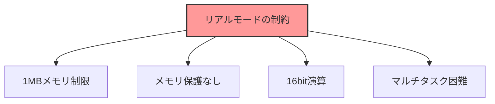
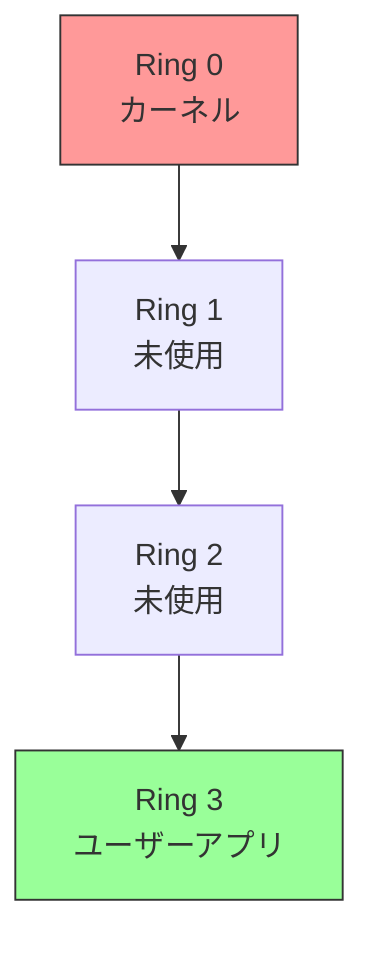
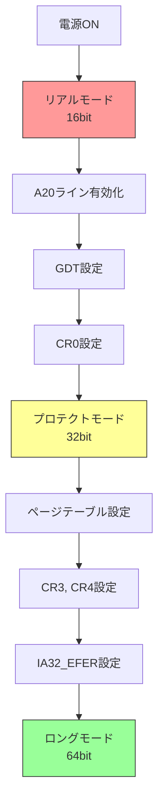
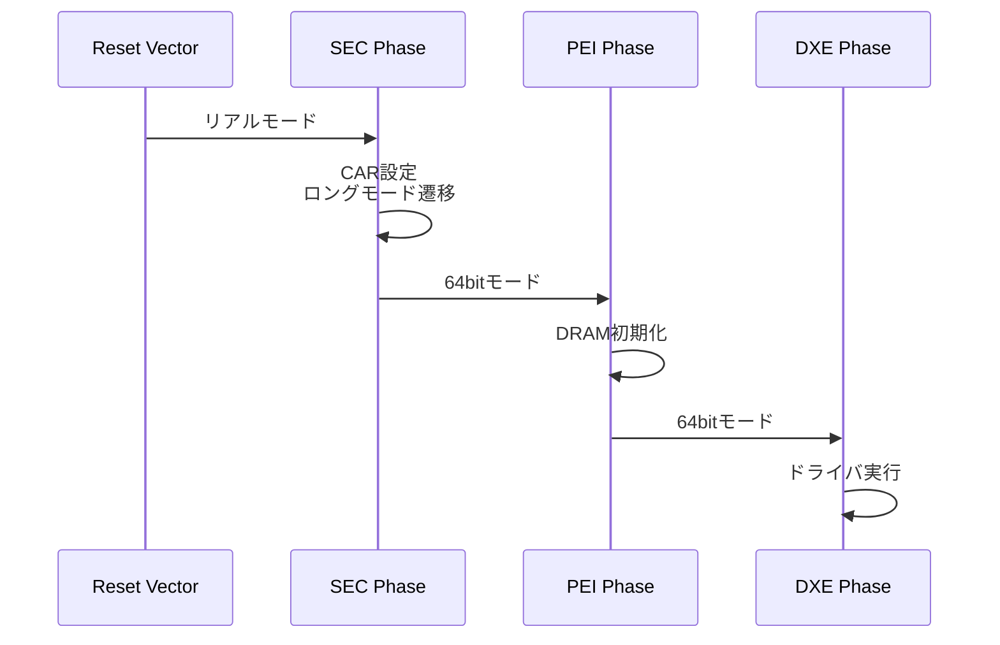
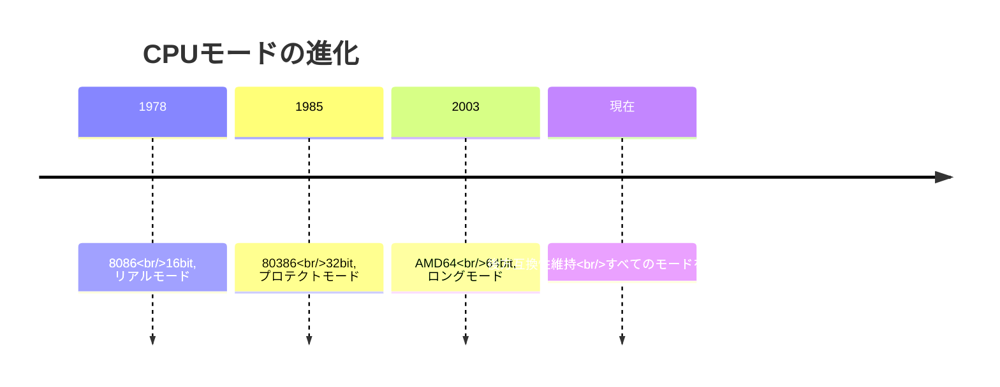

# CPU モード遷移の全体像

🎯 **この章で学ぶこと**
- x86_64 CPUの動作モード
- リアルモードからロングモードへの遷移
- 各モードの特徴と制約
- なぜモード遷移が必要か

📚 **前提知識**
- リセットベクタ（第1章）
- メモリマップ（第2章）

---

## x86_64 の動作モード

x86_64 アーキテクチャは、その長い歴史的経緯から、複数の動作モードを持っています。これは、後方互換性を維持しながら、新しい機能を追加していった結果です。最も古いリアルモードは、1978年の 8086 CPU から受け継がれており、次にプロテクトモードが 80286 で導入され、最後にロングモードが AMD64 アーキテクチャで追加されました。ファームウェアは、システム起動時にこれらのモード間を遷移しながら、CPU を初期化します。

3つの主要なモードは、それぞれ異なるビット幅とアドレス空間を持ちます。リアルモードは 16bit で、1MB のメモリ空間しかアクセスできません。プロテクトモードは 32bit で、4GB のアドレス空間を扱えます。ロングモードは 64bit で、理論上 256TB のアドレス空間をサポートします。実際には、現在の CPU 実装では 48bit や 52bit の物理アドレスが使用されています。

**補足図**: 以下の図は、CPU モードの遷移を示したものです。


**参考表**: 以下の表は、3つの主要モードの特徴をまとめたものです。

| モード | ビット幅 | アドレス空間 | 用途 |
|--------|---------|-------------|------|
| リアルモード | 16bit | 1MB | BIOS起動、互換性 |
| プロテクトモード | 32bit | 4GB | 32bit OS |
| ロングモード | 64bit | 理論上256TB | 64bit OS |

## リアルモード (Real Mode)

### 概要

**リアルモード**は、8086 CPUとの互換性のために存在します。

**特徴:**
- 16bitレジスタ
- セグメント:オフセット アドレッシング
- 1MBメモリ空間
- メモリ保護機構なし

### セグメント:オフセット形式

```
実効アドレス = (セグメント << 4) + オフセット

例:
CS=0xF000, IP=0xE05B
→ 0xF0000 + 0xE05B = 0xFE05B
```

### 制約



**主な制約:**
1. **1MBの壁**: 1MB(0xFFFFF)までしかアクセスできない
2. **保護機構なし**: プログラム間のメモリ保護がない
3. **16bit**: モダンな64bitアプリケーションを実行できない

## プロテクトモード (Protected Mode)

### 概要

**プロテクトモード**は、32bit拡張とメモリ保護を実現します。

**特徴:**
- 32bitレジスタ
- 4GBメモリ空間
- セグメンテーション + ページング
- 特権レベル (Ring 0-3)

### GDT (Global Descriptor Table)

プロテクトモードでは、**GDT**を使ってメモリ保護を実現します。

```c
// GDT エントリの構造（簡略化）
struct GDTEntry {
    UINT32 base;     // セグメントベースアドレス
    UINT32 limit;    // セグメント長
    UINT16 flags;    // アクセス権限、タイプ
};
```

**GDTの役割:**
- メモリセグメントの定義
- アクセス権限の管理
- コード/データの分離

### 特権レベル



- **Ring 0**: OSカーネル、ドライバ
- **Ring 3**: ユーザーアプリケーション

## ロングモード (Long Mode / 64bit Mode)

### 概要

**ロングモード**は、x86_64の真の64bitモードです。

**特徴:**
- 64bitレジスタ (RAX, RBX, RCX等)
- 理論上256TBアドレス空間 (実装は48bitが一般的)
- ページングが必須
- セグメンテーション無効化（フラットメモリモデル）

### ページング

ロングモードでは、**ページング**が必須です：


**4レベルページテーブル:**
- PML4 (Page Map Level 4)
- PDPT (Page Directory Pointer Table)
- PD (Page Directory)
- PT (Page Table)

### フラットメモリモデル

ロングモードでは、セグメンテーションは実質無効化されます：

```
すべてのセグメント:
- ベースアドレス = 0
- リミット = 最大

→ 仮想アドレス = 線形アドレス
```

## モード遷移の流れ

### 全体像



### リアルモード → プロテクトモード

**手順:**

1. **GDT準備**
   ```asm
   lgdt [gdt_descriptor]  ; GDT読み込み
   ```

2. **CR0レジスタ設定**
   ```asm
   mov eax, cr0
   or eax, 1              ; PE (Protection Enable) ビットセット
   mov cr0, eax
   ```

3. **ファージャンプ**
   ```asm
   jmp 0x08:protected_mode_entry  ; CS を更新
   ```

### プロテクトモード → ロングモード

**手順:**

1. **ページテーブル構築**
   - PML4, PDPT, PD, PT を RAM 上に作成
   - 恒等マッピング（仮想=物理）

2. **CR3レジスタ設定**
   ```asm
   mov eax, pml4_base
   mov cr3, eax           ; ページテーブルベース設定
   ```

3. **PAE有効化** (Physical Address Extension)
   ```asm
   mov eax, cr4
   or eax, 0x20           ; PAE ビットセット
   mov cr4, eax
   ```

4. **IA32_EFER設定** (Extended Feature Enable Register)
   ```asm
   mov ecx, 0xC0000080    ; IA32_EFER MSR
   rdmsr
   or eax, 0x100          ; LME (Long Mode Enable) ビットセット
   wrmsr
   ```

5. **ページング有効化**
   ```asm
   mov eax, cr0
   or eax, 0x80000000     ; PG (Paging) ビットセット
   mov cr0, eax
   ```

6. **ファージャンプ**
   ```asm
   jmp 0x08:long_mode_entry  ; 64bit CS へ
   ```

## 各モードでのメモリアクセス

### リアルモード

```
セグメント:オフセット形式
物理アドレス = (Segment << 4) + Offset
```

### プロテクトモード

```
論理アドレス → セグメンテーション → 線形アドレス → ページング → 物理アドレス
```

### ロングモード

```
仮想アドレス → ページング → 物理アドレス
(セグメンテーションは実質バイパス)
```

## UEFIにおけるモード遷移

### UEFIの特徴

UEFIファームウェアは、**早期にロングモードへ遷移**します。



**UEFI のアプローチ:**

1. **SEC Phase**: リアルモード → ロングモード
2. **PEI/DXE**: すべて64bitモードで実行
3. **OS起動**: ブートローダに64bit環境を提供

### レガシーBIOS との違い

| 項目 | レガシーBIOS | UEFI |
|------|-------------|------|
| 実行モード | 主に16bitリアルモード | 64bitロングモード |
| モード遷移 | OS起動時に実施 | ファームウェア内で実施 |
| ブートローダへの引き渡し | 16bitリアルモード | 64bitロングモード |

## なぜモード遷移が必要か

### 歴史的経緯



**後方互換性の維持:**
- 古いソフトウェアの動作保証
- 段階的な移行
- エコシステムの連続性

### 技術的必然性


**モダンなOSに必要な機能:**
1. **大容量メモリサポート** (4GB以上)
2. **メモリ保護** (プロセス分離)
3. **効率的なマルチタスク**

これらすべて、64bitロングモードで実現されます。

## まとめ

この章では、x86_64 アーキテクチャにおける CPU モード遷移の全体像を説明しました。CPU モード遷移を理解することは、ファームウェア開発において極めて重要です。なぜなら、ファームウェアは電源投入直後のリアルモードから、最終的に OS が動作するロングモードまで、CPU を段階的に初期化する責任を負うからです。各モードには独自の特徴と制約があり、それらを正確に理解することで、初期化コードの各ステップの意味が明確になります。

x86_64 アーキテクチャは、歴史的経緯から 3 つの主要な動作モードを持っています。リアルモードは 8086 との後方互換性のために存在し、16bit レジスタと 1MB のアドレス空間という制約があります。プロテクトモードは 80286 で導入され、32bit レジスタと 4GB のアドレス空間、そしてメモリ保護機構を提供します。ロングモードは AMD64 アーキテクチャで追加された 64bit モードで、理論上 256TB のアドレス空間をサポートし、フラットメモリモデルを採用しています。それぞれのモードは、その時代の技術的要求に応じて設計されました。

モード遷移のプロセスは、複数のステップから構成されています。リアルモードからプロテクトモードへの遷移では、GDT（Global Descriptor Table）の準備、CR0 レジスタの PE ビット設定、そしてファージャンプによる CS レジスタの更新が必要です。プロテクトモードからロングモードへの遷移は、さらに複雑で、ページテーブルの構築、CR3 レジスタの設定、PAE の有効化、IA32_EFER の LME ビット設定、そしてページングの有効化が必要です。これらの各ステップには明確な技術的理由があり、一つでも欠けると正常に動作しません。したがって、ファームウェア開発者は、各レジスタの役割とビットの意味を正確に理解する必要があります。

UEFI ファームウェアの特徴は、従来のレガシー BIOS とは異なり、早期にロングモードへ遷移することです。SEC Phase でリアルモードからロングモードへの遷移を完了し、PEI Phase 以降はすべて 64bit モードで実行されます。この設計により、ファームウェア全体を 64bit コードで記述でき、大容量メモリへのアクセスやモダンな開発環境の活用が可能になります。レガシー BIOS では、OS 起動時までリアルモードで動作していたため、ファームウェア自体の機能が制限されていました。UEFI のアプローチは、ファームウェアの機能拡張と保守性の向上に大きく貢献しています。

**補足図**: 以下の図は、モード遷移の流れを示したものです。


---

**次章では、割り込みとタイマの仕組みを見ていきます。**

📚 **参考資料**
- [Intel® 64 and IA-32 Architectures Software Developer's Manual - Volume 3, Chapter 9: Processor Management and Initialization](https://www.intel.com/sdm)
- [AMD64 Architecture Programmer's Manual - Volume 2, Chapter 14: Long Mode](https://www.amd.com/en/support/tech-docs)
- [OSDev Wiki - Protected Mode](https://wiki.osdev.org/Protected_Mode)
- [OSDev Wiki - Long Mode](https://wiki.osdev.org/Long_Mode)
