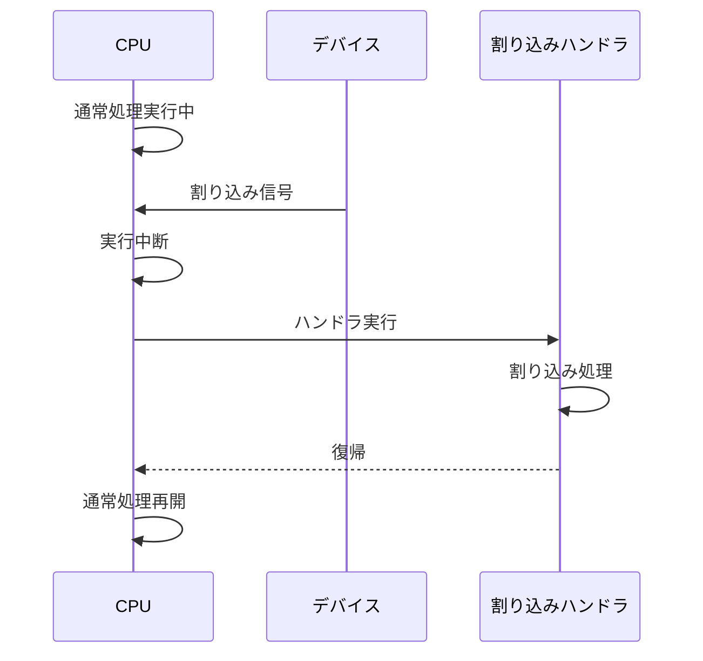
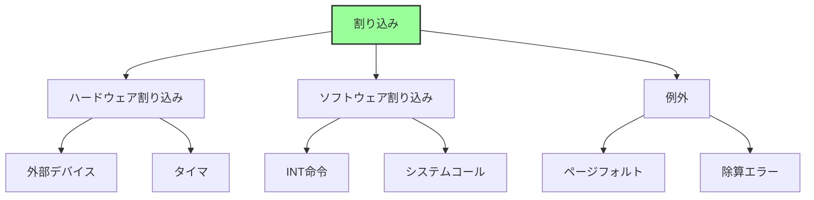
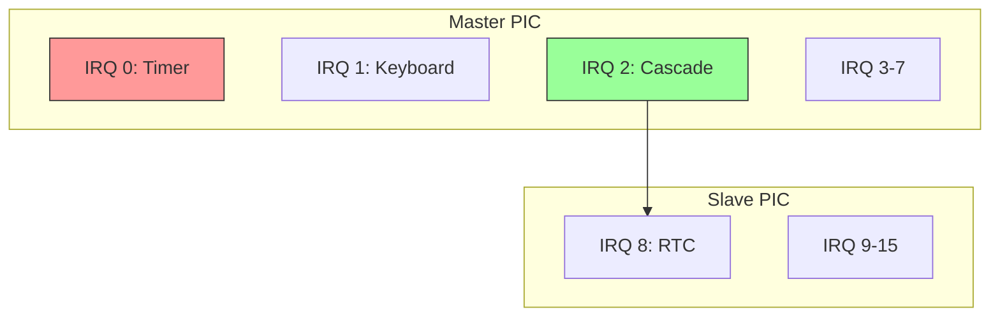
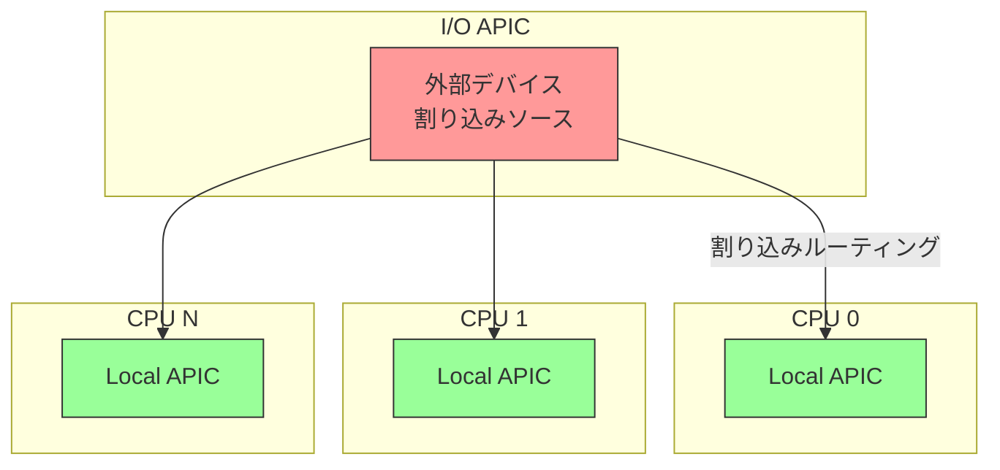
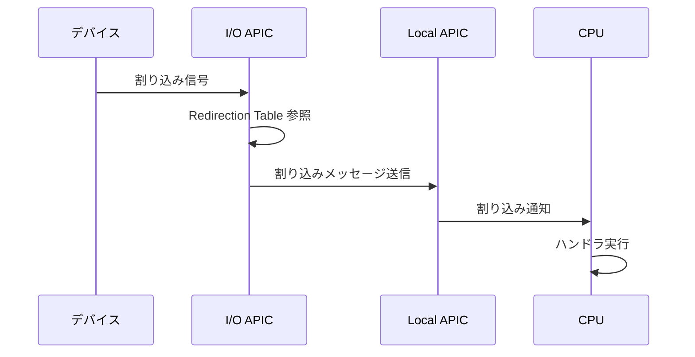
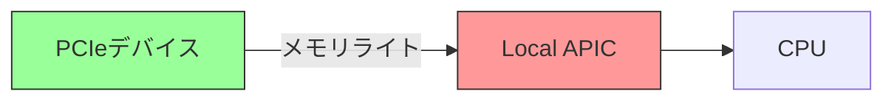
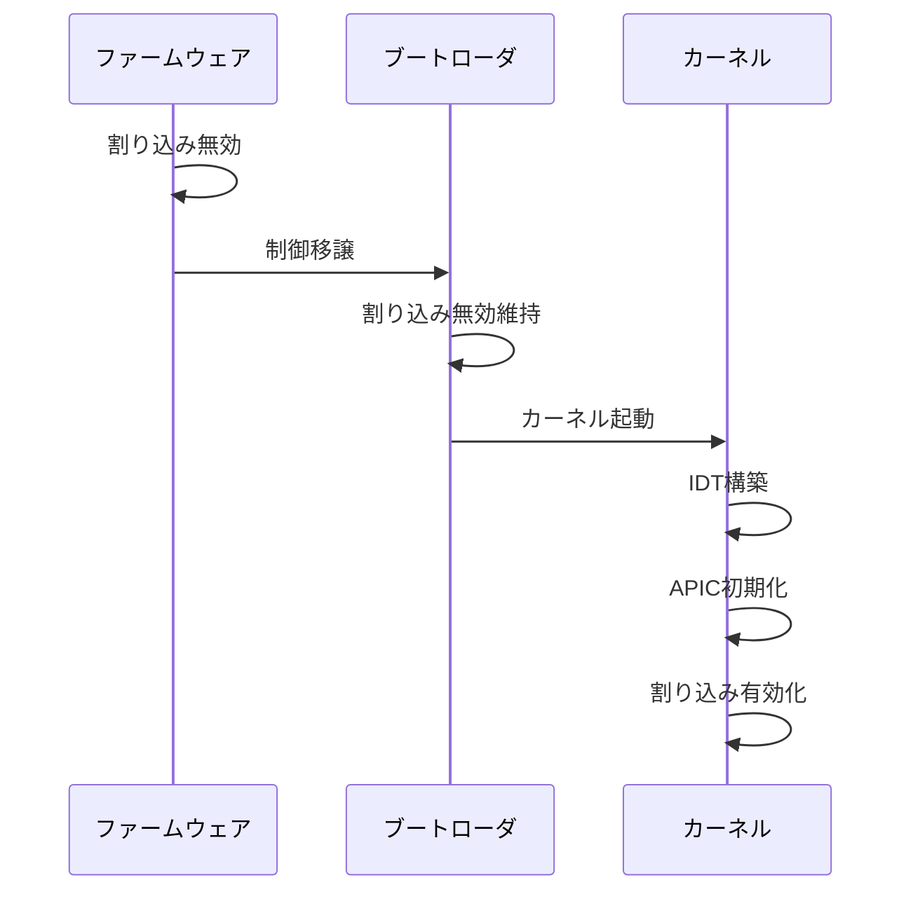
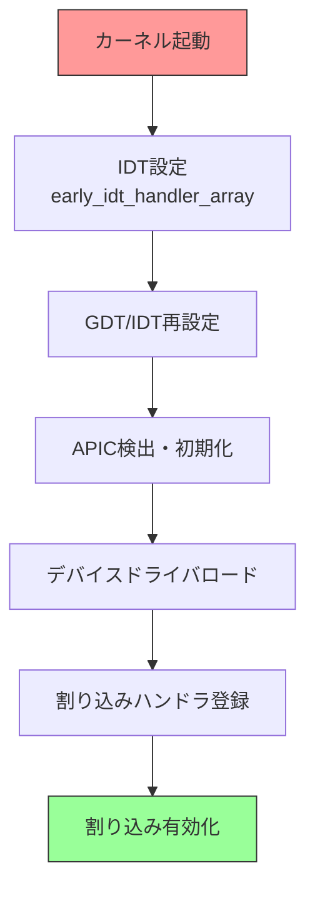
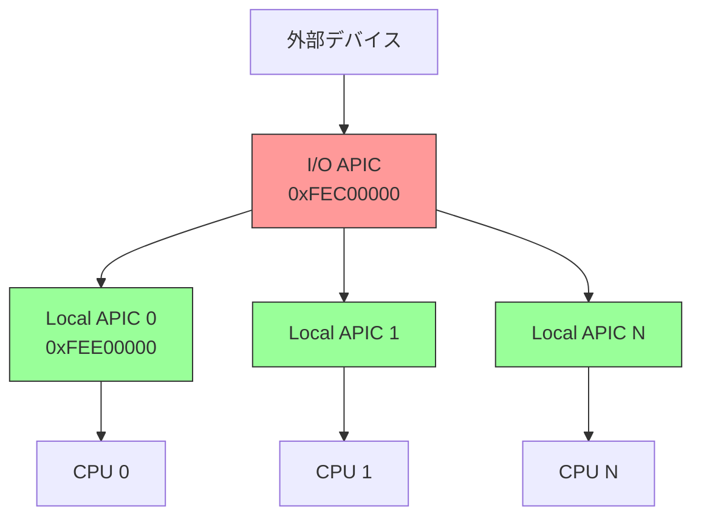

# 割り込みとタイマの仕組み

🎯 **この章で学ぶこと**
- 割り込みの役割と種類
- IDT (Interrupt Descriptor Table) の仕組み
- APIC (Advanced Programmable Interrupt Controller) のアーキテクチャ
- タイマの役割と実装

📚 **前提知識**
- CPUモード遷移（第3章）
- メモリマップ（第2章）

---

## 割り込みとは

### 概念

割り込み (Interrupt) は、CPU に非同期イベントを通知する仕組みです。CPU が通常のプログラムを実行している最中に、外部デバイスや内部の例外的な状況が発生すると、CPU は現在の実行を一時中断し、その イベントに対応する割り込みハンドラ（処理ルーチン）を実行します。割り込みハンドラが処理を完了すると、CPU は元の実行位置に戻り、中断されたプログラムを再開します。この仕組みにより、CPU は複数のタスクやデバイスを効率的に管理できるようになっています。

割り込みの動作は、一連の明確なステップで構成されています。まず、デバイスや CPU 内部のイベントが割り込み信号を発生させます。CPU はこの信号を検出すると、現在実行中の命令を完了した後、実行を中断します。次に、CPU は現在のレジスタ状態（プログラムカウンタやフラグレジスタなど）をスタックに保存し、割り込みハンドラのアドレスを取得して実行を移します。ハンドラが必要な処理を完了すると、保存されていたレジスタ状態を復元し、中断されたプログラムの実行を再開します。この一連の流れは、ハードウェアとソフトウェアが協調して実現しています。

**補足図**: 以下のシーケンス図は、割り込み処理の流れを示したものです。



### なぜ割り込みが必要か

割り込み機構が必要な理由は、CPU リソースを効率的に活用するためです。もし割り込みがなければ、CPU はデバイスの状態を常時チェックする「ポーリング」という方法に頼らざるを得ません。ポーリングでは、CPU が無限ループで各デバイスの状態を定期的に確認し、イベントが発生していないか調べます。しかし、この方法では CPU 時間の大部分が無駄なチェックに費やされ、実際の処理に使える時間が大幅に減少します。割り込み機構を使えば、イベントが発生した時にのみ CPU が反応するため、それ以外の時間は有益な処理に集中できます。

さらに、割り込みは即座の応答を実現します。キーボード入力やネットワークパケットの到着など、外部イベントは予測不可能なタイミングで発生します。ポーリングでは、チェックの周期に応じて応答に遅延が生じますが、割り込みを使えば、イベント発生後すぐに処理を開始できます。この即時性は、リアルタイムシステムや対話的なアプリケーションにとって不可欠です。また、割り込み機構により、複数のデバイスを同時に管理することも容易になります。各デバイスは独自の割り込み番号を持ち、それぞれが必要に応じて CPU の注意を引くことができます。したがって、割り込みは、モダンなコンピュータシステムにおいて、パフォーマンスと応答性の両方を実現するための基盤となっています。

## 割り込みの種類

### 分類

割り込みは、その発生源と目的によって、大きく3つのカテゴリに分類されます。第一に、例外 (Exception) は CPU 内部で発生する同期的なイベントです。プログラムの実行中に、不正な命令や無効なメモリアクセスが発生すると、CPU は例外を生成します。代表的な例外には、ゼロ除算エラー、ページフォルト（存在しないメモリページへのアクセス）、不正命令例外などがあります。これらは予測可能な条件下で発生し、プログラムのバグやメモリ保護違反を検出するために使用されます。

第二に、ハードウェア割り込み (Hardware Interrupt) は、CPU 外部のデバイスから発生する非同期的なイベントです。キーボードのキー押下、ネットワークカードのパケット受信、ディスクコントローラの転送完了など、外部デバイスが CPU の注意を必要とする時に、ハードウェア割り込みが生成されます。これらの割り込みは、いつ発生するか事前に予測できないため、「非同期」と呼ばれます。ハードウェア割り込みにより、デバイスドライバは適切なタイミングでデバイスと通信できます。

第三に、ソフトウェア割り込み (Software Interrupt) は、プログラムが意図的に発生させる割り込みです。x86_64 アーキテクチャでは、INT 命令を使ってソフトウェア割り込みをトリガーできます。この機構は、システムコールの実装に利用されます。ユーザーアプリケーションが OS カーネルのサービスを呼び出す際、INT 命令で特定の割り込み番号を指定することで、カーネルモードへ制御を移します。レガシー BIOS では、INT 0x10（ビデオサービス）や INT 0x13（ディスクサービス）などの BIOS 呼び出しにソフトウェア割り込みが使われていました。

**補足図**: 以下の図は、割り込みの3つの分類とその具体例を示したものです。



### 詳細

x86_64 アーキテクチャでは、割り込みと例外に 0 から 255 までの番号が割り当てられています。番号 0 から 31 は CPU が内部的に使用する例外のために予約されています。たとえば、番号 0 は除算エラー、番号 13 は一般保護例外 (General Protection Fault)、番号 14 はページフォルトです。これらの例外は CPU の動作仕様で定義されており、すべての x86_64 プロセッサで共通です。番号 32 から 255 は、ハードウェア割り込みとソフトウェア割り込みのために使用できます。OS は通常、ハードウェアデバイスからの割り込みを番号 32 以降に割り当て、デバイスドライバが対応するハンドラを登録します。

**参考表**: 以下の表は、割り込みの種類と割り込み番号の範囲をまとめたものです。

| 種類 | 発生源 | 例 | 番号範囲 |
|------|--------|-----|---------|
| **例外** | CPU内部 | ページフォルト、除算エラー | 0-31 |
| **ハードウェア割り込み** | 外部デバイス | キーボード、タイマ、ネットワーク | 32-255 |
| **ソフトウェア割り込み** | INT命令 | システムコール、BIOS呼び出し | 任意 |

## IDT (Interrupt Descriptor Table)

### 概要

IDT (Interrupt Descriptor Table) は、割り込み番号から割り込みハンドラのアドレスへのマッピングを提供するデータ構造です。割り込みが発生すると、CPU は割り込み番号を使って IDT を参照し、対応するハンドラの実行アドレスを取得します。IDT は、256個のエントリを持つテーブルで、各エントリは割り込み番号（0 から 255）に対応しています。OS は起動時に IDT をメモリ上に構築し、IDTR (IDT Register) という特殊なレジスタに IDT のベースアドレスとサイズを設定します。これにより、CPU はいつでも IDT を参照して、適切なハンドラを呼び出すことができます。

割り込み処理の流れは、明確に定義されています。割り込みが発生すると、CPU はまず割り込み番号を特定します。次に、IDTR レジスタが指す IDT のベースアドレスに、割り込み番号とエントリサイズを掛けたオフセットを加算して、該当するエントリの位置を計算します。そのエントリから、ハンドラのアドレス、コードセグメント、特権レベルなどの情報を読み取ります。最後に、CPU は特権レベルのチェックを行い、問題がなければハンドラの実行に移ります。この仕組みにより、各割り込みに対して異なる処理を実行できるとともに、セキュリティも確保されています。

**補足図**: 以下の図は、割り込み発生から IDT を経由してハンドラが実行されるまでの流れを示したものです。

```mermaid
graph LR
    A[割り込み発生<br/>割り込み番号: N] --> B[IDT参照<br/>IDT[N]]
    B --> C[ハンドラアドレス取得]
    C --> D[ハンドラ実行]

    style B fill:#9f9,stroke:#333,stroke-width:2px
```

### 構造

64bit モード（ロングモード）における IDT エントリは、16 バイトの構造体で定義されています。各エントリには、ハンドラのアドレス、コードセグメントセレクタ、割り込みスタックテーブル (IST) インデックス、フラグなどの情報が格納されます。ハンドラアドレスは 64bit なので、3つのフィールド（OffsetLow, OffsetMid, OffsetHigh）に分割されて格納されます。SegmentSelector は、ハンドラが属するコードセグメントを指定し、GDT または LDT のエントリを参照します。Flags フィールドには、ゲートタイプ（割り込みゲート、トラップゲート）、特権レベル (DPL)、エントリの有効性 (Present ビット) などが含まれます。IST フィールドは、ロングモード特有の機能で、割り込み処理時に使用するスタックを指定できます。これにより、カーネルスタックのオーバーフローを防ぐことができます。

以下のコード例は、64bit モードにおける IDT エントリの構造を示しています。

```c
// IDT エントリ (64bit)
struct IDTEntry {
    UINT16  OffsetLow;     // ハンドラアドレス下位16bit
    UINT16  SegmentSelector; // コードセグメント
    UINT8   IST;           // Interrupt Stack Table (64bit)
    UINT8   Flags;         // タイプ、DPL、P
    UINT16  OffsetMid;     // ハンドラアドレス中位16bit
    UINT32  OffsetHigh;    // ハンドラアドレス上位32bit
    UINT32  Reserved;
};
```

### IDT の配置

IDT は、メモリ上の連続した領域に配置されます。最初のエントリ（番号 0）は除算エラー例外に対応し、番号 14 のエントリはページフォルト例外に対応します。番号 32 以降は、ハードウェア割り込みに割り当てられることが一般的で、たとえば番号 32 はタイマ割り込みに使用されることが多いです。IDT の各エントリは 16 バイトなので、IDT 全体のサイズは 256 × 16 = 4096 バイト（4KB）になります。

CPU が IDT を参照するためには、IDTR (IDT Register) という特殊なレジスタに、IDT のベースアドレスとリミット（サイズ - 1）を設定する必要があります。IDTR は、ベースアドレス（64bit）とリミット（16bit）から構成される 80bit のレジスタです。OS は、LIDT 命令を使って IDTR を初期化します。IDTR が正しく設定されていないと、割り込みや例外が発生した時に CPU は正しいハンドラを呼び出せず、システムがクラッシュします。

以下の図は、メモリ上の IDT の配置と、主要なエントリの対応を示しています。

```
メモリ上のIDT:
┌─────────────────┐
│ IDT Entry 0     │ ← 除算エラー
├─────────────────┤
│ IDT Entry 1     │ ← デバッグ例外
├─────────────────┤
│ ...             │
├─────────────────┤
│ IDT Entry 14    │ ← ページフォルト
├─────────────────┤
│ ...             │
├─────────────────┤
│ IDT Entry 32    │ ← タイマ割り込み
├─────────────────┤
│ ...             │
├─────────────────┤
│ IDT Entry 255   │
└─────────────────┘

IDTR レジスタ: IDTのベースアドレスを保持
```

### IDTR レジスタ

IDTR レジスタの設定は、LIDT (Load IDT) 命令を使って行います。この命令は、メモリ上に配置された IDT ディスクリプタ構造体のアドレスを引数として受け取り、その内容を IDTR にロードします。IDT ディスクリプタは、2 バイトのリミット値と 8 バイトのベースアドレスから構成されます。リミット値は、IDT の最後のバイトのオフセット（サイズ - 1）を表します。256 エントリの完全な IDT の場合、リミット値は 256 × 16 - 1 = 4095 になります。

以下のアセンブリコード例は、IDT ディスクリプタの構造と LIDT 命令の使用方法を示しています。

```asm
; IDT の設定
lidt [idt_descriptor]

; IDT Descriptor の構造
idt_descriptor:
    dw idt_end - idt_start - 1  ; Limit
    dq idt_start                 ; Base Address
```

## 8259 PIC (Programmable Interrupt Controller)

### レガシーな割り込みコントローラ

8259 PIC (Programmable Interrupt Controller) は、1980年代から使用されているレガシーな割り込みコントローラです。IBM PC や PC/AT といった初期のパーソナルコンピュータで採用され、x86 アーキテクチャの標準的な割り込み管理デバイスとなりました。8259 PIC は、外部デバイスからの割り込み要求 (IRQ: Interrupt Request) を受け取り、それを CPU に伝達する役割を果たします。単一の 8259 チップは 8 本の IRQ ラインを管理できますが、PC/AT アーキテクチャでは 2 つの 8259 チップをカスケード接続することで、15 本の IRQ を利用可能にしています。

カスケード構成では、1 つの 8259 がマスター (Master) として動作し、もう 1 つがスレーブ (Slave) として接続されます。マスターの IRQ 2 ラインがスレーブの出力に接続され、スレーブからの割り込みはマスターを経由して CPU に伝達されます。マスターは IRQ 0 から IRQ 7 を管理し、IRQ 0 はタイマ、IRQ 1 はキーボードに割り当てられています。スレーブは IRQ 8 から IRQ 15 を管理し、IRQ 8 は RTC (Real Time Clock) に使用されます。この構成により、合計 15 本の IRQ ライン（マスター 7 本 + スレーブ 8 本）が利用可能になります。IRQ 2 はカスケード接続に使われるため、実際には使用できません。

**補足図**: 以下の図は、マスター PIC とスレーブ PIC のカスケード接続を示したものです。



### 制約

8259 PIC には、モダンなシステムにとって深刻な制約がいくつかあります。第一に、IRQ 数の制限があります。最大 15 本の IRQ では、多数のデバイスを持つ現代のシステムには不足しており、IRQ の共有が必要になります。IRQ を共有すると、複数のデバイスが同じ IRQ を使用するため、割り込みハンドラはどのデバイスが割り込みを発生させたかを判別する必要があり、パフォーマンスが低下します。

第二に、8259 PIC は単一 CPU のみをサポートしています。マルチプロセッサシステムでは、すべての割り込みが 1 つの CPU に集中するため、他の CPU が遊休状態になり、負荷分散ができません。第三に、優先度が固定されています。IRQ 番号が小さいほど優先度が高く、柔軟に優先度を変更することができません。これらの制約により、8259 PIC はモダンなマルチコアシステムには適していません。そのため、現在のシステムでは APIC (Advanced Programmable Interrupt Controller) が使用されています。ただし、後方互換性のために、8259 PIC のエミュレーションは多くのチップセットに残っています。

## APIC (Advanced Programmable Interrupt Controller)

### 概要

APIC (Advanced Programmable Interrupt Controller) は、モダンなマルチコア CPU 向けの割り込みコントローラです。8259 PIC の制約を克服するために設計され、1990年代後半以降の x86 プロセッサに標準搭載されるようになりました。APIC は、複数の CPU コアへの割り込み配信、柔軟な優先度管理、多数の割り込みソースのサポートを実現しています。APIC アーキテクチャは、各 CPU コアに内蔵された Local APIC と、チップセットに配置された I/O APIC の 2 つのコンポーネントから構成されます。

APIC の最大の利点は、マルチプロセッサシステムでの効率的な割り込み管理です。各 CPU コアは独自の Local APIC を持ち、I/O APIC は外部デバイスからの割り込みを適切な CPU に配信できます。これにより、割り込み処理の負荷を複数の CPU に分散させることができ、システム全体のパフォーマンスが向上します。また、APIC は 256 個以上の割り込みベクタをサポートし、8259 PIC の 15 本という制限を大きく超えています。さらに、割り込みの優先度を動的に変更でき、リアルタイム性が求められるシステムにも対応できます。

**補足図**: 以下の図は、I/O APIC と複数の CPU に内蔵された Local APIC のアーキテクチャを示したものです。



### 2つのコンポーネント

APIC アーキテクチャは、Local APIC と I/O APIC という 2 つの主要なコンポーネントで構成されています。Local APIC は、各 CPU コアに 1 つずつ内蔵されており、CPU 固有の割り込み処理を担当します。Local APIC の主な役割には、I/O APIC や他の CPU からの割り込みメッセージの受信、ローカルタイマー機能の提供、IPI (Inter-Processor Interrupt) の送信があります。IPI は、あるCPU が他の CPU に割り込みを送る機構で、マルチプロセッサシステムにおけるプロセス間通信や TLB フラッシュの同期などに使用されます。Local APIC は、メモリマップ I/O (MMIO) を通じてアクセスされ、通常 0xFEE00000 番地にマッピングされます。

一方、I/O APIC は、チップセット内に配置され、外部デバイスからの割り込み信号を受信します。I/O APIC は、受信した割り込みを適切な CPU の Local APIC に転送する役割を果たします。I/O APIC には、Redirection Table という設定テーブルがあり、各割り込みソースに対して、どの CPU に配信するか、どの割り込みベクタ番号を使用するか、配信モード（固定、最低優先度、ブロードキャストなど）を指定できます。これにより、柔軟な割り込みルーティングが可能になります。I/O APIC もメモリマップ I/O でアクセスされ、通常 0xFEC00000 番地にマッピングされます。システムには、複数の I/O APIC が存在することもあり、サーバやワークステーションクラスのマザーボードでは、多数の割り込みソースを管理するために複数の I/O APIC が使用されます。

### APIC のメモリマップ

Local APIC と I/O APIC は、それぞれ固定されたメモリアドレスにマッピングされます。Local APIC は 0xFEE00000 番地に配置され、この領域には Local APIC ID、Task Priority Register、Timer Local Vector Table (LVT) などの重要なレジスタが含まれます。Local APIC ID は、各 CPU コアを一意に識別するための番号で、割り込みルーティングに使用されます。Task Priority Register は、現在の CPU が処理できる割り込みの優先度閾値を設定し、優先度の低い割り込みをブロックできます。Timer LVT は、Local APIC タイマーの設定を行うレジスタで、タイマー割り込みのベクタ番号やモード（ワンショット、定期的）を指定します。

I/O APIC は 0xFEC00000 番地にマッピングされ、Redirection Table を含む各種レジスタが配置されます。Redirection Table は、外部割り込みソース（IRQ）ごとに 1 つのエントリを持ち、各エントリには、宛先 CPU、割り込みベクタ、配信モード、極性（アクティブ High/Low）、トリガーモード（エッジ/レベル）などの情報が格納されます。OS は、デバイスドライバの初期化時に Redirection Table を設定し、適切な割り込みルーティングを構成します。

以下は、Local APIC と I/O APIC のメモリマップの例です。

```
Local APIC: 0xFEE00000 (MMIO)
├─ 0xFEE00020: Local APIC ID
├─ 0xFEE00080: Task Priority Register
├─ 0xFEE00320: Timer LVT
└─ ...

I/O APIC: 0xFEC00000 (MMIO)
├─ Redirection Table
└─ ...
```

### 割り込みルーティング

APIC における割り込みルーティングの流れは、複数のステップで構成されています。まず、外部デバイスが割り込み信号を I/O APIC に送ります。I/O APIC は、その信号を受け取ると、Redirection Table を参照して、どの CPU に割り込みを配信すべきかを決定します。Redirection Table のエントリには、宛先 CPU の Local APIC ID、割り込みベクタ番号、配信モードなどが指定されています。I/O APIC は、この情報に基づいて、割り込みメッセージを生成し、システムバスを介して該当する CPU の Local APIC に送信します。

Local APIC は、I/O APIC からの割り込みメッセージを受信すると、現在の Task Priority Register の値と割り込みの優先度を比較します。割り込みの優先度が十分に高い場合、Local APIC は CPU に割り込みを通知します。CPU は、現在の命令を完了した後、割り込みハンドラの実行に移ります。このプロセスにより、外部デバイスからの割り込みが適切な CPU に効率的に配信され、マルチコアシステムでの負荷分散が実現されます。

**補足図**: 以下のシーケンス図は、デバイスからの割り込みが I/O APIC と Local APIC を経由して CPU に伝達されるまでの流れを示したものです。



## MSI/MSI-X (Message Signaled Interrupts)

### 概要

MSI (Message Signaled Interrupts) と MSI-X (MSI Extended) は、PCIe デバイスが使用するモダンな割り込み方式です。従来の INTx (Interrupt Line) 方式では、専用の物理的な信号線を使って割り込みを伝達していましたが、MSI/MSI-X では、メモリライトトランザクションを使って割り込みを通知します。具体的には、デバイスが割り込みを発生させたいとき、Local APIC のメモリマップドアドレス（通常 0xFEE00000 付近）に特定のデータを書き込みます。このメモリライトが、CPU への割り込み通知として機能します。MSI は 2000年代初頭に PCI 2.2 仕様で導入され、MSI-X は PCI 3.0 で拡張されました。

MSI/MSI-X の最大の利点は、割り込み共有の問題を解決することです。レガシーな INTx 方式では、複数のデバイスが同じ IRQ ラインを共有することがあり、割り込みハンドラはどのデバイスが割り込みを発生させたかを判別するために、すべての共有デバイスをポーリングする必要がありました。これはパフォーマンスの低下を招きます。MSI/MSI-X では、各デバイスが専用の割り込みベクタを使用できるため、割り込み共有が不要になり、効率的な処理が可能になります。さらに、MSI は最大 32 個、MSI-X は最大 2048 個の割り込みベクタをサポートしており、高性能なネットワークカードやストレージコントローラなど、多数の割り込みソースを持つデバイスに適しています。

**補足図**: 以下の図は、PCIe デバイスが MSI を使ってメモリライト経由で Local APIC に割り込みを通知する仕組みを示したものです。



### レガシー割り込みとの違い

MSI/MSI-X とレガシーな INTx 割り込み方式には、いくつかの重要な違いがあります。まず、通信方式が異なります。INTx は専用の物理的な割り込み信号線を使用しますが、MSI/MSI-X はメモリライトトランザクションを使用します。これにより、MSI/MSI-X ではボード上の配線が簡略化され、設計が容易になります。また、メモリバスを経由するため、割り込み通知の遅延が一定に保たれ、予測可能性が向上します。

次に、割り込み共有の問題があります。INTx では、複数のデバイスが同じ IRQ ラインを共有することが一般的で、これが競合やパフォーマンス低下の原因となります。MSI/MSI-X では、各デバイスが専用の割り込みベクタを持つため、共有の問題が発生しません。さらに、割り込み数にも大きな差があります。PCIe デバイスの INTx は 4 本（INTA、INTB、INTC、INTD）に制限されていますが、MSI は最大 32 個、MSI-X は最大 2048 個の割り込みベクタをサポートします。これにより、高性能デバイスは複数の割り込みソースを個別に管理でき、パフォーマンスが大幅に向上します。

**参考表**: 以下の表は、レガシー INTx 割り込みと MSI/MSI-X の違いをまとめたものです。

| 項目 | レガシー (INTx) | MSI/MSI-X |
|------|----------------|-----------|
| 方式 | 専用信号線 | メモリライト |
| 共有 | 可能（問題あり） | 専用 |
| 割り込み数 | 4本 (INTA-INTD) | 最大2048 |
| パフォーマンス | 低い | 高い |

### なぜMSIが優れているか

MSI/MSI-X が優れている理由は、複数の技術的利点にあります。第一に、割り込み共有が不要になることで、割り込み処理のオーバーヘッドが削減されます。レガシーな INTx では、共有された IRQ に対して、すべてのデバイスドライバがハンドラを呼び出され、自分のデバイスが割り込みを発生させたかを確認する必要がありました。MSI/MSI-X では、各デバイスが固有のベクタを持つため、該当するドライバのみが呼び出され、無駄な処理が発生しません。

第二に、MSI/MSI-X はメモリバスを使用するため、高速です。専用の割り込み信号線を経由する INTx と比べて、メモリトランザクションは CPU に近い経路で処理されるため、レイテンシが低くなります。第三に、多数の割り込みベクタをサポートすることで、デバイスは複数の機能や キューごとに個別の割り込みを使用できます。たとえば、マルチキュー対応のネットワークカードでは、各キューに専用の割り込みベクタを割り当て、異なる CPU コアで並列処理することで、スループットが向上します。これらの理由から、MSI/MSI-X はモダンな高性能システムにおいて標準的な割り込み方式となっています。

## タイマ

### タイマの役割

タイマは、コンピュータシステムにおいて時間管理と定期的なイベント生成を担う重要なハードウェアコンポーネントです。タイマの最も重要な役割の一つは、OS のスケジューリングです。タイマは定期的に割り込みを発生させ、OS カーネルにタイムスライスの経過を通知します。カーネルは、この割り込みをトリガーとして、現在実行中のプロセスを中断し、次に実行すべきプロセスに CPU を割り当てます。このプロセス切り替え（コンテキストスイッチ）により、マルチタスクが実現されます。タイマがなければ、協調的マルチタスクに頼らざるを得ず、不正なプログラムが CPU を独占してシステム全体が停止するリスクがあります。

タイマのもう一つの重要な役割は、システム時刻の管理です。タイマは一定間隔で割り込みを発生させることで、カーネルがシステムクロックを更新し、現在時刻を追跡できるようにします。この機能は、ファイルのタイムスタンプ、ログの記録、ネットワークプロトコルのタイムアウト処理など、さまざまな用途に使用されます。さらに、タイマはタイムアウト処理にも利用されます。デバイスドライバは、I/O 操作が指定時間内に完了しない場合にタイマ割り込みを受け取り、エラーハンドリングを実行できます。また、ウォッチドッグタイマとして使用され、システムがハングした場合に自動的にリセットすることも可能です。

### x86_64 のタイマ種類

x86_64 アーキテクチャには、複数の種類のタイマが存在し、それぞれ異なる特性と用途を持っています。歴史的に最も古いのは PIT (Programmable Interval Timer, 8254) で、1.193182 MHz の基準周波数で動作します。PIT はレガシーなタイマですが、後方互換性のために現在でも多くのシステムに残っています。RTC (Real Time Clock) は、32.768 kHz の水晶振動子を使用し、システムの電源が切れている間も CMOS バッテリで動作し続けるため、BIOS 設定や現在時刻の保持に使用されます。

Local APIC Timer は、各 CPU コアに内蔵されたタイマで、CPU のバス周波数に基づいて動作します。各 CPU コアが独自のタイマを持つため、マルチプロセッサシステムで個別にスケジューリングタイマを設定できます。HPET (High Precision Event Timer) は、モダンなシステムで使用される高精度タイマで、最小 10 MHz の周波数で動作し、64bit カウンタと複数のタイマーチャネルをサポートします。HPET は、PIT を置き換えることを目的として設計されました。最後に、TSC (Time Stamp Counter) は、CPU に内蔵されたカウンタで、CPU クロックサイクルごとにインクリメントされます。TSC は最も高精度ですが、割り込みを生成しないため、計測専用として使用されます。

**参考表**: 以下の表は、x86_64 で利用可能な主要なタイマの特性をまとめたものです。

| タイマ | 周波数 | 精度 | 用途 |
|--------|--------|------|------|
| **PIT** (8254) | 1.193MHz | 低 | レガシー |
| **RTC** (Real Time Clock) | 32.768kHz | 低 | CMOS時計 |
| **Local APIC Timer** | CPU依存 | 中 | 各CPU固有 |
| **HPET** (High Precision Event Timer) | 10MHz以上 | 高 | モダン |
| **TSC** (Time Stamp Counter) | CPU周波数 | 最高 | 計測専用 |

### PIT (Programmable Interval Timer)

PIT (Programmable Interval Timer, 8254) は、IBM PC 時代から使用されているレガシーなタイマチップです。1.193182 MHz の基準周波数で動作し、分周比を設定することで、さまざまな割り込み周期を実現できます。PIT には 3 つのチャネル（0、1、2）があり、チャネル 0 はシステムタイマとして使用され、定期的に IRQ 0 割り込みを発生させます。チャネル 1 は、かつて DRAM リフレッシュに使用されていましたが、現在ではほとんど使われていません。チャネル 2 は、PC スピーカーの音程制御に使用されます。

PIT は I/O ポート 0x40-0x43 を通じてアクセスされます。0x40、0x41、0x42 はそれぞれチャネル 0、1、2 のカウンタ値にアクセスするためのポートで、0x43 はコマンドレジスタです。分周比を設定することで、たとえば 1.193182 MHz を 1193 で割ると、約 1 kHz の割り込み周期が得られます。しかし、PIT の精度は低く、モダンなシステムでは HPET や Local APIC Timer に置き換えられています。それでも、後方互換性のために、多くのファームウェアと OS が PIT をサポートし続けています。

### Local APIC Timer

Local APIC Timer は、各 CPU コアの Local APIC に内蔵されたタイマです。このタイマは、CPU のバス周波数または固定周波数に基づいて動作し、定期的な割り込みを生成できます。Local APIC Timer の利点は、各 CPU コアが独自のタイマを持つため、マルチプロセッサシステムでも個別にスケジューリング割り込みを設定できることです。これにより、各 CPU コアが独立してプロセスをスケジューリングでき、スケーラビリティが向上します。

Local APIC Timer は、メモリマップ I/O を通じてアクセスされます。0xFEE00380 番地の Initial Count Register に初期カウント値を設定し、0xFEE00320 番地の Timer Local Vector Table (LVT) にタイマーモード（ワンショット、定期的、TSC デッドライン）と割り込みベクタ番号を指定します。タイマーは、設定されたカウント値から 0 までカウントダウンし、0 に達すると割り込みを発生させます。定期的モードでは、カウントダウン後に自動的に初期値がリロードされ、連続的に割り込みが生成されます。

以下のコード例は、Local APIC Timer を設定する概念的な手順を示しています。

```c
// Local APIC Timer の設定（概念的）
void SetupLocalAPICTimer(UINT32 IntervalMs) {
    // 初期カウント値設定
    *((volatile UINT32*)0xFEE00380) = CalculateCount(IntervalMs);

    // タイマーモード設定（定期的）
    *((volatile UINT32*)0xFEE00320) = 0x20000 | TIMER_VECTOR;
}
```

### HPET (High Precision Event Timer)

HPET (High Precision Event Timer) は、Intel と Microsoft が共同で開発した高精度タイマ仕様で、レガシーな PIT を置き換えることを目的としています。HPET は、最小 10 MHz の周波数で動作し、64bit のメインカウンタを持ちます。また、最大 32 個の比較器（タイマー）をサポートし、各比較器は独立して割り込みを生成できます。HPET のベースアドレスは、ACPI の HPET テーブルで指定され、メモリマップ I/O を通じてアクセスされます。

HPET の主な特徴は、高精度であること、複数のタイマーチャネルをサポートすること、そして 64bit カウンタにより、オーバーフローを気にせず長時間の計測ができることです。OS は、HPET を使ってシステムタイマを実装したり、高精度なイベントスケジューリングを行ったりします。HPET は、PIT や RTC に比べて桁違いに高い精度を提供するため、マルチメディアアプリケーションやリアルタイムシステムに適しています。モダンな Linux や Windows では、HPET が利用可能な場合、これをシステムタイマとして優先的に使用します。

### TSC (Time Stamp Counter)

TSC (Time Stamp Counter) は、CPU 内蔵のカウンタで、CPU クロックサイクルごとにインクリメントされます。TSC は、RDTSC 命令を使って読み取ることができ、EDX:EAX レジスタに 64bit のカウンタ値が返されます。TSC は、すべてのタイマの中で最も高精度であり、CPU の動作周波数と同じ速度でカウントされるため、ナノ秒単位の時間測定が可能です。

以下のアセンブリコード例は、RDTSC 命令を使って TSC を読み取る方法を示しています。

```asm
rdtsc  ; EDX:EAX に TSC 読み込み
```

TSC の主な用途は、パフォーマンス測定と高精度時刻取得です。プログラムの特定の部分の実行時間を測定したり、ミリ秒以下の精度が必要なタイミング処理に使用されます。しかし、TSC にはいくつかの注意点があります。第一に、TSC の周波数は CPU 依存であり、CPU のクロック周波数が変化すると、TSC のカウント速度も変わります。第二に、マルチコアシステムでは、各コアの TSC が同期されていない場合があり、コア間で TSC 値を比較すると不正確な結果になる可能性があります。第三に、省電力モードでは CPU クロックが停止することがあり、TSC もカウントを停止する場合があります。モダンな CPU では、"Invariant TSC" という機能が導入され、クロック周波数が変化しても一定速度でカウントされるようになっています。

## ファームウェアにおける割り込み

### UEFI と割り込み

UEFI ファームウェアは、通常、割り込みを無効化した状態で動作します。x86_64 CPU では、CLI (Clear Interrupt Flag) 命令を実行して EFLAGS レジスタの IF (Interrupt Flag) ビットをクリアすることで、割り込みを無効にできます。UEFI Boot Services が動作している間、CPU は割り込みを受け付けず、すべてのデバイスアクセスはポーリングベースで行われます。この設計には、いくつかの重要な理由があります。

第一に、単純性です。割り込みハンドラを実装し、IDT を構築し、APIC を初期化するには、相当な労力が必要です。UEFI ファームウェアの主な目的は、OS を起動することであり、割り込み処理のような複雑な機能は必須ではありません。ポーリングベースでも、ブート時のデバイス操作には十分な性能が得られます。第二に、予測可能性です。割り込みは非同期的に発生するため、タイミングが不確定です。ファームウェアのデバッグや動作検証において、予測可能な実行フローは重要であり、割り込みを無効にすることで、決定的な動作が保証されます。第三に、OS への引き渡しを容易にするためです。割り込み設定は OS のポリシーに依存するため、ファームウェアが独自に設定すると、OS の初期化と競合する可能性があります。割り込みを無効にした状態で OS に制御を渡すことで、OS が自由に割り込みコントローラを設定できます。

**補足図**: 以下の図は、UEFI Boot Services が割り込み無効状態で動作し、OS 起動後に OS が割り込みを設定する流れを示したものです。


### 例外的に使用するケース

UEFI ファームウェアが割り込みを使用するケースも、例外的に存在します。一部の UEFI 実装では、Local APIC Timer を使用してタイマーサービスを実装しています。これは、高精度なタイミングが必要な場合や、ウォッチドッグタイマーとして機能させる場合に有用です。また、デバッグ目的でシリアルポート割り込みを使用することもあります。シリアル出力のバッファリングや、デバッガとの通信に割り込みを利用することで、デバッグの効率が向上します。しかし、これらは一般的ではなく、ほとんどの UEFI 実装は割り込みを使用しません。

## 割り込みの初期化プロセス

### OS起動時の流れ

割り込みの初期化は、OS 起動プロセスの重要な一部です。ファームウェアが OS ブートローダに制御を移す時点では、割り込みは無効化されています。ブートローダは、カーネルイメージをメモリにロードし、カーネルのエントリポイントにジャンプしますが、この段階でも割り込みは無効のままです。カーネルが起動すると、最初に最小限の IDT を構築します。この初期 IDT には、例外ハンドラ（ページフォルト、一般保護違反など）のみが登録され、ハードウェア割り込みはまだ設定されていません。

次に、カーネルは GDT と IDT を再設定し、完全な例外ハンドラテーブルを構築します。その後、APIC の検出と初期化を行います。カーネルは、ACPI テーブルや CPUID 命令を使って、システムに APIC が存在するかを確認し、Local APIC と I/O APIC を初期化します。デバイスドライバがロードされると、各ドライバは必要な割り込みハンドラを登録し、I/O APIC の Redirection Table を設定します。最後に、カーネルは STI (Set Interrupt Flag) 命令を実行して、割り込みを有効化します。この時点から、ハードウェア割り込みが正常に機能するようになります。

**補足図**: 以下のシーケンス図は、ファームウェアから OS カーネルへの制御移譲と、割り込み初期化の流れを示したものです。



### Linux カーネルの例

Linux カーネルにおける割り込み初期化の具体的な流れは、複数のステップで構成されています。カーネルが起動すると、まず early_idt_handler_array という初期 IDT を設定します。この IDT は、カーネル初期化中に発生する例外を捕捉するための最小限のハンドラを含んでいます。次に、trap_init() 関数が呼ばれ、GDT と IDT が再設定されます。この段階で、すべての例外ハンドラが正しく登録されます。

APIC の検出と初期化は、init_IRQ() 関数で行われます。カーネルは、ACPI の MADT (Multiple APIC Description Table) を解析し、システム内の Local APIC と I/O APIC の構成を把握します。その後、apic_intr_mode_init() で APIC の動作モードを設定し、setup_local_APIC() で各 CPU の Local APIC を初期化します。デバイスドライバがロードされると、request_irq() や request_threaded_irq() などの関数を使って、割り込みハンドラを登録します。カーネルは、I/O APIC の Redirection Table を設定し、割り込みを適切な CPU にルーティングします。最後に、local_irq_enable() が呼ばれ、割り込みが有効化されます。この時点から、システムは完全に動作可能になります。

**補足図**: 以下の図は、Linux カーネルにおける割り込み初期化の主要なステップを示したものです。



## まとめ

この章では、割り込みとタイマの仕組みを詳しく説明しました。割り込みは、CPU に非同期イベントを通知する基本的な機構であり、モダンなオペレーティングシステムの動作に不可欠です。割り込みがなければ、CPU はデバイスの状態を常時ポーリングする必要があり、効率が大幅に低下します。割り込み機構により、デバイスは必要な時にのみ CPU の注意を引くことができ、CPU リソースが効率的に活用されます。

IDT (Interrupt Descriptor Table) は、割り込み番号から割り込みハンドラのアドレスへのマッピングを提供します。x86_64 アーキテクチャでは、256 個の割り込みベクタが定義されており、0 から 31 は CPU 内部例外用に予約され、32 以降はハードウェア割り込みとソフトウェア割り込みに使用されます。OS は起動時に IDT を構築し、IDTR レジスタに IDT のベースアドレスを設定します。これにより、割り込みが発生した際に、CPU は適切なハンドラを呼び出すことができます。

APIC (Advanced Programmable Interrupt Controller) は、モダンなマルチコア CPU 向けの割り込みコントローラで、レガシーな 8259 PIC を置き換えています。APIC は、Local APIC と I/O APIC の 2 つのコンポーネントから構成されます。Local APIC は各 CPU コアに内蔵され、CPU 固有の割り込み処理、タイマー機能、IPI (Inter-Processor Interrupt) 送信を担当します。I/O APIC はチップセットに配置され、外部デバイスからの割り込みを受信し、適切な CPU にルーティングします。この設計により、マルチプロセッサシステムでも効率的な割り込み管理が可能になります。

MSI/MSI-X (Message Signaled Interrupts) は、PCIe デバイスが使用するモダンな割り込み方式です。従来の INTx 方式では専用の信号線を使用していましたが、MSI/MSI-X ではメモリライトトランザクションを使って割り込みを通知します。これにより、割り込み共有の問題が解消され、各デバイスが専用の割り込みベクタを持つことができます。MSI/MSI-X は、高性能なネットワークカードやストレージコントローラにとって重要な技術です。

タイマは、OS のスケジューリング、システム時刻管理、タイムアウト処理など、多くの重要な機能を支えています。x86_64 アーキテクチャには、複数の種類のタイマが存在します。PIT (Programmable Interval Timer) はレガシーなタイマで、後方互換性のために残されています。HPET (High Precision Event Timer) はモダンなシステムで使用される高精度タイマで、PIT を置き換えることを目的としています。Local APIC Timer は各 CPU コアに内蔵され、マルチプロセッサシステムで個別にスケジューリングタイマを設定できます。TSC (Time Stamp Counter) は CPU 内蔵の最高精度カウンタで、パフォーマンス測定に使用されます。

UEFI ファームウェアは、通常、割り込みを無効化した状態で動作します。これは、単純性、予測可能性、OS への引き渡しを容易にするためです。OS カーネルは起動時に IDT を構築し、APIC を初期化し、割り込みを有効化します。この一連のプロセスにより、システムは完全に動作可能な状態になります。

**補足図**: 以下の図は、APIC アーキテクチャにおける外部デバイス、I/O APIC、Local APIC、CPU の関係を示したものです。



---

**次章では、UEFI ブートフェーズの全体像を見ていきます。**

📚 **参考資料**
- [Intel® 64 and IA-32 Architectures Software Developer's Manual - Volume 3, Chapter 10: Advanced Programmable Interrupt Controller (APIC)](https://www.intel.com/sdm)
- [Intel® 64 and IA-32 Architectures Software Developer's Manual - Volume 3, Chapter 6: Interrupt and Exception Handling](https://www.intel.com/sdm)
- [IA-PC HPET Specification](https://www.intel.com/content/dam/www/public/us/en/documents/technical-specifications/software-developers-hpet-spec-1-0a.pdf)
- [PCI Local Bus Specification - MSI/MSI-X](https://pcisig.com/specifications)
