# 割り込みとタイマの仕組み

🎯 **この章で学ぶこと**
- 割り込みの役割と種類
- IDT (Interrupt Descriptor Table) の仕組み
- APIC (Advanced Programmable Interrupt Controller) のアーキテクチャ
- タイマの役割と実装

📚 **前提知識**
- CPUモード遷移（第3章）
- メモリマップ（第2章）

---

## 割り込みとは

### 概念

**割り込み (Interrupt)** は、CPUに非同期イベントを通知する仕組みです。

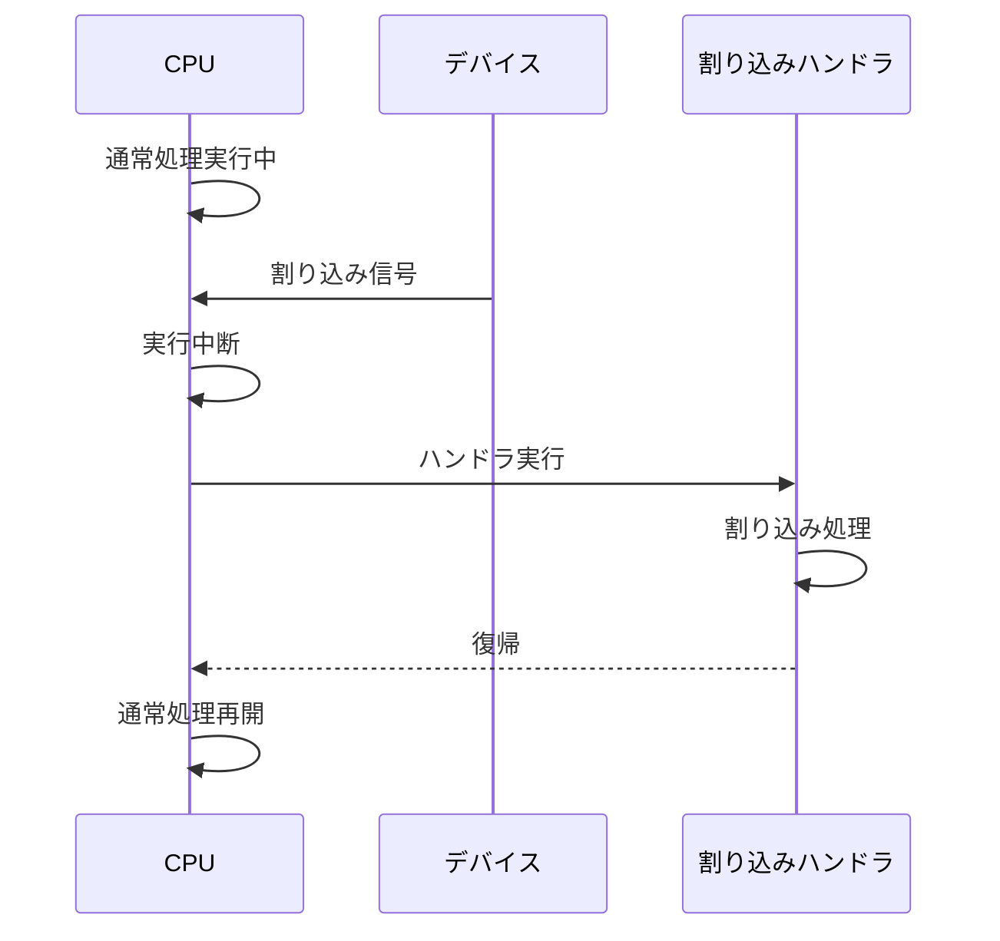

### なぜ割り込みが必要か

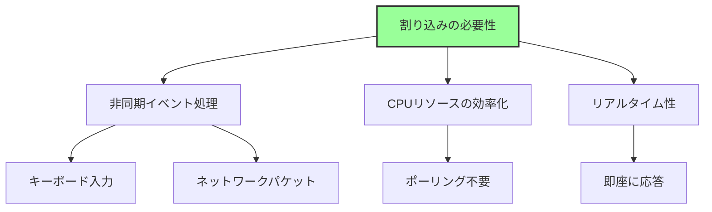

**主な理由:**
1. **ポーリング不要**: CPUが常時チェックする必要がない
2. **即座の応答**: イベント発生時に即座に処理
3. **複数デバイス対応**: 多数のデバイスを効率的に管理

## 割り込みの種類

### 分類

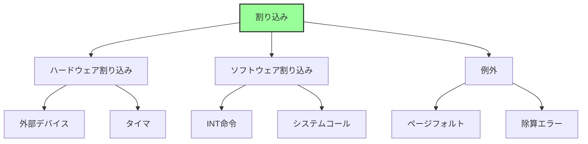

### 詳細

| 種類 | 発生源 | 例 | 番号範囲 |
|------|--------|-----|---------|
| **例外** | CPU内部 | ページフォルト、除算エラー | 0-31 |
| **ハードウェア割り込み** | 外部デバイス | キーボード、タイマ、ネットワーク | 32-255 |
| **ソフトウェア割り込み** | INT命令 | システムコール、BIOS呼び出し | 任意 |

## IDT (Interrupt Descriptor Table)

### 概要

**IDT**は、割り込み番号からハンドラアドレスへのマッピングを提供します。

```mermaid
graph LR
    A[割り込み発生<br/>割り込み番号: N] --> B[IDT参照<br/>IDT[N]]
    B --> C[ハンドラアドレス取得]
    C --> D[ハンドラ実行]

    style B fill:#9f9,stroke:#333,stroke-width:2px
```

### 構造

```c
// IDT エントリ (64bit)
struct IDTEntry {
    UINT16  OffsetLow;     // ハンドラアドレス下位16bit
    UINT16  SegmentSelector; // コードセグメント
    UINT8   IST;           // Interrupt Stack Table (64bit)
    UINT8   Flags;         // タイプ、DPL、P
    UINT16  OffsetMid;     // ハンドラアドレス中位16bit
    UINT32  OffsetHigh;    // ハンドラアドレス上位32bit
    UINT32  Reserved;
};
```

### IDT の配置

```
メモリ上のIDT:
┌─────────────────┐
│ IDT Entry 0     │ ← 除算エラー
├─────────────────┤
│ IDT Entry 1     │ ← デバッグ例外
├─────────────────┤
│ ...             │
├─────────────────┤
│ IDT Entry 14    │ ← ページフォルト
├─────────────────┤
│ ...             │
├─────────────────┤
│ IDT Entry 32    │ ← タイマ割り込み
├─────────────────┤
│ ...             │
├─────────────────┤
│ IDT Entry 255   │
└─────────────────┘

IDTR レジスタ: IDTのベースアドレスを保持
```

### IDTR レジスタ

```asm
; IDT の設定
lidt [idt_descriptor]

; IDT Descriptor の構造
idt_descriptor:
    dw idt_end - idt_start - 1  ; Limit
    dq idt_start                 ; Base Address
```

## 8259 PIC (Programmable Interrupt Controller)

### レガシーな割り込みコントローラ

**8259 PIC**は、レガシーBIOS時代の割り込みコントローラです。

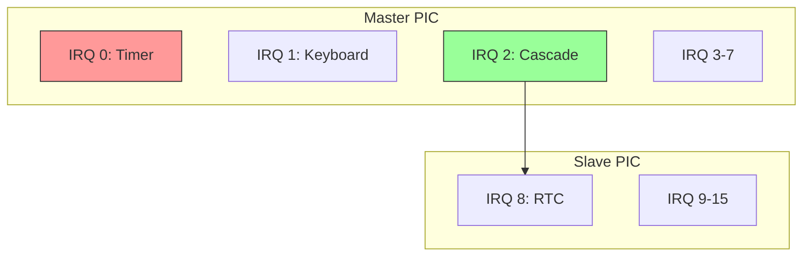

### 制約

- **IRQ数の制限**: 最大15本（Master 7本 + Slave 8本）
- **単一CPU**: マルチプロセッサ非対応
- **固定優先度**: 柔軟性に欠ける

## APIC (Advanced Programmable Interrupt Controller)

### 概要

**APIC**は、モダンなマルチコアCPU向けの割り込みコントローラです。

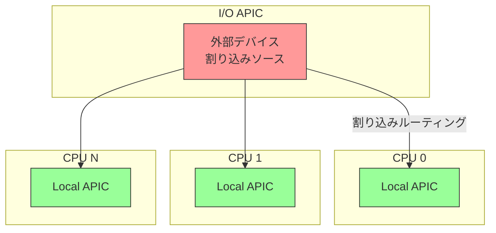

### 2つのコンポーネント

**1. Local APIC (各CPUコアに1つ)**
- CPU固有の割り込み処理
- タイマー機能
- IPI (Inter-Processor Interrupt) 送信

**2. I/O APIC (チップセットに1つ以上)**
- 外部デバイスからの割り込み受信
- 割り込みのルーティング
- 複数CPUへの配信

### APIC のメモリマップ

```
Local APIC: 0xFEE00000 (MMIO)
├─ 0xFEE00020: Local APIC ID
├─ 0xFEE00080: Task Priority Register
├─ 0xFEE00320: Timer LVT
└─ ...

I/O APIC: 0xFEC00000 (MMIO)
├─ Redirection Table
└─ ...
```

### 割り込みルーティング

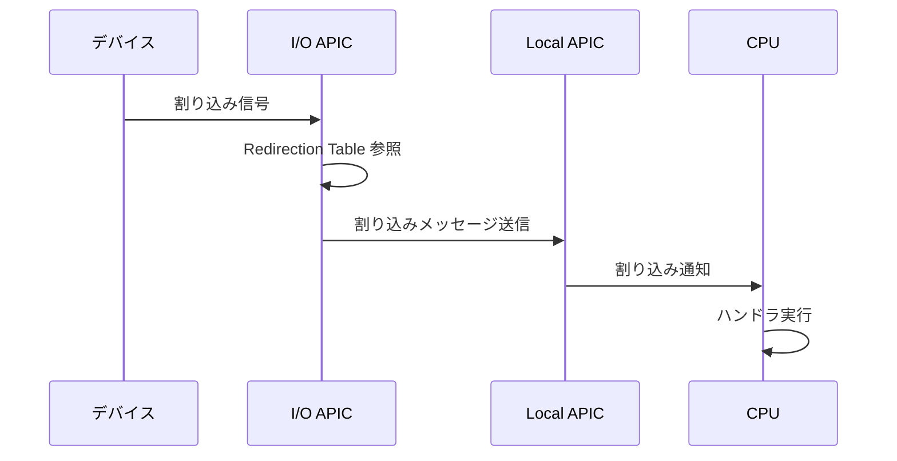

## MSI/MSI-X (Message Signaled Interrupts)

### 概要

**MSI/MSI-X**は、PCIeデバイスが使用するモダンな割り込み方式です。

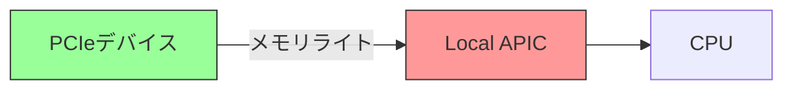

### レガシー割り込みとの違い

| 項目 | レガシー (INTx) | MSI/MSI-X |
|------|----------------|-----------|
| 方式 | 専用信号線 | メモリライト |
| 共有 | 可能（問題あり） | 専用 |
| 割り込み数 | 4本 (INTA-INTD) | 最大2048 |
| パフォーマンス | 低い | 高い |

### なぜMSIが優れているか

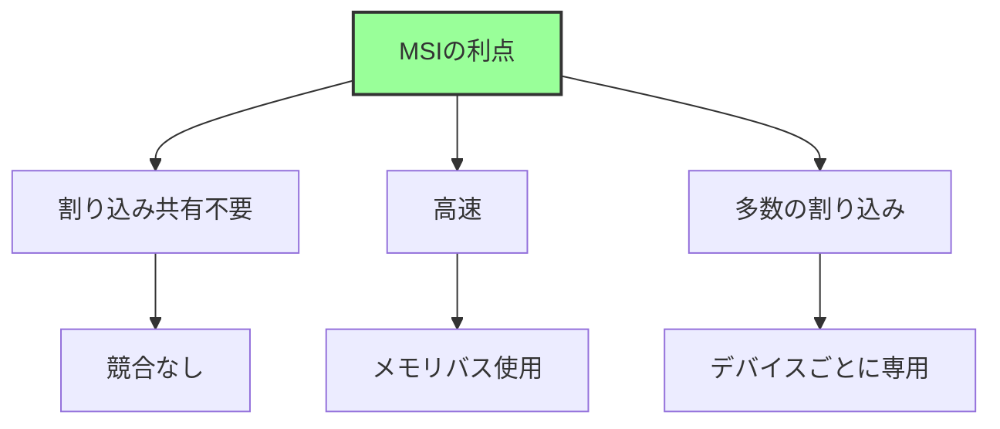

## タイマ

### タイマの役割

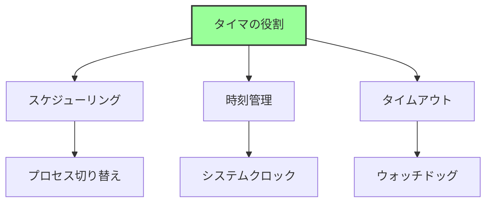

### x86_64 のタイマ種類

| タイマ | 周波数 | 精度 | 用途 |
|--------|--------|------|------|
| **PIT** (8254) | 1.193MHz | 低 | レガシー |
| **RTC** (Real Time Clock) | 32.768kHz | 低 | CMOS時計 |
| **Local APIC Timer** | CPU依存 | 中 | 各CPU固有 |
| **HPET** (High Precision Event Timer) | 10MHz以上 | 高 | モダン |
| **TSC** (Time Stamp Counter) | CPU周波数 | 最高 | 計測専用 |

### PIT (Programmable Interval Timer)

**レガシーなタイマ**ですが、互換性のために残っています。

```
I/O ポート:
0x40-0x43: PIT チャネル0-2、コマンド

周波数: 1.193182 MHz
分周比設定で割り込み周期を決定
```

### Local APIC Timer

各CPUコアに内蔵されたタイマです。

```c
// Local APIC Timer の設定（概念的）
void SetupLocalAPICTimer(UINT32 IntervalMs) {
    // 初期カウント値設定
    *((volatile UINT32*)0xFEE00380) = CalculateCount(IntervalMs);

    // タイマーモード設定（定期的）
    *((volatile UINT32*)0xFEE00320) = 0x20000 | TIMER_VECTOR;
}
```

### HPET (High Precision Event Timer)

モダンなシステムで使用される高精度タイマです。

```
MMIO ベースアドレス: ACPI HPETテーブルで指定
最小周波数: 10MHz
最大カウンタ数: 32個

特徴:
- 高精度
- 複数タイマー
- 64bitカウンタ
```

### TSC (Time Stamp Counter)

CPU内蔵のカウンタで、最も高精度です。

```asm
rdtsc  ; EDX:EAX に TSC 読み込み
```

**用途:**
- パフォーマンス測定
- 高精度時刻取得

**注意点:**
- 周波数がCPU依存
- マルチコアでは同期が必要
- 省電力モードで停止する場合あり

## ファームウェアにおける割り込み

### UEFI と割り込み

UEFIファームウェアは、通常**割り込みを無効化**して動作します。


**理由:**
1. **単純性**: 割り込みハンドラ不要
2. **予測可能性**: タイミングが決定的
3. **OSへの引き渡し**: OSが自由に設定

### 例外的に使用するケース

- **タイマー**: 一部のUEFI実装でLocal APIC Timerを使用
- **デバッグ**: シリアルポート割り込み

## 割り込みの初期化プロセス

### OS起動時の流れ

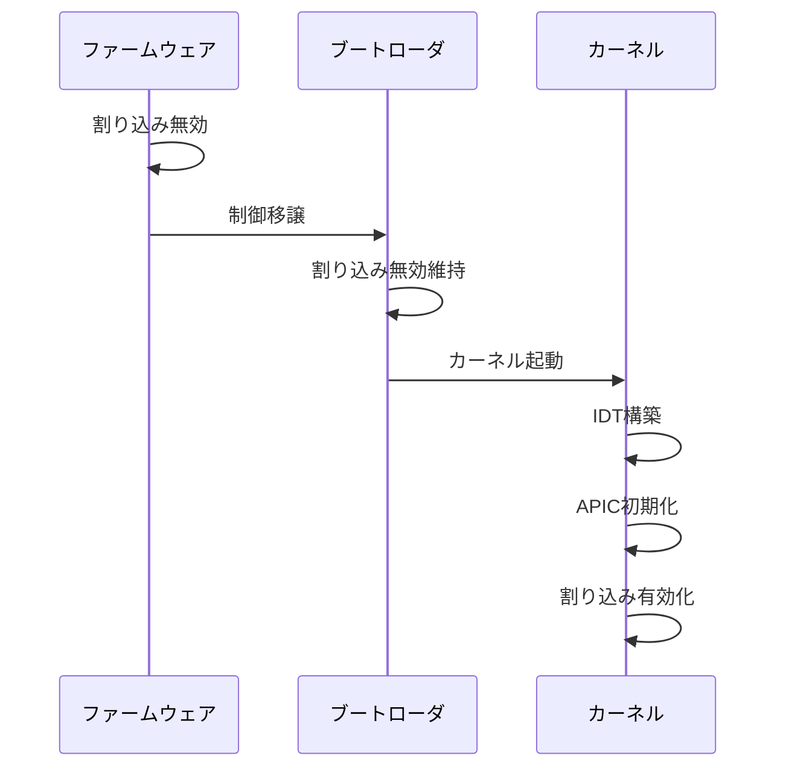

### Linux カーネルの例

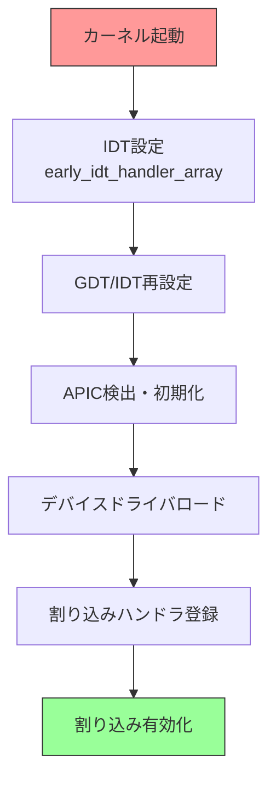

## まとめ

この章では、割り込みとタイマの仕組みを説明しました。

**重要なポイント:**

- **割り込み**は非同期イベントをCPUに通知する仕組み
- **IDT**が割り込み番号とハンドラをマッピング
- **APIC**はモダンなマルチコア対応割り込みコントローラ
  - Local APIC: 各CPUコア固有
  - I/O APIC: 外部デバイス管理
- **MSI/MSI-X**はPCIeデバイスの高性能割り込み方式
- **タイマ**の種類：PIT（レガシー）、HPET（モダン）、TSC（高精度）

**APIC アーキテクチャ:**

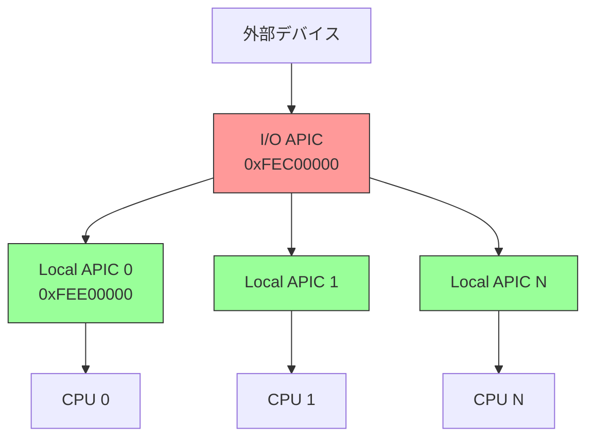

---

**次章では、UEFI ブートフェーズの全体像を見ていきます。**

📚 **参考資料**
- [Intel® 64 and IA-32 Architectures Software Developer's Manual - Volume 3, Chapter 10: Advanced Programmable Interrupt Controller (APIC)](https://www.intel.com/sdm)
- [Intel® 64 and IA-32 Architectures Software Developer's Manual - Volume 3, Chapter 6: Interrupt and Exception Handling](https://www.intel.com/sdm)
- [IA-PC HPET Specification](https://www.intel.com/content/dam/www/public/us/en/documents/technical-specifications/software-developers-hpet-spec-1-0a.pdf)
- [PCI Local Bus Specification - MSI/MSI-X](https://pcisig.com/specifications)
