# UEFI ブートフェーズの全体像

🎯 **この章で学ぶこと**
- UEFI のブートフェーズ構造
- 各フェーズの役割と責務
- SEC, PEI, DXE, BDS, TSL の流れ
- Platform Initialization (PI) 仕様

📚 **前提知識**
- リセットベクタ（第1章）
- CPUモード遷移（第3章）

---

## UEFI ブートフェーズ

UEFI ファームウェアは、電源投入から OS 起動まで、明確に定義された 5 つのフェーズを経て動作します。各フェーズは、特定の役割と責務を持ち、次のフェーズへの準備を整えます。これらのフェーズは、SEC (Security)、PEI (Pre-EFI Initialization)、DXE (Driver Execution Environment)、BDS (Boot Device Selection)、TSL/RT (Transient System Load / Runtime) と呼ばれ、それぞれが段階的にシステムを初期化していきます。

最初の SEC フェーズは、電源投入直後に実行され、CPU の基本的な初期化と、DRAM が利用可能になる前の一時的な RAM（CAR: Cache as RAM）の設定を行います。次に、PEI フェーズが DRAM を初期化し、基本的なハードウェアコンポーネントを設定します。DXE フェーズは、ドライバ実行環境を提供し、デバイスドライバをロードして各種ハードウェアを利用可能にします。BDS フェーズは、ブートデバイスを選択し、OS ブートローダを実行します。最後に、TSL/RT フェーズで OS が起動し、UEFI はランタイムサービスを提供し続けます。

この段階的なアプローチにより、UEFI ファームウェアは複雑な初期化処理を管理しやすい単位に分割し、各段階で確実にシステムを構築していきます。各フェーズは、前のフェーズが正常に完了したことを前提とし、必要なリソース（メモリ、CPU、デバイスなど）が利用可能になった状態で実行されます。この設計により、ファームウェアのデバッグ、保守、拡張が容易になっています。

**補足図**: 以下の図は、UEFI の 5 つのフェーズの遷移を示したものです。

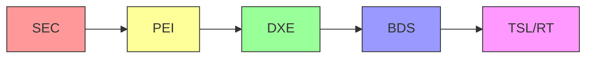

**参考表**: 以下の表は、各フェーズの名称と主な役割をまとめたものです。

| フェーズ | 名称 | 主な役割 |
|---------|------|---------|
| **SEC** | Security | CPU初期化、一時RAM設定 |
| **PEI** | Pre-EFI Initialization | DRAM初期化、基本H/W初期化 |
| **DXE** | Driver Execution Environment | ドライバ実行、デバイス列挙 |
| **BDS** | Boot Device Selection | ブートデバイス選択 |
| **TSL/RT** | Transient System Load / Runtime | OS起動、ランタイムサービス |

## SEC Phase (Security)

### 役割

SEC (Security) フェーズは、UEFI ファームウェアにおける最初のフェーズであり、システムが電源投入直後に最初に実行するコードです。CPU がリセットベクタ（0xFFFFFFF0）から実行を開始すると、最初に SEC フェーズのエントリポイントに制御が移ります。SEC フェーズの主な役割は、CPU の基本的な初期化、一時的な RAM の確保、そして次のフェーズである PEI の検索と起動です。この段階では、まだ DRAM が初期化されていないため、通常の RAM を使用することができません。したがって、SEC フェーズは非常に制約された環境で動作する必要があります。

SEC フェーズは、システムのセキュリティの基盤を確立する責任も負っています。名前が「Security」であることからもわかるように、このフェーズでは、信頼の連鎖（Chain of Trust）の起点となります。SEC フェーズのコードは、通常、フラッシュメモリの保護された領域に配置されており、改ざんから守られています。SEC フェーズは、次に実行される PEI Core の完全性を検証し、信頼できるコードのみが実行されることを保証します。この仕組みは、Secure Boot の基礎となっています。

**補足図**: 以下の図は、リセットベクタから SEC エントリポイントを経て PEI に至るまでの流れを示したものです。

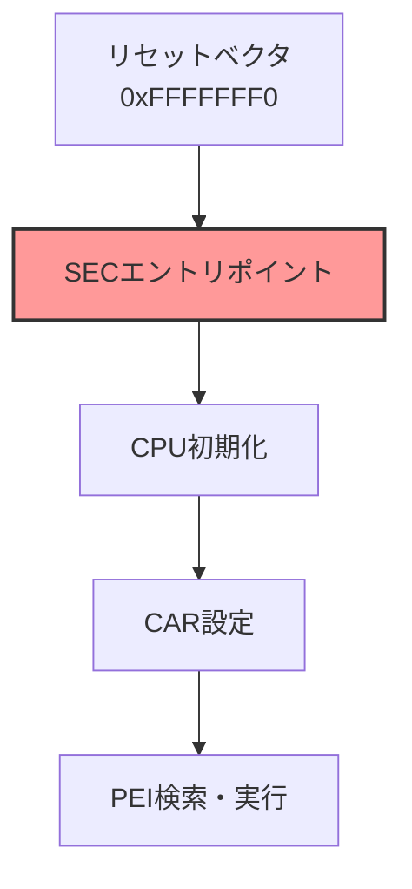

### 主な処理

SEC フェーズの処理は、3 つの主要なタスクで構成されています。第一に、CPU の初期化です。これには、CPU キャッシュの設定、マイクロコードのロード、そして x86_64 アーキテクチャの場合はロングモードへの遷移が含まれます。マイクロコードのロードは、CPU のバグ修正や機能拡張のために重要で、SEC フェーズの早い段階で実行されます。ロングモードへの遷移は、GDT の設定、CR レジスタの操作、ページテーブルの構築など、複数のステップを必要とします。

第二に、CAR (Cache as RAM) の設定です。DRAM がまだ初期化されていない段階で、ファームウェアはスタックやヒープとして使用できる RAM が必要です。CAR は、CPU のキャッシュメモリを RAM として利用する技術で、No-Evict モードと呼ばれる特別なモードを使用します。このモードでは、キャッシュラインが外部メモリに書き戻されることなく、データを保持し続けます。通常、64KB から 256KB 程度のキャッシュが RAM として利用可能になります。この一時的な RAM により、C 言語で記述されたコードを実行し、複雑な初期化処理を行うことができます。

第三に、PEI Core の検索とロードです。SEC フェーズは、ファームウェアボリューム（Flash メモリ内の特定の領域）から PEI Core を検索し、メモリにロードします。PEI Core が見つかると、SEC フェーズはその実行アドレスにジャンプし、制御を PEI フェーズに移します。この遷移により、システムは次の初期化段階に進むことができます。

### CAR の仕組み

CAR (Cache as RAM) は、DRAM が利用できない段階で RAM を確保するための巧妙な技術です。通常、CPU キャッシュはメモリアクセスを高速化するために使用されますが、適切に設定することで、一時的な RAM として機能させることができます。CAR の仕組みは、CPU キャッシュを No-Evict モードに設定することです。通常のキャッシュ動作では、キャッシュラインが満杯になると、古いデータが外部メモリ（DRAM）に書き戻され、新しいデータが読み込まれます。しかし、No-Evict モードでは、キャッシュラインがメモリに書き戻されることなく保持されます。これにより、DRAM が存在しなくても、キャッシュをデータストレージとして使用できます。

CAR の設定は、プラットフォーム固有の MSR (Model-Specific Register) や MTRR (Memory Type Range Register) を操作することで行われます。Intel プロセッサでは、特定の MSR を設定してキャッシュを No-Fill モードまたは No-Evict モードにします。AMD プロセッサも同様の機構を提供していますが、詳細は異なります。CAR 領域のサイズは、CPU のキャッシュサイズに依存しますが、通常 64KB から 256KB 程度です。この領域は、スタック、ヒープ、グローバル変数など、C 言語プログラムの実行に必要なメモリとして使用されます。

CAR は、DRAM が初期化されるまでの一時的なソリューションです。PEI フェーズで DRAM が利用可能になると、CAR からデータを DRAM に移行し、CPU キャッシュを通常のキャッシュモードに戻します。この移行プロセスは、CAR Migration と呼ばれ、慎重に実行する必要があります。スタックポインタやヒープアドレスを適切に更新しないと、システムがクラッシュします。

**補足図**: 以下の図は、DRAM が未初期化の状態で CPU キャッシュを No-Evict モードに設定し、一時的な RAM を確保する CAR の仕組みを示したものです。

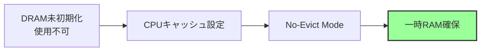

## PEI Phase (Pre-EFI Initialization)

### 役割

PEI (Pre-EFI Initialization) フェーズは、プラットフォーム固有の初期化を実行するフェーズです。SEC フェーズから制御を受け取ると、PEI Core が起動し、PEIM (PEI Module) と呼ばれるモジュールを順次実行します。PEI フェーズの最も重要な役割は、DRAM の初期化です。SEC フェーズでは CAR を使用して一時的な RAM しか利用できませんでしたが、PEI フェーズで DRAM が初期化されることで、システムは大容量のメモリを使用できるようになります。これにより、次の DXE フェーズで複雑なドライバや OS ブートローダをロードするための基盤が整います。

PEI フェーズは、DRAM 初期化以外にも、CPU やチップセットの初期化、基本的なハードウェアコンポーネントの設定を行います。この段階で、プラットフォーム固有の設定が適用され、システムの基本的な動作環境が構築されます。PEI フェーズの処理が完了すると、DXE Core が検索され、メモリにロードされ、制御が DXE フェーズに移ります。PEI フェーズは、リソースが限られた環境で動作するため、コードサイズと実行時間の両方を最小限に抑えるように設計されています。

**補足図**: 以下の図は、PEI Core が PEIM を実行し、DRAM を初期化してから DXE を検索・ロードするまでの流れを示したものです。

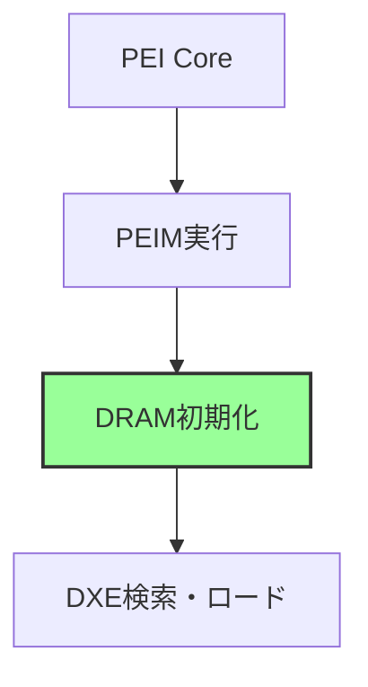

### 主な処理

PEI フェーズの処理は、3 つの主要なタスクで構成されています。第一に、DRAM の初期化です。これは、PEI フェーズの中で最も重要かつ複雑なタスクです。DRAM 初期化には、メモリコントローラの設定、DRAM トレーニング、メモリマップの構築が含まれます。メモリコントローラの設定では、メモリのタイミングパラメータ、電圧、周波数などを適切に構成します。DRAM トレーニングは、メモリモジュールの特性を学習し、最適な読み書きタイミングを決定するプロセスです。このプロセスには、数百ミリ秒から数秒かかることがあり、ブート時間の大部分を占めます。メモリマップの構築では、利用可能な物理メモリ範囲を識別し、OS に渡すためのメモリディスクリプタを作成します。

第二に、CPU とチップセットの初期化です。これには、プラットフォーム固有の設定が含まれます。たとえば、電源管理機能の設定、PCIe ルートコンプレックスの初期化、I/O APIC の設定などがあります。これらの処理は、プラットフォームごとに異なるため、PEIM として実装されています。各 PEIM は、特定のハードウェアコンポーネントの初期化を担当し、モジュール化された設計により、プラットフォームの移植性が向上しています。

第三に、DXE Core の検索とロードです。DRAM が利用可能になると、PEI フェーズはファームウェアボリュームから DXE Core を検索し、DRAM にロードします。DXE Core のエントリポイントにジャンプすることで、制御が DXE フェーズに移ります。この時点で、CAR から DRAM への移行（CAR Migration）も完了し、システムは通常のメモリ環境で動作するようになります。

### PEIM (PEI Module)

PEI フェーズでは、PEIM (PEI Module) と呼ばれるモジュールが順次実行されます。PEIM は、特定の初期化タスクを実行する小さなコードモジュールで、PEI Core によってロードされ、実行されます。各 PEIM は、依存関係を持つことができ、PEI Core は依存関係を解決してから PEIM を実行します。これにより、たとえば、メモリ初期化 PEIM が完了してから、メモリに依存する他の PEIM が実行されることが保証されます。

主な PEIM には、CPU 初期化 PEIM、メモリ初期化 PEIM、チップセット初期化 PEIM があります。CPU 初期化 PEIM は、CPU の高度な機能（仮想化、セキュリティ機能など）を設定します。メモリ初期化 PEIM は、前述の DRAM 初期化を担当します。チップセット初期化 PEIM は、PCH (Platform Controller Hub) や南北ブリッジなど、プラットフォーム固有のチップセットを初期化します。PEIM は、ファームウェアボリューム内に格納されており、PEI Core がファイルシステムを走査して検出します。

PEIM の実行順序は、依存関係によって決定されます。各 PEIM は、depex (dependency expression) と呼ばれる依存関係記述を持ち、PEI Core はこの情報に基づいて、実行順序を決定します。たとえば、DRAM を使用する PEIM は、メモリ初期化 PEIM が完了するまで実行されません。この仕組みにより、正しい順序で初期化が実行され、システムの安定性が確保されます。

**補足図**: 以下の図は、複数の PEIM が順次実行される流れを示したものです。

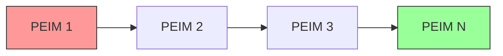

## DXE Phase (Driver Execution Environment)

### 役割

DXE (Driver Execution Environment) フェーズは、ドライバ実行環境を提供し、システムの主要なデバイスを初期化するフェーズです。PEI フェーズから制御を受け取ると、DXE Core が起動し、DXE Dispatcher がファームウェアボリュームから DXE ドライバを検索し、順次ロードして実行します。DXE フェーズの主な役割は、PCIe デバイスの列挙、USB コントローラの初期化、ネットワークカードの設定、ストレージデバイスの検出など、OS が必要とするハードウェアリソースを利用可能にすることです。

DXE フェーズでは、UEFI プロトコルという抽象化レイヤを通じて、各種デバイスやサービスにアクセスできるようになります。たとえば、Block I/O Protocol はストレージデバイスへのアクセスを提供し、Graphics Output Protocol (GOP) は画面描画機能を提供します。これらのプロトコルは、ドライバによって公開され、他のドライバやアプリケーションから利用されます。DXE フェーズの処理が完了すると、システムはブート可能な状態になり、BDS フェーズに移行します。

**補足図**: 以下の図は、DXE Core が DXE Dispatcher を通じてドライバをロード・実行し、デバイス列挙とプロトコル公開を経て BDS に至るまでの流れを示したものです。

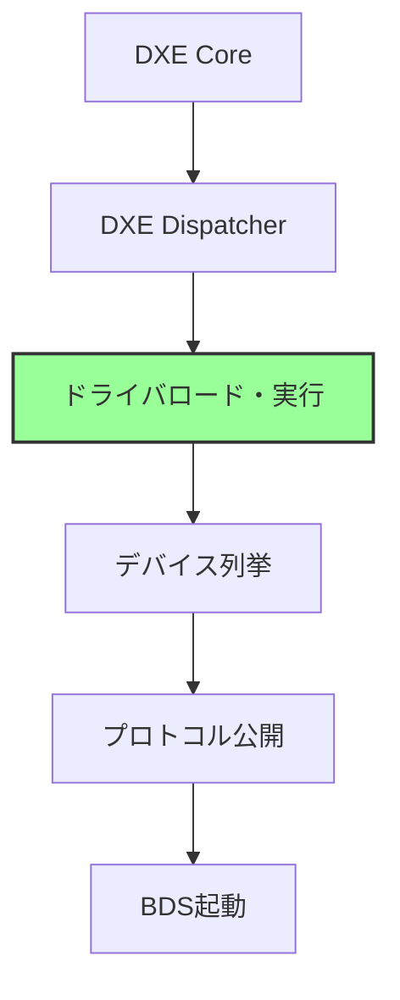

### 主な処理

DXE フェーズの処理は、3 つの主要なタスクで構成されています。第一に、DXE Dispatcher による ドライバのロードと実行です。DXE Dispatcher は、ファームウェアボリュームを走査し、DXE ドライバを検索します。各ドライバは、depex (dependency expression) を持ち、Dispatcher は依存関係を解決してから、適切な順序でドライバをロードします。たとえば、USB Mass Storage Driver は、USB Host Controller Driver が先にロードされることを依存関係として記述しています。Dispatcher は、すべての依存関係が満たされたドライバから順次実行していきます。

第二に、デバイスの初期化です。DXE フェーズでは、PCIe バスの列挙が行われ、PCIe デバイスが検出されます。各 PCIe デバイスに対して、適切なドライバが割り当てられ、初期化されます。USB コントローラ、ネットワークインターフェース、ストレージコントローラ（SATA、NVMe）などが、この段階で利用可能になります。PCIe 列挙プロセスでは、ベースアドレスレジスタ (BAR) の設定、割り込みの割り当て、デバイスの有効化が行われます。

第三に、UEFI プロトコルの公開です。各ドライバは、提供する機能を UEFI プロトコルとして公開します。プロトコルは、インターフェース仕様であり、関数ポインタのテーブルとして実装されます。たとえば、Block I/O Protocol は ReadBlocks()、WriteBlocks()、FlushBlocks() などの関数を提供します。これらのプロトコルは、ハンドルデータベースに登録され、他のコンポーネントから利用可能になります。プロトコルにより、ハードウェアの詳細が抽象化され、OS ブートローダやアプリケーションは、ハードウェアに依存しない方法でデバイスにアクセスできます。

### DXE Driver

DXE ドライバは、その役割に応じて、いくつかの種類に分類されます。Core Driver は、DXE Core 自体や、基盤となるサービス（メモリ管理、ハンドルデータベースなど）を提供します。Bus Driver は、バスを管理し、バス上のデバイスを列挙します。たとえば、PCIe Bus Driver は PCIe バスを走査し、接続されたデバイスを検出します。Device Driver は、特定のデバイスを制御するドライバで、USB Mass Storage Driver や NVMe Driver などがあります。Application は、UEFI アプリケーションで、UEFI シェルやファームウェア設定ユーティリティなどが含まれます。

各ドライバは、UEFI Driver Model に従って実装されています。Driver Model は、ドライバのロード、開始、停止、アンロードのライフサイクルを定義しています。ドライバは、Supported() 関数でデバイスをサポートするかを判断し、Start() 関数でデバイスを初期化し、Stop() 関数でデバイスを停止します。この標準化されたモデルにより、ドライバの開発、テスト、デバッグが容易になっています。

**補足図**: 以下の図は、DXE ドライバの種類と階層を示したものです。

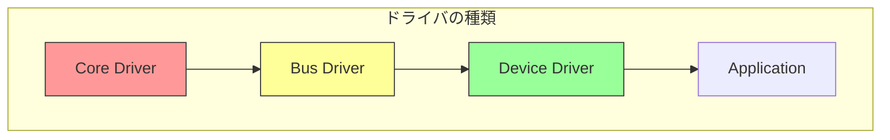

**参考表**: 以下の表は、DXE ドライバの種類と具体例をまとめたものです。

| 種類 | 役割 | 例 |
|------|------|-----|
| Core Driver | 基盤サービス | DXE Core自体 |
| Bus Driver | バス管理 | PCIe Bus Driver |
| Device Driver | デバイス制御 | USB Mass Storage Driver |
| Application | アプリケーション | UEFIシェル |

## BDS Phase (Boot Device Selection)

### 役割

BDS (Boot Device Selection) フェーズは、ブートデバイスを選択し、OS ブートローダを起動するフェーズです。DXE フェーズが完了し、すべてのデバイスが利用可能になると、BDS フェーズが開始されます。BDS の主な役割は、NVRAM に保存されたブート設定を読み込み、指定された順序でブートオプションを試行し、OS を起動することです。ブートオプションには、ハードディスク、USB ドライブ、ネットワークブート（PXE）、UEFI シェルなどが含まれます。

BDS フェーズは、ユーザーが設定したブート順序（BootOrder）に従って、各ブートオプションを順次試行します。ブートオプションが成功すると、制御は OS ブートローダに移り、TSL フェーズに移行します。ブートオプションが失敗した場合（たとえば、ブータブルメディアが挿入されていない）、BDS は次のブートオプションを試行します。すべてのブートオプションが失敗した場合、BDS はフォールバックパス（`\EFI\BOOT\BOOTx64.EFI`）を試みるか、UEFI シェルやファームウェア設定画面を表示します。

**補足図**: 以下の図は、BDS が BootOrder を読み込み、ブートオプションを試行し、成功すれば TSL に移行する流れを示したものです。

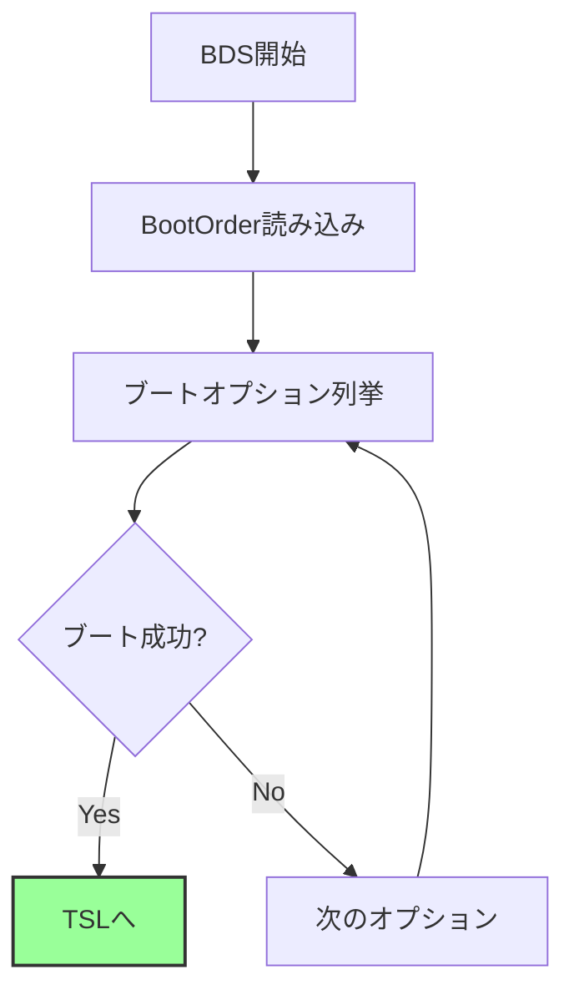

### 主な処理

BDS フェーズの処理は、3 つの主要なタスクで構成されています。第一に、BootOrder の取得です。BootOrder は、NVRAM 変数として保存されており、ブートオプションの試行順序を定義します。BDS は、Runtime Services の GetVariable() を使用して BootOrder を読み込みます。BootOrder には、Boot0000、Boot0001 などのブートオプション変数へのインデックスが格納されています。各ブートオプション変数には、デバイスパス、説明文字列、オプションのロードオプションなどが含まれます。

第二に、ブートオプションの試行です。BDS は、BootOrder で指定された順序で、各ブートオプションを試行します。ブートオプションがストレージデバイスを指している場合、BDS は ESP (EFI System Partition) をマウントし、指定されたブートローダ（通常は `\EFI\<vendor>\<bootloader>.efi`）を検索します。ブートローダが見つかると、BDS はそれをメモリにロードし、実行します。ブートローダは、UEFI アプリケーションとして実装されており、Boot Services や Runtime Services を利用できます。

第三に、フォールバックメカニズムです。すべての BootOrder オプションが失敗した場合、BDS はリムーバブルメディアのデフォルトブートパス（`\EFI\BOOT\BOOTx64.EFI` for x86_64）を試行します。このパスは、UEFI 仕様で定義されており、OS インストールメディアや USB ブートドライブで一般的に使用されます。フォールバックも失敗した場合、BDS はファームウェア設定画面やUEFI シェルを表示し、ユーザーの介入を待ちます。

### ブート変数

UEFI ブート変数は、NVRAM に保存されており、ブートプロセスの設定を保持します。BootOrder 変数は、UINT16 の配列で、ブートオプションのインデックスを起動順に格納します。たとえば、`{0x0002, 0x0001, 0x0000}` という BootOrder は、Boot0002、Boot0001、Boot0000 の順に試行することを意味します。各ブートオプション変数（Boot0000、Boot0001 など）は、デバイスパス、説明文字列、属性、オプションのロードオプションを含む構造体です。

BootCurrent 変数は、現在起動中のブートオプションのインデックスを示します。これは、OS が自分がどのブートオプションから起動されたかを知るために使用されます。BootNext 変数は、次回のブートで使用するブートオプションを指定します。これは、一時的に異なる OS を起動したい場合に便利です。これらの変数は、UEFI 仕様で詳細に定義されており、OS やファームウェア設定ツールから操作できます。

## TSL/RT (Transient System Load / Runtime)

### TSL: OS起動

TSL (Transient System Load) フェーズは、OS ブートローダが実行され、OS カーネルをロードするフェーズです。BDS フェーズでブートローダが起動されると、制御はブートローダに移り、TSL フェーズが開始されます。ブートローダは、UEFI アプリケーションとして実装されており、Boot Services や Runtime Services を利用してOS カーネルをメモリにロードします。ブートローダの主な役割は、カーネルイメージをストレージから読み込み、必要な初期 RAM ディスク（initrd/initramfs）をロードし、カーネルに制御を移すことです。

ブートローダがカーネルロードを完了すると、ExitBootServices() を呼び出します。この関数は、UEFI Boot Services を終了し、OS に制御を渡す準備をします。ExitBootServices() が呼ばれると、Boot Services は利用できなくなり、ファームウェアが使用していたメモリ領域が OS に解放されます。ただし、Runtime Services は引き続き利用可能で、OS は NVRAM 変数のアクセスやシステムリセットなどの機能を利用できます。カーネルは、ExitBootServices() の後、自身の初期化を開始し、デバイスドライバをロードし、ユーザー空間プログラムを起動します。

**補足図**: 以下のシーケンス図は、BDS がブートローダを実行し、ブートローダがカーネルをロードして ExitBootServices() を呼び出すまでの流れを示したものです。

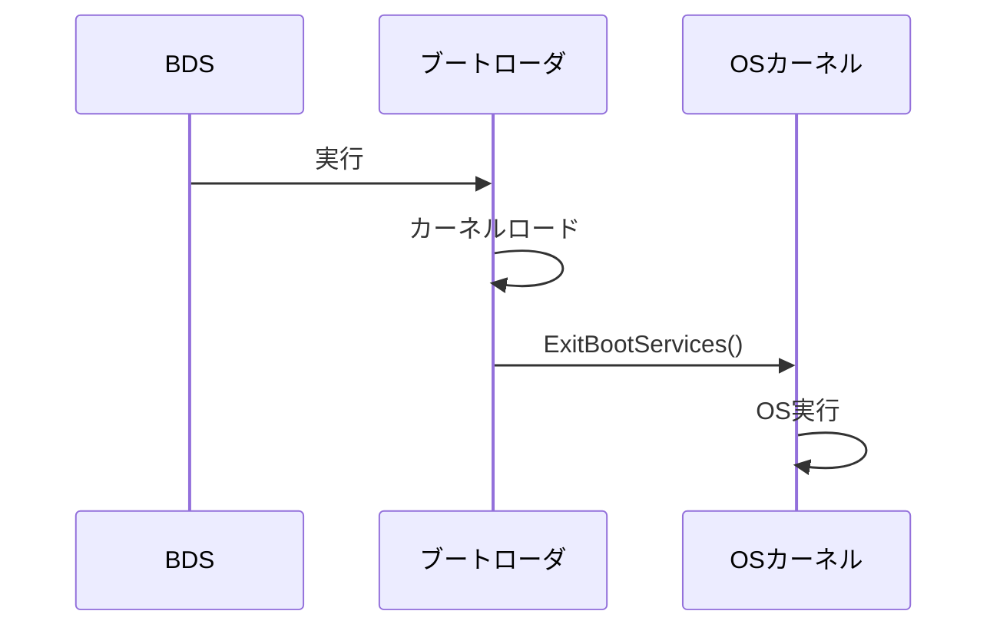

### Runtime Services

UEFI は、OS 実行中も Runtime Services を提供し続けます。Runtime Services は、OS がファームウェアの特定機能にアクセスするためのインターフェースです。主な Runtime Services には、NVRAM 変数へのアクセス、システム時刻の取得と設定、システムリセット、カプセル更新（ファームウェアアップデート）などがあります。これらのサービスは、OS が実行中でも呼び出すことができ、ファームウェアとOS の間の重要な橋渡し役を果たします。

NVRAM 変数アクセスは、OS がブート設定を変更したり、ファームウェア設定を読み書きしたりするために使用されます。GetVariable() と SetVariable() 関数により、OS は NVRAM に保存された変数を操作できます。時刻関連サービスは、ハードウェアクロック（RTC）へのアクセスを提供し、OS がシステム時刻を取得・設定できるようにします。ResetSystem() 関数は、システムの再起動、シャットダウン、リセットを実行します。これらのサービスにより、OS はファームウェアレベルの機能に統一されたインターフェースでアクセスできます。

以下のコード例は、Runtime Services の構造体定義を示しています。

```c
// Runtime Services の例
typedef struct {
    // 時刻関連
    EFI_GET_TIME                GetTime;
    EFI_SET_TIME                SetTime;

    // 変数アクセス
    EFI_GET_VARIABLE            GetVariable;
    EFI_SET_VARIABLE            SetVariable;

    // リセット
    EFI_RESET_SYSTEM            ResetSystem;
} EFI_RUNTIME_SERVICES;
```

## Platform Initialization (PI) 仕様

### PI と UEFI の関係

Platform Initialization (PI) 仕様は、ファームウェア内部の初期化プロセスを定義する仕様であり、UEFI 仕様と密接に関連しています。PI 仕様は、SEC、PEI、DXE フェーズの実装を規定し、ファームウェア開発者がプラットフォーム初期化コードを記述するための標準化されたフレームワークを提供します。一方、UEFI 仕様は、OS とファームウェアの間のインターフェース（Boot Services、Runtime Services、Protocols）を定義します。これら 2 つの仕様は、ファームウェアの異なる側面を扱っており、相補的な関係にあります。

PI 仕様は、ファームウェア内部のアーキテクチャを規定します。SEC フェーズ、PEI フェーズ、DXE フェーズの各段階で使用されるデータ構造、インターフェース、モジュール間の通信方法が定義されています。一方、UEFI 仕様は、ファームウェアが外部（OS、ブートローダ、アプリケーション）に提供するサービスを規定します。DXE フェーズで構築された Boot Services や Runtime Services は、UEFI 仕様に従って実装され、OS がこれらのサービスを利用できるようにします。したがって、PI 仕様はファームウェアの内部実装を、UEFI 仕様は外部インターフェースを担当しています。

**補足図**: 以下の図は、PI 仕様が SEC、PEI、DXE フェーズを定義し、UEFI 仕様が Boot Services、Runtime Services、Protocols を定義する関係を示したものです。

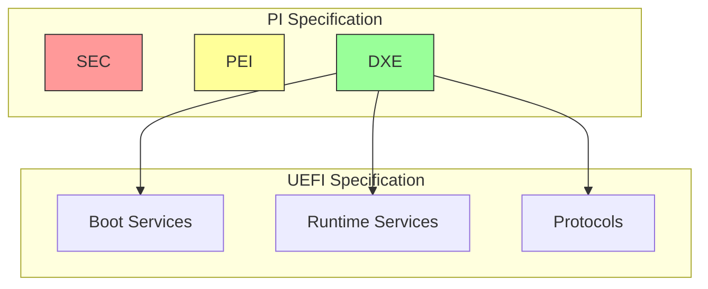

## フェーズ間の遷移

### 全体の流れ

UEFI ブートプロセスの全体の流れは、電源投入から OS 実行まで、5 つのフェーズを経て進行します。電源が投入されると、SEC Phase が開始され、CPU が初期化され、CAR が設定されます。SEC は PEI Core を検索してロードし、制御を PEI Phase に移します。PEI Phase では、DRAM が初期化され、基本的なハードウェアコンポーネントが設定されます。DRAM 初期化が完了すると、PEI は DXE Core をロードし、DXE Phase に移行します。

DXE Phase では、DXE Dispatcher がドライバをロード・実行し、デバイスが列挙されます。すべてのドライバがロードされ、Boot Services が利用可能になると、BDS Phase が開始されます。BDS は BootOrder に従ってブートオプションを試行し、ブートローダを実行します。ブートローダが起動されると、TSL Phase に移行し、ブートローダが OS カーネルをロードします。最後に、ExitBootServices() が呼ばれ、OS が実行を開始します。この時点で、Boot Services は終了しますが、Runtime Services は OS 実行中も利用可能です。

**補足図**: 以下の図は、電源投入から OS Runtime まで、各フェーズがどのように遷移するかを示したものです。

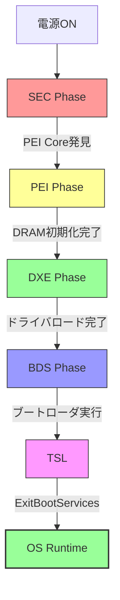

### 各フェーズの期間

各フェーズの実行時間は、プラットフォームや構成によって大きく異なります。SEC Phase は数ミリ秒で完了し、CPU の基本的な初期化と CAR の設定のみを行います。PEI Phase は、DRAM トレーニングのため、100 から 300 ミリ秒かかることが一般的です。DRAM の種類やモジュール数によって、この時間は変動します。DXE Phase は、最も時間がかかるフェーズで、500 から 1000 ミリ秒かかることがあります。多数のドライバをロードし、PCIe デバイスを列挙するため、デバイスの数に応じて時間が増加します。

BDS Phase は、100 から 500 ミリ秒程度で、ブートオプションの試行と ブートローダの検索を行います。TSL Phase は、ブートローダと OS カーネルの起動に要する時間で、OS によって異なります。全体として、UEFI ブートプロセスは、数秒から十数秒で完了することが一般的です。ただし、これらの時間はあくまで概算であり、ファストブート機能の有無、デバイスの数、DRAM のサイズなど、多くの要因によって変動します。

**補足図**: 以下のタイムライン図は、各フェーズの概算実行時間を示したものです。

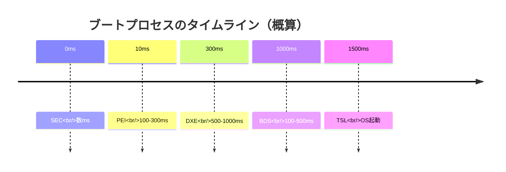

## まとめ

この章では、UEFI ブートフェーズの全体像を詳しく説明しました。UEFI ファームウェアは、SEC、PEI、DXE、BDS、TSL/RT という 5 つの明確に定義されたフェーズを経て、OS を起動します。各フェーズは、特定の役割と責務を持ち、前のフェーズが正常に完了したことを前提として実行されます。この段階的なアプローチにより、複雑な初期化処理が管理しやすい単位に分割され、ファームウェアの開発、デバッグ、保守が容易になっています。

SEC Phase は、CPU の初期化と CAR の設定を担当し、ファームウェアの最初のステップです。PEI Phase は、DRAM を初期化し、基本的なハードウェアコンポーネントを設定します。DXE Phase は、ドライバ実行環境を提供し、デバイスドライバをロードして各種ハードウェアを利用可能にします。BDS Phase は、ブートデバイスを選択し、OS ブートローダを起動します。TSL/RT Phase では、OS が起動され、UEFI は Runtime Services を提供し続けます。

Platform Initialization (PI) 仕様と UEFI 仕様は、相補的な関係にあります。PI 仕様はファームウェア内部の実装を規定し、UEFI 仕様は OS とのインターフェースを定義します。これらの仕様により、ファームウェア開発者は標準化されたフレームワークに従ってプラットフォーム初期化コードを記述でき、OS は統一されたインターフェースでファームウェアの機能にアクセスできます。

**参考表**: 以下の表は、各フェーズの RAM 状態、主な処理、成果物をまとめたものです。

| Phase | RAM状態 | 主な処理 | 成果物 |
|-------|---------|---------|--------|
| SEC | CAR | CPU初期化 | PEI Core |
| PEI | DRAM初期化中→完了 | メモリ初期化 | DXE Core |
| DXE | DRAM利用可 | ドライバ実行 | Boot Services |
| BDS | DRAM利用可 | ブート選択 | OS起動 |

---

**次章では、各ブートフェーズの役割と責務を詳しく見ていきます。**

📚 **参考資料**
- [UEFI Specification v2.10 - Section 2: Boot Phases](https://uefi.org/specifications)
- [UEFI PI Specification v1.8](https://uefi.org/specifications)
- [EDK II Module Writer's Guide](https://tianocore-docs.github.io/edk2-ModuleWriteGuide/)
