# UEFI ブートフェーズの全体像

🎯 **この章で学ぶこと**
- UEFI のブートフェーズ構造
- 各フェーズの役割と責務
- SEC, PEI, DXE, BDS, TSL の流れ
- Platform Initialization (PI) 仕様

📚 **前提知識**
- リセットベクタ（第1章）
- CPUモード遷移（第3章）

---

## UEFI ブートフェーズ

UEFI ファームウェアは、**5つのフェーズ**を経てOSを起動します。

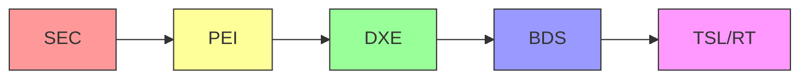

| フェーズ | 名称 | 主な役割 |
|---------|------|---------|
| **SEC** | Security | CPU初期化、一時RAM設定 |
| **PEI** | Pre-EFI Initialization | DRAM初期化、基本H/W初期化 |
| **DXE** | Driver Execution Environment | ドライバ実行、デバイス列挙 |
| **BDS** | Boot Device Selection | ブートデバイス選択 |
| **TSL/RT** | Transient System Load / Runtime | OS起動、ランタイムサービス |

## SEC Phase (Security)

### 役割

**SEC**は、最初に実行されるフェーズです。

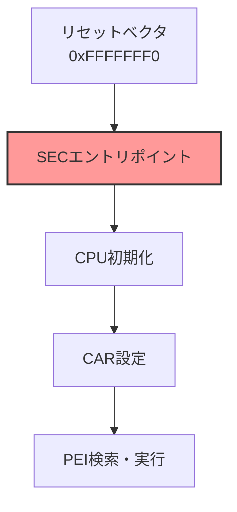

### 主な処理

1. **CPU初期化**
   - キャッシュ設定
   - マイクロコードロード
   - ロングモード遷移

2. **CAR (Cache as RAM)**
   - DRAM未初期化の段階でRAMが必要
   - CPUキャッシュをRAMとして使用

3. **PEI Core の検索とロード**

### CAR の仕組み

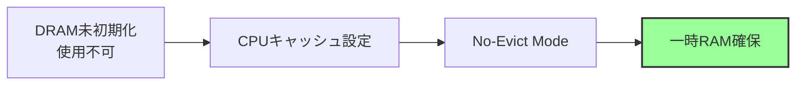

**Cache as RAM:**
- CPUキャッシュをNo-Evictモードに設定
- 通常64KB-256KB程度
- スタック、ヒープとして使用

## PEI Phase (Pre-EFI Initialization)

### 役割

**PEI**は、プラットフォーム固有の初期化を実行します。

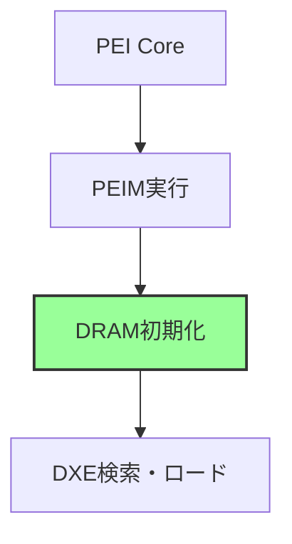

### 主な処理

1. **DRAM初期化**
   - メモリコントローラ設定
   - DRAMトレーニング
   - メモリマップ構築

2. **CPU/チップセット初期化**
   - プラットフォーム固有の設定

3. **DXE Core のロードと起動**

### PEIM (PEI Module)

PEIフェーズでは、**PEIM**と呼ばれるモジュールが順次実行されます。

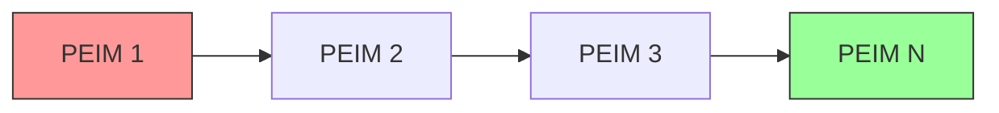

**主なPEIM:**
- CPU初期化PEIM
- メモリ初期化PEIM
- チップセット初期化PEIM

## DXE Phase (Driver Execution Environment)

### 役割

**DXE**は、ドライバ実行環境を提供します。

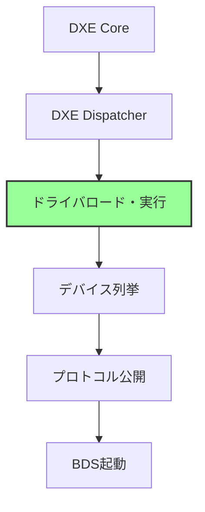

### 主な処理

1. **DXE Dispatcher**
   - ファームウェアボリュームからドライバ検索
   - 依存関係解決
   - ドライバ実行

2. **デバイス初期化**
   - PCIe列挙
   - USB、ネットワーク、ストレージ初期化

3. **プロトコル公開**
   - UEFIプロトコルによるサービス提供

### DXE Driver

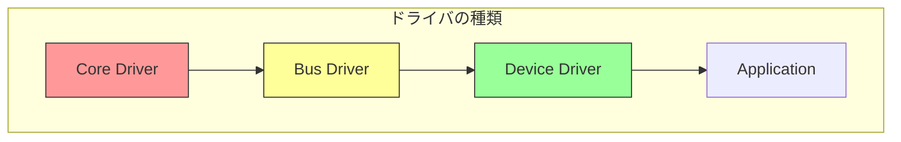

| 種類 | 役割 | 例 |
|------|------|-----|
| Core Driver | 基盤サービス | DXE Core自体 |
| Bus Driver | バス管理 | PCIe Bus Driver |
| Device Driver | デバイス制御 | USB Mass Storage Driver |
| Application | アプリケーション | UEFIシェル |

## BDS Phase (Boot Device Selection)

### 役割

**BDS**は、ブートデバイスを選択しOSを起動します。

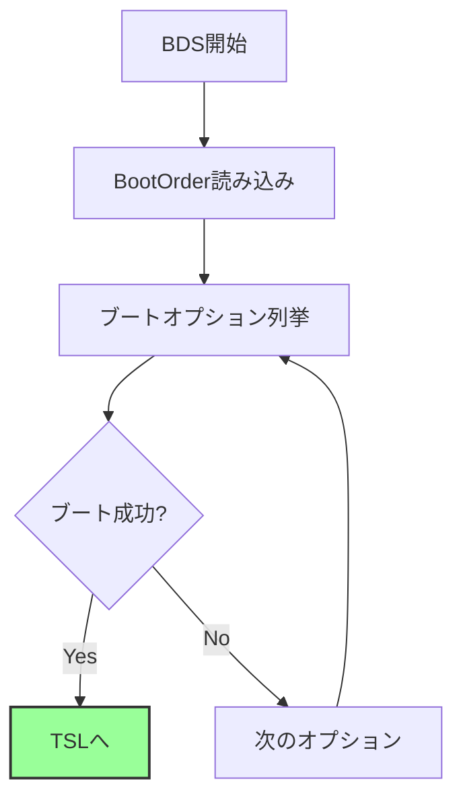

### 主な処理

1. **BootOrder取得**
   - NVRAM から設定読み込み

2. **ブートオプション試行**
   - ESP (EFI System Partition) マウント
   - ブートローダ検索・実行

3. **フォールバック**
   - デフォルトブートパス: `\EFI\BOOT\BOOTx64.EFI`

### ブート変数

```
NVRAM変数:
- BootOrder: 起動順序
- Boot0000, Boot0001, ...: 各ブートオプション
- BootCurrent: 現在のブートオプション
```

## TSL/RT (Transient System Load / Runtime)

### TSL: OS起動

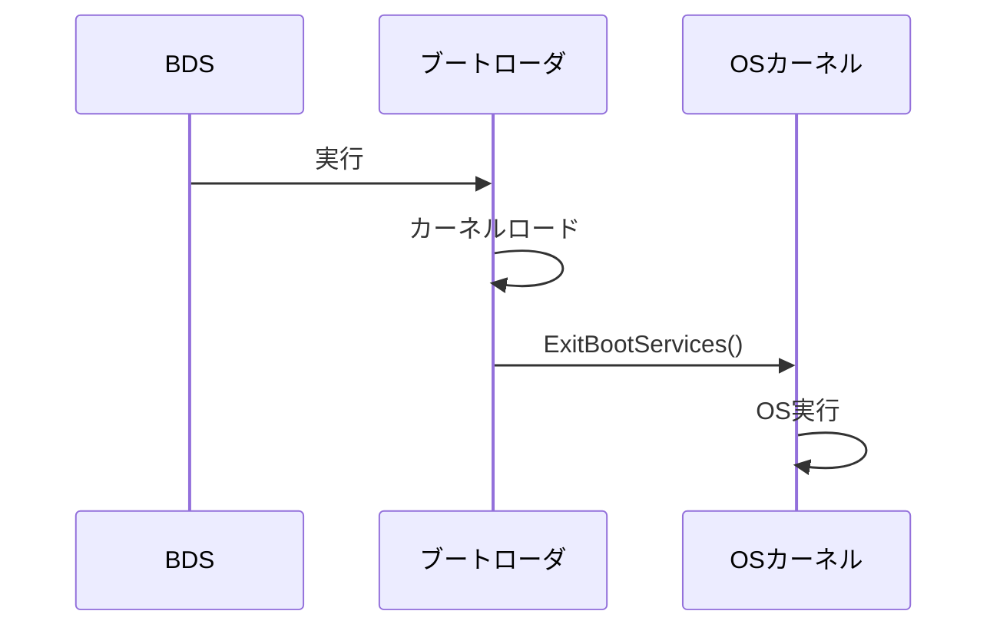

### Runtime Services

UEFIは、**Runtime Services**をOS実行中も提供します。

```c
// Runtime Services の例
typedef struct {
    // 時刻関連
    EFI_GET_TIME                GetTime;
    EFI_SET_TIME                SetTime;

    // 変数アクセス
    EFI_GET_VARIABLE            GetVariable;
    EFI_SET_VARIABLE            SetVariable;

    // リセット
    EFI_RESET_SYSTEM            ResetSystem;
} EFI_RUNTIME_SERVICES;
```

**提供されるサービス:**
- NVRAM変数アクセス
- 時刻取得・設定
- システムリセット

## Platform Initialization (PI) 仕様

### PI と UEFI の関係

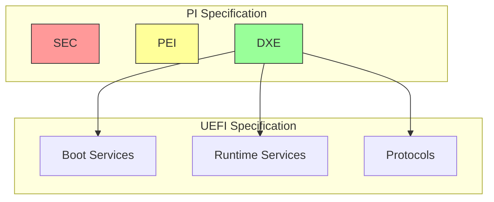

**PI仕様とUEFI仕様の分担:**
- **PI**: ファームウェア内部（SEC, PEI, DXE）
- **UEFI**: OSとのインターフェース（Boot/Runtime Services）

## フェーズ間の遷移

### 全体の流れ

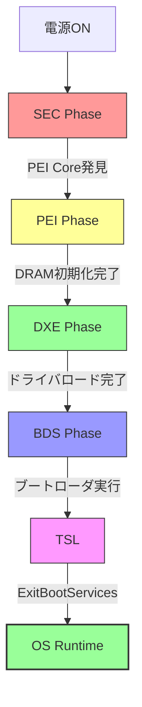

### 各フェーズの期間

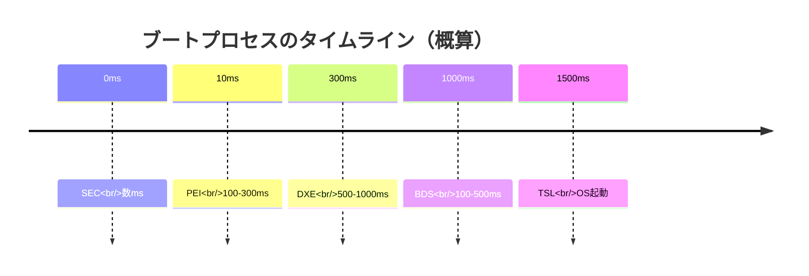

**注**: 時間は環境により大きく異なります。

## まとめ

この章では、UEFIブートフェーズを説明しました。

**重要なポイント:**

- UEFIは**5つのフェーズ**で起動：SEC → PEI → DXE → BDS → TSL
- **SEC**: CPU初期化、CAR設定
- **PEI**: DRAM初期化、基本H/W初期化
- **DXE**: ドライバ実行、デバイス列挙
- **BDS**: ブートデバイス選択
- **TSL/RT**: OS起動、ランタイムサービス提供

**各フェーズの役割:**

| Phase | RAM状態 | 主な処理 | 成果物 |
|-------|---------|---------|--------|
| SEC | CAR | CPU初期化 | PEI Core |
| PEI | DRAM初期化中→完了 | メモリ初期化 | DXE Core |
| DXE | DRAM利用可 | ドライバ実行 | Boot Services |
| BDS | DRAM利用可 | ブート選択 | OS起動 |

---

**次章では、各ブートフェーズの役割と責務を詳しく見ていきます。**

📚 **参考資料**
- [UEFI Specification v2.10 - Section 2: Boot Phases](https://uefi.org/specifications)
- [UEFI PI Specification v1.8](https://uefi.org/specifications)
- [EDK II Module Writer's Guide](https://tianocore-docs.github.io/edk2-ModuleWriteGuide/)
