# 各ブートフェーズの役割と責務

🎯 **この章で学ぶこと**
- 各ブートフェーズの詳細な責務
- フェーズ間の責任分担の設計原則
- ハンドオフ機構（HOB、プロトコル）
- なぜこのような分割が必要なのか

📚 **前提知識**
- UEFI ブートフェーズの全体像（第5章）
- メモリマップ（第2章）

---

## ブートフェーズ分割の設計思想

### なぜフェーズを分けるのか

UEFIは、起動処理を**5つのフェーズに分割**しています。

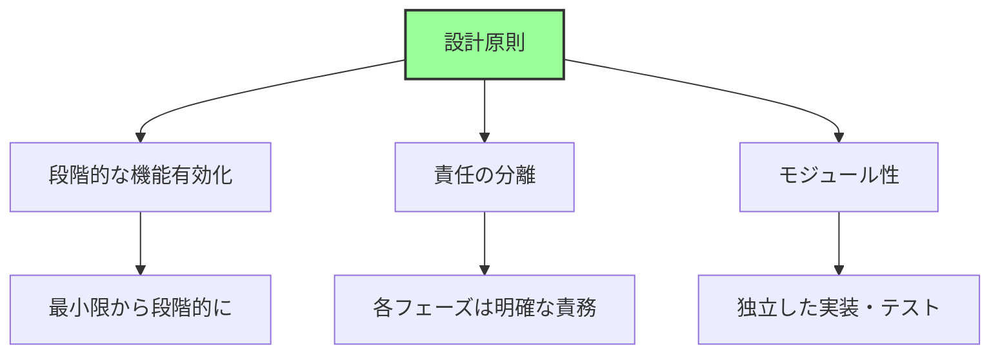

**分割の理由:**

1. **段階的な機能有効化**
   - 電源ONからOSまで、利用可能なリソースが段階的に増加
   - 各段階で必要最小限の機能のみ提供

2. **責任の分離 (Separation of Concerns)**
   - ハードウェア初期化 vs ドライバ実行 vs ブート選択
   - 各フェーズは独立した責務を持つ

3. **モジュール性と保守性**
   - フェーズごとに異なるベンダーが実装可能
   - 独立したテストと検証

### 利用可能リソースの遷移

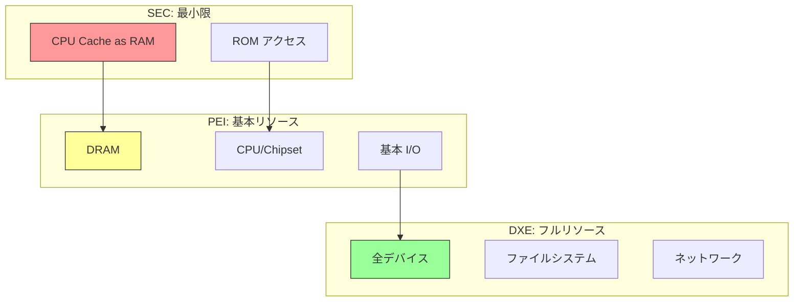

## SEC Phase の責務

### 主要な責任

**SEC (Security) Phase** は、最も制約の多い環境で動作します。

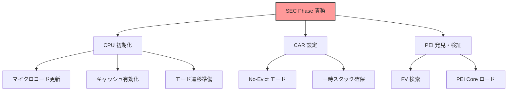

### 詳細な責務

**1. CPU の最小限初期化**

| 項目 | 内容 | 目的 |
|------|------|------|
| マイクロコード更新 | CPU マイクロコードのロード | バグ修正、機能追加 |
| キャッシュ設定 | L1/L2 キャッシュ有効化 | CAR の準備 |
| モード遷移 | リアルモード → ロングモード | 64bit 環境構築 |

**2. Cache as RAM (CAR) の設定**

```
目的: DRAM 未初期化でも RAM を確保

仕組み:
1. CPU キャッシュを No-Evict モードに設定
2. 特定のアドレス範囲をキャッシュに固定
3. RAM のように使用（通常 64KB-256KB）

制約:
- サイズが限定的
- 速度は DRAM より高速
- CPU 依存（Intel/AMD で異なる）
```

**3. PEI Core の発見とロード**

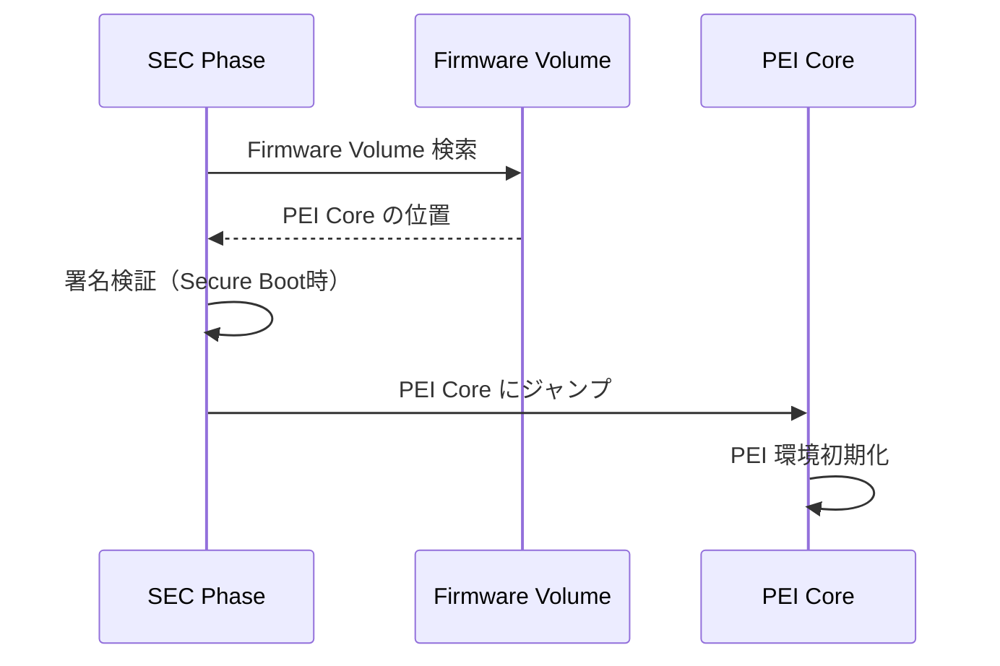

### なぜSECが必要なのか

**設計上の制約:**
- DRAM が未初期化 → RAM を使えない
- デバイスが未初期化 → I/O を使えない
- 最小限の機能で次のステージへ遷移する必要

**SECの役割:**
- **ブートストラップ**: 何もない状態から最初のRAMを確保
- **セキュリティの起点**: 信頼チェーンの開始点
- **プラットフォーム独立性**: CPU初期化のみに専念

## PEI Phase の責務

### 主要な責任

**PEI (Pre-EFI Initialization) Phase** は、プラットフォーム固有の初期化を担当します。

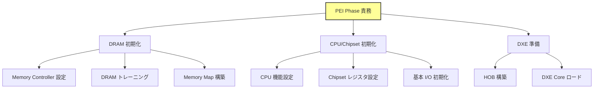

### 詳細な責務

**1. DRAM 初期化（最重要タスク）**

```
DRAM 初期化の流れ:

1. Memory Controller 検出
   - CPU/Chipset のメモリコントローラ特定

2. SPD (Serial Presence Detect) 読み込み
   - メモリモジュールの仕様取得
   - 容量、タイミング、電圧など

3. DRAM トレーニング
   - 信号タイミング調整
   - 読み書きマージン測定
   - 最適パラメータ決定

4. Memory Map 構築
   - E820/UEFI Memory Map 作成
   - メモリホールの設定

5. CAR → DRAM 移行
   - スタック・ヒープを DRAM へ移動
```

**2. プラットフォーム固有初期化**

| コンポーネント | 初期化内容 | 理由 |
|--------------|-----------|------|
| CPU | 高度な機能有効化 | MTRR, MSR 設定 |
| Chipset | PCH/SoC 初期化 | I/O コントローラ準備 |
| クロック | PLL, クロック設定 | デバイス動作周波数 |
| 電源 | VR (Voltage Regulator) | CPU/DRAM 電圧設定 |

**3. HOB (Hand-Off Block) の構築**

```c
// HOB の概念（実装例ではなく構造の説明）
typedef struct {
  UINT16  HobType;      // HOB の種類
  UINT16  HobLength;    // サイズ
  UINT32  Reserved;
} EFI_HOB_GENERIC_HEADER;

// HOB の種類:
// - Resource Descriptor: メモリリソース情報
// - GUID Extension: カスタムデータ
// - CPU: CPU 情報
// - Memory Allocation: メモリ割り当て情報
```

**HOBの役割:**

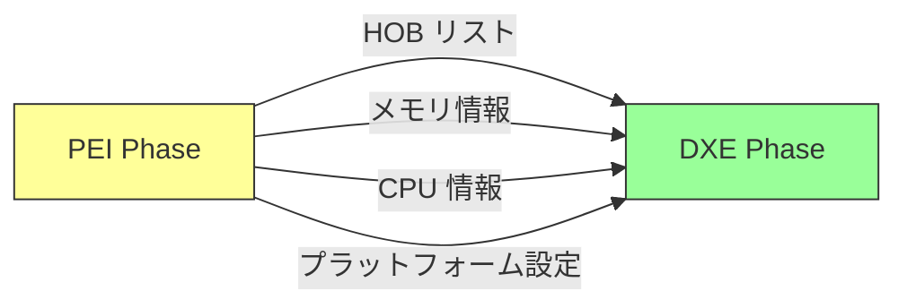

### PEIM (PEI Module) の役割

PEIフェーズは、**PEIM**という小さなモジュール群で構成されます。

**主なPEIM:**

| PEIM | 役割 | 依存関係 |
|------|------|---------|
| PlatformPei | プラットフォーム検出 | なし（最初） |
| CpuPei | CPU 初期化 | PlatformPei |
| MemoryInit | DRAM 初期化 | CpuPei |
| ChipsetPei | Chipset 初期化 | MemoryInit |

**PEIMの実行順序:**

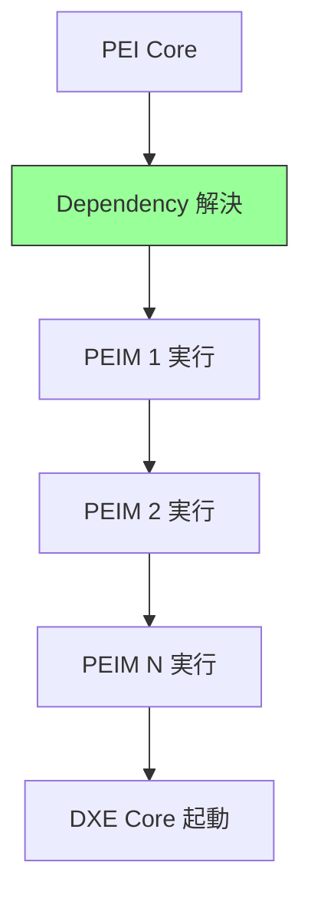

依存関係は `.inf` ファイルの `[Depex]` セクションで定義されます。

## DXE Phase の責務

### 主要な責任

**DXE (Driver Execution Environment) Phase** は、フルスペックのドライバ実行環境を提供します。

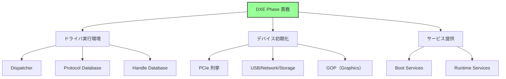

### 詳細な責務

**1. DXE Dispatcher（中核機能）**

```
Dispatcher の役割:

1. Firmware Volume (FV) からドライバ検索
2. 依存関係（Depex）を解析
3. 実行可能なドライバをロード・実行
4. プロトコルが公開されたら再評価
5. すべてのドライバが実行されるまで繰り返し
```

**Dispatcherのアルゴリズム:**

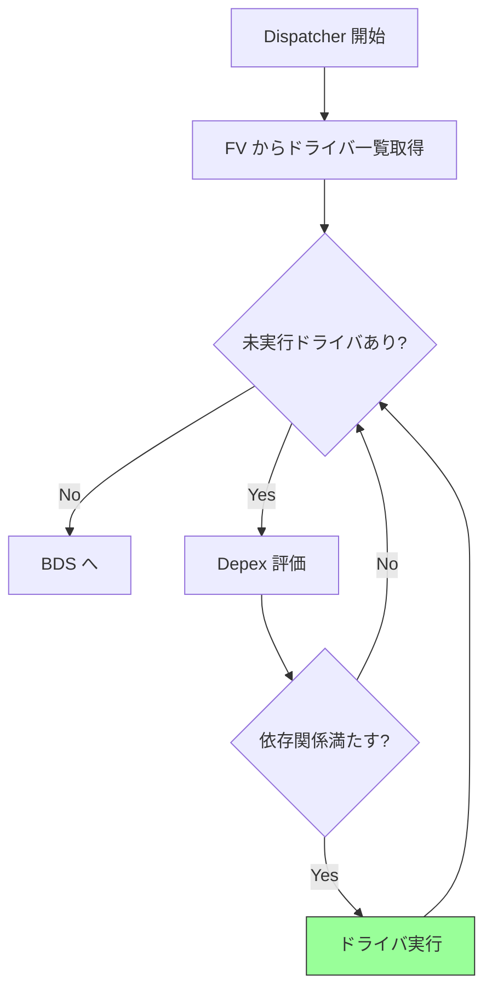

**2. プロトコルによるサービス公開**

```c
// プロトコルの概念（UEFIの基本設計）
typedef struct {
  EFI_GUID  ProtocolGuid;  // プロトコルの識別子
  VOID      *Interface;    // 関数テーブルへのポインタ
  EFI_HANDLE Handle;       // デバイスハンドル
} EFI_PROTOCOL_ENTRY;

// 例: Simple Text Output Protocol
typedef struct {
  EFI_TEXT_RESET              Reset;
  EFI_TEXT_STRING             OutputString;
  EFI_TEXT_TEST_STRING        TestString;
  // ...
} EFI_SIMPLE_TEXT_OUTPUT_PROTOCOL;
```

**プロトコルの種類:**

| カテゴリ | プロトコル例 | 役割 |
|---------|------------|------|
| Console | Simple Text Input/Output | コンソール I/O |
| Graphics | Graphics Output Protocol (GOP) | 画面描画 |
| Storage | Block I/O, Disk I/O | ストレージアクセス |
| Network | Simple Network Protocol | ネットワーク通信 |
| File System | Simple File System | ファイル操作 |

**3. デバイス初期化の流れ**

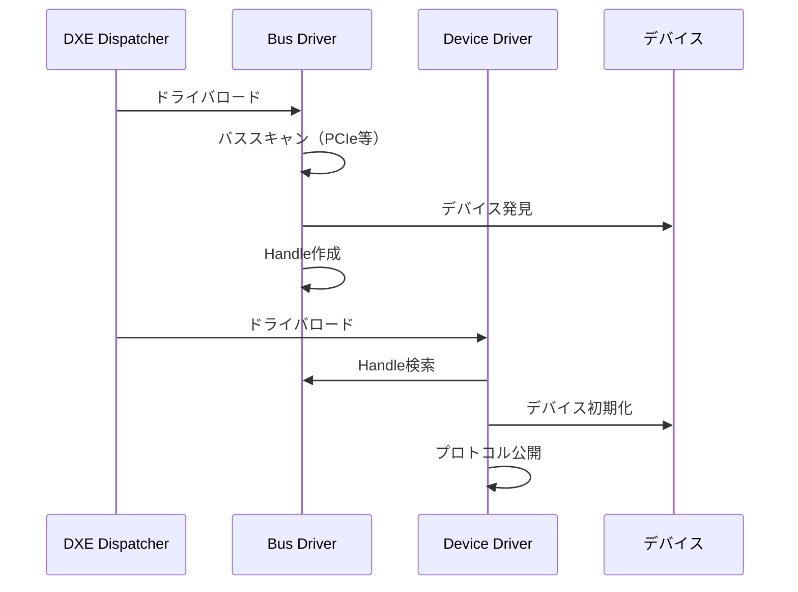

**4. Boot Services と Runtime Services**

```
Boot Services（OS起動前のみ）:
- メモリ管理（AllocatePool, AllocatePages）
- プロトコル操作（InstallProtocol, LocateProtocol）
- イベント・タイマ
- ドライバ管理

Runtime Services（OS実行中も利用可能）:
- NVRAM変数アクセス（GetVariable, SetVariable）
- 時刻取得・設定（GetTime, SetTime）
- システムリセット（ResetSystem）
- カプセル更新（UpdateCapsule）
```

### DXEドライバの種類と役割

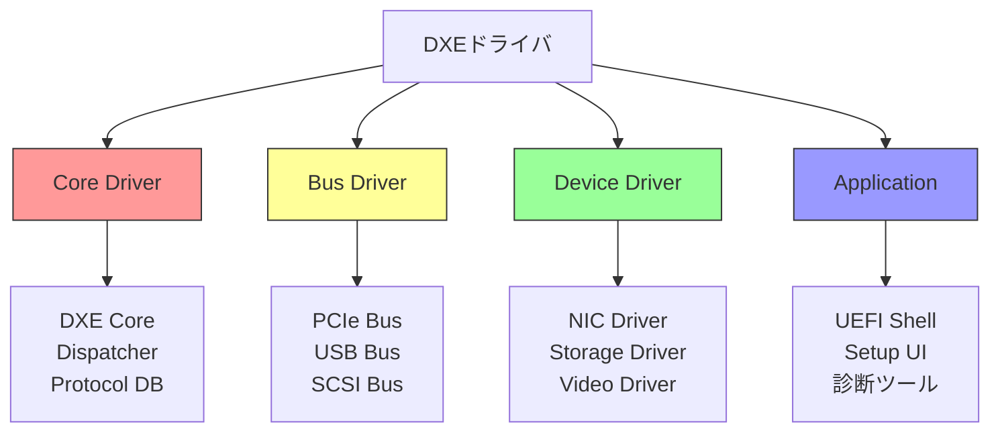

## BDS Phase の責務

### 主要な責任

**BDS (Boot Device Selection) Phase** は、ブートデバイスを選択しOSを起動します。

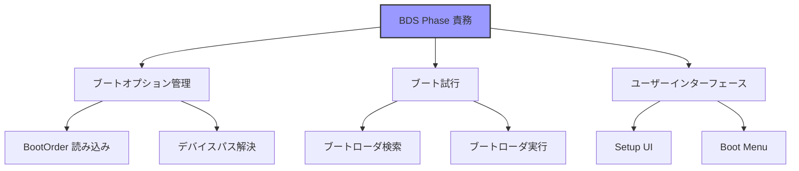

### 詳細な責務

**1. ブートオプションの管理**

```
NVRAM 変数の構造:

BootOrder: UINT16[]
  - ブート試行順序（例: [0x0000, 0x0003, 0x0001]）

Boot0000, Boot0001, ...: EFI_LOAD_OPTION
  - 各ブートオプションの詳細
  - デバイスパス
  - 説明文字列
  - オプショナルデータ

BootCurrent: UINT16
  - 現在起動中のオプション
```

**BootOrderの処理フロー:**

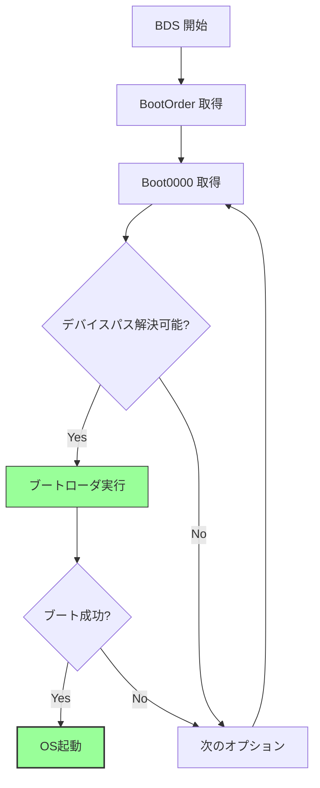

**2. デバイスパスの解決**

デバイスパスは、デバイスの位置を階層的に表現します。

```
例: USB メモリのブートローダ

PciRoot(0x0)/Pci(0x14,0x0)/USB(0x3,0x0)/HD(1,GPT,...)/\EFI\BOOT\BOOTX64.EFI

解釈:
1. PCI Root Bridge
2. PCI(0x14,0x0): USB Controller
3. USB(0x3,0x0): ポート3のデバイス
4. HD(1,...): パーティション1（GPT）
5. \EFI\BOOT\BOOTX64.EFI: ファイルパス
```

**3. フォールバック機構**

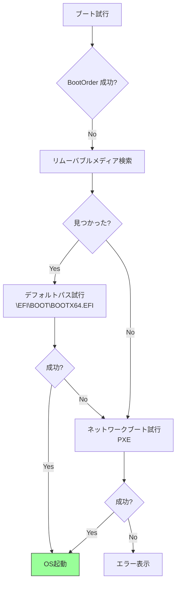

**4. ユーザーインターフェース**

| UI | 役割 | 起動条件 |
|-----|------|---------|
| Setup UI | BIOS設定画面 | Del/F2キー |
| Boot Menu | ブートデバイス選択 | F12キー |
| Boot Manager | ブートオプション管理 | NVRAM設定 |

### BDSの設計思想

**なぜBDSが独立しているのか:**

1. **ポリシーとメカニズムの分離**
   - DXE: デバイスを使える状態にする（メカニズム）
   - BDS: どのデバイスから起動するか決定（ポリシー）

2. **柔軟性**
   - OEM ごとに異なるブートポリシー
   - カスタム UI の実装が容易

3. **セキュリティ**
   - Secure Boot の検証はここで実施
   - ユーザー認証もここで可能

## TSL/RT の責務

### TSL (Transient System Load)

**OSへの制御移譲:**

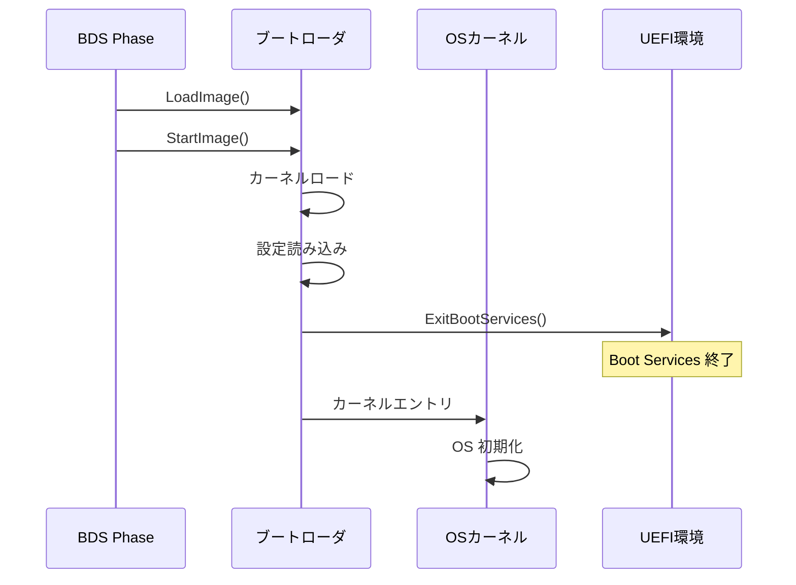

**ExitBootServices() の影響:**

```
終了するサービス:
- Boot Services のすべて
- ほとんどのドライバ
- イベント・タイマ
- メモリ管理サービス

継続するサービス:
- Runtime Services のみ
- 一部のドライバ（Runtime Driver）
```

### Runtime Services の役割

**OS実行中も提供されるサービス:**

| サービス | 機能 | 使用例 |
|---------|------|--------|
| Variable Services | NVRAM 変数アクセス | ブート設定保存 |
| Time Services | RTC 時刻取得・設定 | システム時刻 |
| Reset Services | システムリセット | シャットダウン |
| Capsule Services | ファームウェア更新 | BIOS 更新 |

**Runtime Servicesのメモリレイアウト:**

```
OS起動後のメモリマップ:

┌─────────────────┐
│ OS カーネル      │
├─────────────────┤
│ アプリケーション  │
├─────────────────┤
│ Runtime Services │ ← UEFI が提供
│ (MMIO領域)       │    仮想アドレスにマップ
├─────────────────┤
│ Runtime Driver   │
└─────────────────┘
```

**SetVirtualAddressMap():**

OSは、Runtime Servicesを仮想アドレス空間にマップします。

```c
// 概念的な流れ
// 1. OS がページテーブル構築
// 2. Runtime Services を仮想アドレスへマップ
// 3. UEFI に新しいアドレスを通知
Status = RuntimeServices->SetVirtualAddressMap(
  MemoryMapSize,
  DescriptorSize,
  DescriptorVersion,
  VirtualMap
);
// 4. 以降、仮想アドレスで Runtime Services を呼び出し
```

## フェーズ間ハンドオフの仕組み

### 情報の受け渡し方法


**各ハンドオフ機構:**

| 遷移 | 機構 | 内容 |
|------|------|------|
| SEC → PEI | スタック | 最小限の情報（CAR領域） |
| PEI → DXE | HOB | メモリマップ、CPU情報、設定 |
| DXE → BDS | Protocol | すべてのデバイス・サービス |
| BDS → OS | Configuration Table | ACPI、SMBIOS、メモリマップ |

### Configuration Table

**OSへ渡されるテーブル:**

```c
// UEFI Configuration Table の構造
typedef struct {
  EFI_GUID  VendorGuid;     // テーブルの種類
  VOID      *VendorTable;   // テーブルへのポインタ
} EFI_CONFIGURATION_TABLE;

// 主なテーブル:
// - ACPI Table: ACPI_20_TABLE_GUID
// - SMBIOS Table: SMBIOS_TABLE_GUID
// - Device Tree: DEVICE_TREE_GUID (ARM)
```

**Linuxカーネルでの利用例:**

```
Linuxカーネル起動時:
1. UEFI から Configuration Table 取得
2. ACPI Table を解析 → デバイス情報
3. SMBIOS Table を解析 → ハードウェア情報
4. Memory Map を取得 → メモリ管理
```

## 責務分担の設計原則

### 各フェーズの設計指針

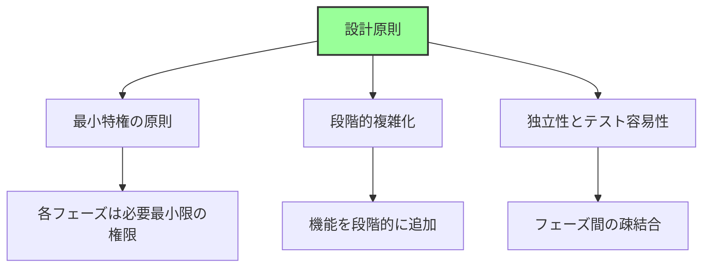

**1. 最小特権の原則**

| フェーズ | 利用可能リソース | 理由 |
|---------|-----------------|------|
| SEC | CPU、ROM | セキュリティの起点、最小限 |
| PEI | + DRAM、基本I/O | プラットフォーム初期化に必要 |
| DXE | + 全デバイス | ドライバ実行環境 |
| BDS | すべて | ブート処理のため |

**2. 段階的複雑化**

```
複雑さの遷移:

SEC:    シンプル（数KB）
  ↓
PEI:    中程度（数十～数百KB）
  ↓
DXE:    複雑（数MB）
  ↓
BDS:    中程度（ポリシーのみ）
```

**3. 疎結合の実現**

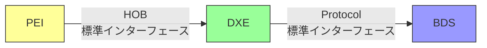

インターフェースを標準化することで：
- 各フェーズの独立実装が可能
- ベンダー固有部分とコア部分を分離
- テストとデバッグが容易

## まとめ

この章では、各ブートフェーズの詳細な責務を説明しました。

**重要なポイント:**

**フェーズごとの主要責務:**

| フェーズ | 主要責務 | 成果物 |
|---------|---------|--------|
| **SEC** | CPU初期化、CAR設定 | PEI Core起動 |
| **PEI** | DRAM初期化、プラットフォーム初期化 | HOBリスト、DXE Core起動 |
| **DXE** | ドライバ実行、デバイス初期化 | Boot/Runtime Services |
| **BDS** | ブートデバイス選択、ブート実行 | OS起動 |
| **TSL/RT** | OSへ制御移譲、Runtime Services提供 | OS実行環境 |

**設計原則:**

- **段階的機能有効化**: リソースを段階的に利用可能にする
- **責任の分離**: 各フェーズは明確な責務を持つ
- **モジュール性**: 独立した実装・テストが可能
- **標準インターフェース**: HOB、Protocol、Configuration Tableで疎結合

**ハンドオフ機構:**


各フェーズは、前のフェーズから情報を受け取り、次のフェーズへ渡す責任を持ちます。

---

**次章では、Part I 全体のまとめを行います。**

📚 **参考資料**
- [UEFI Specification v2.10 - Chapter 2: Boot Phases](https://uefi.org/specifications)
- [UEFI PI Specification v1.8 - Volume 1-5](https://uefi.org/specifications)
- [EDK II Module Writer's Guide](https://tianocore-docs.github.io/edk2-ModuleWriteGuide/)
- [Intel® 64 and IA-32 Architectures Software Developer's Manual](https://www.intel.com/sdm)
