# 各ブートフェーズの役割と責務

🎯 **この章で学ぶこと**
- 各ブートフェーズの詳細な責務
- フェーズ間の責任分担の設計原則
- ハンドオフ機構（HOB、プロトコル）
- なぜこのような分割が必要なのか

📚 **前提知識**
- UEFI ブートフェーズの全体像（第5章）
- メモリマップ（第2章）

---

## ブートフェーズ分割の設計思想

### なぜフェーズを分けるのか

UEFI が起動処理を 5 つのフェーズに分割している理由は、複雑なシステム初期化を管理可能な単位に分解し、各段階で明確な責任を定義するためです。電源投入直後のシステムは、極めて限られたリソースしか利用できません。CPU キャッシュをRAMとして使用し、フラッシュメモリから最小限のコードを実行するだけです。しかし、OS を起動するには、DRAM の初期化、デバイスドライバのロード、ファイルシステムへのアクセスなど、多くの複雑な処理が必要です。これらすべてを一度に実行することは不可能であり、段階的にリソースを有効化していく必要があります。

フェーズ分割の第一の理由は、段階的な機能有効化です。各フェーズは、前のフェーズが提供するリソースを前提として動作し、新しいリソースを追加します。SEC フェーズは CPU とキャッシュを初期化し、PEI フェーズは DRAM を有効化し、DXE フェーズはすべてのデバイスを利用可能にします。この段階的なアプローチにより、各フェーズは必要最小限の機能のみに集中でき、複雑さが管理可能になります。

第二の理由は、責任の分離 (Separation of Concerns) です。各フェーズは、明確に定義された責務を持ちます。SEC はセキュリティと CPU 初期化、PEI はプラットフォーム固有の初期化、DXE はドライバ実行環境、BDS はブート選択という具合に、責任が明確に分離されています。この設計により、各フェーズの実装者は自分の担当範囲に集中でき、他のフェーズとの依存関係を最小化できます。

第三の理由は、モジュール性と保守性です。フェーズごとに異なるベンダーや開発チームが実装を担当できます。たとえば、CPU ベンダーが SEC と PEI の一部を提供し、マザーボードベンダーが PEI の残りと DXE を提供し、OS ベンダーがブートローダを提供するといった分業が可能です。また、各フェーズは独立してテストと検証ができるため、品質保証が容易になります。

**補足図**: 以下の図は、フェーズ分割の設計原則を示したものです。

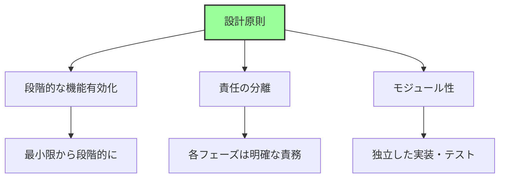

### 利用可能リソースの遷移

各フェーズで利用可能なリソースは、段階的に拡大していきます。SEC フェーズでは、CPU キャッシュを RAM として使用し、フラッシュメモリ（ROM）からコードを実行します。この段階では、通常の DRAM はまだ利用できず、使用できるメモリは数十から数百 KB に限られます。そのため、SEC フェーズのコードは非常にコンパクトでなければならず、アセンブリ言語や最小限の C コードで記述されます。

PEI フェーズに移行すると、DRAM が初期化され、より大きなメモリ空間が利用可能になります。また、CPU とチップセットの基本的な機能が有効化され、基本的な I/O 操作が可能になります。しかし、この段階ではまだ、PCIe デバイスやストレージデバイスは完全には利用できません。PEI フェーズは、DXE フェーズで複雑なドライバを実行するための基盤を整えます。

DXE フェーズでは、フルリソースが利用可能になります。すべてのデバイスドライバがロードされ、PCIe デバイス、USB、ネットワーク、ストレージなどが動作します。ファイルシステムへのアクセスも可能になり、UEFI アプリケーションやブートローダを実行できます。この段階で、システムは OS を起動するために必要なすべての機能を備えた状態になります。

**補足図**: 以下の図は、各フェーズで利用可能なリソースの遷移を示したものです。

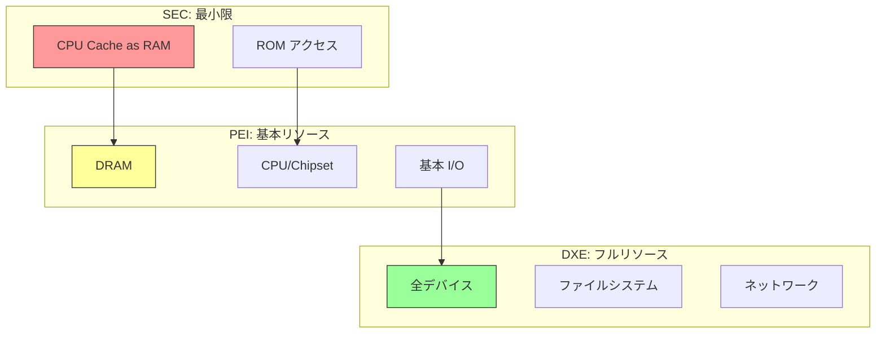

## SEC Phase の責務

### 主要な責任

SEC (Security) Phase は、最も制約の多い環境で動作するフェーズです。電源投入直後、DRAM は初期化されておらず、通常の RAM は使用できません。また、ほとんどのデバイスも動作していません。この極めて限られた環境で、SEC は 3 つの主要な責任を果たします。第一に、CPU の最小限の初期化です。これには、マイクロコードの更新、キャッシュの有効化、ロングモードへの遷移準備が含まれます。第二に、CAR (Cache as RAM) の設定です。DRAM が利用できないため、CPU キャッシュを一時的な RAM として使用します。第三に、PEI Core の発見とロードです。ファームウェアボリュームから PEI Core を検索し、検証してからロードします。

これらの責任は、段階的に実行されます。まず、CPU をリセット状態から基本的な動作状態にします。マイクロコードの更新により、CPU のバグ修正や機能追加が行われます。次に、L1 および L2 キャッシュを有効化し、CAR の準備をします。x86_64 システムでは、リアルモードからロングモードへの遷移も SEC で準備されます。CAR が設定されると、スタックとヒープが利用可能になり、C 言語で記述されたコードを実行できるようになります。最後に、PEI Core をファームウェアボリュームから検索し、その整合性を検証してから、制御を PEI フェーズに移します。

**補足図**: 以下の図は、SEC Phase の主要な責務とその詳細を示したものです。

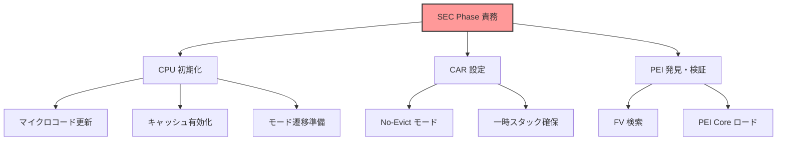

### 詳細な責務

SEC Phase の詳細な責務は、3 つの主要タスクに分かれます。第一に、CPU の最小限初期化です。マイクロコード更新は、CPU 製造後に発見されたバグを修正したり、新しい機能を追加したりするために行われます。マイクロコードは、CPU に内蔵された小さなファームウェアで、CPU の動作を制御します。SEC は、フラッシュメモリからマイクロコードを読み込み、特定の MSR (Model-Specific Register) に書き込むことで更新します。キャッシュ設定では、L1 および L2 キャッシュを有効化し、CAR のために準備します。モード遷移では、x86_64 アーキテクチャの場合、リアルモードからプロテクトモード、さらにロングモードへの遷移を準備します。

第二に、Cache as RAM (CAR) の設定です。CAR の目的は、DRAM が未初期化でも RAM を確保することです。仕組みとしては、CPU キャッシュを No-Evict モードに設定し、特定のアドレス範囲をキャッシュに固定します。これにより、キャッシュを RAM のように使用でき、通常 64KB から 256KB 程度のメモリ空間が確保されます。CAR には制約もあります。サイズが限定的であること、速度は DRAM より高速であるが容量が少ないこと、そして設定方法が CPU に依存し、Intel と AMD で異なることなどです。

第三に、PEI Core の発見とロードです。SEC は、ファームウェアボリューム（FV）を検索し、PEI Core の位置を特定します。Secure Boot が有効な場合、SEC は PEI Core の署名を検証し、改ざんされていないことを確認します。検証が成功すると、SEC は PEI Core のエントリポイントにジャンプし、制御を PEI フェーズに移します。PEI Core は、PEI 環境の初期化を開始します。

**補足図**: 以下のシーケンス図は、SEC が FV から PEI Core を検索し、検証してからジャンプするまでの流れを示したものです。

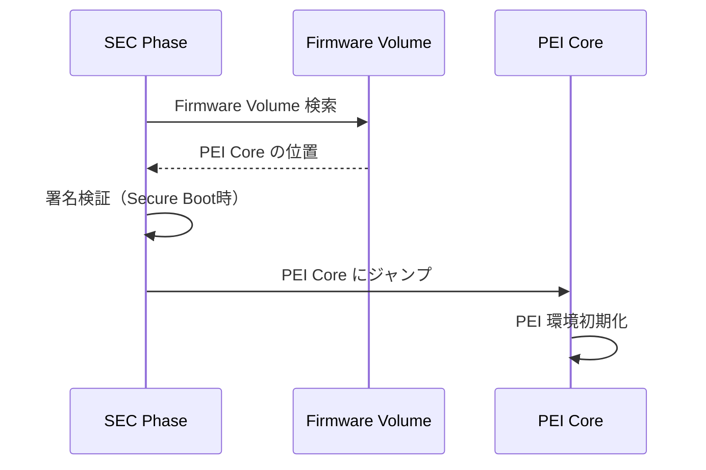

### なぜSECが必要なのか

SEC フェーズが必要な理由は、設計上の制約にあります。電源投入直後のシステムは、DRAM が未初期化であるため、通常の RAM を使用できません。また、デバイスも初期化されていないため、I/O 操作も行えません。この状態で、最小限の機能を使って次のステージ（PEI フェーズ）に遷移する必要があります。SEC は、このブートストラップ問題を解決するために存在します。

SEC の役割は、3 つの観点から重要です。第一に、ブートストラップです。何もない状態から、CPU キャッシュを活用して最初の RAM を確保し、システムの起動を可能にします。第二に、セキュリティの起点です。SEC は、信頼チェーン（Chain of Trust）の開始点となり、後続のコード（PEI Core）の整合性を検証します。これは、Secure Boot の基盤となります。第三に、プラットフォーム独立性です。SEC は CPU 初期化のみに専念し、プラットフォーム固有の処理は PEI フェーズに委ねます。この分離により、異なるプラットフォーム間で SEC コードを再利用しやすくなります。

## PEI Phase の責務

### 主要な責任

PEI (Pre-EFI Initialization) Phase は、プラットフォーム固有の初期化を担当するフェーズです。SEC フェーズから制御を受け取ると、PEI Core が起動し、PEIM (PEI Module) を順次実行します。PEI の最も重要な責任は、DRAM の初期化です。これにより、CAR から実際の DRAM への移行が可能になり、大容量のメモリが利用可能になります。PEI は、DRAM 初期化に加えて、CPU とチップセットの詳細な設定、基本的な I/O の初期化も行います。最後に、DXE フェーズに必要な情報を HOB (Hand-Off Block) として構築し、DXE Core をロードして制御を移します。

PEI フェーズの責務は、3 つの主要な領域に分かれます。第一に、DRAM 初期化です。これは、PEI の中で最も複雑で時間のかかるタスクであり、メモリコントローラの設定、DRAM トレーニング、メモリマップの構築が含まれます。第二に、CPU とチップセットの初期化です。CPU の高度な機能（仮想化、セキュリティ機能など）を有効化し、チップセット（PCH や SoC）のレジスタを設定します。第三に、HOB の構築と DXE の準備です。PEI が収集したシステム情報（メモリ構成、CPU 情報、プラットフォーム設定など）を HOB として DXE に渡します。

**補足図**: 以下の図は、PEI Phase の主要な責務とその詳細を示したものです。

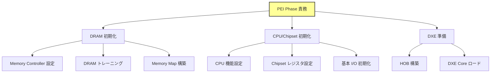

### 詳細な責務

PEI Phase の詳細な責務は、3 つの主要タスクに分かれます。第一に、DRAM 初期化（最重要タスク）です。DRAM 初期化は、5 つのステップで構成されます。まず、Memory Controller の検出です。CPU またはチップセットに内蔵されたメモリコントローラを特定します。次に、SPD (Serial Presence Detect) の読み込みです。メモリモジュールの EEPROM から、容量、タイミングパラメータ、電圧などの仕様を取得します。

DRAM トレーニングは、最も時間のかかるプロセスです。信号のタイミングを調整し、読み書きのマージンを測定して、最適なパラメータを決定します。このプロセスでは、さまざまな遅延値を試行し、安定して動作する範囲を見つけます。Memory Map の構築では、E820（レガシー）または UEFI Memory Map を作成し、利用可能なメモリ範囲を定義します。また、メモリホール（MMIO のために予約された領域）も設定します。最後に、CAR から DRAM への移行を行います。スタックとヒープを CAR から DRAM に移動し、CPU キャッシュを通常のキャッシュモードに戻します。

第二に、プラットフォーム固有初期化です。CPU の高度な機能を有効化します。これには、MTRR (Memory Type Range Register) の設定や、MSR (Model-Specific Register) の構成が含まれます。チップセット（PCH や SoC）を初期化し、I/O コントローラを準備します。PLL (Phase-Locked Loop) やクロック設定により、デバイスの動作周波数を設定します。VR (Voltage Regulator) を構成し、CPU と DRAM に適切な電圧を供給します。

第三に、HOB (Hand-Off Block) の構築です。HOB は、PEI が DXE に渡す情報のコンテナです。HOB には複数の種類があります。Resource Descriptor HOB は、メモリリソース情報を含みます。GUID Extension HOB は、カスタムデータを格納します。CPU HOB は、CPU 情報を含み、Memory Allocation HOB は、既に割り当てられたメモリ領域を記録します。PEI は、これらの HOB をリスト構造で構築し、DXE に渡します。

以下のコード例は、HOB の基本構造を示しています。

```c
// HOB の概念（実装例ではなく構造の説明）
typedef struct {
  UINT16  HobType;      // HOB の種類
  UINT16  HobLength;    // サイズ
  UINT32  Reserved;
} EFI_HOB_GENERIC_HEADER;

// HOB の種類:
// - Resource Descriptor: メモリリソース情報
// - GUID Extension: カスタムデータ
// - CPU: CPU 情報
// - Memory Allocation: メモリ割り当て情報
```

**補足図**: 以下の図は、PEI が HOB リストを構築し、それを DXE に渡す流れを示したものです。

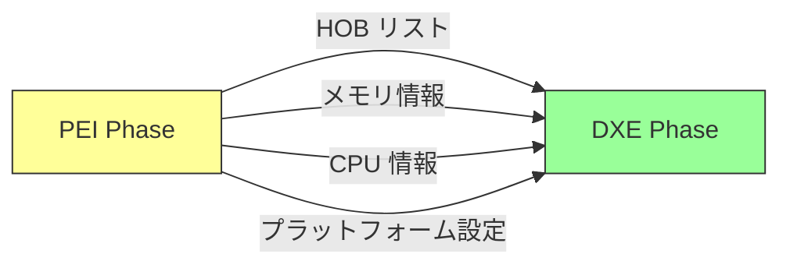

### PEIM (PEI Module) の役割

PEI フェーズは、PEIM (PEI Module) という小さなモジュール群で構成されます。各 PEIM は、特定の初期化タスクを担当し、PEI Core によってロードされ、実行されます。PEIM には依存関係があり、PEI Core は依存関係を解決してから、適切な順序で PEIM を実行します。主な PEIM には、PlatformPei（プラットフォーム検出）、CpuPei（CPU 初期化）、MemoryInit（DRAM 初期化）、ChipsetPei（チップセット初期化）があります。

PEIM の実行順序は、依存関係によって決定されます。PlatformPei は依存関係がなく、最初に実行されます。CpuPei は PlatformPei に依存し、MemoryInit は CpuPei に依存します。ChipsetPei は MemoryInit に依存し、DRAM が利用可能になってから実行されます。PEI Core は、Dependency Expression (depex) を解析し、すべての依存関係が満たされた PEIM から順次実行します。依存関係は、`.inf` ファイルの `[Depex]` セクションで定義されます。

**補足図**: 以下の図は、PEI Core が依存関係を解決し、PEIM を順次実行して DXE Core を起動するまでの流れを示したものです。

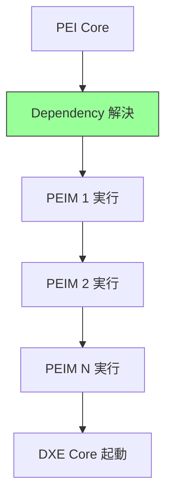

## DXE Phase の責務

### 主要な責任

DXE (Driver Execution Environment) Phase は、UEFI ファームウェアにおいて最も複雑かつ重要なフェーズです。このフェーズの主要な責務は、フルスペックのドライバ実行環境を提供し、システム内のすべてのデバイスを初期化し、OS が必要とするサービスを構築することです。PEI Phase が最小限のプラットフォーム初期化を行ったのに対し、DXE Phase では DRAM が利用可能になったことで、大規模なドライバ群を実行できるようになります。

DXE Phase の責務は、大きく分けて三つの領域に分類されます。第一に、ドライバ実行環境の構築です。DXE Core は、Dispatcher、Protocol Database、Handle Database という三つの中核機構を提供し、ドライバが効率的に実行され、互いに協調できる基盤を作ります。第二に、デバイス初期化です。PCIe バスの列挙から始まり、USB、ネットワーク、ストレージ、グラフィックスなど、システム内のすべてのデバイスが検出され、初期化され、利用可能な状態になります。第三に、サービス提供です。Boot Services と Runtime Services という二つのサービステーブルを構築し、OS やブートローダがハードウェアにアクセスするための標準化されたインターフェースを提供します。

DXE Phase の設計思想は、プロトコルベースのモジュラーアーキテクチャにあります。各ドライバは、特定のプロトコルを公開することで自身の機能を提供し、他のドライバやアプリケーションは、プロトコルを検索して利用します。この設計により、ドライバ間の疎結合が実現され、ベンダーは独自のドライバを容易に追加できます。また、依存関係を明示的に記述する Depex (Dependency Expression) の仕組みにより、ドライバが正しい順序で実行されることが保証されます。したがって、DXE Phase は、単なるドライバローダではなく、複雑なソフトウェアエコシステムを管理する高度なフレームワークと言えます。

**補足図**: 以下の図は、DXE Phase の三つの主要責務とその構成要素を示したものです。

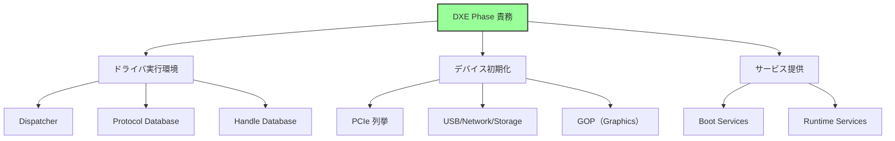

### 詳細な責務

#### DXE Dispatcher の動作原理

DXE Dispatcher は、DXE Phase の中核を担う機構です。その役割は、Firmware Volume (FV) に格納された数十から数百のドライバを発見し、依存関係を解決し、適切な順序で実行することです。Dispatcher は、単純なループアルゴリズムに基づいて動作しますが、その背後には洗練された依存関係管理の仕組みがあります。

まず、Dispatcher は FV からすべてのドライバイメージを列挙します。各ドライバには、Depex (Dependency Expression) と呼ばれるメタデータが含まれており、このドライバが実行されるために必要な条件が記述されています。たとえば、USB デバイスドライバは、「USB Host Controller Protocol が利用可能であること」という依存関係を持ちます。Dispatcher は、各ドライバの Depex を評価し、すべての依存関係が満たされているドライバのみをロードして実行します。ドライバが実行されると、そのドライバは新しいプロトコルを公開する可能性があります。この時点で、Dispatcher は再び未実行のドライバの Depex を評価します。このサイクルを繰り返すことで、依存関係の連鎖が自然に解決され、最終的にすべてのドライバが実行されます。

Dispatcher のアルゴリズムは、デッドロックを回避する設計になっています。もし、あるドライバの依存関係が永遠に満たされない場合、そのドライバは実行されずにスキップされます。すべてのドライバが「実行済み」または「依存関係未解決」の状態になった時点で、Dispatcher は処理を完了し、次の BDS Phase へ移行します。この柔軟な設計により、オプショナルなドライバが存在しない場合でもシステムが起動でき、またプラットフォーム固有のドライバを追加しても既存のコードに影響を与えません。

**補足図**: 以下の図は、DXE Dispatcher の依存関係解決アルゴリズムを示したものです。

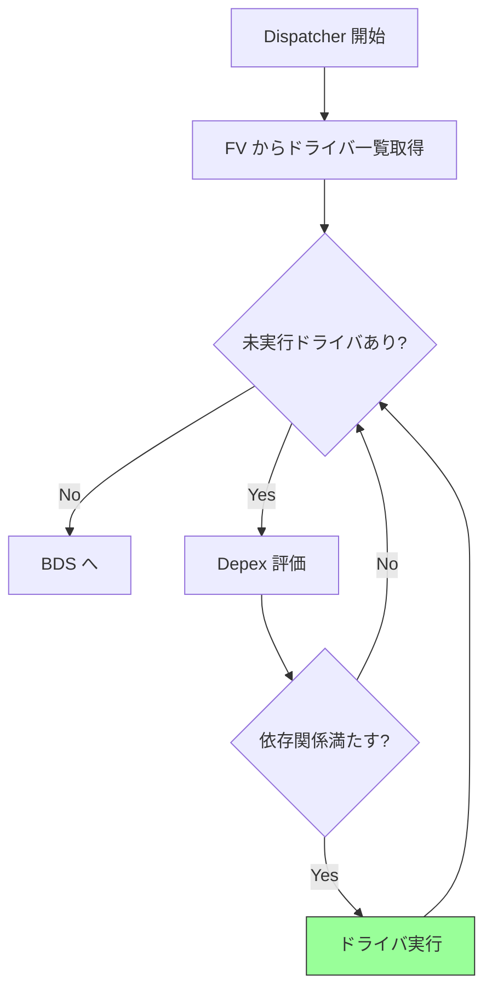

#### プロトコルによるサービス抽象化

UEFI のプロトコルは、デバイスやサービスを抽象化する中核的な仕組みです。プロトコルは、GUID (Globally Unique Identifier) によって識別され、関数テーブル（インターフェース）へのポインタとして実装されます。この設計は、オブジェクト指向プログラミングにおけるインターフェースの概念に似ていますが、C言語で実装されているため、明示的な構造体と関数ポインタの組み合わせで表現されます。

プロトコルの基本的な構造は、三つの要素から成ります。まず、ProtocolGuid は、プロトコルの種類を一意に識別する 128bit の GUID です。次に、Interface は、実際の関数テーブルへのポインタであり、ここにデバイスやサービスの操作関数が格納されます。最後に、Handle は、このプロトコルがどのデバイスに関連付けられているかを示す識別子です。たとえば、Simple Text Output Protocol は、Reset、OutputString、TestString などの関数を提供し、コンソール出力を抽象化します。ドライバやアプリケーションは、特定のハードウェア実装を知らなくても、このプロトコルを通じてテキストを出力できます。

UEFI では、多様なプロトコルが定義されています。Console カテゴリには、Simple Text Input/Output Protocol があり、キーボード入力や画面出力を提供します。Graphics カテゴリには、Graphics Output Protocol (GOP) があり、フレームバッファへの直接描画を可能にします。Storage カテゴリには、Block I/O Protocol や Disk I/O Protocol があり、ディスクへの読み書きを抽象化します。Network カテゴリには、Simple Network Protocol があり、ネットワークパケットの送受信を提供します。File System カテゴリには、Simple File System Protocol があり、FAT や NTFS などのファイルシステムへのアクセスを統一的なインターフェースで提供します。このようにプロトコルによって抽象化されることで、OS やブートローダは、ハードウェアの詳細を知らなくても一貫した方法でデバイスを利用できます。

**補足コード例**: 以下は、UEFI プロトコルの構造を示したコード例です。

```c
// プロトコルの概念（UEFIの基本設計）
typedef struct {
  EFI_GUID  ProtocolGuid;  // プロトコルの識別子
  VOID      *Interface;    // 関数テーブルへのポインタ
  EFI_HANDLE Handle;       // デバイスハンドル
} EFI_PROTOCOL_ENTRY;

// 例: Simple Text Output Protocol
typedef struct {
  EFI_TEXT_RESET              Reset;
  EFI_TEXT_STRING             OutputString;
  EFI_TEXT_TEST_STRING        TestString;
  // ...
} EFI_SIMPLE_TEXT_OUTPUT_PROTOCOL;
```

**参考表**: 以下の表は、主要なプロトコルカテゴリとその役割をまとめたものです。

| カテゴリ | プロトコル例 | 役割 |
|---------|------------|------|
| Console | Simple Text Input/Output | コンソール I/O |
| Graphics | Graphics Output Protocol (GOP) | 画面描画 |
| Storage | Block I/O, Disk I/O | ストレージアクセス |
| Network | Simple Network Protocol | ネットワーク通信 |
| File System | Simple File System | ファイル操作 |

#### デバイス初期化の階層構造

DXE Phase におけるデバイス初期化は、Bus Driver と Device Driver という二層構造で実行されます。Bus Driver は、PCIe、USB、SCSI などのバスをスキャンし、接続されているデバイスを発見し、各デバイスに対して Handle を作成します。Device Driver は、特定のデバイスタイプ（NIC、ストレージコントローラ、グラフィックスカードなど）を初期化し、対応するプロトコルを公開します。この階層的な設計により、バスの種類とデバイスの種類を独立して拡張できます。

デバイス初期化の流れは、次のように進行します。まず、Dispatcher が Bus Driver をロードします。Bus Driver は、担当するバス（たとえば PCIe バス）をスキャンし、接続されているすべてのデバイスを発見します。各デバイスに対して、Bus Driver は Handle を作成し、デバイスパスプロトコルを公開します。次に、Dispatcher が Device Driver をロードします。Device Driver は、自身が対応するデバイスタイプの Handle を検索し、該当する Handle に対してデバイス固有の初期化を実行します。初期化が完了すると、Device Driver は、そのデバイスが提供するサービスに対応するプロトコル（たとえば、ネットワークカードであれば Simple Network Protocol）を公開します。この時点で、他のドライバやアプリケーションが、公開されたプロトコルを通じてデバイスを利用できるようになります。

この階層構造の利点は、拡張性とモジュール性にあります。たとえば、新しい PCIe デバイスをサポートする場合、既存の PCIe Bus Driver はそのまま使用でき、新しい Device Driver を追加するだけで済みます。また、USB デバイスの場合、USB Bus Driver がデバイスを発見し、USB Keyboard Driver や USB Storage Driver が、それぞれキーボードやストレージとして初期化します。このように、バス層とデバイス層を分離することで、ドライバ開発が簡素化され、コードの再利用性が向上します。

**補足図**: 以下の図は、Bus Driver と Device Driver の協調によるデバイス初期化の流れを示したものです。

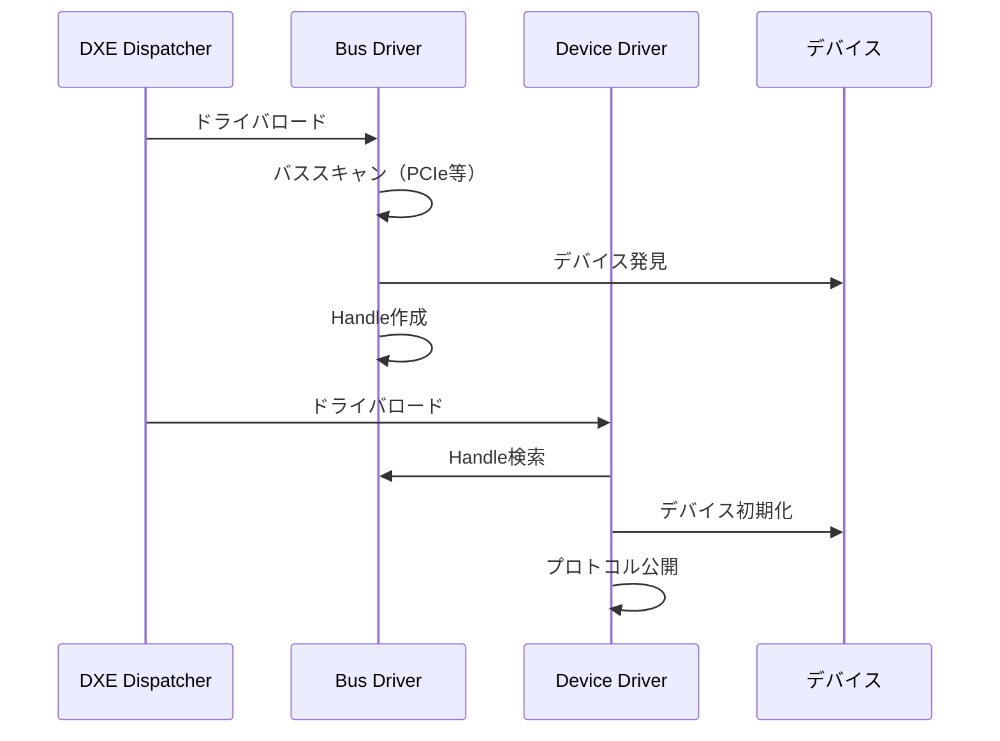

#### Boot Services と Runtime Services の構築

DXE Phase のもう一つの重要な責務は、Boot Services と Runtime Services という二つのサービステーブルを構築することです。これらのサービステーブルは、OS やブートローダがハードウェアやファームウェア機能にアクセスするための標準化された API を提供します。Boot Services は、OS 起動前のみ利用可能なサービスであり、Runtime Services は、OS 実行中も継続して利用可能なサービスです。

Boot Services は、メモリ管理、プロトコル操作、イベント・タイマ、ドライバ管理など、ファームウェア環境で必要となるすべての機能を提供します。メモリ管理サービスには、AllocatePool や AllocatePages があり、動的メモリの確保を可能にします。プロトコル操作サービスには、InstallProtocol や LocateProtocol があり、プロトコルの登録と検索を行います。イベント・タイマサービスは、非同期処理やタイムアウト処理を実現します。ドライバ管理サービスは、ドライバの動的なロードとアンロードをサポートします。これらのサービスは、ブートローダや UEFI アプリケーションが利用しますが、OS が ExitBootServices() を呼び出した時点ですべて無効化されます。

一方、Runtime Services は、OS 実行中も継続して提供されるサービスです。NVRAM 変数アクセスサービス（GetVariable、SetVariable）は、ブート設定やファームウェア設定を永続化するために使用されます。時刻取得・設定サービス（GetTime、SetTime）は、リアルタイムクロック（RTC）へのアクセスを提供します。システムリセットサービス（ResetSystem）は、システムの再起動やシャットダウンを実行します。カプセル更新サービス（UpdateCapsule）は、ファームウェアの更新を可能にします。これらのサービスは、OS がページングを有効化した後も利用できるように、SetVirtualAddressMap() によって仮想アドレス空間にマップされます。したがって、Runtime Services は、OS とファームウェアの間の永続的なインターフェースとして機能します。

**補足説明**: 以下は、Boot Services と Runtime Services の主要な機能をまとめたものです。

```
Boot Services（OS起動前のみ）:
- メモリ管理（AllocatePool, AllocatePages）
- プロトコル操作（InstallProtocol, LocateProtocol）
- イベント・タイマ
- ドライバ管理

Runtime Services（OS実行中も利用可能）:
- NVRAM変数アクセス（GetVariable, SetVariable）
- 時刻取得・設定（GetTime, SetTime）
- システムリセット（ResetSystem）
- カプセル更新（UpdateCapsule）
```

### DXEドライバの種類と役割

DXE Phase で実行されるドライバは、その役割に応じて四つのカテゴリに分類されます。Core Driver、Bus Driver、Device Driver、Application の四つであり、それぞれ異なる責務を持ちます。

Core Driver は、DXE Core そのものであり、Dispatcher、Protocol Database、Handle Database を提供します。これは、DXE Phase の基盤となる最も重要なドライバであり、他のすべてのドライバが依存する機能を提供します。Bus Driver は、PCIe Bus、USB Bus、SCSI Bus など、バス階層を管理するドライバです。バスをスキャンし、接続されているデバイスを発見し、Handle を作成する役割を担います。Device Driver は、特定のデバイスタイプを初期化するドライバであり、NIC Driver、Storage Driver、Video Driver などが含まれます。これらのドライバは、デバイス固有の初期化を実行し、対応するプロトコルを公開します。Application は、ドライバではなく、UEFI 環境で実行されるアプリケーションであり、UEFI Shell、Setup UI、診断ツールなどが含まれます。これらは、ユーザーとのインタラクションや管理タスクを提供します。

この分類は、ドライバの再利用性と拡張性を向上させるために設計されています。たとえば、PCIe Bus Driver は、どのようなPCIeデバイスにも対応でき、新しいデバイスをサポートする場合は、対応する Device Driver を追加するだけで済みます。また、Application は、ドライバとは独立して開発・配布できるため、サードパーティ製のツールやユーティリティを容易に追加できます。したがって、この四層構造は、UEFI エコシステムの柔軟性と拡張性を支える重要な設計原則となっています。

**補足図**: 以下の図は、DXE ドライバの四つのカテゴリとその具体例を示したものです。

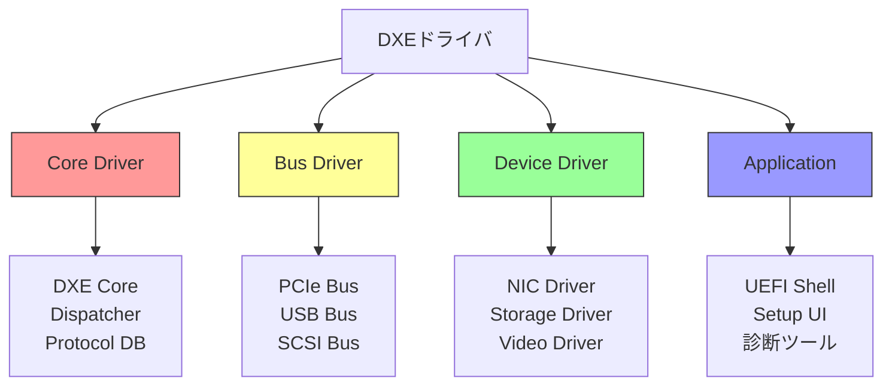

## BDS Phase の責務

### 主要な責任

BDS (Boot Device Selection) Phase は、ブートデバイスを選択し、OS を起動する責任を持つフェーズです。DXE Phase がすべてのデバイスを初期化し、利用可能な状態にした後、BDS Phase は、実際にどのデバイスから OS を起動するかを決定し、ブートローダをロードして実行します。このフェーズは、ファームウェアの最終段階であり、ここで正常に OS が起動すれば、ファームウェアの責任は完了します。

BDS Phase の主要な責務は、三つの領域に分かれます。第一に、ブートオプション管理です。NVRAM 変数に保存された BootOrder を読み込み、ブートの優先順位を決定します。第二に、ブート試行です。各ブートオプションに従ってデバイスパスを解決し、ブートローダを検索し、実行を試みます。第三に、ユーザーインターフェースの提供です。Setup UI、Boot Menu、Boot Manager などを提供し、ユーザーがブート設定を変更したり、一時的にブートデバイスを選択したりできるようにします。この三つの責務により、BDS Phase は、柔軟かつ堅牢なブート処理を実現しています。

BDS Phase が独立したフェーズとして設計されている理由は、ポリシーとメカニズムの分離という設計原則にあります。DXE Phase は、デバイスを使える状態にするメカニズムを提供しますが、どのデバイスから起動するかというポリシーは BDS Phase が決定します。この分離により、プラットフォームごとに異なるブートポリシーを実装でき、Secure Boot のような高度なセキュリティ機能も、既存の DXE ドライバに影響を与えずに追加できます。したがって、BDS Phase は、ファームウェアの最終調整とポリシー適用を担う重要なフェーズです。

**補足図**: 以下の図は、BDS Phase の三つの主要責務を示したものです。

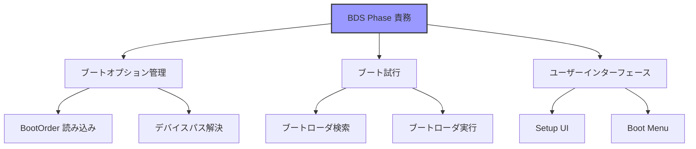

### 詳細な責務

#### ブートオプションの管理

BDS Phase は、NVRAM に保存されたブート設定を読み込み、ブートの優先順位を決定します。UEFI では、ブート設定は複数の NVRAM 変数として保存されており、BootOrder、Boot0000、Boot0001 などの変数から構成されます。BootOrder 変数は、ブート試行の順序を示す UINT16 の配列であり、たとえば [0x0000, 0x0003, 0x0001] という値は、「まず Boot0000 を試し、次に Boot0003、最後に Boot0001 を試す」という意味になります。各 BootXXXX 変数は、EFI_LOAD_OPTION 構造体であり、デバイスパス、説明文字列、オプショナルデータが含まれています。BootCurrent 変数は、現在起動中のブートオプション番号を示します。

BDS Phase は、BootOrder 変数を読み込み、リストの先頭から順にブートを試行します。まず、Boot0000 変数を取得し、そこに記述されたデバイスパスを解決します。デバイスパスが解決できる場合、ブートローダの検索と実行に進みます。デバイスパスが解決できない場合（たとえば、USB メモリが接続されていない場合）、次のブートオプションに移ります。ブートローダの実行に成功すれば、OS が起動し、ファームウェアの役割は終了します。ブートローダの実行に失敗すれば、次のブートオプションに移ります。このように、BootOrder に従って順次ブートを試行することで、堅牢なブート処理が実現されます。

**補足図**: 以下の図は、BootOrder に従ったブート試行の流れを示したものです。

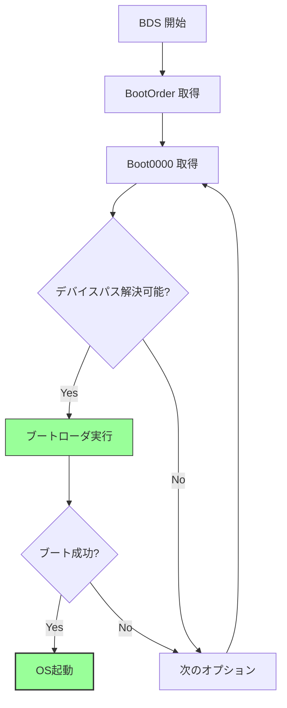

**補足説明**: 以下は、NVRAM 変数の構造をまとめたものです。

```
NVRAM 変数の構造:

BootOrder: UINT16[]
  - ブート試行順序（例: [0x0000, 0x0003, 0x0001]）

Boot0000, Boot0001, ...: EFI_LOAD_OPTION
  - 各ブートオプションの詳細
  - デバイスパス
  - 説明文字列
  - オプショナルデータ

BootCurrent: UINT16
  - 現在起動中のオプション
```

#### デバイスパスの解決

デバイスパスは、UEFI の重要な概念であり、デバイスの位置を階層的に表現する仕組みです。デバイスパスは、複数のノードから構成され、各ノードは、PCI Root Bridge、PCI デバイス、USB ポート、パーティション、ファイルパスなどを表します。BDS Phase は、BootXXXX 変数に記述されたデバイスパスを解析し、実際のデバイスと対応付けます。

たとえば、USB メモリに保存されたブートローダのデバイスパスは、次のように表現されます。PciRoot(0x0) は、PCI Root Bridge を示します。Pci(0x14,0x0) は、PCI バス上のデバイス 0x14、ファンクション 0x0、すなわち USB Controller を示します。USB(0x3,0x0) は、USB ポート 3 に接続されたデバイスを示します。HD(1,GPT,...) は、GPT パーティションテーブルのパーティション 1 を示します。最後に、\EFI\BOOT\BOOTX64.EFI は、ファイルパスを示します。BDS Phase は、このデバイスパスを先頭から順に解決し、最終的にブートローダファイルの位置を特定します。

デバイスパスの解決は、DXE Phase で構築された Protocol Database を利用して行われます。各デバイスには、Device Path Protocol が公開されており、BDS Phase は、すべてのデバイスの Device Path を列挙し、BootXXXX 変数のデバイスパスと一致するものを検索します。デバイスパスが一致すれば、そのデバイスに対して Simple File System Protocol を利用してファイルを読み込みます。このように、デバイスパスとプロトコルの組み合わせにより、柔軟かつ汎用的なブート処理が実現されています。

**補足説明**: 以下は、USB メモリのブートローダのデバイスパス例です。

```
例: USB メモリのブートローダ

PciRoot(0x0)/Pci(0x14,0x0)/USB(0x3,0x0)/HD(1,GPT,...)/\EFI\BOOT\BOOTX64.EFI

解釈:
1. PCI Root Bridge
2. PCI(0x14,0x0): USB Controller
3. USB(0x3,0x0): ポート3のデバイス
4. HD(1,...): パーティション1（GPT）
5. \EFI\BOOT\BOOTX64.EFI: ファイルパス
```

#### フォールバック機構

BDS Phase は、BootOrder に記述されたすべてのブートオプションが失敗した場合に備えて、フォールバック機構を提供します。このフォールバック機構により、ブート設定が破損していたり、ブートデバイスが接続されていなかったりする場合でも、システムが起動できる可能性が高まります。

フォールバック機構は、複数の段階から構成されます。まず、BootOrder に従ったブートが失敗した場合、BDS Phase はリムーバブルメディア（USB メモリ、CD/DVD など）を検索します。リムーバブルメディアが見つかった場合、デフォルトパス \EFI\BOOT\BOOTX64.EFI からのブートを試みます。このデフォルトパスは、UEFI 仕様で定義されており、OS インストーラや汎用ブートローダが配置される標準的な場所です。デフォルトパスからのブートが成功すれば、OS が起動します。リムーバブルメディアが見つからない場合、または デフォルトパスからのブートが失敗した場合、BDS Phase はネットワークブート（PXE: Preboot Execution Environment）を試みます。ネットワークブートが成功すれば、ネットワーク経由で OS がロードされます。すべてのフォールバック機構が失敗した場合、BDS Phase はエラーメッセージを表示し、ユーザーに対処を促します。

このフォールバック機構により、UEFI システムは、ブート設定に依存せず、利用可能なブート手段を自動的に探索できます。これは、システムの可用性とユーザビリティを大幅に向上させる重要な機能です。

**補足図**: 以下の図は、フォールバック機構の流れを示したものです。

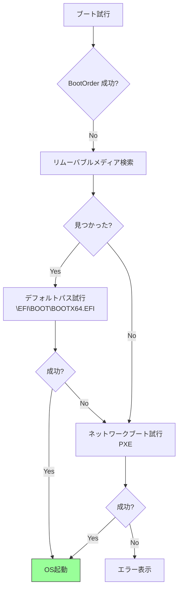

#### ユーザーインターフェースの提供

BDS Phase は、ユーザーとのインタラクションを提供する複数のユーザーインターフェースを含みます。Setup UI、Boot Menu、Boot Manager などがあり、それぞれ異なる目的で使用されます。

Setup UI は、いわゆる BIOS 設定画面であり、ファームウェアの詳細設定を変更するためのインターフェースです。通常、起動時に Del キーや F2 キーを押すことで起動します。Setup UI では、ブート順序の変更、ハードウェア設定、セキュリティ設定などが行えます。Boot Menu は、一時的にブートデバイスを選択するためのインターフェースです。通常、F12 キーで起動します。Boot Menu では、ユーザーは、今回の起動に限り、特定のデバイスから起動することができます。Boot Manager は、ブートオプションを管理するためのインターフェースであり、NVRAM 変数の設定を行います。Boot Manager では、新しいブートオプションの追加、既存のオプションの削除、ブート順序の変更などが行えます。

これらのユーザーインターフェースは、プラットフォームベンダーによってカスタマイズされることが多く、各ベンダーは独自のデザインや機能を追加します。しかし、基本的な機能は UEFI 仕様で定義されており、統一された操作性が提供されています。したがって、BDS Phase は、技術的なブート処理だけでなく、ユーザビリティの向上にも貢献しています。

**参考表**: 以下の表は、主要なユーザーインターフェースをまとめたものです。

| UI | 役割 | 起動条件 |
|-----|------|---------|
| Setup UI | BIOS設定画面 | Del/F2キー |
| Boot Menu | ブートデバイス選択 | F12キー |
| Boot Manager | ブートオプション管理 | NVRAM設定 |

### BDSの設計思想

BDS Phase が独立したフェーズとして設計されている理由は、UEFI アーキテクチャの重要な設計原則を反映しています。その設計思想は、ポリシーとメカニズムの分離、柔軟性、セキュリティという三つの柱から成ります。

まず、ポリシーとメカニズムの分離です。DXE Phase は、デバイスを使える状態にするメカニズムを提供しますが、どのデバイスから起動するか、どの順序でブートを試行するかというポリシーは、BDS Phase が決定します。この分離により、DXE ドライバは汎用的な実装が可能になり、プラットフォーム固有のブートポリシーは BDS Phase でのみ実装すればよくなります。次に、柔軟性です。OEM ごとに異なるブートポリシーを実装でき、カスタム UI の実装も容易です。たとえば、サーバ向けプラットフォームでは、ネットワークブートを優先し、クライアント向けプラットフォームでは、ローカルディスクを優先するといった違いを、BDS Phase の実装だけで実現できます。最後に、セキュリティです。Secure Boot の検証は、BDS Phase で実施されます。ブートローダの署名検証、信頼されたブートチェーンの構築など、セキュリティに関連する処理は、ブート直前の BDS Phase で集中的に実行されます。また、ユーザー認証も BDS Phase で実装できます。

この設計思想により、BDS Phase は、ファームウェアの最終調整とポリシー適用を担う柔軟かつ安全なフェーズとなっています。したがって、BDS Phase は、単なるブート処理ではなく、システム全体の起動戦略を実現する重要な役割を果たしています。

## TSL/RT の責務

### TSL (Transient System Load)

TSL (Transient System Load) フェーズは、OS ブートローダが実行され、OS カーネルをロードするフェーズです。このフェーズでは、BDS Phase で選択されたブートローダが LoadImage() と StartImage() によってロードされ、実行されます。ブートローダは、OS カーネルをメモリにロードし、必要な設定を読み込み、最後に ExitBootServices() を呼び出して OS へ制御を移譲します。

ブートローダの動作は、次のように進行します。まず、BDS Phase が LoadImage() を呼び出し、ブートローダのイメージをメモリにロードします。次に、StartImage() を呼び出し、ブートローダの実行を開始します。ブートローダは、UEFI の Boot Services を利用して、OS カーネルをディスクから読み込み、メモリに配置します。また、ブート設定ファイル（Linux の場合は grub.cfg、Windows の場合は BCD など）を読み込み、カーネルパラメータを準備します。ブートローダは、すべての準備が完了すると、ExitBootServices() を呼び出します。この関数は、UEFI ファームウェアに対して、「これから OS が動作を開始するので、Boot Services を終了してほしい」という通知です。ExitBootServices() が成功すると、Boot Services はすべて無効化され、ブートローダは OS カーネルのエントリポイントにジャンプします。この時点で、OS が制御を取得し、UEFI ファームウェアの役割は大部分が終了します。

ExitBootServices() の影響は広範囲に及びます。まず、Boot Services のすべてが終了します。メモリ管理サービス（AllocatePool、AllocatePages）、プロトコル操作サービス（InstallProtocol、LocateProtocol）、イベント・タイマサービス、ドライバ管理サービスなど、すべての Boot Services が利用不可能になります。次に、ほとんどのドライバが終了します。DXE Phase でロードされたドライバの大部分は、Boot Services に依存しているため、ExitBootServices() 後は動作しません。唯一継続するのは、Runtime Services のみです。Runtime Services は、OS 実行中も提供され続けるサービスであり、NVRAM 変数アクセス、時刻取得・設定、システムリセット、ファームウェア更新などの機能を提供します。また、一部の Runtime Driver も継続して動作します。これらのドライバは、Runtime Services を実装するために必要なドライバであり、Boot Services に依存しない設計になっています。

**補足図**: 以下の図は、TSL フェーズにおける OS への制御移譲の流れを示したものです。

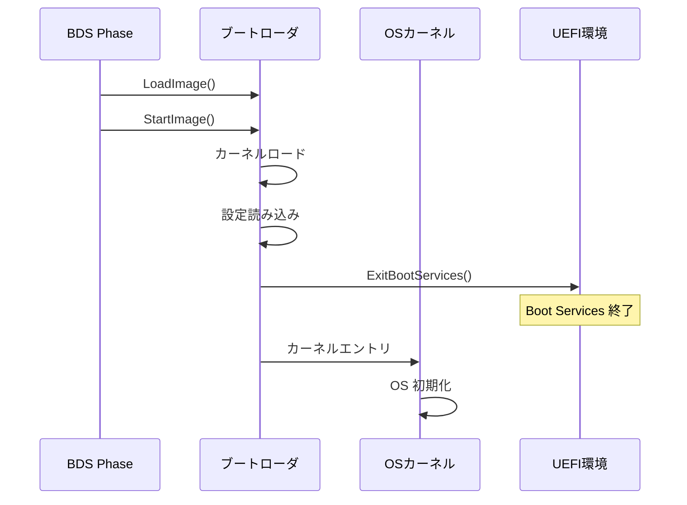

**補足説明**: 以下は、ExitBootServices() の影響をまとめたものです。

```
終了するサービス:
- Boot Services のすべて
- ほとんどのドライバ
- イベント・タイマ
- メモリ管理サービス

継続するサービス:
- Runtime Services のみ
- 一部のドライバ（Runtime Driver）
```

### Runtime Services の役割

Runtime Services は、OS 実行中も継続して提供されるサービスであり、UEFI ファームウェアと OS の間の永続的なインターフェースです。Runtime Services は、四つの主要なサービスカテゴリから構成されます。Variable Services、Time Services、Reset Services、Capsule Services であり、それぞれ OS が必要とする重要な機能を提供します。

Variable Services は、NVRAM 変数へのアクセスを提供します。GetVariable() と SetVariable() という二つの関数により、OS は、ブート設定やファームウェア設定を読み書きできます。たとえば、Linux や Windows は、次回起動時のブートオプションを BootOrder 変数に書き込むことで、ブート順序を変更できます。また、OEM 固有の設定も NVRAM 変数として保存されます。Time Services は、リアルタイムクロック（RTC）へのアクセスを提供します。GetTime() と SetTime() により、OS は、ハードウェアクロックから時刻を取得したり、時刻を設定したりできます。これは、システム起動時の時刻初期化や、ハイバネーションからの復帰時に使用されます。Reset Services は、システムのリセットとシャットダウンを提供します。ResetSystem() により、OS は、システムを再起動したり、電源を切ったりできます。この機能は、OS のシャットダウンシーケンスの最後に使用されます。Capsule Services は、ファームウェアの更新を提供します。UpdateCapsule() により、OS は、ファームウェアイメージをファームウェアに渡し、次回起動時に更新を実行させることができます。これは、いわゆる BIOS 更新の仕組みです。

Runtime Services は、OS がページングを有効化した後も利用できるように、特別な仕組みが必要です。UEFI ファームウェアは、起動時には物理アドレスで動作していますが、OS は仮想アドレス空間で動作します。そのため、OS は、SetVirtualAddressMap() を呼び出し、Runtime Services のアドレスを仮想アドレス空間にマップします。この関数は、メモリマップを UEFI ファームウェアに渡し、「これから Runtime Services を呼び出す際には、この仮想アドレスを使用する」という通知です。UEFI ファームウェアは、内部のポインタをすべて仮想アドレスに変換し、以降の呼び出しに備えます。この仕組みにより、OS は、ページングが有効な状態でも、Runtime Services を安全に呼び出すことができます。

**参考表**: 以下の表は、Runtime Services の主要なサービスをまとめたものです。

| サービス | 機能 | 使用例 |
|---------|------|--------|
| Variable Services | NVRAM 変数アクセス | ブート設定保存 |
| Time Services | RTC 時刻取得・設定 | システム時刻 |
| Reset Services | システムリセット | シャットダウン |
| Capsule Services | ファームウェア更新 | BIOS 更新 |

**補足説明**: 以下は、OS 起動後のメモリレイアウトと Runtime Services の位置を示したものです。

```
OS起動後のメモリマップ:

┌─────────────────┐
│ OS カーネル      │
├─────────────────┤
│ アプリケーション  │
├─────────────────┤
│ Runtime Services │ ← UEFI が提供
│ (MMIO領域)       │    仮想アドレスにマップ
├─────────────────┤
│ Runtime Driver   │
└─────────────────┘
```

**補足コード例**: 以下は、SetVirtualAddressMap() の概念的な流れを示したコード例です。

```c
// 概念的な流れ
// 1. OS がページテーブル構築
// 2. Runtime Services を仮想アドレスへマップ
// 3. UEFI に新しいアドレスを通知
Status = RuntimeServices->SetVirtualAddressMap(
  MemoryMapSize,
  DescriptorSize,
  DescriptorVersion,
  VirtualMap
);
// 4. 以降、仮想アドレスで Runtime Services を呼び出し
```

## フェーズ間ハンドオフの仕組み

### 情報の受け渡し方法

UEFI ファームウェアの各フェーズは、独立して実行されますが、前のフェーズから次のフェーズへ情報を受け渡す必要があります。この情報の受け渡しは、フェーズ間ハンドオフと呼ばれ、各フェーズの遷移時に実行されます。ハンドオフ機構は、フェーズごとに異なる方式が使用され、各フェーズの特性と利用可能なリソースに応じて設計されています。

SEC から PEI への遷移では、最小限の情報のみが受け渡されます。この時点では、DRAM はまだ初期化されておらず、CAR (Cache as RAM) による一時的な RAM 領域のみが利用可能です。そのため、SEC Phase は、スタック領域に基本的な情報を配置し、PEI Core に制御を渡します。PEI から DXE への遷移では、HOB (Hand-Off Block) リストが使用されます。HOB は、メモリマップ、CPU 情報、プラットフォーム設定など、DXE Phase が必要とするすべての情報を含むデータ構造です。PEI Phase は、HOB リストを構築し、DXE Core に渡します。DXE から BDS への遷移では、Protocol が使用されます。DXE Phase で構築されたすべてのデバイスとサービスは、Protocol として公開されており、BDS Phase は、Protocol Database を通じてこれらにアクセスできます。BDS から OS への遷移では、Configuration Table が使用されます。Configuration Table は、ACPI Table、SMBIOS Table、メモリマップなど、OS が起動に必要とするテーブル群へのポインタを含みます。

このように、フェーズ間ハンドオフは、各フェーズの特性に応じた最適な方式で実装されており、情報の連続性と各フェーズの独立性を両立させています。

**補足図**: 以下の図は、フェーズ間ハンドオフの流れを示したものです。


**参考表**: 以下の表は、各フェーズ遷移のハンドオフ機構をまとめたものです。

| 遷移 | 機構 | 内容 |
|------|------|------|
| SEC → PEI | スタック | 最小限の情報（CAR領域） |
| PEI → DXE | HOB | メモリマップ、CPU情報、設定 |
| DXE → BDS | Protocol | すべてのデバイス・サービス |
| BDS → OS | Configuration Table | ACPI、SMBIOS、メモリマップ |

### Configuration Table

Configuration Table は、UEFI ファームウェアが OS に渡すテーブル群へのポインタを含むデータ構造です。OS は、Configuration Table を解析することで、ハードウェア情報、デバイス情報、メモリマップなどを取得し、システムの初期化に利用します。

Configuration Table の構造は、シンプルです。各エントリは、VendorGuid と VendorTable という二つのフィールドから構成されます。VendorGuid は、テーブルの種類を識別する GUID であり、ACPI Table、SMBIOS Table、Device Tree などが標準的に定義されています。VendorTable は、実際のテーブルへのポインタです。UEFI ファームウェアは、DXE Phase で各種テーブルを構築し、Configuration Table に登録します。OS は、ExitBootServices() の前に Configuration Table を取得し、各テーブルのアドレスを保存します。

主要なテーブルには、ACPI Table、SMBIOS Table、Device Tree があります。ACPI Table は、Advanced Configuration and Power Interface の仕様に従ったテーブルであり、デバイスの列挙、電源管理、割り込みルーティングなどの情報を含みます。SMBIOS Table は、System Management BIOS の仕様に従ったテーブルであり、マザーボード、CPU、メモリ、BIOS バージョンなどのハードウェア情報を含みます。Device Tree は、ARM プラットフォームで使用されるデバイス記述形式であり、デバイスの階層構造とプロパティを記述します。これらのテーブルにより、OS は、プラットフォーム固有の情報を取得し、適切にシステムを初期化できます。

Linux カーネルは、UEFI から Configuration Table を取得し、次のように利用します。まず、UEFI から Configuration Table を取得します。次に、ACPI Table を解析し、デバイス情報や電源管理情報を取得します。ACPI Table は、Linux カーネルのデバイスドライバが使用します。次に、SMBIOS Table を解析し、ハードウェア情報を取得します。これは、dmidecode などのツールで表示される情報の元になります。最後に、Memory Map を取得し、メモリ管理サブシステムを初期化します。このように、Configuration Table は、OS とファームウェアの間の重要なインターフェースとなっています。

**補足コード例**: 以下は、UEFI Configuration Table の構造を示したコード例です。

```c
// UEFI Configuration Table の構造
typedef struct {
  EFI_GUID  VendorGuid;     // テーブルの種類
  VOID      *VendorTable;   // テーブルへのポインタ
} EFI_CONFIGURATION_TABLE;

// 主なテーブル:
// - ACPI Table: ACPI_20_TABLE_GUID
// - SMBIOS Table: SMBIOS_TABLE_GUID
// - Device Tree: DEVICE_TREE_GUID (ARM)
```

**補足説明**: 以下は、Linux カーネルでの Configuration Table の利用例です。

```
Linuxカーネル起動時:
1. UEFI から Configuration Table 取得
2. ACPI Table を解析 → デバイス情報
3. SMBIOS Table を解析 → ハードウェア情報
4. Memory Map を取得 → メモリ管理
```

## 責務分担の設計原則

### 各フェーズの設計指針

UEFI ファームウェアが各ブートフェーズを明確に分離している背景には、いくつかの重要な設計原則があります。これらの原則は、ファームウェアの複雑性を管理し、保守性を向上させ、セキュリティを強化するために採用されています。主要な設計原則は、最小特権の原則、段階的複雑化、独立性とテスト容易性の三つです。

最小特権の原則は、各フェーズが必要最小限のリソースのみにアクセスするという原則です。SEC Phase は、セキュリティの起点であるため、CPU と ROM のみにアクセスし、外部からの攻撃面を最小化します。PEI Phase は、プラットフォーム初期化に必要な DRAM と基本 I/O のみにアクセスします。DXE Phase は、すべてのデバイスにアクセスできますが、これはドライバ実行環境を提供するために必要です。BDS Phase は、すべてのリソースにアクセスできますが、これはブート処理のためです。このように、各フェーズは、その役割に応じた最小限のリソースにのみアクセスすることで、セキュリティリスクを低減しています。

段階的複雑化の原則は、ファームウェアの複雑さを段階的に増加させるという原則です。SEC Phase は、非常にシンプルであり、数 KB のコードから構成されます。これは、最小限の環境で確実に動作する必要があるためです。PEI Phase は、中程度の複雑さであり、数十 KB から数百 KB のコードから構成されます。これは、プラットフォーム初期化という限定的な役割を持つためです。DXE Phase は、最も複雑であり、数 MB のコードから構成されます。これは、多数のドライバとデバイスを管理するためです。BDS Phase は、再び中程度の複雑さに戻ります。これは、ブートポリシーという限定的な役割を持つためです。このように、複雑さを段階的に増加させることで、各フェーズの開発とデバッグが容易になります。

独立性とテスト容易性の原則は、各フェーズが疎結合であり、独立してテストできるという原則です。PEI から DXE への遷移は、HOB という標準インターフェースを通じて行われます。DXE から BDS への遷移は、Protocol という標準インターフェースを通じて行われます。これらのインターフェースを標準化することで、各フェーズの独立実装が可能になります。ベンダー固有部分とコア部分を分離でき、テストとデバッグが容易になります。たとえば、PEI Phase を変更しても、HOB の構造が変わらない限り、DXE Phase には影響しません。このように、疎結合の設計により、ファームウェアの保守性と拡張性が大幅に向上しています。

**補足図**: 以下の図は、UEFI ファームウェアの設計原則を示したものです。

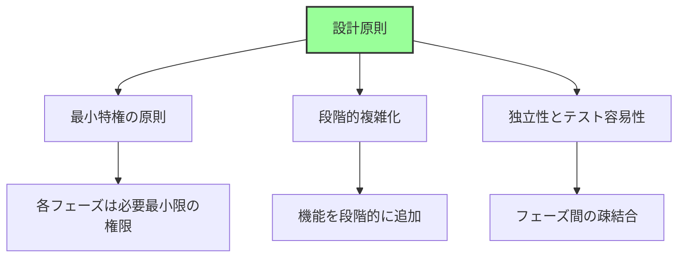

**参考表**: 以下の表は、最小特権の原則に基づく各フェーズのリソースアクセスをまとめたものです。

| フェーズ | 利用可能リソース | 理由 |
|---------|-----------------|------|
| SEC | CPU、ROM | セキュリティの起点、最小限 |
| PEI | + DRAM、基本I/O | プラットフォーム初期化に必要 |
| DXE | + 全デバイス | ドライバ実行環境 |
| BDS | すべて | ブート処理のため |

**補足説明**: 以下は、段階的複雑化の遷移を示したものです。

```
複雑さの遷移:

SEC:    シンプル（数KB）
  ↓
PEI:    中程度（数十～数百KB）
  ↓
DXE:    複雑（数MB）
  ↓
BDS:    中程度（ポリシーのみ）
```

**補足図**: 以下の図は、標準インターフェースによる疎結合を示したものです。

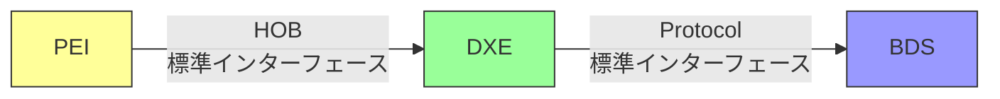

## まとめ

この章では、UEFI ファームウェアの各ブートフェーズの詳細な責務と、フェーズ間の情報の受け渡し方法を説明しました。各フェーズは、明確に定義された役割を持ち、段階的にシステムを初期化していきます。この章の内容を理解することで、UEFI ファームウェアの全体的なアーキテクチャと、各フェーズがどのように協調してシステムを起動するかを把握できます。

各フェーズの主要な責務は、次のように整理できます。SEC Phase は、CPU 初期化と CAR 設定を行い、PEI Core を起動します。この時点では、DRAM はまだ利用できず、最小限のリソースで動作します。PEI Phase は、DRAM 初期化とプラットフォーム固有の初期化を行い、HOB リストを構築して DXE Core を起動します。この時点で、システムは通常の RAM を使用できるようになります。DXE Phase は、ドライバ実行環境を提供し、すべてのデバイスを初期化し、Boot Services と Runtime Services を構築します。この時点で、システム内のすべてのハードウェアが利用可能になります。BDS Phase は、ブートデバイスを選択し、ブートローダをロードして実行します。この時点で、ファームウェアの役割は大部分が完了します。TSL/RT フェーズでは、OS へ制御を移譲し、Runtime Services を提供し続けます。この時点で、OS が動作を開始し、UEFI ファームウェアは背後でサポートを提供します。

UEFI ファームウェアの設計原則は、複雑性の管理と保守性の向上に焦点を当てています。段階的機能有効化により、リソースを段階的に利用可能にし、各フェーズの役割を明確にします。責任の分離により、各フェーズは独立した責務を持ち、互いに影響を与えません。モジュール性により、各フェーズは独立して実装・テストでき、ベンダー固有部分とコア部分を分離できます。標準インターフェースにより、HOB、Protocol、Configuration Table などの疎結合の仕組みを提供し、各フェーズの独立性を保証します。これらの設計原則により、UEFI ファームウェアは、高度な拡張性と保守性を実現しています。

フェーズ間ハンドオフ機構は、各フェーズが前のフェーズから情報を受け取り、次のフェーズへ渡す仕組みです。SEC から PEI へは、一時 RAM 領域を通じて最小限の情報が渡されます。PEI から DXE へは、HOB リストを通じて、メモリマップ、CPU 情報、プラットフォーム設定などが渡されます。DXE から BDS へは、Protocol Database を通じて、すべてのデバイスとサービスが渡されます。BDS から OS へは、Configuration Table を通じて、ACPI Table、SMBIOS Table、メモリマップなどが渡されます。このハンドオフ機構により、各フェーズは必要な情報を確実に受け取り、次のフェーズへ引き継ぐことができます。

**参考表**: 以下の表は、各フェーズの主要責務と成果物をまとめたものです。

| フェーズ | 主要責務 | 成果物 |
|---------|---------|--------|
| **SEC** | CPU初期化、CAR設定 | PEI Core起動 |
| **PEI** | DRAM初期化、プラットフォーム初期化 | HOBリスト、DXE Core起動 |
| **DXE** | ドライバ実行、デバイス初期化 | Boot/Runtime Services |
| **BDS** | ブートデバイス選択、ブート実行 | OS起動 |
| **TSL/RT** | OSへ制御移譲、Runtime Services提供 | OS実行環境 |

**補足図**: 以下の図は、フェーズ間ハンドオフの全体像を示したものです。


---

**次章では、Part I 全体のまとめを行います。**

📚 **参考資料**
- [UEFI Specification v2.10 - Chapter 2: Boot Phases](https://uefi.org/specifications)
- [UEFI PI Specification v1.8 - Volume 1-5](https://uefi.org/specifications)
- [EDK II Module Writer's Guide](https://tianocore-docs.github.io/edk2-ModuleWriteGuide/)
- [Intel® 64 and IA-32 Architectures Software Developer's Manual](https://www.intel.com/sdm)
