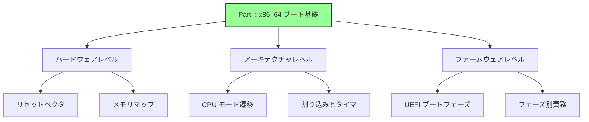
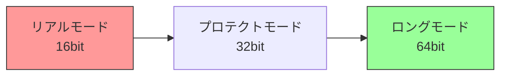
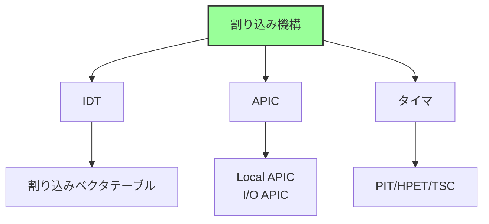
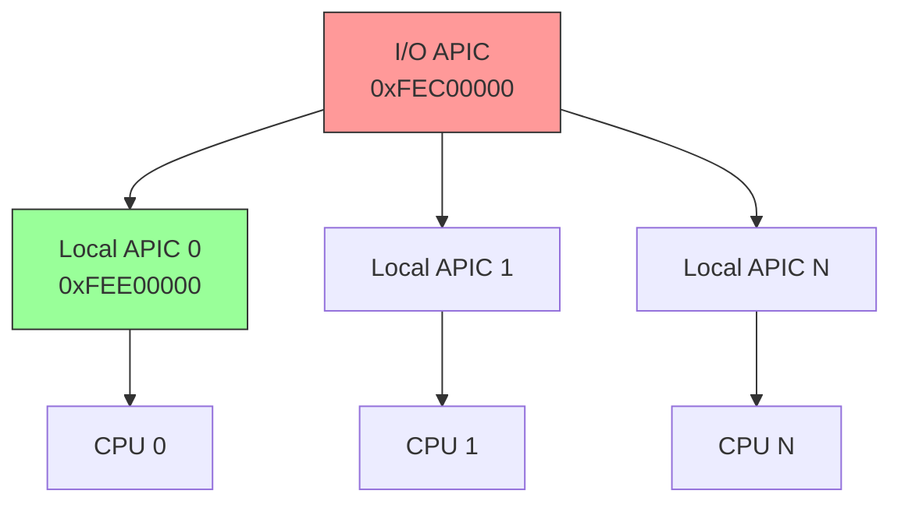
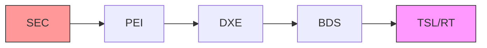
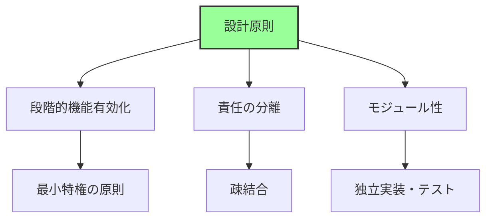
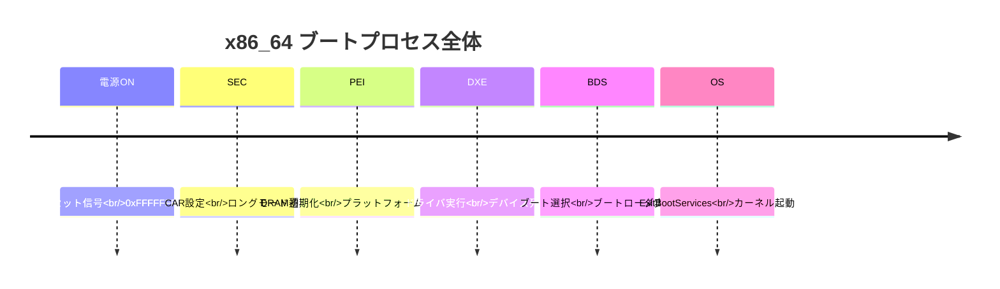
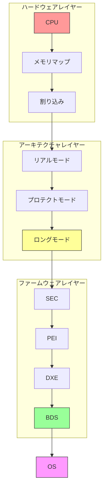
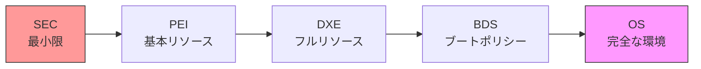
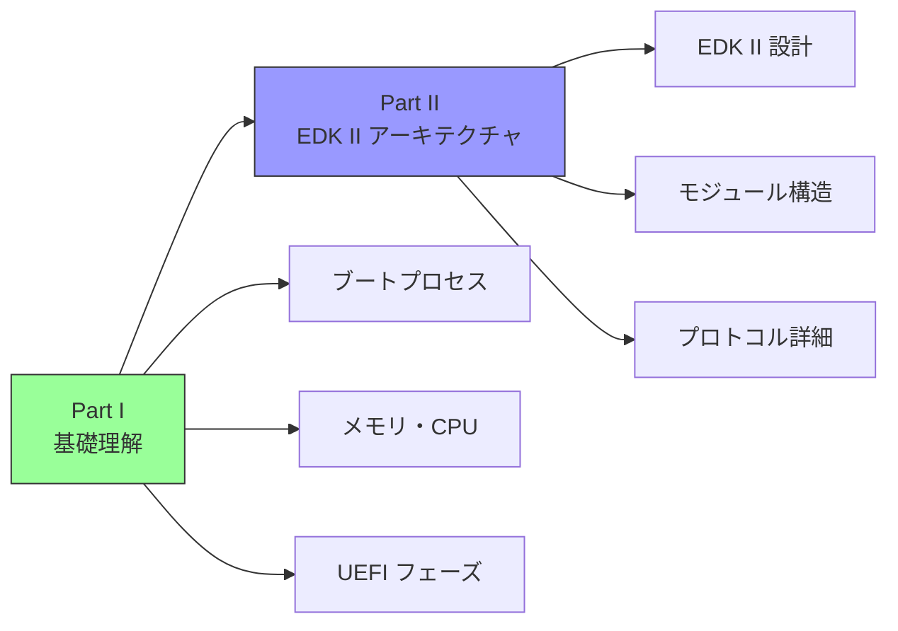

# Part I まとめ

🎯 **この章の目的**
- Part I で学んだ内容の総復習
- x86_64 ブートプロセスの全体像の整理
- 重要概念の相互関係の理解
- Part II への準備

---

## Part I で学んだこと

Part I では、**x86_64 アーキテクチャにおけるブート基礎**を学びました。



## 各章の要点

### 第1章: リセットから最初の命令まで

**重要な概念:**


**キーポイント:**
- x86_64 CPU は電源投入時、必ず **0xFFFFFFF0** から実行を開始
- この位置を **リセットベクタ** と呼ぶ
- チップセットが SPI ROM を固定アドレスにマップ
- DRAM 未初期化のため、ROM のみアクセス可能
- リセットベクタには JMP 命令が配置され、ファームウェア本体へ遷移

**なぜこの設計か:**
- 決定論的な起動（常に同じアドレスから）
- 最小限の依存（RAM 不要）
- 後方互換性（30年以上継承）

### 第2章: メモリマップと E820

**重要な概念:**

```
物理アドレス空間（4GB例）:
┌─────────────────┐ 0xFFFFFFFF
│ BIOS ROM        │
├─────────────────┤ 0xFExxxxxx
│ MMIO領域        │
├─────────────────┤ 0x000A0000
│ DRAM            │
└─────────────────┘ 0x00000000
```

**キーポイント:**
- 物理アドレス空間 ≠ DRAM サイズ
- **MMIO (Memory-Mapped I/O)** でデバイスにアクセス
- **E820** (Legacy): INT 15h でメモリマップ取得
- **UEFI Memory Map**: `EFI_MEMORY_DESCRIPTOR` で詳細な情報
- **メモリホール**: 3GB-4GB 付近の DRAM 未使用領域
- **RAM Remapping**: メモリホールの DRAM を 4GB 以上へ再配置

**メモリマップの遷移:**
```
BIOS/UEFI → ブートローダ → OS
    ↓            ↓          ↓
 構築         取得        管理
```

### 第3章: CPU モード遷移の全体像

**重要な概念:**



**キーポイント:**

| モード | ビット幅 | アドレス空間 | 特徴 |
|--------|---------|-------------|------|
| リアルモード | 16bit | 1MB | セグメント:オフセット、保護なし |
| プロテクトモード | 32bit | 4GB | GDT、特権レベル |
| ロングモード | 64bit | 256TB | ページング必須、フラットメモリ |

**モード遷移の手順:**
1. **リアルモード → プロテクトモード**
   - GDT 設定
   - CR0.PE ビットセット
   - ファージャンプ

2. **プロテクトモード → ロングモード**
   - ページテーブル構築（PML4, PDPT, PD, PT）
   - CR3 設定（ページテーブルベース）
   - CR4.PAE 有効化
   - IA32_EFER.LME 設定
   - CR0.PG 有効化
   - ファージャンプ

**UEFI の特徴:**
- SEC Phase で早期にロングモードへ遷移
- PEI/DXE は全て 64bit で実行
- ブートローダには 64bit 環境を提供

### 第4章: 割り込みとタイマの仕組み

**重要な概念:**



**キーポイント:**

**1. 割り込みの種類**

| 種類 | 発生源 | 例 | 番号範囲 |
|------|--------|-----|---------|
| 例外 | CPU内部 | ページフォルト | 0-31 |
| ハードウェア割り込み | 外部デバイス | タイマ、キーボード | 32-255 |
| ソフトウェア割り込み | INT命令 | システムコール | 任意 |

**2. APIC アーキテクチャ**



- **Local APIC**: 各 CPU コア固有、タイマー機能
- **I/O APIC**: 外部デバイス管理、ルーティング
- **MSI/MSI-X**: PCIe デバイスの高性能割り込み

**3. タイマの種類**

| タイマ | 周波数 | 精度 | 用途 |
|--------|--------|------|------|
| PIT | 1.193MHz | 低 | レガシー |
| RTC | 32.768kHz | 低 | CMOS時計 |
| APIC Timer | CPU依存 | 中 | 各CPU固有 |
| HPET | 10MHz以上 | 高 | モダン |
| TSC | CPU周波数 | 最高 | 計測専用 |

**UEFI での扱い:**
- 通常、割り込みは無効化（CLI 状態）
- ポーリングベースで動作
- OS が割り込みを設定・有効化

### 第5章: UEFI ブートフェーズの全体像

**重要な概念:**



**5つのフェーズ:**

| フェーズ | 名称 | 主な役割 |
|---------|------|---------|
| **SEC** | Security | CPU初期化、CAR設定 |
| **PEI** | Pre-EFI Initialization | DRAM初期化、基本H/W初期化 |
| **DXE** | Driver Execution Environment | ドライバ実行、デバイス列挙 |
| **BDS** | Boot Device Selection | ブートデバイス選択 |
| **TSL/RT** | Transient System Load / Runtime | OS起動、ランタイムサービス |

**フェーズごとの RAM 状態:**

| Phase | RAM状態 | 主な処理 | 成果物 |
|-------|---------|---------|--------|
| SEC | CAR（CPU Cache） | CPU初期化 | PEI Core |
| PEI | DRAM初期化中→完了 | メモリ初期化 | DXE Core、HOB |
| DXE | DRAM利用可 | ドライバ実行 | Boot Services |
| BDS | DRAM利用可 | ブート選択 | OS起動 |

**PI と UEFI の関係:**
- **PI 仕様**: ファームウェア内部（SEC, PEI, DXE）
- **UEFI 仕様**: OS とのインターフェース（Boot/Runtime Services）

### 第6章: 各ブートフェーズの役割と責務

**重要な概念:**

**設計原則:**



**フェーズ別詳細責務:**

**1. SEC Phase**
- CPU 初期化（マイクロコード、キャッシュ、モード遷移）
- **CAR (Cache as RAM)** 設定
- PEI Core の発見・検証・ロード

**2. PEI Phase**
- **DRAM 初期化**（最重要タスク）
  - Memory Controller 設定
  - SPD 読み込み
  - DRAM トレーニング
- CPU/Chipset 初期化
- **HOB (Hand-Off Block)** 構築
- DXE Core 起動

**3. DXE Phase**
- **DXE Dispatcher**（依存関係解決、ドライバ実行）
- デバイス初期化（PCIe 列挙、USB/Network/Storage）
- **プロトコル** 公開（GOP, Block I/O, File System等）
- Boot Services / Runtime Services 提供

**4. BDS Phase**
- **ブートオプション管理**（BootOrder, Boot000x）
- デバイスパス解決
- ブートローダ検索・実行
- フォールバック機構
- ユーザーインターフェース（Setup UI, Boot Menu）

**5. TSL/RT**
- OS への制御移譲（ExitBootServices）
- **Runtime Services** 提供（NVRAM、Time、Reset、Capsule）
- SetVirtualAddressMap による仮想アドレスマッピング

**ハンドオフ機構:**

| 遷移 | 機構 | 内容 |
|------|------|------|
| SEC → PEI | スタック | 最小限の情報（CAR領域） |
| PEI → DXE | HOB | メモリマップ、CPU情報、設定 |
| DXE → BDS | Protocol | すべてのデバイス・サービス |
| BDS → OS | Configuration Table | ACPI、SMBIOS、メモリマップ |

## ブートプロセス全体の流れ

### タイムラインでの理解



### レイヤー別の理解



## 重要な概念の相互関係

### 1. メモリの遷移

```
起動時: ROM のみ
  ↓
SEC: CAR（CPU Cache as RAM）
  ↓
PEI: DRAM 初期化中
  ↓
DXE: DRAM 利用可能、メモリマップ確定
  ↓
OS: 仮想メモリ管理
```

### 2. CPU モードの遷移

```
リセット時: リアルモード（16bit）
  ↓
SEC Phase: ロングモード遷移（64bit）
  ↓
PEI/DXE/BDS: すべて 64bit で実行
  ↓
OS: 仮想アドレス空間管理
```

### 3. 実行環境の拡大



## Part I の重要キーワード

### ハードウェア関連
- **リセットベクタ** (0xFFFFFFF0)
- **SPI ROM / Flash Memory**
- **MMIO (Memory-Mapped I/O)**
- **メモリホール**
- **RAM Remapping**

### CPU アーキテクチャ
- **リアルモード / プロテクトモード / ロングモード**
- **GDT (Global Descriptor Table)**
- **IDT (Interrupt Descriptor Table)**
- **ページング (PML4, PDPT, PD, PT)**
- **CAR (Cache as RAM)**

### 割り込み・タイマ
- **IDT (Interrupt Descriptor Table)**
- **APIC (Local APIC / I/O APIC)**
- **MSI/MSI-X**
- **PIT / HPET / TSC**

### UEFI ブート
- **SEC / PEI / DXE / BDS / TSL/RT**
- **PEIM (PEI Module)**
- **HOB (Hand-Off Block)**
- **DXE Dispatcher**
- **プロトコル (Protocol)**
- **Boot Services / Runtime Services**
- **Configuration Table**

### メモリマップ
- **E820 (Legacy)**
- **EFI_MEMORY_DESCRIPTOR**
- **EFI_MEMORY_TYPE**

## よくある質問 (FAQ)

### Q1: なぜ 0xFFFFFFF0 から起動するのか？

**A:** 設計上の理由：
1. **固定位置**: ハードウェアが決定論的に動作
2. **ROM 配置**: SPI ROM の位置が固定（4GB 付近）
3. **後方互換性**: 8086 以来の伝統

### Q2: CAR とは何か、なぜ必要か？

**A:** Cache as RAM の略。
- **目的**: DRAM 未初期化でも RAM を確保
- **仕組み**: CPU キャッシュを No-Evict モードにしてRAMとして使用
- **容量**: 通常 64KB-256KB
- **用途**: SEC/PEI Phase のスタック・ヒープ

### Q3: ロングモードへの遷移はいつ行われるか？

**A:** UEFI では **SEC Phase** で行われます。
- リアルモード（リセット時）
- → プロテクトモード（GDT設定後）
- → ロングモード（ページング設定後）
- PEI 以降はすべて 64bit モード

### Q4: HOB とは何か？

**A:** Hand-Off Block の略。
- **役割**: PEI → DXE への情報受け渡し
- **内容**: メモリマップ、CPU 情報、プラットフォーム設定
- **形式**: リンクリスト構造

### Q5: プロトコルとは何か？

**A:** UEFI のサービス提供機構。
- **概念**: インターフェース（関数テーブル）
- **役割**: デバイス・サービスへの統一的なアクセス方法
- **例**: GOP (Graphics Output Protocol)、Block I/O Protocol

### Q6: Boot Services と Runtime Services の違いは？

**A:**

| 項目 | Boot Services | Runtime Services |
|------|--------------|-----------------|
| 有効期間 | OS起動前のみ | OS実行中も |
| 用途 | ドライバ管理、メモリ管理 | NVRAM、時刻、リセット |
| 終了タイミング | ExitBootServices() | なし |

### Q7: UEFI とレガシー BIOS の最大の違いは？

**A:** 主な違い：

| 項目 | レガシー BIOS | UEFI |
|------|--------------|------|
| 実行モード | 16bit リアルモード | 64bit ロングモード |
| インターフェース | INT 命令 | プロトコル |
| 拡張性 | 低い | 高い |
| モジュール性 | モノリシック | モジュラー |

## Part I から Part II へ

Part I では、**ハードウェアとアーキテクチャ**の基礎を学びました。



**Part I で学んだこと:**
- ✅ x86_64 の起動メカニズム
- ✅ メモリマップの構造
- ✅ CPU モード遷移
- ✅ UEFI ブートフェーズ

**Part II で学ぶこと:**
- EDK II の設計思想
- モジュールとビルドシステム
- プロトコルとドライバモデルの詳細
- ハードウェア抽象化の仕組み
- グラフィックス・ストレージ・USB スタック

**準備すべき知識:**
- Part I の内容を理解している
- UEFI のフェーズ構造を把握している
- プロトコルの基本概念を理解している

## 学習の確認

### 理解度チェック

以下の質問に答えられますか？

**基礎レベル:**
- [ ] リセットベクタとは何か説明できる
- [ ] メモリマップの必要性を説明できる
- [ ] CPU の3つのモードを説明できる
- [ ] UEFI の5つのフェーズを説明できる

**中級レベル:**
- [ ] CAR の仕組みと必要性を説明できる
- [ ] ロングモードへの遷移手順を説明できる
- [ ] APIC の構造を説明できる
- [ ] 各フェーズの主要な責務を説明できる

**上級レベル:**
- [ ] メモリホールと RAM Remapping を説明できる
- [ ] HOB の役割と構造を説明できる
- [ ] DXE Dispatcher の動作を説明できる
- [ ] Runtime Services の仮想アドレスマッピングを説明できる

### 実践的な理解

**シナリオ1: 電源投入から OS 起動まで**

以下の流れを説明できますか？

```
1. 電源ON
   ↓
2. 0xFFFFFFF0 実行
   ↓
3. ロングモード遷移
   ↓
4. DRAM 初期化
   ↓
5. ドライバロード
   ↓
6. ブートローダ実行
   ↓
7. OS 起動
```

**シナリオ2: メモリの利用**

各フェーズでどのメモリを使用しているか説明できますか？

```
SEC: ?
PEI: ?
DXE: ?
BDS: ?
OS:  ?
```

## まとめ

Part I では、x86_64 アーキテクチャにおけるブート基礎を学びました。

**重要な理解:**

1. **ハードウェアの制約がソフトウェア設計を決定する**
   - DRAM 未初期化 → CAR が必要
   - ROM のみアクセス可能 → リセットベクタが固定

2. **段階的な機能有効化**
   - SEC: 最小限（CAR）
   - PEI: 基本リソース（DRAM）
   - DXE: フルリソース（全デバイス）

3. **標準化されたインターフェース**
   - HOB: PEI → DXE
   - Protocol: DXE 内部
   - Configuration Table: UEFI → OS

4. **設計原則**
   - 最小特権の原則
   - 責任の分離
   - 疎結合

**次のステップ:**

Part II では、これらの基礎知識をベースに、**EDK II の具体的な実装**を学びます。

- EDK II のアーキテクチャ
- モジュール構造とビルドシステム
- プロトコルとドライバモデル
- 各種サブシステム（Graphics, Storage, USB）

Part I の知識が、Part II 以降の理解の土台となります。

---

**Part II に進む準備はできましたか？**

📚 **Part I 参考資料まとめ**
- [UEFI Specification v2.10](https://uefi.org/specifications)
- [UEFI PI Specification v1.8](https://uefi.org/specifications)
- [Intel® 64 and IA-32 Architectures Software Developer's Manual](https://www.intel.com/sdm)
- [AMD64 Architecture Programmer's Manual](https://www.amd.com/en/support/tech-docs)
- [EDK II Documentation](https://github.com/tianocore/tianocore.github.io/wiki)
