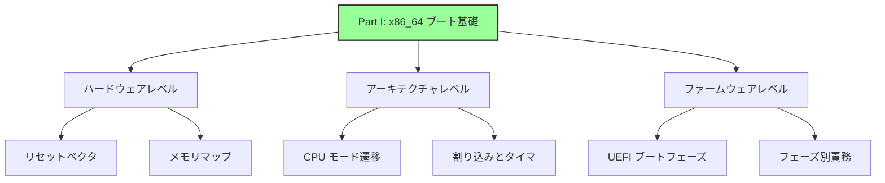
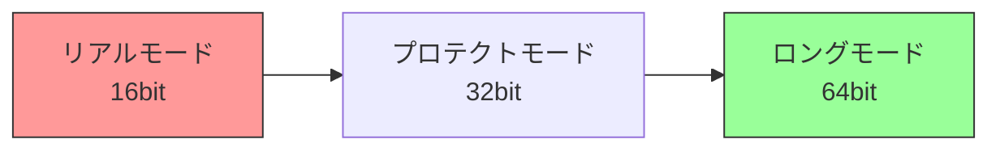
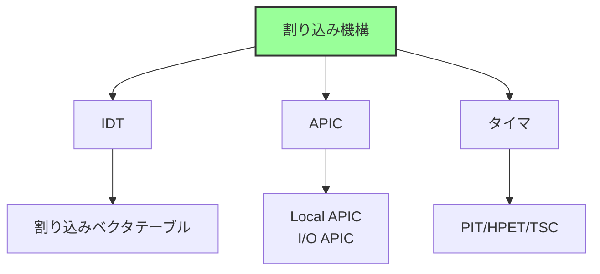
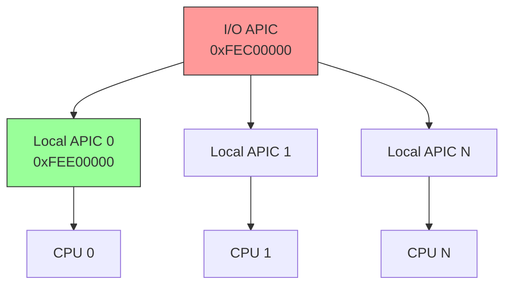
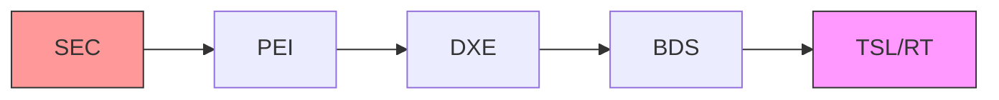
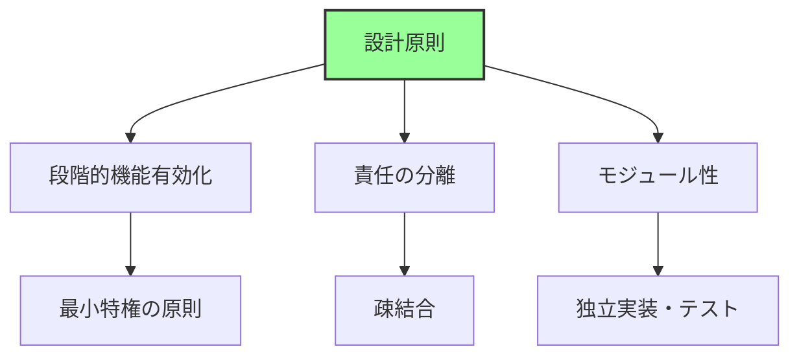
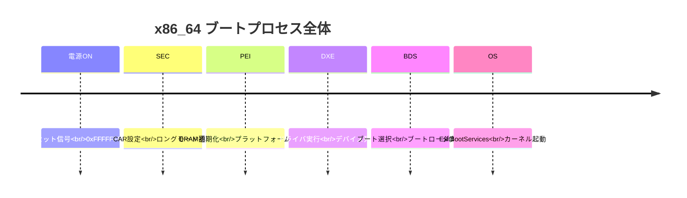
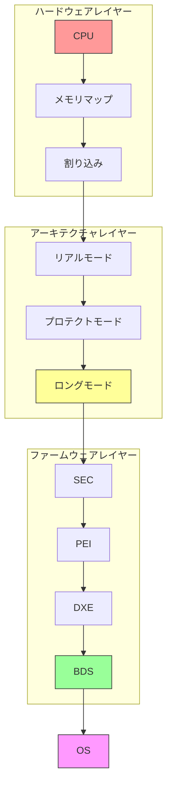
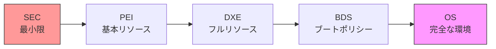
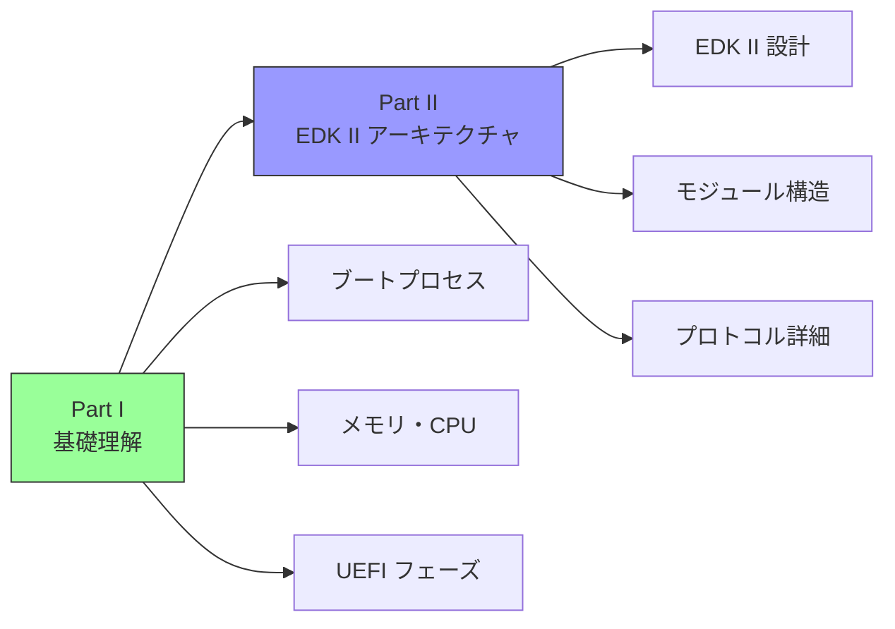

# Part I まとめ

🎯 **この章の目的**
- Part I で学んだ内容の総復習
- x86_64 ブートプロセスの全体像の整理
- 重要概念の相互関係の理解
- Part II への準備

---

## Part I で学んだこと

Part I では、x86_64 アーキテクチャにおけるブート基礎を体系的に学びました。この Part の目的は、ファームウェア開発に必要なハードウェアとアーキテクチャの基礎知識を習得し、UEFI ブートプロセスの全体像を理解することでした。Part I で扱った内容は、三つの主要なレベルに分類できます。ハードウェアレベル、アーキテクチャレベル、ファームウェアレベルの三つです。

ハードウェアレベルでは、x86_64 CPU の起動メカニズムとメモリマップの構造を学びました。電源投入時に CPU が最初に実行するアドレスであるリセットベクタ (0xFFFFFFF0) の仕組みと、物理アドレス空間がどのように構成されているかを理解しました。また、DRAM、ROM、MMIO 領域の配置と、メモリホールや RAM Remapping といった実践的な概念も学びました。アーキテクチャレベルでは、CPU モード遷移と割り込み・タイマの仕組みを学びました。リアルモード、プロテクトモード、ロングモードという三つの動作モードと、それらの間の遷移方法を詳しく見ました。また、IDT (Interrupt Descriptor Table)、APIC (Advanced Programmable Interrupt Controller)、各種タイマ (PIT、HPET、TSC など) の役割も理解しました。ファームウェアレベルでは、UEFI のブートフェーズ全体像と各フェーズの詳細な責務を学びました。SEC、PEI、DXE、BDS、TSL/RT という五つのフェーズがどのように連携してシステムを起動するか、そして各フェーズが担当する具体的なタスクを把握しました。

これら三つのレベルは、密接に関連しています。ハードウェアの制約がアーキテクチャ設計を決定し、アーキテクチャの特性がファームウェアの実装方針を形作ります。たとえば、DRAM が未初期化の状態で起動しなければならないというハードウェアの制約は、CAR (Cache as RAM) という技術を必要とし、それが SEC Phase と PEI Phase の設計に直接影響します。同様に、CPU モード遷移の複雑さは、UEFI ファームウェアが早期にロングモードへ遷移する設計思想につながっています。このように、Part I では、ハードウェアからファームウェアまでの垂直統合的な理解を目指しました。

**補足図**: 以下の図は、Part I で学んだ三つのレベルの関係を示したものです。



## 各章の要点

### 第1章: リセットから最初の命令まで

第1章では、x86_64 CPU が電源投入時にどのように最初の命令を実行するかを学びました。x86_64 アーキテクチャの最も基本的な特性の一つは、CPU がリセット後、必ず固定されたアドレス 0xFFFFFFF0 から実行を開始するという点です。このアドレスは、リセットベクタと呼ばれ、4GB アドレス空間の最上位から 16 バイト下の位置にあります。

この設計の背景には、いくつかの重要な理由があります。まず、決定論的な起動を実現するためです。CPU が常に同じアドレスから実行を開始することで、ハードウェアとソフトウェアの動作が予測可能になります。次に、最小限の依存を維持するためです。電源投入直後は DRAM が未初期化であるため、ROM のみがアクセス可能です。リセットベクタを ROM 領域に配置することで、RAM に依存せずに起動できます。最後に、後方互換性を維持するためです。この仕組みは、8086 以来の伝統を受け継ぎ、30年以上にわたって継承されています。

チップセットは、SPI ROM (Flash Memory) を物理アドレス空間の上位領域にマップします。リセットベクタ 0xFFFFFFF0 には、通常 JMP 命令が配置されており、この命令がファームウェア本体のエントリポイントへ制御を移します。JMP 命令のサイズが小さい (通常 5-7 バイト) ため、16 バイトのリセットベクタ領域に収まります。このシンプルな設計により、x86_64 CPU は確実に起動を開始できます。

**補足図**: 以下の図は、電源投入からファームウェアエントリポイントまでの流れを示したものです。


### 第2章: メモリマップと E820

第2章では、x86_64 システムの物理アドレス空間がどのように構成されているかを学びました。重要な理解は、物理アドレス空間と DRAM サイズは等しくないという点です。物理アドレス空間には、DRAM だけでなく、BIOS ROM、MMIO (Memory-Mapped I/O) 領域、その他の予約領域が含まれます。

物理アドレス空間の典型的な構成は、次のようになります。最下位の 0x00000000 から始まるメインメモリ領域には、DRAM が配置されます。しかし、0x000A0000 付近から MMIO 領域が始まり、デバイスレジスタやビデオメモリがマップされます。さらに上位の 0xFExxxxxx 付近には、BIOS ROM がマップされます。このように、物理アドレス空間は、DRAM とデバイスが混在する複雑な構造を持ちます。

メモリマップを取得する方法は、レガシー BIOS と UEFI で異なります。レガシー BIOS では、E820 と呼ばれる仕組みを使用し、INT 15h, AX=E820h を呼び出すことでメモリマップを取得します。UEFI では、EFI_MEMORY_DESCRIPTOR という構造体を使用し、より詳細なメモリ情報を提供します。メモリマップは、BIOS/UEFI によって構築され、ブートローダが取得し、最終的に OS が管理します。

メモリホールと RAM Remapping は、実践的に重要な概念です。メモリホールは、3GB-4GB 付近の DRAM が未使用になる領域であり、MMIO 領域を配置するために DRAM が退避させられます。RAM Remapping は、メモリホールに配置できなかった DRAM を 4GB 以上のアドレスへ再配置する技術です。これにより、システムは搭載されたすべての DRAM を有効活用できます。

**補足説明**: 以下は、物理アドレス空間の典型的な構成を示したものです。

```
物理アドレス空間（4GB例）:
┌─────────────────┐ 0xFFFFFFFF
│ BIOS ROM        │
├─────────────────┤ 0xFExxxxxx
│ MMIO領域        │
├─────────────────┤ 0x000A0000
│ DRAM            │
└─────────────────┘ 0x00000000
```

### 第3章: CPU モード遷移の全体像

第3章では、x86_64 CPU の三つの動作モード（リアルモード、プロテクトモード、ロングモード）と、それらの間の遷移方法を学びました。x86_64 アーキテクチャは、歴史的経緯から複数の動作モードを持ち、後方互換性を維持しながら新しい機能を追加してきました。

リアルモードは、8086 CPU との互換性のために存在する 16bit モードです。セグメント:オフセット形式のアドレッシングを使用し、1MB のメモリ空間しかアクセスできません。メモリ保護機構がないため、モダンな OS には適していません。プロテクトモードは、80286 で導入された 32bit モードです。GDT (Global Descriptor Table) を使用してメモリセグメントを管理し、特権レベル (Ring 0-3) によるアクセス制御を提供します。4GB のアドレス空間をサポートしますが、64bit アプリケーションは実行できません。ロングモードは、AMD64 アーキテクチャで追加された 64bit モードです。ページングが必須であり、フラットメモリモデルを採用しています。理論上 256TB のアドレス空間をサポートし、セグメンテーションは実質無効化されます。

モード遷移の手順は、複雑です。リアルモードからプロテクトモードへの遷移では、まず GDT を設定し、次に CR0 レジスタの PE (Protection Enable) ビットをセットし、最後にファージャンプを実行して CS レジスタを更新します。プロテクトモードからロングモードへの遷移は、さらに複雑です。まず、PML4、PDPT、PD、PT という四つのレベルのページテーブルを構築します。次に、CR3 レジスタにページテーブルベースアドレスを設定します。CR4 レジスタの PAE (Physical Address Extension) ビットを有効化し、IA32_EFER MSR の LME (Long Mode Enable) ビットを設定します。CR0 レジスタの PG (Paging) ビットを有効化し、最後にファージャンプを実行して 64bit コードセグメントへ移行します。

UEFI ファームウェアの特徴は、早期にロングモードへ遷移することです。SEC Phase でロングモードへ遷移し、PEI Phase 以降はすべて 64bit モードで実行されます。これにより、ファームウェア全体を 64bit コードで記述でき、大容量メモリへのアクセスやモダンな開発環境の活用が可能になります。ブートローダには、すでに 64bit 環境が提供されるため、OS 起動時のモード遷移は不要です。

**補足図**: 以下の図は、三つの CPU モードの遷移を示したものです。



**参考表**: 以下の表は、三つのモードの特徴をまとめたものです。

| モード | ビット幅 | アドレス空間 | 特徴 |
|--------|---------|-------------|------|
| リアルモード | 16bit | 1MB | セグメント:オフセット、保護なし |
| プロテクトモード | 32bit | 4GB | GDT、特権レベル |
| ロングモード | 64bit | 256TB | ページング必須、フラットメモリ |

### 第4章: 割り込みとタイマの仕組み

第4章では、x86_64 アーキテクチャにおける割り込み機構とタイマの仕組みを学びました。割り込みは、CPU に非同期イベントを通知する基本的な機構であり、モダンな OS の動作に不可欠です。割り込み機構は、IDT (Interrupt Descriptor Table)、APIC (Advanced Programmable Interrupt Controller)、各種タイマという三つの主要コンポーネントから構成されます。

割り込みには、三つの種類があります。まず、例外は、CPU 内部で発生する割り込みであり、ページフォルト、ゼロ除算、無効命令などがあります。例外の番号は 0-31 の範囲に予約されています。次に、ハードウェア割り込みは、外部デバイスから発生する割り込みであり、タイマ、キーボード、ネットワークカードなどが含まれます。ハードウェア割り込みの番号は 32-255 の範囲で使用されます。最後に、ソフトウェア割り込みは、INT 命令によって明示的に発生させる割り込みであり、レガシー BIOS のシステムコールなどで使用されます。ソフトウェア割り込みの番号は任意ですが、通常は OS が管理します。

APIC アーキテクチャは、モダンなマルチコア CPU 向けの割り込みコントローラです。APIC は、Local APIC と I/O APIC という二つのコンポーネントから構成されます。Local APIC は、各 CPU コアに固有であり、MMIO アドレス 0xFEE00000 にマップされます。Local APIC は、タイマー機能も提供し、各 CPU が独立したタイマー割り込みを生成できます。I/O APIC は、外部デバイスからの割り込みを管理し、MMIO アドレス 0xFEC00000 にマップされます。I/O APIC は、割り込みのルーティング機能を提供し、特定の割り込みを特定の CPU に配送できます。MSI/MSI-X は、PCIe デバイスの高性能割り込み機構であり、I/O APIC を経由せずに CPU に直接割り込みを送信できます。この仕組みにより、低レイテンシと高いスループットが実現されます。

タイマには、複数の種類があります。PIT (Programmable Interval Timer) は、レガシーなタイマであり、1.193MHz の周波数で動作します。精度は低いですが、歴史的な理由から多くのシステムでサポートされています。RTC (Real-Time Clock) は、CMOS 時計であり、32.768kHz の周波数で動作します。主に時刻管理に使用されます。APIC Timer は、Local APIC に内蔵されたタイマであり、CPU 周波数に依存します。各 CPU が独立したタイマーを持つため、マルチコア環境で有用です。HPET (High Precision Event Timer) は、モダンなタイマであり、10MHz 以上の周波数で動作します。高精度が要求されるアプリケーションで使用されます。TSC (Time Stamp Counter) は、CPU サイクルカウンタであり、CPU 周波数で動作します。最高の精度を提供しますが、計測専用であり、割り込みは生成しません。

UEFI ファームウェアでは、通常、割り込みは無効化された状態 (CLI 状態) で動作します。これは、ファームウェアがポーリングベースで動作し、割り込みに依存しないためです。OS が起動すると、OS が割り込みを設定し、有効化します。この設計により、ファームウェアの複雑性が低減され、信頼性が向上します。

**補足図**: 以下の図は、割り込み機構の三つの主要コンポーネントを示したものです。



**参考表**: 以下の表は、割り込みの種類をまとめたものです。

| 種類 | 発生源 | 例 | 番号範囲 |
|------|--------|-----|---------|
| 例外 | CPU内部 | ページフォルト | 0-31 |
| ハードウェア割り込み | 外部デバイス | タイマ、キーボード | 32-255 |
| ソフトウェア割り込み | INT命令 | システムコール | 任意 |

**補足図**: 以下の図は、APIC アーキテクチャを示したものです。



**参考表**: 以下の表は、タイマの種類をまとめたものです。

| タイマ | 周波数 | 精度 | 用途 |
|--------|--------|------|------|
| PIT | 1.193MHz | 低 | レガシー |
| RTC | 32.768kHz | 低 | CMOS時計 |
| APIC Timer | CPU依存 | 中 | 各CPU固有 |
| HPET | 10MHz以上 | 高 | モダン |
| TSC | CPU周波数 | 最高 | 計測専用 |

### 第5章: UEFI ブートフェーズの全体像

第5章では、UEFI ファームウェアの五つのブートフェーズ（SEC、PEI、DXE、BDS、TSL/RT）の全体像を学びました。UEFI ファームウェアは、電源投入から OS 起動まで、明確に定義されたフェーズを経て動作します。各フェーズは、特定の役割と責務を持ち、次のフェーズへの準備を整えます。

SEC (Security) Phase は、最初のフェーズであり、CPU 初期化と CAR (Cache as RAM) 設定を行います。この時点では、DRAM が未初期化であるため、CPU キャッシュを RAM として使用します。SEC Phase の主な成果物は、PEI Core の起動です。PEI (Pre-EFI Initialization) Phase は、DRAM 初期化と基本的なハードウェア初期化を行います。PEI Phase の最重要タスクは、DRAM を初期化し、システムが通常の RAM を使用できるようにすることです。PEI Phase の主な成果物は、DXE Core の起動と HOB (Hand-Off Block) の構築です。DXE (Driver Execution Environment) Phase は、フルスペックのドライバ実行環境を提供し、すべてのデバイスを初期化します。DXE Phase の主な成果物は、Boot Services と Runtime Services の提供です。BDS (Boot Device Selection) Phase は、ブートデバイスを選択し、ブートローダを実行します。BDS Phase の主な成果物は、OS の起動です。TSL/RT (Transient System Load / Runtime) Phase は、OS へ制御を移譲し、Runtime Services を提供し続けます。

フェーズごとの RAM 状態は、段階的に変化します。SEC Phase では、CAR (CPU Cache を RAM として使用) のみが利用可能です。PEI Phase では、DRAM が初期化中から完了へ遷移します。DXE Phase 以降は、DRAM が完全に利用可能になります。この RAM 状態の遷移は、各フェーズの設計に大きく影響します。

PI (Platform Initialization) 仕様と UEFI 仕様の関係も重要です。PI 仕様は、ファームウェア内部のアーキテクチャ (SEC, PEI, DXE) を定義します。UEFI 仕様は、OS とのインターフェース (Boot Services / Runtime Services) を定義します。両仕様を組み合わせることで、完全な UEFI ファームウェアが実現されます。

**補足図**: 以下の図は、五つのブートフェーズの流れを示したものです。



**参考表**: 以下の表は、五つのフェーズの役割をまとめたものです。

| フェーズ | 名称 | 主な役割 |
|---------|------|---------|
| **SEC** | Security | CPU初期化、CAR設定 |
| **PEI** | Pre-EFI Initialization | DRAM初期化、基本H/W初期化 |
| **DXE** | Driver Execution Environment | ドライバ実行、デバイス列挙 |
| **BDS** | Boot Device Selection | ブートデバイス選択 |
| **TSL/RT** | Transient System Load / Runtime | OS起動、ランタイムサービス |

**参考表**: 以下の表は、フェーズごとの RAM 状態と成果物をまとめたものです。

| Phase | RAM状態 | 主な処理 | 成果物 |
|-------|---------|---------|--------|
| SEC | CAR（CPU Cache） | CPU初期化 | PEI Core |
| PEI | DRAM初期化中→完了 | メモリ初期化 | DXE Core、HOB |
| DXE | DRAM利用可 | ドライバ実行 | Boot Services |
| BDS | DRAM利用可 | ブート選択 | OS起動 |

### 第6章: 各ブートフェーズの役割と責務

第6章では、各ブートフェーズの詳細な責務と、フェーズ間の情報受け渡し方法を学びました。UEFI ファームウェアが各フェーズを明確に分離している背景には、段階的機能有効化、責任の分離、モジュール性という重要な設計原則があります。

SEC Phase の詳細な責務は、CPU 初期化、CAR (Cache as RAM) 設定、PEI Core の発見・検証・ロードです。CPU 初期化では、マイクロコードのロード、キャッシュの設定、リアルモードからロングモードへのCPU モード遷移を行います。CAR 設定では、CPU キャッシュを No-Evict モードにして RAM として使用します。PEI Core の発見では、Firmware Volume から PEI Core を検索し、検証してロードします。

PEI Phase の詳細な責務は、DRAM 初期化、CPU/Chipset 初期化、HOB (Hand-Off Block) 構築、DXE Core 起動です。DRAM 初期化は、PEI Phase の最重要タスクであり、Memory Controller の設定、SPD (Serial Presence Detect) の読み込み、DRAM トレーニングを行います。HOB 構築では、メモリマップ、CPU 情報、プラットフォーム設定などを HOB リストに記録し、DXE Phase へ渡します。

DXE Phase の詳細な責務は、DXE Dispatcher の実行、デバイス初期化、プロトコル公開、Boot Services / Runtime Services の提供です。DXE Dispatcher は、依存関係を解決しながらドライバを実行します。デバイス初期化では、PCIe バスの列挙、USB/Network/Storage デバイスの初期化を行います。プロトコル公開では、GOP (Graphics Output Protocol)、Block I/O Protocol、File System Protocol などを公開します。

BDS Phase の詳細な責務は、ブートオプション管理、デバイスパス解決、ブートローダ検索・実行、フォールバック機構、ユーザーインターフェースの提供です。ブートオプション管理では、NVRAM から BootOrder を読み込み、Boot0000、Boot0001 などのブートオプションを処理します。デバイスパス解決では、階層的なデバイスパスを実際のデバイスと対応付けます。フォールバック機構では、BootOrder が失敗した場合に、リムーバブルメディアやネットワークブートを試みます。ユーザーインターフェースでは、Setup UI、Boot Menu を提供し、ユーザーがブート設定を変更できるようにします。

TSL/RT Phase の詳細な責務は、OS への制御移譲、Runtime Services の提供、SetVirtualAddressMap による仮想アドレスマッピングです。ExitBootServices() により、Boot Services が終了し、OS へ制御が移譲されます。Runtime Services は、OS 実行中も提供され続け、NVRAM 変数アクセス、時刻取得・設定、システムリセット、カプセル更新などの機能を提供します。SetVirtualAddressMap では、OS がページングを有効化した後も Runtime Services が利用できるように、仮想アドレス空間にマップします。

フェーズ間ハンドオフ機構は、各フェーズが前のフェーズから情報を受け取り、次のフェーズへ渡す仕組みです。SEC から PEI へは、スタック領域を通じて最小限の情報が渡されます。PEI から DXE へは、HOB リストを通じて、メモリマップ、CPU 情報、設定が渡されます。DXE から BDS へは、Protocol Database を通じて、すべてのデバイスとサービスが渡されます。BDS から OS へは、Configuration Table を通じて、ACPI Table、SMBIOS Table、メモリマップが渡されます。

**補足図**: 以下の図は、UEFI ファームウェアの設計原則を示したものです。



**参考表**: 以下の表は、フェーズ間ハンドオフ機構をまとめたものです。

| 遷移 | 機構 | 内容 |
|------|------|------|
| SEC → PEI | スタック | 最小限の情報（CAR領域） |
| PEI → DXE | HOB | メモリマップ、CPU情報、設定 |
| DXE → BDS | Protocol | すべてのデバイス・サービス |
| BDS → OS | Configuration Table | ACPI、SMBIOS、メモリマップ |

## ブートプロセス全体の流れ

### タイムラインでの理解



### レイヤー別の理解



## 重要な概念の相互関係

### 1. メモリの遷移

```
起動時: ROM のみ
  ↓
SEC: CAR（CPU Cache as RAM）
  ↓
PEI: DRAM 初期化中
  ↓
DXE: DRAM 利用可能、メモリマップ確定
  ↓
OS: 仮想メモリ管理
```

### 2. CPU モードの遷移

```
リセット時: リアルモード（16bit）
  ↓
SEC Phase: ロングモード遷移（64bit）
  ↓
PEI/DXE/BDS: すべて 64bit で実行
  ↓
OS: 仮想アドレス空間管理
```

### 3. 実行環境の拡大



## Part I の重要キーワード

### ハードウェア関連
- **リセットベクタ** (0xFFFFFFF0)
- **SPI ROM / Flash Memory**
- **MMIO (Memory-Mapped I/O)**
- **メモリホール**
- **RAM Remapping**

### CPU アーキテクチャ
- **リアルモード / プロテクトモード / ロングモード**
- **GDT (Global Descriptor Table)**
- **IDT (Interrupt Descriptor Table)**
- **ページング (PML4, PDPT, PD, PT)**
- **CAR (Cache as RAM)**

### 割り込み・タイマ
- **IDT (Interrupt Descriptor Table)**
- **APIC (Local APIC / I/O APIC)**
- **MSI/MSI-X**
- **PIT / HPET / TSC**

### UEFI ブート
- **SEC / PEI / DXE / BDS / TSL/RT**
- **PEIM (PEI Module)**
- **HOB (Hand-Off Block)**
- **DXE Dispatcher**
- **プロトコル (Protocol)**
- **Boot Services / Runtime Services**
- **Configuration Table**

### メモリマップ
- **E820 (Legacy)**
- **EFI_MEMORY_DESCRIPTOR**
- **EFI_MEMORY_TYPE**

## よくある質問 (FAQ)

### Q1: なぜ 0xFFFFFFF0 から起動するのか？

**A:** 設計上の理由：
1. **固定位置**: ハードウェアが決定論的に動作
2. **ROM 配置**: SPI ROM の位置が固定（4GB 付近）
3. **後方互換性**: 8086 以来の伝統

### Q2: CAR とは何か、なぜ必要か？

**A:** Cache as RAM の略。
- **目的**: DRAM 未初期化でも RAM を確保
- **仕組み**: CPU キャッシュを No-Evict モードにしてRAMとして使用
- **容量**: 通常 64KB-256KB
- **用途**: SEC/PEI Phase のスタック・ヒープ

### Q3: ロングモードへの遷移はいつ行われるか？

**A:** UEFI では **SEC Phase** で行われます。
- リアルモード（リセット時）
- → プロテクトモード（GDT設定後）
- → ロングモード（ページング設定後）
- PEI 以降はすべて 64bit モード

### Q4: HOB とは何か？

**A:** Hand-Off Block の略。
- **役割**: PEI → DXE への情報受け渡し
- **内容**: メモリマップ、CPU 情報、プラットフォーム設定
- **形式**: リンクリスト構造

### Q5: プロトコルとは何か？

**A:** UEFI のサービス提供機構。
- **概念**: インターフェース（関数テーブル）
- **役割**: デバイス・サービスへの統一的なアクセス方法
- **例**: GOP (Graphics Output Protocol)、Block I/O Protocol

### Q6: Boot Services と Runtime Services の違いは？

**A:**

| 項目 | Boot Services | Runtime Services |
|------|--------------|-----------------|
| 有効期間 | OS起動前のみ | OS実行中も |
| 用途 | ドライバ管理、メモリ管理 | NVRAM、時刻、リセット |
| 終了タイミング | ExitBootServices() | なし |

### Q7: UEFI とレガシー BIOS の最大の違いは？

**A:** 主な違い：

| 項目 | レガシー BIOS | UEFI |
|------|--------------|------|
| 実行モード | 16bit リアルモード | 64bit ロングモード |
| インターフェース | INT 命令 | プロトコル |
| 拡張性 | 低い | 高い |
| モジュール性 | モノリシック | モジュラー |

## Part I から Part II へ

Part I では、**ハードウェアとアーキテクチャ**の基礎を学びました。



**Part I で学んだこと:**
- ✅ x86_64 の起動メカニズム
- ✅ メモリマップの構造
- ✅ CPU モード遷移
- ✅ UEFI ブートフェーズ

**Part II で学ぶこと:**
- EDK II の設計思想
- モジュールとビルドシステム
- プロトコルとドライバモデルの詳細
- ハードウェア抽象化の仕組み
- グラフィックス・ストレージ・USB スタック

**準備すべき知識:**
- Part I の内容を理解している
- UEFI のフェーズ構造を把握している
- プロトコルの基本概念を理解している

## 学習の確認

### 理解度チェック

以下の質問に答えられますか？

**基礎レベル:**
- [ ] リセットベクタとは何か説明できる
- [ ] メモリマップの必要性を説明できる
- [ ] CPU の3つのモードを説明できる
- [ ] UEFI の5つのフェーズを説明できる

**中級レベル:**
- [ ] CAR の仕組みと必要性を説明できる
- [ ] ロングモードへの遷移手順を説明できる
- [ ] APIC の構造を説明できる
- [ ] 各フェーズの主要な責務を説明できる

**上級レベル:**
- [ ] メモリホールと RAM Remapping を説明できる
- [ ] HOB の役割と構造を説明できる
- [ ] DXE Dispatcher の動作を説明できる
- [ ] Runtime Services の仮想アドレスマッピングを説明できる

### 実践的な理解

**シナリオ1: 電源投入から OS 起動まで**

以下の流れを説明できますか？

```
1. 電源ON
   ↓
2. 0xFFFFFFF0 実行
   ↓
3. ロングモード遷移
   ↓
4. DRAM 初期化
   ↓
5. ドライバロード
   ↓
6. ブートローダ実行
   ↓
7. OS 起動
```

**シナリオ2: メモリの利用**

各フェーズでどのメモリを使用しているか説明できますか？

```
SEC: ?
PEI: ?
DXE: ?
BDS: ?
OS:  ?
```

## まとめ

Part I では、x86_64 アーキテクチャにおけるブート基礎を学びました。

**重要な理解:**

1. **ハードウェアの制約がソフトウェア設計を決定する**
   - DRAM 未初期化 → CAR が必要
   - ROM のみアクセス可能 → リセットベクタが固定

2. **段階的な機能有効化**
   - SEC: 最小限（CAR）
   - PEI: 基本リソース（DRAM）
   - DXE: フルリソース（全デバイス）

3. **標準化されたインターフェース**
   - HOB: PEI → DXE
   - Protocol: DXE 内部
   - Configuration Table: UEFI → OS

4. **設計原則**
   - 最小特権の原則
   - 責任の分離
   - 疎結合

**次のステップ:**

Part II では、これらの基礎知識をベースに、**EDK II の具体的な実装**を学びます。

- EDK II のアーキテクチャ
- モジュール構造とビルドシステム
- プロトコルとドライバモデル
- 各種サブシステム（Graphics, Storage, USB）

Part I の知識が、Part II 以降の理解の土台となります。

---

**Part II に進む準備はできましたか？**

📚 **Part I 参考資料まとめ**
- [UEFI Specification v2.10](https://uefi.org/specifications)
- [UEFI PI Specification v1.8](https://uefi.org/specifications)
- [Intel® 64 and IA-32 Architectures Software Developer's Manual](https://www.intel.com/sdm)
- [AMD64 Architecture Programmer's Manual](https://www.amd.com/en/support/tech-docs)
- [EDK II Documentation](https://github.com/tianocore/tianocore.github.io/wiki)
