# EDK II の設計思想と全体構成

🎯 **この章で学ぶこと**
- EDK II フレームワークの設計思想
- アーキテクチャの全体像
- TianoCore プロジェクトの位置づけ
- なぜこのような設計なのか

📚 **前提知識**
- UEFI ブートフェーズ（Part I）
- ファームウェアエコシステム（Part 0）

---

## EDK II とは

### 概要

EDK II (EFI Developer Kit II) は、UEFI ファームウェアのリファレンス実装です。UEFI と PI 仕様は、ファームウェアがどのように動作すべきかという標準規格を定義していますが、実際にそれをどのように実装するかは別の問題です。EDK II は、この「How（どのように）」を示すリファレンス実装として開発されました。EDK II を理解することは、UEFI ファームウェア開発の実践的なスキルを習得することを意味します。

EDK II の位置づけを理解するには、三つの層を区別することが重要です。まず、UEFI/PI 仕様は、標準規格として「What（何を）」を定義します。たとえば、Boot Services がどのような関数を提供すべきか、プロトコルがどのような構造を持つべきかといった仕様を定めます。次に、EDK II は、リファレンス実装として「How（どのように）」を示します。UEFI/PI 仕様に準拠しながら、実際に動作するコードを提供します。最後に、製品ファームウェアは、EDK II をベースにしたカスタマイズです。ベンダーは、EDK II のコアコンポーネントを利用しながら、プラットフォーム固有の機能を追加します。この三層構造により、標準化と柔軟性が両立されています。

EDK II の重要な特性は、三つの柱によって支えられています。設計思想、実装、コミュニティの三つです。設計思想の柱には、モジュール性、移植性、拡張性が含まれます。モジュール性により、各機能が独立したモジュールとして実装され、部分的な差し替えが容易になります。移植性により、異なるプラットフォーム（x86_64、ARM64、RISC-V など）で同じコードベースを使用できます。拡張性により、新しい機能やデバイスのサポートを追加しやすくなります。実装の柱には、UEFI 仕様準拠、PI 仕様準拠、リファレンス実装という三つの要素があります。EDK II は、最新の UEFI と PI 仕様に準拠しており、仕様の変更に追従しています。コミュニティの柱には、TianoCore プロジェクトとオープンソース開発が含まれます。EDK II は、TianoCore というオープンソースプロジェクトとして開発されており、Intel、AMD、ARM、Microsoft、Google など、多くの企業とコミュニティが貢献しています。

**補足図**: 以下の図は、EDK II の三つの柱を示したものです。

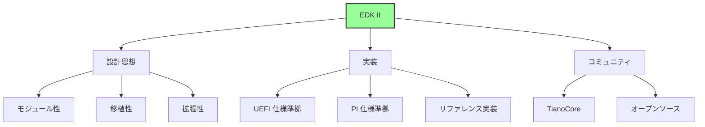

### TianoCore プロジェクト

TianoCore は、EDK II を中心とした UEFI ファームウェアのオープンソースプロジェクトです。TianoCore の目的は、UEFI/PI 仕様のリファレンス実装を提供し、ベンダー中立の開発基盤を構築することです。TianoCore プロジェクトには、EDK II だけでなく、関連するツールやパッケージも含まれています。

TianoCore プロジェクトの主要なコンポーネントは、四つあります。まず、EDK II は、コアフレームワークであり、UEFI ファームウェアの基盤となるコードベースです。MdePkg、MdeModulePkg、UefiCpuPkg など、多数のパッケージから構成されます。次に、OVMF (Open Virtual Machine Firmware) は、QEMU 用の UEFI ファームウェアです。OVMF を使用することで、仮想マシン上で UEFI ファームウェアを開発・テストできます。Part 0 で構築した開発環境も、OVMF を使用しています。ShellPkg は、UEFI シェルの実装です。UEFI シェルは、ファームウェア環境で動作するコマンドラインインターフェースであり、デバッグやテストに非常に有用です。最後に、Tools には、ビルドツール、検証ツール、ドキュメント生成ツールなどが含まれます。BaseTools は、EDK II のビルドシステムの中核であり、INF/DEC/DSC ファイルを処理してファームウェアイメージを生成します。

TianoCore の役割は、三つの側面から理解できます。まず、UEFI/PI 仕様のリファレンス実装として、仕様の解釈や実装方法を示します。次に、オープンソースコミュニティとして、世界中の開発者が協力してコードを改善します。最後に、ベンダー中立の開発基盤として、特定の企業に依存しない共通の基盤を提供します。この中立性により、異なるベンダーのプラットフォーム間でコードの再利用が可能になります。

**補足図**: 以下の図は、TianoCore プロジェクトの主要コンポーネントを示したものです。

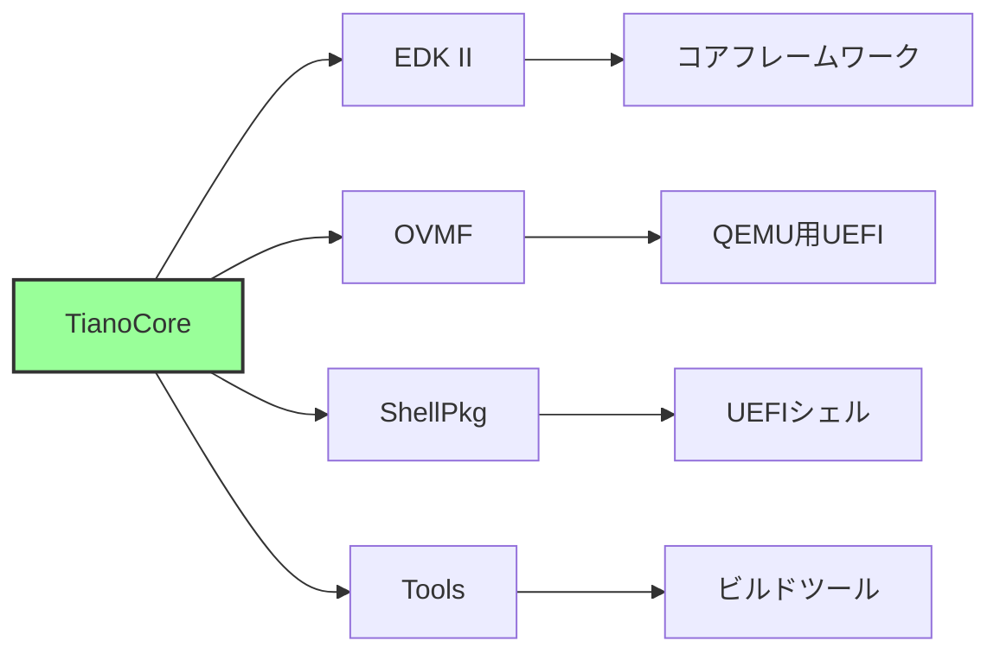

<div style="border: 2px solid #4a90e2; border-radius: 8px; padding: 10px 20px 20px 20px; margin: 20px 0;">

## 💡 コラム: TianoCore プロジェクトの誕生 - Intel によるオープンソース化の決断

**👥 コミュニティの話**

TianoCore プロジェクトの誕生は、2004年の Intel による大胆な決断から始まりました。当時、Intel は社内で「Tiano」というコードネームで呼ばれる次世代ファームウェアを開発していました。Tiano は、Intel EFI 仕様をベースにした完全な実装であり、Itanium プロセッサ向けに設計されていました。この Tiano を、Intel はオープンソース化するという前例のない決断を下したのです。なぜ Intel は、自社の重要な技術資産をオープンソースにしたのでしょうか。

第一の理由は、UEFI（当時は EFI）仕様の普及促進でした。Intel は、EFI 仕様を業界標準にしたいと考えていましたが、仕様書だけでは不十分でした。実装例がなければ、他のベンダーは仕様をどのように解釈し、実装すべきかわかりません。リファレンス実装を提供することで、仕様の意図を明確にし、採用のハードルを下げることができます。第二の理由は、エコシステムの構築です。ファームウェア開発は、CPU ベンダー（Intel、AMD）、チップセットベンダー、BIOS ベンダー（AMI、Insyde、Phoenix）、OEM メーカー（Dell、HP、Lenovo）という複数のプレイヤーが関わる複雑な領域です。共通の開発基盤を提供することで、これらのプレイヤーが協力しやすくなります。

2004年、Intel は「EFI Developer Kit（EDK）」を BSD ライセンスでオープンソース化しました。EDK は、SourceForge でホストされ、誰でもダウンロードして使用できるようになりました。しかし、初期の EDK には課題がありました。コードの構造が複雑で、プラットフォーム固有のコードと汎用コードが混在していました。ビルドシステムも複雑で、新しいプラットフォームへの移植が困難でした。また、ドキュメントが不足しており、学習曲線が急でした。

これらの課題を解決するため、Intel は2006年に「EDK II」を開始しました。EDK II は、EDK の完全な再設計であり、モジュール性と移植性を大幅に改善しました。EDK II の開発に合わせて、「TianoCore.org」というコミュニティサイトが立ち上げられました。TianoCore という名前は、Intel 社内のコードネーム「Tiano」に由来します。Tiano は、イタリアのルネサンス画家 Tiziano Vecellio（ティツィアーノ・ヴェチェッリオ）の英語名です。Intel の開発チームが、このプロジェクトに芸術的な名前を付けたのです。

TianoCore プロジェクトの初期メンバーは、Intel のエンジニアが中心でしたが、徐々に他の企業も参加するようになりました。AMD は、AMD64 アーキテクチャのサポートを追加し、AGESA の統合を進めました。ARM は、ARM64（AARCH64）アーキテクチャへの移植を行い、ARM サーバとモバイルデバイスのサポートを追加しました。Microsoft は、Windows との互換性テストを行い、Secure Boot の実装をレビューしました。Google は、Chromebook 向けの最適化を行い、coreboot との統合を改善しました。IBM、HP、Dell といったサーバメーカーも、エンタープライズ機能の追加に貢献しました。

2015年、TianoCore プロジェクトは GitHub に移行しました（https://github.com/tianocore/edk2）。これにより、開発プロセスが大幅に透明化され、コミュニティの参加が容易になりました。GitHub 移行前は、パッチの提出とレビューがメーリングリスト経由で行われており、追跡が困難でした。GitHub の Pull Request により、コードレビューが効率化され、新しいコントリビューターも参加しやすくなりました。現在、TianoCore には 300 名以上のコントリビューターがおり、毎月数十の Pull Request がマージされています。

TianoCore プロジェクトの成功は、オープンソースとビジネスの両立を示しています。Intel は、自社の競争力の源泉であるファームウェア技術をオープンソース化しましたが、それによって競争力を失うのではなく、むしろエコシステム全体の成長を促進しました。現在、AMI、Insyde、Phoenix といった商用 BIOS ベンダーは、すべて EDK II をベースにしています。彼らは、EDK II の共通基盤を利用しながら、独自の付加価値を提供することで差別化しています。また、coreboot や U-Boot といったオープンソースファームウェアも、EDK II のコンポーネントを活用しています。

TianoCore の開発モデルは、「ベンダー中立のガバナンス」という点でも興味深いものです。Intel が主導しているものの、重要な決定は「TianoCore Stewards」という委員会で行われます。Stewards には、Intel、AMD、ARM、HP、Insyde、Phoenix といった主要なベンダーが参加しており、仕様の解釈やコードの方向性について議論します。この民主的なガバナンスにより、特定のベンダーの利益だけでなく、エコシステム全体の利益が考慮されます。

TianoCore コミュニティは、年次イベント「UEFI Plugfest」を開催しています。Plugfest は、異なるベンダーのファームウェアと OS が相互運用できるかをテストするイベントです。Microsoft、Intel、AMD、ARM、Linux Foundation などが参加し、Secure Boot、Network Boot、ACPI テーブルといった機能の互換性を確認します。Plugfest での発見が、UEFI 仕様の改善や EDK II のバグ修正につながっています。

本章で学ぶ EDK II の設計思想（モジュール性、移植性、標準準拠）は、TianoCore コミュニティの20年にわたる集合知の結晶です。Intel が2004年にオープンソース化を決断したことで、世界中のエンジニアが協力してファームウェアを改善できるようになりました。本書で EDK II を学ぶということは、この巨大なコミュニティの一員となることを意味します。TianoCore のメーリングリストに質問を投稿すれば、世界中の専門家から回答が得られます。あなたがバグを発見すれば、Pull Request を送ることで、次のバージョンに反映されます。これこそが、オープンソースの力です。

**📚 参考資料**
- [TianoCore 公式サイト](https://www.tianocore.org/) - プロジェクトの歴史と構造
- [EDK II GitHub リポジトリ](https://github.com/tianocore/edk2) - 最新のコードベース
- [TianoCore メーリングリスト](https://edk2.groups.io/g/devel) - 開発者コミュニティ
- ["Intel's Open Source Firmware Evolution"](https://firmware.intel.com/) - Intel の公式ブログ

</div>

## EDK II の設計思想

### 核となる原則

EDK II の設計は、四つの核となる原則に基づいています。モジュール性 (Modularity)、移植性 (Portability)、再利用性 (Reusability)、標準準拠 (Standards Compliance) の四つです。これらの原則は、UEFI ファームウェアの複雑性を管理し、異なるプラットフォーム間でコードを共有し、長期的な保守性を確保するために採用されました。

モジュール性の原則は、各機能を独立したモジュールとして実装することを意味します。EDK II では、すべての機能がモジュールという単位で分割されており、各モジュールは明確に定義されたインターフェース（プロトコル）を通じて他のモジュールと通信します。依存関係は最小化され、モジュール間の結合度は低く保たれます。移植性の原則は、異なるアーキテクチャ（x86_64、ARM64、RISC-V など）で同じコードベースを使用できることを意味します。アーキテクチャ固有のコードは分離され、抽象化レイヤーを通じてアクセスされます。再利用性の原則は、共通コンポーネントを最大限に再利用し、プラットフォーム固有の部分のみを差し替えることを意味します。標準準拠の原則は、UEFI/PI 仕様に厳密に従い、仕様の変更に追従することを意味します。これらの四つの原則により、EDK II は柔軟で保守性の高いフレームワークとなっています。

**補足図**: 以下の図は、EDK II の四つの設計原則を示したものです。

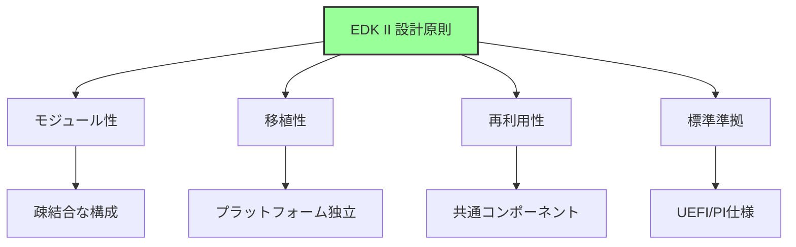

### 1. モジュール性 (Modularity)

モジュール性は、EDK II の最も重要な設計原則です。UEFI ファームウェアは、数百のモジュールから構成される大規模なソフトウェアシステムです。各モジュールは、特定の機能を担当し、明確に定義されたインターフェースを提供します。モジュール間の通信は、プロトコルという標準化されたインターフェースを通じて行われます。

EDK II のモジュール性の設計方針は、三つの柱から成ります。まず、各機能を独立したモジュールとして実装します。たとえば、USB ホストコントローラのドライバは、一つのモジュールとして実装され、USB デバイスドライバとは独立しています。次に、モジュール間は明確なインターフェース（プロトコル）で接続します。USB ホストコントローラは、USB2_HC_PROTOCOL というプロトコルを公開し、USB デバイスドライバはそのプロトコルを消費します。最後に、依存関係を最小化します。モジュールは、必要最小限のプロトコルのみに依存し、不要な依存関係を持ちません。

モジュール性のメリットは、実践的に大きな価値があります。まず、部分的な差し替えが容易です。あるモジュールに問題がある場合、そのモジュールだけを修正または差し替えることができます。次に、テストとデバッグが簡単です。モジュールが独立しているため、単体テストが容易であり、問題の切り分けもしやすくなります。並行開発が可能になるという点も重要です。異なるチームが異なるモジュールを同時に開発でき、開発効率が向上します。最後に、コードの再利用性が高くなります。汎用的なモジュールは、異なるプラットフォームで再利用できます。

### 2. 移植性 (Portability)

移植性は、EDK II が複数のアーキテクチャをサポートするための重要な原則です。EDK II は、x86_64、ARM64、RISC-V、IA-32 など、さまざまなアーキテクチャで動作します。移植性を実現するために、EDK II はアーキテクチャ独立層とアーキテクチャ依存層に明確に分離されています。

アーキテクチャ独立層には、共通コードが含まれます。DXE Dispatcher、プロトコル管理、Boot Services の大部分などは、アーキテクチャに依存せず、すべてのプラットフォームで共通のコードです。アーキテクチャ依存層には、CPU 固有のコード、割り込み処理、MMU 設定などが含まれます。たとえば、ページテーブルの構造は、x86_64 と ARM64 で大きく異なるため、アーキテクチャ依存層で実装されます。

移植性の実現方法は、三つのアプローチから成ります。まず、アーキテクチャ固有コードの分離です。CPU アーキテクチャに依存するコードは、特定のディレクトリに配置され、明確に分離されます。次に、抽象化レイヤーの提供です。アーキテクチャ依存層は、統一されたインターフェースを提供し、アーキテクチャ独立層はそのインターフェースを通じてアクセスします。最後に、条件付きコンパイルです。ビルド時にアーキテクチャを指定することで、適切なコードのみがコンパイルされます。この三つのアプローチにより、EDK II は高い移植性を実現しています。

**補足図**: 以下の図は、アーキテクチャ独立層と依存層の関係を示したものです。

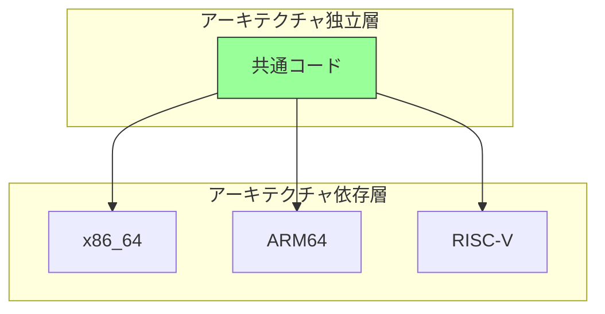

### 3. 再利用性 (Reusability)

再利用性は、開発効率とコード品質を向上させるための重要な原則です。EDK II は、レイヤー構造とライブラリ機構により、高い再利用性を実現しています。

EDK II のレイヤー構造は、四つの層に分かれています。Core レイヤーは、フレームワーク本体であり、DXE Core、PEI Core、UEFI Core などが含まれます。このレイヤーは、すべてのプラットフォームで共通であり、再利用性が最も高いです。Common Driver レイヤーは、汎用ドライバであり、USB、PCI、ネットワークなどの標準的なドライバが含まれます。このレイヤーも、多くのプラットフォームで再利用できます。Platform Driver レイヤーは、プラットフォーム固有のドライバであり、特定のチップセットや CPU に依存します。このレイヤーの再利用性は中程度です。Board Driver レイヤーは、ボード固有のドライバであり、特定のマザーボードに依存します。このレイヤーの再利用性は低いですが、プラットフォーム固有の要件を柔軟に実装できます。

ライブラリによる共通化も、再利用性の重要な手段です。EDK II では、共通処理をライブラリ化し、複数のモジュールから再利用します。たとえば、文字列操作、メモリ操作、デバッグ出力などは、標準ライブラリとして提供されます。プラットフォーム固有の実装が必要な場合は、ライブラリの実装を差し替えることができます。インターフェースが標準化されているため、実装を差し替えてもモジュールのコードは変更不要です。この設計により、共通コンポーネントの再利用と、プラットフォーム固有のカスタマイズが両立されます。

**参考表**: 以下の表は、EDK II のレイヤー構造と再利用性をまとめたものです。

| レイヤー | 説明 | 再利用性 |
|---------|------|---------|
| **Core** | フレームワーク本体 | 最高 |
| **Common Driver** | 汎用ドライバ | 高 |
| **Platform Driver** | プラットフォーム固有 | 中 |
| **Board Driver** | ボード固有 | 低 |

### 4. 標準準拠 (Standards Compliance)

標準準拠は、EDK II の重要な設計原則であり、互換性と相互運用性を保証します。EDK II は、複数の業界標準仕様に準拠しており、これらの仕様に忠実に従うことで、異なるベンダーのファームウェアやOSとの互換性を確保しています。

EDK II が準拠する主要な仕様は、四つあります。まず、UEFI Specification は、Boot Services と Runtime Services のインターフェースを定義します。EDK II は、UEFI 仕様で定義されたすべての関数とプロトコルを実装しており、UEFI 準拠の OS（Linux、Windows、BSD など）と互換性があります。次に、PI (Platform Initialization) Specification は、ファームウェア内部のアーキテクチャ（SEC、PEI、DXE、BDS フェーズ）とプロトコル定義を規定します。EDK II のコア設計は、PI 仕様に基づいています。ACPI (Advanced Configuration and Power Interface) Specification は、電源管理とデバイス記述のための標準です。EDK II は、ACPI テーブルを生成し、OS に提供します。最後に、その他の業界標準として、PCI、USB、SATA、NVMe などのデバイス仕様にも準拠しています。

標準準拠のメリットは、実践的に重要です。まず、互換性が保証されます。UEFI 仕様に準拠することで、すべての UEFI 対応 OS が動作します。次に、相互運用性が向上します。異なるベンダーのドライバやアプリケーションが、同じファームウェア上で動作できます。仕様の進化に追従できるという点も重要です。EDK II は、UEFI/PI 仕様の新しいバージョンがリリースされると、それに対応するコードを追加します。したがって、標準準拠により、EDK II は長期的に持続可能なファームウェアプラットフォームとなっています。

**補足図**: 以下の図は、EDK II が準拠する主要な仕様を示したものです。

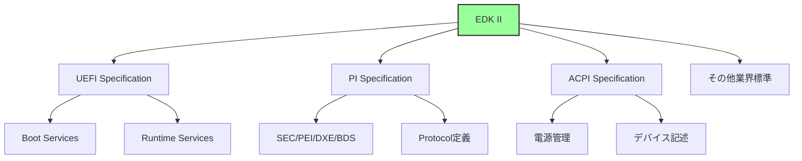

## EDK II アーキテクチャの全体像

### レイヤー構造

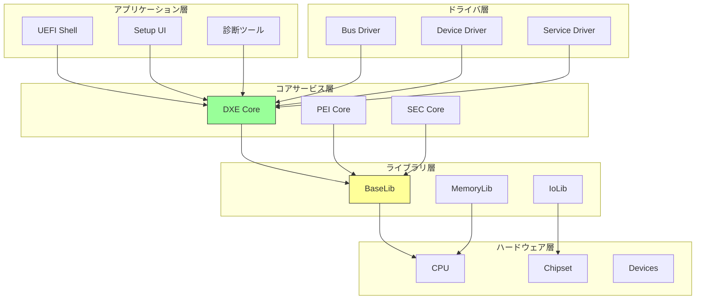

### コンポーネント構成

**1. Core コンポーネント**

| コンポーネント | 役割 | 場所 |
|--------------|------|------|
| **SEC Core** | CPU初期化、CAR設定 | `UefiCpuPkg/SecCore` |
| **PEI Core** | PEIM実行環境 | `MdeModulePkg/Core/Pei` |
| **DXE Core** | DXEドライバ実行環境 | `MdeModulePkg/Core/Dxe` |

**2. モジュールパッケージ (Pkg)**

```
EDK II ディレクトリ構造:
edk2/
├── MdePkg/           # 基本定義・ライブラリ
├── MdeModulePkg/     # 汎用モジュール
├── UefiCpuPkg/       # CPU関連
├── PcAtChipsetPkg/   # PC/AT互換チップセット
├── NetworkPkg/       # ネットワークスタック
├── CryptoPkg/        # 暗号化
└── ...
```

**MdePkg (Module Development Environment Package):**
- UEFI/PI 仕様の基本定義
- 基本ライブラリ
- プロトコル・GUID 定義

**MdeModulePkg:**
- DXE/PEI Core
- 汎用ドライバ（USB, Network, Disk等）
- Boot Device Selection

### プロトコルベースアーキテクチャ

**プロトコルの役割:**

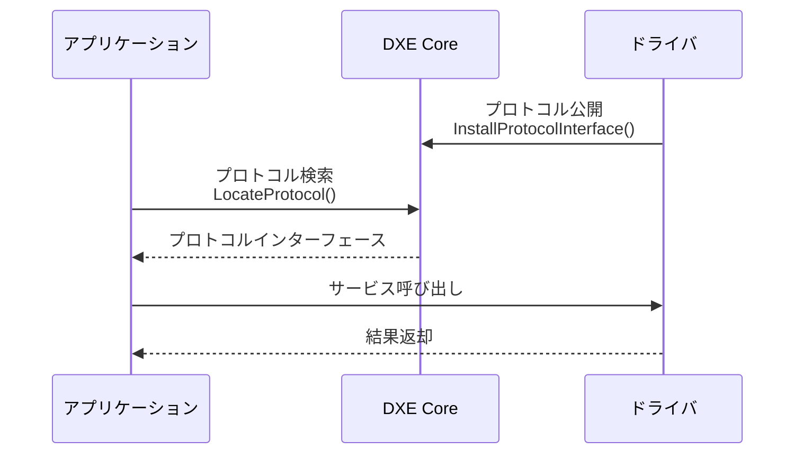

**プロトコルによる疎結合:**
- ドライバとアプリは直接依存しない
- インターフェースのみに依存
- 実装の差し替えが容易

## モジュール構造

### EDK II モジュールの種類

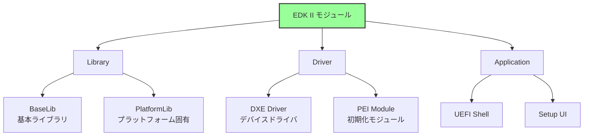

### モジュールの構成要素

**標準ファイル構成:**

```
MyModule/
├── MyModule.inf      # モジュール記述ファイル
├── MyModule.c        # ソースコード
├── MyModule.h        # ヘッダ
└── MyModule.uni      # 多言語文字列（オプション）
```

**INF ファイル（モジュール記述）の構造:**

```ini
[Defines]
  INF_VERSION    = 0x00010005
  BASE_NAME      = MyModule
  MODULE_TYPE    = DXE_DRIVER
  ENTRY_POINT    = MyModuleEntry

[Sources]
  MyModule.c

[Packages]
  MdePkg/MdePkg.dec

[LibraryClasses]
  UefiDriverEntryPoint
  UefiBootServicesTableLib

[Protocols]
  gEfiSimpleTextOutProtocolGuid

[Depex]
  gEfiSimpleTextOutProtocolGuid
```

**主要セクション:**

| セクション | 役割 | 内容 |
|----------|------|------|
| `[Defines]` | 基本情報 | モジュール名、タイプ、エントリポイント |
| `[Sources]` | ソースファイル | コンパイル対象 |
| `[Packages]` | 依存パッケージ | DEC ファイルの指定 |
| `[LibraryClasses]` | ライブラリ依存 | 使用するライブラリ |
| `[Protocols]` | プロトコル依存 | 使用するプロトコル |
| `[Depex]` | 依存関係 | ロード条件 |

### パッケージ (Package)

**DEC ファイル (Package Declaration):**

```ini
[Defines]
  DEC_SPECIFICATION = 0x00010005
  PACKAGE_NAME      = MyPkg
  PACKAGE_GUID      = ...

[Includes]
  Include

[LibraryClasses]
  MyLib|Include/Library/MyLib.h

[Protocols]
  gMyProtocolGuid = { 0x12345678, ... }

[Guids]
  gMyGuid = { 0xabcdef00, ... }
```

**パッケージの役割:**
- 関連モジュールのグループ化
- 共通の GUID・プロトコル定義
- インクルードパス管理

### プラットフォーム記述 (DSC/FDF)

**DSC ファイル (Platform Description):**

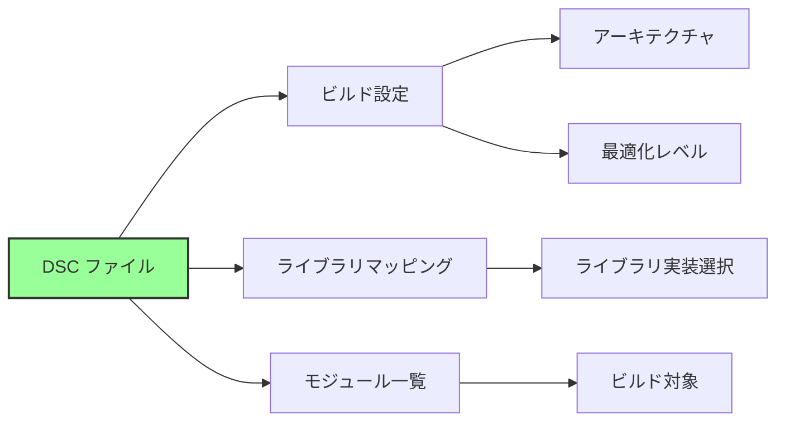

**FDF ファイル (Flash Description):**
- ファームウェアボリューム (FV) 定義
- フラッシュレイアウト
- 各 FV に含めるモジュール指定

## ビルドシステムの仕組み

### ビルドフロー

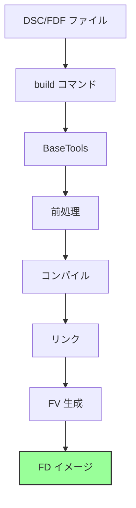

**各ステップの役割:**

1. **前処理**
   - INF/DEC/DSC 解析
   - 依存関係解決
   - マクロ展開

2. **コンパイル**
   - ソースコード → オブジェクトファイル
   - アーキテクチャ別コンパイラ使用

3. **リンク**
   - オブジェクトファイル → EFI 実行ファイル (.efi)
   - ライブラリリンク

4. **FV 生成**
   - 複数の .efi を Firmware Volume にパック
   - 圧縮・暗号化（オプション）

5. **FD イメージ**
   - 複数の FV を統合
   - フラッシュイメージ生成

### BaseTools の構成

```
BaseTools/
├── Source/
│   ├── C/              # C実装ツール
│   │   ├── GenFv/      # FV生成
│   │   ├── GenFw/      # FWイメージ生成
│   │   └── ...
│   └── Python/         # Python実装ツール
│       ├── build/      # ビルドエンジン
│       └── ...
└── Conf/
    ├── tools_def.txt   # ツールチェーン定義
    └── target.txt      # ビルドターゲット
```

**主要ツール:**

| ツール | 役割 |
|--------|------|
| `build` | ビルドオーケストレーター |
| `GenFv` | Firmware Volume 生成 |
| `GenFw` | PE/COFF → EFI 変換 |
| `GenFds` | Flash Device Image 生成 |

## ライブラリアーキテクチャ

### ライブラリクラスとインスタンス

**概念:**

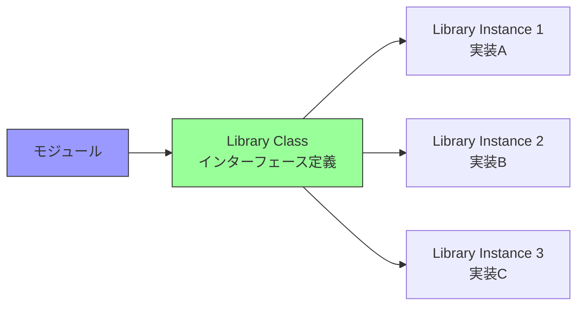

**ライブラリクラス:**
- インターフェースの定義（関数プロトタイプ）
- .h ファイルで宣言

**ライブラリインスタンス:**
- 実装の提供
- 同じインターフェースの複数実装が可能

**例: DebugLib**

```
Library Class: DebugLib
  ├── Instance 1: BaseDebugLibNull (何もしない)
  ├── Instance 2: BaseDebugLibSerialPort (シリアル出力)
  └── Instance 3: UefiDebugLibConOut (コンソール出力)
```

### ライブラリマッピング

**DSC ファイルでのマッピング:**

```ini
[LibraryClasses]
  # デフォルトマッピング
  DebugLib|MdePkg/Library/BaseDebugLibSerialPort/BaseDebugLibSerialPort.inf

[LibraryClasses.common.DXE_DRIVER]
  # DXE ドライバ用マッピング
  DebugLib|MdePkg/Library/UefiDebugLibConOut/UefiDebugLibConOut.inf
```

**メリット:**
- ビルド時にライブラリ実装を切り替え
- デバッグ版とリリース版で異なる実装を使用
- プラットフォーム固有実装の差し替え

## プロトコルとドライバモデル

### UEFI Driver Model

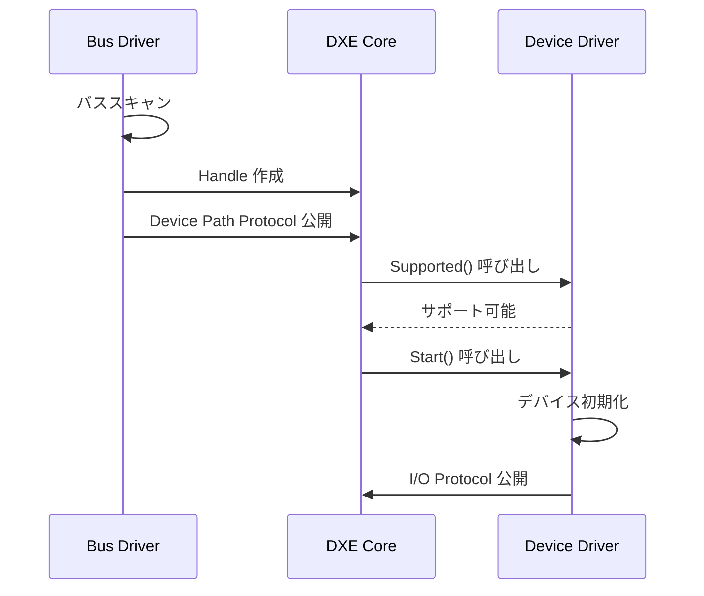

**3つのプロトコル:**

| プロトコル | 役割 |
|----------|------|
| `Supported()` | デバイス対応確認 |
| `Start()` | ドライバ起動 |
| `Stop()` | ドライバ停止 |

**設計思想:**
- バスドライバとデバイスドライバの分離
- プロトコルによる疎結合
- 動的な接続・切断

### プロトコルデータベース

**DXE Core が管理:**

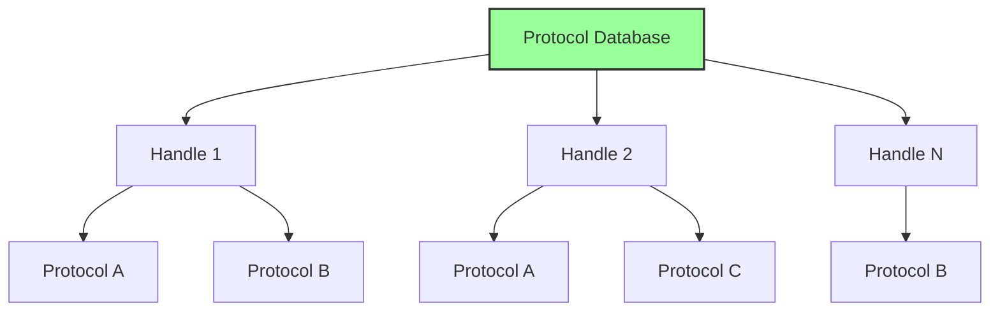

**操作:**
- `InstallProtocolInterface()`: プロトコル登録
- `LocateProtocol()`: プロトコル検索
- `OpenProtocol()`: プロトコル使用開始
- `CloseProtocol()`: プロトコル使用終了

## 設計パターン

### 1. レイヤードアーキテクチャ

```
Application Layer
    ↓ (Protocol)
Driver Layer
    ↓ (Protocol)
Core Services Layer
    ↓ (Library)
Hardware Abstraction Layer
    ↓
Hardware
```

**利点:**
- 各層の独立性
- テストの容易性
- 段階的な移植

### 2. プラグインアーキテクチャ

**DXE Dispatcher による動的ロード:**
- ファームウェアボリュームからドライバ検索
- 依存関係に基づく実行順序決定
- プロトコル公開による機能拡張

### 3. 抽象ファクトリーパターン

**ライブラリクラス/インスタンス:**
- インターフェース（抽象ファクトリー）
- 複数の実装（具象ファクトリー）
- ビルド時の選択

## なぜこの設計なのか

### 設計上の課題

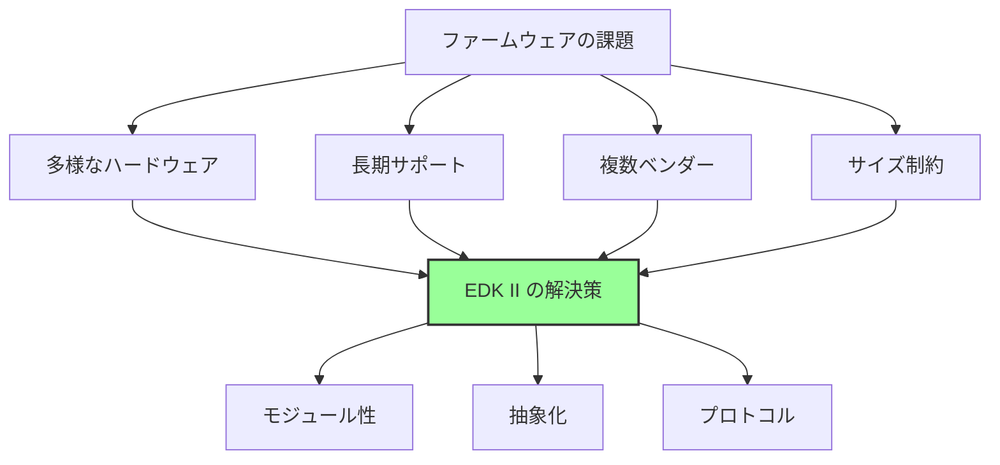

### 解決策

**1. 多様なハードウェア対応**
- ライブラリによる抽象化
- プラットフォーム固有コードの分離
- ドライバモデルによる拡張性

**2. 長期サポート**
- モジュール単位での更新
- 後方互換性の維持
- 標準仕様への準拠

**3. 複数ベンダーの協業**
- 明確なインターフェース定義
- オープンソース開発
- 独立したモジュール開発

**4. サイズ制約**
- 必要なモジュールのみビルド
- ライブラリの選択的リンク
- 圧縮技術の活用

## まとめ

この章では、EDK II の設計思想とアーキテクチャの全体像を説明しました。EDK II は、UEFI ファームウェアのリファレンス実装であり、TianoCore プロジェクトの中核を成すフレームワークです。EDK II を理解することは、UEFI ファームウェア開発の実践的なスキルを習得することを意味します。

EDK II の設計は、四つの核となる原則に基づいています。モジュール性により、各機能が独立したモジュールとして実装され、疎結合な構成が実現されています。移植性により、異なるアーキテクチャ（x86_64、ARM64、RISC-V など）で同じコードベースを使用できます。再利用性により、共通コンポーネントを最大限に再利用し、プラットフォーム固有の部分のみを差し替えることができます。標準準拠により、UEFI/PI 仕様に忠実に従い、互換性と相互運用性が保証されています。これらの四つの原則により、EDK II は柔軟で保守性の高いフレームワークとなっています。

EDK II のアーキテクチャは、三つの主要なコンポーネントから構成されます。コアサービスには、SEC Core、PEI Core、DXE Core が含まれ、各ブートフェーズの基盤を提供します。ドライバは、プロトコルベースのアーキテクチャを採用し、疎結合なインターフェースを通じて通信します。ライブラリは、クラスとインスタンスの分離により、実装の柔軟な差し替えを可能にします。

EDK II の主要コンポーネントは、明確に定義されたファイル形式で記述されます。モジュールは、INF ファイルで記述され、各モジュールの依存関係と構成が定義されます。パッケージは、DEC ファイルで定義され、複数のモジュールをグループ化します。プラットフォームは、DSC (Platform Description) と FDF (Flash Description) ファイルで構成され、ファームウェアイメージ全体を定義します。ライブラリは、クラスとインスタンスの分離により、共通インターフェースと実装の柔軟性を両立します。プロトコルは、疎結合なインターフェースとして、モジュール間の通信を可能にします。

EDK II のビルドシステムは、BaseTools によってオーケストレーションされます。BaseTools は、DSC と FDF ファイルを解析し、依存関係を解決し、ファームウェアイメージを生成します。ライブラリマッピングの柔軟性により、プラットフォームごとに異なるライブラリ実装を選択できます。このビルドシステムにより、複雑なファームウェアプロジェクトを効率的に管理できます。

**補足図**: 以下の図は、EDK II のアーキテクチャ全体像を示したものです。

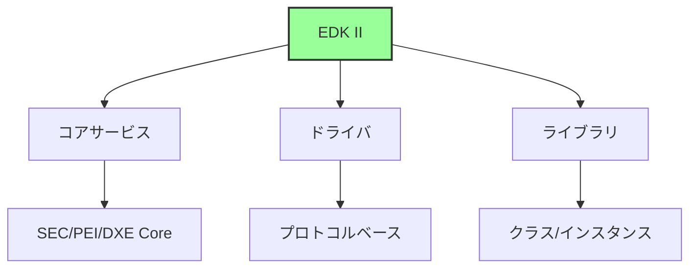

---

**次章では、モジュール構造とビルドシステムの詳細を見ていきます。**

📚 **参考資料**
- [EDK II Module Writer's Guide](https://tianocore-docs.github.io/edk2-ModuleWriteGuide/)
- [EDK II Build Specification](https://tianocore-docs.github.io/edk2-BuildSpecification/)
- [EDK II DEC Specification](https://tianocore-docs.github.io/edk2-DecSpecification/)
- [EDK II INF Specification](https://tianocore-docs.github.io/edk2-InfSpecification/)
- [TianoCore EDK II](https://github.com/tianocore/edk2)
