# EDK II の設計思想と全体構成

🎯 **この章で学ぶこと**
- EDK II フレームワークの設計思想
- アーキテクチャの全体像
- TianoCore プロジェクトの位置づけ
- なぜこのような設計なのか

📚 **前提知識**
- UEFI ブートフェーズ（Part I）
- ファームウェアエコシステム（Part 0）

---

## EDK II とは

### 概要

**EDK II (EFI Developer Kit II)** は、UEFI ファームウェアの**リファレンス実装**です。

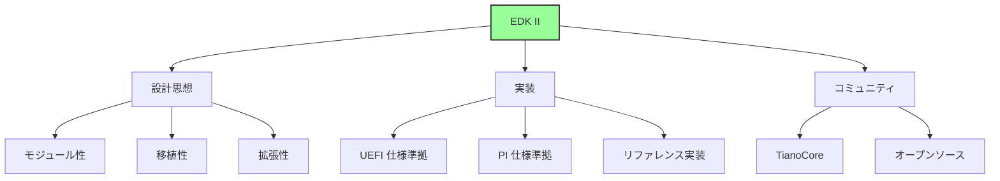

**位置づけ:**
- **UEFI/PI 仕様**: 標準規格（What）
- **EDK II**: リファレンス実装（How）
- **製品ファームウェア**: EDK II をベースにしたカスタマイズ

### TianoCore プロジェクト

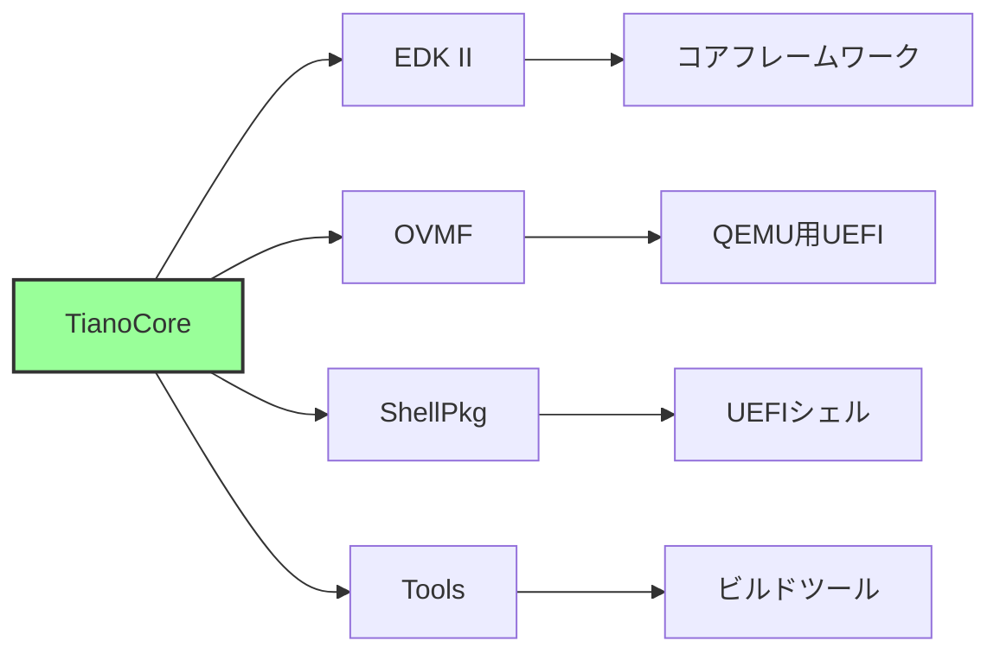

**TianoCore の役割:**
- UEFI/PI 仕様のリファレンス実装
- オープンソースコミュニティ
- ベンダー中立の開発基盤

## EDK II の設計思想

### 核となる原則

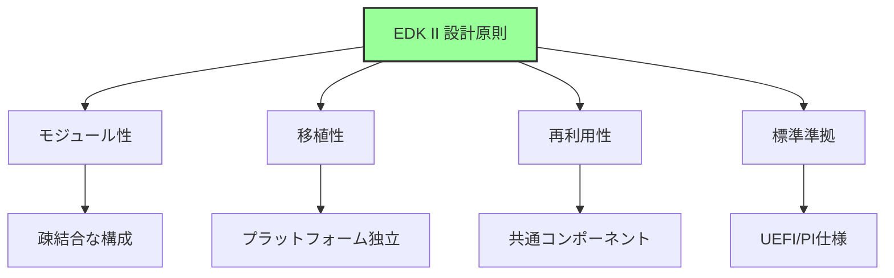

### 1. モジュール性 (Modularity)

**設計方針:**
- 各機能を独立したモジュールとして実装
- モジュール間は明確なインターフェース（プロトコル）で接続
- 依存関係を最小化

**メリット:**
```
- 部分的な差し替えが容易
- テストとデバッグが簡単
- 並行開発が可能
- コードの再利用性が高い
```

### 2. 移植性 (Portability)

**アーキテクチャ抽象化:**

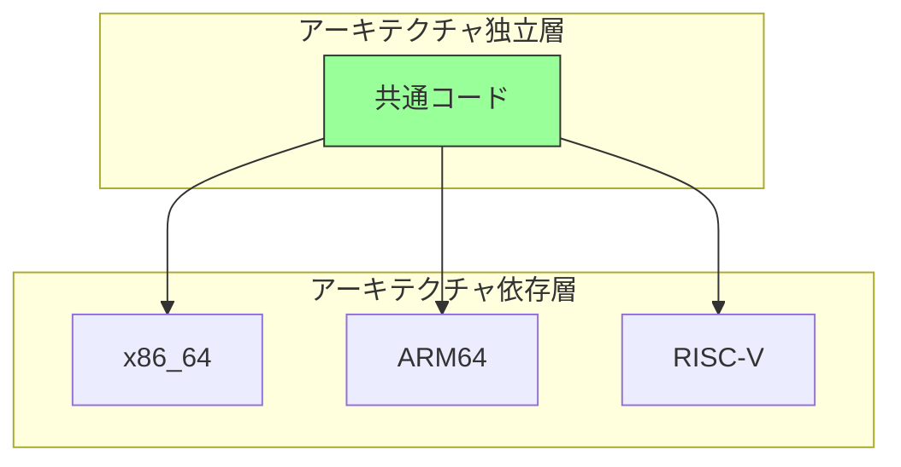

**実現方法:**
- アーキテクチャ固有コードの分離
- 抽象化レイヤーの提供
- 条件付きコンパイル

### 3. 再利用性 (Reusability)

**レイヤー構造:**

| レイヤー | 説明 | 再利用性 |
|---------|------|---------|
| **Core** | フレームワーク本体 | 最高 |
| **Common Driver** | 汎用ドライバ | 高 |
| **Platform Driver** | プラットフォーム固有 | 中 |
| **Board Driver** | ボード固有 | 低 |

**ライブラリによる共通化:**
- 共通処理をライブラリ化
- プラットフォーム固有実装は差し替え可能
- インターフェースの標準化

### 4. 標準準拠 (Standards Compliance)

**準拠する仕様:**

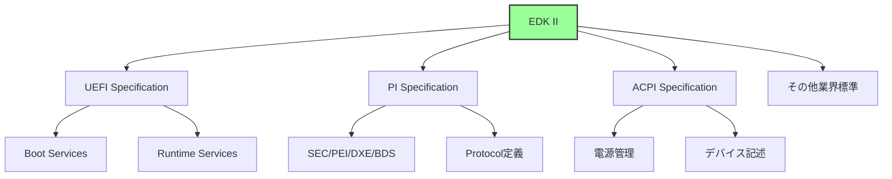

## EDK II アーキテクチャの全体像

### レイヤー構造

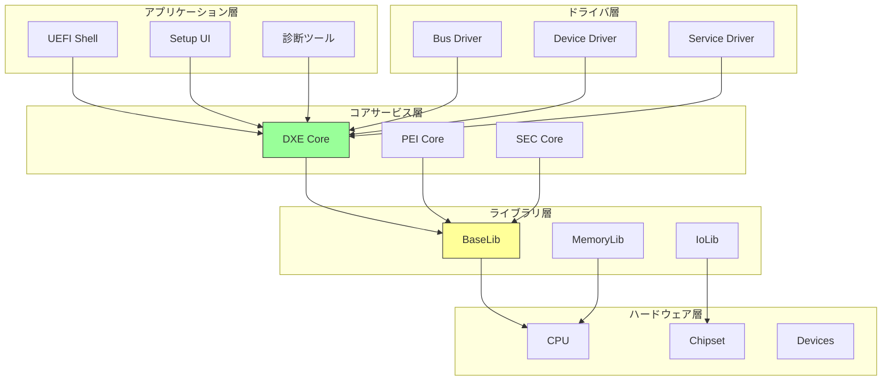

### コンポーネント構成

**1. Core コンポーネント**

| コンポーネント | 役割 | 場所 |
|--------------|------|------|
| **SEC Core** | CPU初期化、CAR設定 | `UefiCpuPkg/SecCore` |
| **PEI Core** | PEIM実行環境 | `MdeModulePkg/Core/Pei` |
| **DXE Core** | DXEドライバ実行環境 | `MdeModulePkg/Core/Dxe` |

**2. モジュールパッケージ (Pkg)**

```
EDK II ディレクトリ構造:
edk2/
├── MdePkg/           # 基本定義・ライブラリ
├── MdeModulePkg/     # 汎用モジュール
├── UefiCpuPkg/       # CPU関連
├── PcAtChipsetPkg/   # PC/AT互換チップセット
├── NetworkPkg/       # ネットワークスタック
├── CryptoPkg/        # 暗号化
└── ...
```

**MdePkg (Module Development Environment Package):**
- UEFI/PI 仕様の基本定義
- 基本ライブラリ
- プロトコル・GUID 定義

**MdeModulePkg:**
- DXE/PEI Core
- 汎用ドライバ（USB, Network, Disk等）
- Boot Device Selection

### プロトコルベースアーキテクチャ

**プロトコルの役割:**

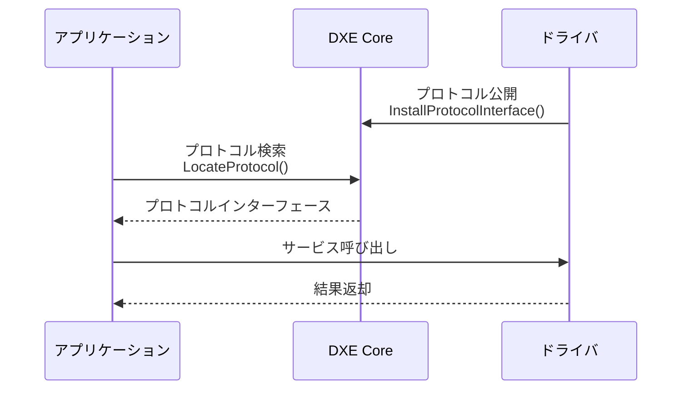

**プロトコルによる疎結合:**
- ドライバとアプリは直接依存しない
- インターフェースのみに依存
- 実装の差し替えが容易

## モジュール構造

### EDK II モジュールの種類

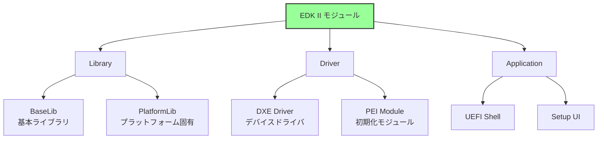

### モジュールの構成要素

**標準ファイル構成:**

```
MyModule/
├── MyModule.inf      # モジュール記述ファイル
├── MyModule.c        # ソースコード
├── MyModule.h        # ヘッダ
└── MyModule.uni      # 多言語文字列（オプション）
```

**INF ファイル（モジュール記述）の構造:**

```ini
[Defines]
  INF_VERSION    = 0x00010005
  BASE_NAME      = MyModule
  MODULE_TYPE    = DXE_DRIVER
  ENTRY_POINT    = MyModuleEntry

[Sources]
  MyModule.c

[Packages]
  MdePkg/MdePkg.dec

[LibraryClasses]
  UefiDriverEntryPoint
  UefiBootServicesTableLib

[Protocols]
  gEfiSimpleTextOutProtocolGuid

[Depex]
  gEfiSimpleTextOutProtocolGuid
```

**主要セクション:**

| セクション | 役割 | 内容 |
|----------|------|------|
| `[Defines]` | 基本情報 | モジュール名、タイプ、エントリポイント |
| `[Sources]` | ソースファイル | コンパイル対象 |
| `[Packages]` | 依存パッケージ | DEC ファイルの指定 |
| `[LibraryClasses]` | ライブラリ依存 | 使用するライブラリ |
| `[Protocols]` | プロトコル依存 | 使用するプロトコル |
| `[Depex]` | 依存関係 | ロード条件 |

### パッケージ (Package)

**DEC ファイル (Package Declaration):**

```ini
[Defines]
  DEC_SPECIFICATION = 0x00010005
  PACKAGE_NAME      = MyPkg
  PACKAGE_GUID      = ...

[Includes]
  Include

[LibraryClasses]
  MyLib|Include/Library/MyLib.h

[Protocols]
  gMyProtocolGuid = { 0x12345678, ... }

[Guids]
  gMyGuid = { 0xabcdef00, ... }
```

**パッケージの役割:**
- 関連モジュールのグループ化
- 共通の GUID・プロトコル定義
- インクルードパス管理

### プラットフォーム記述 (DSC/FDF)

**DSC ファイル (Platform Description):**

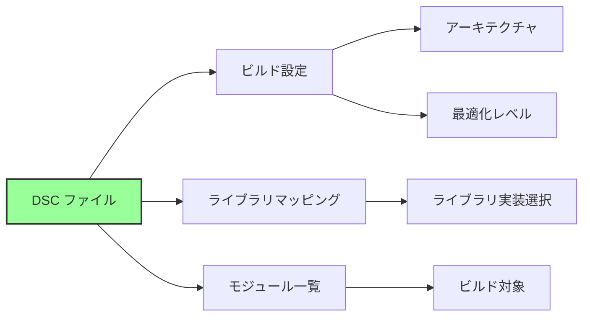

**FDF ファイル (Flash Description):**
- ファームウェアボリューム (FV) 定義
- フラッシュレイアウト
- 各 FV に含めるモジュール指定

## ビルドシステムの仕組み

### ビルドフロー

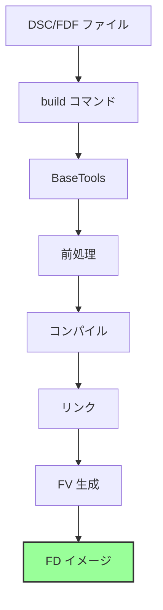

**各ステップの役割:**

1. **前処理**
   - INF/DEC/DSC 解析
   - 依存関係解決
   - マクロ展開

2. **コンパイル**
   - ソースコード → オブジェクトファイル
   - アーキテクチャ別コンパイラ使用

3. **リンク**
   - オブジェクトファイル → EFI 実行ファイル (.efi)
   - ライブラリリンク

4. **FV 生成**
   - 複数の .efi を Firmware Volume にパック
   - 圧縮・暗号化（オプション）

5. **FD イメージ**
   - 複数の FV を統合
   - フラッシュイメージ生成

### BaseTools の構成

```
BaseTools/
├── Source/
│   ├── C/              # C実装ツール
│   │   ├── GenFv/      # FV生成
│   │   ├── GenFw/      # FWイメージ生成
│   │   └── ...
│   └── Python/         # Python実装ツール
│       ├── build/      # ビルドエンジン
│       └── ...
└── Conf/
    ├── tools_def.txt   # ツールチェーン定義
    └── target.txt      # ビルドターゲット
```

**主要ツール:**

| ツール | 役割 |
|--------|------|
| `build` | ビルドオーケストレーター |
| `GenFv` | Firmware Volume 生成 |
| `GenFw` | PE/COFF → EFI 変換 |
| `GenFds` | Flash Device Image 生成 |

## ライブラリアーキテクチャ

### ライブラリクラスとインスタンス

**概念:**

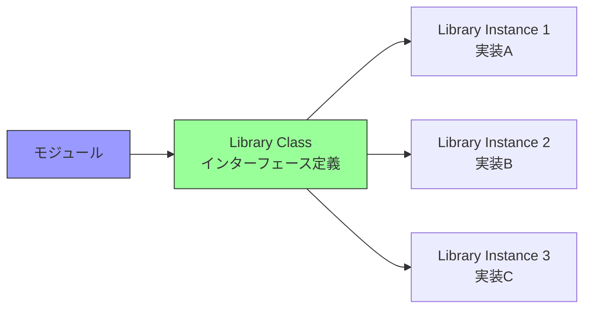

**ライブラリクラス:**
- インターフェースの定義（関数プロトタイプ）
- .h ファイルで宣言

**ライブラリインスタンス:**
- 実装の提供
- 同じインターフェースの複数実装が可能

**例: DebugLib**

```
Library Class: DebugLib
  ├── Instance 1: BaseDebugLibNull (何もしない)
  ├── Instance 2: BaseDebugLibSerialPort (シリアル出力)
  └── Instance 3: UefiDebugLibConOut (コンソール出力)
```

### ライブラリマッピング

**DSC ファイルでのマッピング:**

```ini
[LibraryClasses]
  # デフォルトマッピング
  DebugLib|MdePkg/Library/BaseDebugLibSerialPort/BaseDebugLibSerialPort.inf

[LibraryClasses.common.DXE_DRIVER]
  # DXE ドライバ用マッピング
  DebugLib|MdePkg/Library/UefiDebugLibConOut/UefiDebugLibConOut.inf
```

**メリット:**
- ビルド時にライブラリ実装を切り替え
- デバッグ版とリリース版で異なる実装を使用
- プラットフォーム固有実装の差し替え

## プロトコルとドライバモデル

### UEFI Driver Model

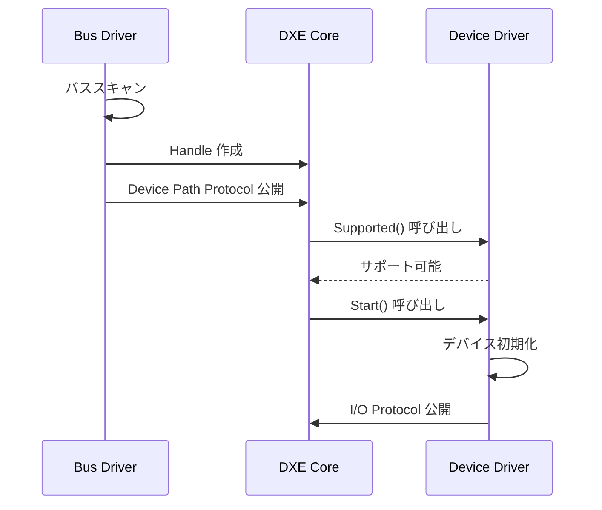

**3つのプロトコル:**

| プロトコル | 役割 |
|----------|------|
| `Supported()` | デバイス対応確認 |
| `Start()` | ドライバ起動 |
| `Stop()` | ドライバ停止 |

**設計思想:**
- バスドライバとデバイスドライバの分離
- プロトコルによる疎結合
- 動的な接続・切断

### プロトコルデータベース

**DXE Core が管理:**

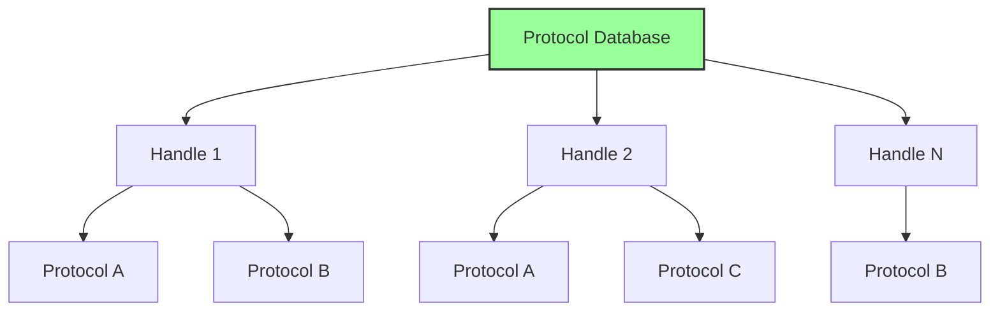

**操作:**
- `InstallProtocolInterface()`: プロトコル登録
- `LocateProtocol()`: プロトコル検索
- `OpenProtocol()`: プロトコル使用開始
- `CloseProtocol()`: プロトコル使用終了

## 設計パターン

### 1. レイヤードアーキテクチャ

```
Application Layer
    ↓ (Protocol)
Driver Layer
    ↓ (Protocol)
Core Services Layer
    ↓ (Library)
Hardware Abstraction Layer
    ↓
Hardware
```

**利点:**
- 各層の独立性
- テストの容易性
- 段階的な移植

### 2. プラグインアーキテクチャ

**DXE Dispatcher による動的ロード:**
- ファームウェアボリュームからドライバ検索
- 依存関係に基づく実行順序決定
- プロトコル公開による機能拡張

### 3. 抽象ファクトリーパターン

**ライブラリクラス/インスタンス:**
- インターフェース（抽象ファクトリー）
- 複数の実装（具象ファクトリー）
- ビルド時の選択

## なぜこの設計なのか

### 設計上の課題

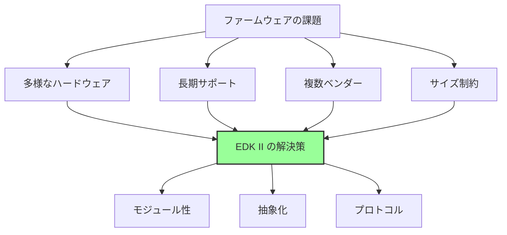

### 解決策

**1. 多様なハードウェア対応**
- ライブラリによる抽象化
- プラットフォーム固有コードの分離
- ドライバモデルによる拡張性

**2. 長期サポート**
- モジュール単位での更新
- 後方互換性の維持
- 標準仕様への準拠

**3. 複数ベンダーの協業**
- 明確なインターフェース定義
- オープンソース開発
- 独立したモジュール開発

**4. サイズ制約**
- 必要なモジュールのみビルド
- ライブラリの選択的リンク
- 圧縮技術の活用

## まとめ

この章では、EDK II の設計思想とアーキテクチャを説明しました。

**重要なポイント:**

**設計原則:**
- **モジュール性**: 疎結合な構成
- **移植性**: アーキテクチャ独立
- **再利用性**: 共通コンポーネント
- **標準準拠**: UEFI/PI 仕様

**アーキテクチャ:**

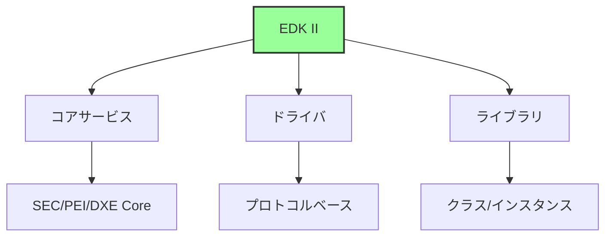

**主要コンポーネント:**
- **モジュール**: INF ファイルで記述
- **パッケージ**: DEC ファイルで定義
- **プラットフォーム**: DSC/FDF ファイルで構成
- **ライブラリ**: クラス/インスタンスの分離
- **プロトコル**: 疎結合なインターフェース

**ビルドシステム:**
- BaseTools によるオーケストレーション
- DSC/FDF からファームウェアイメージ生成
- ライブラリマッピングの柔軟性

---

**次章では、モジュール構造とビルドシステムの詳細を見ていきます。**

📚 **参考資料**
- [EDK II Module Writer's Guide](https://tianocore-docs.github.io/edk2-ModuleWriteGuide/)
- [EDK II Build Specification](https://tianocore-docs.github.io/edk2-BuildSpecification/)
- [EDK II DEC Specification](https://tianocore-docs.github.io/edk2-DecSpecification/)
- [EDK II INF Specification](https://tianocore-docs.github.io/edk2-InfSpecification/)
- [TianoCore EDK II](https://github.com/tianocore/edk2)
