# モジュール構造とビルドシステム

🎯 **この章で学ぶこと**
- EDK II モジュールの詳細構造
- INF/DEC/DSC/FDF ファイルの役割
- ビルドシステムの内部機構
- 依存関係解決の仕組み

📚 **前提知識**
- EDK II の設計思想（前章）
- UEFI ブートフェーズ（Part I）

---

## EDK II モジュールの構造

### モジュールとは

**モジュール**は、EDK II における**最小の実行単位**です。

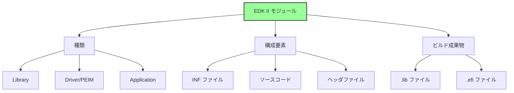

### モジュールの種類

**1. ライブラリ (Library)**
- 他のモジュールから使用される共通機能
- 単独では実行されない
- ビルド成果物: `.lib` (静的リンク)

**2. ドライバ/PEIM (Driver/PEIM)**
- ハードウェアやサービスを提供
- Dispatcher により実行される
- ビルド成果物: `.efi` (PE/COFF)

**3. アプリケーション (Application)**
- UEFI Shell 等から実行
- ユーザーが明示的に起動
- ビルド成果物: `.efi` (PE/COFF)

### モジュールのライフサイクル

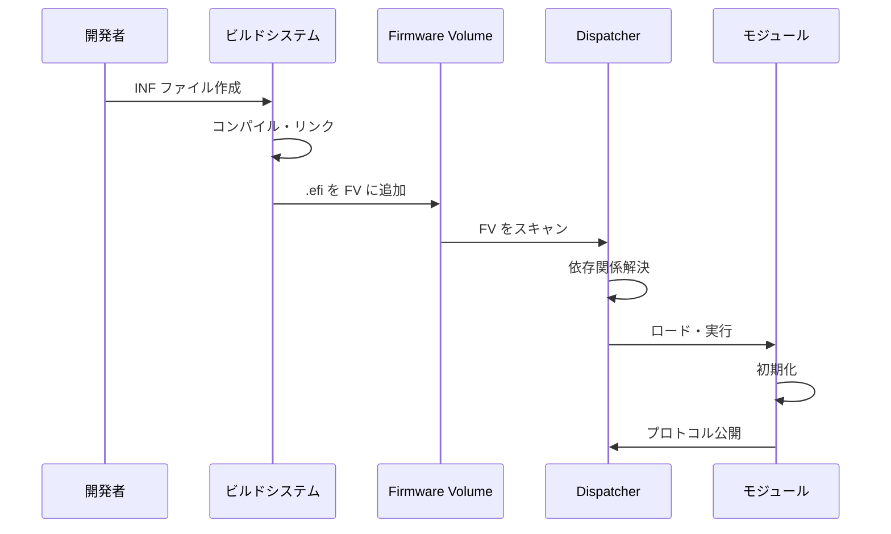

## INF ファイル (モジュール記述)

### INF ファイルの役割

**INF (Information) ファイル**は、モジュールの**メタデータ**を定義します。

```mermaid
graph LR
    A[INF ファイル] --> B[モジュール基本情報]
    A --> C[ビルド設定]
    A --> D[依存関係]

    B --> B1[名前・GUID]
    B --> B2[モジュールタイプ]
    B --> B3[エントリポイント]

    C --> C1[ソースファイル]
    C --> C2[ライブラリクラス]

    D --> D1[パッケージ依存]
    D --> D2[プロトコル依存]
    D --> D3[実行依存 (Depex)]

    style A fill:#9f9,stroke:#333,stroke-width:2px
```

### INF ファイルの構造

**標準的な INF ファイル:**

```ini
## @file
#  モジュールの説明
##

[Defines]
  INF_VERSION                    = 0x00010005
  BASE_NAME                      = MyDriver
  FILE_GUID                      = 12345678-1234-1234-1234-123456789abc
  MODULE_TYPE                    = DXE_DRIVER
  VERSION_STRING                 = 1.0
  ENTRY_POINT                    = MyDriverEntryPoint

[Sources]
  MyDriver.c
  MyDriver.h
  Helper.c

[Packages]
  MdePkg/MdePkg.dec
  MdeModulePkg/MdeModulePkg.dec

[LibraryClasses]
  UefiDriverEntryPoint
  UefiBootServicesTableLib
  MemoryAllocationLib
  DebugLib

[Protocols]
  gEfiSimpleTextOutProtocolGuid     ## CONSUMES
  gEfiBlockIoProtocolGuid           ## PRODUCES

[Guids]
  gEfiFileInfoGuid

[Pcd]
  gEfiMdePkgTokenSpaceGuid.PcdDebugPrintErrorLevel

[Depex]
  gEfiSimpleTextOutProtocolGuid
```

### 主要セクションの詳細

**1. [Defines] セクション**

| 項目 | 説明 | 必須 |
|------|------|------|
| `INF_VERSION` | INF 仕様バージョン | ✓ |
| `BASE_NAME` | モジュール名 | ✓ |
| `FILE_GUID` | モジュール固有 GUID | ✓ |
| `MODULE_TYPE` | モジュールタイプ | ✓ |
| `ENTRY_POINT` | エントリポイント関数名 | Driver/App のみ |
| `CONSTRUCTOR` | コンストラクタ関数名 | Library のみ |
| `DESTRUCTOR` | デストラクタ関数名 | オプション |

**モジュールタイプ:**

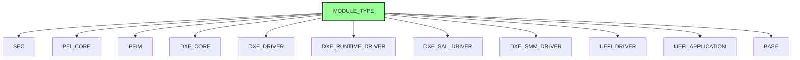

**2. [Sources] セクション**

```ini
[Sources]
  # 共通ソース
  MyDriver.c
  Common.c

[Sources.IA32]
  # IA32 専用
  Ia32/Asm.nasm

[Sources.X64]
  # X64 専用
  X64/Asm.nasm

[Sources.ARM]
  # ARM 専用
  Arm/Asm.S
```

**アーキテクチャ別ソース:**
- 共通コードと分離
- 条件付きコンパイル不要
- ビルド時に自動選択

**3. [Packages] セクション**

```ini
[Packages]
  MdePkg/MdePkg.dec              # 必須（基本定義）
  MdeModulePkg/MdeModulePkg.dec  # 汎用モジュール
  MyPkg/MyPkg.dec                # カスタムパッケージ
```

**役割:**
- DEC ファイルの参照
- インクルードパス追加
- GUID/プロトコル定義の取得

**4. [LibraryClasses] セクション**

```ini
[LibraryClasses]
  UefiDriverEntryPoint    # ドライバエントリポイント
  UefiLib                 # UEFI 基本ライブラリ
  DebugLib                # デバッグ出力
  BaseMemoryLib           # メモリ操作
```

**ライブラリクラスの解決:**
- INF: ライブラリクラス名を指定
- DSC: クラス → インスタンスのマッピング
- ビルド時にリンク

**5. [Protocols]/[Guids]/[Pcd] セクション**

```ini
[Protocols]
  gEfiSimpleTextOutProtocolGuid  ## CONSUMES  # 使用する
  gEfiBlockIoProtocolGuid        ## PRODUCES  # 提供する
  gEfiDiskIoProtocolGuid         ## TO_START  # 起動に必要

[Guids]
  gEfiFileSystemInfoGuid         ## CONSUMES

[Pcd]
  gEfiMdePkgTokenSpaceGuid.PcdMaximumAsciiStringLength  ## CONSUMES
```

**使用方法の注釈:**

| 注釈 | 意味 |
|------|------|
| `CONSUMES` | 使用する |
| `PRODUCES` | 提供する |
| `TO_START` | 起動に必要 |
| `BY_START` | 起動時に使用 |
| `NOTIFY` | 通知を受ける |

**6. [Depex] セクション**

```ini
# 単一プロトコル依存
[Depex]
  gEfiPciRootBridgeIoProtocolGuid

# 複数プロトコル依存（AND条件）
[Depex]
  gEfiPciRootBridgeIoProtocolGuid AND
  gEfiSimpleTextOutProtocolGuid

# 複雑な依存関係
[Depex]
  (gEfiPciRootBridgeIoProtocolGuid AND gEfiDxeServicesTableGuid) OR
  gEfiS3SaveStateProtocolGuid
```

**依存関係の種類:**
- `AND`: すべて必要
- `OR`: いずれか必要
- `NOT`: 存在しない場合のみ
- `BEFORE`: 指定モジュールより前に実行
- `AFTER`: 指定モジュールより後に実行
- `TRUE`: 常に満たされる
- `FALSE`: 常に満たされない

### Depex (依存関係式) の仕組み

**評価プロセス:**

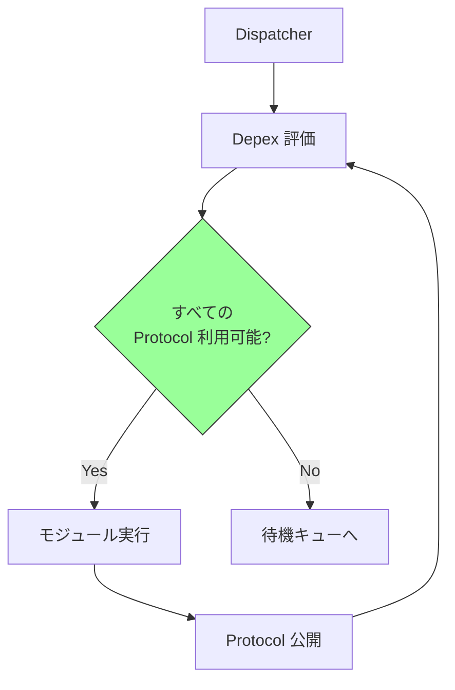

**Depex の用途:**
- **ロード順序制御**: 必要なプロトコルが利用可能になってから実行
- **依存関係の明示化**: ドキュメントとしても機能
- **デバッグ支援**: ロード失敗の原因特定

## DEC ファイル (パッケージ宣言)

### DEC ファイルの役割

**DEC (Declaration) ファイル**は、パッケージの**公開インターフェース**を定義します。

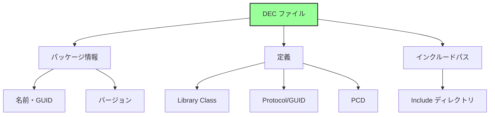

### DEC ファイルの構造

```ini
## @file
#  パッケージの説明
##

[Defines]
  DEC_SPECIFICATION              = 0x00010005
  PACKAGE_NAME                   = MyPkg
  PACKAGE_GUID                   = abcdef00-1234-5678-9abc-def012345678
  PACKAGE_VERSION                = 1.0

[Includes]
  Include

[LibraryClasses]
  ##  @libraryclass  モジュール開発用ライブラリ
  MyLib|Include/Library/MyLib.h

  ##  @libraryclass  プラットフォーム初期化ライブラリ
  PlatformInitLib|Include/Library/PlatformInitLib.h

[Protocols]
  ## MyProtocol の GUID
  # {12345678-1234-1234-1234-123456789abc}
  gMyProtocolGuid = { 0x12345678, 0x1234, 0x1234, \
    { 0x12, 0x34, 0x12, 0x34, 0x56, 0x78, 0x9a, 0xbc }}

[Guids]
  ## パッケージの Token Space GUID
  # {abcdef00-1234-5678-9abc-def012345678}
  gMyPkgTokenSpaceGuid = { 0xabcdef00, 0x1234, 0x5678, \
    { 0x9a, 0xbc, 0xde, 0xf0, 0x12, 0x34, 0x56, 0x78 }}

[PcdsFixedAtBuild, PcdsPatchableInModule, PcdsDynamic, PcdsDynamicEx]
  ## デバッグレベル
  # @Prompt Debug Print Level
  gMyPkgTokenSpaceGuid.PcdDebugLevel|0x80000000|UINT32|0x00000001
```

### GUID の管理

**GUID (Globally Unique Identifier):**

```c
typedef struct {
  UINT32  Data1;
  UINT16  Data2;
  UINT16  Data3;
  UINT8   Data4[8];
} EFI_GUID;
```

**GUID の生成:**
```bash
# Linux/macOS
uuidgen

# Windows
powershell -Command "[guid]::NewGuid()"

# Python
python -c "import uuid; print(uuid.uuid4())"
```

**GUID の用途:**

| 用途 | 説明 |
|------|------|
| Protocol GUID | プロトコルの識別 |
| File GUID | モジュールの識別 |
| Package GUID | パッケージの識別 |
| Token Space GUID | PCD 名前空間 |
| Event GUID | イベントグループ |

### PCD (Platform Configuration Database)

**PCD の種類:**

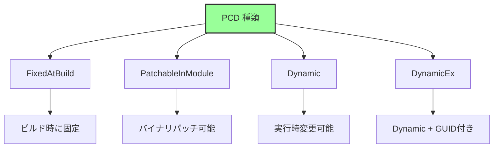

**PCD の定義:**

```ini
[PcdsFixedAtBuild]
  # ビルド時固定
  gMyPkgTokenSpaceGuid.PcdMaxBufferSize|1024|UINT32|0x00000001

[PcdsDynamic]
  # 実行時変更可能
  gMyPkgTokenSpaceGuid.PcdBootTimeout|5|UINT32|0x00000002
```

**PCD の使用:**

```c
// コード内での使用
UINT32 MaxSize = PcdGet32 (PcdMaxBufferSize);
PcdSet32 (PcdBootTimeout, 10);
```

## DSC ファイル (プラットフォーム記述)

### DSC ファイルの役割

**DSC (Description) ファイル**は、**プラットフォーム全体のビルド設定**を定義します。

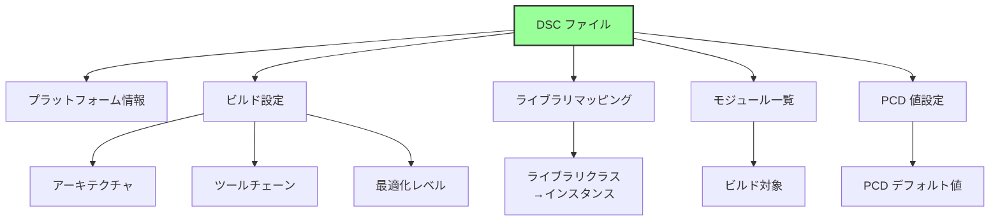

### DSC ファイルの構造

```ini
[Defines]
  PLATFORM_NAME                  = MyPlatform
  PLATFORM_GUID                  = fedcba98-7654-3210-fedc-ba9876543210
  PLATFORM_VERSION               = 1.0
  DSC_SPECIFICATION              = 0x00010005
  OUTPUT_DIRECTORY               = Build/MyPlatform
  SUPPORTED_ARCHITECTURES        = IA32|X64
  BUILD_TARGETS                  = DEBUG|RELEASE
  SKUID_IDENTIFIER               = DEFAULT

[LibraryClasses]
  # グローバルマッピング（すべてのモジュール）
  BaseLib|MdePkg/Library/BaseLib/BaseLib.inf
  DebugLib|MdePkg/Library/BaseDebugLibSerialPort/BaseDebugLibSerialPort.inf

[LibraryClasses.common.DXE_DRIVER]
  # DXE ドライバ専用マッピング
  MemoryAllocationLib|MdeModulePkg/Library/UefiMemoryAllocationLib/UefiMemoryAllocationLib.inf

[LibraryClasses.X64]
  # X64 専用マッピング
  RegisterFilterLib|MdePkg/Library/RegisterFilterLibNull/RegisterFilterLibNull.inf

[PcdsFixedAtBuild]
  gEfiMdePkgTokenSpaceGuid.PcdDebugPrintErrorLevel|0x80000042

[PcdsDynamicDefault]
  gEfiMdeModulePkgTokenSpaceGuid.PcdConOutRow|25
  gEfiMdeModulePkgTokenSpaceGuid.PcdConOutColumn|80

[Components]
  MdeModulePkg/Core/Dxe/DxeMain.inf
  MdeModulePkg/Universal/PCD/Dxe/Pcd.inf
  MyPkg/MyDriver/MyDriver.inf {
    <LibraryClasses>
      # このモジュール専用のライブラリマッピング
      DebugLib|MdePkg/Library/UefiDebugLibConOut/UefiDebugLibConOut.inf
  }
```

### ライブラリマッピングの優先順位

**優先順位（高→低）:**

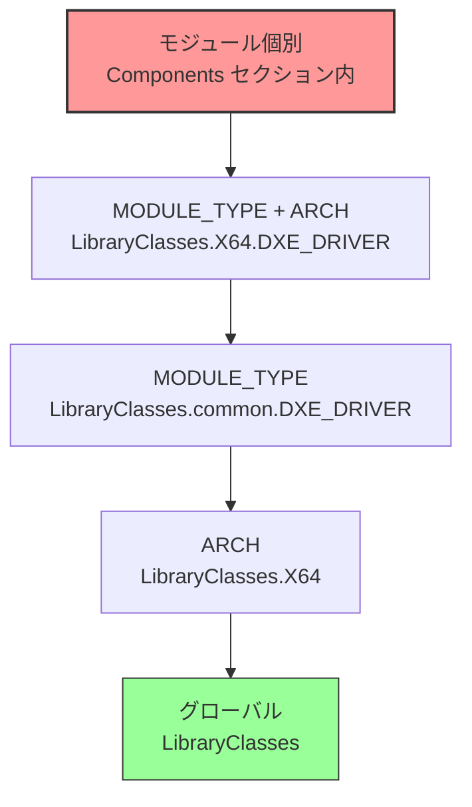

**例:**

```ini
[LibraryClasses]
  DebugLib|MdePkg/Library/BaseDebugLibNull/BaseDebugLibNull.inf  # 1. グローバル

[LibraryClasses.X64]
  DebugLib|MdePkg/Library/BaseDebugLibSerialPort/BaseDebugLibSerialPort.inf  # 2. X64 用

[LibraryClasses.common.DXE_DRIVER]
  DebugLib|MdePkg/Library/UefiDebugLibConOut/UefiDebugLibConOut.inf  # 3. DXE Driver 用

[Components]
  MyPkg/MyDriver/MyDriver.inf {
    <LibraryClasses>
      DebugLib|MyPkg/Library/MyDebugLib/MyDebugLib.inf  # 4. 個別モジュール用（最優先）
  }
```

### Components セクション

**モジュール指定の詳細:**

```ini
[Components.X64]
  # 基本形
  MdeModulePkg/Core/Dxe/DxeMain.inf

  # ライブラリオーバーライド
  MyPkg/MyDriver/MyDriver.inf {
    <LibraryClasses>
      DebugLib|MdePkg/Library/UefiDebugLibConOut/UefiDebugLibConOut.inf
  }

  # PCD オーバーライド
  MyPkg/AnotherDriver/AnotherDriver.inf {
    <PcdsFixedAtBuild>
      gMyPkgTokenSpaceGuid.PcdMaxBufferSize|2048
  }

  # BuildOptions オーバーライド
  MyPkg/OptimizedDriver/OptimizedDriver.inf {
    <BuildOptions>
      GCC:*_*_*_CC_FLAGS = -O3
  }
```

## FDF ファイル (フラッシュレイアウト)

### FDF ファイルの役割

**FDF (Flash Device) ファイル**は、**ファームウェアイメージのレイアウト**を定義します。

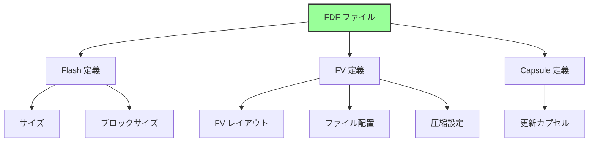

### FDF ファイルの構造

```ini
[Defines]
  DEFINE FLASH_BASE       = 0xFF000000
  DEFINE FLASH_SIZE       = 0x01000000  # 16MB
  DEFINE BLOCK_SIZE       = 0x10000     # 64KB

[FD.MyPlatform]
  BaseAddress   = $(FLASH_BASE)
  Size          = $(FLASH_SIZE)
  ErasePolarity = 1
  BlockSize     = $(BLOCK_SIZE)
  NumBlocks     = $(FLASH_SIZE) / $(BLOCK_SIZE)

  # Flash レイアウト
  0x00000000|0x00100000  # 1MB
  gMyPlatformPkgTokenSpaceGuid.PcdFlashNvStorageVariableBase|gMyPlatformPkgTokenSpaceGuid.PcdFlashNvStorageVariableSize
  DATA = {
    # NVRAM 領域
  }

  0x00100000|0x00F00000  # 15MB
  FV = FVMAIN_COMPACT

[FV.FVMAIN_COMPACT]
  FvAlignment        = 16
  ERASE_POLARITY     = 1
  MEMORY_MAPPED      = TRUE
  STICKY_WRITE       = TRUE
  LOCK_CAP           = TRUE
  LOCK_STATUS        = TRUE
  WRITE_DISABLED_CAP = TRUE
  WRITE_ENABLED_CAP  = TRUE
  WRITE_STATUS       = TRUE
  WRITE_LOCK_CAP     = TRUE
  WRITE_LOCK_STATUS  = TRUE
  READ_DISABLED_CAP  = TRUE
  READ_ENABLED_CAP   = TRUE
  READ_STATUS        = TRUE
  READ_LOCK_CAP      = TRUE
  READ_LOCK_STATUS   = TRUE

  # SEC Phase
  INF  UefiCpuPkg/SecCore/SecCore.inf

  # PEI Phase
  INF  MdeModulePkg/Core/Pei/PeiMain.inf
  INF  MdeModulePkg/Universal/PCD/Pei/Pcd.inf
  INF  MyPkg/MemoryInit/MemoryInit.inf

  # DXE Phase (圧縮FV)
  FILE FV_IMAGE = 9E21FD93-9C72-4c15-8C4B-E77F1DB2D792 {
    SECTION GUIDED EE4E5898-3914-4259-9D6E-DC7BD79403CF PROCESSING_REQUIRED = TRUE {
      SECTION FV_IMAGE = FVMAIN
    }
  }

[FV.FVMAIN]
  FvAlignment        = 16

  # DXE Core
  INF  MdeModulePkg/Core/Dxe/DxeMain.inf

  # Drivers
  INF  MdeModulePkg/Universal/PCD/Dxe/Pcd.inf
  INF  MyPkg/MyDriver/MyDriver.inf

[Capsule.MyUpdate]
  CAPSULE_GUID                = 6DCBD5ED-E82D-4C44-BD  A1-7194199AD92A
  CAPSULE_FLAGS               = PersistAcrossReset,InitiateReset

  FV = FVMAIN_COMPACT
```

### Firmware Volume (FV) の仕組み

**FV の構造:**

```
Firmware Volume:
┌─────────────────────┐
│ FV Header           │ ← メタデータ
├─────────────────────┤
│ File 1 (SEC)        │
├─────────────────────┤
│ File 2 (PEI Core)   │
├─────────────────────┤
│ File 3 (PEIM)       │
├─────────────────────┤
│ ...                 │
├─────────────────────┤
│ File N (DXE)        │
└─────────────────────┘
```

**ファイルタイプ:**

| タイプ | 説明 |
|--------|------|
| `RAW` | 生データ |
| `FREEFORM` | 任意形式 |
| `SECURITY_CORE` | SEC Core |
| `PEI_CORE` | PEI Core |
| `DXE_CORE` | DXE Core |
| `PEIM` | PEIM |
| `DRIVER` | DXE Driver |
| `COMBINED_PEIM_DRIVER` | PEI+DXE |
| `APPLICATION` | UEFI Application |
| `FV_IMAGE` | 入れ子 FV |

### 圧縮と暗号化

**GUIDED セクション:**

```ini
FILE FV_IMAGE = ... {
  SECTION GUIDED <GUID> PROCESSING_REQUIRED = TRUE {
    # 圧縮された FV
    SECTION FV_IMAGE = FVMAIN
  }
}
```

**標準 GUID:**

| GUID | 処理 |
|------|------|
| `EE4E5898-3914-4259-9D6E-DC7BD79403CF` | LZMA 圧縮 |
| `A31280AD-481E-41B6-95E8-127F4C984779` | TIANO 圧縮 |
| `FC1BCDB0-7D31-49AA-936A-A4600D9DD083` | CRC32 |

**圧縮の目的:**
- フラッシュサイズ削減
- ブート時間短縮（解凍は高速）
- コスト削減

## ビルドシステムの内部動作

### ビルドプロセス全体

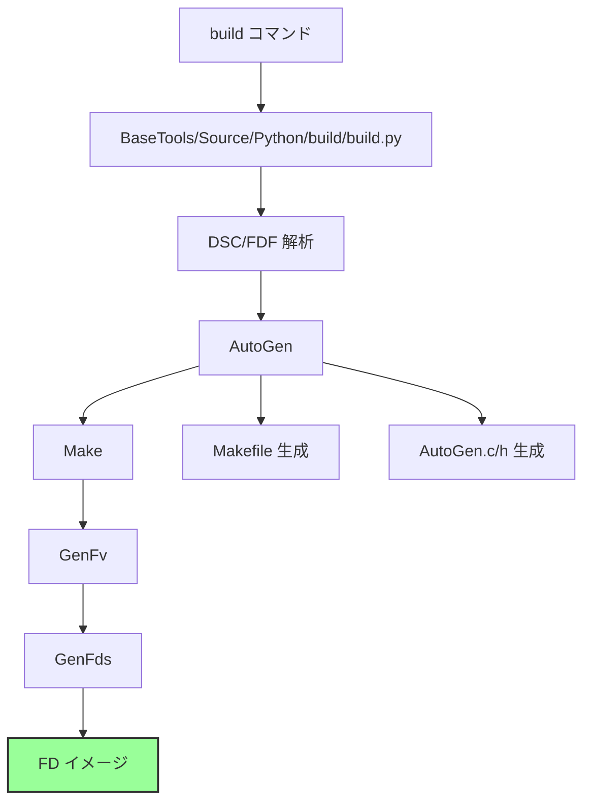

### AutoGen (自動生成)

**AutoGen の役割:**

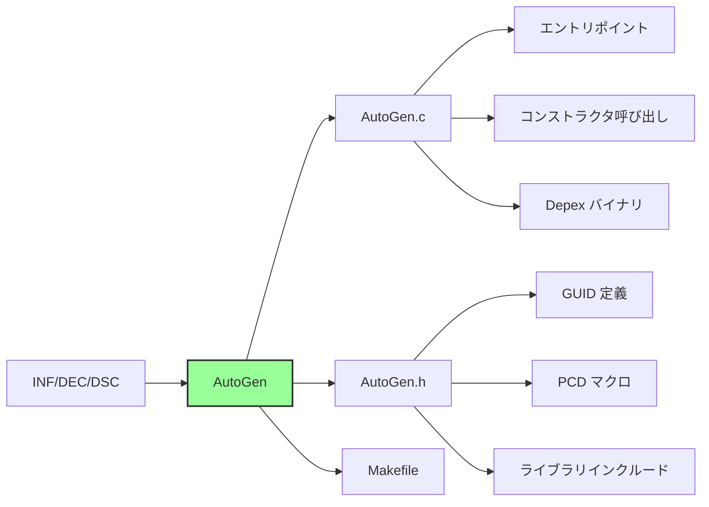

**生成される AutoGen.c の例:**

```c
// AutoGen.c (概念)
#include <AutoGen.h>

// ライブラリコンストラクタ呼び出し
EFI_STATUS
EFIAPI
ProcessLibraryConstructorList (
  IN EFI_HANDLE        ImageHandle,
  IN EFI_SYSTEM_TABLE  *SystemTable
  )
{
  EFI_STATUS  Status;

  Status = BaseLibConstructor ();
  if (EFI_ERROR (Status)) {
    return Status;
  }

  // ... 他のコンストラクタ
  return EFI_SUCCESS;
}

// エントリポイント（ユーザー関数を呼び出し）
EFI_STATUS
EFIAPI
_ModuleEntryPoint (
  IN EFI_HANDLE        ImageHandle,
  IN EFI_SYSTEM_TABLE  *SystemTable
  )
{
  EFI_STATUS  Status;

  ProcessLibraryConstructorList (ImageHandle, SystemTable);

  Status = MyDriverEntryPoint (ImageHandle, SystemTable);  // ユーザー定義

  ProcessLibraryDestructorList (ImageHandle, SystemTable);

  return Status;
}
```

### 依存関係解決

**ビルド時依存:**

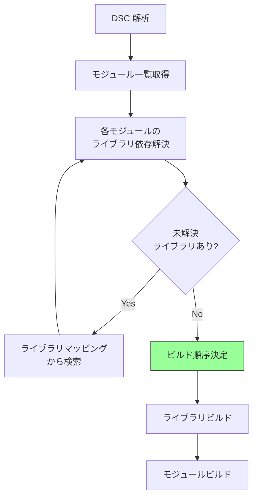

**実行時依存 (Depex):**

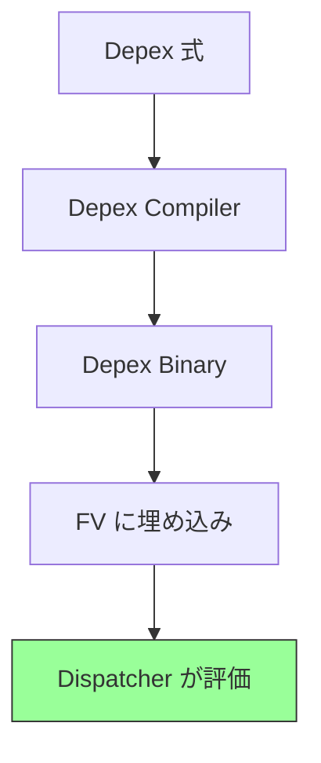

**Depex バイナリ形式:**

```
Depex Binary:
- Opcode: PUSH (protocol GUID)
- Opcode: AND
- Opcode: PUSH (protocol GUID)
- Opcode: OR
- Opcode: END
```

### GenFv/GenFds (FV/FD 生成)

**GenFv の処理:**

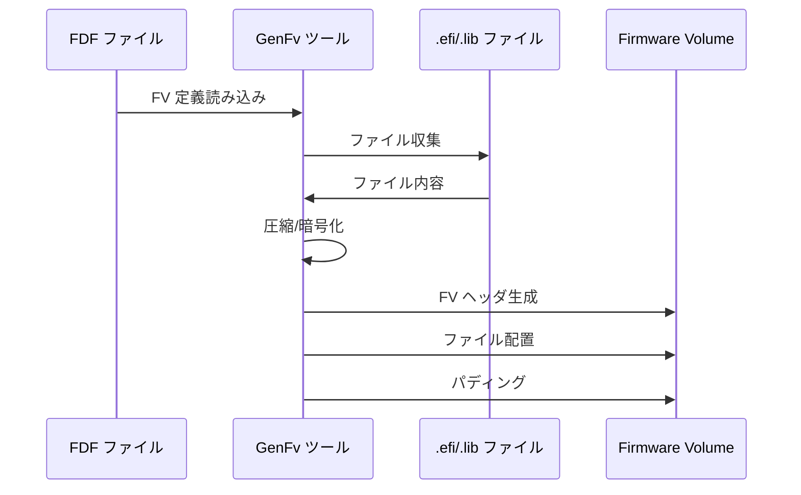

**GenFds の処理:**

```
GenFds:
1. FDF 解析
2. 各 FV を GenFv で生成
3. FD レイアウトに従って配置
4. 最終 .fd イメージ生成
```

## ビルドコマンド

### 基本的な使い方

```bash
# 標準ビルド
build -a X64 -t GCC5 -p MyPkg/MyPlatform.dsc

# リリースビルド
build -a X64 -t GCC5 -p MyPkg/MyPlatform.dsc -b RELEASE

# クリーンビルド
build -a X64 -t GCC5 -p MyPkg/MyPlatform.dsc cleanall
```

**オプション:**

| オプション | 説明 |
|----------|------|
| `-a ARCH` | アーキテクチャ (IA32, X64, ARM, AARCH64) |
| `-t TOOL` | ツールチェーン (GCC5, VS2019, CLANG38) |
| `-p DSC` | プラットフォーム DSC ファイル |
| `-b TARGET` | ビルドターゲット (DEBUG, RELEASE) |
| `-m INF` | 単一モジュールビルド |
| `-n NUM` | 並列ビルド数 |

### ビルド成果物

**出力ディレクトリ構造:**

```
Build/MyPlatform/
├── DEBUG_GCC5/
│   ├── X64/
│   │   ├── MyPkg/
│   │   │   └── MyDriver/
│   │   │       ├── MyDriver/
│   │   │       │   ├── OUTPUT/
│   │   │       │   │   ├── MyDriver.efi     # 最終成果物
│   │   │       │   │   ├── MyDriver.lib
│   │   │       │   │   └── ...
│   │   │       │   ├── DEBUG/
│   │   │       │   │   ├── AutoGen.c
│   │   │       │   │   ├── AutoGen.h
│   │   │       │   │   └── ...
│   │   │       │   └── Makefile
│   ├── FV/
│   │   ├── FVMAIN.fv                        # Firmware Volume
│   │   └── ...
│   └── FD/
│       └── MyPlatform.fd                     # Flash Device イメージ
└── BuildLog.txt
```

## まとめ

この章では、EDK II のモジュール構造とビルドシステムを説明しました。

**重要なポイント:**

**ファイルの役割:**

| ファイル | 役割 | スコープ |
|---------|------|---------|
| **INF** | モジュール記述 | 1モジュール |
| **DEC** | パッケージ宣言 | 1パッケージ |
| **DSC** | プラットフォーム記述 | プラットフォーム全体 |
| **FDF** | フラッシュレイアウト | ファームウェアイメージ |

**ビルドフロー:**


**依存関係:**
- **ビルド時**: ライブラリ依存 (DSC で解決)
- **実行時**: プロトコル依存 (Depex で制御)

**重要な仕組み:**
- **ライブラリマッピング**: クラス → インスタンスの柔軟な対応付け
- **Depex**: 実行順序の動的制御
- **AutoGen**: ボイラープレートコードの自動生成
- **FV/FD**: 階層的なファームウェアイメージ構築

---

**次章では、プロトコルとドライバモデルの詳細を見ていきます。**

📚 **参考資料**
- [EDK II Build Specification](https://tianocore-docs.github.io/edk2-BuildSpecification/)
- [EDK II INF Specification](https://tianocore-docs.github.io/edk2-InfSpecification/)
- [EDK II DEC Specification](https://tianocore-docs.github.io/edk2-DecSpecification/)
- [EDK II FDF Specification](https://tianocore-docs.github.io/edk2-FdfSpecification/)
- [BaseTools User Guide](https://github.com/tianocore/tianocore.github.io/wiki/BaseTools)
