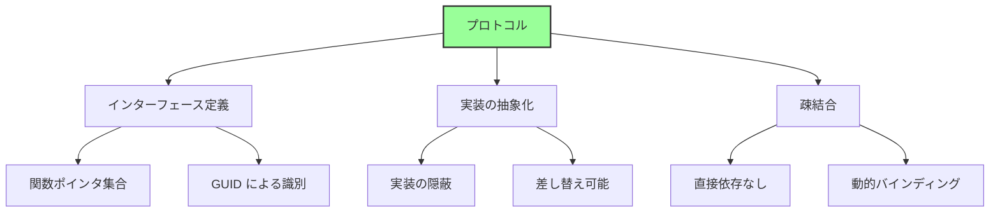
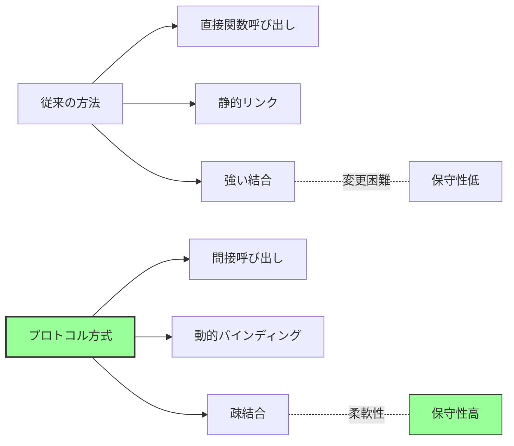
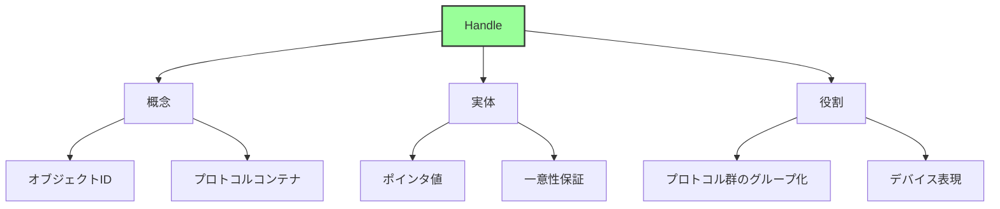
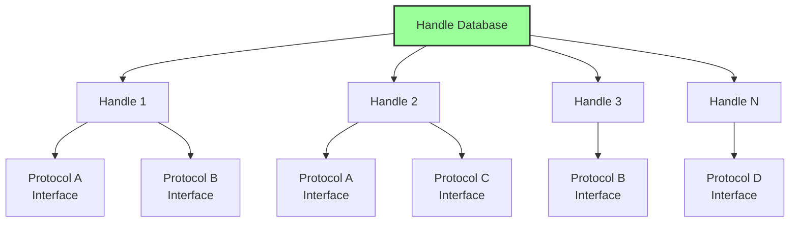
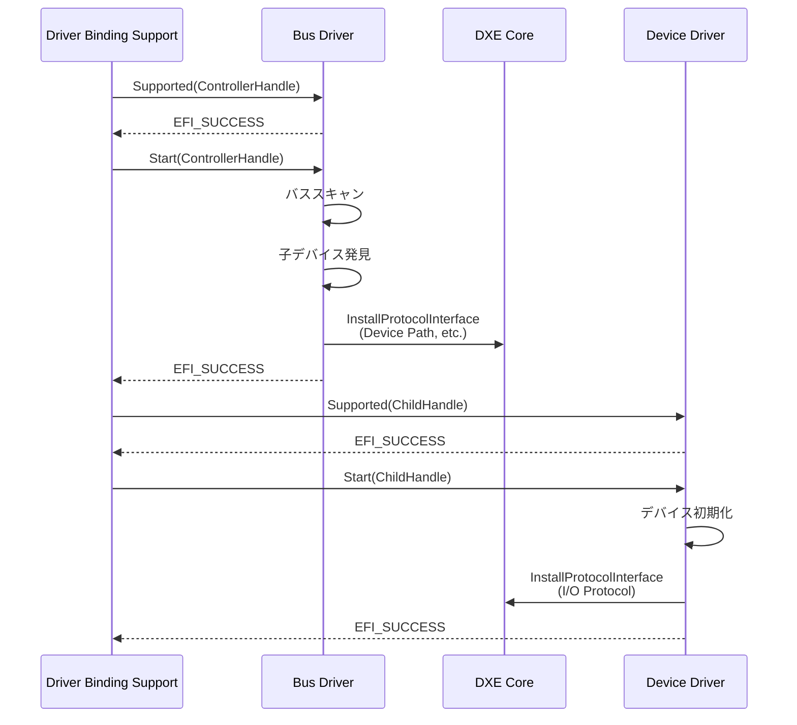
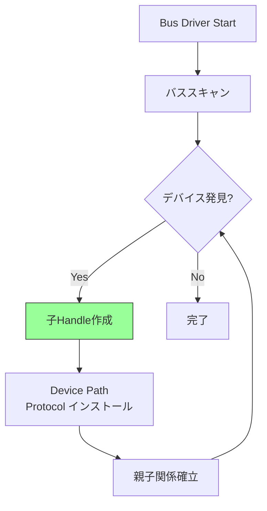
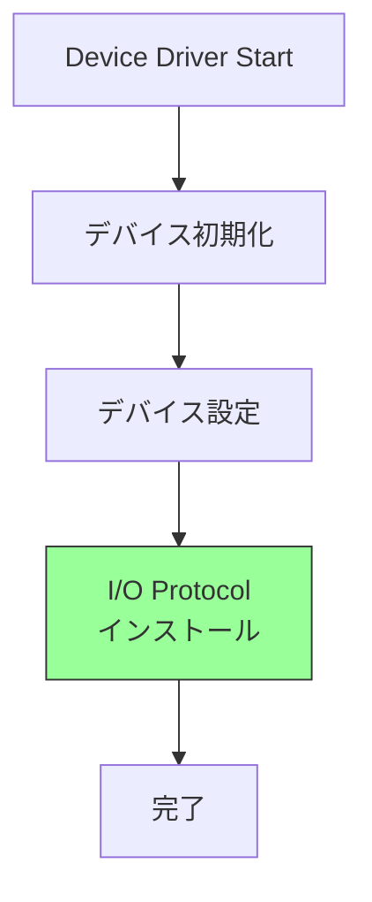
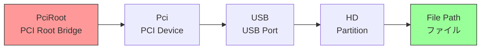
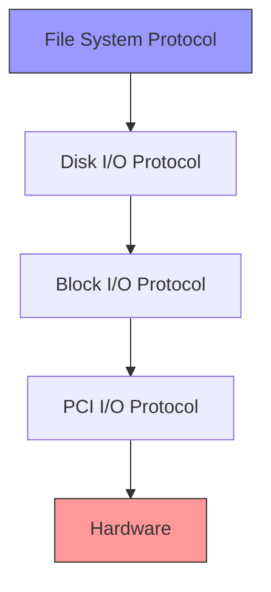
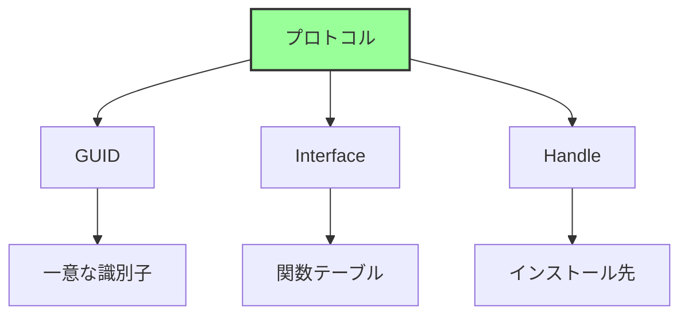

# プロトコルとドライバモデル

🎯 **この章で学ぶこと**
- UEFI プロトコルの仕組みと設計思想
- UEFI Driver Model の詳細
- Handle Database とプロトコルデータベース
- ドライバの種類と役割分担

📚 **前提知識**
- EDK II アーキテクチャ（前章）
- DXE Phase の役割（Part I）

---

## プロトコルの基本概念

### プロトコルとは

UEFI における **プロトコル (Protocol)** は、サービス提供の標準インターフェースです。プロトコルは、UEFI ファームウェアのモジュール性と拡張性を実現する中核的な仕組みであり、異なるドライバやアプリケーション間で共通のインターフェースを通じて通信できるようにします。プロトコルの設計思想は、オブジェクト指向プログラミングにおけるインターフェースの概念に似ており、実装の詳細を隠蔽しながら機能を提供します。

プロトコルは、三つの主要な特徴を持っています。第一に、**インターフェース定義**です。プロトコルは、関数ポインタの集合として定義され、GUID (Globally Unique Identifier) によって一意に識別されます。この GUID により、名前の衝突を避け、グローバルな一意性が保証されます。第二に、**実装の抽象化**です。プロトコルは、インターフェースのみを公開し、実装の詳細を隠蔽します。これにより、実装を差し替えることが可能になり、異なるハードウェアやプラットフォームに対応できます。第三に、**疎結合**です。プロトコルを使用することで、モジュール間の直接的な依存関係がなくなり、動的バインディングが実現されます。コンパイル時ではなく、実行時にプロトコルを検索して使用するため、柔軟なアーキテクチャが可能になります。

プロトコルの利点は、複数の側面から説明できます。まず、**実装の隠蔽**により、インターフェースのみを公開し、内部実装を変更しても他のモジュールに影響を与えません。次に、**動的な機能追加**により、実行時に新しいプロトコルを追加でき、ファームウェアの機能を段階的に拡張できます。さらに、**複数実装の共存**により、同じインターフェースの異なる実装を共存させることができます。例えば、複数のグラフィックスカードがそれぞれ Graphics Output Protocol を提供できます。最後に、**テストの容易性**により、モックプロトコルを使用して単体テストが可能になり、開発効率が向上します。

**補足図**: 以下の図は、プロトコルの構造を示したものです。



### プロトコルの構造

プロトコルの構造は、三つの主要な要素から構成されています。**GUID (Globally Unique Identifier)** は、プロトコルを一意に識別するための128ビットの識別子です。この GUID により、異なるベンダーや開発者が独立してプロトコルを定義しても、名前の衝突が発生しません。**Interface** は、関数ポインタの集合を含む構造体です。この構造体は、プロトコルが提供するすべての機能を定義し、実装者はこれらの関数ポインタに実際の実装を割り当てます。**Handle** は、プロトコルがインストールされるオブジェクトの識別子です。一つの Handle に複数のプロトコルをインストールでき、これによりデバイスやサービスの複合的な機能を表現できます。

プロトコルの具体例として、Simple Text Output Protocol を見てみましょう。この プロトコルは、テキスト出力機能を提供し、コンソールへの文字列表示を抽象化します。プロトコル定義は、まず GUID から始まります。`EFI_SIMPLE_TEXT_OUTPUT_PROTOCOL_GUID` は、このプロトコルを一意に識別します。次に、プロトコルインターフェースが構造体として定義されます。この構造体には、`Reset`、`OutputString`、`ClearScreen` などの関数ポインタが含まれており、各関数はテキスト出力の特定の操作を実行します。さらに、各関数は `EFI_STATUS` を返し、操作の成功または失敗を通知します。関数の第一引数は常に `This` ポインタであり、これはオブジェクト指向プログラミングにおける `this` ポインタに相当します。

プロトコルインターフェースの関数は、関数ポインタとして定義されます。例えば、`EFI_TEXT_STRING` 型は、文字列を出力する関数のプロトタイプです。この関数は、`This` ポインタと出力する文字列を引数として受け取り、`EFI_STATUS` を返します。このような関数プロトタイプの定義により、型安全性が確保され、コンパイラが引数の型チェックを行えます。実装者は、このプロトタイプに従って実際の関数を実装し、プロトコル構造体の関数ポインタに割り当てます。

**参考表**: 以下の表は、プロトコルの三つの要素をまとめたものです。

| 要素 | 説明 |
|------|------|
| **GUID** | プロトコルの識別子 |
| **Interface** | 関数テーブル（構造体） |
| **Handle** | プロトコルがインストールされるオブジェクト |

**補足**: 以下のコードは、Simple Text Output Protocol の定義例です。

```c
// プロトコル GUID
#define EFI_SIMPLE_TEXT_OUTPUT_PROTOCOL_GUID \
  { 0x387477c2, 0x69c7, 0x11d2, \
    { 0x8e, 0x39, 0x0, 0xa0, 0xc9, 0x69, 0x72, 0x3b }}

// プロトコルインターフェース
typedef struct _EFI_SIMPLE_TEXT_OUTPUT_PROTOCOL {
  EFI_TEXT_RESET              Reset;
  EFI_TEXT_STRING             OutputString;
  EFI_TEXT_TEST_STRING        TestString;
  EFI_TEXT_QUERY_MODE         QueryMode;
  EFI_TEXT_SET_MODE           SetMode;
  EFI_TEXT_SET_ATTRIBUTE      SetAttribute;
  EFI_TEXT_CLEAR_SCREEN       ClearScreen;
  EFI_TEXT_SET_CURSOR_POSITION SetCursorPosition;
  EFI_TEXT_ENABLE_CURSOR      EnableCursor;
  SIMPLE_TEXT_OUTPUT_MODE     *Mode;
} EFI_SIMPLE_TEXT_OUTPUT_PROTOCOL;

// 関数プロトタイプ
typedef
EFI_STATUS
(EFIAPI *EFI_TEXT_STRING)(
  IN EFI_SIMPLE_TEXT_OUTPUT_PROTOCOL  *This,
  IN CHAR16                           *String
  );
```

### プロトコルの設計思想

プロトコルの設計思想は、従来の静的リンク方式と対比することで理解できます。従来の方法では、モジュール間の通信は直接関数呼び出しによって実現されていました。この方法では、コンパイル時に関数のアドレスが決定され、静的リンクによって実行ファイルに組み込まれます。しかし、この方式には重大な問題があります。モジュール間の結合が強く、一つのモジュールの変更が他のモジュールに影響を与えるため、保守性が低くなります。さらに、機能の追加や変更には再コンパイルが必要であり、柔軟性に欠けます。

プロトコル方式は、これらの問題を解決します。プロトコルを使用することで、モジュール間の通信は間接呼び出しによって実現されます。関数は関数ポインタを通じて呼び出され、実行時に動的にバインディングされます。この方式により、疎結合が実現され、モジュール間の依存関係が最小限に抑えられます。実装の変更や新しい機能の追加は、他のモジュールに影響を与えることなく実行できます。したがって、保守性が大幅に向上し、ファームウェアの長期的な進化が可能になります。

プロトコルの利点は、具体的な開発シナリオで明らかになります。まず、**実装の隠蔽**により、インターフェースのみを公開し、内部実装の詳細は完全に隠蔽されます。これにより、実装を変更しても、インターフェースが変わらない限り、他のモジュールに影響を与えません。次に、**動的な機能追加**により、実行時に新しいプロトコルをインストールでき、ファームウェアの機能を段階的に拡張できます。DXE Phase では、ドライバが順次実行され、それぞれが新しいプロトコルを追加します。さらに、**複数実装の共存**により、同じインターフェースの異なる実装を共存させることができます。例えば、システムに複数のグラフィックスカードがある場合、それぞれが Graphics Output Protocol を提供でき、アプリケーションは必要なものを選択できます。最後に、**テストの容易性**により、モックプロトコルを作成して単体テストを実行でき、開発効率が向上します。

**補足図**: 以下の図は、従来の方法とプロトコル方式の比較を示したものです。



## Handle Database

### Handle とは

UEFI における **Handle** は、プロトコルがインストールされるオブジェクトの識別子です。Handle は、UEFI ファームウェアにおけるオブジェクトを表現する抽象的な概念であり、デバイス、ドライバ、またはサービスを識別するために使用されます。Handle は、複数のプロトコルをグループ化するコンテナとして機能し、一つの論理的なエンティティに関連するすべてのインターフェースを一つの Handle に集約できます。

Handle の概念は、三つの側面から理解できます。第一に、**オブジェクト ID** としての側面です。Handle は、システム内の各オブジェクトを一意に識別します。この識別子により、特定のデバイスやサービスを参照し、そのプロトコルにアクセスできます。第二に、**プロトコルコンテナ** としての側面です。一つの Handle には、複数のプロトコルをインストールできます。例えば、ディスクデバイスを表す Handle には、Block I/O Protocol、Disk I/O Protocol、Device Path Protocol などが同時にインストールされます。第三に、**デバイス表現** としての側面です。Handle は、物理デバイスまたは論理デバイスを表現し、そのデバイスが提供するすべての機能を一つの Handle に集約します。

Handle の実体は、単純なポインタ値です。`EFI_HANDLE` 型は、`void*` として定義されており、実際には内部データ構造へのポインタです。しかし、アプリケーションやドライバは、この内部構造を直接操作することはなく、常に Boot Services が提供する API を通じて Handle を操作します。Handle の一意性は、DXE Core が保証し、同じ Handle 値が異なるオブジェクトに割り当てられることはありません。Handle の使用例として、`ImageHandle` はアプリケーションまたはドライバ自身を識別し、`DeviceHandle` はデバイスを識別し、`ControllerHandle` はコントローラを識別します。

**補足図**: 以下の図は、Handle の概念を示したものです。



**補足**: 以下のコードは、Handle の定義と使用例です。

```c
// Handle は EFI_HANDLE 型（実体は void*）
typedef VOID  *EFI_HANDLE;

// 使用例
EFI_HANDLE  ImageHandle;   // アプリケーション自身
EFI_HANDLE  DeviceHandle;  // デバイス
EFI_HANDLE  ControllerHandle; // コントローラ
```

### Handle Database の構造

Handle Database は、DXE Core が管理する中央レジストリです。この データベースは、すべての Handle とそれにインストールされているプロトコルの対応関係を管理します。Handle Database の役割は、プロトコルの登録、検索、削除を効率的に実行し、システム全体のプロトコル情報を一元管理することです。DXE Core は、このデータベースを使用して、ドライバとデバイスの動的な接続を実現します。

Handle Database の構造は、階層的なデータ構造として設計されています。最上位には、Handle Database 自体があり、すべての Handle を管理します。各 Handle は、そのインスタンスに関連付けられたプロトコルのリストを保持します。一つの Handle に複数のプロトコルをインストールできるため、デバイスの複合的な機能を表現できます。例えば、ディスクデバイスを表す Handle には、Block I/O Protocol、Disk I/O Protocol、Device Path Protocol などが同時にインストールされます。さらに、各プロトコルは、同じプロトコル GUID を持つ他のインスタンスとリンクされており、特定のプロトコルを提供するすべての Handle を効率的に検索できます。

Handle Database の内部データ構造は、概念的には二つの主要な構造体から構成されています。`IHANDLE` 構造体は、一つの Handle を表現し、Handle 値とそれに関連付けられたプロトコルのリストを保持します。`PROTOCOL_ENTRY` 構造体は、一つのプロトコルインスタンスを表現し、所属する Handle、プロトコル GUID、プロトコルインターフェースへのポインタを保持します。これらの構造体は、二重リンクリストによって連結され、効率的な検索と挿入を可能にします。ただし、これらの構造体は概念的なものであり、実際の実装は EDK II のバージョンやプラットフォームによって異なる場合があります。

**補足図**: 以下の図は、Handle Database の構造を示したものです。



**補足**: 以下のコードは、Handle Database の概念的なデータ構造です。

```c
// 概念的な構造（実装は異なる）
typedef struct {
  LIST_ENTRY        Link;          // Handle のリスト
  UINTN             Key;            // Handle 値
  LIST_ENTRY        Protocols;     // このHandleのプロトコル一覧
} IHANDLE;

typedef struct {
  UINTN             Signature;
  IHANDLE           *Handle;        // 所属する Handle
  EFI_GUID          *Protocol;      // プロトコル GUID
  VOID              *Interface;     // プロトコル実装
  LIST_ENTRY        Link;
  LIST_ENTRY        ByProtocol;     // 同じプロトコルのリスト
} PROTOCOL_ENTRY;
```

### Boot Services でのプロトコル操作

Boot Services は、プロトコルを操作するための包括的な API セットを提供します。これらの API により、ドライバやアプリケーションは、プロトコルのインストール、検索、削除を実行できます。プロトコル操作関数は、Handle Database を直接操作する代わりに、DXE Core が提供する安全なインターフェースを通じてプロトコルにアクセスします。これにより、データ構造の整合性が保たれ、排他制御が実現されます。

プロトコル管理の主要な関数は、四つのカテゴリに分類されます。第一に、**プロトコルのインストール**です。`InstallProtocolInterface` 関数は、指定された Handle に新しいプロトコルをインストールします。Handle が NULL の場合、新しい Handle が作成されます。第二に、**プロトコルのアンインストール**です。`UninstallProtocolInterface` 関数は、Handle からプロトコルを削除します。すべてのプロトコルが削除されると、Handle 自体も削除されます。第三に、**プロトコルの検索**です。`LocateProtocol` 関数は、指定された GUID を持つプロトコルを検索し、そのインターフェースを返します。第四に、**Handle の取得**です。`LocateHandleBuffer` 関数は、指定された条件に一致するすべての Handle を取得します。

これらの関数の使用例は、典型的なプロトコル検索シナリオで示されます。アプリケーションが Simple Text Output Protocol を使用する場合、まず `LocateProtocol` を使用してプロトコルインターフェースを取得します。この関数は、プロトコル GUID を引数として受け取り、対応するインターフェースへのポインタを返します。取得したインターフェースを使用して、`OutputString` 関数を呼び出し、テキストをコンソールに出力します。このような動的な検索により、実装の詳細を知ることなく、プロトコルが提供する機能を使用できます。

**補足**: 以下のコードは、プロトコル管理関数の定義です。

```c
// プロトコルのインストール
EFI_STATUS
InstallProtocolInterface (
  IN OUT EFI_HANDLE     *Handle,
  IN     EFI_GUID       *Protocol,
  IN     EFI_INTERFACE_TYPE InterfaceType,
  IN     VOID           *Interface
  );

// プロトコルのアンインストール
EFI_STATUS
UninstallProtocolInterface (
  IN EFI_HANDLE         Handle,
  IN EFI_GUID           *Protocol,
  IN VOID               *Interface
  );

// プロトコルの検索
EFI_STATUS
LocateProtocol (
  IN  EFI_GUID  *Protocol,
  IN  VOID      *Registration OPTIONAL,
  OUT VOID      **Interface
  );

// Handle の取得
EFI_STATUS
LocateHandleBuffer (
  IN     EFI_LOCATE_SEARCH_TYPE SearchType,
  IN     EFI_GUID               *Protocol OPTIONAL,
  IN     VOID                   *SearchKey OPTIONAL,
  OUT    UINTN                  *NoHandles,
  OUT    EFI_HANDLE             **Buffer
  );
```

**補足**: 以下のコードは、プロトコルの検索と使用例です。

```c
// プロトコルの検索と使用
EFI_SIMPLE_TEXT_OUTPUT_PROTOCOL  *TextOut;
EFI_STATUS                        Status;

Status = gBS->LocateProtocol (
                &gEfiSimpleTextOutputProtocolGuid,
                NULL,
                (VOID**)&TextOut
                );
if (!EFI_ERROR (Status)) {
  TextOut->OutputString (TextOut, L"Hello, UEFI!\r\n");
}
```

## UEFI Driver Model

### Driver Model の概要

UEFI Driver Model は、ドライバとデバイスを動的に接続する仕組みです。この モデルは、プラグアンドプレイの概念をファームウェアレベルで実現し、デバイスの検出、ドライバの選択、デバイスの初期化を自動的に実行します。UEFI Driver Model の設計により、ドライバは特定のハードウェアに依存せず、標準的なインターフェースを通じてデバイスと通信できます。この抽象化により、新しいデバイスのサポートは、新しいドライバを追加するだけで実現できます。

UEFI Driver Model の設計原則は、三つの主要な概念に基づいています。第一に、**バスドライバとデバイスドライバの分離**です。バスドライバは、PCI バスや USB バスなどのバスをスキャンし、接続されているデバイスを発見します。デバイスドライバは、特定のデバイスを制御し、そのデバイスが提供する機能を上位層に公開します。この分離により、バスとデバイスの実装を独立して開発でき、再利用性が向上します。第二に、**動的バインディング**です。ドライバとデバイスの接続は、実行時に動的に決定されます。システムは、各ドライバに対して `Supported()` 関数を呼び出し、そのドライバがデバイスをサポートできるかを確認します。対応可能なドライバが見つかると、`Start()` 関数を呼び出してドライバを起動します。第三に、**階層的構造**です。デバイスは階層的に構成され、バスドライバが親デバイスを管理し、デバイスドライバが子デバイスを管理します。この階層により、複雑なデバイスツリーを表現できます。

UEFI Driver Model のコンポーネントは、三つの主要なドライバタイプから構成されます。**Bus Driver** は、バスをスキャンして子デバイスを発見し、それらのデバイス用の Handle を作成します。**Device Driver** は、特定のデバイスを制御し、I/O Protocol を提供します。**Hybrid Driver** は、Bus Driver と Device Driver の機能を兼ね備え、自身のサービスを提供しながら子デバイスを列挙します。これらのドライバは、Driver Binding Protocol を実装し、三つの必須関数 (`Supported()`、`Start()`、`Stop()`) を提供します。

**補足図**: 以下の図は、UEFI Driver Model の構造を示したものです。

```mermaid
graph TB
    A[UEFI Driver Model] --> B[設計原則]
    A --> C[コンポーネント]
    A --> D[動作フロー]

    B --> B1[バスドライバと<br/>デバイスドライバ分離]
    B --> B2[動的バインディング]
    B --> B3[階層的構造]

    C --> C1[Bus Driver]
    C --> C2[Device Driver]
    C --> C3[Hybrid Driver]

    D --> D1[Supported()]
    D --> D2[Start()]
    D --> D3[Stop()]

    style A fill:#9f9,stroke:#333,stroke-width:2px
```

### Driver Binding Protocol

Driver Binding Protocol は、UEFI Driver Model の中核となるインターフェースです。すべての UEFI ドライバは、このプロトコルを実装し、デバイスとの接続を管理します。Driver Binding Protocol は、ドライバがデバイスをサポートできるかを確認し、サポート可能な場合にドライバを起動し、必要に応じてドライバを停止する三つの基本的な操作を定義します。このプロトコルにより、ドライバの動作が標準化され、DXE Core がドライバとデバイスを自動的に接続できます。

Driver Binding Protocol の構造体は、三つの必須関数ポインタと追加情報を含みます。`Supported` 関数は、ドライバが指定されたデバイスをサポートできるかを確認します。この関数は、デバイスの Handle を引数として受け取り、そのデバイスに必要なプロトコルが存在するかをチェックします。対応可能な場合は `EFI_SUCCESS` を返し、非対応の場合は `EFI_UNSUPPORTED` を返します。`Start` 関数は、ドライバを起動し、デバイスを初期化します。この関数は、デバイスの設定、リソースの割り当て、プロトコルのインストールを実行します。起動が成功すると `EFI_SUCCESS` を返し、失敗するとエラーコードを返します。`Stop` 関数は、ドライバを停止し、割り当てられたリソースを解放します。この関数は、プロトコルのアンインストールとリソースのクリーンアップを実行します。

これらの三つの関数は、ドライバのライフサイクルを完全に制御します。`Supported()` 関数は、デバイス対応確認のために使用され、ドライバがデバイスを制御できるかを判断します。`Start()` 関数は、ドライバ起動のために使用され、デバイスの初期化とプロトコルのインストールを実行します。`Stop()` 関数は、ドライバ停止のために使用され、リソースの解放とプロトコルのアンインストールを実行します。これらの関数の組み合わせにより、ドライバの動的なロードとアンロードが可能になります。

**参考表**: 以下の表は、Driver Binding Protocol の三つの必須関数をまとめたものです。

| 関数 | 役割 | 戻り値 |
|------|------|--------|
| `Supported()` | デバイス対応確認 | EFI_SUCCESS: 対応可能<br/>EFI_UNSUPPORTED: 非対応 |
| `Start()` | ドライバ起動 | EFI_SUCCESS: 起動成功<br/>エラー: 起動失敗 |
| `Stop()` | ドライバ停止 | EFI_SUCCESS: 停止成功 |

**補足**: 以下のコードは、Driver Binding Protocol の構造体定義です。

```c
typedef struct _EFI_DRIVER_BINDING_PROTOCOL {
  EFI_DRIVER_BINDING_SUPPORTED  Supported;
  EFI_DRIVER_BINDING_START      Start;
  EFI_DRIVER_BINDING_STOP       Stop;
  UINT32                        Version;
  EFI_HANDLE                    ImageHandle;
  EFI_HANDLE                    DriverBindingHandle;
} EFI_DRIVER_BINDING_PROTOCOL;
```

### ドライバとデバイスの接続フロー

ドライバとデバイスの接続は、DXE Core が提供する Driver Binding Support によって自動的に実行されます。この プロセスは、システムに存在するすべてのドライバとデバイスを調査し、適切なドライバをデバイスに接続します。接続フローは、階層的に実行され、まずバスドライバが親デバイスに接続され、次にバスドライバが子デバイスを発見し、最後にデバイスドライバが子デバイスに接続されます。

接続フローの詳細なシーケンスは、複数のステップから構成されています。まず、Driver Binding Support は、バスドライバに対して `Supported()` 関数を呼び出し、コントローラ Handle がサポートされているかを確認します。バスドライバが `EFI_SUCCESS` を返すと、Driver Binding Support は `Start()` 関数を呼び出します。バスドライバの `Start()` 関数内では、バススキャンが実行され、接続されている子デバイスが発見されます。各子デバイスに対して、新しい Handle が作成され、Device Path Protocol などの基本的なプロトコルがインストールされます。

次に、子デバイスが発見されると、Driver Binding Support は、すべてのデバイスドライバに対して `Supported()` 関数を呼び出し、子デバイスをサポートできるドライバを検索します。適切なデバイスドライバが見つかると、その `Start()` 関数が呼び出されます。デバイスドライバの `Start()` 関数内では、デバイスの初期化が実行され、I/O Protocol などの機能的なプロトコルがインストールされます。これにより、上位層のアプリケーションやドライバは、I/O Protocol を通じてデバイスにアクセスできるようになります。このような階層的な接続により、複雑なデバイスツリーが段階的に構築されます。

**補足図**: 以下の図は、ドライバとデバイスの接続フローを示したシーケンス図です。



## ドライバの種類

### 1. Bus Driver (バスドライバ)

Bus Driver (バスドライバ) は、バスをスキャンして接続されているデバイスを発見し、それらのデバイスを表す Handle を作成する役割を担います。バスドライバの主な責務は、物理的なバス (PCI、USB、SCSI など) の抽象化、子デバイスの列挙、そして各子デバイスに対する基本的なプロトコルのインストールです。バスドライバは、デバイスドライバとは異なり、デバイス固有の機能を提供するのではなく、バス上のデバイスを発見して公開することに専念します。

バスドライバの典型的な例として、PCI Bus Driver、USB Bus Driver、SCSI Bus Driver があります。PCI Bus Driver は、PCI バスをスキャンし、接続されているすべての PCI デバイスを発見します。各 PCI デバイスに対して、新しい Handle を作成し、Device Path Protocol と PCI I/O Protocol をインストールします。USB Bus Driver は、USB ハブを経由して接続されている USB デバイスを列挙し、各デバイスに USB I/O Protocol を提供します。SCSI Bus Driver は、SCSI バス上のターゲットとロジカルユニットを発見し、Block I/O Protocol の基盤を提供します。

バスドライバの処理フローは、複数のステップから構成されています。まず、`Start()` 関数が呼び出されると、バススキャンが開始されます。バススキャンでは、バス固有のプロトコル (例: PCI Root Bridge I/O Protocol) を使用して、バス上のデバイスを検出します。デバイスが発見されると、新しい子 Handle が作成されます。次に、Device Path Protocol が子 Handle にインストールされます。Device Path は、親デバイスの Device Path を継承し、子デバイスの位置情報を追加します。さらに、親子関係が確立され、子 Handle が親 Handle と関連付けられます。このプロセスは、すべてのデバイスが発見されるまで繰り返されます。最後に、バスドライバは `EFI_SUCCESS` を返し、処理を完了します。

**補足図**: 以下の図は、Bus Driver の処理フローを示したものです。



**補足**: 以下のコードは、PCI Bus Driver の例です。

```c
// Supported() - PCI Root Bridge I/O Protocol が必要
EFI_STATUS
EFIAPI
PciBusDriverBindingSupported (
  IN EFI_DRIVER_BINDING_PROTOCOL  *This,
  IN EFI_HANDLE                   Controller,
  IN EFI_DEVICE_PATH_PROTOCOL     *RemainingDevicePath
  )
{
  EFI_STATUS                     Status;
  EFI_PCI_ROOT_BRIDGE_IO_PROTOCOL *PciRootBridgeIo;

  // PCI Root Bridge I/O Protocol を取得
  Status = gBS->OpenProtocol (
                  Controller,
                  &gEfiPciRootBridgeIoProtocolGuid,
                  (VOID**)&PciRootBridgeIo,
                  This->DriverBindingHandle,
                  Controller,
                  EFI_OPEN_PROTOCOL_BY_DRIVER
                  );

  if (EFI_ERROR (Status)) {
    return EFI_UNSUPPORTED;
  }

  gBS->CloseProtocol (
         Controller,
         &gEfiPciRootBridgeIoProtocolGuid,
         This->DriverBindingHandle,
         Controller
         );

  return EFI_SUCCESS;
}

// Start() - PCI デバイス列挙
EFI_STATUS
EFIAPI
PciBusDriverBindingStart (
  IN EFI_DRIVER_BINDING_PROTOCOL  *This,
  IN EFI_HANDLE                   Controller,
  IN EFI_DEVICE_PATH_PROTOCOL     *RemainingDevicePath
  )
{
  // 1. PCI Root Bridge I/O Protocol 取得
  // 2. PCI バススキャン
  // 3. 各 PCI デバイス用の Handle 作成
  // 4. Device Path Protocol インストール
  // 5. PCI I/O Protocol インストール
  //...
}
```

### 2. Device Driver (デバイスドライバ)

Device Driver (デバイスドライバ) は、特定のデバイスを制御し、そのデバイスが提供する機能を上位層に公開する役割を担います。デバイスドライバの主な責務は、デバイス固有の初期化、デバイスの制御、そして I/O Protocol のインストールです。デバイスドライバは、バスドライバが発見した子デバイスに接続され、そのデバイスを実際に使用可能な状態にします。デバイスドライバは、ハードウェアの詳細を隠蔽し、標準的なプロトコルインターフェースを通じて機能を提供します。

デバイスドライバの典型的な例として、USB Mass Storage Driver、Network Interface Card Driver、Video Graphics Driver があります。USB Mass Storage Driver は、USB ストレージデバイス (USB メモリ、外付けハードディスクなど) を制御し、Block I/O Protocol と Disk I/O Protocol を提供します。Network Interface Card Driver は、ネットワークカードを制御し、Simple Network Protocol を提供します。Video Graphics Driver は、グラフィックスカードを制御し、Graphics Output Protocol を提供します。これらのドライバは、それぞれ異なるデバイスを制御しますが、すべて標準的な Driver Binding Protocol を実装しています。

デバイスドライバの処理フローは、比較的単純です。まず、`Start()` 関数が呼び出されると、デバイス初期化が開始されます。デバイス初期化では、デバイス固有のレジスタ設定、リソース割り当て、割り込み設定などが実行されます。次に、デバイス設定が行われ、デバイスが動作可能な状態になります。最後に、I/O Protocol が Handle にインストールされます。この I/O Protocol により、上位層のドライバやアプリケーションは、デバイスの機能にアクセスできます。デバイスドライバは `EFI_SUCCESS` を返し、処理を完了します。これにより、デバイスは完全に使用可能な状態になります。

**補足図**: 以下の図は、Device Driver の処理フローを示したものです。



**補足**: 以下のコードは、USB Mass Storage Driver の例です。

```c
// Supported() - USB I/O Protocol が必要で、Mass Storage クラス
EFI_STATUS
EFIAPI
UsbMassStorageSupported (
  IN EFI_DRIVER_BINDING_PROTOCOL  *This,
  IN EFI_HANDLE                   Controller,
  IN EFI_DEVICE_PATH_PROTOCOL     *RemainingDevicePath
  )
{
  EFI_USB_IO_PROTOCOL              *UsbIo;
  EFI_USB_INTERFACE_DESCRIPTOR     InterfaceDescriptor;

  // USB I/O Protocol 取得
  Status = gBS->OpenProtocol (
                  Controller,
                  &gEfiUsbIoProtocolGuid,
                  (VOID**)&UsbIo,
                  //...
                  );

  // Interface Descriptor 取得
  UsbIo->UsbGetInterfaceDescriptor (UsbIo, &InterfaceDescriptor);

  // Mass Storage クラス (0x08) をチェック
  if (InterfaceDescriptor.InterfaceClass != 0x08) {
    return EFI_UNSUPPORTED;
  }

  return EFI_SUCCESS;
}

// Start() - Mass Storage デバイス初期化
EFI_STATUS
EFIAPI
UsbMassStorageStart (
  IN EFI_DRIVER_BINDING_PROTOCOL  *This,
  IN EFI_HANDLE                   Controller,
  IN EFI_DEVICE_PATH_PROTOCOL     *RemainingDevicePath
  )
{
  // 1. デバイス初期化
  // 2. Block I/O Protocol インストール
  // 3. Disk I/O Protocol インストール
  //...
}
```

### 3. Hybrid Driver (ハイブリッドドライバ)

Hybrid Driver (ハイブリッドドライバ) は、Bus Driver と Device Driver の両方の機能を兼ね備えたドライバです。ハイブリッドドライバは、自身のサービスを提供すると同時に、子デバイスを列挙する役割を担います。この設計により、特定のハードウェア構成において、ドライバの数を削減し、効率的なデバイス管理が可能になります。

ハイブリッドドライバの典型的な例として、Serial I/O Driver と Graphics Output Protocol Driver があります。Serial I/O Driver は、UART ハードウェアを制御すると同時に、ターミナルデバイスを列挙します。UART バスとしての機能により、シリアルポートに接続された複数のターミナルを管理でき、デバイスドライバとしての機能により、Serial I/O Protocol を提供します。Graphics Output Protocol Driver も同様に、グラフィックスハードウェアを制御しながら、Graphics Output Protocol を提供します。ハイブリッドドライバは、Bus Driver と Device Driver の両方の責務を一つのドライバで実現するため、実装は複雑になりますが、システム全体の効率性が向上します。

### 4. Service Driver (サービスドライバ)

Service Driver (サービスドライバ) は、ハードウェアに依存しない純粋なサービスを提供するドライバです。サービスドライバは、デバイス制御ではなく、ソフトウェアレベルの機能を提供します。サービスドライバは、Driver Binding Protocol を使用せず、エントリポイントで直接プロトコルをインストールする場合があります。また、Handle を持たない場合もあり、グローバルなサービスとして機能します。

サービスドライバの典型的な例として、UEFI Shell、Network Protocol Stack (TCP/IP)、File System Driver (FAT、ext4) があります。UEFI Shell は、ユーザーインターフェースとコマンド実行環境を提供します。Network Protocol Stack は、TCP/IP プロトコルスタックを実装し、ネットワーク通信を可能にします。File System Driver は、ファイルシステム (FAT、ext4 など) をサポートし、Simple File System Protocol を提供します。これらのドライバは、ハードウェアに直接依存せず、既存のプロトコルの上に構築されます。したがって、サービスドライバは、ソフトウェアの階層化と再利用性を促進します。

サービスドライバの多くは、Driver Binding Protocol を使用せず、エントリポイントで直接プロトコルをインストールします。以下のコード例は、サービスドライバの典型的な実装パターンを示しています。

```c
// エントリポイントでプロトコル直接インストール
EFI_STATUS
EFIAPI
ServiceDriverEntryPoint (
  IN EFI_HANDLE        ImageHandle,
  IN EFI_SYSTEM_TABLE  *SystemTable
  )
{
  EFI_HANDLE  Handle = NULL;

  // プロトコルをインストール
  return gBS->InstallProtocolInterface (
                &Handle,
                &gMyServiceProtocolGuid,
                EFI_NATIVE_INTERFACE,
                &mMyServiceProtocol
                );
}
```

## Device Path Protocol

### Device Path の役割

Device Path Protocol は、デバイスの階層的な位置を表現するための標準的な方法です。Device Path は、デバイスツリー内の各デバイスの位置を一意に識別し、ブートデバイスの特定やデバイスの検索に使用されます。Device Path は、ルートから特定のデバイスまでの経路を記述し、複数のデバイスパスノードを連結することで、複雑なデバイス階層を表現します。

Device Path の重要性は、UEFI ブートプロセスにおいて特に顕著です。ブートマネージャは、Device Path を使用してブートデバイスを識別し、ブートローダをロードします。例えば、ハードディスクの特定のパーティションにあるブートローダを起動する場合、Device Path は PCI Root Bridge から始まり、PCI デバイス、SATA ポート、パーティション、そして最終的にファイルパスまでの完全な経路を記述します。この階層的な表現により、システムは明確にブートデバイスを特定でき、複数のストレージデバイスが存在する環境でも正確にブートできます。

Device Path の構造は、複数のノードが連結されたリストとして表現されます。各ノードは、デバイスツリーの一段階を表し、ノードタイプとサブタイプによって分類されます。例として、`PciRoot(0x0)/Pci(0x1F,0x2)/Sata(0x0,0x0,0x0)/HD(1,GPT,<GUID>,0x800,0x100000)/\EFI\BOOT\BOOTX64.EFI` という Device Path を考えます。この Device Path は、五つのノードから構成されています。`PciRoot(0x0)` は PCI Root Bridge 0 を示し、`Pci(0x1F,0x2)` は PCI デバイス 31、機能 2 (SATA Controller) を示し、`Sata(0x0,0x0,0x0)` は SATA ポート 0 を示し、`HD(1,GPT,<GUID>,...)` はパーティション 1 (GPT) を示し、`\EFI\BOOT\BOOTX64.EFI` はファイルパスを示します。これらのノードを順に辿ることで、ブートローダの正確な位置が特定されます。

**補足図**: 以下の図は、Device Path の階層構造を示したものです。



### Device Path の構造

Device Path の内部構造は、共通のヘッダーと型固有のデータから構成されます。各 Device Path ノードは、`EFI_DEVICE_PATH_PROTOCOL` 構造体として定義され、Type、SubType、Length の三つのフィールドを含みます。Type フィールドは、デバイスパスのカテゴリを示し、SubType フィールドは、Type 内の具体的なデバイスタイプを示します。Length フィールドは、このノード全体の長さをバイト単位で示します。この共通ヘッダーにより、Device Path ノードを一般的に処理でき、型に応じて適切な解釈が可能になります。

具体的な Device Path の例として、PCI Device Path を見てみましょう。PCI Device Path は、`EFI_DEVICE_PATH_PROTOCOL` ヘッダーと、PCI 固有のフィールド (Function と Device) から構成されます。Function フィールドは PCI 機能番号を示し、Device フィールドは PCI デバイス番号を示します。これらのフィールドにより、PCI バス上の特定のデバイスを一意に識別できます。他のデバイスタイプも同様に、共通ヘッダーと型固有のフィールドを持ちます。

Device Path の種類は、Type フィールドによって分類されます。主要な Type には、Hardware Device Path (0x01)、ACPI Device Path (0x02)、Messaging Device Path (0x03)、Media Device Path (0x04)、BIOS Boot Specification (0x05)、そして End of Device Path (0x7F) があります。Hardware Device Path は、PCI や MemoryMapped などのハードウェアデバイスを表現します。ACPI Device Path は、ACPI デバイスや PciRoot を表現します。Messaging Device Path は、USB、SATA、Network などの通信デバイスを表現します。Media Device Path は、HardDrive、CDROM、FilePath などのメディアデバイスを表現します。End of Device Path は、Device Path の終端を示します。これらの Type を組み合わせることで、あらゆるデバイス階層を表現できます。

**補足**: 以下のコードは、Device Path の基本構造です。

```c
typedef struct {
  UINT8  Type;        // デバイスパスのタイプ
  UINT8  SubType;     // サブタイプ
  UINT8  Length[2];   // このノードの長さ
} EFI_DEVICE_PATH_PROTOCOL;

// 例: PCI Device Path
typedef struct {
  EFI_DEVICE_PATH_PROTOCOL  Header;
  UINT8                     Function;  // PCI 機能番号
  UINT8                     Device;    // PCI デバイス番号
} PCI_DEVICE_PATH;
```

**補足**: 以下は、Device Path の具体例です。

```
PciRoot(0x0)/Pci(0x1F,0x2)/Sata(0x0,0x0,0x0)/HD(1,GPT,<GUID>,0x800,0x100000)/\EFI\BOOT\BOOTX64.EFI

解釈:
1. PciRoot(0x0)          - PCI Root Bridge 0
2. Pci(0x1F,0x2)         - PCI デバイス 31, 機能 2 (SATA Controller)
3. Sata(0x0,0x0,0x0)     - SATA ポート 0
4. HD(1,GPT,<GUID>,...) - パーティション 1 (GPT)
5. \EFI\BOOT\BOOTX64.EFI - ファイルパス
```

**参考表**: 以下の表は、Device Path の Type をまとめたものです。

| Type | 説明 | 例 |
|------|------|-----|
| 0x01 | Hardware Device Path | PCI, MemoryMapped |
| 0x02 | ACPI Device Path | ACPI, PciRoot |
| 0x03 | Messaging Device Path | USB, SATA, Network |
| 0x04 | Media Device Path | HardDrive, CDROM, FilePath |
| 0x05 | BIOS Boot Specification | Legacy Boot |
| 0x7F | End of Device Path | End |

## プロトコルの応用パターン

### 1. プロトコルの階層化

プロトコルの階層化は、UEFI における重要な設計パターンです。プロトコルの階層化により、複雑な機能を単純なレイヤーに分割し、各レイヤーが特定の責務を担います。この設計により、コードの再利用性が向上し、保守性が改善されます。階層化されたプロトコルは、レイヤードアーキテクチャを形成し、下位層が基本的な機能を提供し、上位層がより抽象的で高レベルの機能を提供します。

ファイル読み込みの具体例を通じて、プロトコルの階層化を理解しましょう。アプリケーションがファイルを読み込む場合、その処理は複数のプロトコルレイヤーを経由します。最上位レイヤーは File System Protocol であり、FAT ドライバがこのプロトコルを実装します。File System Protocol は、ファイル名を指定してファイル内容を読み込む抽象的なインターフェースを提供します。次に、Disk I/O Protocol が、パーティションドライバによって提供され、論理セクタ単位でのディスクアクセスを提供します。その下に Block I/O Protocol があり、SATA ドライバがブロック単位でのデータ転送を提供します。さらに下に PCI I/O Protocol があり、PCI バスドライバが PCI デバイスへのアクセスを提供します。最下層は物理ハードウェア (SATA Controller) です。このような階層化により、アプリケーションはハードウェアの詳細を知ることなく、File System Protocol を通じてファイルにアクセスできます。

プロトコルの階層化のもう一つの重要な利点は、レイヤー間の独立性です。各レイヤーは、上位レイヤーのインターフェースのみに依存し、下位レイヤーの実装詳細を知る必要がありません。例えば、File System Protocol の実装は、Block I/O Protocol が SATA、USB、NVMe のいずれによって提供されているかを知る必要がありません。したがって、新しいストレージデバイスのサポートは、Block I/O Protocol を実装する新しいドライバを追加するだけで実現でき、上位レイヤーの変更は不要です。

**補足図**: 以下の図は、プロトコルの階層化を示したものです。



**補足**: 以下は、ファイル読み込みの流れを示したものです。

```
Application
  ↓ File System Protocol (FAT Driver)
Disk I/O Protocol
  ↓ Partition Driver
Block I/O Protocol
  ↓ SATA Driver
PCI I/O Protocol
  ↓ PCI Bus Driver
Hardware (SATA Controller)
```

### 2. プロトコル通知 (Notify)

プロトコル通知 (Protocol Notify) は、イベント駆動のプロトコル検出を実現する仕組みです。プロトコル通知により、ドライバやアプリケーションは、特定のプロトコルがインストールされたときに自動的に通知を受け取ることができます。この仕組みは、デバイスのホットプラグや動的なドライバロードに対応するために重要です。プロトコル通知を使用することで、ポーリングではなくイベント駆動でプロトコルを検出でき、効率的なリソース管理が可能になります。

プロトコル通知の実装は、二つのステップから構成されます。まず、`CreateEvent` 関数を使用して、イベントを作成します。このイベントには、通知関数 (Notify Function) とコールバック優先度 (TPL_CALLBACK) が指定されます。次に、`RegisterProtocolNotify` 関数を使用して、特定のプロトコル GUID に対する通知を登録します。この登録により、指定されたプロトコルがインストールされるたびに、イベントがシグナル状態になり、通知関数が呼び出されます。

通知関数内では、新しくインストールされたプロトコルに対する処理を実行します。例えば、Block I/O Protocol の通知を登録した場合、新しいストレージデバイスが接続されるたびに通知関数が呼び出され、そのデバイスに対する初期化やファイルシステムのマウントなどの処理を実行できます。このような動的な対応により、UEFI ファームウェアは柔軟にデバイスの追加や削除に対応できます。

**補足**: 以下のコードは、プロトコル通知の実装例です。

```c
EFI_EVENT  Event;
VOID       *Registration;

// プロトコルインストール時に通知
gBS->CreateEvent (
       EVT_NOTIFY_SIGNAL,
       TPL_CALLBACK,
       MyNotifyFunction,
       NULL,
       &Event
       );

gBS->RegisterProtocolNotify (
       &gEfiBlockIoProtocolGuid,
       Event,
       &Registration
       );

// Notify Function
VOID
EFIAPI
MyNotifyFunction (
  IN EFI_EVENT  Event,
  IN VOID       *Context
  )
{
  // 新しい Block I/O Protocol が追加された
  // 処理を実行
}
```

### 3. Protocol Override (上書き)

Protocol Override (プロトコル上書き) は、既存のプロトコルを新しい実装で置き換える高度なテクニックです。プロトコルの上書きにより、既存のプロトコルの動作を変更したり、機能を拡張したりできます。この手法は、デバッグ、ロギング、機能拡張などの目的で使用されます。ただし、プロトコルの上書きは慎重に実装する必要があり、元のプロトコルの動作を保持しながら新しい機能を追加することが重要です。

プロトコル上書きの実装手順は、複数のステップから構成されます。まず、`HandleProtocol` または `OpenProtocol` を使用して、元のプロトコルインターフェースを取得します。次に、新しいプロトコルインターフェースを作成し、元のプロトコルへの参照を保存します。この参照により、新しいプロトコルは元のプロトコルの関数を呼び出すことができ、既存の機能を保持できます。最後に、`ReinstallProtocolInterface` 関数を使用して、元のプロトコルを新しいプロトコルで置き換えます。

プロトコル上書きの典型的な使用例として、コンソール出力のロギングがあります。Simple Text Output Protocol を上書きすることで、すべてのコンソール出力をファイルに記録できます。新しいプロトコルの `OutputString` 関数は、文字列をファイルに書き込んだ後、元のプロトコルの `OutputString` 関数を呼び出してコンソールにも出力します。このような実装により、既存の動作を保持しながら、新しい機能 (ロギング) を追加できます。ただし、プロトコルの上書きは、システムの動作に影響を与える可能性があるため、慎重に設計し、徹底的にテストする必要があります。

**補足**: 以下のコードは、プロトコル上書きの実装例です。

```c
// 元のプロトコル取得
EFI_SIMPLE_TEXT_OUTPUT_PROTOCOL  *OriginalTextOut;
gBS->HandleProtocol (
       gST->ConsoleOutHandle,
       &gEfiSimpleTextOutputProtocolGuid,
       (VOID**)&OriginalTextOut
       );

// 新しいプロトコルで上書き
MY_TEXT_OUTPUT_PROTOCOL  *MyTextOut;
MyTextOut->Original = OriginalTextOut;  // 元を保存

gBS->ReinstallProtocolInterface (
       gST->ConsoleOutHandle,
       &gEfiSimpleTextOutputProtocolGuid,
       OriginalTextOut,
       MyTextOut
       );
```

## OpenProtocol と CloseProtocol

### OpenProtocol の役割

OpenProtocol は、プロトコルへの安全で制御されたアクセスを提供する関数です。OpenProtocol は、単にプロトコルインターフェースを取得するだけでなく、プロトコルの使用状況を追跡し、排他制御を実現します。この仕組みにより、複数のドライバやアプリケーションが同じプロトコルを同時に使用しようとした場合に、適切な調停が行われます。OpenProtocol は、`HandleProtocol` や `LocateProtocol` と比較して、より詳細な制御が可能であり、UEFI Driver Model において推奨される方法です。

OpenProtocol の引数は、六つのパラメータから構成されます。`Handle` は、プロトコルがインストールされている Handle を指定します。`Protocol` は、取得したいプロトコルの GUID を指定します。`Interface` は、取得したプロトコルインターフェースへのポインタを受け取ります。`AgentHandle` は、プロトコルを使用するエージェント (ドライバまたはアプリケーション) の Handle を指定します。`ControllerHandle` は、制御対象のコントローラ Handle を指定します (デバイスドライバの場合)。`Attributes` は、プロトコルの使用方法を指定します。

Attributes パラメータは、OpenProtocol の重要な機能であり、プロトコルの使用方法を細かく制御します。`BY_HANDLE_PROTOCOL` は、情報取得のみの目的で使用され、読み取り専用アクセスを提供します。`GET_PROTOCOL` は、プロトコルの取得のみを行い、非独占アクセスを許可します。`TEST_PROTOCOL` は、プロトコルの存在確認のみを行い、テスト用に使用されます。`BY_CHILD_CONTROLLER` は、子コントローラとしてプロトコルを使用し、親子関係を確立します。`BY_DRIVER` は、ドライバがプロトコルを使用することを示し、排他制御を有効にします。`EXCLUSIVE` は、排他的使用を示し、他のドライバやアプリケーションがプロトコルを使用できないようにします。これらの Attributes により、プロトコルの使用状況が明確になり、競合を避けることができます。

**補足**: 以下のコードは、OpenProtocol 関数の定義です。

```c
EFI_STATUS
OpenProtocol (
  IN  EFI_HANDLE                Handle,
  IN  EFI_GUID                  *Protocol,
  OUT VOID                      **Interface OPTIONAL,
  IN  EFI_HANDLE                AgentHandle,
  IN  EFI_HANDLE                ControllerHandle,
  IN  UINT32                    Attributes
  );
```

**参考表**: 以下の表は、OpenProtocol の Attributes をまとめたものです。

| Attribute | 説明 | 用途 |
|-----------|------|------|
| `BY_HANDLE_PROTOCOL` | 情報取得のみ | 読み取り専用 |
| `GET_PROTOCOL` | 取得のみ | 非独占アクセス |
| `TEST_PROTOCOL` | 存在確認 | テスト用 |
| `BY_CHILD_CONTROLLER` | 子コントローラ | 親子関係 |
| `BY_DRIVER` | ドライバ使用 | 排他制御 |
| `EXCLUSIVE` | 排他的使用 | 独占アクセス |

### 使用例

OpenProtocol の使用例は、ドライバの実装において典型的なパターンを示します。ドライバは、`Supported()` 関数と `Start()` 関数で OpenProtocol を異なる方法で使用します。`Supported()` 関数では、プロトコルの存在確認のみを行うため、`BY_DRIVER` Attribute を使用しますが、すぐに `CloseProtocol` を呼び出します。これにより、他のドライバが同じプロトコルをテストできます。一方、`Start()` 関数では、プロトコルを実際に使用するため、`BY_DRIVER | EXCLUSIVE` Attribute を使用し、排他的にプロトコルをオープンします。これにより、他のドライバが同じプロトコルを使用することを防ぎ、競合を避けます。

**補足**: 以下のコードは、ドライバでの典型的な OpenProtocol 使用例です。

```c
// Supported() - テストアクセス
EFI_STATUS
MyDriverSupported (
  IN EFI_DRIVER_BINDING_PROTOCOL  *This,
  IN EFI_HANDLE                   Controller,
  IN EFI_DEVICE_PATH_PROTOCOL     *RemainingDevicePath
  )
{
  EFI_PCI_IO_PROTOCOL  *PciIo;
  EFI_STATUS           Status;

  // テストアクセス（排他制御なし）
  Status = gBS->OpenProtocol (
                  Controller,
                  &gEfiPciIoProtocolGuid,
                  (VOID**)&PciIo,
                  This->DriverBindingHandle,
                  Controller,
                  EFI_OPEN_PROTOCOL_BY_DRIVER
                  );

  if (EFI_ERROR (Status)) {
    return EFI_UNSUPPORTED;
  }

  // 使用後は必ず Close
  gBS->CloseProtocol (
         Controller,
         &gEfiPciIoProtocolGuid,
         This->DriverBindingHandle,
         Controller
         );

  return EFI_SUCCESS;
}

// Start() - 実使用
EFI_STATUS
MyDriverStart (
  IN EFI_DRIVER_BINDING_PROTOCOL  *This,
  IN EFI_HANDLE                   Controller,
  IN EFI_DEVICE_PATH_PROTOCOL     *RemainingDevicePath
  )
{
  EFI_PCI_IO_PROTOCOL  *PciIo;

  // 排他的にオープン（他のドライバは使用不可）
  Status = gBS->OpenProtocol (
                  Controller,
                  &gEfiPciIoProtocolGuid,
                  (VOID**)&PciIo,
                  This->DriverBindingHandle,
                  Controller,
                  EFI_OPEN_PROTOCOL_BY_DRIVER | EFI_OPEN_PROTOCOL_EXCLUSIVE
                  );

  // 使用...

  // Stop() で Close する
}
```

## まとめ

この章では、プロトコルとドライバモデルの詳細を説明しました。プロトコルは、UEFI ファームウェアにおけるサービス提供の標準インターフェースであり、モジュール性と拡張性を実現する中核的な仕組みです。プロトコルは、GUID による一意な識別、関数ポインタの集合としてのインターフェース、そしてプロトコルがインストールされる Handle という三つの要素から構成されています。この設計により、実装の隠蔽、動的な機能追加、複数実装の共存、そしてテストの容易性が実現されています。

UEFI Driver Model は、ドライバとデバイスを動的に接続する仕組みであり、プラグアンドプレイの概念をファームウェアレベルで実現します。ドライバは、四つの主要なタイプに分類されます。Bus Driver は、バスをスキャンして子デバイスを発見し、それらのデバイス用の Handle を作成します。Device Driver は、特定のデバイスを制御し、I/O Protocol を提供します。Hybrid Driver は、Bus Driver と Device Driver の両方の機能を兼ね備えます。Service Driver は、ハードウェアに依存しない純粋なサービスを提供します。これらのドライバは、Driver Binding Protocol を実装し、`Supported()`、`Start()`、`Stop()` という三つの必須関数を提供します。この標準化により、DXE Core がドライバとデバイスを自動的に接続できます。

Device Path Protocol は、デバイスの階層的な位置を表現するための標準的な方法です。Device Path は、ルートから特定のデバイスまでの経路を記述し、ブートデバイスの特定やデバイスの検索に使用されます。Device Path は、複数のノードが連結されたリストとして表現され、各ノードは Type、SubType、Length のフィールドを含みます。Type フィールドにより、Hardware、ACPI、Messaging、Media などのカテゴリに分類され、あらゆるデバイス階層を表現できます。

Handle Database は、DXE Core が管理する中央レジストリであり、すべての Handle とそれにインストールされているプロトコルの対応関係を管理します。Handle Database は、階層的なデータ構造として設計され、効率的な検索と挿入を可能にします。Boot Services は、プロトコルを操作するための包括的な API セットを提供し、プロトコルのインストール、検索、削除を実行できます。特に、OpenProtocol と CloseProtocol は、プロトコルへの安全で制御されたアクセスを提供し、排他制御を実現します。これらの仕組みにより、UEFI ファームウェアは、複雑なデバイスツリーを動的に管理し、柔軟に拡張できます。

**補足図**: 以下の図は、プロトコルの仕組みを示したものです。



**参考表**: 以下の表は、UEFI Driver Model のコンポーネントをまとめたものです。

| コンポーネント | 役割 |
|--------------|------|
| **Bus Driver** | バススキャン、子デバイス作成 |
| **Device Driver** | デバイス制御、I/O Protocol 提供 |
| **Hybrid Driver** | Bus + Device の機能 |
| **Service Driver** | ハードウェア非依存のサービス |

---

**次章では、ライブラリアーキテクチャの詳細を見ていきます。**

📚 **参考資料**
- [UEFI Specification v2.10 - Chapter 7: Protocol Handler Services](https://uefi.org/specifications)
- [UEFI Specification v2.10 - Chapter 10: Device Path Protocol](https://uefi.org/specifications)
- [UEFI Driver Writer's Guide](https://github.com/tianocore-docs/edk2-UefiDriverWritersGuide)
- [EDK II Module Writer's Guide - Protocol Usage](https://tianocore-docs.github.io/edk2-ModuleWriteGuide/)
