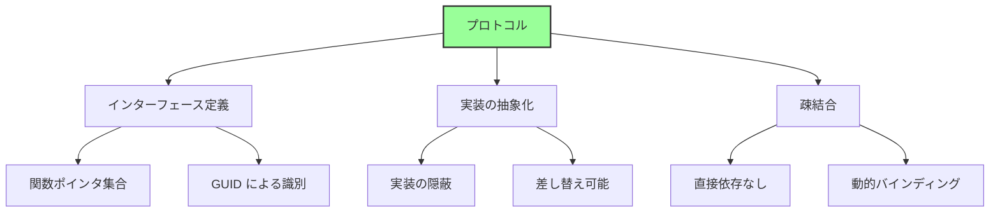
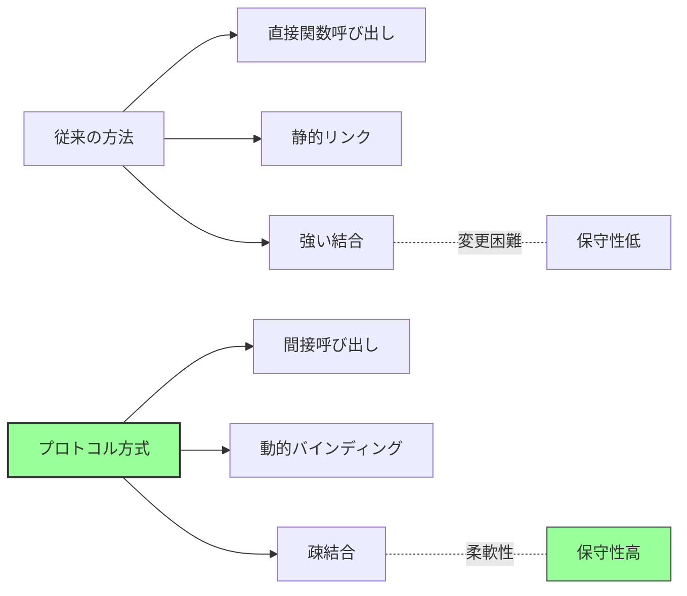
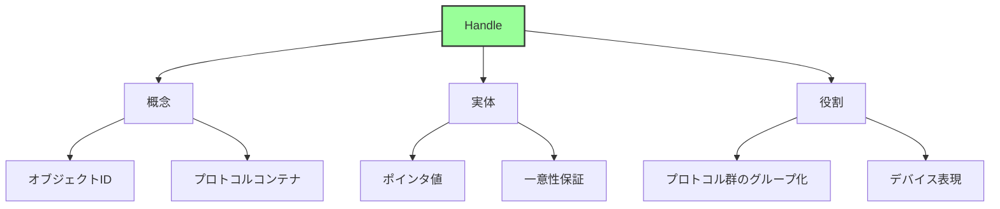
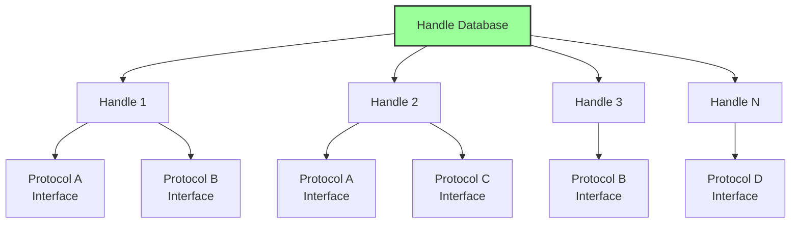
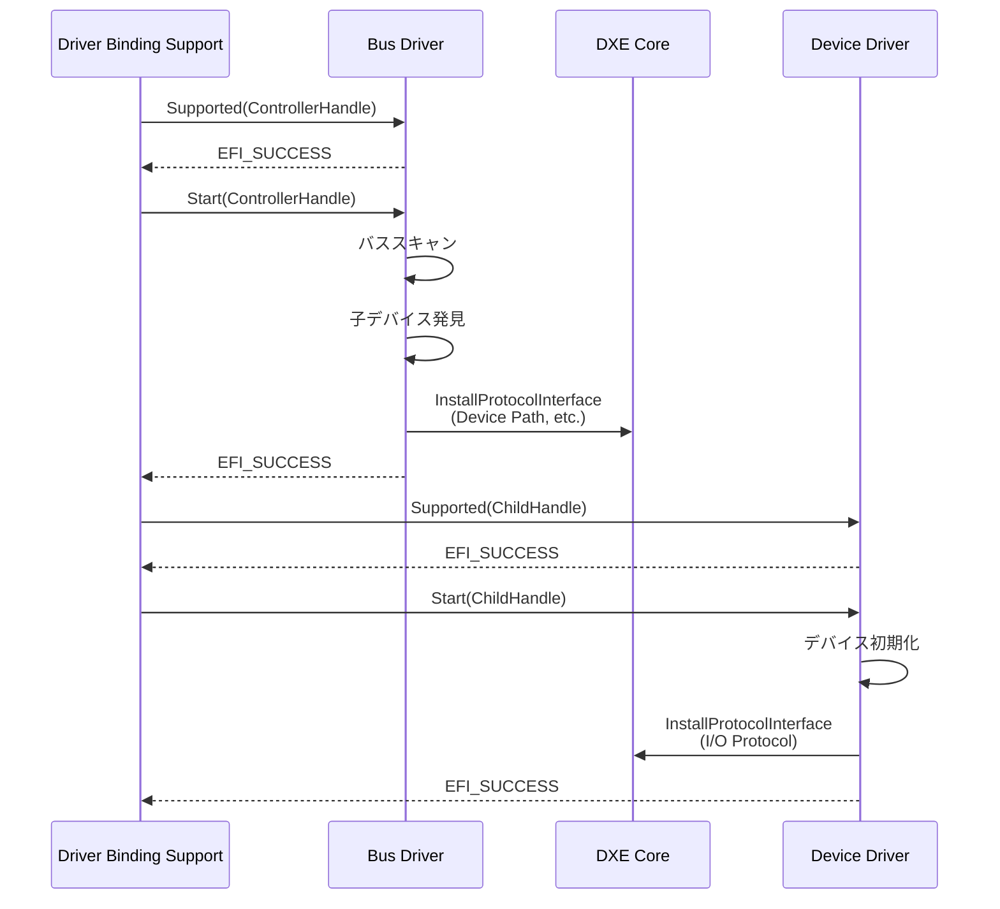
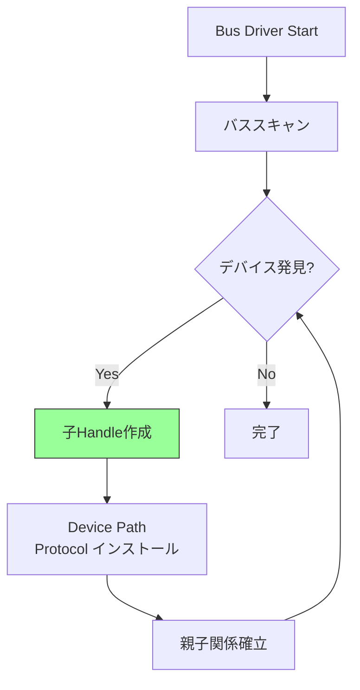
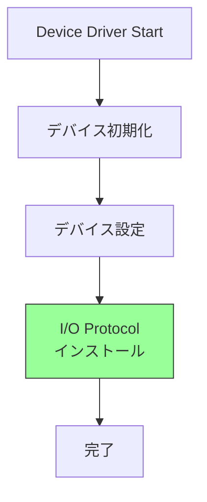
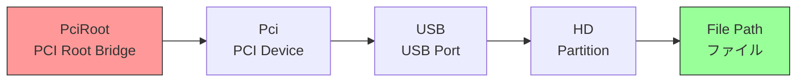
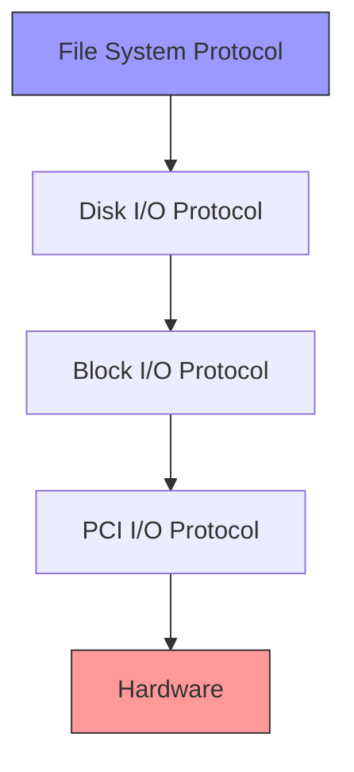
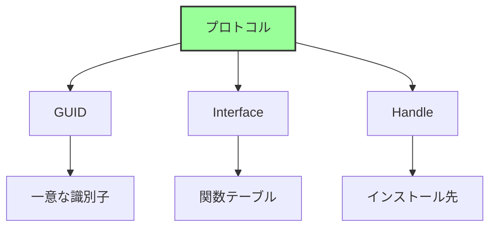

# プロトコルとドライバモデル

🎯 **この章で学ぶこと**
- UEFI プロトコルの仕組みと設計思想
- UEFI Driver Model の詳細
- Handle Database とプロトコルデータベース
- ドライバの種類と役割分担

📚 **前提知識**
- EDK II アーキテクチャ（前章）
- DXE Phase の役割（Part I）

---

## プロトコルの基本概念

### プロトコルとは

**プロトコル (Protocol)** は、UEFI における**サービス提供の標準インターフェース**です。



### プロトコルの構造

**プロトコルの定義例 (Simple Text Output):**

```c
// プロトコル GUID
#define EFI_SIMPLE_TEXT_OUTPUT_PROTOCOL_GUID \
  { 0x387477c2, 0x69c7, 0x11d2, \
    { 0x8e, 0x39, 0x0, 0xa0, 0xc9, 0x69, 0x72, 0x3b }}

// プロトコルインターフェース
typedef struct _EFI_SIMPLE_TEXT_OUTPUT_PROTOCOL {
  EFI_TEXT_RESET              Reset;
  EFI_TEXT_STRING             OutputString;
  EFI_TEXT_TEST_STRING        TestString;
  EFI_TEXT_QUERY_MODE         QueryMode;
  EFI_TEXT_SET_MODE           SetMode;
  EFI_TEXT_SET_ATTRIBUTE      SetAttribute;
  EFI_TEXT_CLEAR_SCREEN       ClearScreen;
  EFI_TEXT_SET_CURSOR_POSITION SetCursorPosition;
  EFI_TEXT_ENABLE_CURSOR      EnableCursor;
  SIMPLE_TEXT_OUTPUT_MODE     *Mode;
} EFI_SIMPLE_TEXT_OUTPUT_PROTOCOL;

// 関数プロトタイプ
typedef
EFI_STATUS
(EFIAPI *EFI_TEXT_STRING)(
  IN EFI_SIMPLE_TEXT_OUTPUT_PROTOCOL  *This,
  IN CHAR16                           *String
  );
```

**プロトコルの3要素:**

| 要素 | 説明 |
|------|------|
| **GUID** | プロトコルの識別子 |
| **Interface** | 関数テーブル（構造体） |
| **Handle** | プロトコルがインストールされるオブジェクト |

### プロトコルの設計思想



**プロトコルの利点:**
- **実装の隠蔽**: インターフェースのみ公開
- **動的な機能追加**: 実行時にプロトコル追加可能
- **複数実装の共存**: 同じインターフェースの異なる実装
- **テストの容易性**: モックプロトコルでテスト可能

## Handle Database

### Handle とは

**Handle** は、プロトコルがインストールされる**オブジェクトの識別子**です。



**Handle の例:**

```c
// Handle は EFI_HANDLE 型（実体は void*）
typedef VOID  *EFI_HANDLE;

// 使用例
EFI_HANDLE  ImageHandle;   // アプリケーション自身
EFI_HANDLE  DeviceHandle;  // デバイス
EFI_HANDLE  ControllerHandle; // コントローラ
```

### Handle Database の構造

**Handle Database は、DXE Core が管理する中央レジストリです。**



**データ構造の概念:**

```c
// 概念的な構造（実装は異なる）
typedef struct {
  LIST_ENTRY        Link;          // Handle のリスト
  UINTN             Key;            // Handle 値
  LIST_ENTRY        Protocols;     // このHandleのプロトコル一覧
} IHANDLE;

typedef struct {
  UINTN             Signature;
  IHANDLE           *Handle;        // 所属する Handle
  EFI_GUID          *Protocol;      // プロトコル GUID
  VOID              *Interface;     // プロトコル実装
  LIST_ENTRY        Link;
  LIST_ENTRY        ByProtocol;     // 同じプロトコルのリスト
} PROTOCOL_ENTRY;
```

### Boot Services でのプロトコル操作

**プロトコル管理関数:**

```c
// プロトコルのインストール
EFI_STATUS
InstallProtocolInterface (
  IN OUT EFI_HANDLE     *Handle,
  IN     EFI_GUID       *Protocol,
  IN     EFI_INTERFACE_TYPE InterfaceType,
  IN     VOID           *Interface
  );

// プロトコルのアンインストール
EFI_STATUS
UninstallProtocolInterface (
  IN EFI_HANDLE         Handle,
  IN EFI_GUID           *Protocol,
  IN VOID               *Interface
  );

// プロトコルの検索
EFI_STATUS
LocateProtocol (
  IN  EFI_GUID  *Protocol,
  IN  VOID      *Registration OPTIONAL,
  OUT VOID      **Interface
  );

// Handle の取得
EFI_STATUS
LocateHandleBuffer (
  IN     EFI_LOCATE_SEARCH_TYPE SearchType,
  IN     EFI_GUID               *Protocol OPTIONAL,
  IN     VOID                   *SearchKey OPTIONAL,
  OUT    UINTN                  *NoHandles,
  OUT    EFI_HANDLE             **Buffer
  );
```

**使用例:**

```c
// プロトコルの検索と使用
EFI_SIMPLE_TEXT_OUTPUT_PROTOCOL  *TextOut;
EFI_STATUS                        Status;

Status = gBS->LocateProtocol (
                &gEfiSimpleTextOutputProtocolGuid,
                NULL,
                (VOID**)&TextOut
                );
if (!EFI_ERROR (Status)) {
  TextOut->OutputString (TextOut, L"Hello, UEFI!\r\n");
}
```

## UEFI Driver Model

### Driver Model の概要

**UEFI Driver Model** は、ドライバとデバイスを**動的に接続**する仕組みです。

```mermaid
graph TB
    A[UEFI Driver Model] --> B[設計原則]
    A --> C[コンポーネント]
    A --> D[動作フロー]

    B --> B1[バスドライバと<br/>デバイスドライバ分離]
    B --> B2[動的バインディング]
    B --> B3[階層的構造]

    C --> C1[Bus Driver]
    C --> C2[Device Driver]
    C --> C3[Hybrid Driver]

    D --> D1[Supported()]
    D --> D2[Start()]
    D --> D3[Stop()]

    style A fill:#9f9,stroke:#333,stroke-width:2px
```

### Driver Binding Protocol

**ドライバの基本インターフェース:**

```c
typedef struct _EFI_DRIVER_BINDING_PROTOCOL {
  EFI_DRIVER_BINDING_SUPPORTED  Supported;
  EFI_DRIVER_BINDING_START      Start;
  EFI_DRIVER_BINDING_STOP       Stop;
  UINT32                        Version;
  EFI_HANDLE                    ImageHandle;
  EFI_HANDLE                    DriverBindingHandle;
} EFI_DRIVER_BINDING_PROTOCOL;
```

**3つの必須関数:**

| 関数 | 役割 | 戻り値 |
|------|------|--------|
| `Supported()` | デバイス対応確認 | EFI_SUCCESS: 対応可能<br/>EFI_UNSUPPORTED: 非対応 |
| `Start()` | ドライバ起動 | EFI_SUCCESS: 起動成功<br/>エラー: 起動失敗 |
| `Stop()` | ドライバ停止 | EFI_SUCCESS: 停止成功 |

### ドライバとデバイスの接続フロー



## ドライバの種類

### 1. Bus Driver (バスドライバ)

**役割:**
- バスをスキャンして子デバイスを発見
- 子デバイス用の Handle 作成
- Device Path Protocol 公開

**例:**
- PCI Bus Driver
- USB Bus Driver
- SCSI Bus Driver

**処理フロー:**



**PCI Bus Driver の例:**

```c
// Supported() - PCI Root Bridge I/O Protocol が必要
EFI_STATUS
EFIAPI
PciBusDriverBindingSupported (
  IN EFI_DRIVER_BINDING_PROTOCOL  *This,
  IN EFI_HANDLE                   Controller,
  IN EFI_DEVICE_PATH_PROTOCOL     *RemainingDevicePath
  )
{
  EFI_STATUS                     Status;
  EFI_PCI_ROOT_BRIDGE_IO_PROTOCOL *PciRootBridgeIo;

  // PCI Root Bridge I/O Protocol を取得
  Status = gBS->OpenProtocol (
                  Controller,
                  &gEfiPciRootBridgeIoProtocolGuid,
                  (VOID**)&PciRootBridgeIo,
                  This->DriverBindingHandle,
                  Controller,
                  EFI_OPEN_PROTOCOL_BY_DRIVER
                  );

  if (EFI_ERROR (Status)) {
    return EFI_UNSUPPORTED;
  }

  gBS->CloseProtocol (
         Controller,
         &gEfiPciRootBridgeIoProtocolGuid,
         This->DriverBindingHandle,
         Controller
         );

  return EFI_SUCCESS;
}

// Start() - PCI デバイス列挙
EFI_STATUS
EFIAPI
PciBusDriverBindingStart (
  IN EFI_DRIVER_BINDING_PROTOCOL  *This,
  IN EFI_HANDLE                   Controller,
  IN EFI_DEVICE_PATH_PROTOCOL     *RemainingDevicePath
  )
{
  // 1. PCI Root Bridge I/O Protocol 取得
  // 2. PCI バススキャン
  // 3. 各 PCI デバイス用の Handle 作成
  // 4. Device Path Protocol インストール
  // 5. PCI I/O Protocol インストール
  //...
}
```

### 2. Device Driver (デバイスドライバ)

**役割:**
- 特定のデバイスを制御
- I/O Protocol 提供
- 上位層へのサービス公開

**例:**
- USB Mass Storage Driver
- Network Interface Card Driver
- Video Graphics Driver

**処理フロー:**



**USB Mass Storage Driver の例:**

```c
// Supported() - USB I/O Protocol が必要で、Mass Storage クラス
EFI_STATUS
EFIAPI
UsbMassStorageSupported (
  IN EFI_DRIVER_BINDING_PROTOCOL  *This,
  IN EFI_HANDLE                   Controller,
  IN EFI_DEVICE_PATH_PROTOCOL     *RemainingDevicePath
  )
{
  EFI_USB_IO_PROTOCOL              *UsbIo;
  EFI_USB_INTERFACE_DESCRIPTOR     InterfaceDescriptor;

  // USB I/O Protocol 取得
  Status = gBS->OpenProtocol (
                  Controller,
                  &gEfiUsbIoProtocolGuid,
                  (VOID**)&UsbIo,
                  //...
                  );

  // Interface Descriptor 取得
  UsbIo->UsbGetInterfaceDescriptor (UsbIo, &InterfaceDescriptor);

  // Mass Storage クラス (0x08) をチェック
  if (InterfaceDescriptor.InterfaceClass != 0x08) {
    return EFI_UNSUPPORTED;
  }

  return EFI_SUCCESS;
}

// Start() - Mass Storage デバイス初期化
EFI_STATUS
EFIAPI
UsbMassStorageStart (
  IN EFI_DRIVER_BINDING_PROTOCOL  *This,
  IN EFI_HANDLE                   Controller,
  IN EFI_DEVICE_PATH_PROTOCOL     *RemainingDevicePath
  )
{
  // 1. デバイス初期化
  // 2. Block I/O Protocol インストール
  // 3. Disk I/O Protocol インストール
  //...
}
```

### 3. Hybrid Driver (ハイブリッドドライバ)

**役割:**
- Bus Driver と Device Driver の機能を兼ねる
- 子デバイス列挙と自身のサービス提供

**例:**
- Serial I/O Driver (UART Bus + Terminal)
- Graphics Output Protocol Driver

### 4. Service Driver (サービスドライバ)

**役割:**
- ハードウェアに依存しない純粋なサービス提供
- Handle を持たない場合もある

**例:**
- UEFI Shell
- Network Protocol Stack (TCP/IP)
- File System Driver (FAT, ext4)

**Driver Binding Protocol を使用しない:**

```c
// エントリポイントでプロトコル直接インストール
EFI_STATUS
EFIAPI
ServiceDriverEntryPoint (
  IN EFI_HANDLE        ImageHandle,
  IN EFI_SYSTEM_TABLE  *SystemTable
  )
{
  EFI_HANDLE  Handle = NULL;

  // プロトコルをインストール
  return gBS->InstallProtocolInterface (
                &Handle,
                &gMyServiceProtocolGuid,
                EFI_NATIVE_INTERFACE,
                &mMyServiceProtocol
                );
}
```

## Device Path Protocol

### Device Path の役割

**Device Path** は、デバイスの**階層的な位置**を表現します。



### Device Path の構造

```c
typedef struct {
  UINT8  Type;        // デバイスパスのタイプ
  UINT8  SubType;     // サブタイプ
  UINT8  Length[2];   // このノードの長さ
} EFI_DEVICE_PATH_PROTOCOL;

// 例: PCI Device Path
typedef struct {
  EFI_DEVICE_PATH_PROTOCOL  Header;
  UINT8                     Function;  // PCI 機能番号
  UINT8                     Device;    // PCI デバイス番号
} PCI_DEVICE_PATH;
```

**Device Path の例:**

```
PciRoot(0x0)/Pci(0x1F,0x2)/Sata(0x0,0x0,0x0)/HD(1,GPT,<GUID>,0x800,0x100000)/\EFI\BOOT\BOOTX64.EFI

解釈:
1. PciRoot(0x0)          - PCI Root Bridge 0
2. Pci(0x1F,0x2)         - PCI デバイス 31, 機能 2 (SATA Controller)
3. Sata(0x0,0x0,0x0)     - SATA ポート 0
4. HD(1,GPT,<GUID>,...) - パーティション 1 (GPT)
5. \EFI\BOOT\BOOTX64.EFI - ファイルパス
```

### Device Path の種類

| Type | 説明 | 例 |
|------|------|-----|
| 0x01 | Hardware Device Path | PCI, MemoryMapped |
| 0x02 | ACPI Device Path | ACPI, PciRoot |
| 0x03 | Messaging Device Path | USB, SATA, Network |
| 0x04 | Media Device Path | HardDrive, CDROM, FilePath |
| 0x05 | BIOS Boot Specification | Legacy Boot |
| 0x7F | End of Device Path | End |

## プロトコルの応用パターン

### 1. プロトコルの階層化

**レイヤードアーキテクチャ:**



**例: ファイル読み込みの流れ**

```
Application
  ↓ File System Protocol (FAT Driver)
Disk I/O Protocol
  ↓ Partition Driver
Block I/O Protocol
  ↓ SATA Driver
PCI I/O Protocol
  ↓ PCI Bus Driver
Hardware (SATA Controller)
```

### 2. プロトコル通知 (Notify)

**イベント駆動のプロトコル検出:**

```c
EFI_EVENT  Event;
VOID       *Registration;

// プロトコルインストール時に通知
gBS->CreateEvent (
       EVT_NOTIFY_SIGNAL,
       TPL_CALLBACK,
       MyNotifyFunction,
       NULL,
       &Event
       );

gBS->RegisterProtocolNotify (
       &gEfiBlockIoProtocolGuid,
       Event,
       &Registration
       );

// Notify Function
VOID
EFIAPI
MyNotifyFunction (
  IN EFI_EVENT  Event,
  IN VOID       *Context
  )
{
  // 新しい Block I/O Protocol が追加された
  // 処理を実行
}
```

### 3. Protocol Override (上書き)

**既存プロトコルの置き換え:**

```c
// 元のプロトコル取得
EFI_SIMPLE_TEXT_OUTPUT_PROTOCOL  *OriginalTextOut;
gBS->HandleProtocol (
       gST->ConsoleOutHandle,
       &gEfiSimpleTextOutputProtocolGuid,
       (VOID**)&OriginalTextOut
       );

// 新しいプロトコルで上書き
MY_TEXT_OUTPUT_PROTOCOL  *MyTextOut;
MyTextOut->Original = OriginalTextOut;  // 元を保存

gBS->ReinstallProtocolInterface (
       gST->ConsoleOutHandle,
       &gEfiSimpleTextOutputProtocolGuid,
       OriginalTextOut,
       MyTextOut
       );
```

## OpenProtocol と CloseProtocol

### OpenProtocol の役割

**プロトコルへの安全なアクセス:**

```c
EFI_STATUS
OpenProtocol (
  IN  EFI_HANDLE                Handle,
  IN  EFI_GUID                  *Protocol,
  OUT VOID                      **Interface OPTIONAL,
  IN  EFI_HANDLE                AgentHandle,
  IN  EFI_HANDLE                ControllerHandle,
  IN  UINT32                    Attributes
  );
```

**Attributes の種類:**

| Attribute | 説明 | 用途 |
|-----------|------|------|
| `BY_HANDLE_PROTOCOL` | 情報取得のみ | 読み取り専用 |
| `GET_PROTOCOL` | 取得のみ | 非独占アクセス |
| `TEST_PROTOCOL` | 存在確認 | テスト用 |
| `BY_CHILD_CONTROLLER` | 子コントローラ | 親子関係 |
| `BY_DRIVER` | ドライバ使用 | 排他制御 |
| `EXCLUSIVE` | 排他的使用 | 独占アクセス |

### 使用例

**ドライバでの典型的な使用:**

```c
// Supported() - テストアクセス
EFI_STATUS
MyDriverSupported (
  IN EFI_DRIVER_BINDING_PROTOCOL  *This,
  IN EFI_HANDLE                   Controller,
  IN EFI_DEVICE_PATH_PROTOCOL     *RemainingDevicePath
  )
{
  EFI_PCI_IO_PROTOCOL  *PciIo;
  EFI_STATUS           Status;

  // テストアクセス（排他制御なし）
  Status = gBS->OpenProtocol (
                  Controller,
                  &gEfiPciIoProtocolGuid,
                  (VOID**)&PciIo,
                  This->DriverBindingHandle,
                  Controller,
                  EFI_OPEN_PROTOCOL_BY_DRIVER
                  );

  if (EFI_ERROR (Status)) {
    return EFI_UNSUPPORTED;
  }

  // 使用後は必ず Close
  gBS->CloseProtocol (
         Controller,
         &gEfiPciIoProtocolGuid,
         This->DriverBindingHandle,
         Controller
         );

  return EFI_SUCCESS;
}

// Start() - 実使用
EFI_STATUS
MyDriverStart (
  IN EFI_DRIVER_BINDING_PROTOCOL  *This,
  IN EFI_HANDLE                   Controller,
  IN EFI_DEVICE_PATH_PROTOCOL     *RemainingDevicePath
  )
{
  EFI_PCI_IO_PROTOCOL  *PciIo;

  // 排他的にオープン（他のドライバは使用不可）
  Status = gBS->OpenProtocol (
                  Controller,
                  &gEfiPciIoProtocolGuid,
                  (VOID**)&PciIo,
                  This->DriverBindingHandle,
                  Controller,
                  EFI_OPEN_PROTOCOL_BY_DRIVER | EFI_OPEN_PROTOCOL_EXCLUSIVE
                  );

  // 使用...

  // Stop() で Close する
}
```

## まとめ

この章では、プロトコルとドライバモデルの詳細を説明しました。

**重要なポイント:**

**プロトコルの仕組み:**



**UEFI Driver Model:**

| コンポーネント | 役割 |
|--------------|------|
| **Bus Driver** | バススキャン、子デバイス作成 |
| **Device Driver** | デバイス制御、I/O Protocol 提供 |
| **Hybrid Driver** | Bus + Device の機能 |
| **Service Driver** | ハードウェア非依存のサービス |

**Driver Binding Protocol:**
- `Supported()`: デバイス対応確認
- `Start()`: ドライバ起動、プロトコルインストール
- `Stop()`: ドライバ停止、リソース解放

**Device Path:**
- デバイスの階層的位置表現
- ブートデバイス特定に使用
- Type/SubType による分類

**Handle Database:**
- DXE Core が管理
- Handle → Protocols のマッピング
- OpenProtocol/CloseProtocol で排他制御

---

**次章では、ライブラリアーキテクチャの詳細を見ていきます。**

📚 **参考資料**
- [UEFI Specification v2.10 - Chapter 7: Protocol Handler Services](https://uefi.org/specifications)
- [UEFI Specification v2.10 - Chapter 10: Device Path Protocol](https://uefi.org/specifications)
- [UEFI Driver Writer's Guide](https://github.com/tianocore-docs/edk2-UefiDriverWritersGuide)
- [EDK II Module Writer's Guide - Protocol Usage](https://tianocore-docs.github.io/edk2-ModuleWriteGuide/)
