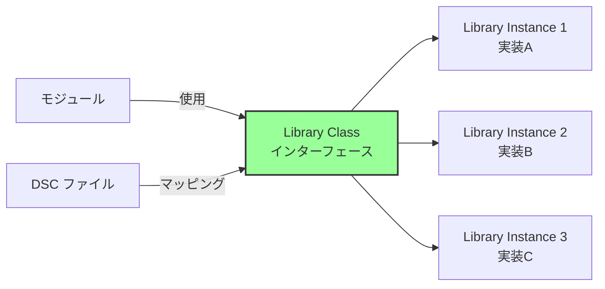
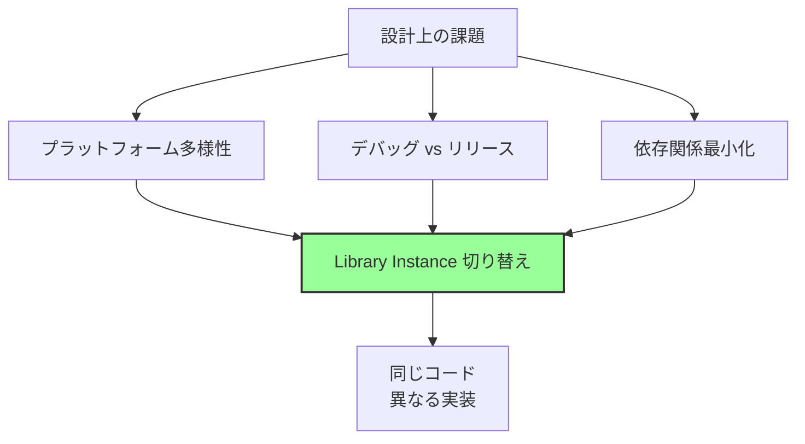
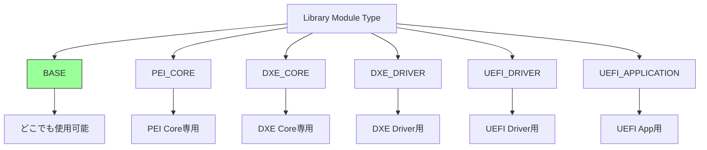
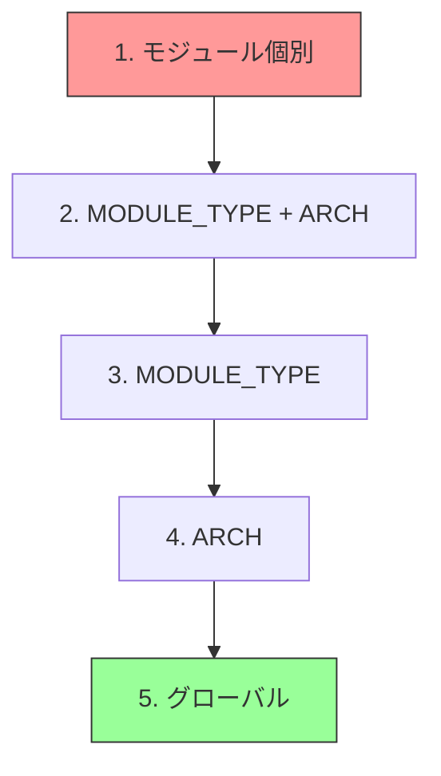
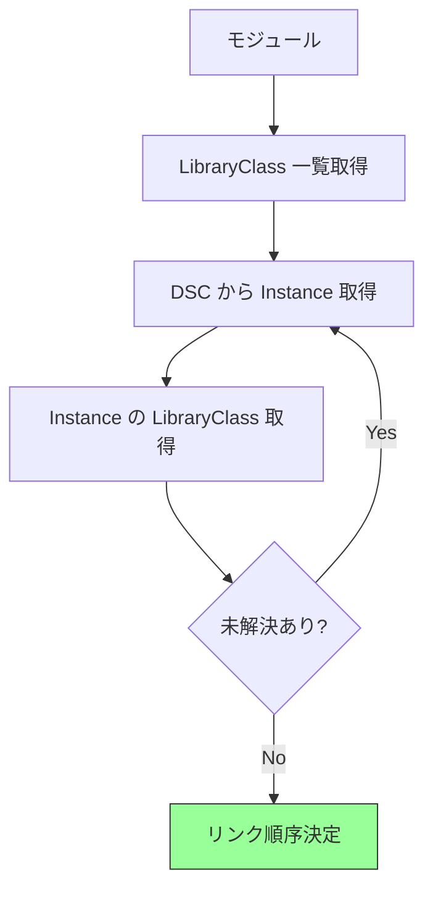
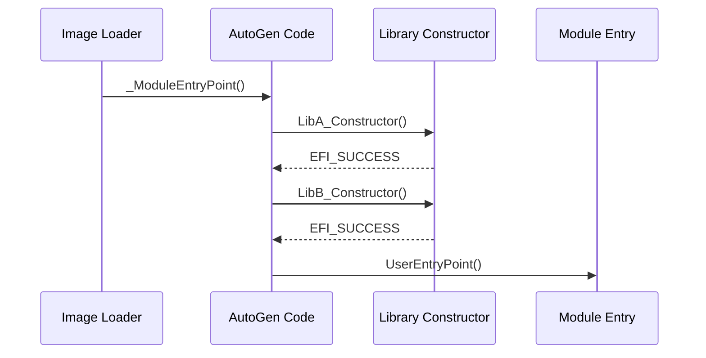
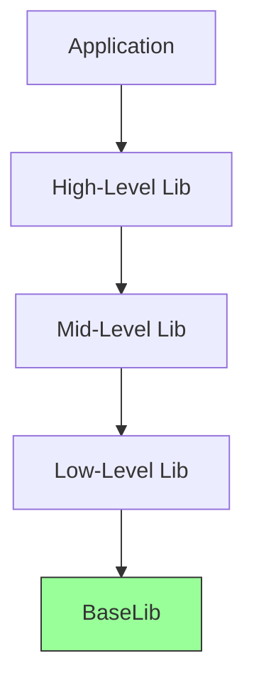
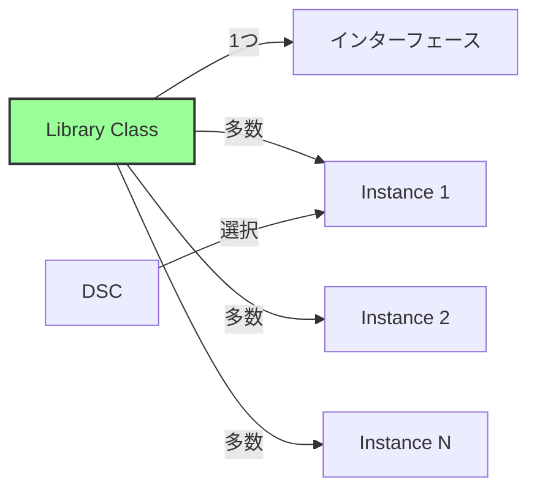

# ライブラリアーキテクチャ

🎯 **この章で学ぶこと**
- Library Class と Library Instance の概念
- ライブラリの種類と用途
- ライブラリマッピングの仕組み
- コンストラクタとデストラクタ

📚 **前提知識**
- モジュール構造（第2章）
- ビルドシステム（第2章）

---

## ライブラリの基本概念

### Library Class vs Library Instance

EDK II のライブラリシステムは、インターフェースと実装を明確に分離する設計を採用しています。この 設計パターンは、オブジェクト指向プログラミングにおけるインターフェースと実装クラスの関係に似ており、柔軟性と再利用性を大幅に向上させます。EDK II では、Library Class がインターフェースを定義し、Library Instance がその実装を提供します。一つの Library Class に対して、複数の Library Instance を作成でき、ビルド時に適切な Instance を選択できます。

Library Class (ライブラリクラス) は、インターフェースの定義を担当します。Library Class は、関数プロトタイプのみを定義し、具体的な実装は含みません。Library Class は、ヘッダファイル (.h) で宣言され、パッケージ宣言ファイル (DEC) に登録されます。これにより、モジュールは Library Class に依存することを宣言でき、具体的な実装を知る必要がありません。例えば、DebugLib という Library Class は、デバッグ出力の関数プロトタイプを定義しますが、実際に出力がシリアルポートに送られるか、コンソールに表示されるか、または何もしないかは、選択される Library Instance によって決まります。

Library Instance (ライブラリインスタンス) は、Library Class の具体的な実装を提供します。Library Instance は、ソースコード (.c) とモジュール情報ファイル (.inf) で構成され、Library Class で定義されたすべての関数を実装します。一つの Library Class に対して、複数の Library Instance を作成でき、それぞれ異なる実装戦略を採用できます。例えば、DebugLib には、BaseDebugLibNull (何もしない)、BaseDebugLibSerialPort (シリアルポート出力)、UefiDebugLibConOut (コンソール出力) などの複数の Instance があります。プラットフォーム記述ファイル (DSC) で、各モジュールがどの Library Instance を使用するかをマッピングします。

この分離設計により、モジュールは Library Class に依存するだけで、具体的な実装を知る必要がありません。ビルド時に、DSC ファイルで指定された Library Instance がリンクされ、最終的な実行ファイルが生成されます。したがって、同じモジュールのソースコードを変更することなく、異なるプラットフォームやビルド構成で異なる実装を使用できます。これは、EDK II の移植性と柔軟性の基盤です。

**補足図**: 以下の図は、Library Class と Library Instance の関係を示したものです。



### なぜこの設計なのか

Library Class と Library Instance の分離設計は、EDK II が直面する複数の設計上の課題を解決します。これらの課題は、UEFI ファームウェアの本質的な複雑性から生じており、単純な静的リンクやモノリシックな実装では対応できません。主要な課題として、プラットフォーム多様性、デバッグとリリースの要件の違い、そして依存関係の最小化があります。

第一の課題は、**プラットフォーム多様性**です。UEFI ファームウェアは、x86_64、ARM64、RISC-V など、複数のアーキテクチャで動作する必要があります。さらに、同じアーキテクチャ内でも、異なるチップセットやボードが存在します。Library Instance の切り替えにより、プラットフォーム固有のコードをモジュール本体から分離でき、同じモジュールのソースコードを異なるプラットフォームで再利用できます。例えば、TimerLib は、プラットフォームごとに異なるタイマーハードウェアにアクセスしますが、モジュールは TimerLib の共通インターフェースのみに依存します。

第二の課題は、**デバッグとリリースの要件の違い**です。デバッグビルドでは、詳細なログ出力やアサーション検証が必要ですが、リリースビルドではこれらのオーバーヘッドを排除したい場合があります。Library Instance の切り替えにより、DebugLib を BaseDebugLibSerialPort (デバッグビルド) から BaseDebugLibNull (リリースビルド) に変更するだけで、モジュールのソースコードを変更することなく、デバッグ出力を有効化または無効化できます。これにより、開発効率とリリース版のパフォーマンスの両立が可能になります。

第三の課題は、**依存関係の最小化**です。モジュールが具体的な実装に直接依存すると、そのモジュールは特定のプラットフォームやビルド構成に縛られます。Library Class への依存により、モジュールはインターフェースのみに依存し、実装の詳細から独立します。これにより、依存関係グラフがシンプルになり、循環依存を避けることができます。さらに、テスト時にモックライブラリを使用でき、単体テストが容易になります。

これらの設計上の利点により、EDK II は高い柔軟性と移植性を実現しています。**ビルド時の柔軟性**により、DSC ファイルで Library Instance を選択するだけで、異なる実装を使用できます。**移植性**により、プラットフォーム固有の実装を新しい Library Instance として追加するだけで、新しいプラットフォームをサポートできます。**テスト容易性**により、モックライブラリを使用して、モジュールを独立してテストできます。**最適化**により、状況に応じた最適な実装を選択でき、パフォーマンスとコードサイズのバランスを調整できます。

**補足図**: 以下の図は、Library Instance 切り替えによる課題解決を示したものです。



## 主要な Library Class

### 1. BaseLib

**最も基本的なライブラリ:**

```c
// 文字列操作
UINTN StrLen (CONST CHAR16 *String);
INTN StrCmp (CONST CHAR16 *FirstString, CONST CHAR16 *SecondString);

// メモリ操作
VOID* CopyMem (VOID *Destination, CONST VOID *Source, UINTN Length);
VOID* SetMem (VOID *Buffer, UINTN Size, UINT8 Value);
INTN CompareMem (CONST VOID *Destination, CONST VOID *Source, UINTN Length);

// CPU アーキテクチャ固有
VOID CpuPause (VOID);
VOID CpuBreakpoint (VOID);
UINT64 AsmReadMsr64 (UINT32 Index);
VOID AsmWriteMsr64 (UINT32 Index, UINT64 Value);
```

**特徴:**
- すべてのモジュールで使用可能
- アーキテクチャ依存部分はアセンブリで実装
- C ランタイムライブラリに依存しない

### 2. DebugLib

**デバッグ出力用ライブラリ:**

```c
#define DEBUG(Expression)   DebugPrint Expression
#define ASSERT(Expression)  \
  do { \
    if (!(Expression)) { \
      DebugAssert (__FILE__, __LINE__, #Expression); \
    } \
  } while (FALSE)

// 実装
VOID DebugPrint (
  IN UINTN        ErrorLevel,
  IN CONST CHAR8  *Format,
  ...
  );
```

**複数のインスタンス:**

| Instance | 動作 | 用途 |
|----------|------|------|
| BaseDebugLibNull | 何もしない | リリースビルド |
| BaseDebugLibSerialPort | シリアル出力 | 実機デバッグ |
| UefiDebugLibConOut | コンソール出力 | UEFI環境デバッグ |
| UefiDebugLibStdErr | StdErr出力 | アプリケーション |

**マッピング例:**

```ini
[LibraryClasses]
  # デフォルト: 出力なし
  DebugLib|MdePkg/Library/BaseDebugLibNull/BaseDebugLibNull.inf

[LibraryClasses.X64.DEBUG]
  # DEBUG ビルド: シリアル出力
  DebugLib|MdePkg/Library/BaseDebugLibSerialPort/BaseDebugLibSerialPort.inf
```

### 3. MemoryAllocationLib

**メモリ割り当てライブラリ:**

```c
// Pool メモリ
VOID* AllocatePool (IN UINTN AllocationSize);
VOID* AllocateZeroPool (IN UINTN AllocationSize);
VOID FreePool (IN VOID *Buffer);

// Pages メモリ
VOID* AllocatePages (IN UINTN Pages);
VOID* AllocateAlignedPages (IN UINTN Pages, IN UINTN Alignment);
VOID FreePages (IN VOID *Buffer, IN UINTN Pages);
```

**インスタンスの違い:**

| Instance | 使用API | フェーズ |
|----------|---------|---------|
| PeiMemoryAllocationLib | PEI Services | PEI |
| UefiMemoryAllocationLib | Boot Services | DXE/BDS |
| MemoryAllocationLibNull | 失敗を返す | テスト用 |

### 4. IoLib

**I/O アクセスライブラリ:**

```c
// I/O ポート
UINT8 IoRead8 (IN UINTN Port);
VOID IoWrite8 (IN UINTN Port, IN UINT8 Value);

// MMIO
UINT32 MmioRead32 (IN UINTN Address);
VOID MmioWrite32 (IN UINTN Address, IN UINT32 Value);

// ビット操作
UINT32 MmioOr32 (IN UINTN Address, IN UINT32 OrData);
UINT32 MmioAnd32 (IN UINTN Address, IN UINT32 AndData);
```

**アーキテクチャ別実装:**

```
BaseIoLibIntrinsic/
├── IoLibGcc.c          # GCC用 (x86)
├── IoLibMsc.c          # MSVC用 (x86)
├── IoLibArm.c          # ARM用
├── IoLibArmVirt.c      # ARM仮想化用
└── ...
```

### 5. PrintLib

**文字列フォーマットライブラリ:**

```c
UINTN UnicodeSPrint (
  OUT CHAR16        *StartOfBuffer,
  IN  UINTN         BufferSize,
  IN  CONST CHAR16  *FormatString,
  ...
  );

UINTN AsciiSPrint (
  OUT CHAR8        *StartOfBuffer,
  IN  UINTN        BufferSize,
  IN  CONST CHAR8  *FormatString,
  ...
  );
```

**フォーマット指定子:**

| 指定子 | 型 | 説明 |
|--------|-----|------|
| `%s` | CHAR8* | ASCII 文字列 |
| `%S` | CHAR16* | Unicode 文字列 |
| `%d` | INT32 | 10進整数 |
| `%x` | UINT32 | 16進整数(小文字) |
| `%X` | UINT32 | 16進整数(大文字) |
| `%g` | EFI_GUID* | GUID |

### 6. UefiBootServicesTableLib / UefiRuntimeServicesTableLib

**UEFI サービステーブルアクセス:**

```c
// グローバル変数として提供
extern EFI_BOOT_SERVICES       *gBS;
extern EFI_RUNTIME_SERVICES    *gRT;
extern EFI_SYSTEM_TABLE        *gST;

// 使用例
gBS->AllocatePool (EfiBootServicesData, Size, &Buffer);
gRT->GetTime (&Time, NULL);
```

**依存関係:**
- DXE/UEFI フェーズでのみ使用可能
- PEI では使用不可（PeiServicesTableLib を使用）

## ライブラリの種類

### Module Type による分類



**BASE ライブラリ:**
- UEFI サービスに依存しない
- どのフェーズでも使用可能
- 例: BaseLib, PrintLib

**フェーズ固有ライブラリ:**
- 特定フェーズのサービスを使用
- そのフェーズでのみ使用可能
- 例: UefiBootServicesTableLib (DXE以降)

### 機能による分類

**1. Utility Libraries (ユーティリティ)**

| Library | 機能 |
|---------|------|
| BaseLib | 基本操作 (文字列、メモリ、CPU) |
| PrintLib | 文字列フォーマット |
| DevicePathLib | Device Path 操作 |
| SafeIntLib | 安全な整数演算 |

**2. Hardware Access Libraries (ハードウェアアクセス)**

| Library | 機能 |
|---------|------|
| IoLib | I/O ポート、MMIO |
| PciLib | PCI Configuration Space |
| SmbusLib | SMBus アクセス |
| TimerLib | タイマー操作 |

**3. Protocol Libraries (プロトコルラッパー)**

| Library | 機能 |
|---------|------|
| UefiLib | UEFI 汎用ヘルパー |
| DxeServicesLib | DXE Services ラッパー |
| DxeServicesTableLib | DXE Services Table |
| HobLib | HOB 操作 |

**4. Platform Libraries (プラットフォーム固有)**

| Library | 機能 |
|---------|------|
| PlatformBdsLib | BDS ポリシー |
| PlatformBootManagerLib | ブート管理 |
| OemHookStatusCodeLib | Status Code フック |

## Library Class の定義

### DEC ファイルでの宣言

```ini
[LibraryClasses]
  ##  @libraryclass  基本的な文字列・メモリ操作を提供
  BaseLib|Include/Library/BaseLib.h

  ##  @libraryclass  デバッグ出力機能を提供
  DebugLib|Include/Library/DebugLib.h

  ##  @libraryclass  メモリ割り当て機能を提供
  MemoryAllocationLib|Include/Library/MemoryAllocationLib.h
```

**ヘッダファイルの内容:**

```c
// Include/Library/DebugLib.h
#ifndef __DEBUG_LIB_H__
#define __DEBUG_LIB_H__

// デバッグレベル
#define DEBUG_INIT      0x00000001
#define DEBUG_WARN      0x00000002
#define DEBUG_LOAD      0x00000004
#define DEBUG_ERROR     0x80000000

// 関数プロトタイプ
VOID
EFIAPI
DebugPrint (
  IN  UINTN        ErrorLevel,
  IN  CONST CHAR8  *Format,
  ...
  );

VOID
EFIAPI
DebugAssert (
  IN CONST CHAR8  *FileName,
  IN UINTN        LineNumber,
  IN CONST CHAR8  *Description
  );

// マクロ
#define DEBUG(Expression)   DebugPrint Expression
#define ASSERT(Expression)  \
  do { \
    if (!(Expression)) { \
      DebugAssert (__FILE__, __LINE__, #Expression); \
    } \
  } while (FALSE)

#endif
```

## Library Instance の実装

### INF ファイルの構造

```ini
[Defines]
  INF_VERSION                    = 0x00010005
  BASE_NAME                      = BaseDebugLibSerialPort
  FILE_GUID                      = BB83F95F-EDBC-4884-A520-CD42AF388FAE
  MODULE_TYPE                    = BASE
  VERSION_STRING                 = 1.0
  LIBRARY_CLASS                  = DebugLib        # ← Library Class 指定

[Sources]
  DebugLib.c

[Packages]
  MdePkg/MdePkg.dec

[LibraryClasses]
  SerialPortLib      # 依存ライブラリ
  BaseLib
  PcdLib

[Pcd]
  gEfiMdePkgTokenSpaceGuid.PcdDebugPrintErrorLevel  ## CONSUMES
```

**ポイント:**
- `MODULE_TYPE = BASE`: どこでも使用可能
- `LIBRARY_CLASS = DebugLib`: 実装するクラス
- `[LibraryClasses]`: この Instance が依存するライブラリ

### 実装例

```c
// DebugLib.c
#include <Base.h>
#include <Library/DebugLib.h>
#include <Library/SerialPortLib.h>
#include <Library/PcdLib.h>

VOID
EFIAPI
DebugPrint (
  IN  UINTN        ErrorLevel,
  IN  CONST CHAR8  *Format,
  ...
  )
{
  CHAR8    Buffer[256];
  VA_LIST  Marker;
  UINTN    Length;

  // デバッグレベルチェック
  if ((ErrorLevel & PcdGet32 (PcdDebugPrintErrorLevel)) == 0) {
    return;
  }

  // フォーマット
  VA_START (Marker, Format);
  Length = AsciiVSPrint (Buffer, sizeof (Buffer), Format, Marker);
  VA_END (Marker);

  // シリアルポート出力
  SerialPortWrite ((UINT8 *)Buffer, Length);
}

VOID
EFIAPI
DebugAssert (
  IN CONST CHAR8  *FileName,
  IN UINTN        LineNumber,
  IN CONST CHAR8  *Description
  )
{
  CHAR8  Buffer[256];

  AsciiSPrint (
    Buffer,
    sizeof (Buffer),
    "ASSERT %a(%d): %a\n",
    FileName,
    LineNumber,
    Description
    );

  SerialPortWrite ((UINT8 *)Buffer, AsciiStrLen (Buffer));

  // 無限ループ
  CpuDeadLoop ();
}
```

## ライブラリマッピング

### DSC ファイルでのマッピング

**優先順位:**



**実例:**

```ini
[LibraryClasses]
  # 5. グローバル（すべてのモジュール）
  BaseLib|MdePkg/Library/BaseLib/BaseLib.inf
  DebugLib|MdePkg/Library/BaseDebugLibNull/BaseDebugLibNull.inf

[LibraryClasses.X64]
  # 4. X64 アーキテクチャ
  TimerLib|MdePkg/Library/BaseTimerLibNullTemplate/BaseTimerLibNullTemplate.inf

[LibraryClasses.common.DXE_DRIVER]
  # 3. DXE_DRIVER タイプ
  MemoryAllocationLib|MdeModulePkg/Library/UefiMemoryAllocationLib/UefiMemoryAllocationLib.inf

[LibraryClasses.X64.DXE_DRIVER]
  # 2. X64 + DXE_DRIVER
  DebugLib|MdePkg/Library/UefiDebugLibConOut/UefiDebugLibConOut.inf

[Components.X64]
  MyPkg/MyDriver/MyDriver.inf {
    <LibraryClasses>
      # 1. 個別モジュール（最優先）
      DebugLib|MyPkg/Library/MyDebugLib/MyDebugLib.inf
  }
```

### ライブラリ依存関係の解決

**ビルド時の処理:**



**依存関係グラフ例:**

```
MyDriver
  ├── UefiDriverEntryPoint
  │   └── DebugLib
  │       └── SerialPortLib
  │           └── PlatformHookLib
  ├── UefiBootServicesTableLib
  └── MemoryAllocationLib
      └── UefiBootServicesTableLib (再利用)
```

## Constructor と Destructor

### コンストラクタの仕組み

**定義方法:**

```c
// Library Instance の INF
[Defines]
  CONSTRUCTOR                    = MyLibConstructor

// 実装
EFI_STATUS
EFIAPI
MyLibConstructor (
  IN EFI_HANDLE        ImageHandle,
  IN EFI_SYSTEM_TABLE  *SystemTable
  )
{
  // 初期化処理
  InitializeMyLibrary ();

  return EFI_SUCCESS;
}
```

**呼び出しタイミング:**



**AutoGen.c の生成例:**

```c
// 自動生成されるコード
EFI_STATUS
EFIAPI
ProcessLibraryConstructorList (
  IN EFI_HANDLE        ImageHandle,
  IN EFI_SYSTEM_TABLE  *SystemTable
  )
{
  EFI_STATUS  Status;

  Status = BaseLibConstructor (ImageHandle, SystemTable);
  ASSERT_EFI_ERROR (Status);

  Status = DebugLibConstructor (ImageHandle, SystemTable);
  ASSERT_EFI_ERROR (Status);

  // ... 他のコンストラクタ

  return EFI_SUCCESS;
}
```

### デストラクタの仕組み

```c
// INF
[Defines]
  DESTRUCTOR                     = MyLibDestructor

// 実装
EFI_STATUS
EFIAPI
MyLibDestructor (
  IN EFI_HANDLE        ImageHandle,
  IN EFI_SYSTEM_TABLE  *SystemTable
  )
{
  // クリーンアップ処理
  CleanupMyLibrary ();

  return EFI_SUCCESS;
}
```

**呼び出し順序:**

```
Module Exit
  ↓
Destructor N
  ↓
...
  ↓
Destructor 2
  ↓
Destructor 1
  ↓
完全終了
```

## ライブラリ設計のベストプラクティス

### 1. インターフェース設計

**原則:**
- 関数は明確な単一責任を持つ
- 引数は最小限に
- エラーハンドリングは呼び出し側で

**例:**

```c
// 良い設計
EFI_STATUS
GetDeviceInfo (
  IN  EFI_HANDLE       DeviceHandle,
  OUT DEVICE_INFO      *Info
  );

// 悪い設計（多機能すぎる）
EFI_STATUS
DoEverything (
  IN  VOID  *Param1,
  IN  VOID  *Param2,
  OUT VOID  **Result,
  IN  UINTN Flags
  );
```

### 2. 依存関係の最小化

**レイヤー構造:**



**悪い例:**
```
Low-Level Lib → High-Level Lib (循環依存)
```

### 3. NULL Instance パターン

**テスト・スタブ用:**

```c
// BaseDebugLibNull
VOID
EFIAPI
DebugPrint (
  IN  UINTN        ErrorLevel,
  IN  CONST CHAR8  *Format,
  ...
  )
{
  // 何もしない
}

VOID
EFIAPI
DebugAssert (
  IN CONST CHAR8  *FileName,
  IN UINTN        LineNumber,
  IN CONST CHAR8  *Description
  )
{
  // 何もしない
}
```

**用途:**
- リリースビルドでオーバーヘッドゼロ
- テスト時のモック
- 未実装機能のスタブ

## まとめ

この章では、EDK II のライブラリアーキテクチャを説明しました。EDK II のライブラリシステムは、インターフェースと実装の分離という設計原則に基づいており、これにより高い柔軟性、移植性、テスト容易性を実現しています。Library Class がインターフェースを定義し、Library Instance が具体的な実装を提供します。一つの Library Class に対して複数の Library Instance を作成でき、ビルド時に DSC ファイルで適切な Instance を選択できます。この設計により、同じモジュールのソースコードを変更することなく、異なるプラットフォームやビルド構成で異なる実装を使用できます。

主要なライブラリとして、BaseLib、DebugLib、MemoryAllocationLib、IoLib、PrintLib などがあります。BaseLib は、文字列操作、メモリ操作、CPU アーキテクチャ固有の操作など、最も基本的な機能を提供します。DebugLib は、デバッグ出力機能を提供し、複数の Instance (BaseDebugLibNull、BaseDebugLibSerialPort、UefiDebugLibConOut など) により、デバッグビルドとリリースビルドで異なる動作を実現できます。MemoryAllocationLib は、メモリ割り当て機能を提供し、PEI Phase と DXE Phase で異なる Instance を使用します。IoLib は、I/O ポートと MMIO アクセス機能を提供し、アーキテクチャごとに異なる実装があります。PrintLib は、文字列フォーマット機能を提供し、Unicode と ASCII の両方をサポートします。

ライブラリマッピングの優先順位は、五つのレベルで定義されています。最優先は、モジュール個別のマッピングであり、DSC ファイルの Components セクションで個別モジュールに対して指定されます。次に、MODULE_TYPE と ARCH の組み合わせでのマッピングがあります。その次に、MODULE_TYPE のみでのマッピングがあります。さらに、ARCH のみでのマッピングがあります。最後に、グローバルマッピングがあり、すべてのモジュールに適用されます。この優先順位により、柔軟なライブラリ選択が可能になり、特定のモジュールやビルド構成に対して最適な Library Instance を選択できます。

Constructor と Destructor は、ライブラリの初期化とクリーンアップを自動化する仕組みです。Library Instance の INF ファイルで CONSTRUCTOR と DESTRUCTOR を指定すると、AutoGen.c が自動生成され、モジュールのエントリポイントの前後で Constructor と Destructor が呼び出されます。Constructor は、依存関係の順に実行され、ライブラリの初期化が正しい順序で行われることが保証されます。Destructor は、Constructor の逆順に実行され、リソースの解放が適切に行われます。この自動化により、モジュール開発者は、ライブラリの初期化とクリーンアップを意識することなく、Library Class を使用できます。

**補足図**: 以下の図は、Library Class と Instance の関係を示したものです。



**参考表**: 以下の表は、主要なライブラリをまとめたものです。

| Library | 用途 |
|---------|------|
| BaseLib | 基本操作 |
| DebugLib | デバッグ出力 |
| MemoryAllocationLib | メモリ管理 |
| IoLib | I/O アクセス |
| PrintLib | 文字列フォーマット |

---

**次章では、ハードウェア抽象化の仕組みを見ていきます。**

📚 **参考資料**
- [EDK II Module Writer's Guide - Library Classes](https://tianocore-docs.github.io/edk2-ModuleWriteGuide/)
- [EDK II Library Design Guide](https://github.com/tianocore/tianocore.github.io/wiki/EDK-II-Libraries)
- [MdePkg Library Classes](https://github.com/tianocore/edk2/tree/master/MdePkg/Include/Library)
