# ライブラリアーキテクチャ

🎯 **この章で学ぶこと**
- Library Class と Library Instance の概念
- ライブラリの種類と用途
- ライブラリマッピングの仕組み
- コンストラクタとデストラクタ

📚 **前提知識**
- モジュール構造（第2章）
- ビルドシステム（第2章）

---

## ライブラリの基本概念

### Library Class vs Library Instance

EDK II のライブラリシステムは、**インターフェース**と**実装**を分離します。

```mermaid
graph LR
    A[Library Class<br/>インターフェース] --> B[Library Instance 1<br/>実装A]
    A --> C[Library Instance 2<br/>実装B]
    A --> D[Library Instance 3<br/>実装C]

    E[モジュール] -->|使用| A
    F[DSC ファイル] -->|マッピング| A

    style A fill:#9f9,stroke:#333,stroke-width:2px
```



**Library Class (ライブラリクラス):**
- インターフェースの定義（関数プロトタイプ）
- .h ファイルで宣言
- DEC ファイルで登録

**Library Instance (ライブラリインスタンス):**
- インターフェースの実装
- .c/.inf ファイルで提供
- DSC ファイルでマッピング

### なぜこの設計なのか

```mermaid
graph TB
    A[設計上の課題] --> B[プラットフォーム多様性]
    A --> C[デバッグ vs リリース]
    A --> D[依存関係最小化]

    B --> E[Library Instance 切り替え]
    C --> E
    D --> E

    E --> F[同じコード<br/>異なる実装]

    style E fill:#9f9,stroke:#333,stroke-width:2px
```



**利点:**
- **ビルド時の柔軟性**: DSC でインスタンスを選択
- **移植性**: プラットフォーム固有実装の差し替え
- **テスト容易性**: モックライブラリでテスト
- **最適化**: 状況に応じた最適実装選択

## 主要な Library Class

### 1. BaseLib

**最も基本的なライブラリ:**

```c
// 文字列操作
UINTN StrLen (CONST CHAR16 *String);
INTN StrCmp (CONST CHAR16 *FirstString, CONST CHAR16 *SecondString);

// メモリ操作
VOID* CopyMem (VOID *Destination, CONST VOID *Source, UINTN Length);
VOID* SetMem (VOID *Buffer, UINTN Size, UINT8 Value);
INTN CompareMem (CONST VOID *Destination, CONST VOID *Source, UINTN Length);

// CPU アーキテクチャ固有
VOID CpuPause (VOID);
VOID CpuBreakpoint (VOID);
UINT64 AsmReadMsr64 (UINT32 Index);
VOID AsmWriteMsr64 (UINT32 Index, UINT64 Value);
```

**特徴:**
- すべてのモジュールで使用可能
- アーキテクチャ依存部分はアセンブリで実装
- C ランタイムライブラリに依存しない

### 2. DebugLib

**デバッグ出力用ライブラリ:**

```c
#define DEBUG(Expression)   DebugPrint Expression
#define ASSERT(Expression)  \
  do { \
    if (!(Expression)) { \
      DebugAssert (__FILE__, __LINE__, #Expression); \
    } \
  } while (FALSE)

// 実装
VOID DebugPrint (
  IN UINTN        ErrorLevel,
  IN CONST CHAR8  *Format,
  ...
  );
```

**複数のインスタンス:**

| Instance | 動作 | 用途 |
|----------|------|------|
| BaseDebugLibNull | 何もしない | リリースビルド |
| BaseDebugLibSerialPort | シリアル出力 | 実機デバッグ |
| UefiDebugLibConOut | コンソール出力 | UEFI環境デバッグ |
| UefiDebugLibStdErr | StdErr出力 | アプリケーション |

**マッピング例:**

```ini
[LibraryClasses]
  # デフォルト: 出力なし
  DebugLib|MdePkg/Library/BaseDebugLibNull/BaseDebugLibNull.inf

[LibraryClasses.X64.DEBUG]
  # DEBUG ビルド: シリアル出力
  DebugLib|MdePkg/Library/BaseDebugLibSerialPort/BaseDebugLibSerialPort.inf
```

### 3. MemoryAllocationLib

**メモリ割り当てライブラリ:**

```c
// Pool メモリ
VOID* AllocatePool (IN UINTN AllocationSize);
VOID* AllocateZeroPool (IN UINTN AllocationSize);
VOID FreePool (IN VOID *Buffer);

// Pages メモリ
VOID* AllocatePages (IN UINTN Pages);
VOID* AllocateAlignedPages (IN UINTN Pages, IN UINTN Alignment);
VOID FreePages (IN VOID *Buffer, IN UINTN Pages);
```

**インスタンスの違い:**

| Instance | 使用API | フェーズ |
|----------|---------|---------|
| PeiMemoryAllocationLib | PEI Services | PEI |
| UefiMemoryAllocationLib | Boot Services | DXE/BDS |
| MemoryAllocationLibNull | 失敗を返す | テスト用 |

### 4. IoLib

**I/O アクセスライブラリ:**

```c
// I/O ポート
UINT8 IoRead8 (IN UINTN Port);
VOID IoWrite8 (IN UINTN Port, IN UINT8 Value);

// MMIO
UINT32 MmioRead32 (IN UINTN Address);
VOID MmioWrite32 (IN UINTN Address, IN UINT32 Value);

// ビット操作
UINT32 MmioOr32 (IN UINTN Address, IN UINT32 OrData);
UINT32 MmioAnd32 (IN UINTN Address, IN UINT32 AndData);
```

**アーキテクチャ別実装:**

```
BaseIoLibIntrinsic/
├── IoLibGcc.c          # GCC用 (x86)
├── IoLibMsc.c          # MSVC用 (x86)
├── IoLibArm.c          # ARM用
├── IoLibArmVirt.c      # ARM仮想化用
└── ...
```

### 5. PrintLib

**文字列フォーマットライブラリ:**

```c
UINTN UnicodeSPrint (
  OUT CHAR16        *StartOfBuffer,
  IN  UINTN         BufferSize,
  IN  CONST CHAR16  *FormatString,
  ...
  );

UINTN AsciiSPrint (
  OUT CHAR8        *StartOfBuffer,
  IN  UINTN        BufferSize,
  IN  CONST CHAR8  *FormatString,
  ...
  );
```

**フォーマット指定子:**

| 指定子 | 型 | 説明 |
|--------|-----|------|
| `%s` | CHAR8* | ASCII 文字列 |
| `%S` | CHAR16* | Unicode 文字列 |
| `%d` | INT32 | 10進整数 |
| `%x` | UINT32 | 16進整数(小文字) |
| `%X` | UINT32 | 16進整数(大文字) |
| `%g` | EFI_GUID* | GUID |

### 6. UefiBootServicesTableLib / UefiRuntimeServicesTableLib

**UEFI サービステーブルアクセス:**

```c
// グローバル変数として提供
extern EFI_BOOT_SERVICES       *gBS;
extern EFI_RUNTIME_SERVICES    *gRT;
extern EFI_SYSTEM_TABLE        *gST;

// 使用例
gBS->AllocatePool (EfiBootServicesData, Size, &Buffer);
gRT->GetTime (&Time, NULL);
```

**依存関係:**
- DXE/UEFI フェーズでのみ使用可能
- PEI では使用不可（PeiServicesTableLib を使用）

## ライブラリの種類

### Module Type による分類

```mermaid
graph TB
    A[Library Module Type] --> B[BASE]
    A --> C[PEI_CORE]
    A --> D[DXE_CORE]
    A --> E[DXE_DRIVER]
    A --> F[UEFI_DRIVER]
    A --> G[UEFI_APPLICATION]

    B --> B1[どこでも使用可能]
    C --> C1[PEI Core専用]
    D --> D1[DXE Core専用]
    E --> E1[DXE Driver用]
    F --> F1[UEFI Driver用]
    G --> G1[UEFI App用]

    style B fill:#9f9,stroke:#333
```



**BASE ライブラリ:**
- UEFI サービスに依存しない
- どのフェーズでも使用可能
- 例: BaseLib, PrintLib

**フェーズ固有ライブラリ:**
- 特定フェーズのサービスを使用
- そのフェーズでのみ使用可能
- 例: UefiBootServicesTableLib (DXE以降)

### 機能による分類

**1. Utility Libraries (ユーティリティ)**

| Library | 機能 |
|---------|------|
| BaseLib | 基本操作 (文字列、メモリ、CPU) |
| PrintLib | 文字列フォーマット |
| DevicePathLib | Device Path 操作 |
| SafeIntLib | 安全な整数演算 |

**2. Hardware Access Libraries (ハードウェアアクセス)**

| Library | 機能 |
|---------|------|
| IoLib | I/O ポート、MMIO |
| PciLib | PCI Configuration Space |
| SmbusLib | SMBus アクセス |
| TimerLib | タイマー操作 |

**3. Protocol Libraries (プロトコルラッパー)**

| Library | 機能 |
|---------|------|
| UefiLib | UEFI 汎用ヘルパー |
| DxeServicesLib | DXE Services ラッパー |
| DxeServicesTableLib | DXE Services Table |
| HobLib | HOB 操作 |

**4. Platform Libraries (プラットフォーム固有)**

| Library | 機能 |
|---------|------|
| PlatformBdsLib | BDS ポリシー |
| PlatformBootManagerLib | ブート管理 |
| OemHookStatusCodeLib | Status Code フック |

## Library Class の定義

### DEC ファイルでの宣言

```ini
[LibraryClasses]
  ##  @libraryclass  基本的な文字列・メモリ操作を提供
  BaseLib|Include/Library/BaseLib.h

  ##  @libraryclass  デバッグ出力機能を提供
  DebugLib|Include/Library/DebugLib.h

  ##  @libraryclass  メモリ割り当て機能を提供
  MemoryAllocationLib|Include/Library/MemoryAllocationLib.h
```

**ヘッダファイルの内容:**

```c
// Include/Library/DebugLib.h
#ifndef __DEBUG_LIB_H__
#define __DEBUG_LIB_H__

// デバッグレベル
#define DEBUG_INIT      0x00000001
#define DEBUG_WARN      0x00000002
#define DEBUG_LOAD      0x00000004
#define DEBUG_ERROR     0x80000000

// 関数プロトタイプ
VOID
EFIAPI
DebugPrint (
  IN  UINTN        ErrorLevel,
  IN  CONST CHAR8  *Format,
  ...
  );

VOID
EFIAPI
DebugAssert (
  IN CONST CHAR8  *FileName,
  IN UINTN        LineNumber,
  IN CONST CHAR8  *Description
  );

// マクロ
#define DEBUG(Expression)   DebugPrint Expression
#define ASSERT(Expression)  \
  do { \
    if (!(Expression)) { \
      DebugAssert (__FILE__, __LINE__, #Expression); \
    } \
  } while (FALSE)

#endif
```

## Library Instance の実装

### INF ファイルの構造

```ini
[Defines]
  INF_VERSION                    = 0x00010005
  BASE_NAME                      = BaseDebugLibSerialPort
  FILE_GUID                      = BB83F95F-EDBC-4884-A520-CD42AF388FAE
  MODULE_TYPE                    = BASE
  VERSION_STRING                 = 1.0
  LIBRARY_CLASS                  = DebugLib        # ← Library Class 指定

[Sources]
  DebugLib.c

[Packages]
  MdePkg/MdePkg.dec

[LibraryClasses]
  SerialPortLib      # 依存ライブラリ
  BaseLib
  PcdLib

[Pcd]
  gEfiMdePkgTokenSpaceGuid.PcdDebugPrintErrorLevel  ## CONSUMES
```

**ポイント:**
- `MODULE_TYPE = BASE`: どこでも使用可能
- `LIBRARY_CLASS = DebugLib`: 実装するクラス
- `[LibraryClasses]`: この Instance が依存するライブラリ

### 実装例

```c
// DebugLib.c
#include <Base.h>
#include <Library/DebugLib.h>
#include <Library/SerialPortLib.h>
#include <Library/PcdLib.h>

VOID
EFIAPI
DebugPrint (
  IN  UINTN        ErrorLevel,
  IN  CONST CHAR8  *Format,
  ...
  )
{
  CHAR8    Buffer[256];
  VA_LIST  Marker;
  UINTN    Length;

  // デバッグレベルチェック
  if ((ErrorLevel & PcdGet32 (PcdDebugPrintErrorLevel)) == 0) {
    return;
  }

  // フォーマット
  VA_START (Marker, Format);
  Length = AsciiVSPrint (Buffer, sizeof (Buffer), Format, Marker);
  VA_END (Marker);

  // シリアルポート出力
  SerialPortWrite ((UINT8 *)Buffer, Length);
}

VOID
EFIAPI
DebugAssert (
  IN CONST CHAR8  *FileName,
  IN UINTN        LineNumber,
  IN CONST CHAR8  *Description
  )
{
  CHAR8  Buffer[256];

  AsciiSPrint (
    Buffer,
    sizeof (Buffer),
    "ASSERT %a(%d): %a\n",
    FileName,
    LineNumber,
    Description
    );

  SerialPortWrite ((UINT8 *)Buffer, AsciiStrLen (Buffer));

  // 無限ループ
  CpuDeadLoop ();
}
```

## ライブラリマッピング

### DSC ファイルでのマッピング

**優先順位:**

```mermaid
graph TB
    A[1. モジュール個別] --> B[2. MODULE_TYPE + ARCH]
    B --> C[3. MODULE_TYPE]
    C --> D[4. ARCH]
    D --> E[5. グローバル]

    style A fill:#f99,stroke:#333
    style E fill:#9f9,stroke:#333
```



**実例:**

```ini
[LibraryClasses]
  # 5. グローバル（すべてのモジュール）
  BaseLib|MdePkg/Library/BaseLib/BaseLib.inf
  DebugLib|MdePkg/Library/BaseDebugLibNull/BaseDebugLibNull.inf

[LibraryClasses.X64]
  # 4. X64 アーキテクチャ
  TimerLib|MdePkg/Library/BaseTimerLibNullTemplate/BaseTimerLibNullTemplate.inf

[LibraryClasses.common.DXE_DRIVER]
  # 3. DXE_DRIVER タイプ
  MemoryAllocationLib|MdeModulePkg/Library/UefiMemoryAllocationLib/UefiMemoryAllocationLib.inf

[LibraryClasses.X64.DXE_DRIVER]
  # 2. X64 + DXE_DRIVER
  DebugLib|MdePkg/Library/UefiDebugLibConOut/UefiDebugLibConOut.inf

[Components.X64]
  MyPkg/MyDriver/MyDriver.inf {
    <LibraryClasses>
      # 1. 個別モジュール（最優先）
      DebugLib|MyPkg/Library/MyDebugLib/MyDebugLib.inf
  }
```

### ライブラリ依存関係の解決

**ビルド時の処理:**

```mermaid
graph TB
    A[モジュール] --> B[LibraryClass 一覧取得]
    B --> C[DSC から Instance 取得]
    C --> D[Instance の LibraryClass 取得]
    D --> E{未解決あり?}
    E -->|Yes| C
    E -->|No| F[リンク順序決定]

    style F fill:#9f9,stroke:#333
```



**依存関係グラフ例:**

```
MyDriver
  ├── UefiDriverEntryPoint
  │   └── DebugLib
  │       └── SerialPortLib
  │           └── PlatformHookLib
  ├── UefiBootServicesTableLib
  └── MemoryAllocationLib
      └── UefiBootServicesTableLib (再利用)
```

## Constructor と Destructor

### コンストラクタの仕組み

**定義方法:**

```c
// Library Instance の INF
[Defines]
  CONSTRUCTOR                    = MyLibConstructor

// 実装
EFI_STATUS
EFIAPI
MyLibConstructor (
  IN EFI_HANDLE        ImageHandle,
  IN EFI_SYSTEM_TABLE  *SystemTable
  )
{
  // 初期化処理
  InitializeMyLibrary ();

  return EFI_SUCCESS;
}
```

**呼び出しタイミング:**


**AutoGen.c の生成例:**

```c
// 自動生成されるコード
EFI_STATUS
EFIAPI
ProcessLibraryConstructorList (
  IN EFI_HANDLE        ImageHandle,
  IN EFI_SYSTEM_TABLE  *SystemTable
  )
{
  EFI_STATUS  Status;

  Status = BaseLibConstructor (ImageHandle, SystemTable);
  ASSERT_EFI_ERROR (Status);

  Status = DebugLibConstructor (ImageHandle, SystemTable);
  ASSERT_EFI_ERROR (Status);

  // ... 他のコンストラクタ

  return EFI_SUCCESS;
}
```

### デストラクタの仕組み

```c
// INF
[Defines]
  DESTRUCTOR                     = MyLibDestructor

// 実装
EFI_STATUS
EFIAPI
MyLibDestructor (
  IN EFI_HANDLE        ImageHandle,
  IN EFI_SYSTEM_TABLE  *SystemTable
  )
{
  // クリーンアップ処理
  CleanupMyLibrary ();

  return EFI_SUCCESS;
}
```

**呼び出し順序:**

```
Module Exit
  ↓
Destructor N
  ↓
...
  ↓
Destructor 2
  ↓
Destructor 1
  ↓
完全終了
```

## ライブラリ設計のベストプラクティス

### 1. インターフェース設計

**原則:**
- 関数は明確な単一責任を持つ
- 引数は最小限に
- エラーハンドリングは呼び出し側で

**例:**

```c
// 良い設計
EFI_STATUS
GetDeviceInfo (
  IN  EFI_HANDLE       DeviceHandle,
  OUT DEVICE_INFO      *Info
  );

// 悪い設計（多機能すぎる）
EFI_STATUS
DoEverything (
  IN  VOID  *Param1,
  IN  VOID  *Param2,
  OUT VOID  **Result,
  IN  UINTN Flags
  );
```

### 2. 依存関係の最小化

**レイヤー構造:**


**悪い例:**
```
Low-Level Lib → High-Level Lib (循環依存)
```

### 3. NULL Instance パターン

**テスト・スタブ用:**

```c
// BaseDebugLibNull
VOID
EFIAPI
DebugPrint (
  IN  UINTN        ErrorLevel,
  IN  CONST CHAR8  *Format,
  ...
  )
{
  // 何もしない
}

VOID
EFIAPI
DebugAssert (
  IN CONST CHAR8  *FileName,
  IN UINTN        LineNumber,
  IN CONST CHAR8  *Description
  )
{
  // 何もしない
}
```

**用途:**
- リリースビルドでオーバーヘッドゼロ
- テスト時のモック
- 未実装機能のスタブ

## まとめ

この章では、EDK II のライブラリアーキテクチャを説明しました。

**重要なポイント:**

**Library Class vs Instance:**

```mermaid
graph LR
    A[Library Class] -->|1つ| B[インターフェース]
    A -->|多数| C[Instance 1]
    A -->|多数| D[Instance 2]
    A -->|多数| E[Instance N]

    F[DSC] -->|選択| C

    style A fill:#9f9,stroke:#333,stroke-width:2px
```



**主要ライブラリ:**

| Library | 用途 |
|---------|------|
| BaseLib | 基本操作 |
| DebugLib | デバッグ出力 |
| MemoryAllocationLib | メモリ管理 |
| IoLib | I/O アクセス |
| PrintLib | 文字列フォーマット |

**マッピングの優先順位:**
1. モジュール個別
2. MODULE_TYPE + ARCH
3. MODULE_TYPE
4. ARCH
5. グローバル

**Constructor/Destructor:**
- 自動呼び出し（AutoGen.c）
- 初期化・クリーンアップ処理
- 依存順に実行

---

**次章では、ハードウェア抽象化の仕組みを見ていきます。**

📚 **参考資料**
- [EDK II Module Writer's Guide - Library Classes](https://tianocore-docs.github.io/edk2-ModuleWriteGuide/)
- [EDK II Library Design Guide](https://github.com/tianocore/tianocore.github.io/wiki/EDK-II-Libraries)
- [MdePkg Library Classes](https://github.com/tianocore/edk2/tree/master/MdePkg/Include/Library)
