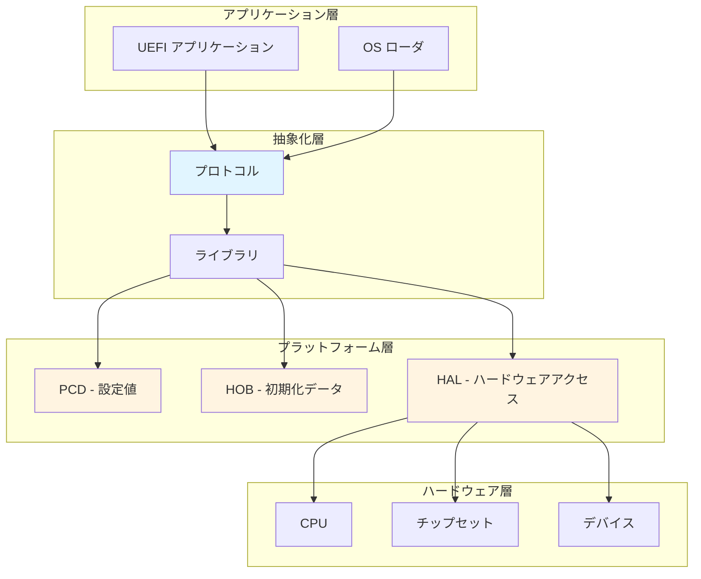
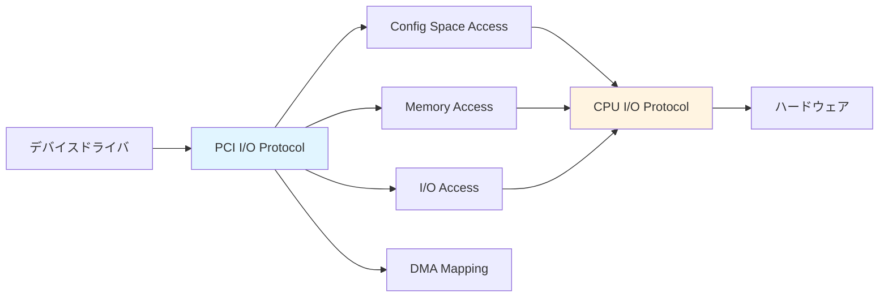
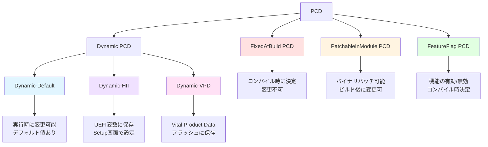
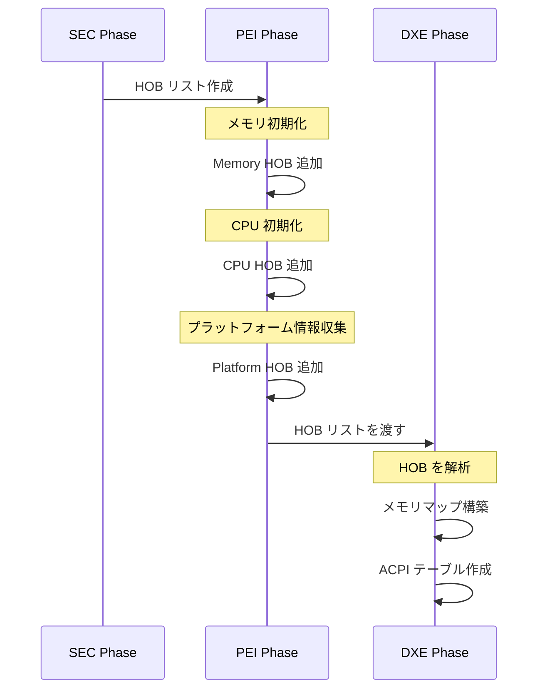
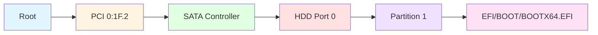
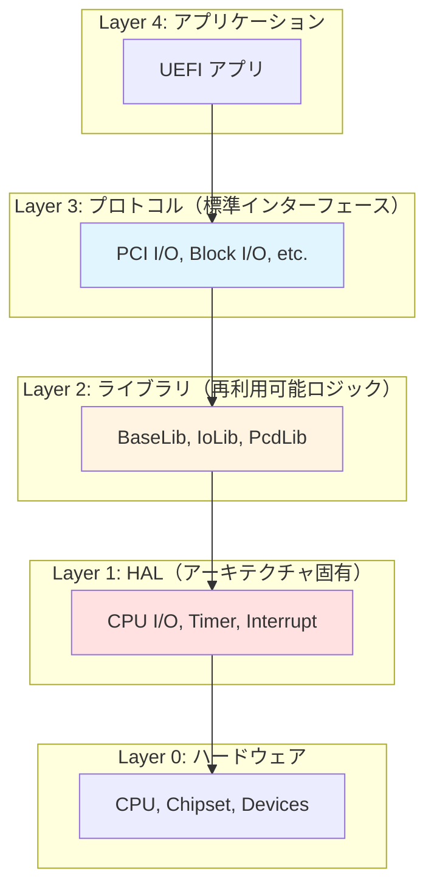

# ハードウェア抽象化の仕組み

🎯 **この章で学ぶこと**
- UEFI におけるハードウェア抽象化の必要性と設計思想
- I/O アクセスの抽象化レイヤ（CPU I/O、PCI I/O、MMIO）
- プラットフォーム固有情報の管理方法（PCD、HOB）
- デバイスパスによるハードウェア識別の仕組み

📚 **前提知識**
- [Part II: プロトコルとドライバモデルの理解](03-protocol-and-driver-model.md)
- [Part II: ライブラリアーキテクチャ](04-library-architecture.md)

---

## ハードウェア抽象化の必要性

### なぜ抽象化が必要なのか

UEFI ファームウェアは、さまざまなハードウェアプラットフォーム上で動作する必要があります。Intel、AMD、ARM など異なる CPU アーキテクチャ、異なるチップセット、そして異なる周辺デバイス構成に対応するためには、ハードウェアの詳細をソフトウェアから隠蔽する抽象化レイヤが不可欠です。この抽象化により、ファームウェアのコードはハードウェアの具体的な実装から独立し、同じコードベースを異なるプラットフォームで再利用できます。

ハードウェア抽象化の必要性は、UEFI ファームウェアが直面する複雑性から生じています。まず、CPU アーキテクチャの多様性があります。x86_64、ARM64、RISC-V など、各アーキテクチャは異なる命令セット、異なるメモリモデル、異なる I/O アクセス方法を持ちます。次に、チップセットの多様性があります。Intel のチップセットと AMD のチップセットは、PCI 構成、割り込みコントローラ、タイマーなどの実装が異なります。さらに、周辺デバイスの多様性があります。ネットワークカード、ストレージコントローラ、グラフィックスカードなど、無数のデバイスが存在し、それぞれ異なるプログラミングインターフェースを持ちます。

抽象化レイヤは、これらの複雑性を管理するために、四つの主要な層に分離されています。最上位は**アプリケーション層**であり、UEFI アプリケーションと OS ローダがこの層に属します。次に、**抽象化層**があり、プロトコルとライブラリがハードウェアの詳細を隠蔽します。その下に、**プラットフォーム層**があり、PCD (Platform Configuration Database)、HOB (Hand-Off Block)、HAL (Hardware Abstraction Layer) がプラットフォーム固有の情報とアクセス方法を提供します。最下層は**ハードウェア層**であり、CPU、チップセット、デバイスが存在します。この階層構造により、上位層は下位層の実装詳細を知ることなく、標準的なインターフェースを通じてハードウェアにアクセスできます。

**補足図**: 以下の図は、ハードウェア抽象化の階層構造を示したものです。



### 抽象化がもたらす利点

ハードウェア抽象化は、UEFI ファームウェアに四つの主要な利点をもたらします。第一に、**移植性**です。抽象化により、同じコードを変更することなく、異なるプラットフォームで動作させることができます。例えば、同じ UEFI アプリケーションが Intel プラットフォームと AMD プラットフォームの両方で動作します。アプリケーションは、プロトコルを通じてハードウェアにアクセスするため、CPU やチップセットの違いを意識する必要がありません。

第二に、**再利用性**です。抽象化により、共通のコードを複数のプラットフォームで共有できます。例えば、BaseLib は、すべてのプラットフォームで同一のソースコードを使用します。アーキテクチャ固有の部分は、ライブラリインスタンスとして分離され、ビルド時に適切な実装が選択されます。したがって、大部分のコードは再利用され、プラットフォーム固有のコードは最小限に抑えられます。

第三に、**保守性**です。抽象化により、プラットフォーム固有の部分を局所化できます。チップセットが変更された場合、影響を受けるのはプラットフォーム層の一部のみであり、アプリケーション層や抽象化層のコードは変更不要です。これにより、保守コストが大幅に削減され、新しいハードウェアへの対応が迅速に行えます。

第四に、**拡張性**です。抽象化により、新しいハードウェアを容易に追加できます。新しい PCI デバイスのサポートは、そのデバイス用のドライバを追加するだけで実現できます。ドライバは、PCI I/O Protocol を実装し、標準的なインターフェースを通じてデバイスにアクセスします。既存のコードを変更する必要はなく、システムは新しいデバイスを自動的に認識し、利用できます。

**参考表**: 以下の表は、抽象化がもたらす利点をまとめたものです。

| 利点 | 説明 | 具体例 |
|------|------|--------|
| **移植性** | コードを変更せずに異なるプラットフォームで動作 | 同じ UEFI アプリが Intel/AMD 両方で動く |
| **再利用性** | 共通コードを複数プラットフォームで共有 | BaseLib は全プラットフォームで同一 |
| **保守性** | プラットフォーム固有部分を局所化 | チップセット変更時の影響範囲を最小化 |
| **拡張性** | 新しいハードウェアを容易に追加 | 新しい PCI デバイス用ドライバの追加 |

---

## I/O 抽象化の階層構造

### CPU I/O プロトコル

**`EFI_CPU_IO2_PROTOCOL`** は、CPU の I/O 命令（x86 の IN/OUT、MMIO アクセス）を抽象化します。

#### プロトコル定義

```c
typedef struct _EFI_CPU_IO2_PROTOCOL {
  EFI_CPU_IO_PROTOCOL_IO_MEM   Mem;    // メモリマップド I/O
  EFI_CPU_IO_PROTOCOL_IO_MEM   Io;     // ポート I/O
} EFI_CPU_IO2_PROTOCOL;

// メモリ/ポート I/O の共通構造
typedef struct {
  EFI_CPU_IO_PROTOCOL_ACCESS  Read;
  EFI_CPU_IO_PROTOCOL_ACCESS  Write;
} EFI_CPU_IO_PROTOCOL_IO_MEM;
```

#### アクセス幅の指定

```c
typedef enum {
  EfiCpuIoWidthUint8,       // 8 ビット
  EfiCpuIoWidthUint16,      // 16 ビット
  EfiCpuIoWidthUint32,      // 32 ビット
  EfiCpuIoWidthUint64,      // 64 ビット
  EfiCpuIoWidthFifoUint8,   // FIFO (アドレス固定)
  EfiCpuIoWidthFillUint8    // Fill (同じ値を連続書き込み)
} EFI_CPU_IO_PROTOCOL_WIDTH;
```

このプロトコルにより、**アーキテクチャ固有の I/O 命令を隠蔽**し、統一的なインターフェースで I/O アクセスが可能になります。

### PCI I/O プロトコル

**`EFI_PCI_IO_PROTOCOL`** は、PCI デバイスへのアクセスをさらに高レベルで抽象化します。



#### PCI I/O プロトコルの機能

| 機能 | 役割 | メソッド |
|------|------|---------|
| **Config Space** | PCI 設定空間の読み書き | `Pci.Read()`, `Pci.Write()` |
| **BAR アクセス** | Base Address Register 経由の I/O | `Mem.Read()`, `Io.Read()` |
| **DMA** | DMAバッファのマッピング | `Map()`, `Unmap()` |
| **属性設定** | デバイス有効化、割り込み設定 | `Attributes()` |

#### 使用例（概念的）

```c
// PCI I/O Protocol を使った NIC レジスタアクセス
EFI_STATUS Status;
UINT32 MacAddressLow;

// BAR0 オフセット 0x00 から MAC アドレス下位を読む
Status = PciIo->Mem.Read (
  PciIo,
  EfiPciIoWidthUint32,
  0,                     // BAR0
  0x00,                  // オフセット
  1,                     // カウント
  &MacAddressLow
);
```

このように、**PCI のベンダ/デバイス ID、BAR、DMA など複雑な詳細を隠蔽**し、ドライバ開発者は本質的なロジックに集中できます。

---

## プラットフォーム固有情報の管理

### PCD: Platform Configuration Database

**PCD (Platform Configuration Database)** は、プラットフォーム固有の設定値を一元管理する仕組みです。

#### PCD の種類



#### PCD の使用例

```c
// DEC ファイル（パッケージ宣言）
[PcdsFixedAtBuild]
  ## シリアルポートのベースアドレス
  gEfiMdePkgTokenSpaceGuid.PcdUartDefaultBaudRate|115200|UINT64|0x00000001

// DSC ファイル（プラットフォーム設定）
[PcdsFixedAtBuild]
  gEfiMdePkgTokenSpaceGuid.PcdUartDefaultBaudRate|9600  # 変更

// C コードでの使用
UINT64 BaudRate = FixedPcdGet64 (PcdUartDefaultBaudRate);
```

#### PCD の利点

| 利点 | 説明 |
|------|------|
| **一元管理** | プラットフォーム設定を DSC ファイルに集約 |
| **型安全** | データ型が定義され、コンパイル時にチェック |
| **柔軟性** | ビルド時/実行時に変更可能な値を使い分け |
| **可視性** | 設定値がコード内に埋め込まれず、見通しが良い |

### HOB: Hand-Off Block

**HOB (Hand-Off Block)** は、ブートフェーズ間でデータを受け渡すための仕組みです。

#### HOB の役割



#### 主な HOB の種類

| HOB 種類 | 用途 | データ例 |
|---------|------|---------|
| **Memory Allocation** | メモリ領域の予約状態 | ファームウェア用メモリ、予約済み領域 |
| **Resource Descriptor** | システムリソースの記述 | メモリ範囲、I/O 範囲 |
| **GUID Extension** | カスタムデータ | プラットフォーム固有情報 |
| **Firmware Volume** | ファームウェアボリューム情報 | FV のベースアドレス、サイズ |
| **CPU** | CPU 情報 | コア数、サポートされた命令セット |

#### HOB の使用例（概念的）

```c
// PEI Phase: HOB を作成
EFI_HOB_GUID_TYPE *GuidHob;
PLATFORM_INFO_DATA *PlatformInfo;

GuidHob = BuildGuidHob (&gPlatformInfoGuid, sizeof(PLATFORM_INFO_DATA));
PlatformInfo = (PLATFORM_INFO_DATA *)GuidHob;
PlatformInfo->BoardId = BOARD_ID_WHISKEY_LAKE;
PlatformInfo->PchSku = PCH_SKU_H;

// DXE Phase: HOB を取得
EFI_HOB_GUID_TYPE *GuidHob;
PLATFORM_INFO_DATA *PlatformInfo;

GuidHob = GetFirstGuidHob (&gPlatformInfoGuid);
PlatformInfo = GET_GUID_HOB_DATA (GuidHob);

DEBUG ((DEBUG_INFO, "Board ID: %d\n", PlatformInfo->BoardId));
```

HOB により、**PEI Phase で収集したハードウェア情報を DXE Phase に効率的に渡す**ことができます。

---

## デバイスパスによるハードウェア識別

### デバイスパスの役割

**Device Path Protocol** は、ハードウェアデバイスを一意に識別するための「パス」を提供します。これは、ファイルシステムのパスに似た概念です。



### デバイスパスの構成要素

| パスタイプ | 説明 | 例 |
|-----------|------|-----|
| **Hardware** | ハードウェアデバイス | PCI(0x1F,0x2) |
| **ACPI** | ACPI デバイス | ACPI(PNP0A08,0) |
| **Messaging** | 通信プロトコル | SATA(0,0), USB(1,0) |
| **Media** | 記憶メディア | HD(1,GPT,GUID,0x800,0x100000) |
| **BIOS Boot Spec** | レガシーブート | BBS(HDD,0) |
| **End** | パスの終端 | End |

### デバイスパスの例

```
PciRoot(0x0)/Pci(0x1F,0x2)/Sata(0x0,0xFFFF,0x0)/HD(1,GPT,GUID,0x800,0x100000)/\EFI\BOOT\BOOTX64.EFI
```

この文字列表現は、以下の階層を表します：

1. **PciRoot(0x0)**: ルート複合デバイス（Root Complex）
2. **Pci(0x1F,0x2)**: Bus 0, Device 31, Function 2 の PCI デバイス
3. **Sata(0x0,0xFFFF,0x0)**: SATA Port 0
4. **HD(...)**: GPT パーティション 1
5. **\EFI\BOOT\BOOTX64.EFI**: ファイルパス

### デバイスパスの用途

| 用途 | 説明 |
|------|------|
| **ブートオプション** | ブートデバイスの指定 |
| **ドライバ接続** | ドライバがサポートするデバイスの判定 |
| **デバイス検索** | 特定のデバイスを見つける |
| **階層関係** | デバイスの親子関係の表現 |

---

## ハードウェア抽象化レイヤの設計原則

### レイヤ分離の原則

EDK II のハードウェア抽象化は、以下のレイヤに分離されています：



### 抽象化の度合い

| レイヤ | 抽象度 | 移植性 | 例 |
|--------|--------|--------|-----|
| **Layer 4** | 最高 | 完全移植可能 | UEFI Shell |
| **Layer 3** | 高 | プロトコルに依存 | USB ドライバ |
| **Layer 2** | 中 | アーキテクチャ依存 | MemoryAllocationLib |
| **Layer 1** | 低 | プラットフォーム固有 | Timer HAL |
| **Layer 0** | なし | ハードウェア | チップセット |

### 抽象化の実装パターン

#### パターン1: プロトコルによる抽象化

```
高レベル機能 → プロトコル定義（GUID + インターフェース） → プラットフォーム固有実装
```

**利点**: 実装を差し替え可能、複数実装の共存が可能

#### パターン2: ライブラリによる抽象化

```
共通ロジック → ライブラリクラス定義 → アーキテクチャ別実装
```

**利点**: リンク時に決定、オーバーヘッドが少ない

#### パターン3: PCD による抽象化

```
アルゴリズム → PCD で設定値を取得 → プラットフォーム DSC で値を定義
```

**利点**: コード変更不要、ビルド設定で調整可能

---

## プラットフォーム移植時のポイント

### 新しいプラットフォームへの移植手順

1. **アーキテクチャ固有部分の特定**
   - CPU I/O 実装
   - タイマー実装
   - 割り込みコントローラ実装

2. **プラットフォーム固有設定の定義**
   - PCD 値の設定（DSC ファイル）
   - メモリマップの定義
   - デバイス構成の記述

3. **ライブラリインスタンスの選択**
   - 既存実装を再利用
   - 必要に応じて新規実装

4. **プラットフォーム初期化コードの実装**
   - SEC/PEI でのハードウェア初期化
   - HOB の作成

### 移植性を高めるベストプラクティス

| プラクティス | 説明 |
|-------------|------|
| **プロトコル依存** | 直接ハードウェアにアクセスせず、プロトコル経由 |
| **PCD 使用** | マジックナンバーを PCD に置き換え |
| **条件コンパイル最小化** | `#ifdef` を減らし、ライブラリで分岐 |
| **デバイスパス使用** | ハードコードされたアドレスを避ける |

---

## まとめ

この章では、UEFI ファームウェアにおけるハードウェア抽象化の仕組みを説明しました。ハードウェア抽象化は、さまざまなプラットフォーム上で UEFI ファームウェアを動作させるための基盤であり、移植性、再利用性、保守性、拡張性を実現します。抽象化レイヤは、アプリケーション層、抽象化層、プラットフォーム層、ハードウェア層の四つの主要な層に分離され、各層は明確な責務を持ちます。この階層構造により、上位層は下位層の実装詳細を知ることなく、標準的なインターフェースを通じてハードウェアにアクセスできます。

I/O 抽象化の階層構造は、低レベルの CPU I/O Protocol から高レベルの PCI I/O Protocol まで、複数のレベルで構成されています。CPU I/O Protocol は、CPU の I/O 命令 (x86 の IN/OUT、MMIO アクセス) を抽象化し、アーキテクチャ固有の I/O 命令を隠蔽します。PCI I/O Protocol は、PCI デバイスへのアクセスをさらに高レベルで抽象化し、PCI 設定空間、BAR (Base Address Register)、DMA などの複雑な詳細を隠蔽します。デバイスドライバは、これらのプロトコルを通じてハードウェアにアクセスするため、ハードウェアの具体的な実装を知る必要がありません。

プラットフォーム固有情報の管理は、PCD (Platform Configuration Database) と HOB (Hand-Off Block) という二つの主要な仕組みによって実現されています。PCD は、プラットフォーム固有の設定値を一元管理し、コンパイル時または実行時に値を提供します。PCD には、FixedAtBuild、PatchableInModule、FeatureFlag、Dynamic などの種類があり、それぞれ異なるタイミングで値が決定されます。HOB は、ブートフェーズ間でデータを受け渡すための仕組みであり、PEI Phase で収集したハードウェア情報を DXE Phase に効率的に渡すことができます。HOB には、Memory Allocation、Resource Descriptor、GUID Extension など、さまざまな種類があります。

Device Path Protocol は、ハードウェアデバイスを一意に識別するための「パス」を提供します。Device Path は、ルートから特定のデバイスまでの階層的な経路を記述し、ブートオプションの指定、ドライバ接続の判定、デバイス検索、デバイスの親子関係の表現に使用されます。Device Path は、Hardware、ACPI、Messaging、Media、BIOS Boot Spec、End など、複数のタイプから構成され、これらを組み合わせることで、あらゆるデバイス階層を表現できます。

ハードウェア抽象化レイヤの設計原則は、レイヤ分離に基づいています。EDK II のハードウェア抽象化は、Layer 4 (アプリケーション)、Layer 3 (プロトコル)、Layer 2 (ライブラリ)、Layer 1 (HAL)、Layer 0 (ハードウェア) の五つの層に分離されています。各層は、明確な抽象度と移植性を持ち、上位層ほど抽象度が高く、移植性が高くなります。この設計により、プラットフォーム固有の部分を局所化し、共通のコードを最大限に再利用できます。

---

次章では、**グラフィックスサブシステム (GOP)** について学びます。GOP (Graphics Output Protocol) は、ビデオカードへの抽象化されたアクセスを提供し、解像度設定、フレームバッファ描画などを可能にします。ハードウェア抽象化の具体例として、GOP の設計と実装を詳しく見ていきます。

---

📚 **参考資料**
- [UEFI Specification v2.10 - Section 13: Protocols - Device Path Protocol](https://uefi.org/specifications)
- [UEFI PI Specification v1.8 - Volume 3: PCD](https://uefi.org/specifications)
- [UEFI PI Specification v1.8 - Volume 3: HOB](https://uefi.org/specifications)
- [EDK II Module Writer's Guide - Platform Configuration Database](https://tianocore-docs.github.io/edk2-ModuleWriteGuide/)
