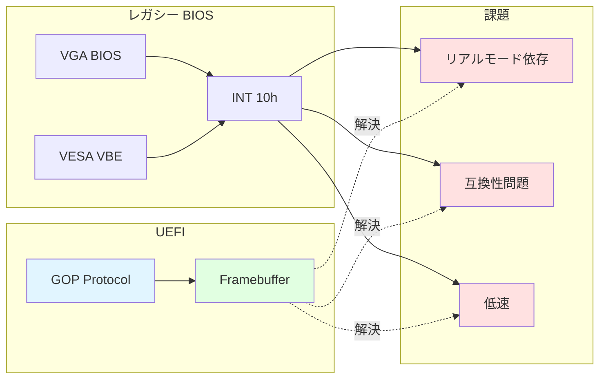
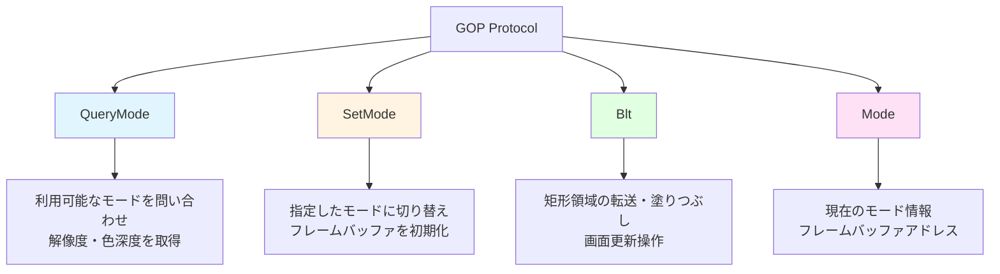
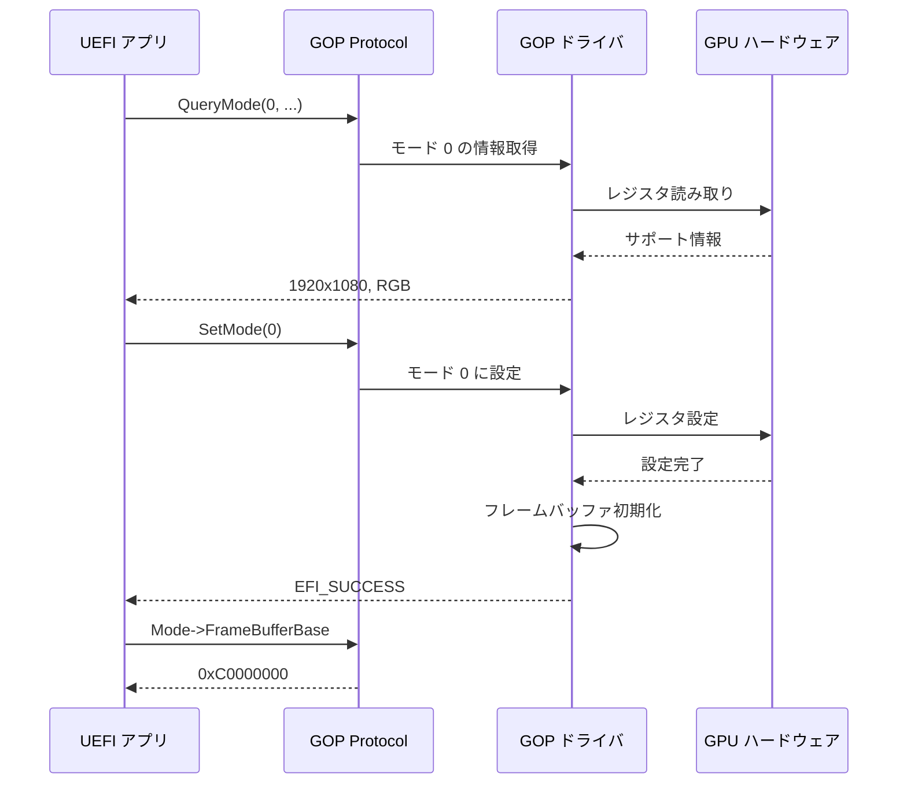
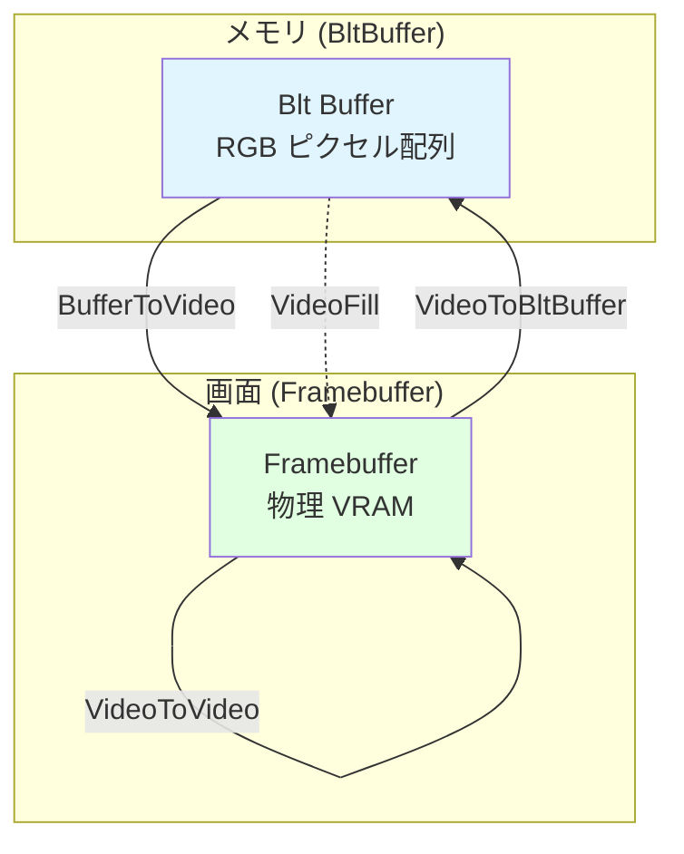
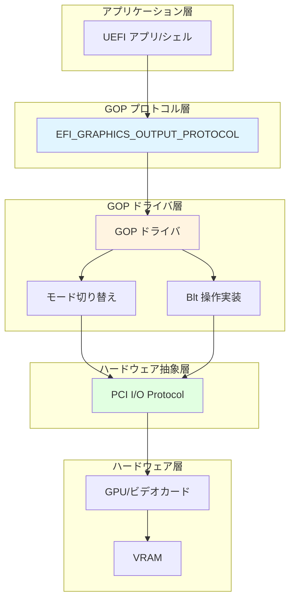
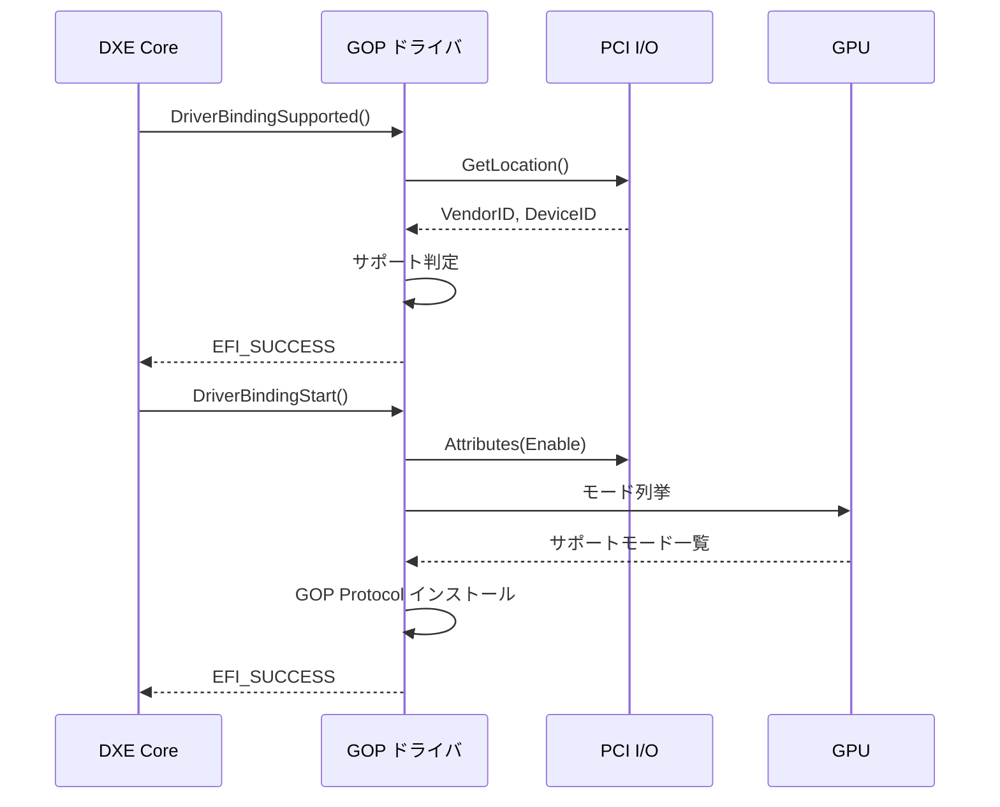
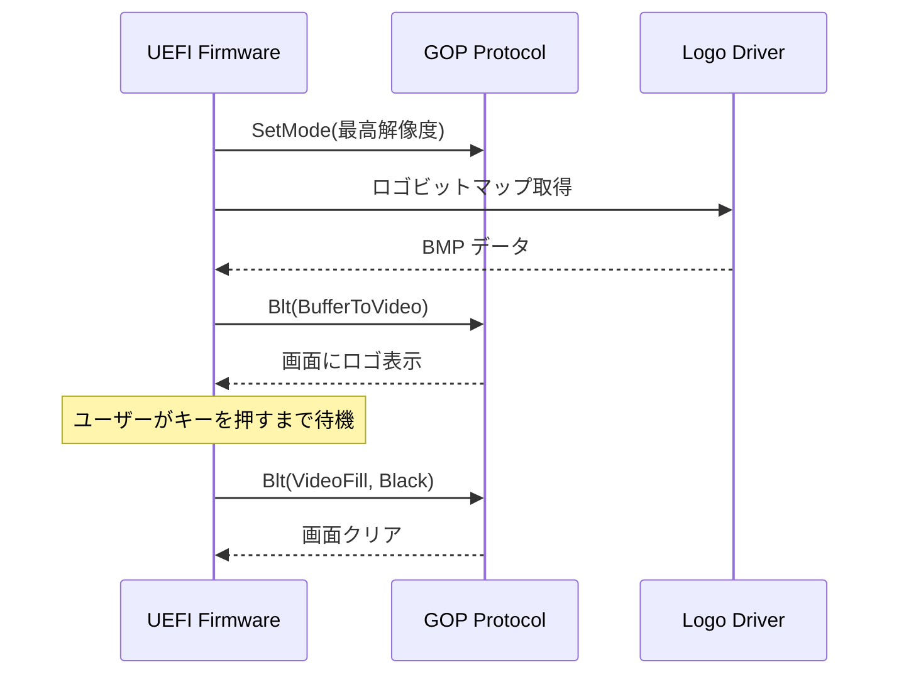

# グラフィックスサブシステム (GOP)

🎯 **この章で学ぶこと**
- Graphics Output Protocol (GOP) の設計思想と役割
- レガシー VGA/VESA からの進化
- GOP のモード設定とフレームバッファアクセスの仕組み
- Blt (Block Transfer) 操作による描画抽象化

📚 **前提知識**
- [Part II: プロトコルとドライバモデルの理解](03-protocol-and-driver-model.md)
- [Part II: ハードウェア抽象化の仕組み](05-hardware-abstraction.md)

---

## GOP の必要性

### レガシーグラフィックスの問題点

UEFI 以前の BIOS 環境では、VGA BIOS や VESA BIOS Extensions (VBE) を使ってグラフィックス機能を提供していました。しかし、これらのレガシーグラフィックスインターフェースには、重大な問題がありました。これらの問題は、モダンなコンピューティング環境において、グラフィックス機能の利用を著しく制限していました。

第一の問題は、**リアルモード依存**です。VGA BIOS と VBE は、INT 10h などのリアルモード割り込みに依存していました。リアルモードは、16 ビット環境であり、1MB のメモリ空間しかアクセスできません。64 ビット環境では、リアルモードは直接使用できないため、VGA BIOS や VBE を使用するには、CPU モードを切り替える必要があります。このモード切り替えは、複雑でオーバーヘッドが大きく、モダンな UEFI ファームウェアには適していませんでした。

第二の問題は、**標準化不足**です。VGA BIOS と VBE は、ベンダごとに実装が異なり、互換性問題が頻発していました。異なるグラフィックスカードで同じコードが動作することは保証されず、ベンダ固有の拡張機能が多く存在しました。この標準化不足により、アプリケーション開発者は、複数のグラフィックスカードに対応するために、ベンダごとに異なるコードを書く必要がありました。

第三の問題は、**機能不足**です。VGA BIOS と VBE は、高解像度や高色深度のサポートが不十分でした。モダンなディスプレイは、フルHD (1920x1080) や 4K (3840x2160) などの高解像度をサポートしますが、VBE はこれらの解像度を十分にサポートできませんでした。また、32 ビット色深度 (True Color) のサポートも不完全でした。第四の問題は、**パフォーマンス**です。BIOS 呼び出しのオーバーヘッドが大きく、描画が遅いという問題がありました。リアルモード割り込みを使用するため、各 BIOS 呼び出しにはモード切り替えが必要であり、これが大きなオーバーヘッドを生じさせていました。

**参考表**: 以下の表は、レガシーグラフィックスの問題点をまとめたものです。

| 問題点 | 説明 | 影響 |
|--------|------|------|
| **リアルモード依存** | INT 10h などリアルモード割り込みに依存 | 64 ビット環境で使用不可 |
| **標準化不足** | ベンダごとに実装が異なる | 互換性問題が頻発 |
| **機能不足** | 高解像度、高色深度のサポートが不十分 | 現代のディスプレイに対応できない |
| **パフォーマンス** | BIOS 呼び出しのオーバーヘッドが大きい | 描画が遅い |

### GOP による解決

Graphics Output Protocol (GOP) は、これらの問題を解決するために UEFI で導入された標準的なグラフィックスインターフェースです。GOP は、レガシーグラフィックスの問題を根本的に解決し、モダンな UEFI 環境でのグラフィックス機能を実現します。

GOP の最も重要な特徴は、**プロテクトモード動作**です。GOP は、リアルモード割り込みを使用せず、プロテクトモードまたはロングモードで動作します。これにより、64 ビット環境で直接使用でき、モード切り替えのオーバーヘッドがありません。GOP は、フレームバッファへの直接アクセスを提供し、アプリケーションは BIOS 呼び出しを介さずに描画できます。

第二の特徴は、**標準化**です。GOP は、UEFI 仕様で厳密に定義されており、すべての UEFI 実装で同じインターフェースを提供します。ベンダごとの違いは、GOP の実装レイヤに隠蔽され、アプリケーションは標準的なインターフェースのみに依存できます。これにより、一度書いたコードが、すべてのグラフィックスカードで動作することが保証されます。

第三の特徴は、**シンプルなインターフェース**です。GOP は、フレームバッファへの直接アクセスを提供し、複雑な BIOS 呼び出しを必要としません。アプリケーションは、フレームバッファのベースアドレスとピクセルフォーマットを取得し、メモリに直接書き込むことで描画できます。また、Block Transfer (Blt) 操作により、矩形領域の効率的な転送や塗りつぶしが可能です。第四の特徴は、**高機能**です。GOP は、任意の解像度と色深度をサポートし、モダンなディスプレイの要求に応えます。フル HD、4K、さらに高解像度のディスプレイをサポートし、32 ビット色深度も完全にサポートします。

**補足図**: 以下の図は、レガシーグラフィックスと GOP の比較を示したものです。



GOP の設計思想は、四つの主要な原則に基づいています。**プロテクトモード動作**により、リアルモード割り込みを使用せず、モダンな CPU 環境で直接動作します。**標準化**により、UEFI 仕様で厳密に定義され、すべての実装で一貫したインターフェースを提供します。**シンプルなインターフェース**により、フレームバッファへの直接アクセスを提供し、複雑な BIOS 呼び出しを排除します。**高機能**により、任意の解像度と色深度をサポートし、モダンなディスプレイの要求に応えます。

---

## GOP プロトコルの構造

### プロトコル定義

```c
typedef struct _EFI_GRAPHICS_OUTPUT_PROTOCOL {
  EFI_GRAPHICS_OUTPUT_PROTOCOL_QUERY_MODE  QueryMode;
  EFI_GRAPHICS_OUTPUT_PROTOCOL_SET_MODE    SetMode;
  EFI_GRAPHICS_OUTPUT_PROTOCOL_BLT         Blt;
  EFI_GRAPHICS_OUTPUT_PROTOCOL_MODE        *Mode;
} EFI_GRAPHICS_OUTPUT_PROTOCOL;
```

### 各メソッドの役割



#### QueryMode: モード情報の取得

```c
typedef EFI_STATUS (EFIAPI *EFI_GRAPHICS_OUTPUT_PROTOCOL_QUERY_MODE) (
  IN  EFI_GRAPHICS_OUTPUT_PROTOCOL          *This,
  IN  UINT32                                ModeNumber,
  OUT UINTN                                 *SizeOfInfo,
  OUT EFI_GRAPHICS_OUTPUT_MODE_INFORMATION  **Info
);
```

**役割**: 指定したモード番号の詳細情報（解像度、色深度、フレームバッファ形式）を取得します。

#### SetMode: モード設定

```c
typedef EFI_STATUS (EFIAPI *EFI_GRAPHICS_OUTPUT_PROTOCOL_SET_MODE) (
  IN  EFI_GRAPHICS_OUTPUT_PROTOCOL  *This,
  IN  UINT32                        ModeNumber
);
```

**役割**: 指定したモード番号に切り替えます。この操作により、解像度が変更され、フレームバッファが再初期化されます。

#### Blt: Block Transfer（描画操作）

```c
typedef EFI_STATUS (EFIAPI *EFI_GRAPHICS_OUTPUT_PROTOCOL_BLT) (
  IN  EFI_GRAPHICS_OUTPUT_PROTOCOL      *This,
  IN  EFI_GRAPHICS_OUTPUT_BLT_PIXEL     *BltBuffer  OPTIONAL,
  IN  EFI_GRAPHICS_OUTPUT_BLT_OPERATION BltOperation,
  IN  UINTN                             SourceX,
  IN  UINTN                             SourceY,
  IN  UINTN                             DestinationX,
  IN  UINTN                             DestinationY,
  IN  UINTN                             Width,
  IN  UINTN                             Height,
  IN  UINTN                             Delta        OPTIONAL
);
```

**役割**: 矩形領域のコピー、塗りつぶし、画面更新などの描画操作を行います。

---

## モード設定の仕組み

### モード情報の構造

```c
typedef struct {
  UINT32                     MaxMode;         // サポートされるモード数
  UINT32                     Mode;            // 現在のモード番号
  EFI_GRAPHICS_OUTPUT_MODE_INFORMATION *Info; // 現在のモード情報
  UINTN                      SizeOfInfo;      // 情報構造体のサイズ
  EFI_PHYSICAL_ADDRESS       FrameBufferBase; // フレームバッファの物理アドレス
  UINTN                      FrameBufferSize; // フレームバッファのサイズ
} EFI_GRAPHICS_OUTPUT_PROTOCOL_MODE;

typedef struct {
  UINT32                     Version;          // 構造体バージョン
  UINT32                     HorizontalResolution; // 横解像度
  UINT32                     VerticalResolution;   // 縦解像度
  EFI_GRAPHICS_PIXEL_FORMAT  PixelFormat;      // ピクセルフォーマット
  EFI_PIXEL_BITMASK          PixelInformation; // ビットマスク情報
  UINT32                     PixelsPerScanLine; // 1行あたりのピクセル数
} EFI_GRAPHICS_OUTPUT_MODE_INFORMATION;
```

### ピクセルフォーマット

```c
typedef enum {
  PixelRedGreenBlueReserved8BitPerColor, // RGBX (各8ビット)
  PixelBlueGreenRedReserved8BitPerColor, // BGRX (各8ビット)
  PixelBitMask,                          // カスタムビットマスク
  PixelBltOnly,                          // Blt 操作のみ可能
  PixelFormatMax
} EFI_GRAPHICS_PIXEL_FORMAT;
```

### モード設定の流れ



**手順**:

1. **全モード列挙**: `MaxMode` まで `QueryMode()` を呼び、対応解像度を確認
2. **適切なモード選択**: アプリケーションの要求に合うモードを選択
3. **モード設定**: `SetMode()` でモード切り替え
4. **フレームバッファアクセス**: `Mode->FrameBufferBase` から直接描画可能

---

## Blt 操作による描画

### Blt 操作の種類

```c
typedef enum {
  EfiBltVideoFill,           // 画面を単色で塗りつぶし
  EfiBltVideoToBltBuffer,    // 画面からメモリへコピー
  EfiBltBufferToVideo,       // メモリから画面へコピー
  EfiBltVideoToVideo,        // 画面内でコピー（スクロールなど）
  EfiGraphicsOutputBltOperationMax
} EFI_GRAPHICS_OUTPUT_BLT_OPERATION;
```

### 各操作の用途

| 操作 | 用途 | 例 |
|------|------|-----|
| **VideoFill** | 領域を単色で塗りつぶす | 背景のクリア、矩形の描画 |
| **VideoToBltBuffer** | 画面内容をメモリに保存 | 画面キャプチャ、ダブルバッファリング |
| **BufferToVideo** | メモリ内容を画面に転送 | ビットマップ表示、フォント描画 |
| **VideoToVideo** | 画面内でコピー | スクロール、ウィンドウ移動 |

### Blt 操作の概念図



### Blt 操作の例（概念的）

#### 例1: 画面全体を青色でクリア

```c
EFI_GRAPHICS_OUTPUT_BLT_PIXEL Blue = { 0, 0, 255, 0 }; // B, G, R, Reserved

Status = Gop->Blt (
  Gop,
  &Blue,
  EfiBltVideoFill,
  0, 0,                          // Source (未使用)
  0, 0,                          // Destination (0, 0)
  Gop->Mode->Info->HorizontalResolution,
  Gop->Mode->Info->VerticalResolution,
  0
);
```

#### 例2: ビットマップを画面に描画

```c
EFI_GRAPHICS_OUTPUT_BLT_PIXEL *ImageBuffer;
// ImageBuffer にビットマップデータを読み込み済みと仮定

Status = Gop->Blt (
  Gop,
  ImageBuffer,
  EfiBltBufferToVideo,
  0, 0,                          // Source (0, 0)
  100, 100,                      // Destination (100, 100)
  640, 480,                      // Width, Height
  0                              // Delta (0 = Width * sizeof(pixel))
);
```

#### 例3: 画面領域を下にスクロール

```c
// 画面を10行下にスクロール
Status = Gop->Blt (
  Gop,
  NULL,
  EfiBltVideoToVideo,
  0, 10,                         // Source (0, 10)
  0, 0,                          // Destination (0, 0)
  Gop->Mode->Info->HorizontalResolution,
  Gop->Mode->Info->VerticalResolution - 10,
  0
);
```

---

## GOP ドライバのアーキテクチャ

### GOP ドライバの階層



### GOP ドライバの種類

| ドライバタイプ | 説明 | 例 |
|--------------|------|-----|
| **ベンダ専用** | 特定 GPU に最適化されたドライバ | Intel GOP Driver, NVIDIA UEFI Driver |
| **汎用 VESA** | VESA VBE 経由で動作 | VBE Shim Driver |
| **シンプル FB** | フレームバッファのみサポート | Simple Framebuffer Driver |

### GOP ドライバの初期化手順



**手順**:

1. **デバイス検出**: PCI I/O Protocol でビデオカードを発見
2. **サポート判定**: VendorID/DeviceID から対応可否を判断
3. **初期化**: GPU のモード情報を収集
4. **プロトコル公開**: GOP Protocol をハンドルにインストール

---

## GOP と UGA の関係

### UGA Protocol (レガシー)

UEFI 1.x では **Universal Graphics Adapter (UGA) Protocol** が使われていました。UEFI 2.0 以降は **GOP が推奨**され、UGA は廃止予定です。

| 項目 | UGA | GOP |
|------|-----|-----|
| **導入時期** | UEFI 1.x | UEFI 2.0 以降 |
| **モード設定** | SetMode() | SetMode() |
| **描画** | Blt() | Blt() |
| **フレームバッファ** | 直接アクセス不可 | Mode->FrameBufferBase で可能 |
| **ステータス** | 廃止予定 | 推奨 |

### 互換性のための対応

古い UEFI アプリケーションとの互換性のため、一部の GOP ドライバは **UGA Protocol も同時に提供**することがあります。

---

## フレームバッファの直接操作

### フレームバッファとは

**フレームバッファ**は、画面に表示される各ピクセルの色情報が格納されたメモリ領域です。GOP では、このアドレスが `Mode->FrameBufferBase` として公開されます。

### 直接描画の例（概念的）

```c
UINT32 *FrameBuffer = (UINT32 *)(UINTN)Gop->Mode->FrameBufferBase;
UINT32 HorizontalResolution = Gop->Mode->Info->HorizontalResolution;
UINT32 VerticalResolution = Gop->Mode->Info->VerticalResolution;

// 画面全体を白色 (0xFFFFFFFF) で塗りつぶし
for (UINT32 y = 0; y < VerticalResolution; y++) {
  for (UINT32 x = 0; x < HorizontalResolution; x++) {
    FrameBuffer[y * HorizontalResolution + x] = 0xFFFFFFFF;
  }
}
```

### Blt vs 直接アクセス

| 方法 | 利点 | 欠点 | 用途 |
|------|------|------|------|
| **Blt 操作** | ハードウェア加速が可能<br/>抽象化されている | オーバーヘッドがある | 一般的な描画 |
| **直接アクセス** | 最高速<br/>柔軟性が高い | ピクセルフォーマットに注意が必要 | 高速描画が必要な場合 |

---

## GOP を使った画面出力の実例

### 起動画面（スプラッシュスクリーン）

多くの UEFI ファームウェアは、起動時にベンダーロゴを表示します。これは GOP を使って実装されています。



### UEFI シェル

UEFI シェルも GOP を使ってテキストを描画しています。

**動作原理**:

1. **フォントデータ**: HII Font Protocol からフォントビットマップを取得
2. **文字描画**: 各文字をビットマップとして Blt で転送
3. **スクロール**: VideoToVideo で画面内容を上にシフト

---

## まとめ

この章では、UEFI における Graphics Output Protocol (GOP) の設計思想と実装について説明しました。GOP は、レガシーな VGA BIOS や VESA BIOS Extensions (VBE) の問題を解決するために UEFI で導入された標準的なグラフィックスインターフェースです。レガシーグラフィックスは、リアルモード依存、標準化不足、機能不足、低パフォーマンスという四つの主要な問題を抱えていました。GOP は、これらの問題を根本的に解決し、モダンな UEFI 環境でのグラフィックス機能を実現します。

GOP の構造は、QueryMode、SetMode、Blt という三つの主要メソッドと、Mode 構造体で構成されています。QueryMode は、グラフィックスカードがサポートする解像度とピクセルフォーマットを照会し、SetMode は、特定のグラフィックスモードを設定します。Blt (Block Transfer) は、矩形領域の効率的な転送や塗りつぶしを実行し、VideoFill、VideoToBltBuffer、BufferToVideo、VideoToVideo の四種類の操作をサポートします。Mode 構造体は、現在のグラフィックスモードの情報を提供し、フレームバッファのベースアドレス、解像度、ピクセルフォーマットなどを含みます。

モード設定により、GOP は複数の解像度と色深度をサポートします。アプリケーションは、QueryMode を使用して利用可能なモードを列挙し、SetMode を使用して適切なモードを選択できます。ピクセルフォーマットは、RGB、BGR、BitMask などがあり、グラフィックスカードによってサポートされるフォーマットが異なります。アプリケーションは、Mode 構造体からピクセルフォーマット情報を取得し、適切なピクセルデータを生成する必要があります。

Blt 操作は、グラフィックス描画の中核的な機能です。Blt は、四種類の操作を提供し、それぞれ異なる用途に使用されます。VideoFill は、フレームバッファの矩形領域を指定された色で塗りつぶします。VideoToBltBuffer は、フレームバッファの矩形領域をメモリバッファにコピーします。BufferToVideo は、メモリバッファの矩形領域をフレームバッファにコピーします。VideoToVideo は、フレームバッファ内の矩形領域を別の位置にコピーします。これらの操作により、矩形領域の効率的な転送や塗りつぶしが可能になります。

GOP ドライバは、PCI I/O Protocol を経由してグラフィックスカード (GPU) にアクセスします。ドライバは、PCI バスをスキャンしてグラフィックスカードを発見し、GOP Protocol をインストールします。ベンダ専用ドライバは、特定のグラフィックスカードに最適化され、高度な機能をサポートします。汎用ドライバは、VESA VBE などの標準インターフェースを使用して、幅広いグラフィックスカードをサポートします。フレームバッファ直接アクセスも可能であり、アプリケーションは Mode->FrameBufferBase からフレームバッファに直接書き込むことができます。ただし、Blt 操作とのトレードオフを理解する必要があります。直接アクセスは高速ですが、ピクセルフォーマットの処理やクリッピングをアプリケーション自身が実装する必要があります。

---

次章では、**ストレージスタックの構造**について学びます。UEFI は HDD、SSD、NVMe など多様なストレージデバイスをサポートしますが、これらは Block I/O Protocol、Disk I/O Protocol、File System Protocol という階層的なスタックで抽象化されています。各プロトコルの役割と、ドライバがどのように連携するかを詳しく見ていきます。

---

📚 **参考資料**
- [UEFI Specification v2.10 - Section 12.9: Graphics Output Protocol](https://uefi.org/specifications)
- [UEFI Specification v2.10 - Section 12.10: EDID Protocols](https://uefi.org/specifications)
- [Intel® UEFI Development Kit (UDK) - GOP Driver Implementation](https://github.com/tianocore/edk2)
