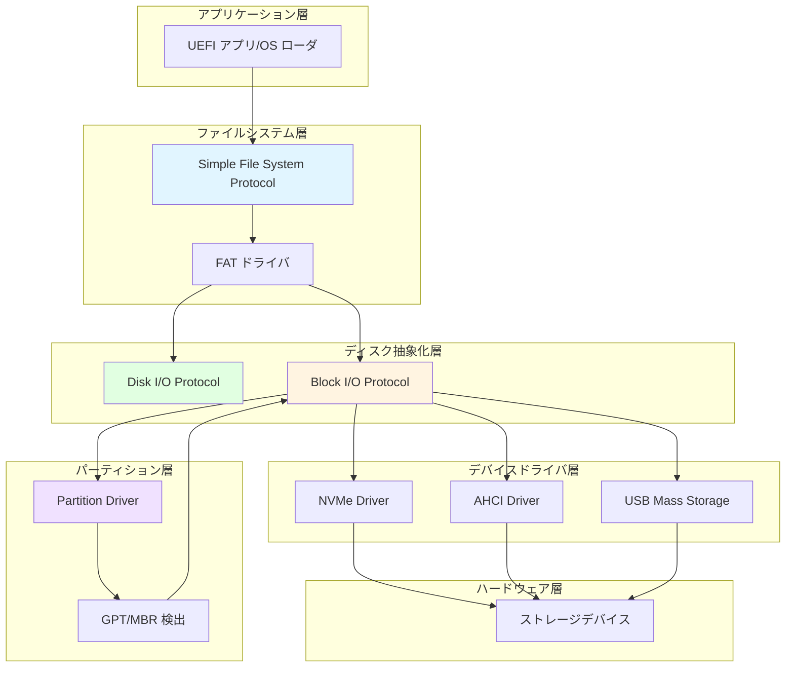
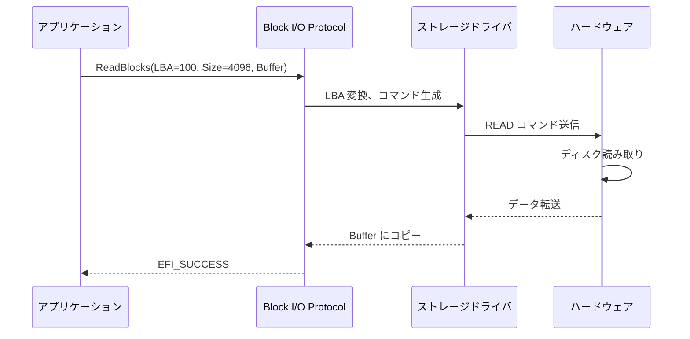
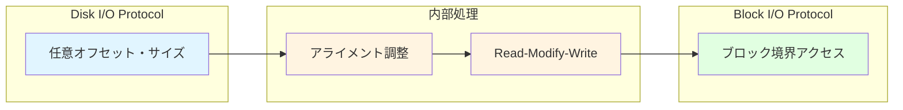
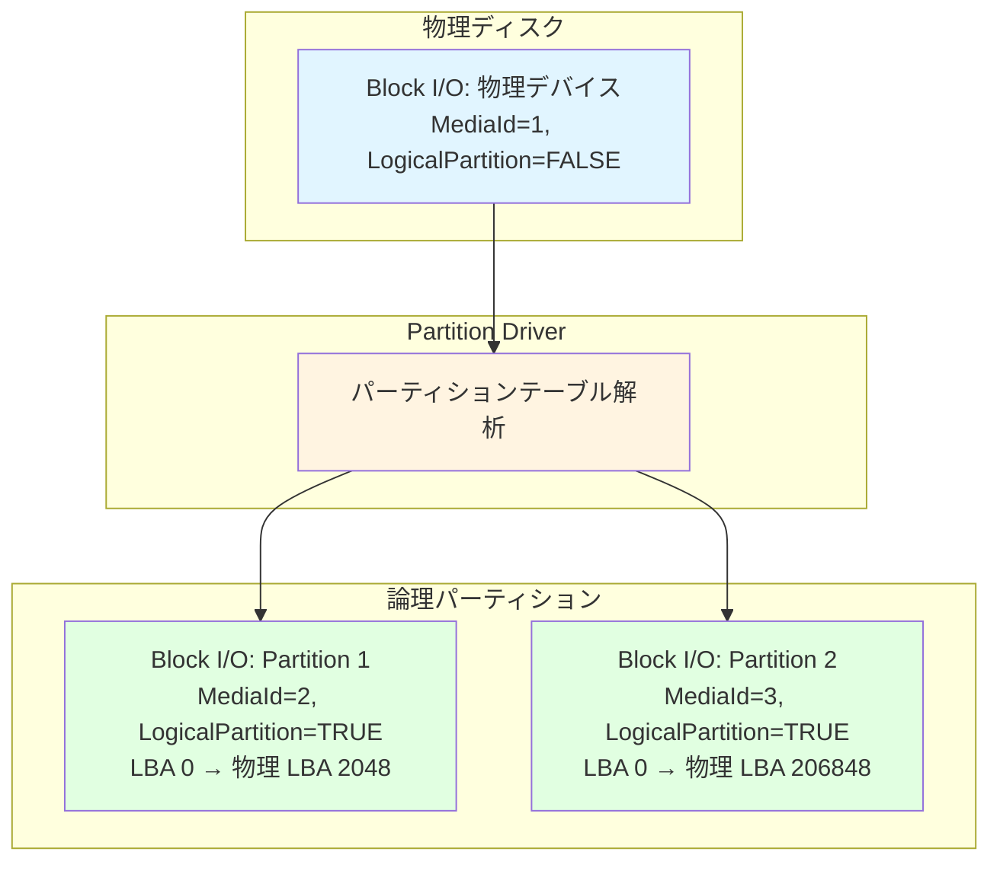
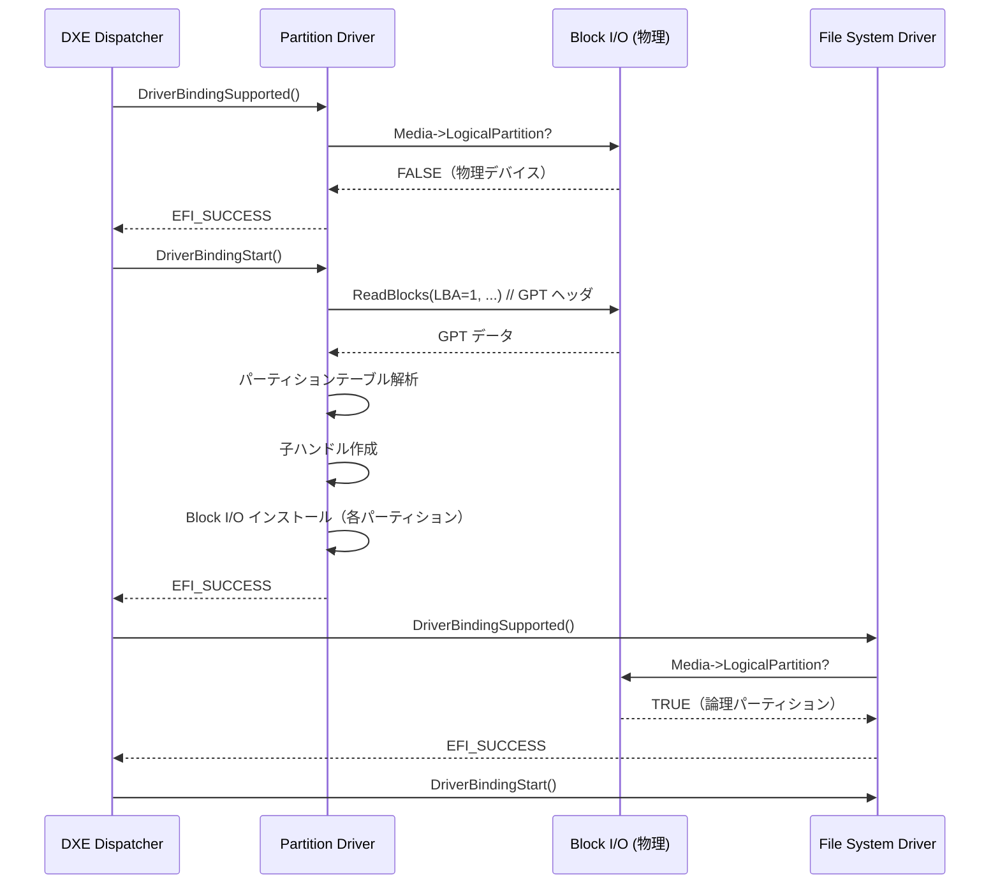
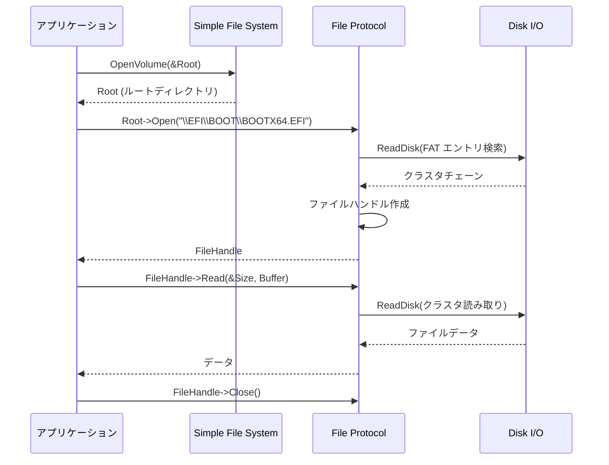
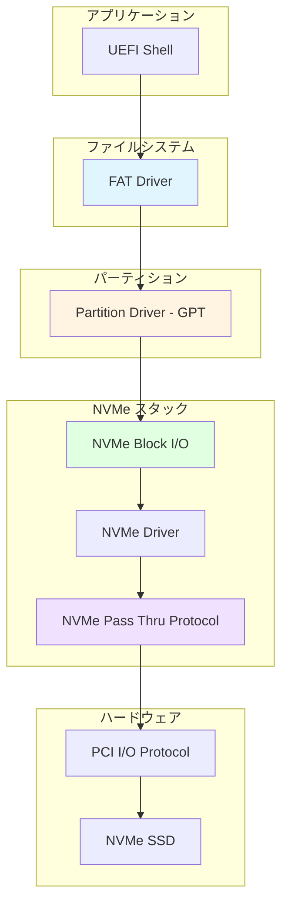
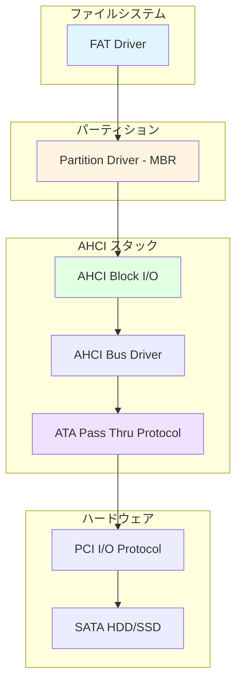
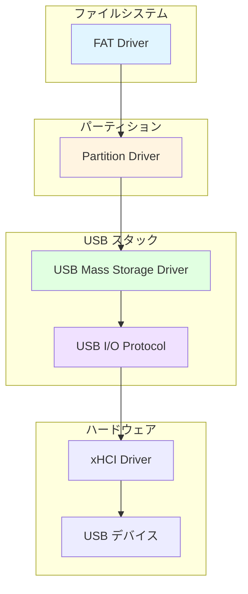
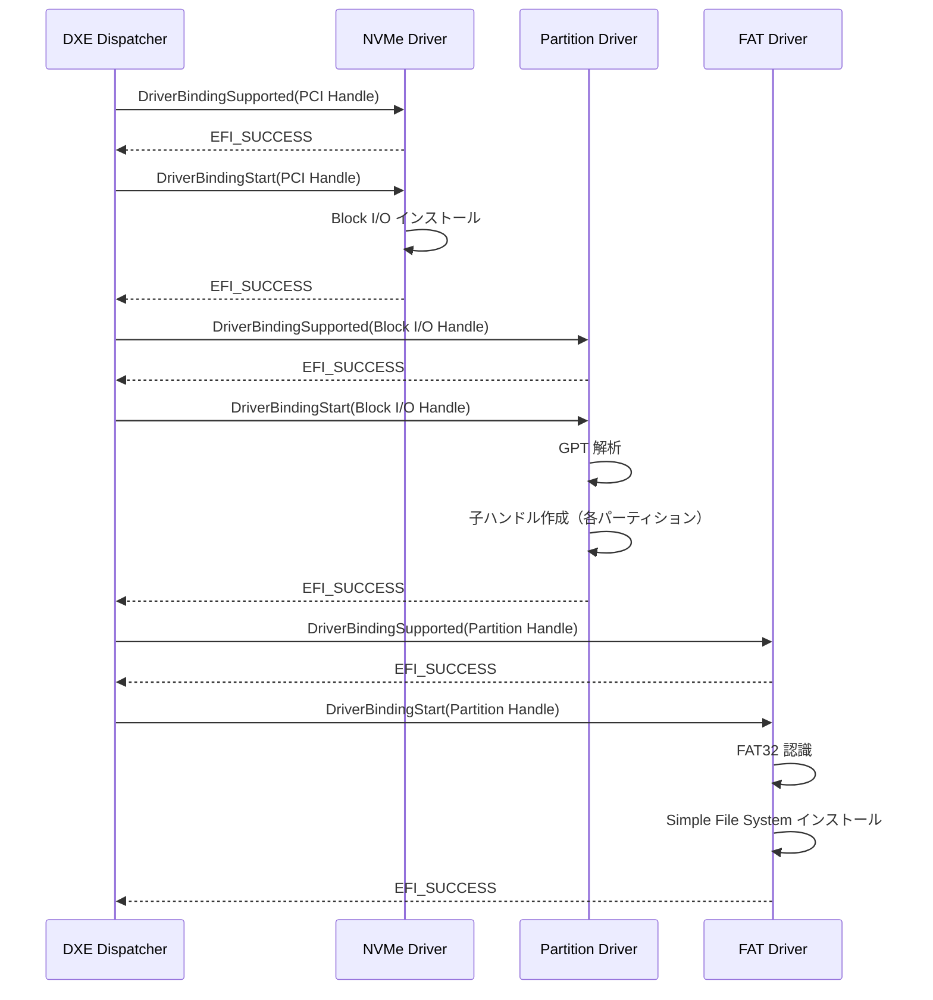

# ストレージスタックの構造

🎯 **この章で学ぶこと**
- UEFI ストレージスタックの階層構造と各層の役割
- Block I/O Protocol と Disk I/O Protocol の違い
- パーティション検出とファイルシステムの仕組み
- NVMe、AHCI、USB などデバイス別ドライバの構成

📚 **前提知識**
- [Part II: プロトコルとドライバモデルの理解](03-protocol-and-driver-model.md)
- [Part II: ハードウェア抽象化の仕組み](05-hardware-abstraction.md)

---

## ストレージスタックの全体像

### なぜ階層化が必要なのか

ストレージデバイスには、HDD、SSD、NVMe SSD、USB フラッシュドライブなど多様な種類があります。さらに、これらは異なるインターフェース（SATA、PCIe、USB）、異なるパーティションスキーム（MBR、GPT）、異なるファイルシステム（FAT32、exFAT、NTFS）を使用します。

UEFI では、これらの多様性を**階層的なプロトコルスタック**で抽象化し、上位層が下位層の詳細を意識せずに動作できるようにしています。



---

## Block I/O Protocol

### Block I/O Protocol の役割

**`EFI_BLOCK_IO_PROTOCOL`** は、ストレージデバイスへの**ブロック単位のアクセス**を提供する最も基本的なプロトコルです。

### プロトコル定義

```c
typedef struct _EFI_BLOCK_IO_PROTOCOL {
  UINT64                    Revision;
  EFI_BLOCK_IO_MEDIA        *Media;
  EFI_BLOCK_RESET           Reset;
  EFI_BLOCK_READ            ReadBlocks;
  EFI_BLOCK_WRITE           WriteBlocks;
  EFI_BLOCK_FLUSH           FlushBlocks;
} EFI_BLOCK_IO_PROTOCOL;
```

### 各メソッドの役割

| メソッド | 役割 | パラメータ |
|---------|------|-----------|
| **Reset** | デバイスをリセット | ExtendedVerification |
| **ReadBlocks** | 指定ブロックを読み込み | LBA, BufferSize, Buffer |
| **WriteBlocks** | 指定ブロックに書き込み | LBA, BufferSize, Buffer |
| **FlushBlocks** | 書き込みキャッシュをフラッシュ | なし |

### Media 構造体

```c
typedef struct {
  UINT32  MediaId;              // メディア変更検出用 ID
  BOOLEAN RemovableMedia;       // リムーバブルメディアか
  BOOLEAN MediaPresent;         // メディアが存在するか
  BOOLEAN LogicalPartition;     // 論理パーティションか（物理デバイスでないか）
  BOOLEAN ReadOnly;             // 読み取り専用か
  BOOLEAN WriteCaching;         // 書き込みキャッシュが有効か
  UINT32  BlockSize;            // ブロックサイズ（バイト）
  UINT32  IoAlign;              // バッファアライメント要件
  EFI_LBA LastBlock;            // 最後のブロック番号
  EFI_LBA LowestAlignedLba;     // アライメント境界の開始 LBA
  UINT32  LogicalBlocksPerPhysicalBlock; // 物理ブロックあたりの論理ブロック数
  UINT32  OptimalTransferLengthGranularity; // 最適転送サイズ
} EFI_BLOCK_IO_MEDIA;
```

### ReadBlocks の動作



**LBA (Logical Block Address)**: 論理ブロックアドレス。0 から始まる連続した番号でブロックを指定します。

---

## Disk I/O Protocol

### Disk I/O Protocol の役割

**`EFI_DISK_IO_PROTOCOL`** は、Block I/O Protocol の上に構築され、**バイト単位のアクセス**を可能にします。

### なぜ Disk I/O が必要なのか

Block I/O Protocol はブロック単位（通常 512 バイトまたは 4096 バイト）でしかアクセスできません。しかし、ファイルシステムドライバなどは、**任意のオフセットから任意のサイズ**でデータを読み書きしたい場合があります。



### プロトコル定義

```c
typedef struct _EFI_DISK_IO_PROTOCOL {
  UINT64              Revision;
  EFI_DISK_READ       ReadDisk;
  EFI_DISK_WRITE      WriteDisk;
} EFI_DISK_IO_PROTOCOL;
```

### ReadDisk vs ReadBlocks

| 項目 | Block I/O: ReadBlocks | Disk I/O: ReadDisk |
|------|----------------------|-------------------|
| **単位** | ブロック（512B/4096B） | バイト |
| **オフセット** | LBA（ブロック番号） | バイトオフセット |
| **サイズ制限** | ブロックサイズの倍数 | 任意 |
| **内部動作** | 直接ハードウェアアクセス | 必要に応じて RMW |

**RMW (Read-Modify-Write)**: ブロック境界に揃っていない書き込みの場合、まず該当ブロックを読み込み、必要部分だけ変更してから書き戻す操作。

---

## パーティション検出の仕組み

### Partition Driver の役割

**Partition Driver** は、物理ディスク上の**パーティションテーブル（GPT または MBR）を解析**し、各パーティションを個別の Block I/O Protocol インスタンスとして公開します。



### GPT vs MBR

| 項目 | MBR (Master Boot Record) | GPT (GUID Partition Table) |
|------|--------------------------|----------------------------|
| **最大パーティション数** | 4（プライマリ） | 128（標準設定） |
| **最大ディスクサイズ** | 2 TB | 9.4 ZB（実質無制限） |
| **パーティション識別** | Type Code（1バイト） | Type GUID（128ビット） |
| **冗長性** | なし | ヘッダとテーブルの複製 |
| **UEFI サポート** | レガシー互換 | 推奨 |

### パーティション検出の流れ



**ポイント**:
- Partition Driver は `LogicalPartition == FALSE` のデバイスにのみ接続
- File System Driver は `LogicalPartition == TRUE` のデバイスに接続

---

## Simple File System Protocol

### ファイルシステム抽象化

**`EFI_SIMPLE_FILE_SYSTEM_PROTOCOL`** は、ファイルシステムへのアクセスを抽象化し、**ファイル・ディレクトリ操作**を提供します。

### プロトコル定義

```c
typedef struct _EFI_SIMPLE_FILE_SYSTEM_PROTOCOL {
  UINT64                            Revision;
  EFI_SIMPLE_FILE_SYSTEM_PROTOCOL_OPEN_VOLUME OpenVolume;
} EFI_SIMPLE_FILE_SYSTEM_PROTOCOL;
```

### File Protocol

`OpenVolume()` は **`EFI_FILE_PROTOCOL`** を返します。このプロトコルが実際のファイル操作を提供します。

```c
typedef struct _EFI_FILE_PROTOCOL {
  UINT64                Revision;
  EFI_FILE_OPEN         Open;
  EFI_FILE_CLOSE        Close;
  EFI_FILE_DELETE       Delete;
  EFI_FILE_READ         Read;
  EFI_FILE_WRITE        Write;
  EFI_FILE_GET_POSITION GetPosition;
  EFI_FILE_SET_POSITION SetPosition;
  EFI_FILE_GET_INFO     GetInfo;
  EFI_FILE_SET_INFO     SetInfo;
  EFI_FILE_FLUSH        Flush;
  // UEFI 2.0 以降
  EFI_FILE_OPEN_EX      OpenEx;
  EFI_FILE_READ_EX      ReadEx;
  EFI_FILE_WRITE_EX     WriteEx;
  EFI_FILE_FLUSH_EX     FlushEx;
} EFI_FILE_PROTOCOL;
```

### ファイル操作の流れ



### ファイルパスの規則

UEFI では、**バックスラッシュ (`\`) 区切り**のパスを使用します：

```
\EFI\BOOT\BOOTX64.EFI
\myapp\config.ini
```

**注意点**:
- 常にルート (`\`) から始まる
- 大文字小文字は区別されない（FAT の場合）
- スラッシュ (`/`) ではなくバックスラッシュ (`\`)

---

## デバイス別ドライバスタック

### NVMe ストレージスタック

**NVMe (Non-Volatile Memory Express)** は PCIe 接続の高速 SSD 用プロトコルです。



**NVMe Pass Thru Protocol**: NVMe コマンド（Admin Command, I/O Command）を直接送信するための低レベルプロトコル。

### AHCI (SATA) ストレージスタック

**AHCI (Advanced Host Controller Interface)** は SATA ディスク用の標準インターフェースです。



### USB Mass Storage スタック

**USB Mass Storage** は USB フラッシュドライブや外付け HDD で使われます。



---

## ストレージスタックの動的な構築

### ドライバ接続の流れ

UEFI は起動時に、**DXE Dispatcher** がドライバを順次ロードし、`ConnectController()` でデバイスに接続していきます。



### ハンドルの階層構造

```
物理デバイスハンドル
  ├─ Device Path Protocol
  ├─ PCI I/O Protocol
  └─ Block I/O Protocol (物理)
      │
      └─ パーティション1ハンドル（子）
          ├─ Device Path Protocol
          ├─ Block I/O Protocol (論理)
          ├─ Disk I/O Protocol
          └─ Simple File System Protocol
```

---

## ストレージアクセスの最適化

### キャッシング

| 層 | キャッシュの種類 | 説明 |
|----|---------------|------|
| **ハードウェア** | ディスクキャッシュ | デバイス内蔵の DRAM/SRAM |
| **Block I/O** | Write Caching | `Media->WriteCaching` で有効化 |
| **File System** | メタデータキャッシュ | FAT テーブルのキャッシュ |

### DMA vs PIO

| アクセス方法 | 説明 | パフォーマンス |
|------------|------|---------------|
| **DMA** | Direct Memory Access（CPU を介さずメモリ転送） | 高速 |
| **PIO** | Programmed I/O（CPU がデータをコピー） | 低速 |

UEFI のストレージドライバは通常 **DMA** を使用します。PCI I/O Protocol の `Map()` メソッドで DMA バッファをマッピングします。

---

## まとめ

### この章で学んだこと

✅ **ストレージスタックの階層**
- Block I/O → Disk I/O → Partition → File System の4層構造
- 各層が明確な責務を持つ

✅ **Block I/O Protocol**
- ブロック単位の読み書き
- Media 構造体でデバイス情報を提供

✅ **Disk I/O Protocol**
- バイト単位の読み書き
- Read-Modify-Write による任意アクセス

✅ **パーティション検出**
- GPT/MBR の解析
- 論理パーティションを個別の Block I/O として公開

✅ **Simple File System Protocol**
- ファイル・ディレクトリ操作の抽象化
- FAT32 が UEFI 標準ファイルシステム

✅ **デバイス別スタック**
- NVMe: NVMe Pass Thru Protocol
- AHCI: ATA Pass Thru Protocol
- USB: USB I/O Protocol

### 次章の予告

次章では、**USB スタックの構造**について学びます。USB は複雑な階層プロトコルであり、USB Host Controller（xHCI/EHCI）、USB Bus Driver、USB デバイスドライバ（HID、Mass Storage など）が連携して動作します。USB の列挙プロセス、エンドポイント通信、転送タイプ（Control/Bulk/Interrupt/Isochronous）など、USB スタック特有の仕組みを詳しく見ていきます。

---

📚 **参考資料**
- [UEFI Specification v2.10 - Section 13.5: Block I/O Protocol](https://uefi.org/specifications)
- [UEFI Specification v2.10 - Section 13.7: Simple File System Protocol](https://uefi.org/specifications)
- [UEFI Specification v2.10 - Section 13.6: Disk I/O Protocol](https://uefi.org/specifications)
- [NVMe Specification](https://nvmexpress.org/specifications/)
- [AHCI Specification](https://www.intel.com/content/www/us/en/io/serial-ata/serial-ata-ahci-spec-rev1-3-1.html)
