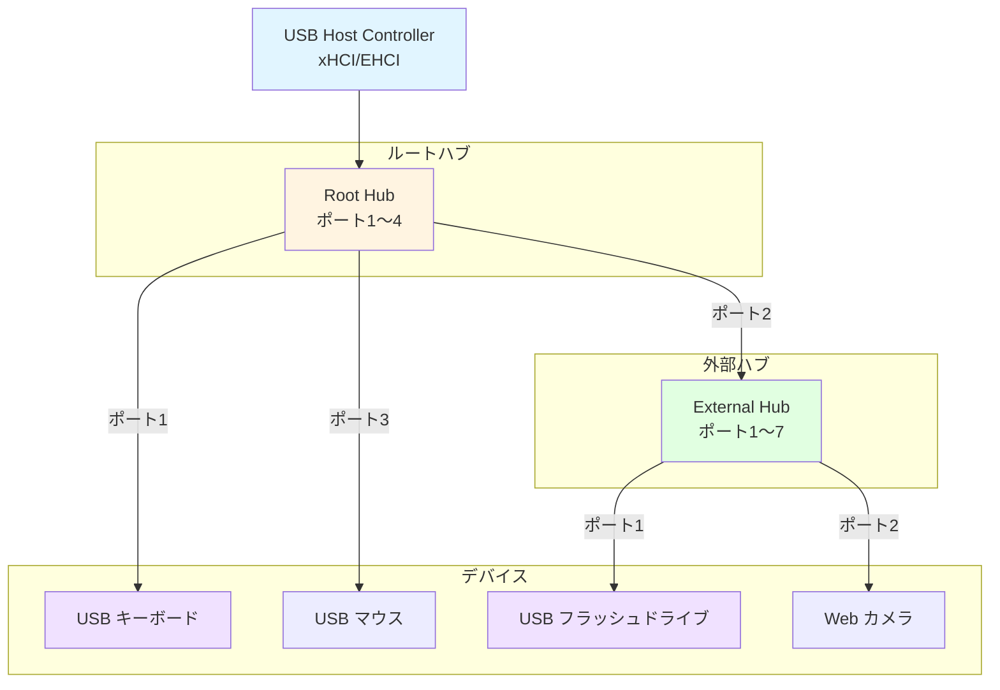
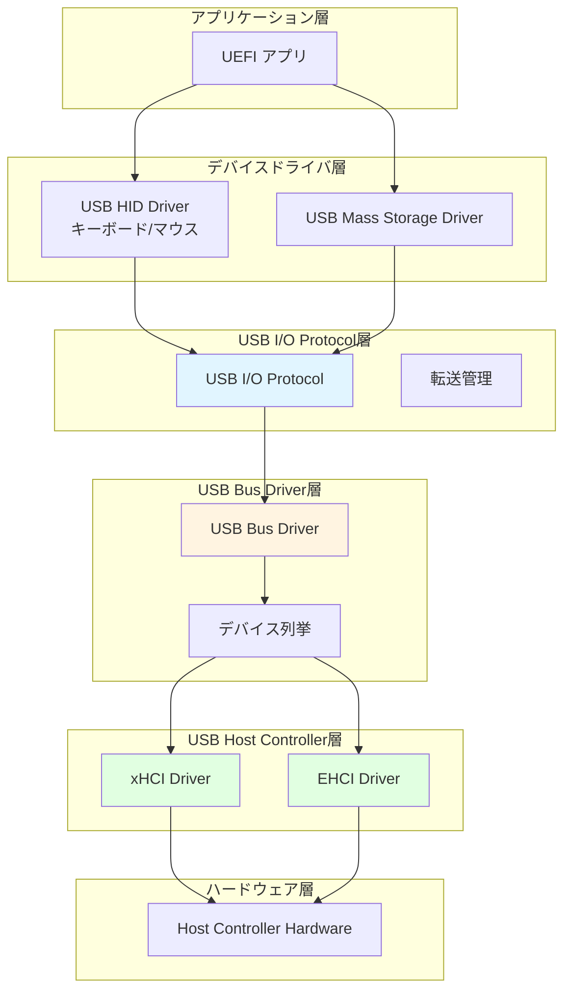
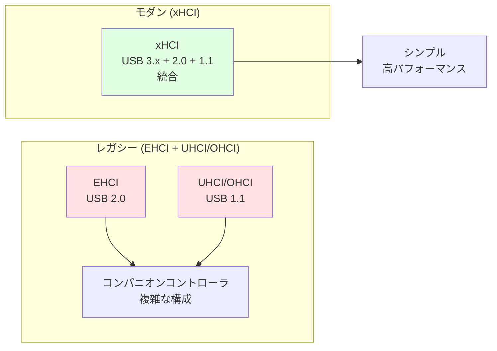
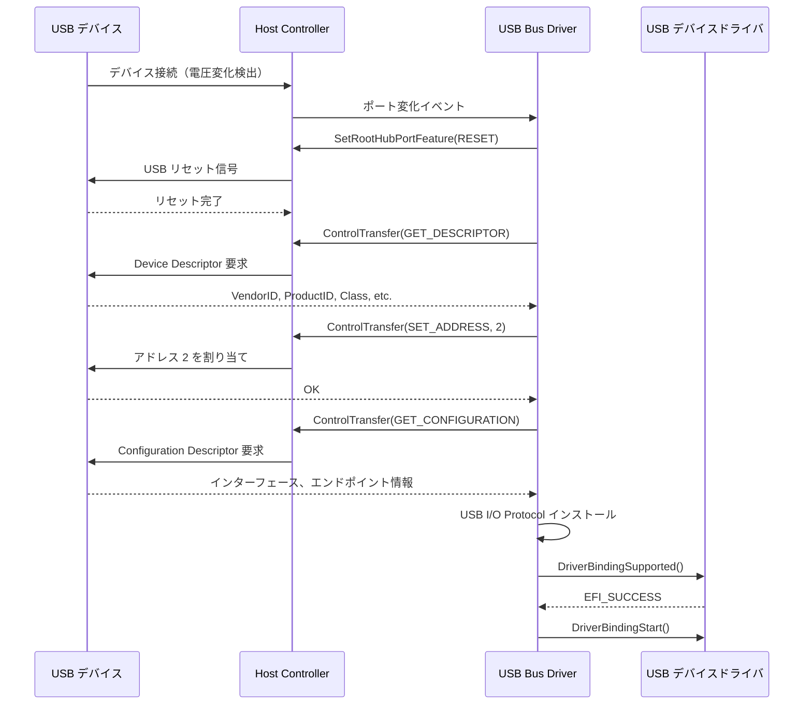
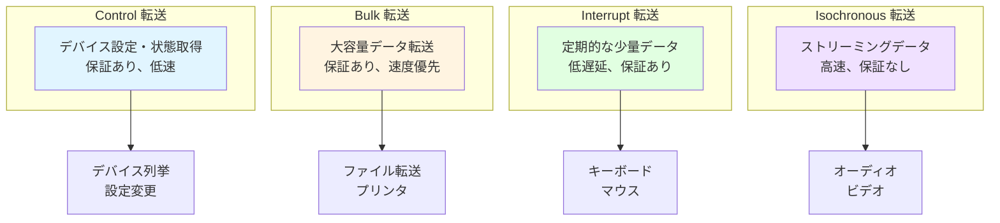
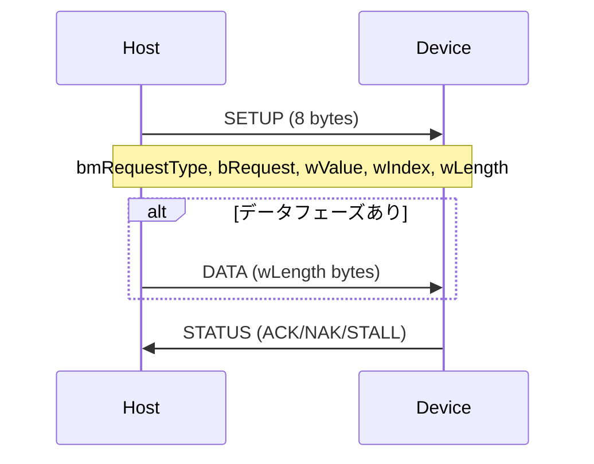
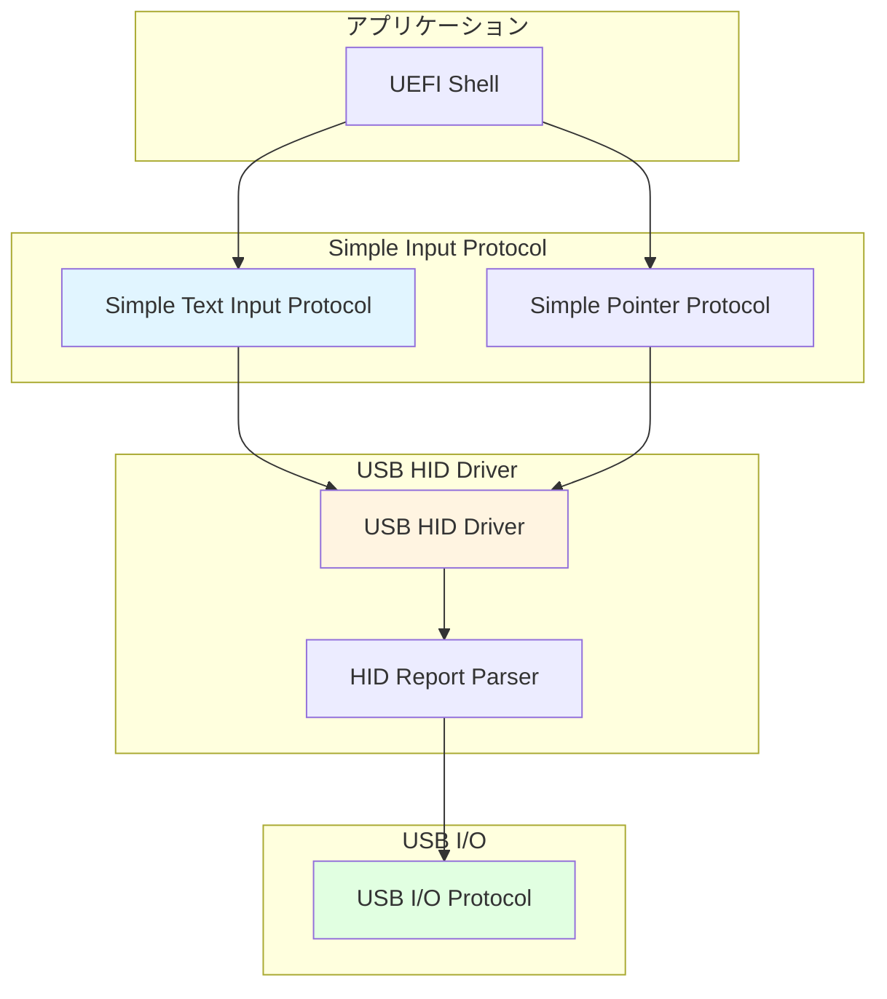
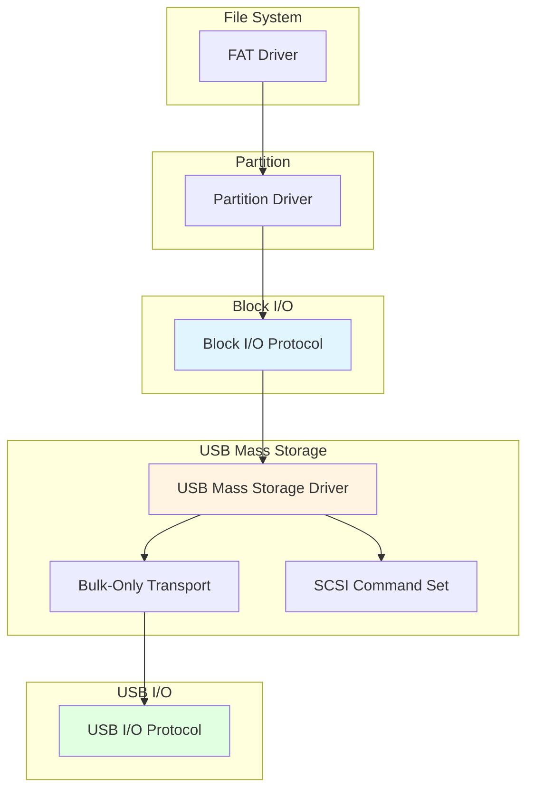
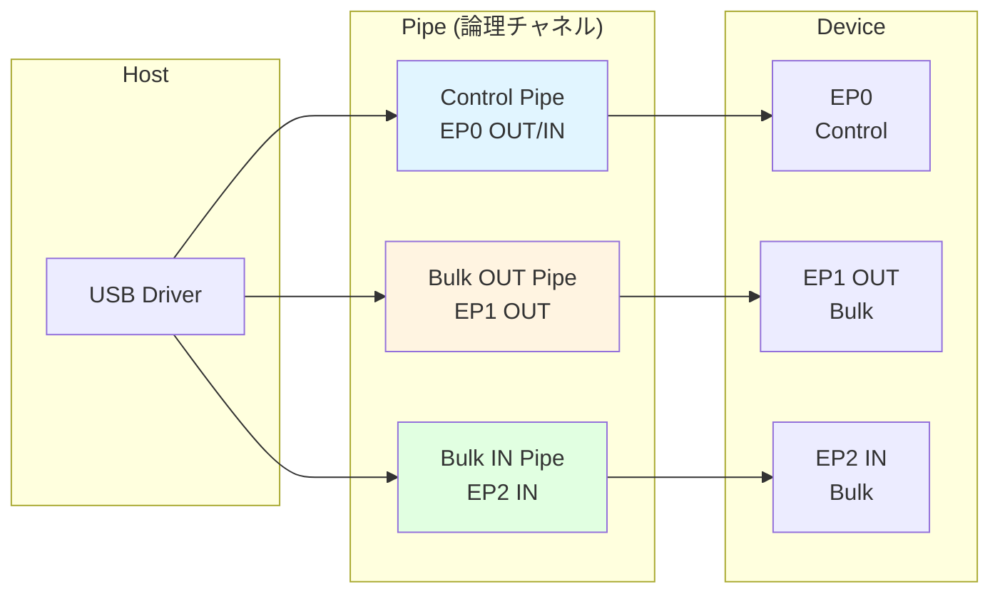
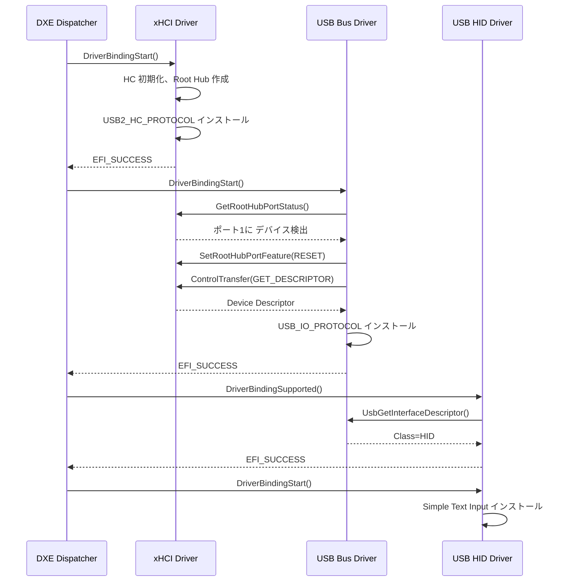

# USB スタックの構造

🎯 **この章で学ぶこと**
- USB アーキテクチャの階層構造（Host Controller、Hub、Device）
- USB Host Controller の種類と役割（xHCI、EHCI、UHCI、OHCI）
- USB デバイスの列挙プロセスと USB Bus Driver の役割
- USB I/O Protocol と転送タイプ（Control、Bulk、Interrupt、Isochronous）

📚 **前提知識**
- [Part II: プロトコルとドライバモデルの理解](03-protocol-and-driver-model.md)
- [Part II: ハードウェア抽象化の仕組み](05-hardware-abstraction.md)

---

## USB アーキテクチャの全体像

### USB の階層構造

USB (Universal Serial Bus) は、コンピュータと周辺機器を接続するための標準化されたインターフェースです。USB の最も重要な特徴は、**ホストを頂点とした階層的なトポロジ**を採用していることです。この階層構造では、必ず1つのホストコントローラが存在し、そのホストの下に複数のハブとデバイスが接続されます。USB の階層は、木構造 (tree structure) として表現でき、ホストがルート、ハブが中間ノード、デバイスがリーフノードに相当します。

USB の階層構造には、いくつかの重要な制約があります。まず、1つのホストに対して、ハブを介して最大 127 台のデバイスを接続できます。この制限は、USB プロトコルがデバイスアドレスとして 7 ビット (1～127) を使用するためです。アドレス 0 は、デバイス列挙時の一時的なデフォルトアドレスとして予約されています。次に、ハブの階層は最大 5 段階まで接続できますが、実際には 3～4 段階程度が推奨されます。これは、信号品質の劣化と遅延の増加を防ぐためです。さらに、USB は**ホスト主導 (host-initiated)** のプロトコルであり、すべての転送はホストが開始します。デバイスは自発的にデータを送信できず、ホストからのポーリングを待つ必要があります。

USB の階層構造における各要素は、明確な役割を持っています。**Host Controller** は、USB バス全体を制御し、すべてのデータ転送をスケジューリングします。ホストコントローラは、マザーボード上のチップセットに統合されており、xHCI や EHCI といった規格に準拠しています。**Root Hub** は、ホストコントローラに内蔵されたハブであり、マザーボード上の USB ポートとして現れます。ルートハブは、外部デバイスやハブを接続する最初の接点です。**Hub** は、ポート拡張、電源管理、デバイス検出の機能を提供します。ハブは、複数のデバイスを1つの USB ポートに接続できるようにし、各ポートの電源のオン/オフを管理します。**Device** は、キーボード、マウス、ストレージ、カメラなどの周辺機器です。各デバイスは、1つ以上の**エンドポイント (Endpoint)** を持ち、エンドポイントはデバイス内のデータ送受信の「口」として機能します。

この階層構造の利点は、複数のデバイスを同時に接続できること、デバイスのホットプラグ (抜き挿し) をサポートできること、そして各デバイスが独立して動作できることです。UEFI ファームウェアは、この階層構造を正しく理解し、各階層に対応するドライバを提供する必要があります。

**補足図: USB の階層構造**



**参考表: USB の基本要素**

| 要素 | 役割 | 例 |
|------|------|-----|
| **Host Controller** | USB バスを制御し、転送をスケジューリング | xHCI、EHCI |
| **Root Hub** | ホストコントローラ内蔵のハブ | PCのマザーボード上のUSBポート |
| **Hub** | ポート拡張、電源管理、デバイス検出 | USB ハブ |
| **Device** | 周辺機器 | キーボード、マウス、ストレージ |
| **Endpoint** | デバイス内のデータ送受信のエンドポイント | IN/OUT エンドポイント |

---

## UEFI USB スタックの階層

### スタックの構成



---

## USB Host Controller の種類

### Host Controller の進化

USB には複数の世代があり、それぞれ異なる Host Controller 規格があります。

| 規格 | USB 世代 | 最大速度 | ドライバ | 説明 |
|------|---------|---------|---------|------|
| **UHCI** | USB 1.1 | 12 Mbps (Full-Speed) | UHCI Driver | Intel 設計、シンプル |
| **OHCI** | USB 1.1 | 12 Mbps (Full-Speed) | OHCI Driver | Compaq/Microsoft 設計 |
| **EHCI** | USB 2.0 | 480 Mbps (High-Speed) | EHCI Driver | USB 2.0 標準 |
| **xHCI** | USB 3.0/3.1/3.2 | 5～20 Gbps (SuperSpeed) | xHCI Driver | 最新規格、USB 2.0 も統合 |

### xHCI の優位性

**xHCI (eXtensible Host Controller Interface)** は USB 3.0 以降の標準で、以下の利点があります：



**利点**:
- USB 3.x、2.0、1.1 すべてを1つのコントローラでサポート
- メモリ効率が良い（イベントリング方式）
- 低レイテンシ、高スループット

---

## USB2 Host Controller Protocol

### プロトコル定義

**`EFI_USB2_HC_PROTOCOL`** は、Host Controller ハードウェアを抽象化します。

```c
typedef struct _EFI_USB2_HC_PROTOCOL {
  EFI_USB2_HC_PROTOCOL_GET_CAPABILITY           GetCapability;
  EFI_USB2_HC_PROTOCOL_RESET                    Reset;
  EFI_USB2_HC_PROTOCOL_GET_STATE                GetState;
  EFI_USB2_HC_PROTOCOL_SET_STATE                SetState;
  EFI_USB2_HC_PROTOCOL_CONTROL_TRANSFER         ControlTransfer;
  EFI_USB2_HC_PROTOCOL_BULK_TRANSFER            BulkTransfer;
  EFI_USB2_HC_PROTOCOL_ASYNC_INTERRUPT_TRANSFER AsyncInterruptTransfer;
  EFI_USB2_HC_PROTOCOL_SYNC_INTERRUPT_TRANSFER  SyncInterruptTransfer;
  EFI_USB2_HC_PROTOCOL_ISOCHRONOUS_TRANSFER     IsochronousTransfer;
  EFI_USB2_HC_PROTOCOL_ASYNC_ISOCHRONOUS_TRANSFER AsyncIsochronousTransfer;
  EFI_USB2_HC_PROTOCOL_GET_ROOTHUB_PORT_STATUS  GetRootHubPortStatus;
  EFI_USB2_HC_PROTOCOL_SET_ROOTHUB_PORT_FEATURE SetRootHubPortFeature;
  EFI_USB2_HC_PROTOCOL_CLEAR_ROOTHUB_PORT_FEATURE ClearRootHubPortFeature;
  UINT16                                        MajorRevision;
  UINT16                                        MinorRevision;
} EFI_USB2_HC_PROTOCOL;
```

### 主要メソッドの役割

| メソッド | 役割 |
|---------|------|
| **GetCapability** | ポート数、速度サポート情報を取得 |
| **ControlTransfer** | Control 転送（デバイス設定、情報取得） |
| **BulkTransfer** | Bulk 転送（大容量データ転送） |
| **AsyncInterruptTransfer** | Interrupt 転送（キーボード、マウス入力） |
| **GetRootHubPortStatus** | ルートハブポートの状態取得 |
| **SetRootHubPortFeature** | ポートの電源ON、リセットなど |

---

## USB デバイスの列挙プロセス

### デバイス接続から認識まで



### 列挙の手順

1. **デバイス検出**: ポート電圧の変化を検出
2. **リセット**: デバイスをリセットし、デフォルトアドレス (0) に設定
3. **Descriptor 取得**: Device Descriptor から基本情報を取得
4. **アドレス設定**: 一意なアドレスを割り当て（1～127）
5. **Configuration 取得**: 詳細な構成情報を取得
6. **ドライバ接続**: USB I/O Protocol をインストールし、適切なドライバに接続

---

## USB I/O Protocol

### プロトコル定義

**`EFI_USB_IO_PROTOCOL`** は、USB デバイスへの統一的なアクセスを提供します。

```c
typedef struct _EFI_USB_IO_PROTOCOL {
  EFI_USB_IO_CONTROL_TRANSFER           UsbControlTransfer;
  EFI_USB_IO_BULK_TRANSFER              UsbBulkTransfer;
  EFI_USB_IO_ASYNC_INTERRUPT_TRANSFER   UsbAsyncInterruptTransfer;
  EFI_USB_IO_SYNC_INTERRUPT_TRANSFER    UsbSyncInterruptTransfer;
  EFI_USB_IO_ISOCHRONOUS_TRANSFER       UsbIsochronousTransfer;
  EFI_USB_IO_ASYNC_ISOCHRONOUS_TRANSFER UsbAsyncIsochronousTransfer;
  EFI_USB_IO_GET_DEVICE_DESCRIPTOR      UsbGetDeviceDescriptor;
  EFI_USB_IO_GET_CONFIG_DESCRIPTOR      UsbGetConfigDescriptor;
  EFI_USB_IO_GET_INTERFACE_DESCRIPTOR   UsbGetInterfaceDescriptor;
  EFI_USB_IO_GET_ENDPOINT_DESCRIPTOR    UsbGetEndpointDescriptor;
  EFI_USB_IO_GET_STRING_DESCRIPTOR      UsbGetStringDescriptor;
  EFI_USB_IO_GET_SUPPORTED_LANGUAGES    UsbGetSupportedLanguages;
  EFI_USB_IO_PORT_RESET                 UsbPortReset;
} EFI_USB_IO_PROTOCOL;
```

### Descriptor の種類

| Descriptor | 内容 | 取得メソッド |
|-----------|------|-------------|
| **Device** | VendorID、ProductID、Class、SubClass | UsbGetDeviceDescriptor |
| **Configuration** | 消費電力、インターフェース数 | UsbGetConfigDescriptor |
| **Interface** | Class、SubClass、Protocol | UsbGetInterfaceDescriptor |
| **Endpoint** | 転送タイプ、方向、最大パケットサイズ | UsbGetEndpointDescriptor |
| **String** | 製品名、シリアル番号など | UsbGetStringDescriptor |

---

## USB 転送タイプ

### 4つの転送タイプ

USB は、用途に応じて 4 種類の転送タイプを定義しています。



### 各転送タイプの特性

| 転送タイプ | 用途 | データ保証 | 帯域保証 | 遅延 | 例 |
|-----------|------|----------|---------|------|-----|
| **Control** | デバイス制御 | あり | なし | 中 | Descriptor 取得、設定変更 |
| **Bulk** | 大容量転送 | あり | なし | 大 | ストレージ、プリンタ |
| **Interrupt** | 定期ポーリング | あり | あり | 小 | HID（キーボード、マウス） |
| **Isochronous** | リアルタイム | なし | あり | 極小 | オーディオ、ビデオ |

### Control 転送の構造

Control 転送は、**Setup、Data、Status** の3フェーズで構成されます。



**Setup パケットの例**:

```c
// GET_DESCRIPTOR (Device Descriptor) 要求
EFI_USB_DEVICE_REQUEST Request;
Request.RequestType = 0x80;  // Device-to-Host, Standard, Device
Request.Request     = 0x06;  // GET_DESCRIPTOR
Request.Value       = 0x0100; // Device Descriptor (Type=1, Index=0)
Request.Index       = 0;
Request.Length      = 18;     // Device Descriptor は 18 バイト
```

---

## USB デバイスドライバの例

### USB HID (Human Interface Device) ドライバ

**HID** は、キーボード、マウス、ゲームコントローラなどの入力デバイス用のクラスです。



#### HID の動作原理

1. **Interrupt IN エンドポイント**で定期的にデータを受信
2. **HID Report Descriptor** を解析し、データフォーマットを理解
3. **Report** を Simple Input Protocol や Simple Pointer Protocol に変換

### USB Mass Storage ドライバ

USB フラッシュドライブや外付け HDD は **Mass Storage Class** を使用します。



#### Mass Storage の通信プロトコル

**BOT (Bulk-Only Transport)** を使用：

1. **Command**: SCSI コマンドを Bulk OUT で送信
2. **Data**: データを Bulk IN/OUT で転送
3. **Status**: ステータスを Bulk IN で受信

---

## エンドポイントとパイプ

### エンドポイントの概念

**エンドポイント**は、USB デバイス内のデータ送受信の「口」です。各エンドポイントには、以下の属性があります：

| 属性 | 説明 | 例 |
|------|------|-----|
| **番号** | 0～15（エンドポイント 0 は制御用） | EP0, EP1, EP2 |
| **方向** | IN（デバイス→ホスト）/ OUT（ホスト→デバイス） | IN, OUT |
| **転送タイプ** | Control, Bulk, Interrupt, Isochronous | Bulk |
| **最大パケットサイズ** | 1回の転送で送受信できる最大バイト数 | 64, 512 |

### パイプ

**パイプ**は、ホストとエンドポイント間の論理的な通信チャネルです。



---

## USB スタックの初期化フロー

### システム起動時の USB 初期化



---

## まとめ

この章では、UEFI における USB スタックの構造と動作原理を詳しく学びました。USB は、ホストを頂点とした階層的なトポロジを採用しており、Host Controller → Root Hub → Hub → Device という階層構造を持っています。この階層構造により、最大 127 台のデバイスを1つのホストに接続でき、デバイスのホットプラグをサポートできます。USB の重要な特徴は、ホスト主導のプロトコルであることです。すべてのデータ転送はホストが開始し、デバイスは自発的にデータを送信できません。

USB Host Controller には、複数の世代と規格があります。最新の **xHCI (eXtensible Host Controller Interface)** は、USB 3.x、2.0、1.1 のすべてをサポートする統合コントローラであり、メモリ効率が良く、低レイテンシで高スループットを実現します。レガシーコントローラである EHCI (USB 2.0)、UHCI と OHCI (USB 1.1) は、複数のコントローラを組み合わせる必要があり、構成が複雑でした。xHCI は、これらの複雑さを解消し、1つのコントローラですべての USB デバイスをサポートします。

UEFI は、Host Controller を抽象化するために **EFI_USB2_HC_PROTOCOL** を提供します。このプロトコルは、ControlTransfer、BulkTransfer、AsyncInterruptTransfer などの転送メソッドと、GetRootHubPortStatus、SetRootHubPortFeature などのポート管理メソッドを提供します。これにより、上位層のドライバは、Host Controller のハードウェア実装の詳細を知る必要がなく、統一的なインターフェースを通じて USB デバイスにアクセスできます。

USB デバイスの列挙プロセスは、USB Bus Driver が自動的に実行します。デバイスが接続されると、Bus Driver は次の手順を実行します。まず、デバイスをリセットし、デフォルトアドレス (0) に設定します。次に、ControlTransfer を使用して Device Descriptor を取得し、VendorID、ProductID、Class などの基本情報を読み取ります。その後、デバイスに一意なアドレス (1～127) を割り当てます。さらに、Configuration Descriptor を取得し、インターフェース、エンドポイントの詳細情報を読み取ります。最後に、USB I/O Protocol をインストールし、適切なデバイスドライバに接続します。この列挙プロセスにより、USB デバイスは UEFI ファームウェアから認識され、使用可能になります。

**EFI_USB_IO_PROTOCOL** は、USB デバイスへの統一的なアクセスを提供する高レベルプロトコルです。このプロトコルは、デバイスごとにインストールされ、USB デバイスドライバが使用します。USB I/O Protocol は、UsbControlTransfer、UsbBulkTransfer、UsbSyncInterruptTransfer などの転送メソッドと、UsbGetDeviceDescriptor、UsbGetConfigDescriptor などの Descriptor 取得メソッドを提供します。デバイスドライバは、このプロトコルを通じて、USB デバイスの詳細情報を取得し、データ転送を実行できます。

USB は、用途に応じて 4 種類の転送タイプを定義しています。**Control 転送**は、デバイスの設定と状態取得に使用され、データ保証がありますが、帯域保証はありません。**Bulk 転送**は、大容量データ転送に使用され、データ保証がありますが、遅延が大きくなる可能性があります。**Interrupt 転送**は、キーボードやマウスなどの定期的な少量データ転送に使用され、低遅延とデータ保証の両方を提供します。**Isochronous 転送**は、オーディオやビデオなどのリアルタイムストリーミングに使用され、帯域保証がありますが、データ保証はありません。これらの転送タイプを適切に使い分けることで、USB は多様なデバイスをサポートできます。

USB デバイスドライバには、デバイスクラスに応じた複数の種類があります。**USB HID (Human Interface Device) ドライバ**は、キーボード、マウス、ゲームコントローラなどの入力デバイスをサポートします。HID ドライバは、Interrupt IN エンドポイントで定期的にデータを受信し、HID Report Descriptor を解析してデータフォーマットを理解し、Simple Text Input Protocol や Simple Pointer Protocol に変換します。**USB Mass Storage ドライバ**は、USB フラッシュドライブや外付け HDD をサポートします。Mass Storage ドライバは、BOT (Bulk-Only Transport) プロトコルを使用し、SCSI コマンドセットでデバイスと通信し、Block I/O Protocol を提供します。これらのドライバにより、UEFI ファームウェアは USB デバイスを認識し、使用できます。

### 次章の予告

次章では、**ブートマネージャとブートローダの役割**について学びます。UEFI Boot Manager は、複数の OS やブートオプションを管理し、ユーザーが選択したブートターゲットをロードします。Boot#### 変数、デバイスパス、Load Option の構造、そして UEFI アプリケーションとしてのブートローダの実装を詳しく見ていきます。

---

📚 **参考資料**
- [UEFI Specification v2.10 - Section 18: USB Host Controller Protocol](https://uefi.org/specifications)
- [UEFI Specification v2.10 - Section 18: USB I/O Protocol](https://uefi.org/specifications)
- [USB Specification 3.2](https://www.usb.org/documents)
- [xHCI Specification](https://www.intel.com/content/www/us/en/io/universal-serial-bus/extensible-host-controler-interface-usb-xhci.html)
- [USB HID Usage Tables](https://usb.org/sites/default/files/hut1_21_0.pdf)
