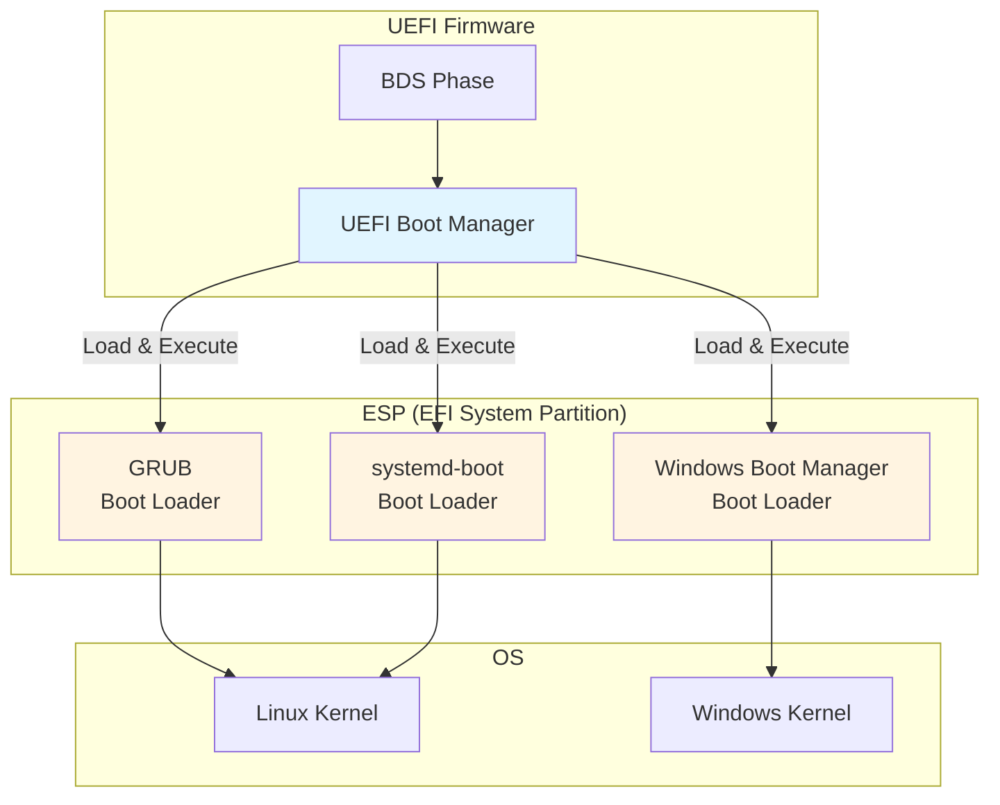
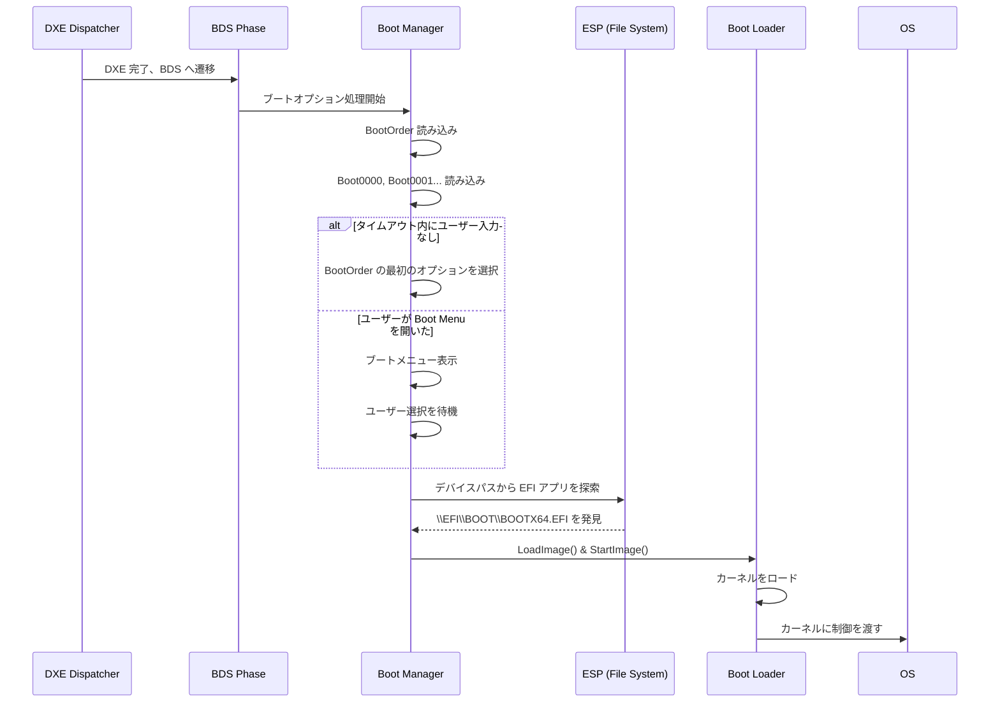
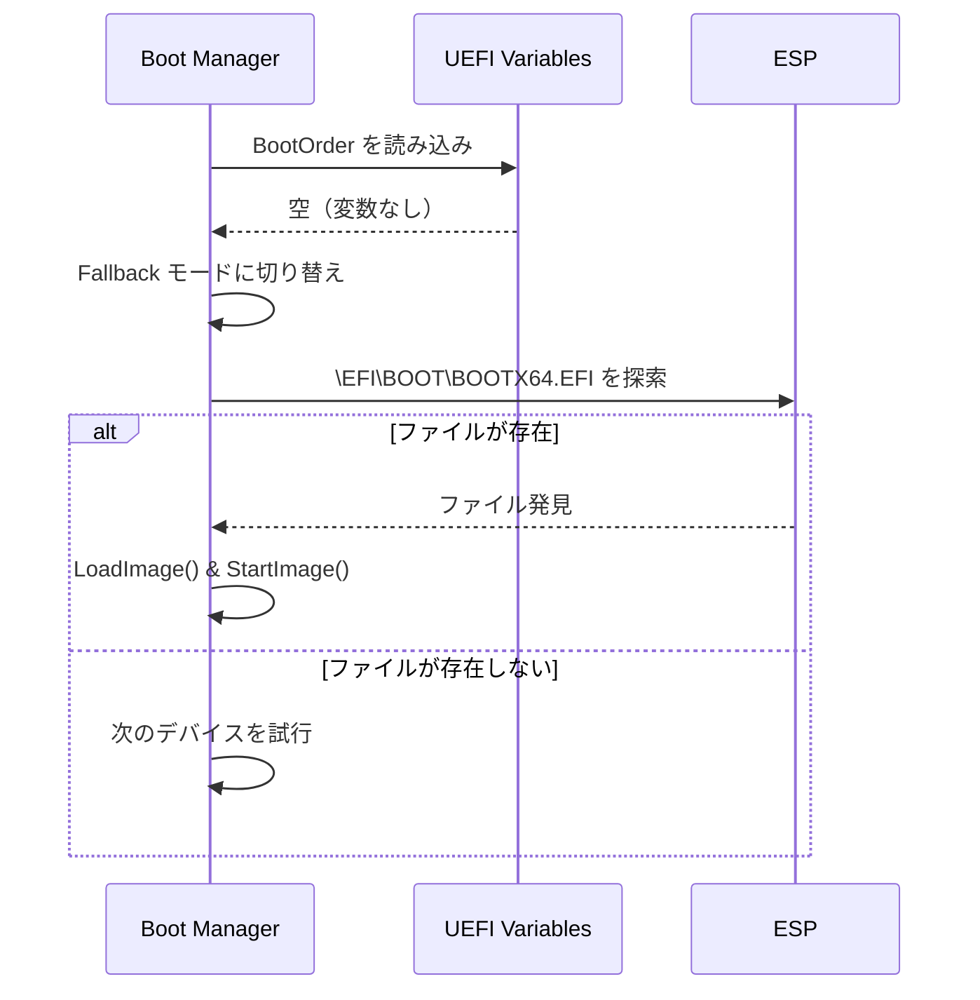
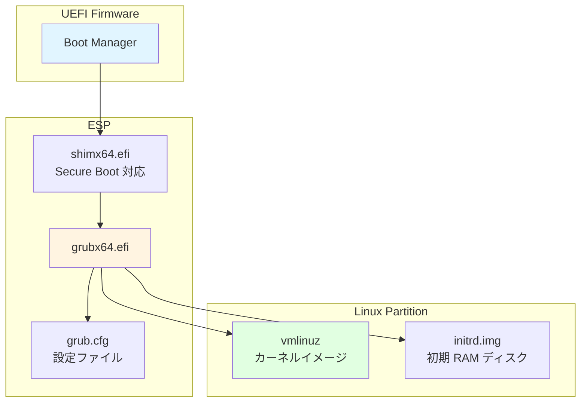
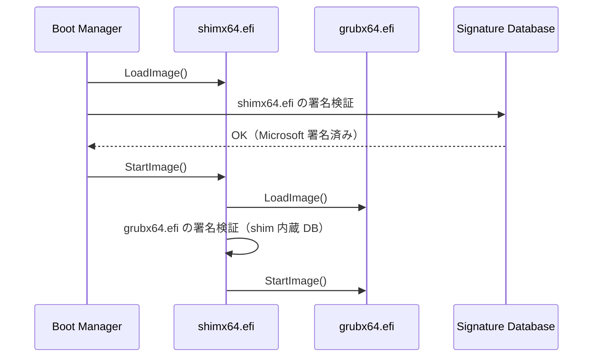

# ブートマネージャとブートローダの役割

🎯 **この章で学ぶこと**
- UEFI Boot Manager の役割とアーキテクチャ
- Boot#### UEFI 変数によるブートオプション管理
- デバイスパスと Load Option の構造
- BDS (Boot Device Selection) Phase の動作
- Boot Manager と Boot Loader の違いと関係

📚 **前提知識**
- [Part I: UEFI ブートフローの全体像](../part1/05-uefi-boot-flow.md)
- [Part II: ハードウェア抽象化の仕組み](05-hardware-abstraction.md)

---

## Boot Manager と Boot Loader の違い

### 役割の分離

コンピュータの起動プロセスについて学ぶとき、**Boot Manager** と **Boot Loader** という用語が頻繁に登場します。多くの人がこれらを混同しがちですが、実際には異なる役割を持つ別々のコンポーネントです。この違いを正しく理解することは、UEFI ブートプロセスの全体像を把握するために不可欠です。

**Boot Manager** は、UEFI ファームウェアの一部として実装されており、ファームウェアの ROM に組み込まれています。Boot Manager の主な役割は、ブートオプションの管理と選択です。具体的には、UEFI 変数に保存された複数のブートオプションを読み込み、優先順位に従ってどのブートターゲットを起動するかを決定します。Boot Manager は、ユーザーにブートメニューを表示してブートターゲットを選択させることもできますし、タイムアウト後に自動的にデフォルトのブートオプションを選択することもできます。Boot Manager の最終的な仕事は、選択されたブートオプションに対応する EFI アプリケーションをメモリにロードし、実行を開始することです。

一方、**Boot Loader** は、ESP (EFI System Partition) 上に保存された UEFI アプリケーションです。Boot Loader は、ファームウェアの外部に存在し、独立したファイルとして配布されます。Linux の GRUB、systemd-boot、Windows の Windows Boot Manager などが、Boot Loader の代表例です。Boot Loader の主な役割は、オペレーティングシステムのカーネルをメモリにロードし、起動パラメータを設定し、カーネルに制御を渡すことです。Boot Loader は、ファイルシステムを理解し、カーネルイメージや initrd (初期 RAM ディスク) を読み込む能力を持っています。また、Boot Loader は、複数のカーネルバージョンや起動オプションを管理し、ユーザーに選択肢を提供することもあります。

**重要なポイント**は、Boot Loader も UEFI アプリケーションであり、Boot Manager によってロードされるということです。つまり、Boot Manager が最初に起動し、その後 Boot Manager が Boot Loader を見つけてロードし、最後に Boot Loader がカーネルをロードします。この二段階のプロセスにより、ファームウェアと OS の間に明確な分離が生まれ、異なる OS を同じファームウェア上で起動できるようになります。

この役割の分離には、いくつかの利点があります。まず、**柔軟性**です。ファームウェアは、どのような Boot Loader がインストールされているかを知る必要がなく、標準的なインターフェース (UEFI アプリケーション) を通じてロードするだけです。次に、**独立性**です。Boot Loader は、ファームウェアの実装に依存せず、独自の更新サイクルで開発できます。さらに、**マルチブート**のサポートです。複数の Boot Loader を ESP にインストールし、Boot Manager がそれらを管理することで、複数の OS を同じマシンで起動できます。

**補足図: Boot Manager と Boot Loader の関係**



**参考表: Boot Manager と Boot Loader の定義**

| コンポーネント | 実装場所 | 責務 | 例 |
|--------------|---------|------|-----|
| **Boot Manager** | UEFI Firmware 内蔵 | ブートオプション管理、選択、EFI アプリケーションのロード | UEFI Boot Manager |
| **Boot Loader** | ESP 上の EFI アプリ | カーネルのロード、起動パラメータ設定 | GRUB、systemd-boot、Windows Boot Manager |

---

## UEFI Boot Manager のアーキテクチャ

### Boot Manager の役割

UEFI Boot Manager は **BDS (Boot Device Selection) Phase** で動作し、以下の責務を持ちます：

1. **ブートオプションの管理**: UEFI 変数に保存されたブートオプションを読み込み
2. **ブートデバイスの列挙**: 接続されたストレージデバイスを検出
3. **ユーザーインタラクション**: ブートメニューの表示（オプション）
4. **EFI アプリケーションのロード**: 選択されたブートオプションを実行

### BDS Phase でのブートフロー



---

## Boot#### UEFI 変数

### UEFI 変数とは

**UEFI 変数**は、ファームウェアが不揮発性ストレージ（通常は SPI フラッシュ）に保存する設定データです。ブートオプションは以下の変数で管理されます：

| 変数名 | 用途 | データ型 |
|--------|------|---------|
| **BootOrder** | ブートオプションの優先順位 | UINT16 配列 |
| **Boot0000** | ブートオプション 0 の詳細 | EFI_LOAD_OPTION |
| **Boot0001** | ブートオプション 1 の詳細 | EFI_LOAD_OPTION |
| **BootNext** | 次回起動時のみ使用するブートオプション | UINT16 |
| **BootCurrent** | 現在起動したブートオプション（読み取り専用） | UINT16 |

### BootOrder の例

```
BootOrder = [0x0001, 0x0000, 0x0003]
```

この場合、以下の順序でブートを試みます：

1. `Boot0001`（例: Ubuntu）
2. `Boot0000`（例: Windows Boot Manager）
3. `Boot0003`（例: UEFI Shell）

### Boot#### 変数の構造

**`EFI_LOAD_OPTION`** 構造体は、各ブートオプションの詳細を保存します。

```c
typedef struct {
  UINT32 Attributes;         // ブートオプションの属性
  UINT16 FilePathListLength; // デバイスパスのバイト数
  CHAR16 Description[];      // NULL終端の説明文字列
  // Description の直後に以下が続く
  // EFI_DEVICE_PATH_PROTOCOL FilePathList[];
  // UINT8 OptionalData[];
} EFI_LOAD_OPTION;
```

### Attributes の定義

| ビット | 名前 | 説明 |
|-------|------|------|
| 0 | LOAD_OPTION_ACTIVE | 1 = 有効、0 = 無効 |
| 1 | LOAD_OPTION_FORCE_RECONNECT | デバイス再接続を強制 |
| 2 | LOAD_OPTION_HIDDEN | ブートメニューに表示しない |
| 8-15 | LOAD_OPTION_CATEGORY | カテゴリ（App, Boot, etc.） |

---

## デバイスパスによるブートターゲット指定

### デバイスパスの役割

Boot#### 変数の `FilePathList` には、**ブートローダへの完全なパス**が保存されます。これは Device Path Protocol を使って表現されます。

### 典型的なデバイスパスの例

**Ubuntu の GRUB**:

```
HD(1,GPT,<GUID>,0x800,0x100000)/\EFI\ubuntu\grubx64.efi
```

**解析**:

1. **HD(1,GPT,<GUID>,0x800,0x100000)**
   - パーティション 1（GPT、固有 GUID）
   - 開始 LBA: 0x800
   - サイズ: 0x100000 ブロック

2. **\EFI\ubuntu\grubx64.efi**
   - パーティション内のファイルパス

### リムーバブルメディアのデバイスパス

USB フラッシュドライブなど、リムーバブルメディアの場合：

```
PciRoot(0x0)/Pci(0x14,0x0)/USB(0,0)/HD(1,MBR,0x12345678,0x800,0x100000)/\EFI\BOOT\BOOTX64.EFI
```

**解析**:

1. **PciRoot(0x0)**: ルート複合デバイス
2. **Pci(0x14,0x0)**: PCI デバイス（USB コントローラ）
3. **USB(0,0)**: USB ポート 0
4. **HD(...)**: パーティション情報
5. **\EFI\BOOT\BOOTX64.EFI**: ファイルパス

---

## Load Option の実例

### Boot0001 (Ubuntu) の例

```
Attributes: 0x00000001 (LOAD_OPTION_ACTIVE)
FilePathListLength: 112
Description: "ubuntu"
FilePathList:
  HD(1,GPT,12345678-1234-1234-1234-123456789abc,0x800,0x100000)
  File(\EFI\ubuntu\shimx64.efi)
OptionalData: (空)
```

### OptionalData の用途

`OptionalData` には、ブートローダに渡す追加パラメータを保存できます。

**例**: Linux カーネルパラメータ

```
OptionalData: "root=/dev/sda2 quiet splash"
```

ただし、実際には多くのブートローダは `OptionalData` を使わず、独自の設定ファイル（GRUB の grub.cfg など）を使用します。

---

## ブートオプションの作成と管理

### efibootmgr (Linux)

Linux では **efibootmgr** コマンドでブートオプションを管理します。

```bash
# 現在のブートオプションを表示
$ efibootmgr
BootCurrent: 0001
BootOrder: 0001,0000,0003
Boot0000* Windows Boot Manager
Boot0001* ubuntu
Boot0003* UEFI Shell

# 新しいブートオプションを作成
$ efibootmgr --create \
  --disk /dev/sda \
  --part 1 \
  --label "My Linux" \
  --loader '\EFI\mylinux\grubx64.efi'

# ブートオプションを削除
$ efibootmgr --bootnum 0003 --delete-bootnum

# BootOrder を変更
$ efibootmgr --bootorder 0001,0000
```

### bcdedit (Windows)

Windows では **bcdedit** コマンドを使用します。

```cmd
REM ブート設定を表示
bcdedit /enum firmware

REM UEFI ファームウェア設定を開くオプションを追加
bcdedit /set {fwbootmgr} displayorder {bootmgr} /addlast
```

---

## Fallback Boot Path

### デフォルトブートパスの仕組み

UEFI 仕様では、**リムーバブルメディア**用のデフォルトパスを定義しています。これにより、Boot#### 変数がなくてもブート可能です。

| アーキテクチャ | デフォルトパス |
|-------------|---------------|
| x86_64 | \EFI\BOOT\BOOTX64.EFI |
| x86 (32-bit) | \EFI\BOOT\BOOTIA32.EFI |
| ARM64 | \EFI\BOOT\BOOTAA64.EFI |
| ARM (32-bit) | \EFI\BOOT\BOOTARM.EFI |

### Fallback の動作



この仕組みにより、**USB インストールメディア**は特別な設定なしでブート可能です。

---

## Boot Loader の種類と動作

### GRUB (GRand Unified Bootloader)

**GRUB** は Linux で最も一般的なブートローダです。



**GRUB の動作**:

1. **shimx64.efi** が Secure Boot 検証を実行
2. **grubx64.efi** がロードされる
3. **grub.cfg** を読み込み、ブートメニューを表示
4. ユーザー選択に基づき **vmlinuz** と **initrd.img** をロード
5. カーネルに制御を渡す

### systemd-boot

**systemd-boot** は、シンプルで高速なブートローダです。

**特徴**:

- UEFI のみサポート（BIOS 非対応）
- 設定ファイルが非常にシンプル
- Secure Boot サポート

**設定例** (`loader/entries/arch.conf`):

```
title   Arch Linux
linux   /vmlinuz-linux
initrd  /initramfs-linux.img
options root=/dev/sda2 rw quiet
```

### Windows Boot Manager

**Windows Boot Manager** (`\EFI\Microsoft\Boot\bootmgfw.efi`) は、Windows 専用のブートローダです。

**動作**:

1. **BCD (Boot Configuration Data)** を読み込み
2. ブートメニュー表示（複数の Windows がある場合）
3. **winload.efi** をロードし、Windows カーネルを起動

---

## Secure Boot とブートプロセス

### Secure Boot の影響

**Secure Boot** が有効な場合、Boot Manager は署名されていない EFI アプリケーションの実行を拒否します。



**shim の役割**:

- Microsoft によって署名された中間ローダー
- ディストリビューション固有の証明書で GRUB を検証

---

## まとめ

この章では、UEFI ブートプロセスにおける Boot Manager と Boot Loader の役割、そしてブートオプション管理の仕組みを詳しく学びました。**Boot Manager** と **Boot Loader** は、名前が似ているため混同されがちですが、明確に異なる役割を持っています。Boot Manager は UEFI ファームウェアに内蔵されており、ブートオプションの管理、選択、そして EFI アプリケーションのロードを担当します。一方、Boot Loader は ESP 上の UEFI アプリケーションであり、カーネルのロードと起動パラメータの設定を担当します。重要なのは、Boot Loader も UEFI アプリケーションであり、Boot Manager によってロードされるという点です。この二段階のプロセスにより、ファームウェアと OS の間に明確な分離が生まれ、柔軟なマルチブート環境を実現します。

ブートオプションは、**Boot#### UEFI 変数**によって管理されます。**BootOrder** 変数は、ブートオプションの優先順位を定義する UINT16 配列であり、Boot Manager はこの順序に従ってブートを試みます。個々のブートオプションは、**Boot0000**、**Boot0001** といった変数に保存され、それぞれが **EFI_LOAD_OPTION** 構造体を含んでいます。EFI_LOAD_OPTION 構造体は、Attributes (有効/無効、表示/非表示などのフラグ)、Description (ブートオプションの説明文字列)、FilePathList (ブートターゲットへのデバイスパス)、OptionalData (ブートローダに渡す追加パラメータ) を含みます。これらの変数は、不揮発性ストレージ (通常は SPI フラッシュ) に保存され、再起動後も保持されます。

**デバイスパス**は、ブートターゲットを一意に識別するための重要な仕組みです。デバイスパスは、パーティション情報とファイルパスで構成され、例えば `HD(1,GPT,<GUID>,0x800,0x100000)/\EFI\ubuntu\grubx64.efi` のように表現されます。この例では、HD 部分が GPT パーティション 1 を指定し、その後のファイルパスがパーティション内の EFI アプリケーションの場所を指定しています。リムーバブルメディアの場合、デバイスパスは PciRoot、Pci、USB などのノードを含み、物理的な接続経路全体を表現します。デバイスパスの柔軟性により、Boot Manager は固定ディスク、リムーバブルメディア、ネットワークブートなど、多様なブートソースをサポートできます。

**BDS (Boot Device Selection) Phase** では、Boot Manager が実際のブート処理を実行します。BDS Phase に入ると、Boot Manager はまず BootOrder 変数を読み込み、優先順位の高いブートオプションから順に試行します。各ブートオプションについて、Boot Manager はデバイスパスを解析し、対応する EFI アプリケーション (Boot Loader) を探索します。ユーザーがブートメニューを開いた場合、Boot Manager はブートオプションのリストを表示し、ユーザーの選択を待ちます。タイムアウト内にユーザー入力がない場合、Boot Manager は自動的にデフォルトのブートオプションを選択します。選択されたブートオプションに対応する EFI アプリケーションが見つかると、Boot Manager は LoadImage() と StartImage() を呼び出し、Boot Loader に制御を渡します。

UEFI 仕様では、**Fallback Boot Path** という仕組みを定義しています。これは、Boot#### 変数が存在しない、または有効なブートオプションが見つからない場合に使用されるデフォルトパスです。x86_64 アーキテクチャでは、`\EFI\BOOT\BOOTX64.EFI` がデフォルトパスとして定義されています。この仕組みにより、USB インストールメディアなどのリムーバブルメディアは、特別な設定なしでブート可能になります。Boot Manager は、Fallback モードに切り替わると、接続されているすべてのストレージデバイスを順に探索し、デフォルトパスに EFI アプリケーションが存在するかを確認します。ファイルが見つかれば、それをロードして実行します。

**Boot Loader** には、複数の種類があります。**GRUB (GRand Unified Bootloader)** は、Linux で最も一般的なブートローダであり、汎用性が高く、多機能です。GRUB は、grub.cfg 設定ファイルを読み込み、複数のカーネルバージョンや起動オプションを管理します。Secure Boot 環境では、shimx64.efi が中間ローダーとして機能し、GRUB をロードする前に署名検証を実行します。**systemd-boot** は、シンプルで高速なブートローダであり、UEFI のみをサポートします (BIOS 非対応)。systemd-boot の設定ファイルは非常にシンプルで、理解しやすいのが特徴です。**Windows Boot Manager** は、Windows 専用のブートローダであり、BCD (Boot Configuration Data) を読み込んで Windows カーネルを起動します。

**Secure Boot** が有効な場合、Boot Manager は署名されていない EFI アプリケーションの実行を拒否します。Boot Manager は、LoadImage() 時に、Signature Database (db 変数) を参照して EFI アプリケーションの署名を検証します。署名が信頼できる証明書でなされている場合のみ、アプリケーションの実行が許可されます。Linux の場合、shim が重要な役割を果たします。shim は Microsoft によって署名された中間ローダーであり、ディストリビューション固有の証明書で GRUB を検証します。この二段階の検証により、Linux ディストリビューションは Secure Boot 環境でも正しく起動できます。

### 次章の予告

次章は **Part II のまとめ**です。これまで学んだ EDK II のアーキテクチャ、モジュール構造、プロトコル、ドライバモデル、ハードウェア抽象化、各種サブシステム（グラフィックス、ストレージ、USB）、そしてブート管理の全体像を振り返ります。Part II で得た知識は、次の Part III「プラットフォーム初期化の仕組み」へとつながります。

---

📚 **参考資料**
- [UEFI Specification v2.10 - Chapter 3: Boot Manager](https://uefi.org/specifications)
- [UEFI Specification v2.10 - Section 3.1.1: UEFI Variables](https://uefi.org/specifications)
- [UEFI Specification v2.10 - Section 3.1.3: Load Option](https://uefi.org/specifications)
- [GRUB Manual](https://www.gnu.org/software/grub/manual/)
- [systemd-boot Documentation](https://www.freedesktop.org/wiki/Software/systemd/systemd-boot/)
- [efibootmgr Man Page](https://linux.die.net/man/8/efibootmgr)
