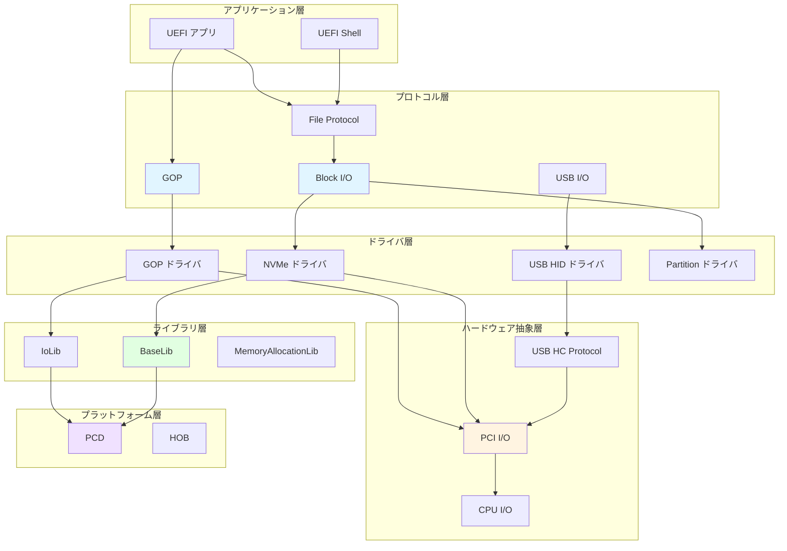
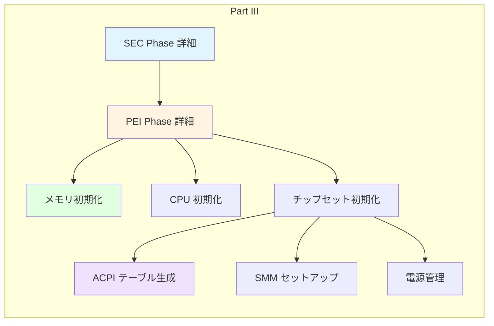

# Part II まとめ

🎯 **Part II で学んだこと**
- EDK II の設計思想とアーキテクチャ全体像
- モジュール構成とビルドシステムの仕組み
- プロトコルとドライバモデルによる拡張性
- ハードウェア抽象化の実現方法
- 主要サブシステム（グラフィックス、ストレージ、USB）の構造
- ブートマネージャとブートローダの役割

---

## Part II の全体構成

Part II では、**EDK II (EFI Development Kit II)** という UEFI ファームウェア実装の事実上の標準について学びました。以下の 10 章を通じて、EDK II の設計哲学から具体的なサブシステムまで、包括的に理解しました。

```mermaid
graph TB
    subgraph "Part II: EDK II の理解"
        CH1[Chapter 1<br/>EDK II アーキテクチャ]
        CH2[Chapter 2<br/>モジュールとビルドシステム]
        CH3[Chapter 3<br/>プロトコルとドライバモデル]
        CH4[Chapter 4<br/>ライブラリアーキテクチャ]
        CH5[Chapter 5<br/>ハードウェア抽象化]
        CH6[Chapter 6<br/>グラフィックス (GOP)]
        CH7[Chapter 7<br/>ストレージスタック]
        CH8[Chapter 8<br/>USB スタック]
        CH9[Chapter 9<br/>ブートマネージャとローダ]
        CH10[Chapter 10<br/>まとめ]
    end

    CH1 --> CH2
    CH2 --> CH3
    CH3 --> CH4
    CH4 --> CH5
    CH5 --> CH6
    CH5 --> CH7
    CH5 --> CH8
    CH8 --> CH9
    CH9 --> CH10

    style CH1 fill:#e1f5ff
    style CH5 fill:#fff4e1
    style CH10 fill:#e1ffe1
```

---

## 各章の振り返り

### Chapter 1: EDK II アーキテクチャ

**学んだこと**:

- EDK II の 4 つの設計原則
  - モジュール性（再利用可能なコンポーネント）
  - 移植性（複数アーキテクチャ対応）
  - 拡張性（プロトコルベース）
  - 標準準拠（UEFI/PI 仕様）

- EDK II のディレクトリ構造
  - `MdePkg`: UEFI/PI 基本定義
  - `MdeModulePkg`: 汎用モジュール
  - `OvmfPkg`: QEMU 用プラットフォーム
  - プラットフォーム固有パッケージ

**重要なポイント**: EDK II は単なるコードベースではなく、**設計思想**です。モジュール性と抽象化により、異なるプラットフォームでコードを再利用できます。

---

### Chapter 2: モジュールとビルドシステム

**学んだこと**:

- 4 つのメタデータファイル
  - **INF**: モジュール定義
  - **DEC**: パッケージ定義
  - **DSC**: プラットフォーム記述
  - **FDF**: フラッシュレイアウト

- ビルドプロセス
  - `build` コマンド → AutoGen.c 生成 → コンパイル → リンク → FD/FV 生成

- Depex (Dependency Expression)
  - ドライバのロード順序を制御
  - プロトコル依存関係を宣言

**重要なポイント**: メタデータファイルは、**宣言的な設定**を可能にします。コードを変更せずに、ビルド設定だけでモジュールの動作をカスタマイズできます。

---

### Chapter 3: プロトコルとドライバモデル

**学んだこと**:

- プロトコルの3要素
  - **GUID**: プロトコルの一意識別子
  - **Interface**: 関数ポインタの構造体
  - **Handle**: プロトコルが登録されるオブジェクト

- ドライバの種類
  - **Service Driver**: プロトコルのみ提供
  - **Bus Driver**: デバイスを列挙、子ハンドルを作成
  - **Device Driver**: 特定デバイスを制御
  - **Hybrid Driver**: Bus + Device の両方

- Driver Binding Protocol
  - `Supported()`: デバイス対応可否の判定
  - `Start()`: ドライバの初期化
  - `Stop()`: ドライバの停止

**重要なポイント**: プロトコルとドライバモデルにより、**実装の差し替え**が可能です。同じプロトコルに対して、異なる実装を提供できます。

---

### Chapter 4: ライブラリアーキテクチャ

**学んだこと**:

- Library Class と Library Instance の分離
  - **Library Class**: インターフェース定義
  - **Library Instance**: 実装

- 主要なライブラリ
  - **BaseLib**: CPU 操作、文字列処理
  - **DebugLib**: デバッグ出力
  - **MemoryAllocationLib**: メモリ確保
  - **IoLib**: I/O アクセス
  - **UefiBootServicesTableLib**: Boot Services アクセス

- ライブラリマッピングの優先順位
  - モジュール固有 → MODULE_TYPE+ARCH → MODULE_TYPE → ARCH → グローバル

**重要なポイント**: ライブラリアーキテクチャにより、**リンク時の実装選択**が可能です。プラットフォームごとに異なるライブラリインスタンスを使用できます。

---

### Chapter 5: ハードウェア抽象化の仕組み

**学んだこと**:

- I/O 抽象化階層
  - **CPU I/O Protocol**: IN/OUT、MMIO の抽象化
  - **PCI I/O Protocol**: PCI デバイスアクセスの抽象化

- プラットフォーム固有情報の管理
  - **PCD (Platform Configuration Database)**: 設定値の一元管理
  - **HOB (Hand-Off Block)**: ブートフェーズ間のデータ受け渡し

- Device Path Protocol
  - ハードウェアデバイスの階層的識別
  - ブートオプション、ドライバ接続に使用

**重要なポイント**: 抽象化により、**プラットフォームの移植性**が向上します。ハードウェアの詳細を隠蔽し、上位層は共通のインターフェースでアクセスできます。

---

### Chapter 6: グラフィックスサブシステム (GOP)

**学んだこと**:

- GOP (Graphics Output Protocol) の役割
  - レガシー VGA/VESA の問題を解決
  - フレームバッファへの直接アクセス

- GOP の 3 つの主要メソッド
  - **QueryMode**: 利用可能な解像度・色深度を取得
  - **SetMode**: モード切り替え
  - **Blt**: 矩形転送・塗りつぶし

- Blt 操作の種類
  - **VideoFill**: 単色塗りつぶし
  - **VideoToBltBuffer**: 画面からメモリへ
  - **BufferToVideo**: メモリから画面へ
  - **VideoToVideo**: 画面内コピー

**重要なポイント**: GOP により、**標準化されたグラフィックスアクセス**が可能です。ベンダ固有の GPU でも、共通のプロトコルで描画できます。

---

### Chapter 7: ストレージスタックの構造

**学んだこと**:

- ストレージスタックの 4 層
  - **Block I/O**: ブロック単位アクセス
  - **Disk I/O**: バイト単位アクセス
  - **Partition Driver**: GPT/MBR 解析
  - **Simple File System**: ファイル操作

- Block I/O vs Disk I/O
  - Block I/O: LBA 指定、ブロックサイズの倍数
  - Disk I/O: バイトオフセット、任意サイズ（RMW）

- デバイス別スタック
  - **NVMe**: NVMe Pass Thru Protocol
  - **AHCI**: ATA Pass Thru Protocol
  - **USB Mass Storage**: USB I/O Protocol

**重要なポイント**: 階層化により、**異なるストレージデバイスを統一的に扱える**ようになります。上位層は下位層の実装を意識する必要がありません。

---

### Chapter 8: USB スタックの構造

**学んだこと**:

- USB アーキテクチャ
  - Host Controller → Hub → Device の階層
  - 1 ホストに最大 127 デバイス

- Host Controller の種類
  - **xHCI**: USB 3.x の統合コントローラ
  - **EHCI/UHCI/OHCI**: レガシーコントローラ

- USB 転送タイプ
  - **Control**: デバイス制御（保証あり）
  - **Bulk**: 大容量転送（保証あり、速度優先）
  - **Interrupt**: 定期ポーリング（低遅延）
  - **Isochronous**: リアルタイム（保証なし）

- USB デバイスドライバ
  - **HID**: キーボード、マウス
  - **Mass Storage**: ストレージデバイス（BOT + SCSI）

**重要なポイント**: USB Bus Driver が**デバイス列挙を自動化**します。デバイスが接続されると、自動的に Descriptor を取得し、適切なドライバに接続します。

---

### Chapter 9: ブートマネージャとブートローダの役割

**学んだこと**:

- Boot Manager vs Boot Loader
  - **Boot Manager**: UEFI Firmware 内蔵、ブートオプション管理
  - **Boot Loader**: ESP 上の EFI アプリ、カーネルをロード

- Boot#### UEFI 変数
  - **BootOrder**: ブート優先順位
  - **Boot0000, Boot0001, ...**: 各オプションの詳細（EFI_LOAD_OPTION）
  - **BootNext**: 次回起動時のみ使用

- Device Path でブートターゲットを指定
  - パーティション + ファイルパスの組み合わせ
  - 例: `HD(1,GPT,...)/\EFI\ubuntu\grubx64.efi`

- Fallback Boot Path
  - `\EFI\BOOT\BOOTX64.EFI` がデフォルト
  - リムーバブルメディアで使用

**重要なポイント**: Boot Manager は**柔軟なマルチブート環境**を実現します。複数の OS を簡単に切り替えられます。

---

## EDK II の全体像

これまで学んだ要素がどのように組み合わさるかを、全体図で確認しましょう。



### 設計原則の再確認

EDK II の設計は、以下の原則に基づいています：

| 原則 | 実現方法 | 利点 |
|------|---------|------|
| **モジュール性** | INF/DEC/DSC によるモジュール定義 | 再利用性向上 |
| **抽象化** | プロトコル、ライブラリクラスの分離 | 実装の差し替え可能 |
| **階層化** | 4 層アーキテクチャ（App → Protocol → Driver → HAL） | 保守性向上 |
| **拡張性** | Driver Binding Protocol | 新規ハードウェアの追加が容易 |
| **移植性** | PCD、HOB、アーキテクチャ別ライブラリ | プラットフォーム間の移植が容易 |

---

## Part II で得たスキル

Part II を通じて、以下のスキルを習得しました：

### 1. アーキテクチャ理解

- UEFI ファームウェアの全体構造を理解
- 各コンポーネントの役割と相互作用を把握

### 2. プロトコル設計の理解

- GUID によるインターフェース識別
- Handle Database による動的な関連付け
- OpenProtocol/CloseProtocol の参照カウント

### 3. ドライバ開発の基礎

- Driver Binding Protocol の実装パターン
- Bus Driver による子ハンドル作成
- デバイス列挙とドライバ接続の流れ

### 4. ハードウェア抽象化の実践

- CPU I/O、PCI I/O による低レベルアクセス
- デバイスパスによるハードウェア識別
- PCD による設定値の管理

### 5. サブシステムの知識

- グラフィックス: GOP による標準化
- ストレージ: Block I/O から File System までの階層
- USB: ホストコントローラから転送タイプまでの理解

### 6. ブート管理の仕組み

- Boot#### 変数の構造
- Boot Manager の動作フロー
- Boot Loader の役割

---

## Part III への橋渡し

Part II では、EDK II の**アーキテクチャと実装方法**を学びました。しかし、実際のプラットフォームでは、さらに深い初期化が必要です。

### Part II でカバーしなかったこと

- **プラットフォーム初期化の詳細**
  - CPU の初期化手順
  - メモリコントローラの設定
  - チップセットの初期化

- **SEC/PEI Phase の詳細**
  - Cache as RAM (CAR)
  - メモリ初期化前の動作
  - PEIM (PEI Module) の実装

- **ACPI テーブルの生成**
  - ハードウェア情報の OS への伝達
  - ACPI テーブルの構造

- **電源管理**
  - S-State、C-State、P-State
  - スリープ/レジューム

これらは、**Part III: プラットフォーム初期化の仕組み**で詳しく学びます。

---

## Part III の概要

**Part III: プラットフォーム初期化の仕組み**では、以下のトピックを扱います：



Part III では、**ハードウェアを直接制御する低レベルの初期化**を理解します。これにより、UEFI ファームウェアがどのようにしてハードウェアを起動可能な状態にするかを学びます。

---

## まとめ

Part II では、**EDK II のアーキテクチャと実装パターン**を包括的に学びました。

### 学んだこと

✅ **EDK II の設計思想**: モジュール性、移植性、拡張性、標準準拠

✅ **メタデータファイル**: INF、DEC、DSC、FDF による宣言的設定

✅ **プロトコルとドライバ**: GUID、Handle、Driver Binding によるプラグイン機構

✅ **ライブラリアーキテクチャ**: Library Class と Instance の分離

✅ **ハードウェア抽象化**: CPU I/O、PCI I/O、PCD、HOB、Device Path

✅ **主要サブシステム**: GOP、Block I/O、USB の階層構造

✅ **ブート管理**: Boot Manager、Boot Loader、Boot#### 変数

### 次のステップ

Part III では、これらの知識を基に、**プラットフォーム初期化の実装**を学びます。SEC/PEI Phase での低レベル初期化、メモリコントローラやチップセットの設定、ACPI テーブルの生成など、UEFI ファームウェアの中核部分に踏み込みます。

Part II で得た**アーキテクチャの理解**は、Part III での**実装の理解**を支える基盤となります。

---

**次は [Part III: プラットフォーム初期化の仕組み](../part3/01-sec-phase-detail.md) へ進みましょう！**
