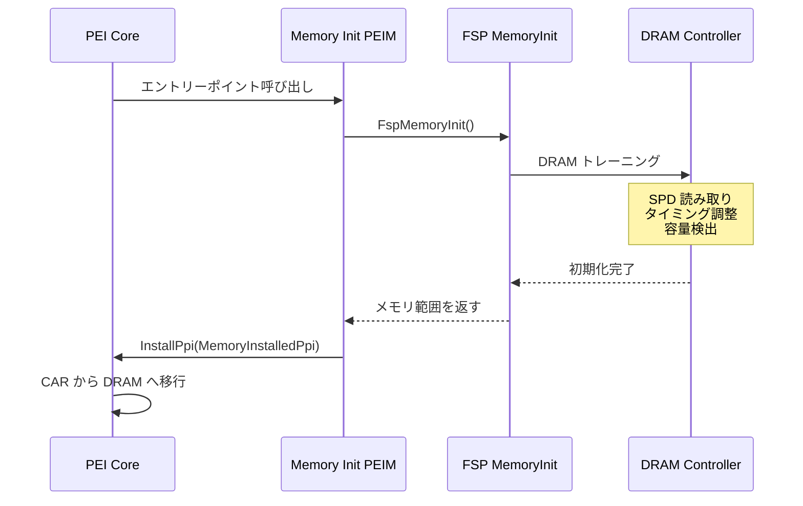

# PEI フェーズの役割と構造

🎯 **この章で学ぶこと**
- PEI (Pre-EFI Initialization) Phase の役割とブートプロセスでの位置づけ
- PEIM (PEI Module) と PPI (PEIM-to-PEIM Interface) のアーキテクチャ
- Temporary RAM (Cache as RAM) の仕組みと制約
- メモリ初期化前後の動作の違い
- HOB (Hand-Off Block) の生成と管理

📚 **前提知識**
- [Part I: UEFI ブートフローの全体像](../part1/05-uefi-boot-flow.md)
- [Part I: 各ブートフェーズの責務](../part1/06-boot-phase-responsibilities.md)
- [Part II: ハードウェア抽象化の仕組み](../part2/05-hardware-abstraction.md)

---

## PEI Phase の役割

### ブートプロセスでの位置づけ

PEI (Pre-EFI Initialization) Phase は、UEFI ブートプロセスにおいて**SEC Phase の次**、**DXE Phase の前**に実行される重要なブートフェーズです。PEI Phase の主な役割は、**最小限のハードウェア初期化**を行い、DXE Phase が動作できる環境を整えることです。この段階では、システムはまだ完全には初期化されておらず、DRAM (システムメモリ) さえ使用可能になっていません。そのため、PEI Phase は非常に限られたリソースの中で、最も基本的な初期化タスクを実行しなければなりません。

PEI Phase が直面する最大の課題は、**DRAM が初期化されていない**ことです。通常のソフトウェア開発では、メモリは当然のように使用できるリソースですが、ファームウェアの初期段階では、メモリコントローラが設定されておらず、DRAM は使用不可能です。C 言語のコードを実行するには、スタックとヒープが必要ですが、DRAM がない状態でこれらをどのように確保するかが PEI Phase の最初の挑戦です。この問題を解決するために、PEI Phase は **Cache as RAM (CAR)** という技術を使用します。CAR は、CPU のキャッシュメモリを一時的な RAM として使用し、DRAM が初期化されるまでの間、スタックとヒープを提供します。

PEI Phase のもう一つの重要な役割は、**DXE Phase への準備**です。DXE Phase は、ドライバをロードし、プロトコルを公開し、デバイスを初期化する段階ですが、そのためには、システムのハードウェア構成に関する情報が必要です。PEI Phase は、CPU の数と周波数、メモリの容量と配置、チップセットの設定などの情報を収集し、**HOB (Hand-Off Block)** というデータ構造を通じて DXE Phase に渡します。この情報により、DXE Phase は適切なドライバをロードし、正しいデバイスを初期化できます。

PEI Phase は、**移植性と拡張性**を重視して設計されています。異なるプラットフォーム (Intel、AMD、ARM など) では、CPU やチップセットの初期化手順が大きく異なります。PEI Phase は、これらのプラットフォーム固有の処理を **PEIM (PEI Module)** という独立したモジュールにカプセル化し、**PPI (PEIM-to-PEIM Interface)** という標準的なインターフェースを通じて通信します。この設計により、PEI Core (PEI Phase の中核部分) は共通化され、プラットフォーム固有の部分だけを差し替えることで、異なるプラットフォームに対応できます。

PEI Phase が解決しなければならない課題は、複数の側面にわたります。まず、**メモリ不在**の問題です。DRAM が初期化されていないため、CAR で一時メモリを提供する必要があります。次に、**最小限の初期化**の課題です。CPU、チップセット、クロックジェネレータなどを最低限動作させ、次のフェーズに進める状態にする必要があります。さらに、**DXE への準備**の課題です。DXE Phase が必要とする情報 (メモリマップ、CPU 情報、Firmware Volume の位置など) を HOB リストに記録しなければなりません。最後に、**移植性**の課題です。異なるプラットフォームに対応するため、PPI によるモジュール間通信を実装する必要があります。

**補足図: PEI Phase のブートプロセスでの位置づけ**


**参考表: PEI Phase が解決する課題**

| 課題 | 説明 | PEI での解決方法 |
|------|------|-----------------|
| **メモリ不在** | DRAM が初期化されていない | Cache as RAM (CAR) で一時メモリを提供 |
| **最小限の初期化** | CPU、チップセットを最低限動作させる | PEIM による段階的初期化 |
| **DXE への準備** | DXE Phase が必要とする情報を収集 | HOB リストの生成 |
| **移植性** | 異なるプラットフォームに対応 | PPI によるモジュール間通信 |

---

## PEI のアーキテクチャ

### PEI Core と PEIM

PEI Phase は、**PEI Core** と複数の **PEIM (PEI Module)** で構成されます。


### PEI Core の責務

| 責務 | 説明 |
|------|------|
| **PEIM のロード** | Firmware Volume (FV) から PEIM を発見・ロード |
| **依存関係解決** | Depex に基づいて PEIM のロード順序を決定 |
| **PPI 管理** | PPI のインストール・検索・通知を提供 |
| **HOB 管理** | HOB リストの作成・更新 |
| **メモリ管理** | CAR および DRAM のメモリ割り当て |

### PEIM の種類

| 種類 | 役割 | 例 |
|------|------|-----|
| **Platform PEIM** | プラットフォーム固有の初期化 | GPIO 設定、クロック設定 |
| **CPU PEIM** | CPU の初期化 | BSP/AP の起動、マイクロコード更新 |
| **Memory Init PEIM** | DRAM の初期化 | FSP MemoryInit 呼び出し |
| **Chipset PEIM** | チップセットの初期化 | PCH、SoC の設定 |

---

## PPI: PEIM-to-PEIM Interface

### PPI の役割

**PPI (PEIM-to-PEIM Interface)** は、PEI Phase における**プロトコルに相当**します。PEIM 間で機能を共有するためのインターフェースです。

### PPI vs Protocol の違い

| 項目 | PPI (PEI Phase) | Protocol (DXE Phase) |
|------|-----------------|----------------------|
| **目的** | PEIM 間の通信 | ドライバ間の通信 |
| **メモリ** | 一時メモリ（CAR/DRAM 初期前） | 永続メモリ（DRAM） |
| **動的性** | 静的に近い（リソース制限） | 動的（ドライバ追加・削除） |
| **複雑さ** | シンプル | 複雑（Handle Database など） |

### PPI の構造

```c
// PPI の定義例: Memory Discovered PPI
#define EFI_PEI_PERMANENT_MEMORY_INSTALLED_PPI_GUID \
  { 0xf894643d, 0xc449, 0x42d1, { 0x8e, 0xa8, 0x85, 0xbd, 0xd8, 0xc6, 0x5b, 0xde } }

typedef struct {
  // PPI は関数ポインタの集まり（構造体）
  // この例では、メモリ検出の通知のみなので、関数なし
} EFI_PEI_PERMANENT_MEMORY_INSTALLED_PPI;
```

### PPI サービス

PEI Core は、PPI を管理するためのサービスを提供します。

```c
typedef struct _EFI_PEI_SERVICES {
  // PPI サービス
  EFI_PEI_INSTALL_PPI           InstallPpi;
  EFI_PEI_REINSTALL_PPI         ReInstallPpi;
  EFI_PEI_LOCATE_PPI            LocatePpi;
  EFI_PEI_NOTIFY_PPI            NotifyPpi;

  // HOB サービス
  EFI_PEI_GET_HOB_LIST          GetHobList;
  EFI_PEI_CREATE_HOB            CreateHob;

  // メモリサービス
  EFI_PEI_ALLOCATE_PAGES        AllocatePages;
  EFI_PEI_ALLOCATE_POOL         AllocatePool;

  // その他のサービス...
} EFI_PEI_SERVICES;
```

### PPI 通知の仕組み

**NotifyPpi()** により、特定の PPI がインストールされたときに**コールバック関数**を実行できます。


---

## Temporary RAM: Cache as RAM (CAR)

### なぜ CAR が必要か

PEI Phase の初期段階では、**DRAM がまだ初期化されていません**。しかし、C 言語のコードを実行するには、**スタック**と**ヒープ**が必要です。

**Cache as RAM (CAR)** は、CPU のキャッシュメモリを一時的な RAM として使用する技術です。


### CAR のセットアップ

CAR は、**SEC Phase の終わり**または **PEI Phase の開始時**にセットアップされます。

**手順**:

1. **Cache を無効化**: MTRR (Memory Type Range Register) を設定
2. **特定範囲を WB (Write-Back) に設定**: キャッシュラインを有効化
3. **Cache Fill**: ダミーデータでキャッシュを満たす
4. **No-Evict Mode**: キャッシュがメモリに書き戻されないようにする

### CAR の制約

| 制約 | 説明 | 影響 |
|------|------|------|
| **サイズ制限** | 数十 KB ～ 数百 KB | スタック・ヒープが非常に限られる |
| **永続性なし** | 電源断で消失 | S3 Resume では使用不可 |
| **パフォーマンス** | 通常の RAM より遅い | 最小限の処理のみ推奨 |

---

## メモリ初期化の流れ

### Memory Init PEIM の役割

**Memory Init PEIM** は、DRAM を初期化し、使用可能にする最も重要な PEIM です。



### メモリ初期化前後の違い

| 項目 | メモリ初期化前 | メモリ初期化後 |
|------|---------------|---------------|
| **使用メモリ** | CAR (Cache) | DRAM |
| **容量** | 数十～数百 KB | 数 GB ～ 数百 GB |
| **永続性** | なし | S3 Resume でも保持（一部） |
| **速度** | 遅い | 速い |
| **HOB 保存先** | CAR | DRAM |

### CAR から DRAM への移行

メモリが初期化されると、PEI Core は **CAR の内容を DRAM にコピー**し、以降は DRAM を使用します。


---

## HOB (Hand-Off Block) の管理

### HOB の役割

**HOB (Hand-Off Block)** は、PEI Phase で収集したハードウェア情報を **DXE Phase に渡す**ためのデータ構造です。

### HOB の種類（再確認）

| HOB タイプ | 用途 | 例 |
|-----------|------|-----|
| **PHIT (Phase Handoff Information Table)** | PEI から DXE への基本情報 | メモリ範囲、HOB リストの位置 |
| **Memory Allocation** | メモリ予約情報 | ファームウェア用メモリ |
| **Resource Descriptor** | システムリソース記述 | メモリ範囲、I/O 範囲 |
| **GUID Extension** | カスタムデータ | プラットフォーム固有情報 |
| **Firmware Volume** | FV 情報 | DXE 用 FV の位置 |
| **CPU** | CPU 情報 | コア数、周波数 |

### HOB リストの構造

```c
typedef struct {
  UINT16 HobType;
  UINT16 HobLength;
  UINT32 Reserved;
} EFI_HOB_GENERIC_HEADER;

// HOB リストは連結リストとして実装
// 最後の HOB は EFI_HOB_TYPE_END_OF_HOB_LIST
```

### HOB の作成例（概念的）

```c
// PEI Phase: メモリ情報を HOB に追加
EFI_PEI_HOB_POINTERS Hob;
EFI_RESOURCE_DESCRIPTOR_HOB *ResourceHob;

// メモリ範囲を Resource Descriptor HOB として追加
(*PeiServices)->CreateHob (
  PeiServices,
  EFI_HOB_TYPE_RESOURCE_DESCRIPTOR,
  sizeof (EFI_RESOURCE_DESCRIPTOR_HOB),
  &Hob
);

ResourceHob = Hob.ResourceDescriptor;
ResourceHob->ResourceType = EFI_RESOURCE_SYSTEM_MEMORY;
ResourceHob->PhysicalStart = 0x0;
ResourceHob->ResourceLength = 0x100000000; // 4GB
ResourceHob->ResourceAttribute = EFI_RESOURCE_ATTRIBUTE_PRESENT |
                                  EFI_RESOURCE_ATTRIBUTE_INITIALIZED;
```

---

## PEI から DXE への遷移

### DXE Core のロード

PEI Phase の最後のタスクは、**DXE Core をメモリにロードし、制御を渡す**ことです。


### DXE IPL PEIM

**DXE IPL (Initial Program Load) PEIM** は、DXE Core をロードする特殊な PEIM です。

**役割**:

1. **DXE Core の検索**: Firmware Volume から DXE Core を探す
2. **ロード**: DRAM にコピー
3. **HOB リスト引き渡し**: PEI で作成した HOB リストのポインタを渡す
4. **制御移譲**: DXE Core のエントリーポイントにジャンプ

### PEI → DXE の引き継ぎ情報

| 情報 | 引き継ぎ方法 | 用途 |
|------|------------|------|
| **メモリマップ** | HOB (Resource Descriptor) | DXE でのメモリ管理 |
| **FV 位置** | HOB (Firmware Volume) | DXE ドライバのロード |
| **CPU 情報** | HOB (CPU) | ACPI テーブル生成 |
| **プラットフォーム情報** | HOB (GUID Extension) | プラットフォーム固有設定 |

---

## PEI Phase の実行フロー全体

### 典型的な PEI フロー


---

## まとめ

この章では、PEI (Pre-EFI Initialization) Phase の役割、アーキテクチャ、そして動作原理を詳しく学びました。PEI Phase は、UEFI ブートプロセスにおいて SEC Phase の次、DXE Phase の前に実行される重要なブートフェーズです。PEI Phase の主な役割は、メモリ初期化前の最小限のハードウェア初期化を行い、DXE Phase が動作するための環境を準備することです。この段階では、DRAM がまだ初期化されていないため、非常に限られたリソースの中で、最も基本的な初期化タスクを実行しなければなりません。

**PEI のアーキテクチャ**は、PEI Core と複数の PEIM (PEI Module) で構成されます。PEI Core は、PEIM の管理、PPI の管理、HOB の管理という三つの主要な責務を持ちます。PEI Core は、Firmware Volume から PEIM を発見し、依存関係 (Depex) に基づいて適切な順序でロードします。PEIM は、初期化タスクを実行する独立したモジュールであり、Platform PEIM、CPU PEIM、Memory Init PEIM、Chipset PEIM など、複数の種類があります。各 PEIM は、特定の初期化タスクに責任を持ち、他の PEIM と協調して動作します。

**PPI (PEIM-to-PEIM Interface)** は、PEI Phase における Protocol に相当します。PPI は、PEIM 間で機能を共有するためのインターフェースであり、GUID によって一意に識別されます。PPI は、Protocol よりもシンプルで、一時メモリ (CAR) やリソース制限を考慮した設計になっています。PEI Core は、InstallPpi、LocatePpi、NotifyPpi などの PPI サービスを提供し、PEIM 間の通信を管理します。NotifyPpi により、特定の PPI がインストールされたときにコールバック関数を実行できるため、PEIM は他の PEIM の初期化完了を検知し、適切なタイミングで処理を実行できます。

**Cache as RAM (CAR)** は、PEI Phase の最も重要な技術の一つです。DRAM が初期化されていない段階では、C 言語のコードを実行するためのスタックとヒープがありません。CAR は、CPU のキャッシュメモリを一時的な RAM として使用することで、この問題を解決します。CAR のセットアップは、SEC Phase の終わりまたは PEI Phase の開始時に実行され、MTRR (Memory Type Range Register) を設定し、特定範囲を Write-Back に設定し、Cache Fill と No-Evict Mode を有効化します。CAR のサイズは、数十 KB から数百 KB に制限されており、スタックとヒープが非常に限られるため、PEI Phase では最小限の処理のみを実行します。

**メモリ初期化**は、PEI Phase の最も重要なタスクです。Memory Init PEIM は、DRAM コントローラを初期化し、SPD (Serial Presence Detect) を読み取り、メモリトレーニングを実行して、DRAM を使用可能な状態にします。多くのプラットフォームでは、FSP (Firmware Support Package) の FspMemoryInit() API を呼び出してメモリ初期化を実行します。DRAM が初期化されると、PEI Core は CAR の内容を DRAM にコピーし、以降は DRAM を使用します。この移行により、スタックとヒープのサイズ制限が解消され、より複雑な初期化タスクを実行できるようになります。

**HOB (Hand-Off Block)** は、PEI Phase で収集したハードウェア情報を DXE Phase に渡すためのデータ構造です。HOB には、PHIT (Phase Handoff Information Table)、Memory Allocation、Resource Descriptor、GUID Extension、Firmware Volume、CPU など、複数の種類があります。PEI Phase は、メモリマップ、CPU 情報、Firmware Volume の位置、プラットフォーム固有の設定などを HOB リストに記録します。DXE Phase は、この HOB リストを読み取り、適切なドライバをロードし、正しいデバイスを初期化します。HOB は、ブートフェーズ間の情報受け渡しを標準化し、移植性を向上させます。

**PEI から DXE への遷移**は、DXE IPL (Initial Program Load) PEIM が担当します。DXE IPL PEIM は、PEI Phase の最後に実行され、Firmware Volume から DXE Core を検索し、DRAM にロードし、HOB リストのポインタを渡し、DXE Core のエントリーポイントにジャンプします。この遷移により、ブートプロセスは PEI Phase から DXE Phase に移行し、より高レベルの初期化とドライバのロードが開始されます。DXE Phase は、PEI Phase が準備した環境とデータを基に、システムのすべてのデバイスを初期化し、OS の起動に必要なプロトコルを提供します。

### 次章の予告

次章では、**DRAM 初期化の仕組み**について詳しく学びます。DRAM コントローラの動作原理、SPD (Serial Presence Detect) の読み取り、メモリトレーニングのプロセス、そして FSP (Firmware Support Package) がこれらをどのように抽象化しているかを見ていきます。

---

📚 **参考資料**
- [UEFI PI Specification v1.8 - Volume 1: PEI Phase](https://uefi.org/specifications)
- [EDK II Module Writer's Guide - PEI Modules](https://tianocore-docs.github.io/edk2-ModuleWriteGuide/)
- [Intel® Firmware Support Package (FSP) External Architecture Specification](https://www.intel.com/content/www/us/en/developer/articles/technical/intel-firmware-support-package.html)
