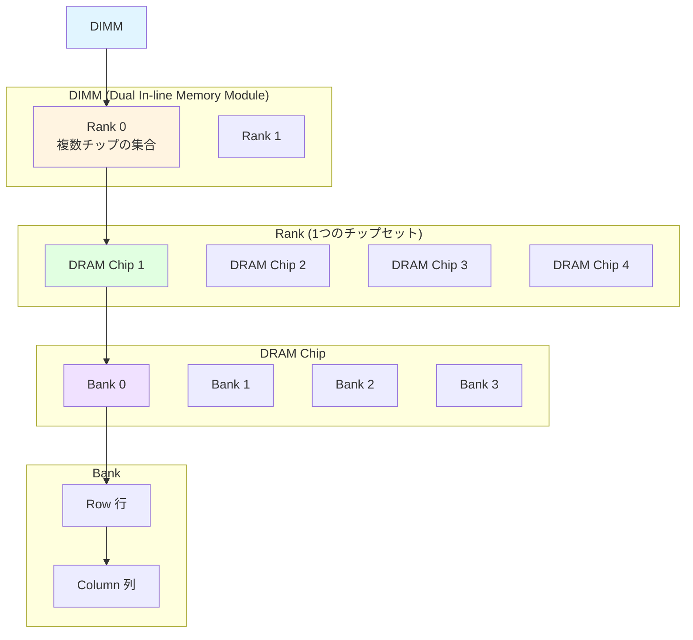
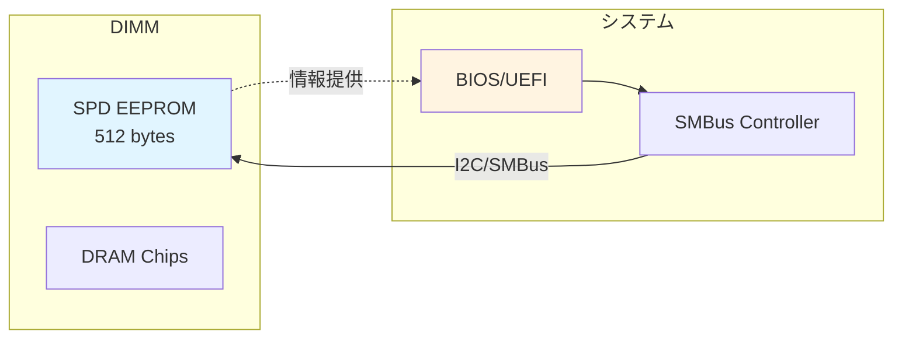
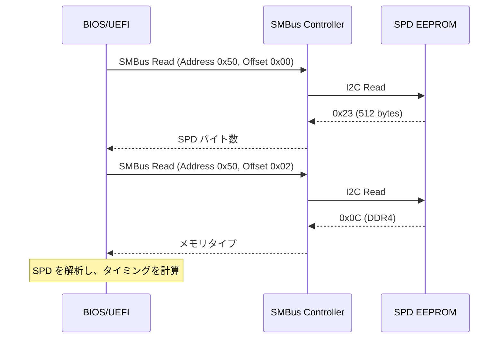
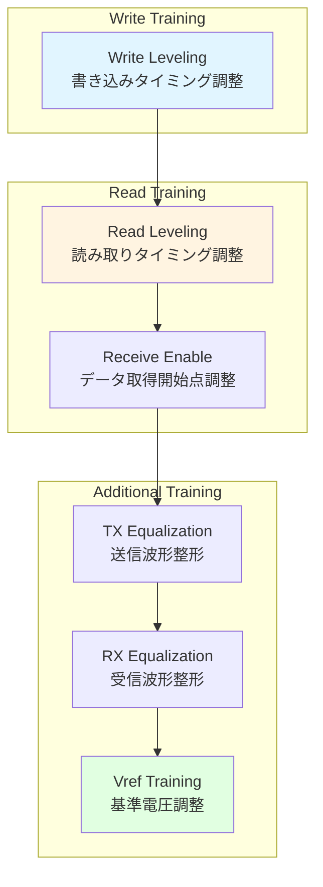
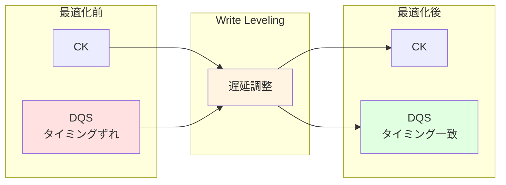
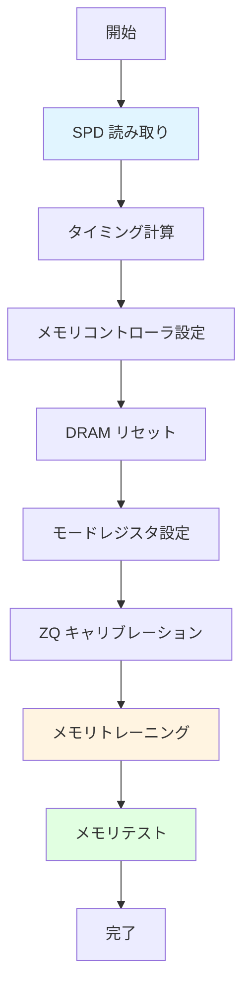
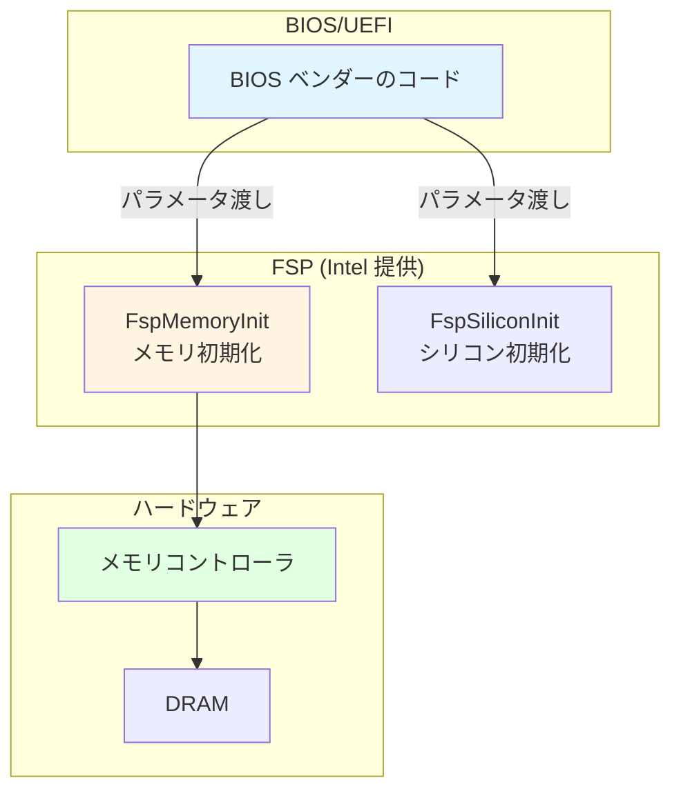

# DRAM 初期化の仕組み

🎯 **この章で学ぶこと**
- DRAM の基本構造と動作原理（DDR4/DDR5）
- SPD (Serial Presence Detect) によるメモリモジュール情報の取得
- メモリトレーニングの必要性とプロセス
- メモリコントローラの初期化手順
- FSP (Firmware Support Package) による抽象化

📚 **前提知識**
- [Part III: PEI フェーズの役割と構造](01-pei-phase-architecture.md)
- [Part I: メモリマップ](../part1/02-memory-map.md)

---

## DRAM の基本構造

### DRAM とは

**DRAM (Dynamic Random Access Memory)** は、現代のコンピュータのメインメモリとして広く使用されている揮発性メモリです。DRAM の「Dynamic」という名前は、データを保存する仕組みに由来しています。DRAM は、各ビットの情報をコンデンサに蓄えられた電荷として保存しますが、コンデンサの電荷は時間とともに自然に減衰してしまいます。そのため、DRAM は**定期的にリフレッシュが必要**であり、通常は数ミリ秒ごとにすべての行を読み出して再書き込みする必要があります。この特性により、DRAM は SRAM (Static RAM) と比べて構造がシンプルで高密度化が可能ですが、リフレッシュのオーバーヘッドと電力消費が発生します。

DRAM は、**階層的な構造**で組織化されています。最上位は **DIMM (Dual In-line Memory Module)** であり、これはマザーボードのメモリスロットに挿入される物理的なモジュールです。DIMM の内部には、複数の **Rank** が存在します。Rank は、同時にアクセス可能な DRAM チップの集合であり、通常は 8 個または 9 個のチップで構成されます (9 個目は ECC 用)。各 DRAM チップは、複数の **Bank** に分割されており、Bank はチップ内の独立したメモリアレイです。Bank の内部は、**Row** (行) と **Column** (列) の 2 次元アドレス空間として構成されており、特定のアドレスにアクセスするには、まず Row をアクティブにし、次に Column を選択します。

この階層構造の利点は、**並列性とアクセス効率の向上**です。複数の Bank を持つことで、異なる Bank に対して並行してアクセスできます。また、Row Buffer という仕組みにより、同じ Row に対する連続アクセスは高速に実行できます。一方、異なる Row にアクセスする場合は、現在の Row をクローズし、新しい Row をオープンする必要があり、これは Row Precharge と Row Activation という 2 ステップのプロセスになり、レイテンシが増加します。この特性を理解することは、メモリアクセスパターンを最適化する上で重要です。

DRAM の階層構造に関連する用語を理解することは、メモリ初期化を理解する上で不可欠です。**DIMM** は、マザーボードに挿すメモリモジュール全体を指します。**Rank** は、同時にアクセス可能なチップの集合であり、メモリコントローラは一度に1つの Rank にしかアクセスできません。**Bank** は、チップ内の独立したメモリアレイであり、異なる Bank には並行してアクセスできます。**Row** は、バンク内の行アドレスであり、**Column** は、バンク内の列アドレスです。**Channel** は、メモリコントローラからの独立したデータパスであり、デュアルチャネル構成では、2 つの Channel に並行してアクセスできます。

DRAM 技術は、世代ごとに進化しています。現在の主流は **DDR4** と **DDR5** です。DDR4 は、1600～3200 MT/s (Million Transfers per second) のデータレートをサポートし、1.2V の動作電圧で動作します。DDR4 は、16 個の Bank (4 Bank Groups × 4 Banks) を持ち、Burst Length は 8 です。一方、DDR5 は、3200～6400 MT/s という倍のデータレートをサポートし、1.1V の低電圧で動作します。DDR5 は、32 個の Bank (8 Bank Groups × 4 Banks) を持ち、Burst Length は 16 に拡大されています。さらに、DDR5 は、各 DIMM に 2 つの Sub-Channel を持ち、帯域幅をさらに向上させています。容量面でも、DDR4 は最大 32GB / DIMM をサポートするのに対し、DDR5 は最大 128GB / DIMM をサポートします。

これらの世代間の違いは、メモリ初期化の複雑さに直接影響します。DDR5 は、より高速で大容量ですが、その分、タイミングパラメータの調整とトレーニングがより厳密に行われる必要があります。ファームウェアは、SPD (Serial Presence Detect) を読み取ることで、どの世代の DRAM が装着されているかを検出し、適切な初期化シーケンスを実行します。

**補足図: DRAM の階層構造**



**参考表: DRAM の用語**

| 用語 | 説明 |
|------|------|
| **DIMM** | マザーボードに挿すメモリモジュール |
| **Rank** | 同時にアクセス可能なチップの集合（通常 8 または 9 チップ） |
| **Bank** | チップ内の独立したメモリアレイ |
| **Row** | バンク内の行アドレス |
| **Column** | バンク内の列アドレス |
| **Channel** | メモリコントローラからの独立したデータパス |

**参考表: DDR4 vs DDR5**

| 項目 | DDR4 | DDR5 |
|------|------|------|
| **データレート** | 1600～3200 MT/s | 3200～6400 MT/s |
| **電圧** | 1.2V | 1.1V |
| **Bank 数** | 16 (4 Bank Groups × 4 Banks) | 32 (8 Bank Groups × 4 Banks) |
| **Burst Length** | 8 | 16 |
| **Channel 構成** | 1 Channel / DIMM | 2 Sub-Channels / DIMM |
| **容量** | 最大 32GB / DIMM | 最大 128GB / DIMM |

---

## SPD: Serial Presence Detect

### SPD の役割

**SPD (Serial Presence Detect)** は、DIMM 上の **EEPROM** に保存された、メモリモジュールの仕様情報です。ファームウェアは SPD を読み取ることで、適切なタイミングパラメータを設定できます。



### SPD の内容

SPD には、以下の情報が含まれます：

| オフセット | 内容 | 例 |
|----------|------|-----|
| 0x00 | SPD バイト数 | 512 bytes (DDR4) |
| 0x02 | メモリタイプ | 0x0C = DDR4, 0x12 = DDR5 |
| 0x04 | モジュールタイプ | UDIMM, RDIMM, LRDIMM |
| 0x05 | 容量 | 8GB, 16GB, 32GB |
| 0x12 | CAS Latency | 15, 16, 17, 18, ... |
| 0x18-0x1B | タイミング | tRCD, tRP, tRAS |
| 0x140-0x15F | XMP/EXPO プロファイル | オーバークロック設定 |

### SPD の読み取り方法

SPD は **SMBus (System Management Bus)** 経由で読み取ります。



**SMBus アドレス**:

- Channel 0, DIMM 0: `0x50`
- Channel 0, DIMM 1: `0x52`
- Channel 1, DIMM 0: `0x54`
- Channel 1, DIMM 1: `0x56`

---

## メモリトレーニング

### なぜトレーニングが必要か

DRAM と メモリコントローラ間の信号は、**非常に高速**（DDR4: 最大 3200 MT/s、DDR5: 最大 6400 MT/s）です。この速度では、以下の問題が発生します：

| 問題 | 説明 |
|------|------|
| **信号の遅延** | 基板上の配線長により、信号到達タイミングがずれる |
| **クロストーク** | 隣接する信号線間の干渉 |
| **電圧変動** | 電源ノイズによる信号品質の低下 |
| **温度依存** | 温度によりタイミングが変化 |

**メモリトレーニング**は、これらの問題を補正し、**最適なタイミングパラメータを動的に決定**するプロセスです。

### トレーニングの種類



### Write Leveling (書き込みトレーニング)

**目的**: DQS (Data Strobe) 信号と CK (Clock) 信号のタイミングを合わせる

**手順**:

1. メモリコントローラが DQS を段階的にシフト
2. DRAM に特定パターンを書き込み
3. DRAM が正しく受信できたタイミングを検出
4. 最適な DQS 遅延を決定



### Read Leveling (読み取りトレーニング)

**目的**: DRAM から返ってくるデータを正しいタイミングで取得

**手順**:

1. DRAM に既知のパターンを書き込み
2. メモリコントローラが読み取りタイミングを段階的にシフト
3. 正しいデータが読めたタイミング範囲を検出
4. 範囲の中心を最適タイミングとして設定

### Vref Training (基準電圧トレーニング)

**目的**: 信号の High/Low を判定する基準電圧を最適化

DRAM は、受信した信号電圧を **Vref (Reference Voltage)** と比較して、0 か 1 かを判定します。Vref が不適切だと、誤読が発生します。

```
信号電圧 > Vref → 1
信号電圧 < Vref → 0
```

Vref Training では、エラーが発生しない Vref 範囲を探し、その中心値を設定します。

---

## メモリコントローラの初期化手順

### 初期化フロー



### 各ステップの詳細

#### 1. SPD 読み取り

- SMBus 経由で各 DIMM の SPD を読み取り
- メモリタイプ、容量、タイミングパラメータを取得

#### 2. タイミング計算

SPD から読み取った情報を元に、実際のレジスタ値を計算：

| パラメータ | 説明 | 例 (DDR4-3200) |
|-----------|------|---------------|
| **CAS Latency (CL)** | Read コマンドからデータ出力までのクロック数 | 16 clocks |
| **tRCD** | RAS to CAS Delay | 16 clocks |
| **tRP** | Row Precharge Time | 16 clocks |
| **tRAS** | Row Active Time | 36 clocks |
| **tRFC** | Refresh Cycle Time | 350 ns |

#### 3. メモリコントローラ設定

メモリコントローラのレジスタに計算値を設定：

- データレート（周波数）
- タイミングパラメータ
- ODT (On-Die Termination) 設定
- VDDQ 電圧

#### 4. DRAM リセット

DRAM をリセットモードに入れ、初期化：

1. CKE (Clock Enable) を Low に設定（200μs）
2. RESET# を Low に設定（200μs）
3. RESET# を High に戻す
4. 安定化待機（500μs）

#### 5. モードレジスタ設定

DRAM の **Mode Register (MR)** を設定：

| レジスタ | 設定内容 |
|---------|---------|
| **MR0** | Burst Length, CAS Latency, DLL Reset |
| **MR1** | DLL Enable, Output Driver Strength, RTT |
| **MR2** | CWL (CAS Write Latency) |
| **MR3** | MPR (Multi-Purpose Register) |

#### 6. ZQ キャリブレーション

**ZQ キャリブレーション**は、出力ドライバのインピーダンスを調整します。DIMM 上の **240Ω 抵抗**を基準に、ドライバの強度を校正します。

---

## FSP (Firmware Support Package) による抽象化

### FSP とは

**FSP (Firmware Support Package)** は、Intel が提供する**バイナリ形式のプラットフォーム初期化コード**です。メモリ初期化の複雑さを隠蔽し、BIOS ベンダーが容易に統合できるようにします。



### FSP のメモリ初期化 API

**FspMemoryInit()** が、メモリ初期化のエントリーポイントです。

```c
// 概念的な使用例
EFI_STATUS
EFIAPI
MemoryInitPeim (
  IN EFI_PEI_FILE_HANDLE       FileHandle,
  IN CONST EFI_PEI_SERVICES    **PeiServices
  )
{
  FSP_INFO_HEADER        *FspHeader;
  FSPM_UPD               *FspmUpd;
  EFI_STATUS             Status;

  // FSP-M の UPD (Updatable Product Data) を取得
  FspHeader = GetFspInfoHeader ();
  FspmUpd = GetFspmUpdDataPointer (FspHeader);

  // パラメータを設定
  FspmUpd->FspmConfig.MemorySpdPtr[0] = (UINT32)SpdData;
  FspmUpd->FspmConfig.DqByteMap = DqByteMapData;
  FspmUpd->FspmConfig.DqsMapCpu2Dram = DqsMapData;

  // FSP MemoryInit を呼び出し
  Status = CallFspMemoryInit (FspmUpd);

  return Status;
}
```

### FSP が提供する抽象化

| 項目 | FSP なし | FSP あり |
|------|---------|---------|
| **SPD 読み取り** | BIOS が実装 | BIOS が実装（SMBus） |
| **タイミング計算** | BIOS が実装 | **FSP が実装** |
| **メモリコントローラ設定** | BIOS が実装 | **FSP が実装** |
| **メモリトレーニング** | BIOS が実装 | **FSP が実装** |
| **エラー処理** | BIOS が実装 | **FSP が実装** |

**利点**:

- BIOS ベンダーは複雑なメモリ初期化ロジックを実装不要
- Intel がプラットフォームごとに最適化したコードを提供
- セキュリティ: 初期化ロジックの詳細を隠蔽

**欠点**:

- ブラックボックス: 内部動作が不透明
- カスタマイズ制限: UPD で公開されたパラメータのみ変更可能

---

## メモリテスト

### なぜメモリテストが必要か

メモリ初期化後、**メモリが正常に動作するか検証**する必要があります。

| テストの種類 | 目的 | 実行タイミング |
|------------|------|--------------|
| **Quick Test** | 基本的な読み書きテスト | PEI Phase |
| **Full Test** | 全アドレスの徹底テスト | BDS Phase（オプション） |
| **Stress Test** | 長時間負荷テスト | POST 後（オプション） |

### Quick Test のアルゴリズム

```c
// 概念的なメモリテスト
EFI_STATUS
QuickMemoryTest (
  IN EFI_PHYSICAL_ADDRESS  MemoryBase,
  IN UINT64                MemoryLength
  )
{
  UINT32 *Address;
  UINT32 Pattern[] = { 0xAAAAAAAA, 0x55555555, 0x00000000, 0xFFFFFFFF };
  UINTN  i, j;

  // 各パターンで書き込み・読み取りテスト
  for (i = 0; i < 4; i++) {
    for (j = 0; j < MemoryLength / sizeof(UINT32); j += 1024) {
      Address = (UINT32 *)(UINTN)(MemoryBase + j * sizeof(UINT32));
      *Address = Pattern[i];
      if (*Address != Pattern[i]) {
        return EFI_DEVICE_ERROR;  // メモリエラー
      }
    }
  }

  return EFI_SUCCESS;
}
```

---

## まとめ

この章では、DRAM 初期化の仕組みを詳しく学びました。DRAM は、現代のコンピュータのメインメモリとして広く使用されている揮発性メモリであり、コンデンサに蓄えられた電荷でデータを保存するため、定期的なリフレッシュが必要です。**DRAM の構造**は、DIMM → Rank → Chip → Bank → Row/Column という階層で組織化されています。DIMM はマザーボードに挿すメモリモジュールであり、Rank は同時にアクセス可能なチップの集合です。各チップは複数の Bank に分割され、Bank の内部は Row と Column の 2 次元アドレス空間として構成されます。DDR4 と DDR5 の世代間の違いも学びました。DDR5 は、DDR4 と比べて倍のデータレート (最大 6400 MT/s)、低電圧 (1.1V)、より多くの Bank (32 個)、そして大容量 (最大 128GB / DIMM) をサポートします。

**SPD (Serial Presence Detect)** は、DIMM 上の EEPROM に保存されたメモリモジュールの仕様情報です。SPD には、メモリタイプ (DDR4/DDR5)、容量、タイミングパラメータ (CAS Latency、tRCD、tRP、tRAS など)、XMP/EXPO プロファイルなどが含まれます。ファームウェアは、SMBus (System Management Bus) 経由で SPD を読み取り、適切なタイミングパラメータを計算します。各 DIMM は、固有の SMBus アドレス (Channel 0 DIMM 0 は 0x50、Channel 0 DIMM 1 は 0x52 など) を持ち、ファームウェアはすべての DIMM の SPD を読み取り、システム全体のメモリ構成を把握します。

**メモリトレーニング**は、DRAM と メモリコントローラ間の信号を最適化するプロセスです。DDR4/DDR5 のような高速インターフェースでは、信号の遅延、クロストーク、電圧変動、温度依存などの問題が発生します。メモリトレーニングは、これらの問題を補正し、最適なタイミングパラメータを動的に決定します。**Write Leveling** は、DQS (Data Strobe) 信号と CK (Clock) 信号のタイミングを合わせ、書き込みタイミングを調整します。**Read Leveling** は、DRAM から返ってくるデータを正しいタイミングで取得するため、読み取りタイミングを調整します。**Vref Training** は、信号の High/Low を判定する基準電圧 (Vref) を最適化し、エラーが発生しない Vref 範囲を探し、その中心値を設定します。これらのトレーニングにより、メモリは安定して動作できます。

**メモリコントローラの初期化手順**は、複数のステップで構成されます。まず、SPD を読み取り、メモリタイプと容量を取得します。次に、SPD から読み取った情報を元に、タイミングパラメータ (CAS Latency、tRCD、tRP、tRAS、tRFC など) を計算します。その後、メモリコントローラのレジスタに計算値を設定し、データレート、タイミングパラメータ、ODT (On-Die Termination)、VDDQ 電圧などを設定します。DRAM をリセットモードに入れ、CKE と RESET# 信号を制御して初期化します。Mode Register (MR0～MR3) を設定し、Burst Length、CAS Latency、DLL、Output Driver Strength などを設定します。ZQ キャリブレーションで出力ドライバのインピーダンスを調整し、最後にメモリトレーニングを実行して最適なタイミングパラメータを決定します。

**FSP (Firmware Support Package)** は、Intel が提供するバイナリ形式のプラットフォーム初期化コードです。FSP は、メモリ初期化の複雑さを隠蔽し、BIOS ベンダーが容易に統合できるようにします。FspMemoryInit() API は、メモリ初期化のエントリーポイントであり、UPD (Updatable Product Data) というパラメータ構造体を通じて設定を受け取ります。FSP は、SPD 読み取りは BIOS が実装しますが、タイミング計算、メモリコントローラ設定、メモリトレーニング、エラー処理などは FSP が実装します。FSP の利点は、BIOS ベンダーが複雑なメモリ初期化ロジックを実装する必要がなく、Intel がプラットフォームごとに最適化したコードを提供することです。一方、欠点は、内部動作が不透明なブラックボックスであり、UPD で公開されたパラメータのみ変更可能というカスタマイズ制限があることです。

**メモリテスト**は、メモリ初期化後、メモリが正常に動作するか検証するために実行されます。Quick Test は、PEI Phase で実行される基本的な読み書きテストであり、特定のパターン (0xAAAAAAAA、0x55555555、0x00000000、0xFFFFFFFF など) を書き込み、正しく読み取れるかを確認します。Full Test は、BDS Phase でオプションとして実行され、全アドレスの徹底テストを行います。メモリテストにより、不良メモリを検出し、システムの安定性を確保できます。エラーが検出された場合、ファームウェアは該当するメモリ範囲をメモリマップから除外し、OS が使用しないようにします。

### 次章の予告

次章では、**CPU とチップセット初期化**について学びます。CPU のマイクロコード更新、キャッシュ設定、マルチコアの起動（BSP/AP）、そしてチップセットの初期化（PCI Express、DMI、電源管理）を詳しく見ていきます。

---

📚 **参考資料**
- [JEDEC DDR4 Specification](https://www.jedec.org/)
- [JEDEC DDR5 Specification](https://www.jedec.org/)
- [Intel® Firmware Support Package (FSP) Documentation](https://www.intel.com/content/www/us/en/developer/articles/technical/intel-firmware-support-package.html)
- [SPD Specification - JEDEC Standard No. 21-C](https://www.jedec.org/)
