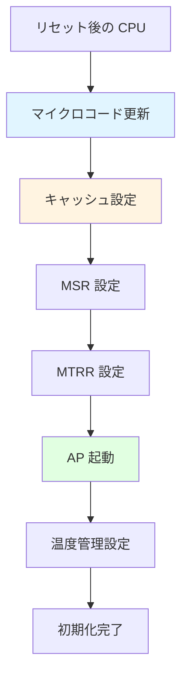
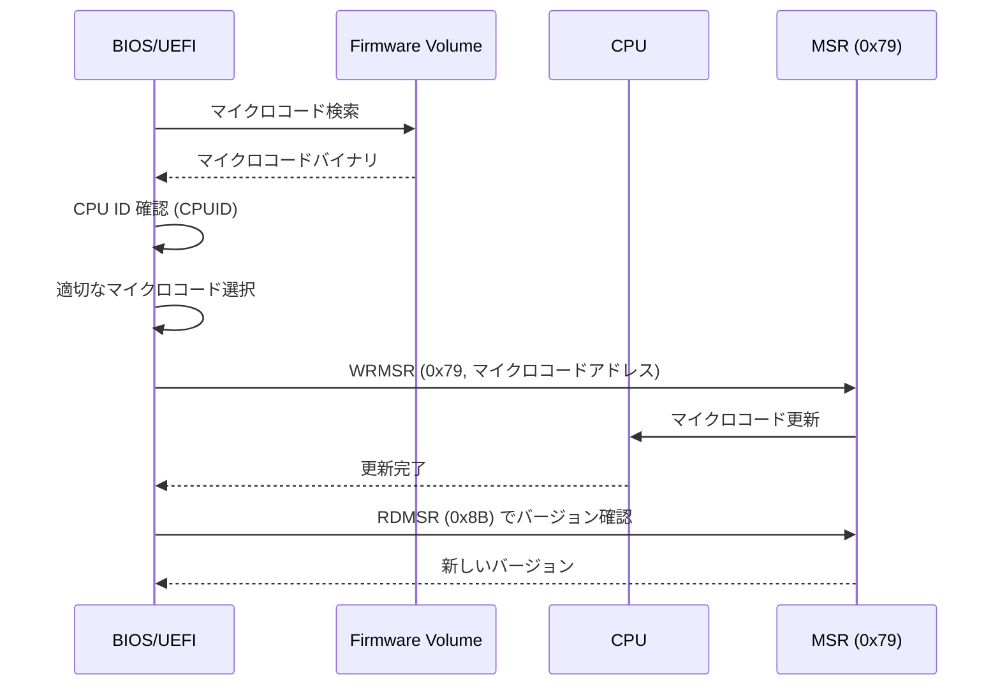
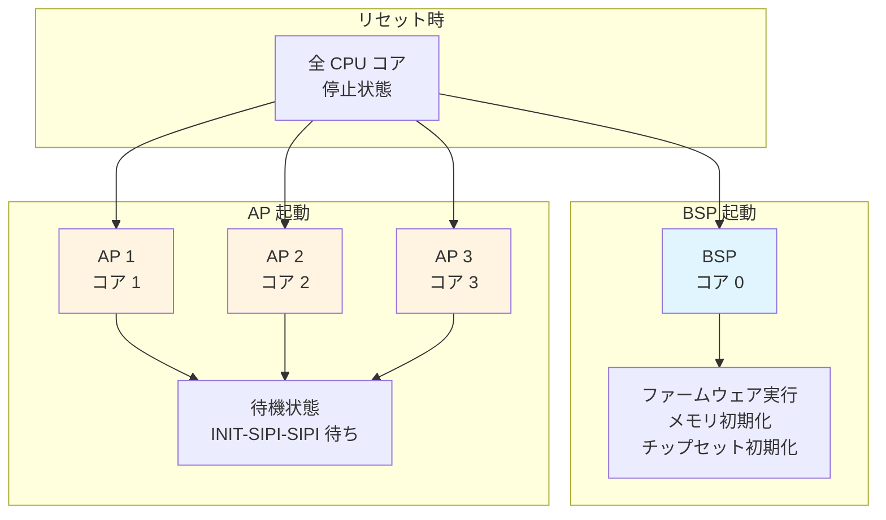
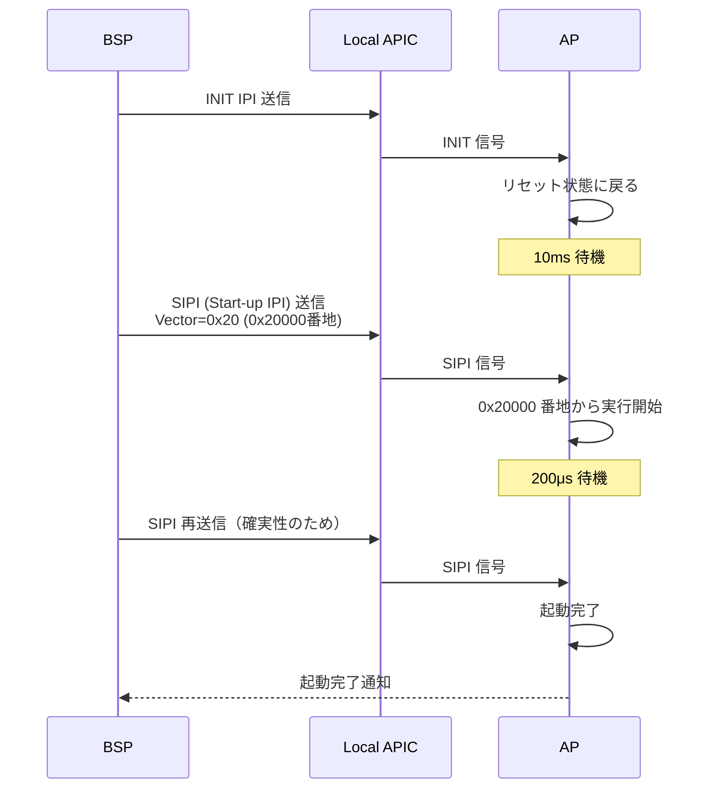
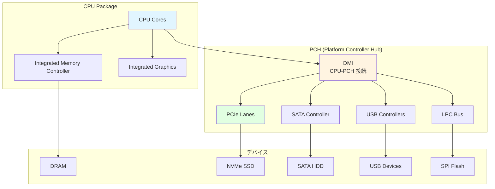
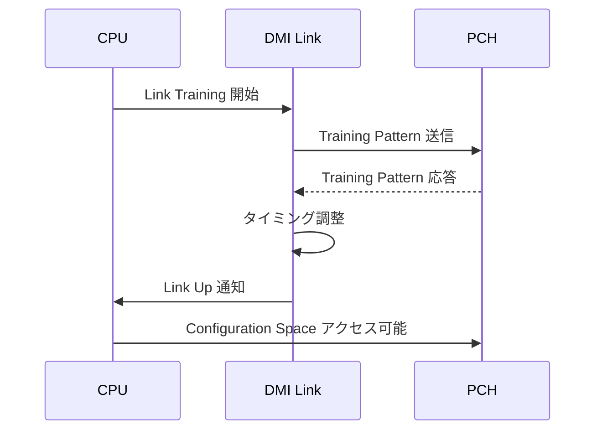
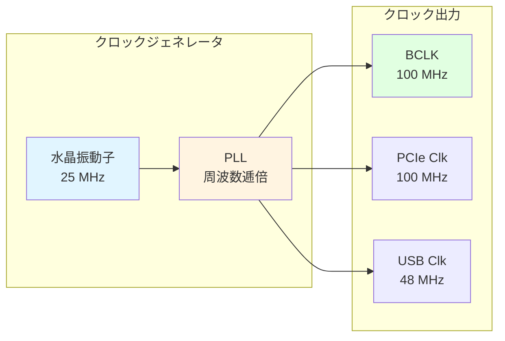

# CPU とチップセット初期化

🎯 **この章で学ぶこと**
- CPU の初期化手順（マイクロコード更新、キャッシュ設定）
- BSP (Bootstrap Processor) と AP (Application Processor) の起動
- チップセットの役割と初期化
- DMI/PCH の初期化
- クロック生成とリセット制御

📚 **前提知識**
- [Part I: CPU モードとセグメンテーション](../part1/03-cpu-modes.md)
- [Part III: PEI フェーズの役割と構造](01-pei-phase-architecture.md)

---

## CPU 初期化の概要

### CPU 初期化の目的

CPU 初期化は、**プロセッサを完全に機能する状態**にするプロセスです。リセット直後の CPU は最小限の機能しか持たず、段階的に初期化していく必要があります。



### 初期化の段階

| フェーズ | タイミング | 実行内容 |
|---------|-----------|---------|
| **SEC Phase** | リセット直後 | 最小限の初期化、CAR セットアップ |
| **PEI Phase** | メモリ初期化前 | マイクロコード更新、基本設定 |
| **PEI Phase** | メモリ初期化後 | AP 起動、詳細設定 |
| **DXE Phase** | ドライバロード後 | ACPI テーブル生成、電源管理 |

---

## マイクロコード更新

### マイクロコードとは

**マイクロコード (Microcode)** は、CPU 内部の **マイクロプログラム**です。CPU の命令を実際のハードウェア動作に変換する低レベルの制御コードで、バグ修正や機能追加のために更新可能です。

### なぜ更新が必要か

| 理由 | 説明 | 例 |
|------|------|-----|
| **バグ修正** | CPU ハードウェアの誤動作を修正 | Spectre/Meltdown 対策 |
| **機能追加** | 新しい命令のサポート | 新しい AVX 命令 |
| **安定性向上** | エラー条件の処理改善 | メモリアクセスの最適化 |
| **互換性** | 新しいチップセットとの互換性 | 新しいメモリタイプ対応 |

### マイクロコード更新の仕組み



### マイクロコード更新の手順

**1. CPU 識別**

```c
// CPUID で CPU を識別
UINT32 RegEax, RegEbx, RegEcx, RegEdx;
AsmCpuid (0x1, &RegEax, &RegEbx, &RegEcx, &RegEdx);

UINT32 CpuSignature = RegEax;  // Family, Model, Stepping
UINT32 PlatformId;
AsmReadMsr64 (0x17);  // IA32_PLATFORM_ID
PlatformId = (UINT32)((Msr >> 50) & 0x7);
```

**2. マイクロコード選択**

マイクロコードファイルから、CPU Signature と Platform ID に一致するものを選択。

**3. 更新実行**

```c
// MSR 0x79 にマイクロコードアドレスを書き込み
AsmWriteMsr64 (0x79, (UINT64)(UINTN)MicrocodeData);
```

**4. バージョン確認**

```c
// MSR 0x8B で更新後のバージョンを確認
UINT64 MicrocodeVersion = AsmReadMsr64 (0x8B);
```

---

## キャッシュの初期化

### キャッシュの階層

現代の CPU は、**複数階層のキャッシュ**を持ちます：

| キャッシュ | サイズ | レイテンシ | 説明 |
|-----------|-------|-----------|------|
| **L1 Data** | 32～64 KB/コア | 4～5 cycles | データ専用 |
| **L1 Instruction** | 32～64 KB/コア | 4～5 cycles | 命令専用 |
| **L2** | 256 KB～1 MB/コア | 12～15 cycles | 統合キャッシュ |
| **L3 (LLC)** | 8～64 MB（共有） | 40～50 cycles | 全コア共有 |

### キャッシュの有効化

リセット直後、キャッシュは無効化されています。**CR0 レジスタ**で制御します。

```c
// CR0 レジスタの CD (Cache Disable) と NW (Not Write-through) をクリア
UINTN Cr0 = AsmReadCr0 ();
Cr0 &= ~(CR0_CD | CR0_NW);  // ビット 30 と 29 をクリア
AsmWriteCr0 (Cr0);

// WBINVD 命令でキャッシュを無効化・フラッシュ
AsmWbinvd ();
```

### MTRR: Memory Type Range Register

**MTRR** は、メモリ領域ごとに**キャッシュポリシー**を設定するレジスタです。

#### キャッシュタイプ

| タイプ | 値 | 説明 | 用途 |
|--------|-----|------|------|
| **UC (Uncacheable)** | 0x00 | キャッシュしない | MMIO 領域 |
| **WC (Write Combining)** | 0x01 | 書き込みをまとめる | フレームバッファ |
| **WT (Write Through)** | 0x04 | 書き込み時に即座にメモリへ | - |
| **WP (Write Protect)** | 0x05 | 読み取り専用 | Flash ROM |
| **WB (Write Back)** | 0x06 | キャッシュを最大限活用 | 通常の RAM |

#### MTRR の設定例

```c
// 0x00000000 - 0x80000000 (2GB) を WB (Write Back) に設定
AsmWriteMsr64 (IA32_MTRR_PHYSBASE0, 0x00000000 | MTRR_CACHE_WRITE_BACK);
AsmWriteMsr64 (IA32_MTRR_PHYSMASK0, 0x0000000080000000 | MTRR_PHYS_MASK_VALID);

// 0xFFC00000 - 0xFFFFFFFF (4MB) を WP (Write Protect) に設定（Flash ROM）
AsmWriteMsr64 (IA32_MTRR_PHYSBASE1, 0x00000000FFC00000 | MTRR_CACHE_WRITE_PROTECTED);
AsmWriteMsr64 (IA32_MTRR_PHYSMASK1, 0x0000000000400000 | MTRR_PHYS_MASK_VALID);
```

---

## BSP と AP の起動

### BSP vs AP

マルチコアシステムでは、1つの CPU コアが **BSP (Bootstrap Processor)** として起動し、残りのコアは **AP (Application Processor)** として起動します。



### BSP の役割

| 役割 | 説明 |
|------|------|
| **ファームウェア実行** | SEC/PEI/DXE の全フェーズを実行 |
| **システム初期化** | メモリ、チップセット、デバイスを初期化 |
| **AP 起動** | INIT-SIPI-SIPI シーケンスで AP を起動 |
| **OS 制御** | OS 起動後も BSP が主制御を担当 |

### AP の起動シーケンス: INIT-SIPI-SIPI

AP を起動するには、**INIT-SIPI-SIPI** シーケンスを使用します。



**SIPI (Startup IPI) のベクタ**:

- Vector = 0x20 → AP は `0x20000` 番地 (128KB) から実行開始
- この番地に **AP 用のスタートアップコード**を配置

### AP スタートアップコードの例（概念的）

```asm
; AP が最初に実行するコード (0x20000 番地)
; リアルモードで起動するため、16ビットコード

BITS 16
ORG 0x20000

ap_startup:
    cli                     ; 割り込み無効化
    cld                     ; DF フラグクリア

    ; GDT をロード
    lgdt [gdt_descriptor]

    ; プロテクトモードに移行
    mov eax, cr0
    or eax, 1
    mov cr0, eax

    ; ロングモードに移行（省略）
    ; ...

    ; C 言語のエントリーポイントにジャンプ
    jmp ap_c_entry
```

---

## チップセットの初期化

### チップセットの役割

**チップセット**は、CPU とその他のハードウェア（メモリ、ストレージ、USB など）を接続する中核部品です。



### Intel プラットフォームの構成

| コンポーネント | 説明 |
|--------------|------|
| **CPU** | プロセッサコア、L1/L2/L3 キャッシュ |
| **IMC** | 統合メモリコントローラ（CPU 内蔵） |
| **PCH** | Platform Controller Hub（旧サウスブリッジ） |
| **DMI** | Direct Media Interface（CPU-PCH 接続） |

### PCH の初期化手順

#### 1. PCH リビジョン確認

```c
// PCI Config Space から PCH のリビジョンを読み取り
UINT16 PchRevision = PciRead16 (
  PCI_LIB_ADDRESS(0, 31, 0, R_PCH_LPC_RID)  // Bus 0, Device 31, Function 0
);
```

#### 2. クロック設定

PCH は **クロックジェネレータ**を制御し、システム全体のクロックを生成します。

| クロック | 周波数 | 用途 |
|---------|-------|------|
| **BCLK** | 100 MHz | CPU ベースクロック |
| **PCIe Clock** | 100 MHz | PCIe デバイス |
| **USB Clock** | 48 MHz | USB デバイス |
| **SATA Clock** | 100 MHz | SATA デバイス |

#### 3. GPIOの設定

PCH は **GPIO (General Purpose I/O)** ピンを多数持ち、プラットフォーム固有の信号制御に使用します。

```c
// GPIO パッドの設定例
GpioSetPadConfig (
  GPIO_SKL_H_GPP_A0,  // GPIO ピン番号
  &(GPIO_CONFIG) {
    .PadMode = GpioPadModeGpio,      // GPIO モード
    .Direction = GpioDirOut,         // 出力
    .OutputState = GpioOutHigh,      // High 出力
    .InterruptConfig = GpioIntDis    // 割り込み無効
  }
);
```

#### 4. 電源管理

PCH は **ACPI** 電源管理機能を提供します。

- **PM1** レジスタ: 電源ボタン、スリープ状態
- **GPE** レジスタ: General Purpose Event（デバイスウェイクアップ）
- **TCO** レジスタ: Total Cost of Ownership（ウォッチドッグタイマー）

---

## DMI (Direct Media Interface)

### DMI の役割

**DMI** は、CPU と PCH 間の高速インターコネクトです。PCIe ベースのプロトコルを使用します。

| 世代 | 帯域幅 | レーン数 | 実効速度 |
|------|--------|---------|---------|
| **DMI 2.0** | 2 GB/s | x4 | PCIe 2.0 相当 |
| **DMI 3.0** | 3.93 GB/s | x4 | PCIe 3.0 相当 |
| **DMI 4.0** | 7.87 GB/s | x8 | PCIe 4.0 相当 |

### DMI の初期化



---

## クロック生成とリセット制御

### クロックジェネレータ

システムクロックは、**外部クロックジェネレータ IC** で生成されます。



### リセット信号

| リセット種類 | 説明 | 影響範囲 |
|------------|------|---------|
| **Power-on Reset** | 電源投入時のリセット | システム全体 |
| **Warm Reset** | ソフトウェアリセット | CPU、PCH（メモリは保持） |
| **Cold Reset** | ハードウェアリセット | システム全体 |
| **CPU-only Reset** | CPU のみリセット | CPU のみ |

---

## まとめ

### この章で学んだこと

✅ **マイクロコード更新**
- CPU のバグ修正・機能追加
- MSR 0x79 経由で更新
- CPUID で CPU 識別

✅ **キャッシュ初期化**
- CR0 レジスタでキャッシュ有効化
- MTRR でメモリ領域ごとのキャッシュポリシー設定
- UC, WC, WB などのキャッシュタイプ

✅ **BSP と AP**
- BSP がシステム初期化を実行
- AP は INIT-SIPI-SIPI で起動
- マルチコア環境の基礎

✅ **チップセット初期化**
- PCH がシステムデバイスを統合
- GPIO、クロック、電源管理を制御

✅ **DMI**
- CPU-PCH 間の高速リンク
- PCIe ベースのプロトコル

✅ **クロックとリセット**
- クロックジェネレータがシステムクロック生成
- 複数のリセット種類

### 次章の予告

次章では、**PCH/SoC の役割と初期化**について詳しく学びます。PCH の各サブシステム（SATA、USB、LPC、SMBus）の初期化、GPIO の詳細、そして SoC アーキテクチャとの違いを見ていきます。

---

📚 **参考資料**
- [Intel® 64 and IA-32 Architectures Software Developer's Manual](https://www.intel.com/sdm)
- [Intel® Platform Controller Hub (PCH) Datasheet](https://www.intel.com/content/www/us/en/products/chipsets.html)
- [Intel® Firmware Support Package (FSP) Documentation](https://www.intel.com/fsp)
