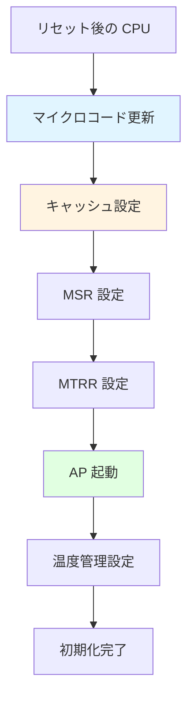
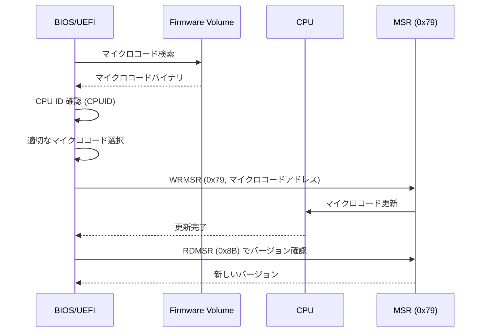
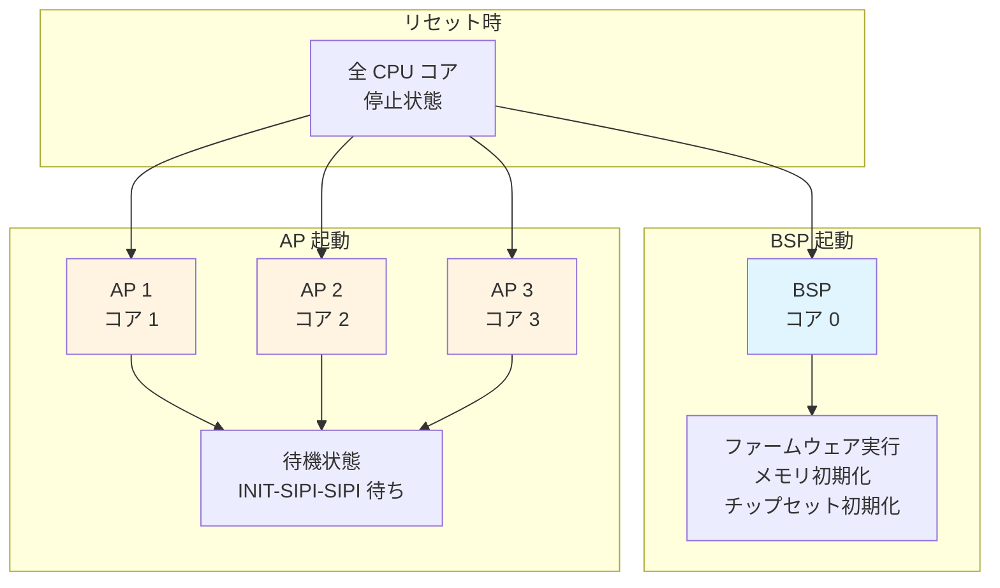
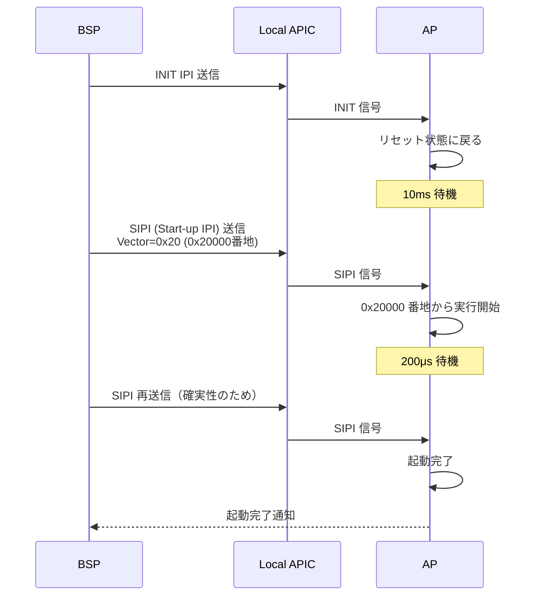
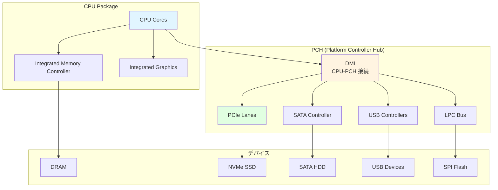
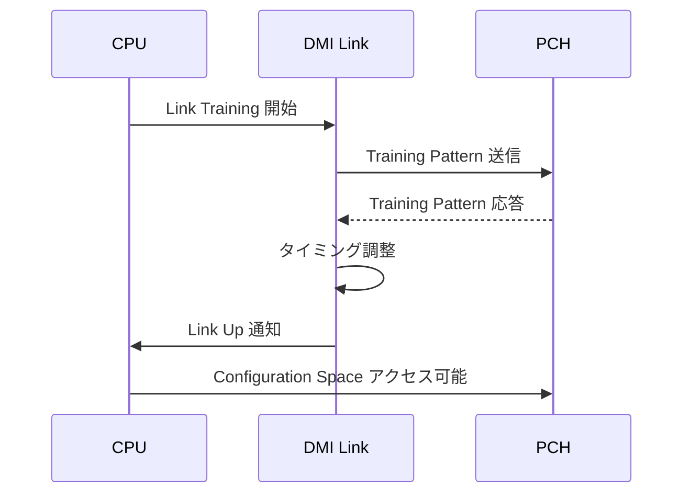
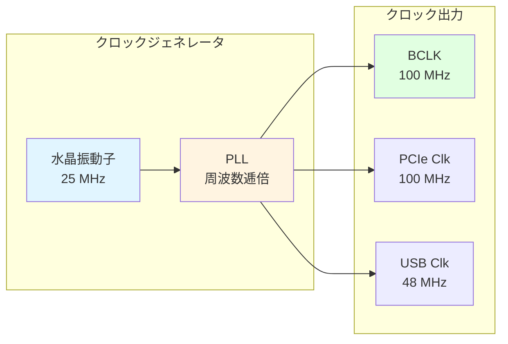

# CPU とチップセット初期化

🎯 **この章で学ぶこと**
- CPU の初期化手順（マイクロコード更新、キャッシュ設定）
- BSP (Bootstrap Processor) と AP (Application Processor) の起動
- チップセットの役割と初期化
- DMI/PCH の初期化
- クロック生成とリセット制御

📚 **前提知識**
- [Part I: CPU モードとセグメンテーション](../part1/03-cpu-modes.md)
- [Part III: PEI フェーズの役割と構造](01-pei-phase-architecture.md)

---

## CPU 初期化の概要

### CPU 初期化の目的

CPU 初期化は、**プロセッサを完全に機能する状態**にするための段階的なプロセスです。システムの電源が投入されてリセット信号が解除されると、CPU は最小限の機能しか持たないリセット状態から起動します。この状態では、CPU はリアルモードで動作し、キャッシュは無効化されており、マルチコア環境では1つのコア (BSP: Bootstrap Processor) のみが実行を開始します。ファームウェアは、この限られた状態から、CPU を段階的に初期化し、OS が期待する完全に機能する状態に持っていかなければなりません。

CPU 初期化の複雑さは、現代の CPU の高度な機能に由来しています。現代の CPU は、複数のコア、多階層のキャッシュ、仮想化支援機能、電源管理機能、セキュリティ機能など、膨大な機能を持っています。これらの機能は、適切に初期化されなければ正しく動作しません。さらに、CPU のマイクロコード (CPU 内部のマイクロプログラム) には、製造後に発見されたバグの修正や新機能の追加が含まれており、ファームウェアは最新のマイクロコードを適用する必要があります。

CPU 初期化は、複数のステップで構成されます。まず、**マイクロコード更新**です。CPU は、BIOS/UEFI が提供するマイクロコードパッチを適用し、ハードウェアの誤動作を修正します。次に、**キャッシュ設定**です。CPU のキャッシュを有効化し、MTRR (Memory Type Range Register) を設定してメモリ領域ごとのキャッシュポリシーを定義します。その後、**MSR (Model Specific Register) 設定**です。CPU の機能を制御する多数の MSR を適切に設定します。さらに、**MTRR 設定**により、Flash ROM、DRAM、MMIO 領域などに適切なキャッシュタイプを割り当てます。マルチコア環境では、**AP (Application Processor) 起動**により、BSP 以外のコアを起動します。最後に、**温度管理設定**により、CPU の温度監視と過熱保護を有効化します。

CPU 初期化は、ブートプロセスの複数のフェーズにまたがって実行されます。**SEC Phase** では、リセット直後に最小限の初期化を実行し、Cache as RAM (CAR) をセットアップします。**PEI Phase** のメモリ初期化前には、マイクロコード更新と基本設定を実行します。**PEI Phase** のメモリ初期化後には、AP を起動し、詳細設定を実行します。**DXE Phase** では、ドライバがロードされた後、ACPI テーブルを生成し、電源管理を設定します。この段階的なアプローチにより、各フェーズで必要なリソースが利用可能になった時点で、対応する初期化を実行できます。

CPU 初期化のもう一つの重要な側面は、**チップセットとの協調**です。CPU は単独で動作するのではなく、チップセット (特に PCH: Platform Controller Hub) と密接に連携します。CPU とチップセットは、DMI (Direct Media Interface) という高速リンクで接続されており、このリンクの初期化と設定も CPU 初期化の一部です。チップセットは、クロック生成、リセット制御、GPIO 設定、電源管理などの重要な機能を提供するため、CPU 初期化はチップセット初期化と並行して進む必要があります。

**補足図: CPU 初期化のフロー**



**参考表: CPU 初期化の段階**

| フェーズ | タイミング | 実行内容 |
|---------|-----------|---------|
| **SEC Phase** | リセット直後 | 最小限の初期化、CAR セットアップ |
| **PEI Phase** | メモリ初期化前 | マイクロコード更新、基本設定 |
| **PEI Phase** | メモリ初期化後 | AP 起動、詳細設定 |
| **DXE Phase** | ドライバロード後 | ACPI テーブル生成、電源管理 |

---

## マイクロコード更新

### マイクロコードとは

**マイクロコード (Microcode)** は、CPU 内部の **マイクロプログラム**です。CPU の命令を実際のハードウェア動作に変換する低レベルの制御コードで、バグ修正や機能追加のために更新可能です。

### なぜ更新が必要か

| 理由 | 説明 | 例 |
|------|------|-----|
| **バグ修正** | CPU ハードウェアの誤動作を修正 | Spectre/Meltdown 対策 |
| **機能追加** | 新しい命令のサポート | 新しい AVX 命令 |
| **安定性向上** | エラー条件の処理改善 | メモリアクセスの最適化 |
| **互換性** | 新しいチップセットとの互換性 | 新しいメモリタイプ対応 |

### マイクロコード更新の仕組み



### マイクロコード更新の手順

**1. CPU 識別**

```c
// CPUID で CPU を識別
UINT32 RegEax, RegEbx, RegEcx, RegEdx;
AsmCpuid (0x1, &RegEax, &RegEbx, &RegEcx, &RegEdx);

UINT32 CpuSignature = RegEax;  // Family, Model, Stepping
UINT32 PlatformId;
AsmReadMsr64 (0x17);  // IA32_PLATFORM_ID
PlatformId = (UINT32)((Msr >> 50) & 0x7);
```

**2. マイクロコード選択**

マイクロコードファイルから、CPU Signature と Platform ID に一致するものを選択。

**3. 更新実行**

```c
// MSR 0x79 にマイクロコードアドレスを書き込み
AsmWriteMsr64 (0x79, (UINT64)(UINTN)MicrocodeData);
```

**4. バージョン確認**

```c
// MSR 0x8B で更新後のバージョンを確認
UINT64 MicrocodeVersion = AsmReadMsr64 (0x8B);
```

---

## 💡 コラム: マイクロコードと CPU 初期化の仕組み

🔬 **技術的深堀り**

なぜ x86 CPU はマイクロコードという仕組みを持つのでしょうか。その答えは、x86 が CISC（Complex Instruction Set Computing）アーキテクチャとして設計されたことに由来します。CISC は、1つの命令で複雑な操作を実行できるように設計されており、例えば `REP MOVSB` という命令は、文字列全体をメモリ間でコピーする複雑な処理を単一命令で実現します。しかし、このような複雑な命令をハードウェアで直接実装すると、回路が非常に複雑になり、高速化が困難になります。そこで、Intel は、複雑な CISC 命令を内部的に単純な RISC 風のマイクロオペレーション（μops、マイクロオプス）に変換し、パイプラインで並列実行する方式を採用しました。この変換を行うのがマイクロコードです。

マイクロコードは、CPU 内部のマイクロプログラムであり、各 x86 命令をどのような μops に分解するかを定義します。例えば、`PUSH EAX` という命令は、内部的には「ESP を 4 減らす」「EAX の値をメモリに書き込む」という 2 つの μops に分解されます。より複雑な命令（例: `ENTER` や文字列操作命令）は、数十の μops に分解されることもあります。このマイクロコード変換により、x86 CPU は外部的には CISC の互換性を保ちながら、内部的には RISC 風の高速パイプラインで実行できるのです。Pentium Pro（1995年）以降の Intel CPU は、すべてこの「CISC-to-RISC 変換」方式を採用しています。

マイクロコードは、CPU 内部の ROM（不揮発性メモリ）に焼き込まれていますが、製造後に発見されたバグや新機能の追加に対応するため、更新可能な領域も持っています。更新可能なマイクロコードは、CPU 内部の SRAM（揮発性メモリ）に格納されます。重要なのは、SRAM は電源を切ると内容が消えるため、起動時に毎回ファームウェア（BIOS/UEFI）がマイクロコードを CPU にロードする必要があるということです。本章で学んだマイクロコード更新（MSR 0x79 への書き込み）は、まさにこの SRAM へのロードプロセスです。CPU は、まず ROM 内のマイクロコードで起動し、その後 BIOS が提供する最新のマイクロコードで SRAM を上書きします。

CPU 初期化を理解するには、いくつかの重要な予備知識が必要です。まず、**MSR（Model Specific Register）** は、CPU の設定や状態を格納する特殊なレジスタです。MSR は、通常のレジスタ（EAX、EBX など）とは異なり、`RDMSR` 命令と `WRMSR` 命令でのみアクセスできます。本章で使用した MSR 0x79（マイクロコード更新）、MSR 0x8B（マイクロコードバージョン）、MSR 0x17（Platform ID）は、CPU 初期化で頻繁に使用される MSR の一部です。次に、**CPUID 命令**は、CPU の機能、ファミリ、モデル、ステッピングなどの情報を取得する命令です。ファームウェアは、CPUID で CPU を識別し、適切なマイクロコードや設定を選択します。さらに、**BSP（Bootstrap Processor）** と **AP（Application Processor）** の区別も重要です。マルチコア CPU では、リセット後に 1 つのコア（BSP）のみが実行を開始し、残りのコア（AP）は初期化待機状態（Wait-for-SIPI）にあります。BSP がファームウェアを実行し、適切なタイミングで AP を起動します。

もう一つの重要な概念が **Cache as RAM（CAR）** です。ブートプロセスの初期段階（SEC Phase）では、まだ DRAM が初期化されていないため、通常のメモリが使用できません。しかし、CPU はスタックやヒープなどの一時データを保存する領域が必要です。そこで、CPU のキャッシュ（L1 データキャッシュ）を一時的にメモリとして使用します。これが CAR（または NEM: No-Evict Mode）です。CPU は、特定のメモリアドレス範囲をキャッシュに固定し、外部メモリへの書き戻しを無効化することで、キャッシュを RAM のように使用できます。通常、32 KB から 128 KB 程度の CAR が利用可能です。**MTRR（Memory Type Range Register）** も重要です。MTRR は、メモリアドレス範囲ごとに異なるキャッシュポリシーを設定するレジスタです。例えば、Flash ROM は WP（Write Protected、読み取りのみキャッシュ）、DRAM は WB（Write Back、読み書きキャッシュ）、MMIO 領域は UC（Uncacheable、キャッシュ不可）といった設定を行います。これらの設定により、CPU は各メモリ領域に適した方法でキャッシュを使用できます。

マイクロコードは、セキュリティの観点でも非常に重要です。2018年に発見された **Spectre** と **Meltdown** という CPU 脆弱性は、投機実行（Speculative Execution）の仕組みを悪用し、他のプロセスのメモリ内容を読み取る攻撃手法です。これらの脆弱性は、CPU のハードウェア設計に起因するため、完全な修正にはハードウェアの変更が必要ですが、部分的な緩和策としてマイクロコード更新が提供されました。Intel は、投機実行の動作を変更するマイクロコードを配布し、脆弱性のリスクを軽減しました。マイクロコード更新は、BIOS/UEFI 更新を通じて配布される場合と、OS（Linux、Windows）がブート時に適用する場合があります。BIOS 更新による方法は、すべての OS で有効ですが、BIOS 更新が必要です。OS レベルの更新は、より柔軟ですが、OS が起動するまで保護が適用されません。

本章で学ぶマイクロコード更新、キャッシュ設定（MTRR）、BSP/AP 起動、MSR 設定といった CPU 初期化のステップは、すべてこれらの基礎知識の上に成り立っています。マイクロコードが CISC 命令を μops に変換する仕組みを理解することで、なぜマイクロコード更新が重要なのかが明確になります。MSR、CPUID、MTRR、CAR といった概念を理解することで、CPU 初期化コードの各ステップの意味が理解できるようになります。そして、Spectre/Meltdown のようなセキュリティ脆弱性を知ることで、ファームウェアが最新のマイクロコードを適用する責任の重さを実感できるでしょう。CPU 初期化は、単なる設定作業ではなく、システム全体のパフォーマンスとセキュリティを左右する重要なプロセスなのです。

**参考資料**:
- [Intel® 64 and IA-32 Architectures Software Developer's Manual, Volume 3](https://www.intel.com/sdm) - Chapter 9: Processor Management and Initialization
- [Intel Microcode Update Guidance](https://www.intel.com/content/www/us/en/developer/articles/technical/software-security-guidance/resources/microcode-update-guidance.html)
- ["Meltdown and Spectre" (meltdownattack.com)](https://meltdownattack.com/) - CPU 脆弱性の詳細
- Jon Stokes, "Inside the Machine" - CISC と RISC、マイクロアーキテクチャの解説

---

## キャッシュの初期化

### キャッシュの階層

現代の CPU は、**複数階層のキャッシュ**を持ちます：

| キャッシュ | サイズ | レイテンシ | 説明 |
|-----------|-------|-----------|------|
| **L1 Data** | 32～64 KB/コア | 4～5 cycles | データ専用 |
| **L1 Instruction** | 32～64 KB/コア | 4～5 cycles | 命令専用 |
| **L2** | 256 KB～1 MB/コア | 12～15 cycles | 統合キャッシュ |
| **L3 (LLC)** | 8～64 MB（共有） | 40～50 cycles | 全コア共有 |

### キャッシュの有効化

リセット直後、キャッシュは無効化されています。**CR0 レジスタ**で制御します。

```c
// CR0 レジスタの CD (Cache Disable) と NW (Not Write-through) をクリア
UINTN Cr0 = AsmReadCr0 ();
Cr0 &= ~(CR0_CD | CR0_NW);  // ビット 30 と 29 をクリア
AsmWriteCr0 (Cr0);

// WBINVD 命令でキャッシュを無効化・フラッシュ
AsmWbinvd ();
```

### MTRR: Memory Type Range Register

**MTRR** は、メモリ領域ごとに**キャッシュポリシー**を設定するレジスタです。

#### キャッシュタイプ

| タイプ | 値 | 説明 | 用途 |
|--------|-----|------|------|
| **UC (Uncacheable)** | 0x00 | キャッシュしない | MMIO 領域 |
| **WC (Write Combining)** | 0x01 | 書き込みをまとめる | フレームバッファ |
| **WT (Write Through)** | 0x04 | 書き込み時に即座にメモリへ | - |
| **WP (Write Protect)** | 0x05 | 読み取り専用 | Flash ROM |
| **WB (Write Back)** | 0x06 | キャッシュを最大限活用 | 通常の RAM |

#### MTRR の設定例

```c
// 0x00000000 - 0x80000000 (2GB) を WB (Write Back) に設定
AsmWriteMsr64 (IA32_MTRR_PHYSBASE0, 0x00000000 | MTRR_CACHE_WRITE_BACK);
AsmWriteMsr64 (IA32_MTRR_PHYSMASK0, 0x0000000080000000 | MTRR_PHYS_MASK_VALID);

// 0xFFC00000 - 0xFFFFFFFF (4MB) を WP (Write Protect) に設定（Flash ROM）
AsmWriteMsr64 (IA32_MTRR_PHYSBASE1, 0x00000000FFC00000 | MTRR_CACHE_WRITE_PROTECTED);
AsmWriteMsr64 (IA32_MTRR_PHYSMASK1, 0x0000000000400000 | MTRR_PHYS_MASK_VALID);
```

---

## BSP と AP の起動

### BSP vs AP

マルチコアシステムでは、1つの CPU コアが **BSP (Bootstrap Processor)** として起動し、残りのコアは **AP (Application Processor)** として起動します。



### BSP の役割

| 役割 | 説明 |
|------|------|
| **ファームウェア実行** | SEC/PEI/DXE の全フェーズを実行 |
| **システム初期化** | メモリ、チップセット、デバイスを初期化 |
| **AP 起動** | INIT-SIPI-SIPI シーケンスで AP を起動 |
| **OS 制御** | OS 起動後も BSP が主制御を担当 |

### AP の起動シーケンス: INIT-SIPI-SIPI

AP を起動するには、**INIT-SIPI-SIPI** シーケンスを使用します。



**SIPI (Startup IPI) のベクタ**:

- Vector = 0x20 → AP は `0x20000` 番地 (128KB) から実行開始
- この番地に **AP 用のスタートアップコード**を配置

### AP スタートアップコードの例（概念的）

```asm
; AP が最初に実行するコード (0x20000 番地)
; リアルモードで起動するため、16ビットコード

BITS 16
ORG 0x20000

ap_startup:
    cli                     ; 割り込み無効化
    cld                     ; DF フラグクリア

    ; GDT をロード
    lgdt [gdt_descriptor]

    ; プロテクトモードに移行
    mov eax, cr0
    or eax, 1
    mov cr0, eax

    ; ロングモードに移行（省略）
    ; ...

    ; C 言語のエントリーポイントにジャンプ
    jmp ap_c_entry
```

---

## チップセットの初期化

### チップセットの役割

**チップセット**は、CPU とその他のハードウェア（メモリ、ストレージ、USB など）を接続する中核部品です。



### Intel プラットフォームの構成

| コンポーネント | 説明 |
|--------------|------|
| **CPU** | プロセッサコア、L1/L2/L3 キャッシュ |
| **IMC** | 統合メモリコントローラ（CPU 内蔵） |
| **PCH** | Platform Controller Hub（旧サウスブリッジ） |
| **DMI** | Direct Media Interface（CPU-PCH 接続） |

### PCH の初期化手順

#### 1. PCH リビジョン確認

```c
// PCI Config Space から PCH のリビジョンを読み取り
UINT16 PchRevision = PciRead16 (
  PCI_LIB_ADDRESS(0, 31, 0, R_PCH_LPC_RID)  // Bus 0, Device 31, Function 0
);
```

#### 2. クロック設定

PCH は **クロックジェネレータ**を制御し、システム全体のクロックを生成します。

| クロック | 周波数 | 用途 |
|---------|-------|------|
| **BCLK** | 100 MHz | CPU ベースクロック |
| **PCIe Clock** | 100 MHz | PCIe デバイス |
| **USB Clock** | 48 MHz | USB デバイス |
| **SATA Clock** | 100 MHz | SATA デバイス |

#### 3. GPIOの設定

PCH は **GPIO (General Purpose I/O)** ピンを多数持ち、プラットフォーム固有の信号制御に使用します。

```c
// GPIO パッドの設定例
GpioSetPadConfig (
  GPIO_SKL_H_GPP_A0,  // GPIO ピン番号
  &(GPIO_CONFIG) {
    .PadMode = GpioPadModeGpio,      // GPIO モード
    .Direction = GpioDirOut,         // 出力
    .OutputState = GpioOutHigh,      // High 出力
    .InterruptConfig = GpioIntDis    // 割り込み無効
  }
);
```

#### 4. 電源管理

PCH は **ACPI** 電源管理機能を提供します。

- **PM1** レジスタ: 電源ボタン、スリープ状態
- **GPE** レジスタ: General Purpose Event（デバイスウェイクアップ）
- **TCO** レジスタ: Total Cost of Ownership（ウォッチドッグタイマー）

---

## DMI (Direct Media Interface)

### DMI の役割

**DMI** は、CPU と PCH 間の高速インターコネクトです。PCIe ベースのプロトコルを使用します。

| 世代 | 帯域幅 | レーン数 | 実効速度 |
|------|--------|---------|---------|
| **DMI 2.0** | 2 GB/s | x4 | PCIe 2.0 相当 |
| **DMI 3.0** | 3.93 GB/s | x4 | PCIe 3.0 相当 |
| **DMI 4.0** | 7.87 GB/s | x8 | PCIe 4.0 相当 |

### DMI の初期化



---

## クロック生成とリセット制御

### クロックジェネレータ

システムクロックは、**外部クロックジェネレータ IC** で生成されます。



### リセット信号

| リセット種類 | 説明 | 影響範囲 |
|------------|------|---------|
| **Power-on Reset** | 電源投入時のリセット | システム全体 |
| **Warm Reset** | ソフトウェアリセット | CPU、PCH（メモリは保持） |
| **Cold Reset** | ハードウェアリセット | システム全体 |
| **CPU-only Reset** | CPU のみリセット | CPU のみ |

---

## まとめ

この章では、CPU とチップセットの初期化について詳しく学びました。CPU 初期化は、プロセッサを完全に機能する状態にするための段階的なプロセスであり、リセット直後の最小限の機能しか持たない状態から、OS が期待する完全に機能する状態に持っていきます。現代の CPU は、複数のコア、多階層のキャッシュ、仮想化支援機能、電源管理機能、セキュリティ機能など、膨大な機能を持っており、これらを適切に初期化する必要があります。

**マイクロコード更新**は、CPU 初期化の最初の重要なステップです。マイクロコードは、CPU 内部のマイクロプログラムであり、CPU の命令を実際のハードウェア動作に変換する低レベルの制御コードです。マイクロコードは、CPU のバグ修正、機能追加、安定性向上、互換性確保のために更新可能です。Spectre や Meltdown のような深刻な脆弱性も、マイクロコード更新によって緩和されます。ファームウェアは、CPUID で CPU を識別し、適切なマイクロコードを選択し、MSR 0x79 に書き込むことで更新を実行します。更新後、MSR 0x8B でバージョンを確認し、正しく適用されたことを検証します。

**キャッシュ初期化**は、CPU のパフォーマンスを最大化するために不可欠です。リセット直後、キャッシュは無効化されています。ファームウェアは、CR0 レジスタの CD (Cache Disable) と NW (Not Write-through) ビットをクリアしてキャッシュを有効化します。さらに、MTRR (Memory Type Range Register) を設定し、メモリ領域ごとのキャッシュポリシーを定義します。UC (Uncacheable) は MMIO 領域に使用され、WC (Write Combining) はフレームバッファに使用され、WP (Write Protect) は Flash ROM に使用され、WB (Write Back) は通常の DRAM に使用されます。適切な MTRR 設定により、システムのパフォーマンスとデバイスの正確性が確保されます。

**BSP と AP の起動**は、マルチコア環境における CPU 初期化の重要な側面です。マルチコアシステムでは、1つの CPU コアが BSP (Bootstrap Processor) として起動し、残りのコアは AP (Application Processor) として起動します。BSP は、ファームウェアの全フェーズ (SEC/PEI/DXE) を実行し、システム全体を初期化します。AP は、初期状態では待機状態にあり、BSP が INIT-SIPI-SIPI シーケンスを送信することで起動します。INIT IPI で AP をリセット状態に戻し、SIPI (Startup IPI) で起動番地 (例: 0x20000) を指定し、AP はそこから実行を開始します。SIPI は確実性のため2回送信されます。AP が起動すると、BSP が準備したスタートアップコードを実行し、リアルモードからプロテクトモード、そしてロングモードに移行し、C 言語のエントリーポイントにジャンプします。

**チップセット初期化**は、CPU 初期化と並行して実行される重要なプロセスです。チップセット (特に PCH: Platform Controller Hub) は、CPU とその他のハードウェア (メモリ、ストレージ、USB など) を接続する中核部品です。Intel プラットフォームでは、CPU は IMC (Integrated Memory Controller) を内蔵し、DRAM に直接接続されます。PCH は、DMI (Direct Media Interface) で CPU と接続され、PCIe、SATA、USB、LPC などの I/O デバイスを制御します。PCH 初期化は、PCH リビジョンの確認、クロック設定 (BCLK、PCIe Clock、USB Clock、SATA Clock)、GPIO の設定、電源管理 (PM1、GPE、TCO レジスタ) などを含みます。GPIO は、プラットフォーム固有の信号制御に使用され、各ピンのモード (GPIO/Native)、方向 (Input/Output)、出力状態、割り込み設定などを設定します。

**DMI (Direct Media Interface)** は、CPU と PCH 間の高速インターコネクトです。DMI は、PCIe ベースのプロトコルを使用し、世代ごとに帯域幅が向上しています。DMI 2.0 は 2 GB/s (PCIe 2.0 x4 相当)、DMI 3.0 は 3.93 GB/s (PCIe 3.0 x4 相当)、DMI 4.0 は 7.87 GB/s (PCIe 4.0 x8 相当) の帯域幅を提供します。DMI の初期化は、Link Training によって実行されます。CPU が Training Pattern を送信し、PCH が応答し、タイミングを調整し、Link Up 状態になります。Link が確立されると、CPU は PCH の Configuration Space にアクセスでき、PCH デバイスの設定が可能になります。

**クロック生成とリセット制御**は、システム全体の動作を支える基盤です。システムクロックは、外部クロックジェネレータ IC で生成されます。水晶振動子 (通常 25 MHz) が基準クロックを生成し、PLL (Phase-Locked Loop) が周波数を逓倍し、BCLK (100 MHz)、PCIe Clock (100 MHz)、USB Clock (48 MHz) などの複数のクロックを出力します。リセット信号には、複数の種類があります。Power-on Reset は電源投入時のリセットでシステム全体に影響し、Warm Reset はソフトウェアリセットで CPU と PCH に影響しますがメモリは保持され、Cold Reset はハードウェアリセットでシステム全体に影響し、CPU-only Reset は CPU のみをリセットします。これらのリセット種類を適切に使い分けることで、システムの柔軟な制御が可能になります。

### 次章の予告

次章では、**PCH/SoC の役割と初期化**について詳しく学びます。PCH の各サブシステム（SATA、USB、LPC、SMBus）の初期化、GPIO の詳細、そして SoC アーキテクチャとの違いを見ていきます。

---

📚 **参考資料**
- [Intel® 64 and IA-32 Architectures Software Developer's Manual](https://www.intel.com/sdm)
- [Intel® Platform Controller Hub (PCH) Datasheet](https://www.intel.com/content/www/us/en/products/chipsets.html)
- [Intel® Firmware Support Package (FSP) Documentation](https://www.intel.com/fsp)
