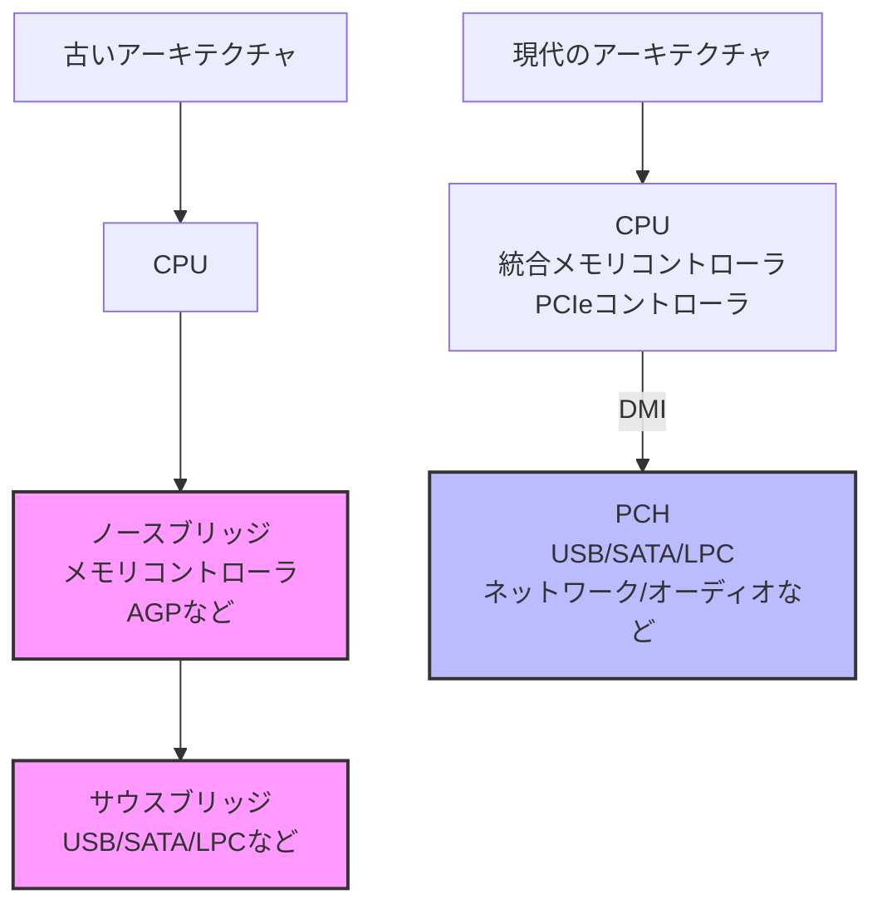
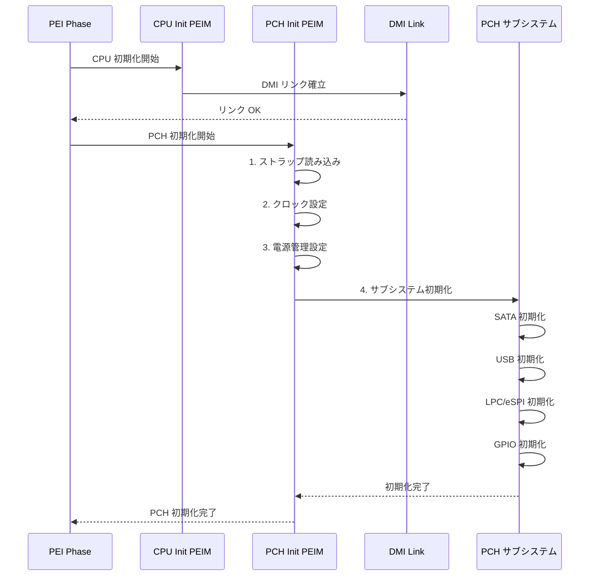
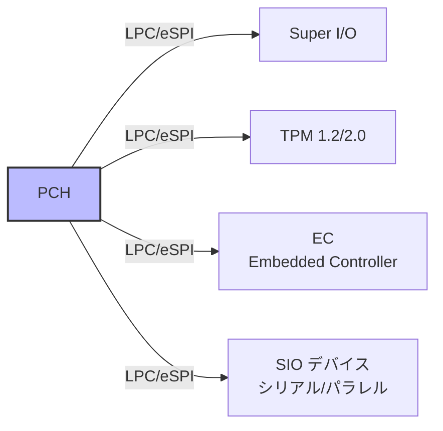
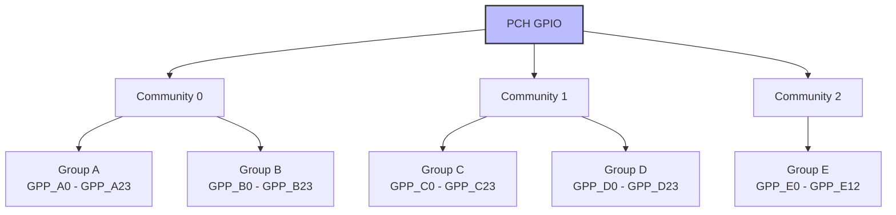
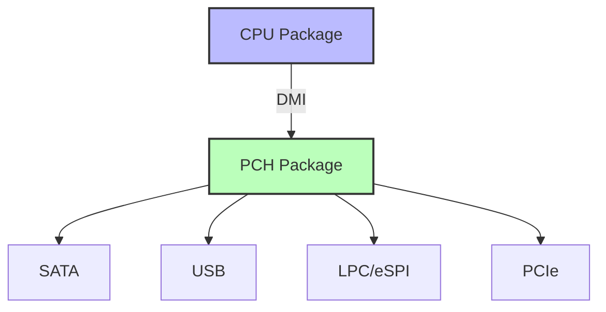
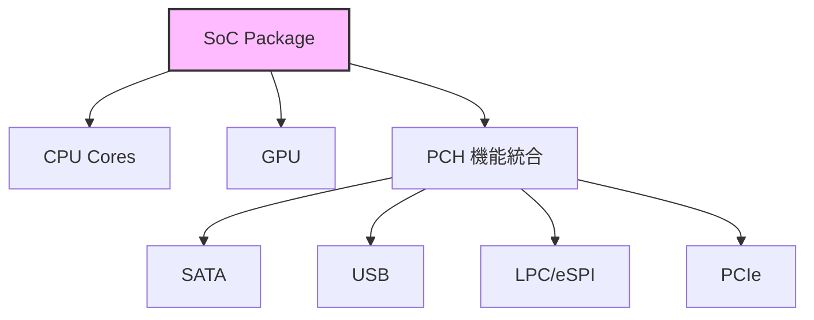

# PCH/SoC の役割と初期化

🎯 **この章で学ぶこと**
- PCH（Platform Controller Hub）の役割とアーキテクチャ
- PCH サブシステム（SATA、USB、LPC、SMBus など）の初期化
- GPIO の詳細な設定方法
- 従来の PCH と最新 SoC の違い
- プラットフォーム固有の初期化シーケンス

📚 **前提知識**
- [Part III: CPU とチップセット初期化](./03-cpu-chipset-init.md)
- DMI（Direct Media Interface）の基礎
- PCIe の基本概念

---

## PCH とは何か

**PCH（Platform Controller Hub）** は、Intel プラットフォームにおける I/O コントローラの中核です。かつてのノースブリッジとサウスブリッジの機能を統合し、CPU と周辺デバイスの橋渡しを担います。

### PCH の歴史的変遷



**変遷のポイント：**
- **～2000年代前半**: ノースブリッジ + サウスブリッジ構成
- **～2010年代**: メモリコントローラを CPU に統合、ノースブリッジ消滅
- **現在**: PCH が単一チップで I/O を統合

### PCH の主要機能

| サブシステム | 役割 | 接続デバイス例 |
|-------------|------|---------------|
| **SATA コントローラ** | ストレージデバイス管理 | HDD, SSD |
| **USB コントローラ** | USB デバイス管理 | キーボード, マウス, USBメモリ |
| **LPC/eSPI** | レガシーデバイス接続 | SuperI/O, TPM, BIOS Flash |
| **SMBus** | 低速デバイス通信 | 温度センサ, SPD EEPROM |
| **High Definition Audio** | オーディオ処理 | スピーカー, マイク |
| **PCIe ルートポート** | 拡張デバイス接続 | NIC, 追加ストレージ |
| **SPI コントローラ** | Flash ROM アクセス | BIOS/UEFI ファームウェア |
| **GPIO** | 汎用 I/O 制御 | 電源制御, LED, ボタン |

---

## PCH の初期化フロー

PCH の初期化は、CPU 初期化の後、デバイス列挙の前に行われます。

### 初期化シーケンス



### ステップ1: ストラップ設定の読み込み

**ストラップ（Strap）** は、PCH の動作モードを決定するハードウェア設定です。SPI Flash の特定領域に格納されています。

```c
/**
  PCH ストラップを読み込む

  @retval Strap データ
**/
UINT32
ReadPchStrap (
  VOID
  )
{
  UINT32 StrapData;

  // SPI Flash の Descriptor Region からストラップを読み込み
  // アドレスは PCH 世代により異なる（例: 0x0F00）
  StrapData = MmioRead32 (PCH_SPI_BASE_ADDRESS + 0x0F00);

  // ME（Management Engine）の有効/無効
  BOOLEAN MeEnabled = (StrapData & BIT0) != 0;

  // PCIe ポート設定
  UINT8 PciePortConfig = (StrapData >> 4) & 0x7;

  return StrapData;
}
```

**主要なストラップ項目：**
- ME (Management Engine) の有効/無効
- PCIe レーン構成（x4/x2/x1）
- SATA/PCIe モード選択
- Boot BIOS Strap（SPI/LPC）

### ステップ2: クロック初期化

PCH 内部の各サブシステムに適切なクロックを供給します。

```c
/**
  PCH クロック設定
**/
VOID
ConfigurePchClocks (
  VOID
  )
{
  UINT32 ClockConfig;

  // RCRB（Root Complex Register Block）ベースアドレス
  UINTN RcrbBase = PCH_RCRB_BASE;

  // クロックゲーティング設定
  ClockConfig = MmioRead32 (RcrbBase + R_PCH_RCRB_CG);

  // 使用するデバイスのクロックを有効化
  ClockConfig |= B_PCH_RCRB_CG_SATA;  // SATA クロック ON
  ClockConfig |= B_PCH_RCRB_CG_USB;   // USB クロック ON
  ClockConfig &= ~B_PCH_RCRB_CG_AZALIA; // Audio クロック OFF（未使用）

  MmioWrite32 (RcrbBase + R_PCH_RCRB_CG, ClockConfig);

  // クロック安定化待機
  MicroSecondDelay (10);
}
```

### ステップ3: 電源管理設定

PCH の電源管理は ACPI 仕様に準拠しています。

```c
/**
  PCH 電源管理初期化
**/
VOID
InitPchPowerManagement (
  VOID
  )
{
  UINTN PmcBase = PCH_PMC_BASE_ADDRESS;

  // GEN_PMCON_A レジスタ設定
  UINT32 GenPmConA = MmioRead32 (PmcBase + R_PCH_PMC_GEN_PMCON_A);

  // RTC 電源喪失時の動作設定
  GenPmConA |= B_PCH_PMC_GEN_PMCON_A_RTC_PWR_STS;

  // AC 電源喪失後の挙動（例: 自動起動）
  GenPmConA &= ~B_PCH_PMC_GEN_PMCON_A_AFTERG3_EN; // G3 後は OFF のまま

  MmioWrite32 (PmcBase + R_PCH_PMC_GEN_PMCON_A, GenPmConA);

  // C-State 設定
  MmioWrite32 (PmcBase + R_PCH_PMC_S3_PWRGATE, 0x00);
  MmioWrite32 (PmcBase + R_PCH_PMC_S4_PWRGATE, 0x00);
}
```

---

## サブシステムの初期化

### SATA コントローラ

SATA は **AHCI（Advanced Host Controller Interface）** モードまたは **RAID** モードで動作します。

```c
/**
  SATA 初期化
**/
EFI_STATUS
InitSataController (
  VOID
  )
{
  UINTN SataBase = PCI_LIB_ADDRESS (0, 17, 0, 0); // Bus 0, Device 17, Function 0

  // SATA モード設定（AHCI）
  UINT16 SataMode = PciRead16 (SataBase + R_SATA_MAP);
  SataMode &= ~B_SATA_MAP_SMS_MASK;
  SataMode |= V_SATA_MAP_SMS_AHCI; // AHCI モード
  PciWrite16 (SataBase + R_SATA_MAP, SataMode);

  // ポート有効化
  UINT8 PortsEnabled = BIT0 | BIT1; // Port 0, 1 を有効化
  PciWrite8 (SataBase + R_SATA_PCS, PortsEnabled);

  // AHCI BAR 設定
  PciWrite32 (SataBase + R_SATA_AHCI_BAR, SATA_AHCI_BASE_ADDRESS);

  // Bus Master 有効化
  UINT16 Command = PciRead16 (SataBase + PCI_COMMAND_OFFSET);
  Command |= EFI_PCI_COMMAND_MEMORY_SPACE | EFI_PCI_COMMAND_BUS_MASTER;
  PciWrite16 (SataBase + PCI_COMMAND_OFFSET, Command);

  return EFI_SUCCESS;
}
```

**SATA モードの比較：**

| モード | 説明 | 用途 |
|--------|------|------|
| **IDE** | レガシー互換モード | 古い OS 向け（非推奨） |
| **AHCI** | 標準的な SATA モード | 一般的な用途、NCQ サポート |
| **RAID** | ハードウェア RAID | RAID 0/1/5/10 構成 |

### USB コントローラ

PCH の USB コントローラは **xHCI（USB 3.x）** と **EHCI（USB 2.0、レガシー）** があります。

```c
/**
  USB (xHCI) 初期化
**/
EFI_STATUS
InitUsbController (
  VOID
  )
{
  UINTN XhciBase = PCI_LIB_ADDRESS (0, 20, 0, 0); // Bus 0, Device 20, Function 0

  // xHCI BAR 設定
  PciWrite32 (XhciBase + R_XHCI_MEM_BASE, USB_XHCI_BASE_ADDRESS);

  // USB ポート有効化
  UINT32 PortConfig = PciRead32 (XhciBase + R_XHCI_USB2PR);
  PortConfig |= 0x0000000F; // Port 0-3 を有効化
  PciWrite32 (XhciBase + R_XHCI_USB2PR, PortConfig);

  // USB3 ポート有効化
  PortConfig = PciRead32 (XhciBase + R_XHCI_USB3PR);
  PortConfig |= 0x00000003; // Port 0-1 を有効化
  PciWrite32 (XhciBase + R_XHCI_USB3PR, PortConfig);

  // Bus Master 有効化
  UINT16 Command = PciRead16 (XhciBase + PCI_COMMAND_OFFSET);
  Command |= EFI_PCI_COMMAND_MEMORY_SPACE | EFI_PCI_COMMAND_BUS_MASTER;
  PciWrite16 (XhciBase + PCI_COMMAND_OFFSET, Command);

  return EFI_SUCCESS;
}
```

### LPC/eSPI インターフェース

**LPC（Low Pin Count）** または **eSPI（Enhanced SPI）** は、レガシーデバイスとの通信に使用されます。



```c
/**
  LPC 初期化
**/
VOID
InitLpcController (
  VOID
  )
{
  UINTN LpcBase = PCI_LIB_ADDRESS (0, 31, 0, 0); // Bus 0, Device 31, Function 0

  // I/O デコード範囲設定
  UINT16 LpcIoDecodeRanges =
    B_LPC_IOD_COMA_2F8 |  // COM1: 2F8h
    B_LPC_IOD_KBC_60_64 | // キーボード: 60h/64h
    B_LPC_IOD_FDD_3F0;    // FDD: 3F0h

  PciWrite16 (LpcBase + R_LPC_IOD, LpcIoDecodeRanges);

  // Generic I/O Range 設定（例: TPM 用）
  PciWrite32 (LpcBase + R_LPC_GEN1_DEC, 0x000C0681); // TPM at 0x680-0x68F

  // BIOS デコード有効化
  UINT8 BiosControl = PciRead8 (LpcBase + R_LPC_BC);
  BiosControl |= B_LPC_BC_LE; // BIOS Lock Enable
  PciWrite8 (LpcBase + R_LPC_BC, BiosControl);
}
```

**LPC vs eSPI：**

| 項目 | LPC | eSPI |
|------|-----|------|
| 信号線数 | 7本（LAD[3:0], LFRAME#, LCLK, LRESET#） | 4本（CS#, CLK, DIO[1:0]） |
| 最大速度 | 33MHz | 66MHz |
| 電圧 | 3.3V | 1.8V / 3.3V |
| 用途 | レガシー | 最新プラットフォーム |

### SMBus コントローラ

**SMBus（System Management Bus）** は、低速デバイスとの通信に使用されます。

```c
/**
  SMBus 経由で SPD を読み込む例

  @param[in]  SmbusAddress  デバイスアドレス（例: 0x50）
  @param[in]  Offset        読み込みオフセット
  @param[out] Data          読み込んだデータ

  @retval EFI_SUCCESS  成功
**/
EFI_STATUS
SmbusReadByte (
  IN  UINT8   SmbusAddress,
  IN  UINT8   Offset,
  OUT UINT8   *Data
  )
{
  UINTN SmbusBase = PCH_SMBUS_BASE_ADDRESS;

  // アドレス設定
  IoWrite8 (SmbusBase + R_SMBUS_HSTS, 0xFF); // ステータスクリア
  IoWrite8 (SmbusBase + R_SMBUS_TSA, (SmbusAddress << 1) | 0x01); // Read
  IoWrite8 (SmbusBase + R_SMBUS_HCMD, Offset);

  // コマンド実行
  IoWrite8 (SmbusBase + R_SMBUS_HCTL, V_SMBUS_HCTL_CMD_BYTE_DATA);

  // 完了待機
  UINT32 Timeout = 1000;
  while (Timeout--) {
    UINT8 Status = IoRead8 (SmbusBase + R_SMBUS_HSTS);
    if (Status & B_SMBUS_HSTS_INTR) {
      *Data = IoRead8 (SmbusBase + R_SMBUS_HD0);
      IoWrite8 (SmbusBase + R_SMBUS_HSTS, 0xFF);
      return EFI_SUCCESS;
    }
    MicroSecondDelay (10);
  }

  return EFI_TIMEOUT;
}
```

---

## GPIO の詳細設定

**GPIO（General Purpose Input/Output）** は、汎用的なデジタル信号の入出力を制御します。

### GPIO の構造

PCH の GPIO は **コミュニティ（Community）** と **グループ（Group）** に分類されます。



### GPIO パッドコンフィグレーション

各 GPIO ピンは **DW0（DWORD 0）** と **DW1（DWORD 1）** の2つの32ビットレジスタで設定されます。

```c
/**
  GPIO 設定構造体
**/
typedef struct {
  UINT32 PadMode      : 3;  // パッドモード（GPIO, Native Function など）
  UINT32 HostSwOwn    : 1;  // 所有権（ACPI/Driver）
  UINT32 Direction    : 1;  // 方向（Input/Output）
  UINT32 OutputState  : 1;  // 出力値（Low/High）
  UINT32 InterruptCfg : 3;  // 割り込み設定
  UINT32 ResetConfig  : 2;  // リセット時の動作
  UINT32 TermConfig   : 4;  // 終端抵抗（Pull-up/Pull-down）
  UINT32 Reserved     : 17;
} GPIO_CONFIG_DW0;

/**
  GPIO を出力モードに設定

  @param[in]  GpioPad   GPIO 番号（例: GPP_A0）
  @param[in]  Level     出力レベル（0 or 1）
**/
VOID
GpioSetOutputValue (
  IN UINT32  GpioPad,
  IN UINT32  Level
  )
{
  UINT32 Community = GPIO_GET_COMMUNITY (GpioPad);
  UINT32 Group = GPIO_GET_GROUP (GpioPad);
  UINT32 PadNumber = GPIO_GET_PAD_NUMBER (GpioPad);

  // GPIO ベースアドレス取得
  UINTN GpioBase = GetGpioCommunityBase (Community);
  UINTN PadCfgOffset = (Group * 0x400) + (PadNumber * 0x10);

  // DW0 設定
  UINT32 PadCfgDw0 = MmioRead32 (GpioBase + PadCfgOffset);

  PadCfgDw0 &= ~(0x7 << 0);    // パッドモードクリア
  PadCfgDw0 |= (0x0 << 0);     // GPIO モード

  PadCfgDw0 |= (1 << 8);       // Direction = Output

  if (Level) {
    PadCfgDw0 |= (1 << 9);     // Output = High
  } else {
    PadCfgDw0 &= ~(1 << 9);    // Output = Low
  }

  MmioWrite32 (GpioBase + PadCfgOffset, PadCfgDw0);
}
```

### GPIO の典型的な用途

| GPIO | 用途例 |
|------|--------|
| **GPP_A0** | PCIe CLKREQ# |
| **GPP_B5** | SSD 電源制御 |
| **GPP_C6** | LED 制御 |
| **GPP_D9** | ボタン入力 |
| **GPP_E7** | TPM 割り込み |

---

## 従来の PCH と最新 SoC の違い

### ディスクリート PCH（従来型）



**特徴：**
- CPU と PCH が別チップ
- DMI 経由で接続（PCIe x4 相当）
- デスクトップ・サーバ向け

### SoC（System on Chip）統合型



**特徴：**
- CPU、GPU、PCH 機能が1チップ
- DMI レス（内部バス接続）
- モバイル・組み込み向け
- 低消費電力

### アーキテクチャ比較

| 項目 | ディスクリート PCH | SoC 統合 |
|------|-------------------|----------|
| **パッケージ数** | 2個（CPU + PCH） | 1個 |
| **接続** | DMI（PCIe x4） | 内部バス |
| **レイテンシ** | 高い | 低い |
| **消費電力** | 高い | 低い |
| **コスト** | 高い | 低い |
| **拡張性** | 高い | 限定的 |
| **主な用途** | デスクトップ、サーバ | モバイル、組み込み |

---

## プラットフォーム固有の初期化

### Intel プラットフォーム（FSP 使用）

```c
/**
  FSP SiliconInit による PCH 初期化
**/
EFI_STATUS
CallFspSiliconInit (
  VOID
  )
{
  FSP_INFO_HEADER   *FspHeader;
  FSPS_UPD          *FspsUpd;

  // FSP-S (Silicon Init) ヘッダ取得
  FspHeader = GetFspSInfoHeader ();

  // UPD（Updatable Product Data）設定
  FspsUpd = GetFspsUpdDataPointer (FspHeader);

  // SATA 設定
  FspsUpd->FspsConfig.SataEnable = 1;
  FspsUpd->FspsConfig.SataMode = 0; // AHCI
  FspsUpd->FspsConfig.SataPortsEnable[0] = 1;
  FspsUpd->FspsConfig.SataPortsEnable[1] = 1;

  // USB 設定
  FspsUpd->FspsConfig.EnableXhci = 1;
  FspsUpd->FspsConfig.PortUsb20Enable[0] = 1;
  FspsUpd->FspsConfig.PortUsb30Enable[0] = 1;

  // PCIe ルートポート設定
  FspsUpd->FspsConfig.PcieRpEnable[0] = 1;
  FspsUpd->FspsConfig.PcieRpEnable[1] = 1;

  // FSP SiliconInit 実行
  EFI_STATUS Status = CallFspSiliconInit (FspsUpd);

  return Status;
}
```

### AMD プラットフォーム（AGESA 使用）

AMD プラットフォームでは **AGESA（AMD Generic Encapsulated Software Architecture）** が同様の役割を果たします。

```c
/**
  AGESA による FCH（Fusion Controller Hub）初期化
**/
VOID
InitializeFch (
  VOID
  )
{
  FCH_INTERFACE FchInterface;

  // FCH パラメータ設定
  FchInterface.SataEnable = TRUE;
  FchInterface.SataMode = 0; // AHCI
  FchInterface.Usb.Xhci0Enable = TRUE;
  FchInterface.Usb.Xhci1Enable = FALSE;

  // AGESA FCH 初期化呼び出し
  AgesaFchInit (&FchInterface);
}
```

---

## 演習問題

### 基本演習

1. **PCH の役割**
   従来のサウスブリッジと PCH の違いを説明してください。

2. **SATA モード**
   AHCI モードと IDE モードの違いを、OS サポートの観点から述べてください。

### 応用演習

3. **GPIO 設定**
   GPP_C6 を出力モードに設定し、LED を点滅させるコードを書いてください。

4. **SMBus 読み込み**
   SMBus 経由で温度センサ（アドレス 0x48）から温度を読み取るコードを書いてください。

### チャレンジ演習

5. **PCH 診断ツール**
   PCH のすべてのサブシステムの状態（有効/無効、設定値）を表示する UEFI アプリケーションを作成してください。

6. **SoC 統合の影響**
   ディスクリート PCH から SoC 統合に移行する際のファームウェア設計上の変更点を調査してください。

---

## まとめ

この章では、PCH（Platform Controller Hub）と SoC の役割、初期化方法を学びました。

🔑 **重要なポイント：**

1. **PCH の役割**
   - 従来のノース・サウスブリッジの後継
   - SATA、USB、LPC、GPIO などのサブシステムを統合
   - DMI 経由で CPU と接続（ディスクリート PCH の場合）

2. **初期化シーケンス**
   - ストラップ読み込み → クロック設定 → 電源管理 → サブシステム初期化
   - FSP（Intel）や AGESA（AMD）が初期化を抽象化

3. **主要サブシステム**
   - **SATA**: AHCI/RAID モードでストレージ管理
   - **USB**: xHCI（USB 3.x）が主流
   - **LPC/eSPI**: レガシーデバイスとの通信
   - **SMBus**: 低速デバイス（センサ、SPD）との通信
   - **GPIO**: 汎用 I/O 制御、パッドコンフィグで詳細設定

4. **アーキテクチャの進化**
   - ディスクリート PCH: 拡張性重視（デスクトップ・サーバ）
   - SoC 統合: 省電力・小型化（モバイル・組み込み）

**次章では、PCIe の仕組みとデバイス列挙について学びます。**

---

📚 **参考資料**
- [Intel® PCH Datasheet](https://www.intel.com/content/www/us/en/products/docs/chipsets/datasheet.html) - PCH の詳細仕様
- [AHCI Specification](https://www.intel.com/content/dam/www/public/us/en/documents/technical-specifications/serial-ata-ahci-spec-rev1-3-1.pdf) - SATA AHCI 仕様書
- [USB xHCI Specification](https://www.intel.com/content/www/us/en/io/universal-serial-bus/extensible-host-controler-interface-usb-xhci.html) - USB 3.x ホストコントローラ仕様
- [Intel® GPIO Usage Guide](https://www.intel.com/content/www/us/en/support/programmable/support-resources/configuration/cfg-gpio.html) - GPIO 設定ガイド
- [eSPI Specification](https://www.intel.com/content/www/us/en/support/articles/000020952/intel-nuc.html) - Enhanced SPI 仕様
