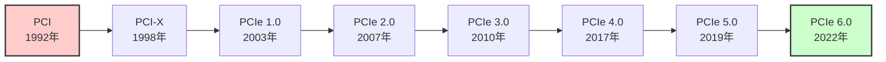
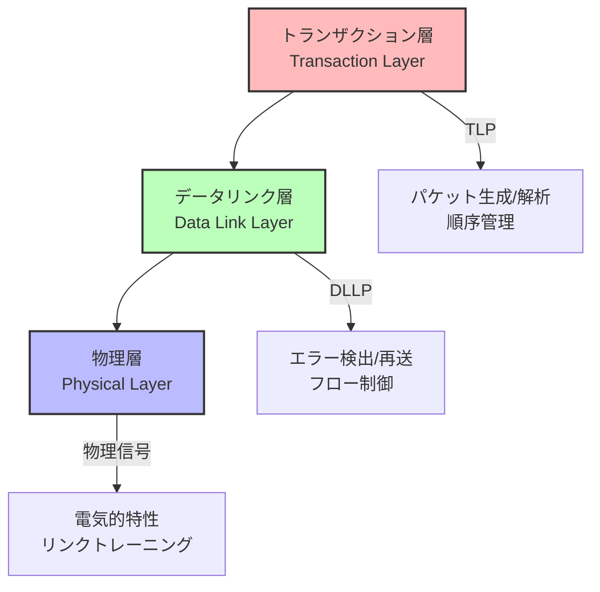
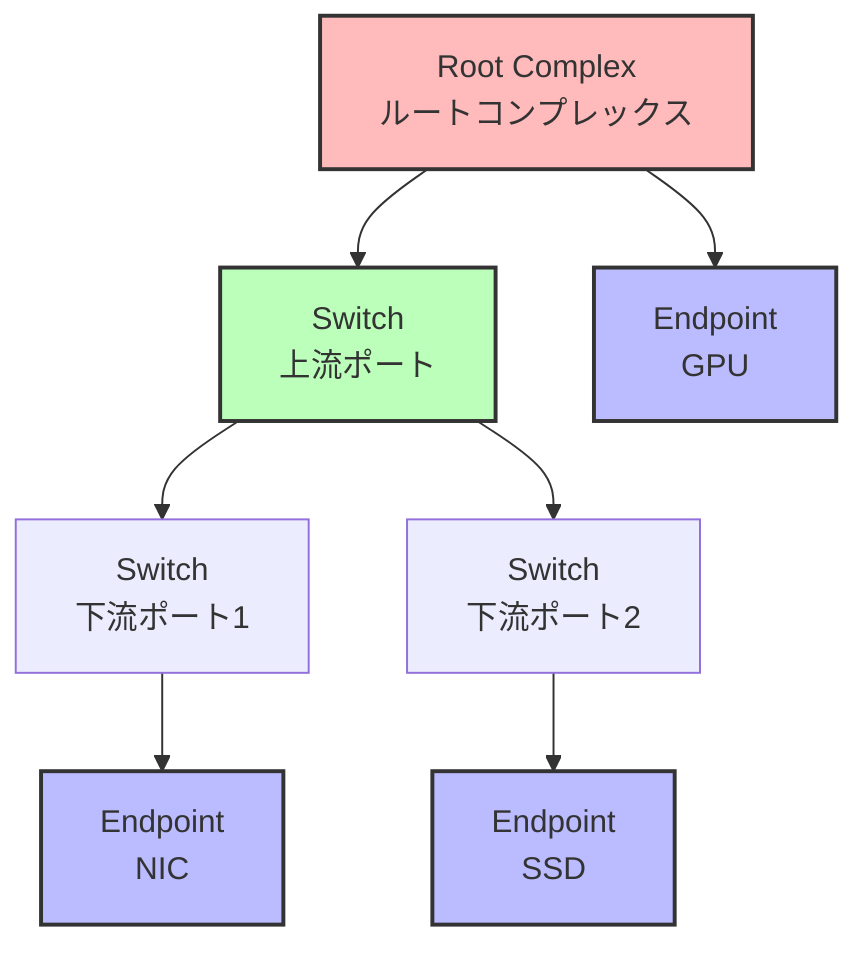
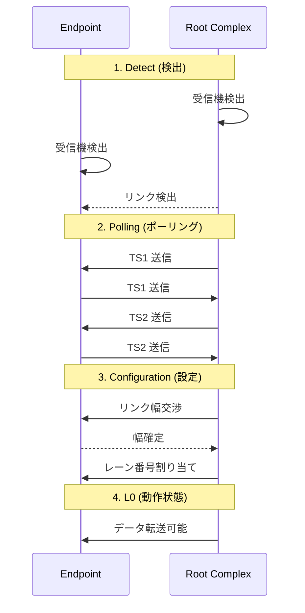
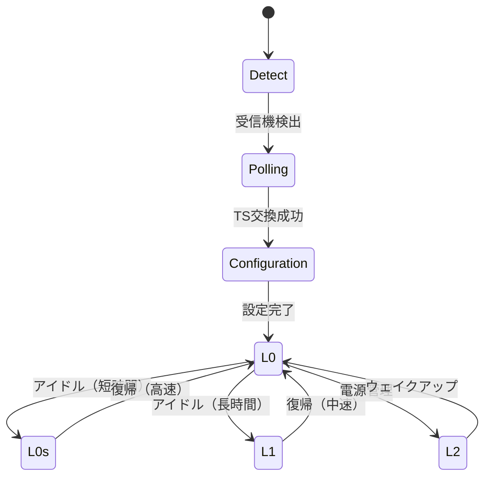
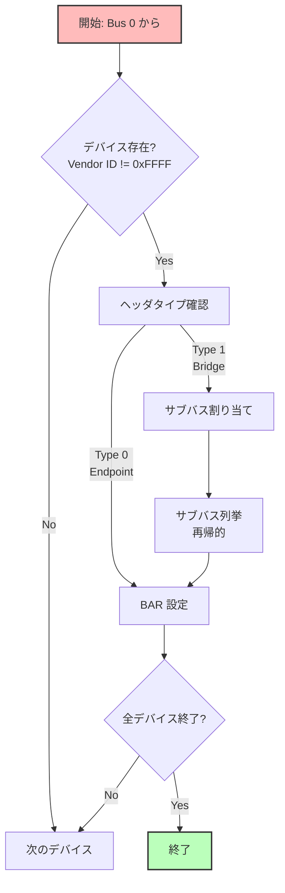

# PCIe の仕組みとデバイス列挙

🎯 **この章で学ぶこと**
- PCIe（PCI Express）の基本アーキテクチャ
- PCIe リンクトレーニングと初期化
- コンフィギュレーション空間とアクセス方法
- デバイス列挙（Enumeration）のアルゴリズム
- BAR（Base Address Register）の割り当て
- MSI/MSI-X 割り込みの仕組み

📚 **前提知識**
- [Part III: PCH/SoC の役割と初期化](./04-pch-soc-init.md)
- PCI バスの基礎知識
- メモリマップド I/O の概念

---

## PCIe とは何か

**PCIe (PCI Express)** は、現代のコンピュータにおける標準的な高速シリアルインターフェースであり、CPU、GPU、ストレージ、ネットワークカードなど、多様なデバイスを接続するための基盤技術です。PCIe は、従来の PCI バス (パラレルバス) を置き換える目的で設計され、2003 年に PCIe 1.0 として登場しました。PCI バスは共有バスアーキテクチャであり、複数のデバイスが同じバスを共有するため、帯域幅が制限され、スケーラビリティに問題がありました。一方、PCIe はポイント・ツー・ポイント接続を採用し、各デバイスが専用のリンクを持つため、帯域幅の競合がなく、より高速で柔軟な接続を実現します。

PCIe の進化は、データレートの継続的な向上によって特徴づけられます。**PCI** (1992年) は、32 ビット幅、33 MHz のパラレルバスであり、最大 133 MB/s のスループットを提供しました。**PCI-X** (1998年) は、PCI の拡張版であり、最大 1064 MB/s (PCI-X 2.0) までスループットを向上させましたが、依然として共有バスアーキテクチャの制約を受けていました。**PCIe 1.0** (2003年) は、シリアルインターフェースを採用し、x1 レーンで 250 MB/s (片方向)、x16 レーンで 4 GB/s (片方向) を実現しました。その後、PCIe は世代ごとにデータレートを倍増させてきました。**PCIe 2.0** (2007年) は 5.0 GT/s、**PCIe 3.0** (2010年) は 8.0 GT/s、**PCIe 4.0** (2017年) は 16.0 GT/s、**PCIe 5.0** (2019年) は 32.0 GT/s、そして最新の **PCIe 6.0** (2022年) は 64.0 GT/s という転送速度を実現しています。PCIe 6.0 では、x16 レーンで片方向 126 GB/s、双方向で 252 GB/s という驚異的な帯域幅を提供します。

PCIe の高速化は、エンコーディング方式の改善によっても支えられています。PCIe 1.0 と 2.0 は、**8b/10b エンコーディング**を使用しており、8 ビットのデータを 10 ビットに拡張して送信するため、実効帯域幅は転送速度の 80% になります。PCIe 3.0 以降は、**128b/130b エンコーディング**を採用し、128 ビットのデータを 130 ビットに拡張するため、実効帯域幅は転送速度の約 98.5% に向上しました。PCIe 6.0 では、**PAM4 (Pulse Amplitude Modulation 4-level)** という新しい変調方式を採用し、1 シンボルで 2 ビットを伝送できるため、さらなる高速化を実現しています。

PCIe は、**3 層のアーキテクチャ**で構成されています。**物理層 (Physical Layer)** は、電気的特性、リンクトレーニング、差動ペアの信号伝送を担当します。物理層は、デバイス間の物理的な接続を確立し、データを高速で確実に伝送するための基盤を提供します。**データリンク層 (Data Link Layer)** は、エラー検出、再送制御、フロー制御を担当します。データリンク層は、CRC (Cyclic Redundancy Check) によってデータの整合性を検証し、エラーが検出された場合はパケットを再送します。**トランザクション層 (Transaction Layer)** は、TLP (Transaction Layer Packet) の生成と解析、順序管理、アドレッシングを担当します。トランザクション層は、メモリリード、メモリライト、I/O リード、I/O ライト、Configuration リード、Configuration ライトなどのトランザクションをサポートします。この 3 層アーキテクチャにより、PCIe は柔軟性と信頼性を両立しています。

PCIe のトポロジは、**ツリー型**です。**Root Complex** が CPU に接続され、ツリーのルートとして機能します。Root Complex は、CPU と PCIe デバイス間のトランザクションを変換し、メモリアクセスと I/O アクセスを仲介します。**Switch** は、複数の PCIe リンクを接続し、トラフィックをルーティングします。Switch により、限られた Root Complex のレーン数を拡張し、多数のデバイスを接続できます。**Endpoint** は、実際のデバイス (GPU、NIC、NVMe SSD など) です。Endpoint は、ツリーのリーフノードとして機能し、Root Complex からのトランザクションを受け取り、応答します。このツリー型トポロジにより、PCIe は階層的なデバイス管理を実現し、複雑なシステム構成をサポートします。

**補足図: PCI から PCIe への進化**



**参考表: 世代別スループット (x16 レーン)**

| 世代 | 転送速度（片方向） | x1 レーン | x16 レーン | エンコーディング |
|------|-------------------|----------|-----------|----------------|
| **PCIe 1.0** | 2.5 GT/s | 250 MB/s | 4 GB/s | 8b/10b |
| **PCIe 2.0** | 5.0 GT/s | 500 MB/s | 8 GB/s | 8b/10b |
| **PCIe 3.0** | 8.0 GT/s | 985 MB/s | 15.75 GB/s | 128b/130b |
| **PCIe 4.0** | 16.0 GT/s | 1.97 GB/s | 31.5 GB/s | 128b/130b |
| **PCIe 5.0** | 32.0 GT/s | 3.94 GB/s | 63 GB/s | 128b/130b |
| **PCIe 6.0** | 64.0 GT/s | 7.88 GB/s | 126 GB/s | PAM4 |

**補足図: PCIe の階層構造**



**各層の役割：**

1. **物理層（Physical Layer）**
   - 差動ペア信号の送受信
   - クロックリカバリ
   - リンクトレーニング（速度・幅の交渉）

2. **データリンク層（Data Link Layer）**
   - CRC によるエラー検出
   - ACK/NAK による再送制御
   - フロー制御（クレジット管理）

3. **トランザクション層（Transaction Layer）**
   - TLP（Transaction Layer Packet）の生成・解析
   - アドレスルーティング
   - 順序保証

---

## PCIe トポロジ

PCIe は **ツリー構造** を形成します。



**コンポーネントの種類：**

| 種類 | 役割 | 例 |
|------|------|-----|
| **Root Complex (RC)** | PCIe ツリーの頂点、CPU/メモリと接続 | CPU 内蔵 PCIe コントローラ |
| **Switch** | 複数のデバイスを接続、パケット転送 | PCIe スイッチチップ |
| **Endpoint** | 末端デバイス | GPU、NIC、SSD |
| **Bridge** | PCIe と他のバス（PCI など）を接続 | PCIe-to-PCI ブリッジ |

---

## リンクトレーニングと初期化

PCIe リンクは電源投入時に **リンクトレーニング** を実行し、最適な速度と幅を決定します。

### リンクトレーニングシーケンス



**トレーニングシーケンス（TS: Training Sequence）：**

- **TS1**: ビットロック、シンボルロック確立
- **TS2**: レーン番号の割り当て、リンク幅の最終確認

### リンク状態遷移



**電源状態：**

| 状態 | 説明 | 復帰時間 | 消費電力 |
|------|------|---------|---------|
| **L0** | 通常動作 | - | 100% |
| **L0s** | スタンバイ（短時間） | < 1 μs | 70% |
| **L1** | スタンバイ（長時間） | < 10 μs | 10% |
| **L2** | 低電力 | 数百 μs | < 1% |
| **L3** | 電源 OFF | 数 ms | 0% |

---

## コンフィギュレーション空間

PCIe デバイスは **256 バイト（PCI 互換）** または **4096 バイト（PCIe 拡張）** のコンフィギュレーション空間を持ちます。

### コンフィギュレーション空間のレイアウト

```
オフセット    内容
0x000-0x03F   PCI 互換ヘッダ（64 バイト）
0x040-0x0FF   Capability リスト
0x100-0xFFF   PCIe 拡張 Capability（拡張コンフィグ空間）
```

**PCI 互換ヘッダ（Type 0）：**

| オフセット | サイズ | フィールド名 | 説明 |
|-----------|-------|-------------|------|
| 0x00 | 2 | Vendor ID | ベンダ識別子 |
| 0x02 | 2 | Device ID | デバイス識別子 |
| 0x04 | 2 | Command | コマンドレジスタ |
| 0x06 | 2 | Status | ステータスレジスタ |
| 0x08 | 1 | Revision ID | リビジョン |
| 0x09 | 3 | Class Code | クラスコード |
| 0x0C | 1 | Cache Line Size | キャッシュラインサイズ |
| 0x0D | 1 | Latency Timer | レイテンシタイマ（PCIe では未使用） |
| 0x0E | 1 | Header Type | ヘッダタイプ |
| 0x10-0x27 | 24 | BAR 0-5 | ベースアドレスレジスタ |
| 0x2C | 2 | Subsystem Vendor ID | サブシステムベンダ ID |
| 0x2E | 2 | Subsystem ID | サブシステム ID |
| 0x34 | 1 | Capabilities Pointer | Capability リスト先頭 |
| 0x3C | 1 | Interrupt Line | 割り込みライン（レガシー） |
| 0x3D | 1 | Interrupt Pin | 割り込みピン（レガシー） |

### コンフィギュレーション空間アクセス

**方法1: I/O ポート経由（レガシー、最大256バイト）**

```c
/**
  I/O ポート経由で PCI コンフィグ読み込み（レガシー）

  @param[in]  Bus       バス番号
  @param[in]  Device    デバイス番号
  @param[in]  Function  ファンクション番号
  @param[in]  Register  レジスタオフセット

  @retval 読み込んだ値
**/
UINT32
PciConfigReadLegacy (
  IN UINT8  Bus,
  IN UINT8  Device,
  IN UINT8  Function,
  IN UINT8  Register
  )
{
  UINT32 Address;

  // アドレス形成: [31: Enable] [30:24: Reserved] [23:16: Bus]
  //                [15:11: Device] [10:8: Function] [7:2: Register] [1:0: 00]
  Address = 0x80000000 |
            ((UINT32)Bus << 16) |
            ((UINT32)Device << 11) |
            ((UINT32)Function << 8) |
            (Register & 0xFC);

  IoWrite32 (0xCF8, Address);        // CONFIG_ADDRESS
  return IoRead32 (0xCFC);           // CONFIG_DATA
}
```

**方法2: MMIO 経由（推奨、4096バイト全体アクセス可能）**

```c
/**
  MMIO 経由で PCIe コンフィグ読み込み（拡張）

  @param[in]  Bus       バス番号
  @param[in]  Device    デバイス番号
  @param[in]  Function  ファンクション番号
  @param[in]  Register  レジスタオフセット（0x000-0xFFF）

  @retval 読み込んだ値
**/
UINT32
PciExpressConfigRead (
  IN UINT8   Bus,
  IN UINT8   Device,
  IN UINT8   Function,
  IN UINT16  Register
  )
{
  UINTN Address;

  // MMCONFIG ベースアドレス（ACPI MCFG テーブルから取得）
  UINTN MmconfigBase = PcdGet64 (PcdPciExpressBaseAddress); // 例: 0xE0000000

  // アドレス計算: Base + (Bus << 20) + (Device << 15) + (Function << 12) + Register
  Address = MmconfigBase |
            ((UINTN)Bus << 20) |
            ((UINTN)Device << 15) |
            ((UINTN)Function << 12) |
            Register;

  return MmioRead32 (Address);
}
```

---

## デバイス列挙（Enumeration）

**デバイス列挙** は、BIOS/UEFI が起動時に PCIe ツリーをスキャンし、すべてのデバイスを検出・設定するプロセスです。

### 列挙アルゴリズム



### 列挙のステップ

**ステップ1: デバイス検出**

```c
/**
  PCIe バス上のデバイスをスキャン

  @param[in]  Bus  バス番号
**/
VOID
ScanPciBus (
  IN UINT8  Bus
  )
{
  UINT8   Device;
  UINT8   Function;
  UINT16  VendorId;
  UINT8   HeaderType;

  for (Device = 0; Device < 32; Device++) {
    for (Function = 0; Function < 8; Function++) {
      // Vendor ID 読み込み
      VendorId = PciRead16 (Bus, Device, Function, 0x00);

      if (VendorId == 0xFFFF) {
        // デバイス不在
        if (Function == 0) {
          break; // 次のデバイスへ
        }
        continue;
      }

      // デバイス発見
      Print (L"Found device: Bus %d, Dev %d, Func %d, VID 0x%04X\n",
             Bus, Device, Function, VendorId);

      // ヘッダタイプ確認
      HeaderType = PciRead8 (Bus, Device, Function, 0x0E);

      if ((HeaderType & 0x7F) == 0x01) {
        // Type 1: PCI-to-PCI Bridge
        EnumerateBridge (Bus, Device, Function);
      } else {
        // Type 0: Endpoint
        ConfigureDevice (Bus, Device, Function);
      }

      // マルチファンクションでない場合、Function 0 のみ
      if (Function == 0 && !(HeaderType & 0x80)) {
        break;
      }
    }
  }
}
```

**ステップ2: ブリッジの処理**

```c
/**
  PCI-to-PCI ブリッジを列挙

  @param[in]  Bus       バス番号
  @param[in]  Device    デバイス番号
  @param[in]  Function  ファンクション番号
**/
VOID
EnumerateBridge (
  IN UINT8  Bus,
  IN UINT8  Device,
  IN UINT8  Function
  )
{
  STATIC UINT8 NextBusNumber = 1;
  UINT8 SecondaryBus;

  // セカンダリバス番号を割り当て
  SecondaryBus = NextBusNumber++;

  // ブリッジ設定
  PciWrite8 (Bus, Device, Function, 0x19, SecondaryBus);    // Secondary Bus Number
  PciWrite8 (Bus, Device, Function, 0x1A, 0xFF);            // Subordinate Bus (暫定)

  // セカンダリバスをスキャン
  ScanPciBus (SecondaryBus);

  // Subordinate Bus 番号を確定
  PciWrite8 (Bus, Device, Function, 0x1A, NextBusNumber - 1);
}
```

**ステップ3: BAR（Base Address Register）の設定**

```c
/**
  デバイスの BAR を設定

  @param[in]  Bus       バス番号
  @param[in]  Device    デバイス番号
  @param[in]  Function  ファンクション番号
**/
VOID
ConfigureDevice (
  IN UINT8  Bus,
  IN UINT8  Device,
  IN UINT8  Function
  )
{
  UINT8  BarIndex;
  UINT32 BarValue;
  UINT32 BarSize;

  for (BarIndex = 0; BarIndex < 6; BarIndex++) {
    UINT8 BarOffset = 0x10 + (BarIndex * 4);

    // BAR に 0xFFFFFFFF を書き込んでサイズを測定
    PciWrite32 (Bus, Device, Function, BarOffset, 0xFFFFFFFF);
    BarValue = PciRead32 (Bus, Device, Function, BarOffset);

    if (BarValue == 0 || BarValue == 0xFFFFFFFF) {
      continue; // 未使用 BAR
    }

    // サイズ計算
    if (BarValue & 0x1) {
      // I/O BAR
      BarSize = ~(BarValue & 0xFFFFFFFC) + 1;
      UINTN IoAddress = AllocateIoSpace (BarSize);
      PciWrite32 (Bus, Device, Function, BarOffset, IoAddress | 0x1);
    } else {
      // Memory BAR
      BarSize = ~(BarValue & 0xFFFFFFF0) + 1;
      UINTN MemAddress = AllocateMemorySpace (BarSize);
      PciWrite32 (Bus, Device, Function, BarOffset, MemAddress);

      // 64-bit BAR の場合
      if ((BarValue & 0x6) == 0x4) {
        BarIndex++; // 次の BAR も使用
        PciWrite32 (Bus, Device, Function, BarOffset + 4, (UINT32)(MemAddress >> 32));
      }
    }
  }

  // Command レジスタを有効化
  UINT16 Command = PciRead16 (Bus, Device, Function, 0x04);
  Command |= 0x07; // I/O Space | Memory Space | Bus Master
  PciWrite16 (Bus, Device, Function, 0x04, Command);
}
```

---

## BAR（Base Address Register）

**BAR** は、デバイスがメモリまたは I/O 空間のどこにマップされるかを指定します。

### BAR の種類

**Memory BAR（ビット0 = 0）：**

```
[31:4]  ベースアドレス（16バイトアライン）
[3]     Prefetchable（0: No, 1: Yes）
[2:1]   Type（00: 32-bit, 10: 64-bit）
[0]     0（Memory Space）
```

**I/O BAR（ビット0 = 1）：**

```
[31:2]  ベースアドレス（4バイトアライン）
[1]     予約
[0]     1（I/O Space）
```

### BAR サイズの決定方法

1. BAR に `0xFFFFFFFF` を書き込む
2. 読み戻す
3. マスクビット（Memory: bit 4-31, I/O: bit 2-31）を反転して +1

**例：**

```
書き込み: 0xFFFFFFFF
読み戻し: 0xFFFFF000
サイズ  : ~0xFFFFF000 + 1 = 0x00001000 (4KB)
```

---

## Capability と Extended Capability

### Capability リスト（0x40-0xFF）

**Capability** は、デバイスの拡張機能を記述します。リンクリスト形式で格納されます。

```c
/**
  指定された Capability ID を検索

  @param[in]  Bus       バス番号
  @param[in]  Device    デバイス番号
  @param[in]  Function  ファンクション番号
  @param[in]  CapId     Capability ID

  @retval オフセット（見つからない場合は 0）
**/
UINT8
FindCapability (
  IN UINT8  Bus,
  IN UINT8  Device,
  IN UINT8  Function,
  IN UINT8  CapId
  )
{
  UINT16 Status;
  UINT8  CapPtr;
  UINT8  CurrentCapId;

  // Status レジスタの Capability List ビット確認
  Status = PciRead16 (Bus, Device, Function, 0x06);
  if (!(Status & 0x0010)) {
    return 0; // Capability なし
  }

  // Capability ポインタ取得
  CapPtr = PciRead8 (Bus, Device, Function, 0x34);

  // リストを走査
  while (CapPtr != 0 && CapPtr != 0xFF) {
    CurrentCapId = PciRead8 (Bus, Device, Function, CapPtr);
    if (CurrentCapId == CapId) {
      return CapPtr; // 発見
    }

    // 次の Capability へ
    CapPtr = PciRead8 (Bus, Device, Function, CapPtr + 1);
  }

  return 0; // 見つからず
}
```

**主要な Capability ID：**

| ID | 名前 | 説明 |
|----|------|------|
| 0x01 | Power Management | 電源管理 |
| 0x05 | MSI | Message Signaled Interrupts |
| 0x10 | PCIe Capability | PCIe 固有設定 |
| 0x11 | MSI-X | 拡張 MSI |

### Extended Capability（0x100-0xFFF）

PCIe 拡張 Capability は、より大きな領域を使用します。

```c
/**
  Extended Capability を検索

  @param[in]  Bus       バス番号
  @param[in]  Device    デバイス番号
  @param[in]  Function  ファンクション番号
  @param[in]  ExtCapId  Extended Capability ID

  @retval オフセット（見つからない場合は 0）
**/
UINT16
FindExtendedCapability (
  IN UINT8   Bus,
  IN UINT8   Device,
  IN UINT8   Function,
  IN UINT16  ExtCapId
  )
{
  UINT16 CapPtr = 0x100; // 拡張 Capability は 0x100 から開始
  UINT32 Header;
  UINT16 CurrentCapId;

  while (CapPtr != 0) {
    Header = PciExpressConfigRead (Bus, Device, Function, CapPtr);
    CurrentCapId = (UINT16)(Header & 0xFFFF);

    if (CurrentCapId == ExtCapId) {
      return CapPtr;
    }

    // 次のポインタ（ビット 31:20）
    CapPtr = (UINT16)((Header >> 20) & 0xFFC);
  }

  return 0;
}
```

**主要な Extended Capability ID：**

| ID | 名前 | 説明 |
|----|------|------|
| 0x0001 | AER | Advanced Error Reporting |
| 0x0002 | VC | Virtual Channel |
| 0x0003 | Serial Number | デバイスシリアル番号 |
| 0x0010 | SR-IOV | Single Root I/O Virtualization |

---

## MSI/MSI-X 割り込み

### レガシー割り込み vs MSI

**レガシー割り込み（INTx）：**
- 物理的な割り込みライン（INTA#-INTD#）
- 共有可能（複数デバイスが同じラインを使用）
- 低速（レベルトリガ）

**MSI（Message Signaled Interrupts）：**
- メモリ書き込みで割り込み通知
- 各デバイスが独立したベクタを持つ
- 高速、スケーラブル

### MSI の設定

```c
/**
  MSI を有効化

  @param[in]  Bus       バス番号
  @param[in]  Device    デバイス番号
  @param[in]  Function  ファンクション番号
  @param[in]  Vector    割り込みベクタ番号
**/
VOID
EnableMsi (
  IN UINT8  Bus,
  IN UINT8  Device,
  IN UINT8  Function,
  IN UINT8  Vector
  )
{
  UINT8  MsiCapOffset;
  UINT16 MsiControl;
  UINT32 MessageAddress;
  UINT16 MessageData;

  // MSI Capability を検索
  MsiCapOffset = FindCapability (Bus, Device, Function, 0x05);
  if (MsiCapOffset == 0) {
    return; // MSI 非サポート
  }

  // MSI Control レジスタ読み込み
  MsiControl = PciRead16 (Bus, Device, Function, MsiCapOffset + 2);

  // Message Address 設定（Local APIC ベースアドレス）
  MessageAddress = 0xFEE00000 | (0 << 12); // Destination: BSP
  PciWrite32 (Bus, Device, Function, MsiCapOffset + 4, MessageAddress);

  // Message Data 設定（割り込みベクタ）
  MessageData = Vector;
  if (MsiControl & 0x0080) {
    // 64-bit アドレス対応
    PciWrite32 (Bus, Device, Function, MsiCapOffset + 8, 0); // Upper 32-bit
    PciWrite16 (Bus, Device, Function, MsiCapOffset + 12, MessageData);
  } else {
    // 32-bit アドレス
    PciWrite16 (Bus, Device, Function, MsiCapOffset + 8, MessageData);
  }

  // MSI Enable
  MsiControl |= 0x0001;
  PciWrite16 (Bus, Device, Function, MsiCapOffset + 2, MsiControl);
}
```

### MSI-X

**MSI-X** は MSI の拡張版で、より多くの割り込みベクタ（最大 2048）をサポートします。

```c
/**
  MSI-X を有効化

  @param[in]  Bus       バス番号
  @param[in]  Device    デバイス番号
  @param[in]  Function  ファンクション番号
**/
VOID
EnableMsiX (
  IN UINT8  Bus,
  IN UINT8  Device,
  IN UINT8  Function
  )
{
  UINT8  MsixCapOffset;
  UINT16 MsixControl;
  UINT32 TableOffsetBir;
  UINT8  TableBar;
  UINT32 TableOffset;
  UINTN  TableAddress;

  // MSI-X Capability を検索
  MsixCapOffset = FindCapability (Bus, Device, Function, 0x11);
  if (MsixCapOffset == 0) {
    return;
  }

  // Table Offset/BIR 取得
  TableOffsetBir = PciRead32 (Bus, Device, Function, MsixCapOffset + 4);
  TableBar = TableOffsetBir & 0x7;           // BAR Index
  TableOffset = TableOffsetBir & 0xFFFFFFF8; // Offset

  // BAR アドレス取得
  UINT32 BarValue = PciRead32 (Bus, Device, Function, 0x10 + TableBar * 4);
  TableAddress = (BarValue & 0xFFFFFFF0) + TableOffset;

  // MSI-X Table エントリ設定（例: エントリ 0）
  MmioWrite32 (TableAddress + 0,  0xFEE00000); // Message Address Low
  MmioWrite32 (TableAddress + 4,  0x00000000); // Message Address High
  MmioWrite32 (TableAddress + 8,  0x00000030); // Message Data (Vector 0x30)
  MmioWrite32 (TableAddress + 12, 0x00000000); // Vector Control (Unmask)

  // MSI-X Enable
  MsixControl = PciRead16 (Bus, Device, Function, MsixCapOffset + 2);
  MsixControl |= 0x8000; // Enable
  MsixControl &= ~0x4000; // Function Mask = 0
  PciWrite16 (Bus, Device, Function, MsixCapOffset + 2, MsixControl);
}
```

---

## 演習問題

### 基本演習

1. **PCIe の利点**
   従来の PCI バスと比較して、PCIe の主な利点を3つ挙げてください。

2. **コンフィグ空間アクセス**
   Bus 0, Device 5, Function 0, Offset 0x10 の値を読み取るコードを、I/O ポート方式と MMIO 方式の両方で書いてください。

### 応用演習

3. **デバイス検出**
   Bus 0 上のすべてのデバイスを列挙し、Vendor ID と Device ID を表示するプログラムを作成してください。

4. **MSI 設定**
   指定されたデバイスに対して MSI を有効化し、割り込みベクタ 0x50 を設定するコードを書いてください。

### チャレンジ演習

5. **完全な列挙プログラム**
   PCIe ツリー全体を再帰的にスキャンし、すべてのデバイスとブリッジを検出・設定する完全な列挙プログラムを実装してください。

6. **ホットプラグ対応**
   PCIe ホットプラグイベント（デバイス挿入・取り外し）を検出し、動的に列挙するメカニズムを調査・実装してください。

---

## まとめ

この章では、PCIe (PCI Express) の仕組みとデバイス列挙について詳しく学びました。PCIe は、現代のコンピュータにおける標準的な高速シリアルインターフェースであり、CPU、GPU、ストレージ、ネットワークカードなど、多様なデバイスを接続するための基盤技術です。PCIe は、従来の PCI バス (パラレルバス) を置き換える目的で設計され、ポイント・ツー・ポイント接続を採用することで、帯域幅の競合をなくし、より高速で柔軟な接続を実現しています。

**PCIe アーキテクチャ**は、3 層の階層構造で構成されています。**物理層 (Physical Layer)** は、電気的特性、リンクトレーニング、差動ペアの信号伝送を担当し、デバイス間の物理的な接続を確立します。**データリンク層 (Data Link Layer)** は、エラー検出、再送制御、フロー制御を担当し、CRC によってデータの整合性を検証します。**トランザクション層 (Transaction Layer)** は、TLP (Transaction Layer Packet) の生成と解析、順序管理、アドレッシングを担当し、メモリリード、メモリライト、Configuration リードなどのトランザクションをサポートします。PCIe のトポロジは、ツリー型であり、Root Complex がツリーのルート、Switch がトラフィックのルーティング、Endpoint が実際のデバイスとして機能します。PCIe の進化は、世代ごとのデータレートの倍増とエンコーディング方式の改善によって特徴づけられ、PCIe 6.0 では x16 レーンで双方向 252 GB/s という驚異的な帯域幅を実現しています。

**リンクトレーニング**は、PCIe デバイスが起動時に実行する重要なプロセスです。リンクトレーニングは、Detect、Polling、Configuration、L0 という 4 つの状態を経て、リンクを確立します。Detect 状態では、デバイスの接続を検出し、Polling 状態では、リンク幅 (x1, x2, x4, x8, x16) と速度 (Gen1-6) の交渉を実行します。Configuration 状態では、リンクの詳細なパラメータを設定し、L0 状態で正常動作状態に入ります。リンクトレーニングにより、PCIe デバイスは自動的に最適なリンク構成を決定でき、異なる世代のデバイス間でも互換性が保たれます。さらに、PCIe は電源状態 (L0, L0s, L1, L2) による省電力機能をサポートし、アイドル時にリンクを低電力状態に遷移させることで、システム全体の消費電力を削減します。

**コンフィギュレーション空間**は、PCIe デバイスの設定情報を保持するレジスタ群です。コンフィギュレーション空間は、PCI 互換領域 (256 バイト) と PCIe 拡張領域 (合計 4096 バイト) で構成されます。PCI 互換領域には、Vendor ID、Device ID、Command、Status、Class Code、BAR (Base Address Register) などの基本的な情報が含まれます。PCIe 拡張領域には、Capability と Extended Capability が含まれ、デバイスの高度な機能 (MSI、MSI-X、電源管理、AER など) を記述します。コンフィギュレーション空間へのアクセス方法は、2 つあります。レガシーな I/O ポートアクセス (0xCF8/0xCFC) は、PCI 互換領域にのみアクセスでき、MMIO アクセス (MMCONFIG) は、4096 バイト全体にアクセスでき、ACPI MCFG テーブルでベースアドレスが定義されます。

**デバイス列挙 (Enumeration)** は、BIOS/UEFI が起動時に実行する重要なプロセスであり、システムに接続されているすべての PCIe デバイスを検出し、メモリ空間と I/O 空間を割り当てます。デバイス列挙のアルゴリズムは、再帰的な深さ優先探索です。まず、Bus 0 のすべての Device と Function をスキャンし、Vendor ID を読み込んでデバイスの存在を検出します。Vendor ID が 0xFFFF の場合、デバイスは存在しません。デバイスが見つかると、BAR (Base Address Register) のサイズを決定し、メモリまたは I/O 空間を割り当てます。デバイスが PCI-to-PCI Bridge の場合、サブバスを再帰的に列挙します。この再帰的なアルゴリズムにより、複雑なツリー構造を持つ PCIe トポロジ全体を列挙できます。デバイス列挙の結果は、OS に渡され、OS はこの情報を基にデバイスドライバをロードします。

**MSI (Message Signaled Interrupts) と MSI-X** は、レガシーな INTx (割り込みピン) に代わる高速割り込み機構です。INTx は、物理的な割り込みピンを使用し、複数のデバイスで共有される可能性があり、レイテンシが高く、スケーラビリティに問題がありました。MSI は、割り込みをメモリ書き込みトランザクションとして送信し、CPU の Local APIC に直接通知します。MSI により、割り込みのレイテンシが削減され、各デバイスが独立した割り込みベクタを持つことができます。MSI は、最大 32 ベクタをサポートします。**MSI-X** は、MSI の拡張版であり、最大 2048 ベクタをサポートし、各ベクタに独立したメッセージアドレスとデータを設定できます。MSI-X により、高性能なマルチキューデバイス (NVMe SSD、高速 NIC など) が、複数の割り込みベクタを使用して並列処理を実現できます。MSI/MSI-X は、現代の高性能デバイスには不可欠な機能です。

---

📚 **参考資料**
- [PCI Express Base Specification](https://pcisig.com/specifications) - PCIe 仕様書（要会員登録）
- [PCI Local Bus Specification](https://pcisig.com/) - PCI 仕様書
- [Intel® PCIe Controller Documentation](https://www.intel.com/content/www/us/en/support/articles/000055661/processors.html) - Intel PCIe 実装ガイド
- [Linux Kernel PCI Subsystem](https://www.kernel.org/doc/html/latest/PCI/index.html) - Linux の PCIe 実装例
- [ACPI MCFG Table](https://uefi.org/specifications) - MMCONFIG 設定（ACPI 6.5 仕様）
