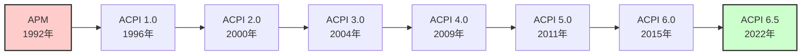
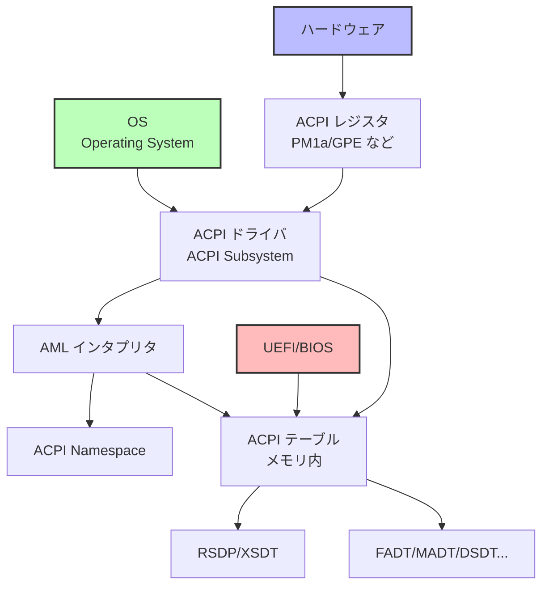
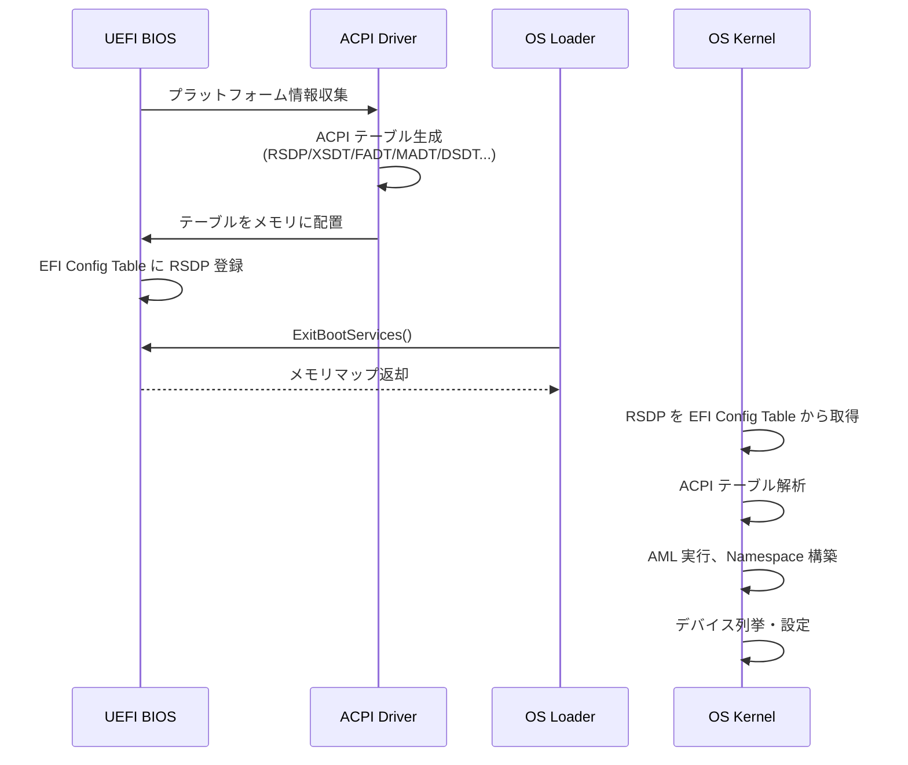

# ACPI の目的と構造

🎯 **この章で学ぶこと**
- ACPI（Advanced Configuration and Power Interface）の目的と歴史
- ACPI のアーキテクチャと構成要素
- ACPI テーブルの概要とアクセス方法
- ACPI Namespace の構造
- AML（ACPI Machine Language）の基礎
- OS とファームウェアの協調動作

📚 **前提知識**
- [Part III: PCIe の仕組みとデバイス列挙](./05-pcie-enumeration.md)
- 電源管理の基本概念
- デバイスドライバの基礎知識

---

## ACPI とは何か

**ACPI（Advanced Configuration and Power Interface）** は、オペレーティングシステムが主導権を持って電源管理、デバイス設定、熱管理を行うための業界標準規格です。ACPI は、1996 年に Intel、Microsoft、Toshiba によって策定され、従来のファームウェア主導の電源管理から、**OS 主導の電源管理（OS Directed Power Management）** へのパラダイムシフトをもたらしました。ACPI の登場により、OS は、CPU、メモリ、ストレージ、ネットワークカード、周辺機器など、システム全体のハードウェアリソースを統一的なインターフェースで管理できるようになり、消費電力の最適化、熱管理、プラグアンドプレイ、バッテリ管理などの高度な機能が実現されました。

ACPI が誕生する以前、電源管理は **APM（Advanced Power Management）** という BIOS 主導の規格によって実現されていました。APM は 1992 年に策定され、主にノート PC の省電力機能を目的としていましたが、いくつかの重大な問題を抱えていました。まず、**OS がハードウェアの状態を完全に把握できない**という問題がありました。APM では BIOS が電源管理を制御するため、OS はどのデバイスがどのような電源状態にあるかを知ることができず、結果として OS とファームウェアの間で競合が発生し、システムが不安定になることがありました。次に、**ベンダごとに異なる実装**が存在し、標準化が不十分であったため、互換性の問題が頻発しました。さらに、APM は主にシステム全体のスタンバイとサスペンドのみをサポートし、個々のデバイスの細かな電源制御には対応していませんでした。これらの問題を解決するために、業界は OS 主導の新しい標準である ACPI を開発しました。

ACPI の核心的な目的は、**OS がハードウェアの状態を完全に把握し、制御する**ことです。ACPI では、ファームウェアがハードウェアの詳細な情報を ACPI テーブルとして OS に提供し、OS はこの情報を基にデバイスを列挙、設定、制御します。これにより、OS は電源管理のポリシーを柔軟に決定でき、例えば、特定のアプリケーションが実行中の場合は CPU の周波数を上げ、アイドル時には下げるといった動的な最適化が可能になります。また、ACPI は **ベンダ非依存の標準インターフェース**を提供するため、異なるメーカーのハードウェアでも OS は同じ方法で電源管理を行うことができます。さらに、ACPI は**デバイスの動的な設定変更**をサポートし、ホットプラグや電源状態の遷移をシームレスに実現します。

ACPI の進化は、1996 年の **ACPI 1.0** から始まり、2000 年の **ACPI 2.0** で 64 ビットアドレスのサポートと拡張システム記述テーブル（XSDT）が追加され、2004 年の **ACPI 3.0** で PCI Express とプロセッサの電源管理が強化されました。2009 年の **ACPI 4.0** では USB 3.0 のサポートが追加され、2011 年の **ACPI 5.0** で ARM アーキテクチャのサポートと Low Power Idle（LPI）が導入されました。2015 年の **ACPI 6.0** では NVDIMM（不揮発性メモリ）とサーバプラットフォームの強化が行われ、2022 年の **ACPI 6.5** では最新のハードウェアトレンドに対応した機能が追加されています。この継続的な進化により、ACPI は PC、サーバ、モバイルデバイス、組込みシステムなど、幅広いプラットフォームで採用される業界標準規格となりました。

ACPI が提供する機能は、**電源管理**、**熱管理**、**プラグアンドプレイ**、**バッテリ管理**、**イベント通知**という5つの主要なカテゴリに分類できます。まず、**電源管理**では、システム全体の電源状態（S0: 動作中、S3: サスペンドトゥRAM、S4: ハイバネーション、S5: シャットダウン）と、個々のデバイスの電源状態（D0: 完全動作、D3: 電源 OFF）を制御します。また、CPU のアイドル状態（C-State: C0 から C6 までの深いスリープ）と動作周波数（P-State）も管理し、消費電力を最適化します。次に、**熱管理**では、温度センサから現在の温度を読み取り、ファンの回転速度を制御したり、温度が高すぎる場合には CPU の動作周波数を下げるサーマルスロットリングを実行したりします。**プラグアンドプレイ**では、デバイスのホットプラグ（USB デバイスの抜き差しなど）を検出し、リソース（IRQ、I/O ポート、メモリアドレス）を動的に割り当てます。**バッテリ管理**では、バッテリの残量、充電状態、設計容量、現在の消費電力などの情報を OS に提供し、OS はこの情報を基にユーザーに通知したり、省電力モードに移行したりします。最後に、**イベント通知**では、電源ボタンの押下、ノート PC の蓋の開閉、ドッキングステーションの挿抜、温度警告など、さまざまなハードウェアイベントを OS に通知し、OS は適切なアクションを実行します。

したがって、ACPI は現代のコンピュータシステムにおける電源管理とデバイス設定の基盤技術であり、OS とハードウェアの間の標準的なインターフェースを提供することで、効率的で柔軟なシステム管理を実現しています。ACPI の理解は、UEFI ファームウェア開発、OS カーネル開発、デバイスドライバ開発のいずれにおいても不可欠であり、システム全体のパフォーマンスと電力効率に直接影響を与える重要な知識となります。

### 補足図: ACPI の歴史的進化



### 参考表: ACPI の提供する機能

| カテゴリ | 機能 | 例 |
|---------|------|-----|
| **電源管理** | システム・デバイスの電源状態制御 | スリープ（S3）、休止（S4）、CPU C-State |
| **熱管理** | 温度監視と冷却制御 | ファン制御、サーマルスロットリング |
| **プラグ＆プレイ** | デバイスの動的設定 | リソース割り当て、ホットプラグ |
| **バッテリ管理** | バッテリ情報の取得 | 残量、充電状態 |
| **イベント通知** | ハードウェアイベントの伝達 | 電源ボタン、蓋開閉、ドック挿抜 |

---

## ACPI のアーキテクチャ

ACPI は **ACPI テーブル**、**ACPI Namespace**、**ACPI Machine Language (AML)** から構成されます。

### 全体構成



**コンポーネント：**

1. **ACPI テーブル（静的）**: UEFI/BIOS がメモリに配置
   - システム情報（CPU、割り込み、電源）
   - デバイスツリー
   - AML コード

2. **ACPI Namespace（動的）**: OS が構築
   - デバイスの階層構造
   - メソッドとオブジェクト

3. **AML インタプリタ**: OS が実行
   - AML バイトコードを解釈・実行
   - ハードウェア操作の抽象化

---

## ACPI テーブルの発見と構造

### RSDP（Root System Description Pointer）

OS は **RSDP** を起点に ACPI テーブルを発見します。

**RSDP の配置場所（UEFI）：**
- EFI Configuration Table 内の GUID: `EFI_ACPI_20_TABLE_GUID`

```c
/**
  RSDP を検索

  @retval RSDP アドレス
**/
EFI_ACPI_6_5_ROOT_SYSTEM_DESCRIPTION_POINTER *
FindRsdp (
  VOID
  )
{
  EFI_CONFIGURATION_TABLE  *ConfigTable;
  UINTN                    Index;

  ConfigTable = gST->ConfigurationTable;

  for (Index = 0; Index < gST->NumberOfTableEntries; Index++) {
    if (CompareGuid (&ConfigTable[Index].VendorGuid, &gEfiAcpi20TableGuid)) {
      // ACPI 2.0+ RSDP 発見
      return (EFI_ACPI_6_5_ROOT_SYSTEM_DESCRIPTION_POINTER *)ConfigTable[Index].VendorTable;
    }
  }

  return NULL;
}
```

**RSDP 構造体（ACPI 2.0+）：**

```c
typedef struct {
  UINT64  Signature;           // "RSD PTR " (8 bytes)
  UINT8   Checksum;            // 最初の 20 バイトのチェックサム
  UINT8   OemId[6];            // OEM 識別子
  UINT8   Revision;            // ACPI バージョン（2 = ACPI 2.0+）
  UINT32  RsdtAddress;         // RSDT 物理アドレス（32-bit、後方互換）
  // --- ACPI 2.0+ 拡張フィールド ---
  UINT32  Length;              // RSDP 構造体のサイズ
  UINT64  XsdtAddress;         // XSDT 物理アドレス（64-bit）
  UINT8   ExtendedChecksum;    // 全体のチェックサム
  UINT8   Reserved[3];
} EFI_ACPI_6_5_ROOT_SYSTEM_DESCRIPTION_POINTER;
```

### XSDT（Extended System Description Table）

**XSDT** は、他の ACPI テーブルへのポインタの配列です。

```c
typedef struct {
  EFI_ACPI_DESCRIPTION_HEADER  Header;   // シグネチャ "XSDT"
  UINT64                       Entry[1]; // 他のテーブルへの物理アドレス（可変長）
} EFI_ACPI_EXTENDED_SYSTEM_DESCRIPTION_TABLE;
```

**XSDT からテーブルを検索：**

```c
/**
  指定されたシグネチャの ACPI テーブルを検索

  @param[in]  Signature  テーブルシグネチャ（例: "FACP"）

  @retval テーブルアドレス
**/
VOID *
FindAcpiTable (
  IN UINT32  Signature
  )
{
  EFI_ACPI_6_5_ROOT_SYSTEM_DESCRIPTION_POINTER  *Rsdp;
  EFI_ACPI_EXTENDED_SYSTEM_DESCRIPTION_TABLE    *Xsdt;
  EFI_ACPI_DESCRIPTION_HEADER                   *Table;
  UINTN                                         EntryCount;
  UINTN                                         Index;

  Rsdp = FindRsdp ();
  if (Rsdp == NULL) {
    return NULL;
  }

  Xsdt = (EFI_ACPI_EXTENDED_SYSTEM_DESCRIPTION_TABLE *)(UINTN)Rsdp->XsdtAddress;
  EntryCount = (Xsdt->Header.Length - sizeof (EFI_ACPI_DESCRIPTION_HEADER)) / sizeof (UINT64);

  for (Index = 0; Index < EntryCount; Index++) {
    Table = (EFI_ACPI_DESCRIPTION_HEADER *)(UINTN)Xsdt->Entry[Index];
    if (Table->Signature == Signature) {
      return Table;
    }
  }

  return NULL;
}
```

### ACPI テーブル共通ヘッダ

すべての ACPI テーブルは共通ヘッダを持ちます。

```c
typedef struct {
  UINT32  Signature;          // テーブル識別子（例: "FACP", "APIC"）
  UINT32  Length;             // テーブル全体のサイズ
  UINT8   Revision;           // テーブルのバージョン
  UINT8   Checksum;           // チェックサム（全バイトの和が 0）
  UINT8   OemId[6];           // OEM 識別子
  UINT64  OemTableId;         // OEM テーブル ID
  UINT32  OemRevision;        // OEM リビジョン
  UINT32  CreatorId;          // テーブル作成ツール ID
  UINT32  CreatorRevision;    // 作成ツールバージョン
} EFI_ACPI_DESCRIPTION_HEADER;
```

**主要な ACPI テーブル：**

| シグネチャ | 名称 | 説明 |
|-----------|------|------|
| **FACP** | Fixed ACPI Description Table | 固定ハードウェア情報、DSDT ポインタ |
| **DSDT** | Differentiated System Description Table | デバイス定義、AML コード |
| **SSDT** | Secondary System Description Table | 追加デバイス定義、AML コード |
| **MADT** | Multiple APIC Description Table | CPU・割り込み情報 |
| **MCFG** | Memory Mapped Configuration Table | PCIe MMCONFIG アドレス |
| **HPET** | High Precision Event Timer Table | HPET デバイス情報 |
| **SRAT** | System Resource Affinity Table | NUMA ノード情報 |

---

## ACPI Namespace

**ACPI Namespace** は、デバイスとオブジェクトの階層的な名前空間です。

### Namespace の構造

```mermaid
graph TD
    A[\ <br/>ルート] --> B[_SB<br/>System Bus]
    B --> C[PCI0<br/>PCI Bus 0]
    C --> D[SATA<br/>SATA Controller]
    C --> E[USB0<br/>USB Controller]
    A --> F[_PR<br/>Processor]
    F --> G[CPU0]
    F --> H[CPU1]
    A --> I[_TZ<br/>Thermal Zone]
    I --> J[TZ00]

    style A fill:#fbb,stroke:#333,stroke-width:2px
    style B fill:#bfb,stroke:#333,stroke-width:2px
    style F fill:#bfb,stroke:#333,stroke-width:2px
```

**予約済みスコープ：**

| 名前 | 説明 |
|------|------|
| **\\_SB** | System Bus（デバイスツリーのルート） |
| **\\_PR** | Processor（CPU オブジェクト） |
| **\\_TZ** | Thermal Zone（温度管理） |
| **\\_SI** | System Indicator（システムインジケータ） |
| **\\_GPE** | General Purpose Events（汎用イベント） |

### オブジェクトの種類

```c
// ACPI オブジェクトの例（擬似コード）

// デバイスオブジェクト
Device (PCI0) {
  Name (_HID, EisaId ("PNP0A08"))  // Hardware ID: PCI Express Root Bridge
  Name (_CID, EisaId ("PNP0A03"))  // Compatible ID: PCI Root Bridge
  Name (_UID, 0)                   // Unique ID

  Method (_STA, 0) {               // Status: デバイスの状態
    Return (0x0F)                  // Present, Enabled, Shown, Functional
  }
}

// CPU オブジェクト
Processor (CPU0, 0x00, 0x00000410, 0x06) {
  Method (_PSS, 0) {               // Performance Supported States
    // P-State 定義
  }

  Method (_CST, 0) {               // C-States
    // C-State 定義
  }
}

// サーマルゾーン
ThermalZone (TZ00) {
  Method (_TMP, 0) {               // Temperature: 現在温度
    // 温度センサから読み取り
  }

  Method (_CRT, 0) {               // Critical Trip Point
    Return (373)                   // 100°C (Kelvin × 10)
  }
}
```

### 予約済みメソッド名

| メソッド | 用途 | 引数 |
|---------|------|------|
| **_HID** | Hardware ID | なし |
| **_UID** | Unique ID | なし |
| **_STA** | Status（デバイス状態） | なし |
| **_INI** | Initialize（初期化） | なし |
| **_ON** | Power On | なし |
| **_OFF** | Power Off | なし |
| **_PS0-_PS3** | Power State 0-3 | なし |
| **_CRS** | Current Resource Settings | なし |
| **_PRS** | Possible Resource Settings | なし |
| **_SRS** | Set Resource Settings | 1 |

---

## AML（ACPI Machine Language）

**AML** は、ACPI テーブル（DSDT/SSDT）に格納されるバイトコードです。OS の AML インタプリタが実行します。

### ASL から AML へ

**ASL（ACPI Source Language）** は人間が読み書きする言語、**AML** はそのコンパイル結果です。

```
ASL ソースコード → iasl コンパイラ → AML バイトコード
```

**ASL 例：**

```c
DefinitionBlock ("dsdt.aml", "DSDT", 2, "VENDOR", "BOARD", 0x00000001)
{
  Scope (\_SB)
  {
    Device (PCI0)
    {
      Name (_HID, EisaId ("PNP0A08"))
      Name (_CID, EisaId ("PNP0A03"))
      Name (_UID, 0)

      Method (_STA, 0, NotSerialized)
      {
        Return (0x0F)
      }

      // PCIe MMCONFIG 領域
      Name (_CRS, ResourceTemplate ()
      {
        WordBusNumber (ResourceProducer, MinFixed, MaxFixed, PosDecode,
          0x0000,             // Granularity
          0x0000,             // Range Minimum (Bus 0)
          0x00FF,             // Range Maximum (Bus 255)
          0x0000,             // Translation Offset
          0x0100,             // Length (256 buses)
        )

        DWordMemory (ResourceProducer, PosDecode, MinFixed, MaxFixed, NonCacheable, ReadWrite,
          0x00000000,         // Granularity
          0xE0000000,         // Range Minimum
          0xEFFFFFFF,         // Range Maximum
          0x00000000,         // Translation Offset
          0x10000000,         // Length (256 MB)
        )
      })
    }
  }
}
```

**対応する AML バイトコード（一部）：**

```
10 45 05 44 53 44 54  // DefinitionBlock header
02 56 45 4E 44 4F 52  // OEM ID: "VENDOR"
...
5B 82 41 04 50 43 49 30  // Device (PCI0)
08 5F 48 49 44 0C 41 D0 0A 08  // Name (_HID, EisaId("PNP0A08"))
14 09 5F 53 54 41 00 A4 0A 0F   // Method (_STA) { Return (0x0F) }
```

### AML オペコード

**主要な AML オペコード：**

| オペコード | 名前 | 説明 |
|-----------|------|------|
| 0x10 | Scope | スコープ定義 |
| 0x14 | Method | メソッド定義 |
| 0x5B 0x82 | Device | デバイスオブジェクト |
| 0x5B 0x83 | Processor | プロセッサオブジェクト |
| 0x08 | Name | 名前付きオブジェクト |
| 0xA4 | Return | 戻り値 |
| 0x70 | Store | 値の代入 |
| 0x7B | And | ビット AND |

### AML のデバッグ

```c
// ASL にデバッグ出力を追加
Method (_STA, 0)
{
  Store ("PCI0._STA called", Debug)  // カーネルログに出力
  Return (0x0F)
}
```

Linux では `dmesg | grep ACPI` でログ確認可能。

---

## 電源管理と ACPI

### システム電源状態（S-State）

| 状態 | 名称 | 説明 | 復帰方法 |
|------|------|------|---------|
| **S0** | Working | 通常動作 | - |
| **S1** | Standby | CPU 停止、コンテキスト保持 | 任意のイベント |
| **S2** | Standby | CPU 電源 OFF（ほぼ未使用） | 任意のイベント |
| **S3** | Suspend to RAM | RAM のみ通電、他は OFF | ウェイクイベント |
| **S4** | Suspend to Disk (Hibernate) | RAM 内容をディスク保存、全 OFF | 電源ボタン |
| **S5** | Soft Off | システム OFF、Wake-on-LAN 可 | 電源ボタン、WOL |
| **G3** | Mechanical Off | 完全 OFF | 物理スイッチ |

### デバイス電源状態（D-State）

| 状態 | 説明 | 消費電力 |
|------|------|---------|
| **D0** | Fully On | 100% |
| **D1** | Intermediate | 中間 |
| **D2** | Intermediate | 中間 |
| **D3 Hot** | Off, wake capable | 低（ウェイク可能） |
| **D3 Cold** | Off, no wake | 0% |

### プロセッサ電源状態（C-State）

| 状態 | 名称 | 説明 | 復帰時間 |
|------|------|------|---------|
| **C0** | Active | 実行中 | - |
| **C1** | Halt | HLT 命令、即座に復帰 | < 1 μs |
| **C2** | Stop Clock | クロック停止、L2 キャッシュ保持 | < 10 μs |
| **C3** | Sleep | キャッシュフラッシュ | < 100 μs |
| **C6** | Deep Sleep | コア電源 OFF | < 1 ms |

---

## OS と UEFI の協調

### ブート時の ACPI テーブル構築



### ランタイムサービスとの連携

**SetVariable()/GetVariable()** で ACPI と UEFI が連携：

```c
// ACPI から UEFI 変数を操作する例（ASL）
Method (GWAK, 0) {
  // UEFI 変数 "WakeType" を読み取り
  Store (\UEFI.GetVariable ("WakeType"), Local0)
  Return (Local0)
}
```

---

## 演習問題

### 基本演習

1. **ACPI の目的**
   ACPI が APM に対して改善した主なポイントを3つ挙げてください。

2. **RSDP 検索**
   UEFI 環境で RSDP を検索し、そのアドレスと Revision を表示するプログラムを書いてください。

### 応用演習

3. **FADT 解析**
   FADT テーブルを検索し、PM1a Event Register のアドレスを取得するコードを書いてください。

4. **ASL 記述**
   簡単なデバイス（例: LED コントローラ）を ASL で記述し、`_STA` と `_ON`/`_OFF` メソッドを実装してください。

### チャレンジ演習

5. **ACPI Namespace ダンプ**
   Linux の `/sys/firmware/acpi/` を使って、システムの ACPI Namespace をダンプし、主要なデバイスオブジェクトを確認してください。

6. **カスタムテーブル追加**
   独自の ACPI テーブル（SSDT）を作成し、UEFI ファームウェアに組み込んで OS から認識させてください。

---

## まとめ

この章では、ACPI の目的と構造について学び、現代のコンピュータシステムにおける電源管理とデバイス設定の基盤技術がどのように動作するかを理解しました。

**ACPI の目的**は、従来のファームウェア主導の電源管理（APM）から **OS 主導の電源管理（OS Directed Power Management）** へのパラダイムシフトを実現することです。APM 時代には、BIOS が電源管理を制御していたため、OS がハードウェアの状態を完全に把握できず、OS とファームウェアの間で競合が発生する問題がありました。また、ベンダごとに異なる実装が存在し、互換性の問題が頻発していました。ACPI は、これらの問題を解決するために、**ベンダ非依存の標準インターフェース**を提供し、OS がハードウェアの状態を完全に把握し、制御できるようにしました。これにより、OS は電源管理のポリシーを柔軟に決定でき、特定のアプリケーションが実行中の場合は CPU の周波数を上げ、アイドル時には下げるといった動的な最適化が可能になります。さらに、ACPI は**デバイス設定の動的変更**をサポートし、ホットプラグや電源状態の遷移をシームレスに実現します。

**ACPI アーキテクチャ**は、**ACPI テーブル**、**ACPI Namespace**、**AML（ACPI Machine Language）** という3つの主要なコンポーネントから構成されます。まず、**ACPI テーブル**は、UEFI/BIOS がブート時にメモリ内に配置する静的な情報であり、システム情報（CPU 数、割り込み構成、電源管理レジスタ）、デバイスツリー、AML コードなどが含まれます。次に、**ACPI Namespace** は、OS が ACPI テーブルを解析して構築する階層的なデバイスツリーであり、各デバイスはオブジェクト（デバイス、プロセッサ、サーマルゾーンなど）とメソッド（\_STA, \_ON, \_OFF など）を持ちます。最後に、**AML** は、ACPI テーブル（DSDT/SSDT）に格納されるバイトコード形式のデバイス記述言語であり、OS の AML インタプリタが実行してハードウェアを操作します。AML は、ASL（ACPI Source Language）という人間が読み書きできる言語で記述され、iasl コンパイラによってバイトコードにコンパイルされます。

**テーブルの発見メカニズム**は、RSDP（Root System Description Pointer）を起点とする階層的な構造になっています。UEFI 環境では、OS は EFI Configuration Table から GUID `EFI_ACPI_20_TABLE_GUID` を検索して RSDP のアドレスを取得します。RSDP には、シグネチャ（"RSD PTR "）、チェックサム、OEM ID、ACPI バージョン、そして重要な情報として XSDT（Extended System Description Table）の物理アドレスが格納されています。XSDT は、他の ACPI テーブルへのポインタの配列であり、OS は XSDT を走査して FADT（Fixed ACPI Description Table）、MADT（Multiple APIC Description Table）、DSDT（Differentiated System Description Table）、MCFG（Memory Mapped Configuration Table）など、必要なテーブルを検索します。すべての ACPI テーブルは共通ヘッダを持ち、シグネチャ、長さ、リビジョン、チェックサム、OEM ID などが記録されています。この階層的な構造により、OS は標準的な方法でプラットフォームのハードウェア情報にアクセスできます。

**電源管理の3つの状態モデル**は、ACPI の中核機能です。まず、**S-State（システム電源状態）** は、システム全体の電源状態を定義し、S0（動作中）、S1（スタンバイ、CPU 停止）、S2（未使用）、S3（サスペンドトゥRAM、RAM のみ通電）、S4（ハイバネーション、RAM 内容をディスク保存）、S5（ソフトオフ、Wake-on-LAN 可能）、G3（完全電源 OFF）という状態が定義されています。次に、**D-State（デバイス電源状態）** は、個々のデバイスの電源状態を定義し、D0（完全動作）、D1/D2（中間状態）、D3 Hot（電源 OFF だがウェイク可能）、D3 Cold（完全電源 OFF）という状態があります。最後に、**C-State（プロセッサ電源状態）** は、CPU のアイドル状態を定義し、C0（実行中）、C1（HLT 命令、復帰時間 < 1 μs）、C2（クロック停止、復帰時間 < 10 μs）、C3（キャッシュフラッシュ、復帰時間 < 100 μs）、C6（ディープスリープ、コア電源 OFF、復帰時間 < 1 ms）という状態があります。これらの状態を組み合わせることで、OS は細かな電源管理を実現します。

**OS と UEFI の協調動作**は、ブート時とランタイムの両方で行われます。ブート時には、UEFI ファームウェアがプラットフォーム情報を収集し、ACPI ドライバが ACPI テーブル（RSDP、XSDT、FADT、MADT、DSDT など）を生成してメモリに配置します。その後、UEFI は EFI Configuration Table に RSDP のアドレスを登録し、OS ローダに制御を移します。OS カーネルは、ExitBootServices() を呼び出してブートサービスを終了した後、EFI Configuration Table から RSDP を取得し、ACPI テーブルを解析し、AML を実行して Namespace を構築し、デバイスを列挙・設定します。ランタイムには、ACPI と UEFI はランタイムサービス（SetVariable/GetVariable）を介して連携し、例えば、ACPI の ASL コードから UEFI 変数を読み書きすることで、ウェイク情報やブート設定を共有します。この協調動作により、ファームウェアと OS は一貫したシステム管理を実現します。

次章では、FADT、MADT、DSDT、MCFG など、各 ACPI テーブルの詳細な役割と構造について学び、それぞれのテーブルが提供する情報と、OS がどのようにそれを利用するかを理解します。

---

📚 **参考資料**
- [ACPI Specification 6.5](https://uefi.org/specifications) - ACPI 公式仕様書
- [Intel® ACPI Component Architecture (ACPICA)](https://acpica.org/) - ACPI リファレンス実装
- [ASL Tutorial](https://acpica.org/documentation) - ASL プログラミングガイド
- [Linux ACPI Documentation](https://www.kernel.org/doc/html/latest/firmware-guide/acpi/index.html) - Linux の ACPI 実装
- [Windows ACPI Debugging](https://docs.microsoft.com/en-us/windows-hardware/drivers/bringup/acpi-debugging) - Windows ACPI デバッグ
