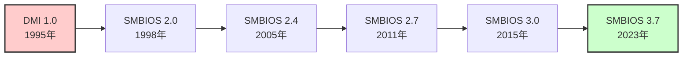

# SMBIOS と MP テーブルの役割

🎯 **この章で学ぶこと**
- SMBIOS（System Management BIOS）の目的と構造
- 主要な SMBIOS テーブルタイプ
- SMBIOS データの取得と活用
- MP（Multi-Processor）テーブルの役割（レガシー）
- SMBIOS テーブルの作成方法

📚 **前提知識**
- [Part III: ACPI テーブルの役割](./07-acpi-tables.md)
- ファームウェアテーブルの基本概念
- 文字列エンコーディング（ASCII, UTF-8）

---

## SMBIOS とは何か

**SMBIOS（System Management BIOS）** は、ハードウェアの構成情報を OS やツールに提供するための標準規格です。

### SMBIOS の歴史



**SMBIOS の目的：**
- ハードウェアインベントリの提供（CPU、メモリ、BIOS など）
- 管理ツールでの資産管理
- OS のハードウェア認識支援
- 診断ツールでの情報収集

### SMBIOS の用途

| カテゴリ | 情報 | 例 |
|---------|------|-----|
| **システム情報** | メーカー、モデル、シリアル番号 | Dell OptiPlex 9020, S/N: ABC123 |
| **BIOS 情報** | ベンダ、バージョン、リリース日 | American Megatrends, v1.0, 2023/01/15 |
| **プロセッサ** | CPU 種類、周波数、コア数 | Intel Core i7-13700K, 3.4GHz, 16 cores |
| **メモリ** | サイズ、速度、メーカー | 16GB DDR4-3200, Samsung |
| **マザーボード** | メーカー、モデル、BIOS バージョン | ASUS ROG MAXIMUS Z790 |
| **デバイス** | ディスク、ネットワーク、ポート | NVMe SSD 1TB, Intel I219-V NIC |

---

## SMBIOS のアーキテクチャ

### SMBIOS Entry Point

SMBIOS データは **Entry Point Structure** から始まります。SMBIOS 2.x と 3.x で異なる形式を使用します。

**SMBIOS 2.x Entry Point (32-bit)**

```c
typedef struct {
  UINT8   AnchorString[4];          // "_SM_"
  UINT8   EntryPointStructureChecksum;
  UINT8   EntryPointLength;         // 0x1F (31 bytes)
  UINT8   MajorVersion;
  UINT8   MinorVersion;
  UINT16  MaxStructureSize;
  UINT8   EntryPointRevision;
  UINT8   FormattedArea[5];
  UINT8   IntermediateAnchorString[5];  // "_DMI_"
  UINT8   IntermediateChecksum;
  UINT16  TableLength;
  UINT32  TableAddress;             // SMBIOS テーブルの物理アドレス
  UINT16  NumberOfSmbiosStructures;
  UINT8   SmbiosBcdRevision;
} SMBIOS_TABLE_ENTRY_POINT;
```

**SMBIOS 3.x Entry Point (64-bit)**

```c
typedef struct {
  UINT8   AnchorString[5];          // "_SM3_"
  UINT8   EntryPointStructureChecksum;
  UINT8   EntryPointLength;         // 0x18 (24 bytes)
  UINT8   MajorVersion;
  UINT8   MinorVersion;
  UINT8   DocRev;
  UINT8   EntryPointRevision;       // 0x01
  UINT8   Reserved;
  UINT32  TableMaximumSize;
  UINT64  TableAddress;             // SMBIOS テーブルの物理アドレス (64-bit)
} SMBIOS_TABLE_3_0_ENTRY_POINT;
```

### UEFI での SMBIOS Entry Point 取得

```c
/**
  SMBIOS Entry Point を検索

  @retval SMBIOS Entry Point アドレス
**/
VOID *
FindSmbiosEntryPoint (
  VOID
  )
{
  EFI_CONFIGURATION_TABLE  *ConfigTable;
  UINTN                    Index;

  ConfigTable = gST->ConfigurationTable;

  for (Index = 0; Index < gST->NumberOfTableEntries; Index++) {
    // SMBIOS 3.0 (64-bit)
    if (CompareGuid (&ConfigTable[Index].VendorGuid, &gEfiSmbios3TableGuid)) {
      return ConfigTable[Index].VendorTable;
    }
    // SMBIOS 2.x (32-bit)
    if (CompareGuid (&ConfigTable[Index].VendorGuid, &gEfiSmbiosTableGuid)) {
      return ConfigTable[Index].VendorTable;
    }
  }

  return NULL;
}
```

---

## SMBIOS テーブル構造

### Structure Header

すべての SMBIOS 構造体は共通のヘッダを持ちます。

```c
typedef struct {
  UINT8   Type;         // テーブルタイプ
  UINT8   Length;       // フォーマット部分のサイズ
  UINT16  Handle;       // 一意なハンドル
  // 以降、タイプ固有のデータ
  // さらに以降、NULL 終端文字列の配列
} SMBIOS_STRUCTURE;
```

### 文字列の格納方法

SMBIOS では、可変長文字列は構造体の後に NULL 終端文字列として格納されます。

```
[Structure Header]
[Formatted Area (Type-specific data)]
[String 1]\0
[String 2]\0
[String 3]\0
\0  ← 文字列セクションの終端（ダブル NULL）
```

**例：Type 0 (BIOS Information)**

```
Offset  Data
0x00    00             ← Type: 0 (BIOS Information)
0x01    18             ← Length: 24 bytes
0x02    00 01          ← Handle: 0x0100
0x04    01             ← Vendor: String 1
0x05    02             ← BIOS Version: String 2
0x06    E8 00          ← BIOS Starting Segment: 0x00E8
0x08    03             ← BIOS Release Date: String 3
...
0x18    "American Megatrends\0"   ← String 1
        "1.0.0\0"                 ← String 2
        "2023/01/15\0"            ← String 3
        \0                        ← End of strings
```

---

## 主要な SMBIOS テーブルタイプ

### Type 0: BIOS Information

```c
typedef struct {
  SMBIOS_STRUCTURE  Hdr;           // Type = 0
  UINT8  Vendor;                   // String
  UINT8  BiosVersion;              // String
  UINT16 BiosSegment;              // BIOS Starting Address Segment
  UINT8  BiosReleaseDate;          // String
  UINT8  BiosSize;                 // (n + 1) * 64KB
  UINT64 BiosCharacteristics;      // BIOS Characteristics
  UINT8  BIOSCharacteristicsExtensionBytes[2];
  UINT8  SystemBiosMajorRelease;
  UINT8  SystemBiosMinorRelease;
  UINT8  EmbeddedControllerFirmwareMajorRelease;
  UINT8  EmbeddedControllerFirmwareMinorRelease;
  UINT16 ExtendedBiosSize;         // Extended BIOS Size (unit: MB or GB)
} SMBIOS_TABLE_TYPE0;
```

**例：**

```c
SMBIOS_TABLE_TYPE0 Type0 = {
  .Hdr = {
    .Type = 0,
    .Length = sizeof (SMBIOS_TABLE_TYPE0),
    .Handle = 0x0000
  },
  .Vendor = 1,                     // String 1: "American Megatrends"
  .BiosVersion = 2,                // String 2: "1.0.0"
  .BiosSegment = 0xE800,           // 0xE8000
  .BiosReleaseDate = 3,            // String 3: "2023/01/15"
  .BiosSize = 127,                 // (127+1) * 64KB = 8MB
  .BiosCharacteristics = 0x0B,     // PCI, Plug and Play, ...
  .SystemBiosMajorRelease = 1,
  .SystemBiosMinorRelease = 0
};
// Strings: "American Megatrends\0" "1.0.0\0" "2023/01/15\0\0"
```

### Type 1: System Information

```c
typedef struct {
  SMBIOS_STRUCTURE  Hdr;           // Type = 1
  UINT8  Manufacturer;             // String
  UINT8  ProductName;              // String
  UINT8  Version;                  // String
  UINT8  SerialNumber;             // String
  UINT8  Uuid[16];                 // Universal Unique ID
  UINT8  WakeUpType;               // Wake-up Type
  UINT8  SKUNumber;                // String
  UINT8  Family;                   // String
} SMBIOS_TABLE_TYPE1;
```

### Type 2: Baseboard (Motherboard) Information

```c
typedef struct {
  SMBIOS_STRUCTURE  Hdr;           // Type = 2
  UINT8  Manufacturer;             // String
  UINT8  ProductName;              // String
  UINT8  Version;                  // String
  UINT8  SerialNumber;             // String
  UINT8  AssetTag;                 // String
  UINT8  FeatureFlag;              // Feature Flags
  UINT8  LocationInChassis;        // String
  UINT16 ChassisHandle;            // Chassis Handle
  UINT8  BoardType;                // Board Type
  UINT8  NumberOfContainedObjectHandles;
  UINT16 ContainedObjectHandles[1];
} SMBIOS_TABLE_TYPE2;
```

### Type 4: Processor Information

```c
typedef struct {
  SMBIOS_STRUCTURE  Hdr;           // Type = 4
  UINT8  Socket;                   // String
  UINT8  ProcessorType;            // CPU = 3
  UINT8  ProcessorFamily;          // Family (Intel, AMD, ...)
  UINT8  ProcessorManufacturer;    // String
  UINT64 ProcessorId;              // CPUID
  UINT8  ProcessorVersion;         // String
  UINT8  Voltage;                  // Voltage
  UINT16 ExternalClock;            // External Clock (MHz)
  UINT16 MaxSpeed;                 // Max Speed (MHz)
  UINT16 CurrentSpeed;             // Current Speed (MHz)
  UINT8  Status;                   // Status
  UINT8  ProcessorUpgrade;         // Upgrade
  UINT16 L1CacheHandle;            // Type 7 Handle
  UINT16 L2CacheHandle;            // Type 7 Handle
  UINT16 L3CacheHandle;            // Type 7 Handle
  UINT8  SerialNumber;             // String
  UINT8  AssetTag;                 // String
  UINT8  PartNumber;               // String
  UINT8  CoreCount;                // Core Count
  UINT8  EnabledCoreCount;         // Enabled Core Count
  UINT8  ThreadCount;              // Thread Count
  UINT16 ProcessorCharacteristics; // Characteristics
  UINT16 ProcessorFamily2;         // Extended Family
  UINT16 CoreCount2;               // Extended Core Count
  UINT16 EnabledCoreCount2;        // Extended Enabled Core Count
  UINT16 ThreadCount2;             // Extended Thread Count
} SMBIOS_TABLE_TYPE4;
```

### Type 17: Memory Device

```c
typedef struct {
  SMBIOS_STRUCTURE  Hdr;           // Type = 17
  UINT16 PhysicalMemoryArrayHandle; // Type 16 Handle
  UINT16 MemoryErrorInformationHandle;
  UINT16 TotalWidth;               // Total Width (bits)
  UINT16 DataWidth;                // Data Width (bits)
  UINT16 Size;                     // Size (MB, or see ExtendedSize)
  UINT8  FormFactor;               // DIMM = 9
  UINT8  DeviceSet;
  UINT8  DeviceLocator;            // String (e.g., "DIMM A1")
  UINT8  BankLocator;              // String
  UINT8  MemoryType;               // DDR4 = 26
  UINT16 TypeDetail;               // Type Detail
  UINT16 Speed;                    // Speed (MT/s)
  UINT8  Manufacturer;             // String
  UINT8  SerialNumber;             // String
  UINT8  AssetTag;                 // String
  UINT8  PartNumber;               // String
  UINT8  Attributes;               // Rank
  UINT32 ExtendedSize;             // Extended Size (MB)
  UINT16 ConfiguredMemorySpeed;    // Configured Speed (MT/s)
  UINT16 MinimumVoltage;           // Minimum Voltage (mV)
  UINT16 MaximumVoltage;           // Maximum Voltage (mV)
  UINT16 ConfiguredVoltage;        // Configured Voltage (mV)
  UINT8  MemoryTechnology;         // DRAM = 3
  UINT16 MemoryOperatingModeCapability;
  UINT8  FirmwareVersion;          // String
  UINT16 ModuleManufacturerId;
  UINT16 ModuleProductId;
  UINT16 MemorySubsystemControllerId;
  UINT16 MemorySubsystemControllerProductId;
  UINT64 NonVolatileSize;
  UINT64 VolatileSize;
  UINT64 CacheSize;
  UINT64 LogicalSize;
} SMBIOS_TABLE_TYPE17;
```

---

## SMBIOS データの取得

### Linux での SMBIOS 情報取得

```bash
# SMBIOS テーブルダンプ
sudo dmidecode

# 特定タイプのみ表示
sudo dmidecode -t 0    # BIOS Information
sudo dmidecode -t 1    # System Information
sudo dmidecode -t 4    # Processor Information
sudo dmidecode -t 17   # Memory Device
```

### UEFI アプリケーションでの SMBIOS 読み取り

```c
/**
  SMBIOS テーブルを列挙

  @param[in]  EntryPoint  SMBIOS Entry Point
**/
VOID
EnumerateSmbiosTables (
  IN SMBIOS_TABLE_ENTRY_POINT  *EntryPoint
  )
{
  UINT8               *TableAddress;
  UINT8               *TableEnd;
  SMBIOS_STRUCTURE    *Structure;
  UINT8               *StringPtr;
  UINTN               StringCount;

  TableAddress = (UINT8 *)(UINTN)EntryPoint->TableAddress;
  TableEnd = TableAddress + EntryPoint->TableLength;

  while (TableAddress < TableEnd) {
    Structure = (SMBIOS_STRUCTURE *)TableAddress;

    Print (L"Type %d, Length %d, Handle 0x%04X\n",
           Structure->Type,
           Structure->Length,
           Structure->Handle);

    // 文字列を列挙
    StringPtr = TableAddress + Structure->Length;
    StringCount = 1;
    while (*StringPtr != 0 || *(StringPtr + 1) != 0) {
      if (*StringPtr != 0) {
        Print (L"  String %d: %a\n", StringCount, StringPtr);
        StringCount++;
        while (*StringPtr != 0) {
          StringPtr++;
        }
      }
      StringPtr++;
    }

    // 次の構造体へ
    TableAddress = StringPtr + 2;  // ダブル NULL の後

    if (Structure->Type == 127) {
      break;  // End-of-Table
    }
  }
}
```

---

## EDK II での SMBIOS テーブル作成

### SMBIOS Protocol

```c
/**
  SMBIOS テーブルを追加

  @param[in]  SmbiosRecord  SMBIOS レコード

  @retval EFI_SUCCESS  成功
**/
EFI_STATUS
AddSmbiosRecord (
  IN VOID  *SmbiosRecord
  )
{
  EFI_SMBIOS_PROTOCOL  *Smbios;
  EFI_SMBIOS_HANDLE    SmbiosHandle;
  EFI_STATUS           Status;

  Status = gBS->LocateProtocol (
                  &gEfiSmbiosProtocolGuid,
                  NULL,
                  (VOID **)&Smbios
                  );
  if (EFI_ERROR (Status)) {
    return Status;
  }

  SmbiosHandle = SMBIOS_HANDLE_PI_RESERVED;  // 自動割り当て

  Status = Smbios->Add (
                     Smbios,
                     NULL,
                     &SmbiosHandle,
                     (EFI_SMBIOS_TABLE_HEADER *)SmbiosRecord
                     );

  return Status;
}
```

### Type 0 の作成例

```c
/**
  SMBIOS Type 0 (BIOS Information) を作成
**/
EFI_STATUS
CreateBiosInformation (
  VOID
  )
{
  UINT8  *Record;
  UINTN  RecordSize;
  CHAR8  *Strings;

  // 構造体 + 文字列領域
  RecordSize = sizeof (SMBIOS_TABLE_TYPE0) +
               AsciiStrSize ("American Megatrends") +
               AsciiStrSize ("1.0.0") +
               AsciiStrSize ("2023/01/15") +
               1;  // ダブル NULL

  Record = AllocateZeroPool (RecordSize);

  // 構造体設定
  SMBIOS_TABLE_TYPE0 *Type0 = (SMBIOS_TABLE_TYPE0 *)Record;
  Type0->Hdr.Type = 0;
  Type0->Hdr.Length = sizeof (SMBIOS_TABLE_TYPE0);
  Type0->Hdr.Handle = 0x0000;
  Type0->Vendor = 1;
  Type0->BiosVersion = 2;
  Type0->BiosSegment = 0xE800;
  Type0->BiosReleaseDate = 3;
  Type0->BiosSize = 127;
  Type0->BiosCharacteristics = 0x0B;
  Type0->SystemBiosMajorRelease = 1;
  Type0->SystemBiosMinorRelease = 0;

  // 文字列設定
  Strings = (CHAR8 *)(Record + sizeof (SMBIOS_TABLE_TYPE0));
  AsciiStrCpyS (Strings, RecordSize, "American Megatrends");
  Strings += AsciiStrSize ("American Megatrends");
  AsciiStrCpyS (Strings, RecordSize, "1.0.0");
  Strings += AsciiStrSize ("1.0.0");
  AsciiStrCpyS (Strings, RecordSize, "2023/01/15");
  Strings += AsciiStrSize ("2023/01/15");
  *Strings = 0;  // ダブル NULL

  AddSmbiosRecord (Record);
  FreePool (Record);

  return EFI_SUCCESS;
}
```

---

## MP（Multi-Processor）テーブル（レガシー）

**MP テーブル** は、Intel MultiProcessor Specification で定義された、マルチプロセッサシステムの構成情報です。**現在は ACPI MADT に置き換えられていますが**、レガシー OS（古い Linux カーネルなど）では使用されることがあります。

### MP Floating Pointer Structure

```c
typedef struct {
  UINT8   Signature[4];            // "_MP_"
  UINT32  PhysicalAddress;         // MP Configuration Table のアドレス
  UINT8   Length;                  // 1 (16 bytes)
  UINT8   SpecRev;                 // Specification Revision (4)
  UINT8   Checksum;
  UINT8   FeatureByte[5];
} MP_FLOATING_POINTER_STRUCTURE;
```

### MP Configuration Table Header

```c
typedef struct {
  UINT8   Signature[4];            // "PCMP"
  UINT16  BaseTableLength;
  UINT8   SpecRev;                 // 4
  UINT8   Checksum;
  UINT8   OemId[8];
  UINT8   ProductId[12];
  UINT32  OemTablePointer;
  UINT16  OemTableSize;
  UINT16  EntryCount;
  UINT32  LocalApicAddress;        // Local APIC MMIO アドレス
  UINT16  ExtendedTableLength;
  UINT8   ExtendedTableChecksum;
  UINT8   Reserved;
  // 以降、Entry が続く
} MP_CONFIGURATION_TABLE_HEADER;
```

**ACPI MADT との比較：**

| 項目 | MP テーブル | ACPI MADT |
|------|-----------|-----------|
| **サポート範囲** | x86 のみ | x86, ARM, RISC-V, ... |
| **割り込み設定** | 限定的 | 詳細（Polarity, Trigger Mode） |
| **現状** | レガシー、非推奨 | 標準 |

---

## 演習問題

### 基本演習

1. **SMBIOS Entry Point 検索**
   UEFI 環境で SMBIOS Entry Point を検索し、バージョン（Major/Minor）を表示するプログラムを作成してください。

2. **dmidecode 解析**
   Linux で `sudo dmidecode -t 4` を実行し、CPU 情報を確認してください。コア数、周波数、キャッシュサイズを記録してください。

### 応用演習

3. **Type 1 読み取り**
   SMBIOS Type 1 (System Information) を読み取り、メーカー、製品名、シリアル番号を表示するプログラムを作成してください。

4. **メモリ情報一覧**
   SMBIOS Type 17 (Memory Device) を列挙し、すべての DIMM のサイズ、速度、メーカーを表示するツールを作成してください。

### チャレンジ演習

5. **カスタム SMBIOS テーブル**
   独自の OEM-Specific Type (Type 128-255) を定義し、EDK II で SMBIOS テーブルに追加してください。

6. **SMBIOS → JSON 変換**
   SMBIOS テーブル全体を JSON 形式にエクスポートするツールを作成してください。

---

## まとめ

この章では、SMBIOS と MP テーブルの役割について学びました。

🔑 **重要なポイント：**

1. **SMBIOS の目的**
   - ハードウェアインベントリの標準化
   - OS・ツールへの情報提供
   - 資産管理・診断ツールでの活用

2. **SMBIOS 構造**
   - **Entry Point**: SMBIOS 2.x (32-bit) と 3.x (64-bit)
   - **Structure Header**: Type, Length, Handle
   - **文字列**: NULL 終端文字列の配列、ダブル NULL で終端

3. **主要テーブルタイプ**
   - **Type 0**: BIOS Information
   - **Type 1**: System Information
   - **Type 2**: Baseboard Information
   - **Type 4**: Processor Information
   - **Type 17**: Memory Device

4. **SMBIOS データ取得**
   - Linux: `dmidecode`
   - UEFI: EFI Configuration Table → Entry Point → テーブル列挙
   - EDK II: `EFI_SMBIOS_PROTOCOL` で追加

5. **MP テーブル（レガシー）**
   - MultiProcessor Specification で定義
   - ACPI MADT に置き換えられた
   - レガシー OS のみで使用

**次章では、Part III のまとめを行います。**

---

📚 **参考資料**
- [DMTF SMBIOS Specification](https://www.dmtf.org/standards/smbios) - SMBIOS 公式仕様書
- [dmidecode Tool](https://www.nongnu.org/dmidecode/) - SMBIOS デコードツール
- [EDK II SMBIOS Module](https://github.com/tianocore/edk2/tree/master/MdeModulePkg/Universal/SmbiosDxe) - EDK II の SMBIOS 実装
- [Intel MultiProcessor Specification](https://pdos.csail.mit.edu/6.828/2008/readings/ia32/MPspec.pdf) - MP テーブル仕様（レガシー）
- [SMBIOS Reference Specification](https://www.dmtf.org/sites/default/files/standards/documents/DSP0134_3.7.0.pdf) - SMBIOS 3.7.0 仕様書
