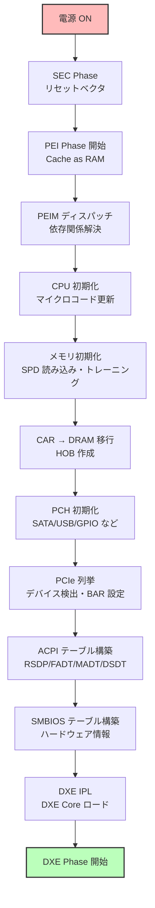

# Part III まとめ

Part III では、**プラットフォーム初期化の原理**について学びました。プラットフォーム初期化とは、システムの電源が投入されてから OS が起動するまでの間に、ファームウェアが実行する一連の初期化処理を指します。この初期化プロセスは、CPU、メモリ、チップセット、周辺デバイス、割り込みコントローラなど、システムの主要なハードウェアコンポーネントを検出、設定、有効化し、OS が実行可能な環境を構築する責任を持ちます。Part III では、PEI（Pre-EFI Initialization）フェーズにおけるメモリが利用可能になる前の極限環境での動作から、DRAM 初期化、CPU とチップセットの設定、PCH/SoC サブシステムの有効化、PCIe デバイスの列挙、そして最終的に OS に情報を提供する ACPI テーブルと SMBIOS テーブルの構築まで、プラットフォーム初期化の全体像を詳細に学びました。

プラットフォーム初期化は、ファームウェア開発において最も複雑かつ重要な領域の一つです。なぜなら、この段階で行われる設定は、システムの安定性、パフォーマンス、電力効率、セキュリティに直接影響を与えるからです。例えば、DRAM 初期化が正しく行われなければ、システムは起動せず、あるいは不安定な動作を示します。CPU の初期化が不完全であれば、マルチコアの性能を引き出せず、セキュリティ機能も有効化されません。PCIe デバイスの列挙が失敗すれば、GPU、NVMe SSD、ネットワークカードなどの重要なデバイスが使用できなくなります。ACPI テーブルが誤って構築されれば、OS は電源管理を正しく行えず、バッテリ駆動時間やサーマル管理に問題が生じます。したがって、プラットフォーム初期化の原理を理解することは、ファームウェア開発者にとって不可欠な知識となります。

この章では、Part III で扱った8つの章の内容を振り返り、重要なポイントを整理し、各章がどのように関連し合ってプラットフォーム初期化の全体像を形成するかを理解します。また、Intel と AMD のプラットフォームの違い、実装のベストプラクティス、トラブルシューティングの方法についても総括します。

---

## Part III で学んだこと

Part III では、以下の8つのトピックについて、詳細な技術的内容と実装例を通じて学びました：

1. **PEI フェーズの役割と構造** - メモリが利用可能になる前の極限環境での初期化
2. **DRAM 初期化の仕組み** - DDR4/DDR5 メモリの検出、トレーニング、有効化
3. **CPU とチップセット初期化** - マイクロコード更新、キャッシュ設定、マルチコア起動
4. **PCH/SoC の役割と初期化** - I/O コントローラサブシステムの有効化
5. **PCIe の仕組みとデバイス列挙** - 高速シリアルインターフェースの検出と設定
6. **ACPI の目的と構造** - OS 主導の電源管理とデバイス設定の基盤
7. **ACPI テーブルの役割** - FADT、MADT、MCFG などの詳細構造
8. **SMBIOS と MP テーブルの役割** - ハードウェアインベントリ情報の提供

---

## 章ごとの要約

### 第1章: PEI フェーズの役割と構造

**PEI（Pre-EFI Initialization）Phase** は、ファームウェア起動の初期段階で、メモリが利用可能になる前の環境で動作します。

🔑 **重要ポイント：**
- **Cache as RAM (CAR)**: DRAM 初期化前は CPU キャッシュを RAM として使用
- **PEIM (PEI Module)**: PEI フェーズで実行されるモジュール
- **PPI (PEIM-to-PEIM Interface)**: PEIM 間の軽量プロトコル
- **HOB (Hand-Off Block)**: PEI から DXE へ情報を渡すデータ構造
- **DXE IPL**: DXE Core をロードして起動する特殊な PEIM

**主な流れ：**
```
SEC → PEI Core 起動 → PEIM ディスパッチ → メモリ初期化 → HOB 構築 → DXE IPL → DXE Core
```

---

### 第2章: DRAM 初期化の仕組み

**DRAM 初期化** は、ファームウェア起動の最も複雑かつ重要なタスクの一つです。

🔑 **重要ポイント：**
- **DRAM 階層**: DIMM → Rank → Chip → Bank → Row/Column
- **SPD (Serial Presence Detect)**: DIMM 上の EEPROM から構成情報を取得
- **メモリトレーニング**: Write Leveling, Read Leveling, Vref Training で最適なタイミングを決定
- **FSP (Firmware Support Package)**: Intel が提供するバイナリ形式の初期化コード
- **MTRR (Memory Type Range Register)**: メモリ領域のキャッシュポリシーを設定

**DDR4 vs DDR5:**

| 項目 | DDR4 | DDR5 |
|------|------|------|
| データレート | 1600-3200 MT/s | 4800-8400 MT/s |
| 電圧 | 1.2V | 1.1V |
| Bank Group | 4 BG | 8 BG |
| ECC | オプション | オンダイ ECC 標準 |

---

### 第3章: CPU とチップセット初期化

**CPU とチップセット** の初期化は、システムの計算能力と周辺機能を有効化します。

🔑 **重要ポイント：**
- **マイクロコード更新**: MSR 0x79 に書き込み、CPU のバグ修正・機能追加
- **キャッシュ初期化**: CR0 の CD/NW ビット、MTRR 設定
- **BSP vs AP**: Bootstrap Processor と Application Processor
- **INIT-SIPI-SIPI**: AP を起動するシーケンス
- **DMI (Direct Media Interface)**: CPU と PCH を接続するリンク
- **GPIO**: 汎用入出力ピン、電源制御・LED・ボタンなどに使用

**MTRR の主なタイプ：**
- **UC (Uncacheable)**: デバイス MMIO
- **WB (Write-Back)**: RAM（最高性能）
- **WT (Write-Through)**: キャッシュ書き込みは即座にメモリへ
- **WC (Write-Combining)**: ビデオメモリ

---

### 第4章: PCH/SoC の役割と初期化

**PCH (Platform Controller Hub)** は、I/O コントローラの中核で、USB、SATA、LPC などを統合します。

🔑 **重要ポイント：**
- **PCH サブシステム**: SATA, USB (xHCI), LPC/eSPI, SMBus, GPIO
- **ストラップ設定**: SPI Flash から起動時設定を読み込み
- **AHCI vs RAID**: SATA コントローラのモード
- **LPC vs eSPI**: レガシーデバイス接続（eSPI はピン数削減、高速化）
- **ディスクリート PCH vs SoC 統合**: 従来は別チップ、最新は CPU に統合

**主要サブシステムの初期化順序：**
1. ストラップ読み込み
2. クロック設定
3. 電源管理設定
4. SATA, USB, LPC, GPIO 初期化

---

### 第5章: PCIe の仕組みとデバイス列挙

**PCIe (PCI Express)** は、現代の標準的な高速シリアルインターフェースです。

🔑 **重要ポイント：**
- **3層構造**: 物理層 → データリンク層 → トランザクション層
- **ツリー型トポロジ**: Root Complex → Switch → Endpoint
- **リンクトレーニング**: Detect → Polling → Configuration → L0
- **MMCONFIG**: メモリマップドコンフィギュレーション空間（4KB/デバイス）
- **デバイス列挙**: Vendor ID 読み込み → BAR 設定 → ブリッジは再帰的にサブバス列挙
- **MSI/MSI-X**: メモリ書き込みで割り込み通知、レガシー INTx より高速

**PCIe 世代別スループット（x16 レーン）：**

| 世代 | 転送速度 | x16 スループット | エンコーディング |
|------|---------|----------------|----------------|
| PCIe 3.0 | 8.0 GT/s | 15.75 GB/s | 128b/130b |
| PCIe 4.0 | 16.0 GT/s | 31.5 GB/s | 128b/130b |
| PCIe 5.0 | 32.0 GT/s | 63 GB/s | 128b/130b |
| PCIe 6.0 | 64.0 GT/s | 126 GB/s | PAM4 |

---

### 第6章: ACPI の目的と構造

**ACPI (Advanced Configuration and Power Interface)** は、OS 主導の電源管理・デバイス設定のための標準規格です。

🔑 **重要ポイント：**
- **OS Directed Power Management**: OS がハードウェアを完全制御
- **ACPI テーブル**: UEFI/BIOS が提供する静的情報
- **ACPI Namespace**: OS が構築する階層的デバイスツリー
- **AML (ACPI Machine Language)**: DSDT/SSDT に格納されるバイトコード
- **電源状態**: S-State (システム), D-State (デバイス), C-State (CPU)
- **テーブル発見**: RSDP → XSDT → FADT/MADT/DSDT...

**主要電源状態：**
- **S0**: 動作中
- **S3**: Suspend to RAM（メモリのみ通電）
- **S4**: Hibernate（ディスクに保存、電源 OFF）
- **S5**: Soft Off

---

### 第7章: ACPI テーブルの役割

Part III では、主要な ACPI テーブルの詳細構造を学びました。

🔑 **重要テーブル：**

**FADT (Fixed ACPI Description Table)**
- ACPI の中核テーブル
- PM レジスタ、GPE レジスタのアドレス
- DSDT へのポインタ
- 電源プロファイル（Desktop, Mobile, Server など）

**MADT (Multiple APIC Description Table)**
- 割り込みコントローラの構成
- Local APIC, I/O APIC
- IRQ → GSI マッピング（Interrupt Source Override）

**MCFG (Memory Mapped Configuration Table)**
- PCIe MMCONFIG ベースアドレス
- セグメント、バス範囲の指定

**その他重要テーブル:**
- **HPET**: 高精度タイマ
- **SRAT/SLIT**: NUMA 構成とレイテンシ
- **BGRT**: ブートロゴ画像

---

### 第8章: SMBIOS と MP テーブルの役割

**SMBIOS (System Management BIOS)** は、ハードウェアインベントリを提供します。

🔑 **重要ポイント：**
- **Entry Point**: SMBIOS 2.x (32-bit) と 3.x (64-bit)
- **Structure Header**: Type, Length, Handle
- **文字列**: NULL 終端文字列の配列、ダブル NULL で終端

**主要テーブルタイプ:**
- **Type 0**: BIOS Information
- **Type 1**: System Information
- **Type 4**: Processor Information
- **Type 17**: Memory Device

**MP テーブル（レガシー）:**
- Intel MultiProcessor Specification
- ACPI MADT に置き換えられた
- レガシー OS のみで使用

---

## プラットフォーム初期化の全体像

以下は、プラットフォーム初期化の全体的な流れです：



**各フェーズの責任：**

| フェーズ | 主な役割 | 利用可能リソース |
|---------|---------|-----------------|
| **SEC** | セキュリティ確認、初期化 | CPU キャッシュのみ |
| **PEI** | プラットフォーム初期化 | CAR → DRAM（後半） |
| **DXE** | デバイスドライバロード | 完全な DRAM、すべてのデバイス |
| **BDS** | ブートデバイス選択 | 完全な環境 |

---

## ファームウェアテーブルの役割

Part III で学んだ主要なファームウェアテーブルとその役割：

| テーブル | 目的 | 提供者 | 使用者 |
|---------|------|--------|--------|
| **ACPI** | 電源管理・デバイス設定 | UEFI/BIOS | OS |
| **SMBIOS** | ハードウェアインベントリ | UEFI/BIOS | OS, 管理ツール |
| **UEFI 変数** | 設定保存 | UEFI/BIOS | OS, UEFI アプリ |
| **Device Tree** | デバイス階層（ARM/RISC-V） | ファームウェア | Linux カーネル |

---

## Intel vs AMD の違い

Part III で扱ったトピックにおける Intel と AMD の違い：

| 項目 | Intel | AMD |
|------|-------|-----|
| **初期化抽象化** | FSP (Firmware Support Package) | AGESA |
| **PCH 相当** | PCH (Platform Controller Hub) | FCH (Fusion Controller Hub) |
| **CPU-PCH 接続** | DMI (Direct Media Interface) | FCH Link |
| **メモリコントローラ** | CPU 内蔵 | CPU 内蔵（Zen 以降） |

---

## 実装のベストプラクティス

Part III で学んだことを実装する際のベストプラクティス：

### 1. エラーハンドリング

```c
// 良い例
Status = InitializeMemory ();
if (EFI_ERROR (Status)) {
  DEBUG ((DEBUG_ERROR, "Memory init failed: %r\n", Status));
  return Status;
}

// 悪い例
InitializeMemory ();  // エラーチェックなし
```

### 2. ACPI テーブルのチェックサム

```c
// 必ずチェックサムを計算
Header->Checksum = 0;
Header->Checksum = CalculateChecksum8 ((UINT8 *)Table, Header->Length);
```

### 3. SMBIOS 文字列の終端

```c
// 文字列領域の終端は必ずダブル NULL
Strings = (CHAR8 *)(Record + sizeof (SMBIOS_TABLE_TYPE0));
AsciiStrCpyS (Strings, Size, "Vendor");
Strings += AsciiStrSize ("Vendor");
*Strings = 0;  // ダブル NULL
```

### 4. PCIe デバイス列挙の再帰

```c
// ブリッジは再帰的に処理
if ((HeaderType & 0x7F) == 0x01) {
  // Type 1: PCI-to-PCI Bridge
  EnumerateBridge (Bus, Device, Function);  // 再帰
}
```

---

## トラブルシューティング

Part III で扱った内容に関する一般的な問題と解決策：

### メモリ初期化失敗

**症状**: システムが POST 途中で停止

**原因**:
- SPD 読み込み失敗
- メモリトレーニング失敗
- 互換性のない DIMM

**解決策**:
- デバッグログで SPD データを確認
- トレーニングパラメータを緩和
- DIMM の互換性リストを確認

### PCIe デバイスが認識されない

**症状**: OS でデバイスが見えない

**原因**:
- リンクトレーニング失敗
- BAR 設定の誤り
- MMCONFIG 設定の誤り

**解決策**:
- リンク状態を PCIe Capability で確認
- BAR サイズ計算のデバッグ
- MCFG テーブルのアドレス確認

### ACPI エラー

**症状**: OS が ACPI エラーを報告

**原因**:
- チェックサム不一致
- AML 構文エラー
- 無効なテーブルポインタ

**解決策**:
- `acpidump` と `iasl -d` でテーブルをデコード
- チェックサムを再計算
- ASL をコンパイルして構文チェック

---

## 次のステップ

Part III を完了したあなたは、プラットフォーム初期化の原理を理解しました。

**習得したスキル:**
✅ PEI フェーズの動作原理
✅ メモリ初期化の仕組み
✅ PCIe デバイスの列挙方法
✅ ACPI テーブルの構造と作成
✅ SMBIOS によるハードウェア情報提供

**Part IV では、さらに深く学びます:**
- Secure Boot の実装
- TPM (Trusted Platform Module)
- ファームウェア更新の仕組み
- セキュリティ脆弱性と対策

---

## 参考資料の再確認

Part III で参照した主要な仕様書：

1. **UEFI Specification**
   - https://uefi.org/specifications
   - PI (Platform Initialization) Specification も参照

2. **ACPI Specification**
   - https://uefi.org/specifications
   - ACPI 6.5 以降を推奨

3. **Intel SDM (Software Developer's Manual)**
   - https://www.intel.com/sdm
   - Volume 3: System Programming Guide

4. **PCI Express Base Specification**
   - https://pcisig.com/specifications

5. **SMBIOS Specification**
   - https://www.dmtf.org/standards/smbios

6. **EDK II Documentation**
   - https://github.com/tianocore/tianocore.github.io/wiki

---

## 総括

Part III では、**プラットフォーム初期化の原理**について、PEI フェーズから ACPI/SMBIOS テーブル構築まで、幅広く学びました。プラットフォーム初期化は、ファームウェア開発における最も複雑かつ重要な領域であり、システムの安定性、パフォーマンス、電力効率、セキュリティのすべてに影響を与えます。この Part で学んだ知識は、実務でファームウェア開発者として直面する課題を解決するための基礎となり、デバッグ、最適化、トラブルシューティングのあらゆる場面で活用できます。

プラットフォーム初期化の全体像を理解する上で**重要なのは**、各コンポーネントがどのように連携して動作するかを把握することです。まず、**プラットフォームごとの違いを理解すること**が必要です。Intel プラットフォームでは FSP（Firmware Support Package）と PCH（Platform Controller Hub）、AMD プラットフォームでは AGESA と FCH（Fusion Controller Hub）が使用され、CPU-チップセット間の接続も DMI と FCH Link で異なります。また、ARM プラットフォームでは Device Tree が ACPI の代わりに、あるいは補完的に使用され、割り込みコントローラも GIC（Generic Interrupt Controller）が使用されます。これらの違いを理解することで、異なるプラットフォームへの移植や、ベンダー固有の問題のトラブルシューティングが可能になります。

次に、**仕様書を参照しながら実装すること**が不可欠です。UEFI Specification、PI（Platform Initialization）Specification、ACPI Specification、PCIe Base Specification、SMBIOS Specification、Intel SDM、AMD Programmer's Manual など、各仕様書は数千ページに及び、詳細な要件、レジスタ定義、動作シーケンス、エラー処理方法が記載されています。仕様書を読むことは時間がかかりますが、正確で堅牢なファームウェアを実装するためには避けて通れません。仕様書に基づいて実装することで、互換性の問題を回避し、将来的な拡張や変更にも柔軟に対応できます。

さらに、**デバッグツールを活用すること**が、実装とトラブルシューティングの効率を大幅に向上させます。Linux では、`acpidump` と `iasl -d` で ACPI テーブルをダンプして逆アセンブルし、テーブルの内容を検証できます。`dmidecode` は SMBIOS テーブルを表示し、ハードウェアインベントリ情報が正しく記録されているかを確認できます。`lspci -vvv` は PCIe デバイスの詳細情報（Vendor ID、Device ID、BAR、Capability、Link Status など）を表示し、デバイス列挙の問題を診断できます。`dmesg | grep -i acpi` や `dmesg | grep -i pci` は、OS がファームウェアから受け取った情報をどのように解釈したかを示し、ファームウェアと OS の間のミスマッチを発見できます。EDK II のデバッグビルドでは、`DEBUG ((DEBUG_INFO, "..."))`、`DEBUG ((DEBUG_ERROR, "..."))` を使用して詳細なログを出力し、JTAG デバッガや gdb を接続してステップ実行、ブレークポイント設定、レジスタ検査を行うこともできます。これらのツールを使いこなすことで、問題の原因を迅速に特定し、修正できます。

Part III で学んだ知識を基に、あなたは以下のスキルを習得しました。まず、**PEI フェーズの動作原理**を理解し、Cache as RAM（CAR）を使用してメモリが利用可能になる前に初期化を実行する仕組み、PEIM（PEI Module）のディスパッチと依存関係解決、PPI（PEIM-to-PEIM Interface）を使用したモジュール間通信、HOB（Hand-Off Block）を使用した PEI から DXE への情報伝達、そして DXE IPL による DXE Core のロードを理解しました。次に、**メモリ初期化の仕組み**を学び、SPD（Serial Presence Detect）から DIMM の情報を読み取り、メモリトレーニング（Write Leveling、Read Leveling、Vref Training）で最適なタイミングを決定し、MTRR（Memory Type Range Register）でキャッシュポリシーを設定する方法を習得しました。**PCIe デバイスの列挙方法**では、Root Complex から始まるツリー型トポロジを走査し、Vendor ID を読み取ってデバイスを検出し、BAR（Base Address Register）を設定してメモリマップ I/O 空間を割り当て、ブリッジを再帰的に処理する方法を学びました。**ACPI テーブルの構造と作成**では、RSDP → XSDT → FADT/MADT/DSDT/MCFG の階層構造を理解し、EDK II の ACPI Table Protocol を使用してテーブルをインストールし、チェックサムを計算して OS に提供する方法を習得しました。最後に、**SMBIOS によるハードウェア情報提供**では、Entry Point Structure を EFI Configuration Table に登録し、Type 0（BIOS Information）、Type 1（System Information）、Type 4（Processor Information）、Type 17（Memory Device）などのテーブルを構築し、NULL 終端文字列をダブル NULL で終端する方法を学びました。

Part IV では、**セキュリティアーキテクチャ**について学びます。現代のファームウェアは、単にハードウェアを初期化するだけでなく、セキュアな起動環境を提供し、不正なコードの実行を防ぎ、ユーザーデータを保護する責任があります。Part IV では、Secure Boot（UEFI 変数と署名検証による安全な OS ロード）、TPM（Trusted Platform Module による信頼チェーンの構築）、Measured Boot（ブートコンポーネントの測定とログ記録）、ファームウェア更新の仕組み（カプセル更新と A/B パーティション）、そしてセキュリティ脆弱性と対策（SpectreSMM、BootHole など）について学びます。これらの知識により、セキュアで信頼性の高いファームウェアを開発できるようになります。

---

**Part III 完了おめでとうございます！ 🎉**

プラットフォーム初期化の原理を習得したあなたは、ファームウェア開発の中核的な知識を身につけました。次は [Part IV: セキュリティアーキテクチャ](../part4/01-secure-boot-overview.md) に進み、Secure Boot、TPM、ファームウェア更新など、現代のファームウェアに不可欠なセキュリティ機能を学びましょう。
