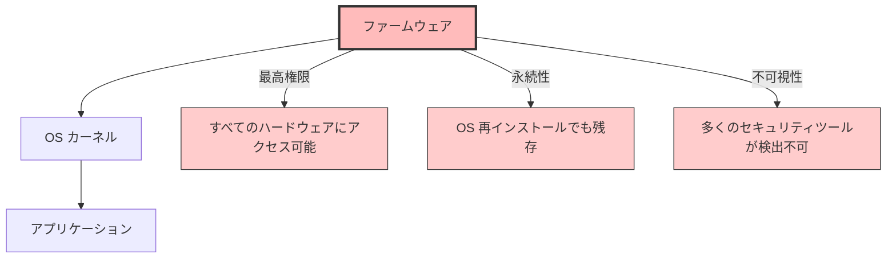
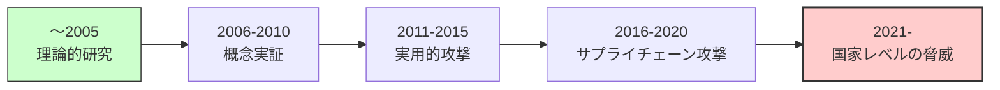
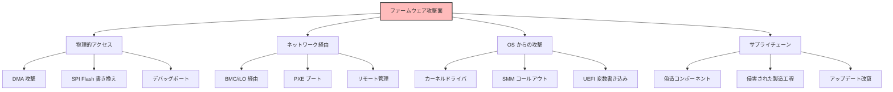
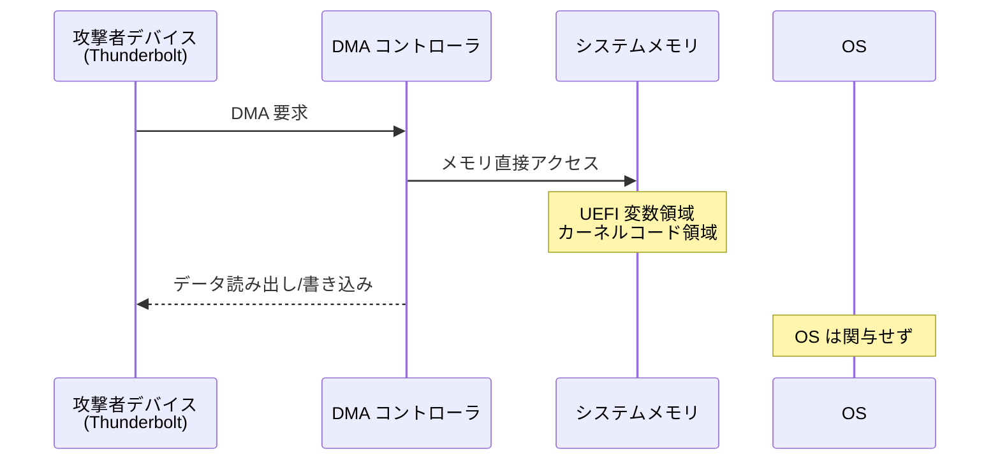
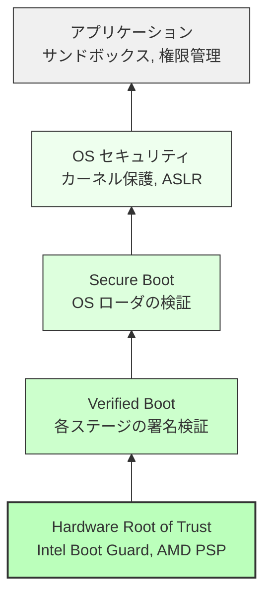
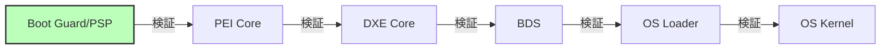

# ファームウェアセキュリティの全体像

🎯 **この章で学ぶこと**
- ファームウェアがセキュリティで重要な理由
- ファームウェアに対する脅威モデル
- 主要な攻撃手法と攻撃面
- ファームウェアセキュリティの防御層
- セキュリティ関連技術の全体像

📚 **前提知識**
- [Part III: プラットフォーム初期化の原理](../part3/09-part3-summary.md)
- ブートプロセスの基礎
- x86_64 アーキテクチャの基本

---

## ファームウェアセキュリティの重要性

**ファームウェア**は、システムの最も低レベルで動作するソフトウェアであり、セキュリティの**信頼の起点（Root of Trust）**となります。ファームウェアは、電源が投入された直後から実行を開始し、CPU、メモリ、チップセット、周辺デバイスなど、すべてのハードウェアコンポーネントを初期化し、OS が起動できる環境を構築します。この初期化プロセスで、ファームウェアは**最高権限**でシステムのあらゆるリソースにアクセスでき、OS やハイパーバイザよりも上位の特権レベルで動作します。したがって、ファームウェアが侵害されると、その上で動作するすべてのソフトウェア（OS、アプリケーション、セキュリティツール）が信頼できなくなり、システム全体のセキュリティが崩壊します。

ファームウェアがセキュリティ攻撃の標的として魅力的な理由は、その**特殊な特性**にあります。まず、ファームウェアは **SMM（System Management Mode）** という Ring -2 相当の最高権限で動作する部分を含んでおり、OS やハイパーバイザ（Ring -1）よりも高い権限を持ちます。この権限により、ファームウェア攻撃者は、OS のメモリを直接読み書きし、カーネルのセキュリティ機構を迂回し、ハードウェアレベルでシステムを完全に制御できます。次に、ファームウェアは **SPI Flash** という不揮発性メモリに保存されており、**永続性**を持ちます。OS を再インストールしても、ディスクを完全に消去しても、ファームウェアは SPI Flash に残り続けるため、ファームウェアレベルの rootkit は除去が非常に困難です。さらに、ファームウェアは OS が起動する前に実行されるため、**不可視性**が高く、多くのアンチウイルスソフトウェアやセキュリティツールはファームウェアを検査できません。OS が起動した時点で、ファームウェアは既に実行を完了しており、悪意のあるコードが仕込まれていても検出が困難です。最後に、ファームウェアは通常**バイナリ形式**でのみ提供され、ソースコードは非公開であるため、**検証が困難**です。セキュリティ研究者がファームウェアの脆弱性を調査するには、リバースエンジニアリングが必要であり、時間とコストがかかります。

ファームウェア攻撃の歴史は、理論的研究から実用的な脅威へと進化してきました。**～2005年**は、主に学術研究の段階であり、BIOS rootkit の理論的な可能性が議論されていました。この時期には、攻撃の概念は存在していましたが、実際の攻撃は稀でした。**2006-2010年**には、研究者が概念実証（PoC: Proof of Concept）を発表し始め、ファームウェア攻撃が技術的に実現可能であることが示されました。例えば、2006年の Black Hat で発表された BIOS rootkit の PoC は、ファームウェアレベルでの持続的な侵害の可能性を実証しました。**2011-2015年**には、実用的な攻撃ツールが登場し、APT（Advanced Persistent Threat）グループがファームウェア攻撃を実際の諜報活動で使用し始めました。2015年には、世界初の野生で発見された UEFI rootkit である **"LoJax"** が発見され、ファームウェア攻撃が現実の脅威となりました。**2016-2020年**には、サプライチェーン攻撃が顕在化し、製造過程でファームウェアに悪意のあるコードが埋め込まれる事例が報告されました。また、2018年の **"ThinkPwn"** は SMM（System Management Mode）の脆弱性を悪用して特権昇格を実現し、2019年の **"Plundervolt"** は電圧制御を悪用して Intel SGX（Software Guard Extensions）の Enclave を侵害しました。2020年には、**"BootHole"** という Grub2 ブートローダの脆弱性が発見され、Secure Boot を迂回する攻撃が可能となり、数百万台のシステムが影響を受けました。**2021年以降**は、国家レベルの脅威が増加し、サイバー戦争やサイバースパイ活動の文脈でファームウェア攻撃が使用されるようになりました。2022年の **"LogoFAIL"** は、UEFI ファームウェアのロゴ画像パーサに存在する脆弱性を悪用し、悪意のあるロゴ画像をブート時にロードすることで、任意のコードを実行できることが示されました。

したがって、ファームウェアセキュリティは、現代のサイバーセキュリティにおいて最も重要な領域の一つとなっており、組織やベンダーは、ファームウェアを保護するための技術と戦略を導入することが不可欠です。ファームウェアの侵害は、システム全体のセキュリティを崩壊させ、データの窃取、システムの破壊、持続的な監視など、深刻な影響をもたらすため、Hardware Root of Trust、Secure Boot、Measured Boot、ファームウェア更新の保護など、多層的な防御機構を実装する必要があります。

### 補足図: ファームウェアの特権レベルと影響範囲



### 参考表: ファームウェア攻撃の特徴

| 特徴 | 説明 | 影響 |
|------|------|------|
| **最高権限** | SMM (System Management Mode) は Ring -2 相当 | OS やハイパーバイザより高い権限 |
| **永続性** | SPI Flash に保存 | OS 再インストールでも除去困難 |
| **不可視性** | 起動前に実行 | 多くのアンチウイルスが検出不可 |
| **検証困難** | バイナリのみ、ソース非公開 | リバースエンジニアリングが必要 |

### 補足図: ファームウェア攻撃の歴史的進化



### 参考: 主要なファームウェア攻撃事例

- **2015**: UEFI rootkit "LoJax" 発見 - 世界初の野生で発見された UEFI rootkit
- **2018**: "ThinkPwn" による SMM 特権昇格 - Lenovo システムの SMM 脆弱性
- **2019**: "Plundervolt" による Intel SGX 攻撃 - 電圧制御を悪用した Enclave 侵害
- **2020**: "BootHole" (Grub2 の脆弱性) - Secure Boot を迂回する攻撃
- **2022**: "LogoFAIL" (ロゴ画像パーサの脆弱性) - 悪意のあるロゴ画像による任意コード実行

---

## ファームウェアの脅威モデル

### 攻撃者のプロファイル

| 攻撃者タイプ | 能力 | 動機 | 典型的な攻撃 |
|------------|------|------|------------|
| **スクリプトキディ** | 低 | 愉快犯 | 公開済み PoC の実行 |
| **一般的な犯罪者** | 中 | 金銭 | ランサムウェア、データ窃取 |
| **APT グループ** | 高 | 諜報・妨害 | カスタム rootkit、持続的侵害 |
| **国家支援型** | 最高 | 戦略的優位 | サプライチェーン侵害、ゼロデイ |

### 攻撃面（Attack Surface）



---

## 主要な攻撃手法

### 1. SPI Flash 書き換え攻撃

**概要**: SPI Flash チップに直接アクセスして、UEFI ファームウェアを改竄します。

**攻撃手順：**
1. 物理的にマシンにアクセス
2. SPI Flash チップを特定（通常 SOIC-8 パッケージ）
3. Flash Programmer（例: CH341A）で読み出し
4. ファームウェアイメージを改竄
5. Flash に書き戻し

**防御策:**
- **Flash Descriptor**: BIOS 領域を Read-Only に設定
- **Protected Range Registers (PRR)**: 特定領域を書き込み保護
- **Hardware Root of Trust**: Intel Boot Guard, AMD PSP

### 2. DMA (Direct Memory Access) 攻撃

**概要**: Thunderbolt, Firewire などの DMA 対応デバイスから、メモリに直接アクセスします。



**防御策:**
- **VT-d / IOMMU**: DMA のアドレス範囲を制限
- **Kernel DMA Protection**: Windows 10 以降
- **Thunderbolt Security Levels**: ユーザー承認が必要

### 3. SMM (System Management Mode) 攻撃

**概要**: SMM は Ring -2 相当の最高権限で動作するため、攻撃者が SMM に侵入すると完全な制御が可能になります。

**攻撃手法:**
- **SMM コールアウト**: SMM が OS のコードを呼び出す際の脆弱性
- **SMRAM リロケーション攻撃**: SMBASE を変更して SMRAM を移動
- **SMM リエントランシー**: 同時 SMI によるレースコンディション

**防御策:**
- **SMRAM ロック**: D_LCK ビットで SMRAM をロック
- **SMM ページテーブル**: SMRAM 外のコード実行を防止
- **SMI 転送モニタ (STM)**: SMM の実行を監視

### 4. UEFI 変数攻撃

**概要**: UEFI 変数は OS から読み書き可能なため、攻撃ベクタとなります。

```c
// 例: Secure Boot を無効化する攻撃
SetVariable (
  L"SecureBoot",
  &gEfiGlobalVariableGuid,
  EFI_VARIABLE_BOOTSERVICE_ACCESS | EFI_VARIABLE_RUNTIME_ACCESS,
  sizeof (UINT8),
  &DisableValue
);
```

**防御策:**
- **Authenticated Variables**: 署名検証
- **Variable Lock**: 特定変数を Read-Only に
- **Secure Boot**: OS からの不正な変数書き込みを防止

### 5. ブートキット / Rootkit

**概要**: ブートローダや OS カーネルを改竄し、起動プロセスを乗っ取ります。

**有名な事例:**
- **LoJax** (2018): UEFI rootkit、再インストールでも残存
- **MosaicRegressor** (2020): 複数段階の UEFI implant
- **BlackLotus** (2022): Secure Boot を迂回する UEFI bootkit

**検出:**
```bash
# Linux での UEFI ファームウェアダンプ
sudo dd if=/dev/mem of=bios.bin bs=1M skip=4095 count=1

# チェックサム検証
sha256sum bios.bin
# ベンダー公式と比較
```

---

## ファームウェアセキュリティの防御層

ファームウェアセキュリティは **Defense in Depth**（多層防御）の原則に基づきます。

### セキュリティの層



**各層の役割：**

| 層 | 技術 | 保護対象 | 攻撃者の能力前提 |
|----|------|---------|----------------|
| **Layer 0: Hardware** | Boot Guard, PSP, fTPM | ファームウェアの完全性 | 物理アクセス |
| **Layer 1: Firmware** | Secure Boot, Measured Boot | ブートローダ | OS 権限 |
| **Layer 2: OS** | Kernel Patch Protection, HVCI | カーネル | ユーザー権限 |
| **Layer 3: App** | Sandboxing, DEP, ASLR | アプリケーション | 任意コード実行 |

### 1. Hardware Root of Trust

**目的**: ファームウェアの最初のコードが信頼できることを保証

**技術:**
- **Intel Boot Guard**: CPU 内蔵の鍵で Initial Boot Block (IBB) を検証
- **AMD Platform Security Processor (PSP)**: ARM Cortex-A5 による独立した検証
- **TPM (Trusted Platform Module)**: 暗号演算と測定値の安全な保存

**フロー:**
```
電源 ON → Boot Guard/PSP が IBB 検証 → OK なら実行 → 次の段階を検証 → ...
```

### 2. Verified Boot

**目的**: ブートプロセスの各段階で、次の段階のコードを検証



### 3. Secure Boot

**目的**: OS ローダとドライバが信頼された発行者によって署名されていることを確認

**仕組み:**
1. Platform Key (PK): 最上位の鍵、OEM が保持
2. Key Exchange Key (KEK): Microsoft, ベンダーの鍵
3. Signature Database (db): 許可された署名のリスト
4. Forbidden Signature Database (dbx): 禁止された署名のリスト

### 4. Measured Boot

**目的**: ブートプロセスの各段階を TPM に記録し、リモート証明を可能に

**TPM PCR (Platform Configuration Register):**

| PCR | 内容 | 用途 |
|-----|------|------|
| 0 | UEFI ファームウェアコード | ファームウェア検証 |
| 1 | UEFI ファームウェア設定 | 設定改竄検出 |
| 2 | Option ROM | 拡張カード検証 |
| 4 | MBR / GPT | ブートセクタ検証 |
| 7 | Secure Boot 状態 | Secure Boot 有効化確認 |

---

## セキュリティ関連技術の全体像

### Intel プラットフォーム

| 技術 | 層 | 目的 |
|------|-----|------|
| **Boot Guard** | Hardware | IBB の検証 |
| **TXT (Trusted Execution Technology)** | Hardware | 測定起動 (Measured Launch) |
| **SGX (Software Guard Extensions)** | CPU | Enclave による隔離実行 |
| **TME (Total Memory Encryption)** | Memory | メモリ全体の暗号化 |
| **MKTME (Multi-Key TME)** | Memory | VM ごとの暗号化 |
| **CET (Control-flow Enforcement Technology)** | CPU | ROP/JOP 攻撃対策 |

### AMD プラットフォーム

| 技術 | 層 | 目的 |
|------|-----|------|
| **PSP (Platform Security Processor)** | Hardware | ファームウェア検証 |
| **SEV (Secure Encrypted Virtualization)** | Memory | VM メモリ暗号化 |
| **SEV-ES** | Memory | レジスタ暗号化 |
| **SEV-SNP** | Memory | Nested Page Table 保護 |
| **SME (Secure Memory Encryption)** | Memory | メモリ暗号化 |

### ARM プラットフォーム

| 技術 | 層 | 目的 |
|------|-----|------|
| **TrustZone** | CPU | Secure World / Normal World 分離 |
| **Secure Boot** | Firmware | ブートイメージ検証 |
| **OP-TEE** | OS | Trusted Execution Environment |

---

## セキュリティ設計の原則

### 1. Principle of Least Privilege（最小権限の原則）

各コンポーネントは、必要最小限の権限のみを持つべきです。

**例：**
- SMM コードは必要最小限に
- DXE ドライバは SMM を使わない（可能な限り）

### 2. Defense in Depth（多層防御）

単一の防御機構に依存せず、複数の層で保護します。

**例：**
- Boot Guard (Hardware) + Secure Boot (Firmware) + HVCI (OS)

### 3. Fail Secure（安全側への失敗）

エラーが発生した場合、システムは安全な状態になるべきです。

**例：**
- 署名検証失敗時は起動を停止
- TPM エラー時は BitLocker でブロック

### 4. Security by Design（設計段階からのセキュリティ）

セキュリティを後付けではなく、設計段階から組み込みます。

**例：**
- UEFI PI Specification の SMM ページテーブル
- ACPI の Hardware-Reduced モード

---

## セキュリティ評価とテスト

### 静的解析

```bash
# バイナリ解析
binwalk firmware.bin
uefi-firmware-parser firmware.bin

# 既知の脆弱性スキャン
chipsec_main -m common.bios_wp
chipsec_main -m common.smm
```

### 動的解析

```bash
# ファームウェアダンプ
sudo flashrom -p internal -r bios_backup.bin

# TPM PCR 確認
tpm2_pcrread

# Secure Boot 状態確認
mokutil --sb-state
```

### ペネトレーションテスト

**ツール:**
- **CHIPSEC**: Intel のファームウェアセキュリティツール
- **UEFITool**: UEFI イメージの解析
- **Binwalk**: ファームウェアイメージの抽出
- **Ghidra / IDA Pro**: リバースエンジニアリング

---

## 演習問題

### 基本演習

1. **脅威モデリング**
   あなたのシステムに対する脅威を3つ挙げ、それぞれの攻撃者プロファイルと攻撃シナリオを記述してください。

2. **Secure Boot 確認**
   システムで Secure Boot が有効か確認し、`mokutil --sb-state` の出力を記録してください。

### 応用演習

3. **CHIPSEC 実行**
   CHIPSEC をインストールし、`common.bios_wp` モジュールを実行して、BIOS 書き込み保護の状態を確認してください。

4. **TPM PCR 読み取り**
   `tpm2_pcrread` で PCR 0-7 の値を読み取り、それぞれが何を測定しているか説明してください。

### チャレンジ演習

5. **ファームウェアダンプと解析**
   `flashrom` でファームウェアをダンプし、`UEFITool` で内部構造を解析してください。

6. **セキュリティポリシー設計**
   架空の組織のファームウェアセキュリティポリシーを設計し、Boot Guard、Secure Boot、TPM の使用方針を定義してください。

---

## まとめ

この章では、ファームウェアセキュリティの全体像について学び、ファームウェアがなぜセキュリティの信頼の起点として重要であるか、どのような脅威が存在するか、そしてどのように防御するかを理解しました。

**ファームウェアの重要性**は、その特殊な特性に由来します。まず、ファームウェアは**最高権限で動作**し、SMM（System Management Mode）は Ring -2 相当の特権レベルを持ち、OS やハイパーバイザよりも上位に位置します。この権限により、ファームウェア攻撃者は、OS のメモリを直接読み書きし、カーネルのセキュリティ機構を迂回し、ハードウェアレベルでシステムを完全に制御できます。次に、ファームウェアは SPI Flash という不揮発性メモリに保存されており、**永続性**を持ちます。OS を再インストールしても、ディスクを完全に消去しても、ファームウェアは SPI Flash に残り続けるため、ファームウェアレベルの rootkit は除去が非常に困難です。この永続性により、攻撃者は一度システムに侵入すれば、長期間にわたってシステムを監視・制御できます。さらに、ファームウェアは OS が起動する前に実行されるため、**不可視性**が高く、多くのアンチウイルスソフトウェアやセキュリティツールはファームウェアを検査できません。OS が起動した時点で、ファームウェアは既に実行を完了しており、悪意のあるコードが仕込まれていても検出が困難です。これらの特性により、ファームウェアは攻撃者にとって非常に魅力的な標的となっています。

**主要な攻撃手法**として、この章では5つの重要な攻撃ベクタを学びました。まず、**SPI Flash 書き換え攻撃**は、物理的にマシンにアクセスして SPI Flash チップに直接接続し、ファームウェアイメージを読み出し、改竄し、書き戻す攻撃です。防御策として、Flash Descriptor で BIOS 領域を Read-Only に設定し、Protected Range Registers（PRR）で特定領域を書き込み保護し、Intel Boot Guard や AMD PSP などの Hardware Root of Trust を使用してファームウェアの完全性を検証します。次に、**DMA（Direct Memory Access）攻撃**は、Thunderbolt や Firewire などの DMA 対応デバイスから、OS を介さずにメモリに直接アクセスする攻撃です。防御策として、VT-d / IOMMU で DMA のアドレス範囲を制限し、Windows 10 以降の Kernel DMA Protection や Thunderbolt Security Levels を使用してユーザー承認を必須とします。**SMM 攻撃**は、Ring -2 の最高権限で動作する SMM に侵入し、OS を完全に制御する攻撃であり、SMM コールアウト、SMRAM リロケーション、SMM リエントランシーなどの手法があります。防御策として、D_LCK ビットで SMRAM をロックし、SMM ページテーブルで SMRAM 外のコード実行を防止し、SMI 転送モニタ（STM）で SMM の実行を監視します。**UEFI 変数攻撃**は、OS から UEFI 変数を不正に書き込み、Secure Boot を無効化したり、ブート順序を変更したりする攻撃です。防御策として、Authenticated Variables で署名検証を行い、Variable Lock で特定変数を Read-Only にし、Secure Boot で OS からの不正な変数書き込みを防止します。最後に、**ブートキット / Rootkit** は、ブートローダや OS カーネルを改竄し、起動プロセスを乗っ取る攻撃であり、LoJax（2018年）、MosaicRegressor（2020年）、BlackLotus（2022年）などの有名な事例があります。検出には、flashrom でファームウェアをダンプし、UEFITool で内部構造を解析し、ベンダー公式のチェックサムと比較します。

**多層防御（Defense in Depth）** の原則に基づき、ファームウェアセキュリティは複数の層で保護されます。最下層の **Hardware Root of Trust**（Layer 0）は、Intel Boot Guard や AMD PSP、TPM などのハードウェアベースの信頼の起点であり、ファームウェアの最初のコードが信頼できることを保証します。Boot Guard は CPU 内蔵の鍵で Initial Boot Block（IBB）を検証し、PSP は ARM Cortex-A5 による独立した検証を行い、TPM は暗号演算と測定値の安全な保存を提供します。次の層の **Verified Boot**（Layer 1）は、ブートプロセスの各段階で、次の段階のコードを検証する仕組みであり、Boot Guard/PSP が PEI Core を検証し、PEI Core が DXE Core を検証し、DXE Core が BDS を検証し、BDS が OS Loader を検証し、OS Loader が OS Kernel を検証します。**Secure Boot**（Layer 1）は、OS ローダとドライバが信頼された発行者によって署名されていることを確認する仕組みであり、Platform Key（PK）、Key Exchange Key（KEK）、Signature Database（db）、Forbidden Signature Database（dbx）を使用して署名を検証します。**Measured Boot**（Layer 1）は、ブートプロセスの各段階を TPM の PCR（Platform Configuration Register）に記録し、リモート証明を可能にする仕組みであり、PCR 0 には UEFI ファームウェアコード、PCR 1 には UEFI ファームウェア設定、PCR 2 には Option ROM、PCR 4 には MBR/GPT、PCR 7 には Secure Boot 状態が記録されます。これらの層が協調することで、ファームウェアから OS、アプリケーションまで、システム全体のセキュリティが確保されます。

**セキュリティ設計の原則**として、4つの重要な原則を学びました。まず、**Principle of Least Privilege（最小権限の原則）** は、各コンポーネントが必要最小限の権限のみを持つべきであるという原則であり、例えば、SMM コードは必要最小限に抑え、DXE ドライバは可能な限り SMM を使わないようにします。次に、**Defense in Depth（多層防御）** は、単一の防御機構に依存せず、複数の層で保護する原則であり、Boot Guard（Hardware）+ Secure Boot（Firmware）+ HVCI（OS）のように、ハードウェア、ファームウェア、OS の各層で防御を実装します。**Fail Secure（安全側への失敗）** は、エラーが発生した場合、システムは安全な状態になるべきであるという原則であり、例えば、署名検証失敗時は起動を停止し、TPM エラー時は BitLocker でブロックします。最後に、**Security by Design（設計段階からのセキュリティ）** は、セキュリティを後付けではなく、設計段階から組み込む原則であり、UEFI PI Specification の SMM ページテーブルや、ACPI の Hardware-Reduced モードなど、仕様レベルでセキュリティが考慮されています。

次章では、**信頼チェーン（Chain of Trust）の構築**について詳しく学び、Hardware Root of Trust から始まり、各ブートステージが次のステージを検証する仕組みを理解し、Verified Boot と Measured Boot がどのように協調して、ブートプロセス全体の完全性を保証するかを学びます。

---

📚 **参考資料**
- [NIST SP 800-147](https://nvlpubs.nist.gov/nistpubs/Legacy/SP/nistspecialpublication800-147.pdf) - BIOS Protection Guidelines
- [NIST SP 800-193](https://nvlpubs.nist.gov/nistpubs/SpecialPublications/NIST.SP.800-193.pdf) - Platform Firmware Resiliency Guidelines
- [UEFI Secure Boot Specification](https://uefi.org/specifications)
- [Intel Boot Guard Technology](https://www.intel.com/content/www/us/en/support/articles/000025873/technologies.html)
- [CHIPSEC Framework](https://github.com/chipsec/chipsec) - Platform Security Assessment Framework
