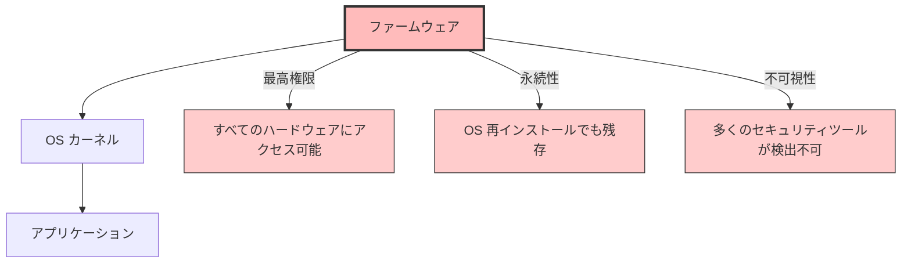
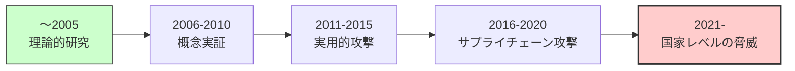
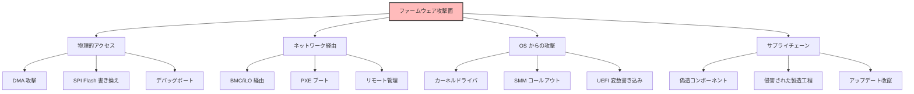
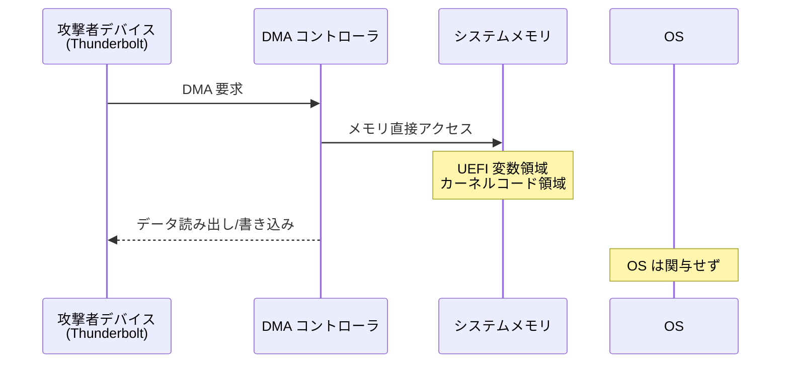
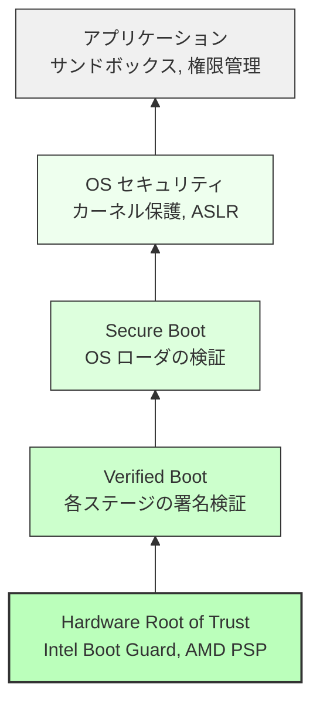

# ファームウェアセキュリティの全体像

🎯 **この章で学ぶこと**
- ファームウェアがセキュリティで重要な理由
- ファームウェアに対する脅威モデル
- 主要な攻撃手法と攻撃面
- ファームウェアセキュリティの防御層
- セキュリティ関連技術の全体像

📚 **前提知識**
- [Part III: プラットフォーム初期化の原理](../part3/09-part3-summary.md)
- ブートプロセスの基礎
- x86_64 アーキテクチャの基本

---

## ファームウェアセキュリティの重要性

**ファームウェア**は、システムの最も低レベルで動作するソフトウェアであり、セキュリティの**信頼の起点（Root of Trust）**となります。

### なぜファームウェアが狙われるのか



**ファームウェア攻撃の特徴：**

| 特徴 | 説明 | 影響 |
|------|------|------|
| **最高権限** | SMM (System Management Mode) は Ring -2 相当 | OS やハイパーバイザより高い権限 |
| **永続性** | SPI Flash に保存 | OS 再インストールでも除去困難 |
| **不可視性** | 起動前に実行 | 多くのアンチウイルスが検出不可 |
| **検証困難** | バイナリのみ、ソース非公開 | リバースエンジニアリングが必要 |

### ファームウェア攻撃の歴史



**主要な事例：**

- **2015**: UEFI rootkit "LoJax" 発見
- **2018**: "ThinkPwn" による SMM 特権昇格
- **2019**: "Plundervolt" による Intel SGX 攻撃
- **2020**: "BootHole" (Grub2 の脆弱性)
- **2022**: "LogoFAIL" (ロゴ画像パーサの脆弱性)

---

## ファームウェアの脅威モデル

### 攻撃者のプロファイル

| 攻撃者タイプ | 能力 | 動機 | 典型的な攻撃 |
|------------|------|------|------------|
| **スクリプトキディ** | 低 | 愉快犯 | 公開済み PoC の実行 |
| **一般的な犯罪者** | 中 | 金銭 | ランサムウェア、データ窃取 |
| **APT グループ** | 高 | 諜報・妨害 | カスタム rootkit、持続的侵害 |
| **国家支援型** | 最高 | 戦略的優位 | サプライチェーン侵害、ゼロデイ |

### 攻撃面（Attack Surface）



---

## 主要な攻撃手法

### 1. SPI Flash 書き換え攻撃

**概要**: SPI Flash チップに直接アクセスして、UEFI ファームウェアを改竄します。

**攻撃手順：**
1. 物理的にマシンにアクセス
2. SPI Flash チップを特定（通常 SOIC-8 パッケージ）
3. Flash Programmer（例: CH341A）で読み出し
4. ファームウェアイメージを改竄
5. Flash に書き戻し

**防御策:**
- **Flash Descriptor**: BIOS 領域を Read-Only に設定
- **Protected Range Registers (PRR)**: 特定領域を書き込み保護
- **Hardware Root of Trust**: Intel Boot Guard, AMD PSP

### 2. DMA (Direct Memory Access) 攻撃

**概要**: Thunderbolt, Firewire などの DMA 対応デバイスから、メモリに直接アクセスします。



**防御策:**
- **VT-d / IOMMU**: DMA のアドレス範囲を制限
- **Kernel DMA Protection**: Windows 10 以降
- **Thunderbolt Security Levels**: ユーザー承認が必要

### 3. SMM (System Management Mode) 攻撃

**概要**: SMM は Ring -2 相当の最高権限で動作するため、攻撃者が SMM に侵入すると完全な制御が可能になります。

**攻撃手法:**
- **SMM コールアウト**: SMM が OS のコードを呼び出す際の脆弱性
- **SMRAM リロケーション攻撃**: SMBASE を変更して SMRAM を移動
- **SMM リエントランシー**: 同時 SMI によるレースコンディション

**防御策:**
- **SMRAM ロック**: D_LCK ビットで SMRAM をロック
- **SMM ページテーブル**: SMRAM 外のコード実行を防止
- **SMI 転送モニタ (STM)**: SMM の実行を監視

### 4. UEFI 変数攻撃

**概要**: UEFI 変数は OS から読み書き可能なため、攻撃ベクタとなります。

```c
// 例: Secure Boot を無効化する攻撃
SetVariable (
  L"SecureBoot",
  &gEfiGlobalVariableGuid,
  EFI_VARIABLE_BOOTSERVICE_ACCESS | EFI_VARIABLE_RUNTIME_ACCESS,
  sizeof (UINT8),
  &DisableValue
);
```

**防御策:**
- **Authenticated Variables**: 署名検証
- **Variable Lock**: 特定変数を Read-Only に
- **Secure Boot**: OS からの不正な変数書き込みを防止

### 5. ブートキット / Rootkit

**概要**: ブートローダや OS カーネルを改竄し、起動プロセスを乗っ取ります。

**有名な事例:**
- **LoJax** (2018): UEFI rootkit、再インストールでも残存
- **MosaicRegressor** (2020): 複数段階の UEFI implant
- **BlackLotus** (2022): Secure Boot を迂回する UEFI bootkit

**検出:**
```bash
# Linux での UEFI ファームウェアダンプ
sudo dd if=/dev/mem of=bios.bin bs=1M skip=4095 count=1

# チェックサム検証
sha256sum bios.bin
# ベンダー公式と比較
```

---

## ファームウェアセキュリティの防御層

ファームウェアセキュリティは **Defense in Depth**（多層防御）の原則に基づきます。

### セキュリティの層



**各層の役割：**

| 層 | 技術 | 保護対象 | 攻撃者の能力前提 |
|----|------|---------|----------------|
| **Layer 0: Hardware** | Boot Guard, PSP, fTPM | ファームウェアの完全性 | 物理アクセス |
| **Layer 1: Firmware** | Secure Boot, Measured Boot | ブートローダ | OS 権限 |
| **Layer 2: OS** | Kernel Patch Protection, HVCI | カーネル | ユーザー権限 |
| **Layer 3: App** | Sandboxing, DEP, ASLR | アプリケーション | 任意コード実行 |

### 1. Hardware Root of Trust

**目的**: ファームウェアの最初のコードが信頼できることを保証

**技術:**
- **Intel Boot Guard**: CPU 内蔵の鍵で Initial Boot Block (IBB) を検証
- **AMD Platform Security Processor (PSP)**: ARM Cortex-A5 による独立した検証
- **TPM (Trusted Platform Module)**: 暗号演算と測定値の安全な保存

**フロー:**
```
電源 ON → Boot Guard/PSP が IBB 検証 → OK なら実行 → 次の段階を検証 → ...
```

### 2. Verified Boot

**目的**: ブートプロセスの各段階で、次の段階のコードを検証


### 3. Secure Boot

**目的**: OS ローダとドライバが信頼された発行者によって署名されていることを確認

**仕組み:**
1. Platform Key (PK): 最上位の鍵、OEM が保持
2. Key Exchange Key (KEK): Microsoft, ベンダーの鍵
3. Signature Database (db): 許可された署名のリスト
4. Forbidden Signature Database (dbx): 禁止された署名のリスト

### 4. Measured Boot

**目的**: ブートプロセスの各段階を TPM に記録し、リモート証明を可能に

**TPM PCR (Platform Configuration Register):**

| PCR | 内容 | 用途 |
|-----|------|------|
| 0 | UEFI ファームウェアコード | ファームウェア検証 |
| 1 | UEFI ファームウェア設定 | 設定改竄検出 |
| 2 | Option ROM | 拡張カード検証 |
| 4 | MBR / GPT | ブートセクタ検証 |
| 7 | Secure Boot 状態 | Secure Boot 有効化確認 |

---

## セキュリティ関連技術の全体像

### Intel プラットフォーム

| 技術 | 層 | 目的 |
|------|-----|------|
| **Boot Guard** | Hardware | IBB の検証 |
| **TXT (Trusted Execution Technology)** | Hardware | 測定起動 (Measured Launch) |
| **SGX (Software Guard Extensions)** | CPU | Enclave による隔離実行 |
| **TME (Total Memory Encryption)** | Memory | メモリ全体の暗号化 |
| **MKTME (Multi-Key TME)** | Memory | VM ごとの暗号化 |
| **CET (Control-flow Enforcement Technology)** | CPU | ROP/JOP 攻撃対策 |

### AMD プラットフォーム

| 技術 | 層 | 目的 |
|------|-----|------|
| **PSP (Platform Security Processor)** | Hardware | ファームウェア検証 |
| **SEV (Secure Encrypted Virtualization)** | Memory | VM メモリ暗号化 |
| **SEV-ES** | Memory | レジスタ暗号化 |
| **SEV-SNP** | Memory | Nested Page Table 保護 |
| **SME (Secure Memory Encryption)** | Memory | メモリ暗号化 |

### ARM プラットフォーム

| 技術 | 層 | 目的 |
|------|-----|------|
| **TrustZone** | CPU | Secure World / Normal World 分離 |
| **Secure Boot** | Firmware | ブートイメージ検証 |
| **OP-TEE** | OS | Trusted Execution Environment |

---

## セキュリティ設計の原則

### 1. Principle of Least Privilege（最小権限の原則）

各コンポーネントは、必要最小限の権限のみを持つべきです。

**例：**
- SMM コードは必要最小限に
- DXE ドライバは SMM を使わない（可能な限り）

### 2. Defense in Depth（多層防御）

単一の防御機構に依存せず、複数の層で保護します。

**例：**
- Boot Guard (Hardware) + Secure Boot (Firmware) + HVCI (OS)

### 3. Fail Secure（安全側への失敗）

エラーが発生した場合、システムは安全な状態になるべきです。

**例：**
- 署名検証失敗時は起動を停止
- TPM エラー時は BitLocker でブロック

### 4. Security by Design（設計段階からのセキュリティ）

セキュリティを後付けではなく、設計段階から組み込みます。

**例：**
- UEFI PI Specification の SMM ページテーブル
- ACPI の Hardware-Reduced モード

---

## セキュリティ評価とテスト

### 静的解析

```bash
# バイナリ解析
binwalk firmware.bin
uefi-firmware-parser firmware.bin

# 既知の脆弱性スキャン
chipsec_main -m common.bios_wp
chipsec_main -m common.smm
```

### 動的解析

```bash
# ファームウェアダンプ
sudo flashrom -p internal -r bios_backup.bin

# TPM PCR 確認
tpm2_pcrread

# Secure Boot 状態確認
mokutil --sb-state
```

### ペネトレーションテスト

**ツール:**
- **CHIPSEC**: Intel のファームウェアセキュリティツール
- **UEFITool**: UEFI イメージの解析
- **Binwalk**: ファームウェアイメージの抽出
- **Ghidra / IDA Pro**: リバースエンジニアリング

---

## 演習問題

### 基本演習

1. **脅威モデリング**
   あなたのシステムに対する脅威を3つ挙げ、それぞれの攻撃者プロファイルと攻撃シナリオを記述してください。

2. **Secure Boot 確認**
   システムで Secure Boot が有効か確認し、`mokutil --sb-state` の出力を記録してください。

### 応用演習

3. **CHIPSEC 実行**
   CHIPSEC をインストールし、`common.bios_wp` モジュールを実行して、BIOS 書き込み保護の状態を確認してください。

4. **TPM PCR 読み取り**
   `tpm2_pcrread` で PCR 0-7 の値を読み取り、それぞれが何を測定しているか説明してください。

### チャレンジ演習

5. **ファームウェアダンプと解析**
   `flashrom` でファームウェアをダンプし、`UEFITool` で内部構造を解析してください。

6. **セキュリティポリシー設計**
   架空の組織のファームウェアセキュリティポリシーを設計し、Boot Guard、Secure Boot、TPM の使用方針を定義してください。

---

## まとめ

この章では、ファームウェアセキュリティの全体像について学びました。

🔑 **重要なポイント：**

1. **ファームウェアの重要性**
   - 最高権限で動作
   - 永続性（OS 再インストールでも残存）
   - 多くのセキュリティツールが検出不可

2. **主要な攻撃手法**
   - SPI Flash 書き換え
   - DMA 攻撃
   - SMM 攻撃
   - UEFI 変数攻撃
   - ブートキット / Rootkit

3. **多層防御**
   - Hardware Root of Trust (Boot Guard, PSP)
   - Verified Boot
   - Secure Boot
   - Measured Boot (TPM)

4. **設計原則**
   - 最小権限の原則
   - Defense in Depth
   - Fail Secure
   - Security by Design

**次章では、信頼チェーン（Chain of Trust）の構築について詳しく学びます。**

---

📚 **参考資料**
- [NIST SP 800-147](https://nvlpubs.nist.gov/nistpubs/Legacy/SP/nistspecialpublication800-147.pdf) - BIOS Protection Guidelines
- [NIST SP 800-193](https://nvlpubs.nist.gov/nistpubs/SpecialPublications/NIST.SP.800-193.pdf) - Platform Firmware Resiliency Guidelines
- [UEFI Secure Boot Specification](https://uefi.org/specifications)
- [Intel Boot Guard Technology](https://www.intel.com/content/www/us/en/support/articles/000025873/technologies.html)
- [CHIPSEC Framework](https://github.com/chipsec/chipsec) - Platform Security Assessment Framework
