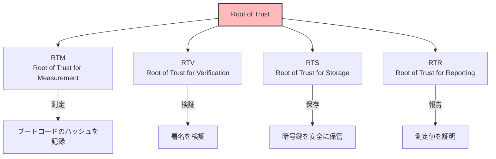
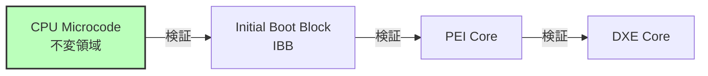
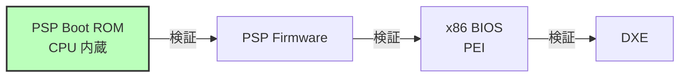
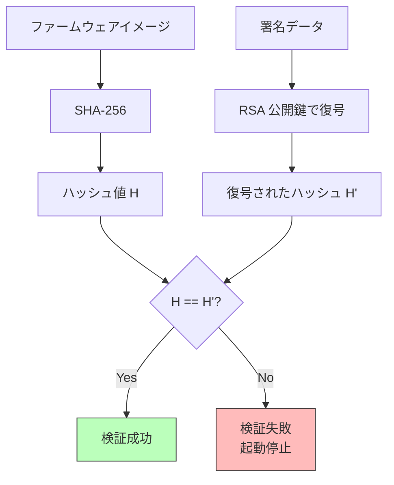
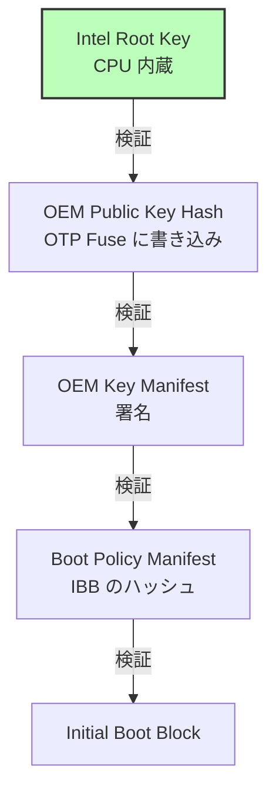
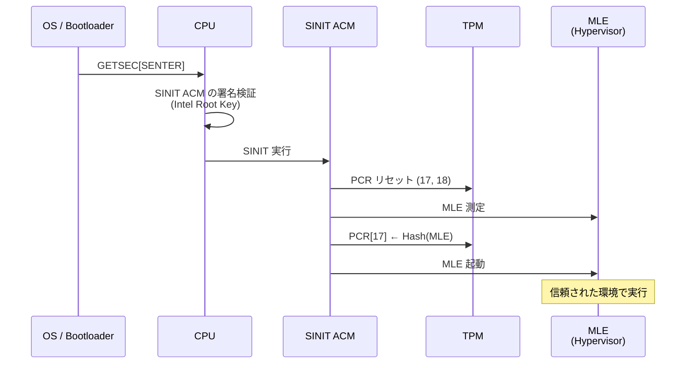
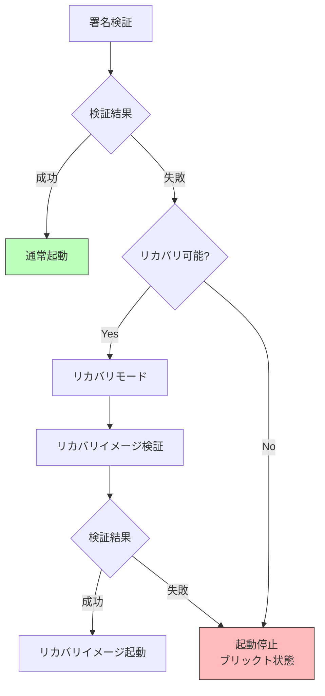

# 信頼チェーンの構築

🎯 **この章で学ぶこと**
- 信頼の起点（Root of Trust）の概念
- 信頼チェーン（Chain of Trust）の構築方法
- 署名検証の仕組み
- 各ブートステージでの信頼の伝播
- Static Root of Trust vs Dynamic Root of Trust

📚 **前提知識**
- [Part IV: ファームウェアセキュリティの全体像](./01-firmware-security-overview.md)
- 公開鍵暗号の基礎
- デジタル署名の仕組み

---

## 信頼の起点（Root of Trust）

**Root of Trust（RoT）** は、セキュリティシステムの基盤となる、無条件に信頼される最小限のコンポーネントです。セキュリティの文脈において、すべてのシステムは何らかの信頼の起点を必要とします。なぜなら、無限に信頼を検証することは不可能であり、どこかの時点で「これは信頼できる」と仮定しなければならないからです。Root of Trust は、この信頼の連鎖の最初の一歩であり、ハードウェアレベルで実装され、変更不可能（Immutable）であり、攻撃者が容易に侵害できないように設計されています。

Root of Trust には、**4つの主要なタイプ**があります。まず、**RTM（Root of Trust for Measurement）** は、ブートコンポーネントの測定を担当し、各ブートステージのコードやデータのハッシュ値を計算し、TPM の PCR（Platform Configuration Register）に記録します。RTM は、ブートプロセスの各段階で「何が実行されたか」を記録する責任を持ち、後でリモート証明（Remote Attestation）を通じて、システムが信頼できる状態で起動したことを証明するために使用されます。実装例として、CPU のマイクロコードや Boot ROM が RTM の役割を果たします。次に、**RTV（Root of Trust for Verification）** は、デジタル署名の検証を担当し、各ブートステージのコードが信頼された発行者によって署名されていることを確認します。RTV は、CPU 内蔵の公開鍵や OTP（One-Time Programmable）fuse に保存された鍵ハッシュを使用して、署名を検証し、署名が無効な場合は起動を停止します。Intel Boot Guard や AMD PSP は RTV の典型的な実装です。**RTS（Root of Trust for Storage）** は、秘密情報（暗号鍵、パスワード、証明書など）の安全な保存を担当し、TPM、fTPM（Firmware TPM）、PSP などのセキュアな領域にデータを保管し、外部からの不正なアクセスを防ぎます。最後に、**RTR（Root of Trust for Reporting）** は、測定値の証明と報告を担当し、TPM Quote などの機能を使用して、PCR に記録された測定値をデジタル署名し、リモートの検証者に送信することで、システムの完全性を証明します。

Hardware Root of Trust の実装は、プラットフォームごとに異なります。**Intel プラットフォーム**では、CPU のマイクロコード内の不変領域が Root of Trust として機能し、Initial Boot Block（IBB）を検証します。IBB は、ファームウェアの最初の部分であり、CPU に内蔵された公開鍵（または OTP fuse に保存された鍵ハッシュ）を使用して署名が検証されます。IBB の検証に成功すると、IBB が次に PEI Core を検証し、PEI Core が DXE Core を検証するという信頼の連鎖が形成されます。**AMD プラットフォーム**では、PSP（Platform Security Processor）という ARM Cortex-A5 ベースの独立したプロセッサが Root of Trust として機能します。PSP は、CPU に内蔵された Boot ROM から起動し、PSP Firmware を検証し、その後 x86 BIOS（PEI）を検証します。PSP は、x86 CPU とは独立して動作するため、x86 側が侵害されていても、PSP は信頼できる状態を維持でき、システムの完全性を保証します。

したがって、Root of Trust は、セキュリティシステムの最も基盤となる要素であり、ハードウェアレベルで実装され、変更不可能であることが求められます。Root of Trust が侵害されると、その上に構築されたすべてのセキュリティ機構が無効になるため、Root of Trust の保護は最優先事項となります。

### 補足図: Root of Trust の4つのタイプ



### 参考表: 各 Root of Trust の役割

| RoT | 正式名称 | 役割 | 実装例 |
|-----|---------|------|--------|
| **RTM** | Root of Trust for Measurement | ブートコンポーネントの測定 | CPU マイクロコード、Boot ROM |
| **RTV** | Root of Trust for Verification | デジタル署名の検証 | CPU 内蔵鍵、Boot Guard |
| **RTS** | Root of Trust for Storage | 秘密情報の安全な保存 | TPM, fTPM, PSP |
| **RTR** | Root of Trust for Reporting | 測定値の証明・報告 | TPM Quote |

### 補足図: Hardware Root of Trust の実装（Intel）



### 補足図: Hardware Root of Trust の実装（AMD）



---

## 信頼チェーン（Chain of Trust）

**信頼チェーン**は、Root of Trust から順次信頼を伝播させる仕組みです。

### 基本原則

```
電源 ON → RoT が A を検証 → A が B を検証 → B が C を検証 → ... → OS カーネル
```

**重要な特性：**
1. **不変性**: RoT は変更不可能（Read-Only, CPU 内蔵など）
2. **順次性**: 各段階は次の段階のみを検証
3. **連鎖性**: 一つでも検証失敗なら全体が失敗

### 完全な信頼チェーン

```mermaid
sequenceDiagram
    participant HW as Hardware RoT<br/>(CPU/PSP)
    participant IBB as IBB<br/>(Initial Boot Block)
    participant PEI as PEI Core
    participant DXE as DXE Core
    participant BDS as BDS
    participant Loader as OS Loader
    participant Kernel as OS Kernel

    Note over HW: 電源 ON

    HW->>HW: 公開鍵読み込み<br/>(CPU 内蔵 or OTP fuse)
    HW->>IBB: 署名検証
    alt 検証成功
        HW->>IBB: 実行開始
        IBB->>PEI: 署名検証
        PEI->>DXE: 署名検証
        DXE->>BDS: 署名検証
        BDS->>Loader: 署名検証<br/>(Secure Boot)
        Loader->>Kernel: 署名検証
        Kernel->>Kernel: OS 起動
    else 検証失敗
        HW->>HW: 起動停止<br/>or リカバリモード
    end

    style HW fill:#bfb,stroke:#333,stroke-width:2px
```

---

## 署名検証の仕組み

### デジタル署名の基礎

**RSA 署名の例：**

```c
/**
  ファームウェアイメージの署名検証

  @param[in]  Image         ファームウェアイメージ
  @param[in]  ImageSize     イメージサイズ
  @param[in]  Signature     署名データ
  @param[in]  PublicKey     公開鍵

  @retval TRUE   署名が有効
  @retval FALSE  署名が無効
**/
BOOLEAN
VerifyFirmwareSignature (
  IN UINT8   *Image,
  IN UINTN   ImageSize,
  IN UINT8   *Signature,
  IN UINT8   *PublicKey
  )
{
  UINT8   Hash[32];
  BOOLEAN Result;

  // 1. イメージのハッシュを計算
  Sha256 (Image, ImageSize, Hash);

  // 2. 署名を公開鍵で復号
  // 3. 復号結果とハッシュを比較
  Result = RsaVerify (PublicKey, Signature, Hash, sizeof (Hash));

  return Result;
}
```

**署名検証のフロー:**



### 公開鍵の保管

**鍵の保管場所：**

| 保管場所 | セキュリティ | 変更可能性 | 用途 |
|---------|------------|-----------|------|
| **CPU 内蔵 ROM** | 最高 | 不可 | RoT の最初の検証 |
| **OTP Fuse** | 高 | 1回のみ書き込み可 | Boot Guard, PSP の鍵ハッシュ |
| **SPI Flash (保護領域)** | 中 | ファームウェア更新で変更可 | UEFI 署名鍵 |
| **UEFI 変数** | 低 | OS から変更可（保護なし） | 非推奨 |

**Intel Boot Guard の鍵階層：**



---

## Static Root of Trust for Measurement (SRTM)

**SRTM** は、電源投入時から測定を開始する方式です。

### SRTM のフロー

```c
/**
  SRTM による測定起動

  各段階で次のコンポーネントを TPM PCR に記録
**/

// 1. BIOS 起動コード (IBB) を PCR 0 に測定
TpmExtend (0, IbbHash);

// 2. PEI フェーズのコードを PCR 0 に測定
TpmExtend (0, PeiCoreHash);

// 3. DXE ドライバを PCR 0/2 に測定
TpmExtend (0, DxeCoreHash);
TpmExtend (2, OptionRomHash);

// 4. ブートローダを PCR 4 に測定
TpmExtend (4, BootloaderHash);
```

**PCR 拡張の仕組み:**

```
PCR[n] = SHA256(PCR[n] || 測定値)
```

初期値は 0、測定するたびに**連結してハッシュ**します。

**例：**
```
PCR[0] 初期値: 0000...0000
測定1 (IBB):   PCR[0] = SHA256(0000...0000 || Hash(IBB))
測定2 (PEI):   PCR[0] = SHA256(PCR[0] || Hash(PEI))
測定3 (DXE):   PCR[0] = SHA256(PCR[0] || Hash(DXE))
...
```

### SRTM の限界

**問題点：**
- 電源投入時のみ測定開始
- OS 実行中の動的な脅威に対応できない
- 測定はするが検証はしない（起動は止めない）

---

## Dynamic Root of Trust for Measurement (DRTM)

**DRTM** は、OS 実行中に新しい信頼チェーンを開始できます。

### Intel TXT (Trusted Execution Technology)

**DRTM の起動:**

```c
/**
  Intel TXT SINIT による測定起動

  @retval EFI_SUCCESS  成功
**/
EFI_STATUS
LaunchTrustedEnvironment (
  VOID
  )
{
  // 1. SINIT ACM (Authenticated Code Module) をロード
  LoadSinitAcm ();

  // 2. GETSEC[SENTER] 命令を実行
  // → CPU が SINIT ACM を検証・実行
  __asm__ volatile ("getsec" : : "a"(GETSEC_SENTER));

  // 3. SINIT が MLE (Measured Launch Environment) を測定
  // → PCR 17, 18 に記録

  // 4. MLE (例: Xen ハイパーバイザ) を起動
  LaunchMle ();

  return EFI_SUCCESS;
}
```

**DRTM のフロー:**



### AMD SKINIT

AMD の DRTM 実装は **SKINIT** 命令で実現します。

```assembly
; SKINIT 命令による SLB (Secure Loader Block) 起動
mov eax, slb_physical_address
skinit
```

---

## Verified Boot の実装

### ステージごとの検証

**EDK II での実装例：**

```c
/**
  次のブートステージを検証して起動

  @param[in]  Image         次のステージのイメージ
  @param[in]  ImageSize     イメージサイズ

  @retval EFI_SUCCESS       検証成功、起動
  @retval EFI_SECURITY_VIOLATION  検証失敗
**/
EFI_STATUS
VerifyAndLaunchNextStage (
  IN VOID   *Image,
  IN UINTN  ImageSize
  )
{
  EFI_STATUS  Status;
  UINT8       *PublicKey;
  UINT8       *Signature;

  // 1. 公開鍵を取得（PCD or Flash 保護領域）
  PublicKey = GetEmbeddedPublicKey ();

  // 2. イメージから署名を抽出
  Signature = ExtractSignature (Image, ImageSize);

  // 3. 署名検証
  Status = VerifyFirmwareSignature (Image, ImageSize, Signature, PublicKey);
  if (EFI_ERROR (Status)) {
    DEBUG ((DEBUG_ERROR, "Verification failed!\n"));
    // リカバリモードに移行 or 起動停止
    return EFI_SECURITY_VIOLATION;
  }

  // 4. TPM に測定（Measured Boot の場合）
  TpmExtend (0, CalculateHash (Image, ImageSize));

  // 5. 次のステージを起動
  LaunchImage (Image);

  return EFI_SUCCESS;
}
```

### リカバリメカニズム

**検証失敗時の対応：**



**リカバリモードの実装：**

```c
/**
  リカバリモードに移行

  @retval EFI_SUCCESS  リカバリイメージ起動成功
**/
EFI_STATUS
EnterRecoveryMode (
  VOID
  )
{
  VOID   *RecoveryImage;
  UINTN  RecoverySize;

  // 1. リカバリイメージをロード
  //    USB メモリ、ネットワーク、Flash の保護領域など
  RecoveryImage = LoadRecoveryImage (&RecoverySize);

  // 2. リカバリイメージの検証
  //    別の鍵で署名されている（より厳格な鍵管理）
  if (!VerifyRecoveryImage (RecoveryImage, RecoverySize)) {
    // リカバリイメージも破損している場合
    CpuDeadLoop ();  // 完全に停止
  }

  // 3. リカバリイメージ起動
  LaunchImage (RecoveryImage);

  return EFI_SUCCESS;
}
```

---

## 信頼チェーンの切断攻撃

### Time-of-Check to Time-of-Use (TOCTOU)

**攻撃シナリオ:**

```c
// 脆弱なコード例
VOID *Image = LoadImage ();
if (VerifySignature (Image)) {
  // ← ここで攻撃者がメモリを書き換え (TOCTOU)
  ExecuteImage (Image);
}
```

**対策:**

```c
// 安全なコード
VOID *Image = LoadImage ();
VOID *VerifiedCopy = AllocatePages (ImageSize);

// 1. コピーを作成
CopyMem (VerifiedCopy, Image, ImageSize);

// 2. コピーを検証
if (!VerifySignature (VerifiedCopy)) {
  return EFI_SECURITY_VIOLATION;
}

// 3. 書き込み保護
SetMemoryAttributes (VerifiedCopy, ImageSize, EFI_MEMORY_RO);

// 4. 保護されたコピーを実行
ExecuteImage (VerifiedCopy);
```

### Replay Attack

**攻撃シナリオ:**
古いファームウェア（既知の脆弱性あり）を、正規の署名付きで復元

**対策:**
- **Anti-Rollback カウンタ**: OTP fuse にバージョン番号を書き込み
- **リボケーションリスト**: 古い署名を無効化

```c
/**
  Anti-Rollback 検証

  @param[in]  ImageVersion  イメージのバージョン

  @retval TRUE   バージョン OK
  @retval FALSE  ロールバック検出
**/
BOOLEAN
CheckAntiRollback (
  IN UINT32  ImageVersion
  )
{
  UINT32  MinVersion;

  // OTP fuse から最小バージョンを読み取り
  MinVersion = ReadOtpFuseVersion ();

  if (ImageVersion < MinVersion) {
    DEBUG ((DEBUG_ERROR, "Rollback detected: %d < %d\n", ImageVersion, MinVersion));
    return FALSE;
  }

  return TRUE;
}
```

<div style="border: 2px solid #4a90e2; border-radius: 8px; padding: 10px 20px 20px 20px; margin: 20px 0;">

## 💡 コラム: BootHole 脆弱性 (CVE-2020-10713) - Secure Boot をバイパスする深刻な欠陥

**🔒 セキュリティ事例**

2020年7月、セキュリティ研究者が「BootHole」という深刻な脆弱性を発見しました。この脆弱性は、GRUB2（GRand Unified Bootloader 2）に存在し、Secure Boot を完全にバイパスできる可能性がありました。BootHole は、CVE-2020-10713 として登録され、CVSS スコア 8.2（High）と評価されました。影響範囲は広大で、Linux、Windows、macOS、VMware ESXi など、ほぼすべての UEFI ベースのシステムが影響を受けました。この脆弱性は、本章で学ぶ「信頼チェーンの切断攻撃」の実例であり、なぜ各ブートステージでの署名検証が重要なのかを示しています。

BootHole 脆弱性の根本原因は、GRUB2 の設定ファイル解析における**バッファオーバーフロー**でした。GRUB2 は、`grub.cfg` という設定ファイルを読み込み、ブートメニューやカーネルパラメータを設定します。しかし、GRUB2 のコードには、この設定ファイルを解析する際に、入力検証が不十分な箇所がありました。攻撃者は、特別に細工した `grub.cfg` ファイルを作成することで、GRUB2 のメモリを破壊し、任意のコードを実行できました。重要なのは、`grub.cfg` は**署名検証の対象外**だったということです。Secure Boot は、GRUB2 の実行ファイル（`grubx64.efi`）自体は検証しますが、その後 GRUB2 が読み込む設定ファイルは検証しません。この検証の抜け穴を突くことで、攻撃者は Secure Boot を迂回できたのです。

攻撃シナリオは次のように展開されます。まず、攻撃者は、ターゲットシステムの ESP（EFI System Partition）に物理的またはリモートでアクセスします。これは、管理者権限を持つユーザーや、ディスクの暗号化が無効な場合に可能です。次に、攻撃者は ESP 上の `grub.cfg` ファイルを悪意のあるバージョンに置き換えます。この悪意のある `grub.cfg` には、バッファオーバーフローを引き起こすペイロードが埋め込まれています。システムが再起動されると、UEFI ファームウェアは Secure Boot を実行し、GRUB2 の署名を検証します。GRUB2 は正規の署名を持っているため、検証は成功し、GRUB2 が実行されます。その後、GRUB2 は `grub.cfg` を読み込みますが、この時点で署名検証は行われません。悪意のある `grub.cfg` がバッファオーバーフローを引き起こし、攻撃者が制御を奪います。攻撃者は、任意のコード（rootkit、バックドアなど）を実行でき、Secure Boot をバイパスした状態で OS をロードできます。

BootHole が特に深刻だったのは、**shim** という仕組みに影響を与えたためです。Linux ディストリビューションは、Microsoft の UEFI CA（Certificate Authority）による署名を受けた「shim」という小さなブートローダを使用します。shim は、Microsoft の鍵で署名されているため、すべての UEFI システムで信頼されます。shim は、その後 GRUB2 を検証し、GRUB2 を起動します。この2段階の仕組みにより、Linux ディストリビューションは Secure Boot 環境で起動できるようになっています。しかし、BootHole は GRUB2 の脆弱性であり、shim による検証を通過した後に発生します。そのため、shim の署名検証は無意味になりました。

BootHole の修正は、非常に複雑で時間がかかりました。第一に、GRUB2 のパッチが必要でした。GRUB2 のコードに、`grub.cfg` の入力検証を追加し、バッファオーバーフローを防ぐ修正が施されました。第二に、shim の revocation が必要でした。古い、脆弱な GRUB2 バイナリを使用できないようにするため、UEFI の DBX（Forbidden Signature Database）に古い GRUB2 のハッシュ値を追加しました。これにより、たとえ正規の署名を持っていても、古い GRUB2 は起動できなくなります。第三に、ベンダーの BIOS 更新が必要でした。DBX の更新は、UEFI ファームウェアの更新を通じて配布されるため、すべてのユーザーがベンダー（Dell、HP、Lenovo など）から BIOS 更新を適用する必要がありました。第四に、Linux ディストリビューションの更新が必要でした。修正された GRUB2 と shim を含む新しいインストーラとライブ USB を配布する必要がありました。

BootHole の教訓は、**信頼チェーンのすべてのリンクを検証する必要がある**ということです。Secure Boot は、ブートローダ（GRUB2）の実行ファイルを検証しますが、ブートローダが読み込む設定ファイルは検証しませんでした。この「信頼できるコードが信頼できないデータを処理する」という状況が、脆弱性を生み出しました。理想的には、GRUB2 は `grub.cfg` の署名も検証すべきでした。しかし、実装の複雑さや後方互換性の問題から、これは実現されていませんでした。代わりに、入力検証を徹底することで、信頼できないデータによる被害を最小化するアプローチが取られました。

BootHole は、**Secure Boot の限界**も示しています。Secure Boot は、署名されたコードのみを実行することで、マルウェアの侵入を防ぎます。しかし、署名されたコードに脆弱性がある場合、Secure Boot は無力です。攻撃者は、正規の署名を持つコードを悪用して、システムを侵害できます。これを防ぐには、コードの品質向上（セキュアコーディング、ファジング、静的解析）、迅速なパッチ配布、revocation の仕組み（DBX による無効化）が不可欠です。

興味深いのは、BootHole に対する業界全体の協調した対応です。Microsoft、Linux Foundation、各 Linux ディストリビューション、ハードウェアベンダー（Intel、AMD、ARM）、BIOS ベンダー（AMI、Insyde、Phoenix）、OEM メーカー（Dell、HP、Lenovo）が連携して、修正とパッチの配布を行いました。このような広範な協力は、UEFI エコシステムの成熟度を示しています。しかし、すべてのユーザーが BIOS 更新を適用するわけではないため、BootHole 脆弱性を持つシステムは今でも存在します。

本章で学ぶ信頼チェーンの概念は、BootHole のような実際の脆弱性を理解する上で不可欠です。各ブートステージ（UEFI Firmware → shim → GRUB2 → Kernel）で署名検証を行い、信頼を伝播させる仕組みは、理論上は完璧です。しかし、実装の詳細（設定ファイルの検証漏れ、バッファオーバーフロー）が、セキュリティの穴を生み出します。ファームウェア開発者は、単に仕様に従うだけでなく、攻撃者の視点でコードをレビューし、「どこに弱点があるか」を常に考える必要があります。

**📚 参考資料**
- [CVE-2020-10713 - BootHole](https://cve.mitre.org/cgi-bin/cvename.cgi?name=CVE-2020-10713) - 公式CVE情報
- ["BootHole: Bootloader Vulnerabilities Impact Billions of Devices"](https://eclypsium.com/2020/07/29/theres-a-hole-in-the-boot/) - Eclypsium 社のレポート
- [UEFI DBX Update Guidance](https://uefi.org/revocationlistfile) - UEFI Forum の DBX 更新ガイド
- [GRUB2 Security Advisory](https://www.gnu.org/software/grub/) - GRUB2 公式サイト

</div>

## 演習問題

### 基本演習

1. **Root of Trust の識別**
   あなたのシステムの Root of Trust を特定してください（Intel Boot Guard, AMD PSP, など）。

2. **署名検証の理解**
   RSA-2048 署名の検証プロセスを図解してください。

### 応用演習

3. **TPM PCR 測定**
   Linux で `tpm2_pcrread` を実行し、PCR 0-7 の値を確認してください。再起動後、値が変わるか確認してください。

4. **信頼チェーンの追跡**
   `dmesg | grep -i "secure\|tpm\|measured"` で、起動ログから信頼チェーンの証拠を探してください。

### チャレンジ演習

5. **Verified Boot 実装**
   簡単なブートローダを作成し、次の段階のカーネルの署名を検証する機能を実装してください。

6. **TOCTOU 攻撃のデモ**
   TOCTOU 攻撃を再現できる概念実証コードを書いてください（教育目的のみ）。

---

## まとめ

この章では、信頼チェーン（Chain of Trust）の構築について学び、Root of Trust から始まり、各ブートステージが次のステージを検証する仕組み、そして信頼を連鎖的に伝播させる方法を理解しました。

**Root of Trust（RoT）** は、セキュリティシステムの基盤となる、無条件に信頼される最小限のコンポーネントであり、4つの主要なタイプがあります。まず、**RTM（Root of Trust for Measurement）** は、ブートコンポーネントの測定を担当し、各ブートステージのハッシュ値を計算して TPM の PCR（Platform Configuration Register）に記録し、後でリモート証明を可能にします。**RTV（Root of Trust for Verification）** は、デジタル署名の検証を担当し、CPU 内蔵の公開鍵や OTP fuse に保存された鍵ハッシュを使用して、各ブートステージのコードが信頼された発行者によって署名されていることを確認し、署名が無効な場合は起動を停止します。**RTS（Root of Trust for Storage）** は、秘密情報（暗号鍵、パスワード、証明書）の安全な保存を担当し、TPM、fTPM、PSP などのセキュアな領域にデータを保管し、外部からの不正なアクセスを防ぎます。**RTR（Root of Trust for Reporting）** は、測定値の証明と報告を担当し、TPM Quote などの機能を使用して、PCR に記録された測定値をデジタル署名し、リモートの検証者に送信することで、システムの完全性を証明します。

**信頼チェーンの原則**は、3つの重要な特性によって定義されます。まず、**不変性（Immutability）** は、Root of Trust が変更不可能であることを要求します。RoT は、CPU 内蔵の ROM、OTP fuse、またはハードウェアで保護された領域に保存され、攻撃者が容易に改竄できないようになっています。もし RoT が変更可能であれば、攻撃者は RoT 自体を侵害して、その上に構築されたすべてのセキュリティ機構を無効化できてしまいます。次に、**順次性（Sequential Verification）** は、各段階が次の段階のみを検証するという原則です。例えば、IBB（Initial Boot Block）は PEI Core を検証し、PEI Core は DXE Core を検証し、DXE Core は BDS を検証し、BDS は OS Loader を検証します。各段階は、自分の次の段階のみを検証し、それより先の段階については関与しません。この順次検証により、信頼が段階的に伝播します。最後に、**連鎖性（Chain Property）** は、一つでも検証が失敗すれば、全体が失敗するという原則です。例えば、PEI Core の署名検証が失敗した場合、その時点でブートプロセスは停止し、後続の段階（DXE、BDS、OS Loader）は実行されません。この連鎖性により、信頼の連鎖が断絶した場合、システムは安全な状態（起動停止またはリカバリモード）に移行します。

**SRTM（Static Root of Trust for Measurement）と DRTM（Dynamic Root of Trust for Measurement）** は、2つの異なる測定起動の方式です。**SRTM** は、電源投入時から測定を開始する方式であり、ブートプロセスの各段階を順次測定し、TPM の PCR 0-7 に記録します。例えば、PCR 0 には UEFI ファームウェアコード、PCR 1 には UEFI ファームウェア設定、PCR 2 には Option ROM、PCR 4 には MBR/GPT、PCR 7 には Secure Boot 状態が記録されます。SRTM の限界は、電源投入時のみ測定を開始するため、OS 実行中の動的な脅威に対応できず、また測定はするが検証はしない（起動は止めない）ことです。**DRTM** は、OS 実行中に新しい信頼チェーンを動的に開始できる方式であり、Intel TXT（Trusted Execution Technology）の GETSEC[SENTER] 命令や、AMD の SKINIT 命令を使用して実現されます。DRTM では、SINIT ACM（Authenticated Code Module）が CPU によって検証・実行され、SINIT が TPM の PCR 17, 18 をリセットし、MLE（Measured Launch Environment、例: Xen ハイパーバイザ）を測定して起動します。DRTM は、OS 起動後でも信頼された環境を動的に構築できるため、仮想化やコンテナ環境でのセキュリティ強化に使用されます。

**署名検証の仕組み**は、公開鍵暗号を基盤としています。まず、ファームウェアイメージのハッシュ値を SHA-256 や SHA-384 で計算します。次に、署名データを RSA または ECDSA の公開鍵で復号し、復号されたハッシュ値と計算したハッシュ値を比較します。両者が一致すれば、署名は有効であり、イメージは信頼された発行者によって署名されていることが確認されます。公開鍵の保管場所は、セキュリティレベルによって異なります。**CPU 内蔵 ROM** は最高のセキュリティを提供し、RoT の最初の検証に使用されます。**OTP Fuse** は、1回のみ書き込み可能であり、Boot Guard や PSP の鍵ハッシュを保存します。**SPI Flash の保護領域**は、ファームウェア更新で変更可能ですが、Protected Range Registers（PRR）や Flash Descriptor で書き込み保護されており、UEFI 署名鍵を保存します。**UEFI 変数**は、OS から変更可能であり、セキュリティが低いため、鍵の保管には非推奨です。

**攻撃と対策**として、2つの重要な脅威を学びました。まず、**TOCTOU（Time-of-Check to Time-of-Use）攻撃**は、署名検証の時点と実行の時点の間に、攻撃者がメモリを書き換える攻撃です。対策として、検証するイメージのコピーを作成し、コピーを検証した後、メモリ属性を Read-Only に設定し、保護されたコピーを実行します。この方法により、検証後の改竄を防ぎます。次に、**Replay 攻撃**は、古いファームウェア（既知の脆弱性あり）を、正規の署名付きで復元する攻撃です。対策として、**Anti-Rollback カウンタ**を OTP fuse に保存し、ファームウェアのバージョン番号を記録します。新しいファームウェアをインストールする際、OTP fuse の最小バージョンを更新し、それより古いバージョンのファームウェアは、たとえ署名が有効でも拒否されます。また、**リボケーションリスト（Revocation List）** を使用して、古い署名を無効化することもできます。

次章では、**UEFI Secure Boot の詳細な仕組み**について学び、Platform Key（PK）、Key Exchange Key（KEK）、Signature Database（db）、Forbidden Signature Database（dbx）という鍵階層、署名検証のフロー、Shim と MOK（Machine Owner Key）の役割、そして Secure Boot の設定と管理方法を理解します。

---

📚 **参考資料**
- [TCG PC Client Platform Firmware Profile Specification](https://trustedcomputinggroup.org/resource/pc-client-specific-platform-firmware-profile-specification/)
- [Intel TXT Software Development Guide](https://www.intel.com/content/www/us/en/developer/articles/technical/intel-trusted-execution-technology-intel-txt-software-development-guide.html)
- [NIST SP 800-147B](https://nvlpubs.nist.gov/nistpubs/SpecialPublications/NIST.SP.800-147B.pdf) - BIOS Protection Guidelines for Servers
- [UEFI Secure Boot Specification](https://uefi.org/specifications)
- [AMD Security White Paper](https://www.amd.com/en/technologies/security)
