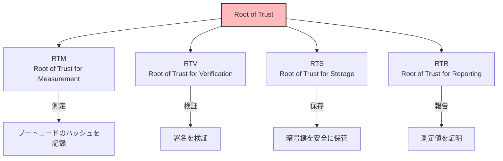
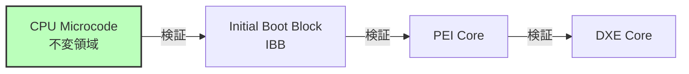
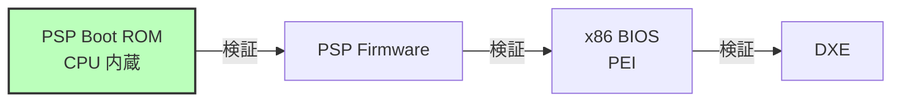
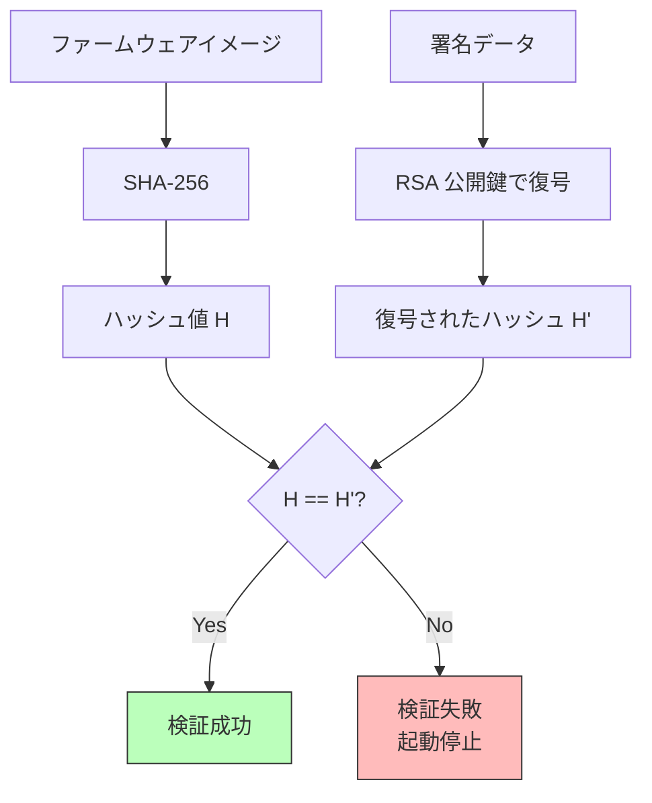
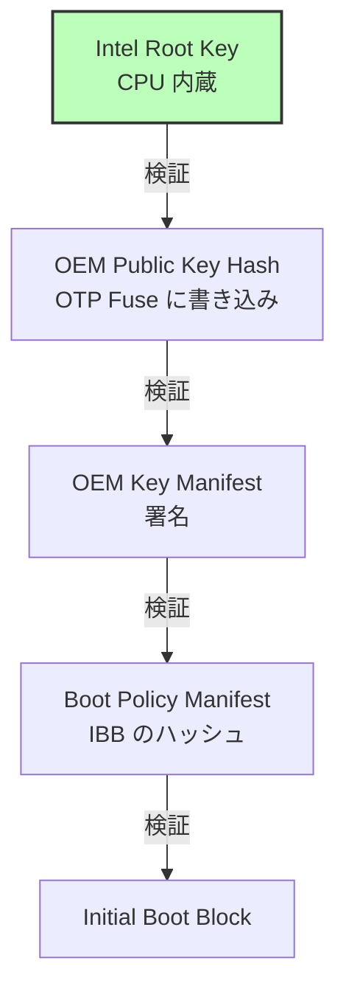
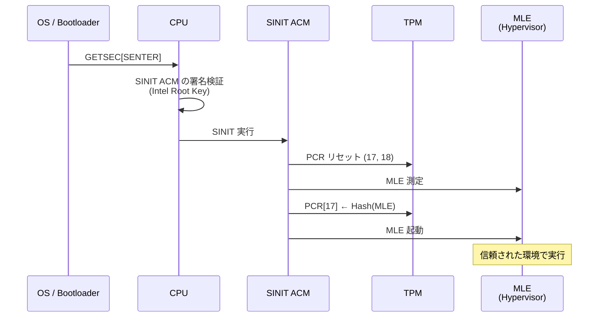
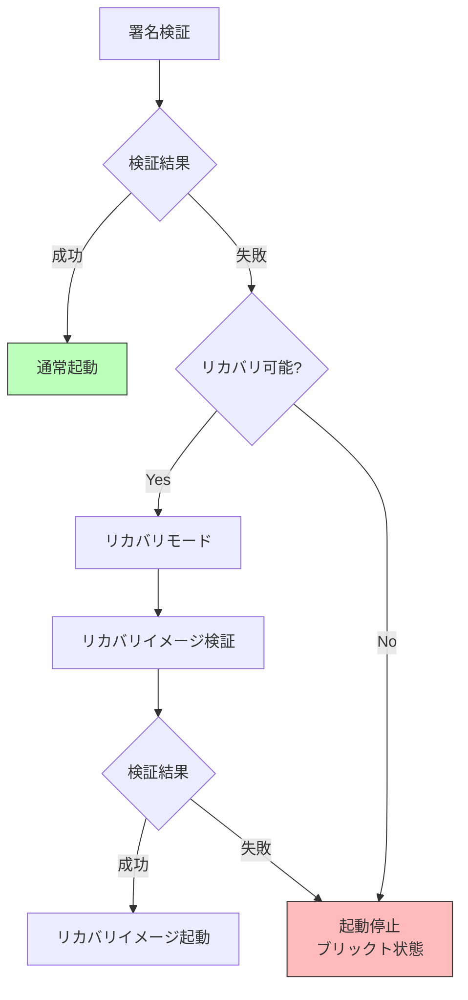

# 信頼チェーンの構築

🎯 **この章で学ぶこと**
- 信頼の起点（Root of Trust）の概念
- 信頼チェーン（Chain of Trust）の構築方法
- 署名検証の仕組み
- 各ブートステージでの信頼の伝播
- Static Root of Trust vs Dynamic Root of Trust

📚 **前提知識**
- [Part IV: ファームウェアセキュリティの全体像](./01-firmware-security-overview.md)
- 公開鍵暗号の基礎
- デジタル署名の仕組み

---

## 信頼の起点（Root of Trust）

**Root of Trust（RoT）** は、セキュリティシステムの基盤となる、無条件に信頼される最小限のコンポーネントです。

### Root of Trust の種類



**各 Root of Trust の役割：**

| RoT | 正式名称 | 役割 | 実装例 |
|-----|---------|------|--------|
| **RTM** | Root of Trust for Measurement | ブートコンポーネントの測定 | CPU マイクロコード、Boot ROM |
| **RTV** | Root of Trust for Verification | デジタル署名の検証 | CPU 内蔵鍵、Boot Guard |
| **RTS** | Root of Trust for Storage | 秘密情報の安全な保存 | TPM, fTPM, PSP |
| **RTR** | Root of Trust for Reporting | 測定値の証明・報告 | TPM Quote |

### Hardware Root of Trust の実装

**Intel プラットフォーム:**


**AMD プラットフォーム:**


---

## 信頼チェーン（Chain of Trust）

**信頼チェーン**は、Root of Trust から順次信頼を伝播させる仕組みです。

### 基本原則

```
電源 ON → RoT が A を検証 → A が B を検証 → B が C を検証 → ... → OS カーネル
```

**重要な特性：**
1. **不変性**: RoT は変更不可能（Read-Only, CPU 内蔵など）
2. **順次性**: 各段階は次の段階のみを検証
3. **連鎖性**: 一つでも検証失敗なら全体が失敗

### 完全な信頼チェーン

```mermaid
sequenceDiagram
    participant HW as Hardware RoT<br/>(CPU/PSP)
    participant IBB as IBB<br/>(Initial Boot Block)
    participant PEI as PEI Core
    participant DXE as DXE Core
    participant BDS as BDS
    participant Loader as OS Loader
    participant Kernel as OS Kernel

    Note over HW: 電源 ON

    HW->>HW: 公開鍵読み込み<br/>(CPU 内蔵 or OTP fuse)
    HW->>IBB: 署名検証
    alt 検証成功
        HW->>IBB: 実行開始
        IBB->>PEI: 署名検証
        PEI->>DXE: 署名検証
        DXE->>BDS: 署名検証
        BDS->>Loader: 署名検証<br/>(Secure Boot)
        Loader->>Kernel: 署名検証
        Kernel->>Kernel: OS 起動
    else 検証失敗
        HW->>HW: 起動停止<br/>or リカバリモード
    end

    style HW fill:#bfb,stroke:#333,stroke-width:2px
```

---

## 署名検証の仕組み

### デジタル署名の基礎

**RSA 署名の例：**

```c
/**
  ファームウェアイメージの署名検証

  @param[in]  Image         ファームウェアイメージ
  @param[in]  ImageSize     イメージサイズ
  @param[in]  Signature     署名データ
  @param[in]  PublicKey     公開鍵

  @retval TRUE   署名が有効
  @retval FALSE  署名が無効
**/
BOOLEAN
VerifyFirmwareSignature (
  IN UINT8   *Image,
  IN UINTN   ImageSize,
  IN UINT8   *Signature,
  IN UINT8   *PublicKey
  )
{
  UINT8   Hash[32];
  BOOLEAN Result;

  // 1. イメージのハッシュを計算
  Sha256 (Image, ImageSize, Hash);

  // 2. 署名を公開鍵で復号
  // 3. 復号結果とハッシュを比較
  Result = RsaVerify (PublicKey, Signature, Hash, sizeof (Hash));

  return Result;
}
```

**署名検証のフロー:**



### 公開鍵の保管

**鍵の保管場所：**

| 保管場所 | セキュリティ | 変更可能性 | 用途 |
|---------|------------|-----------|------|
| **CPU 内蔵 ROM** | 最高 | 不可 | RoT の最初の検証 |
| **OTP Fuse** | 高 | 1回のみ書き込み可 | Boot Guard, PSP の鍵ハッシュ |
| **SPI Flash (保護領域)** | 中 | ファームウェア更新で変更可 | UEFI 署名鍵 |
| **UEFI 変数** | 低 | OS から変更可（保護なし） | 非推奨 |

**Intel Boot Guard の鍵階層：**



---

## Static Root of Trust for Measurement (SRTM)

**SRTM** は、電源投入時から測定を開始する方式です。

### SRTM のフロー

```c
/**
  SRTM による測定起動

  各段階で次のコンポーネントを TPM PCR に記録
**/

// 1. BIOS 起動コード (IBB) を PCR 0 に測定
TpmExtend (0, IbbHash);

// 2. PEI フェーズのコードを PCR 0 に測定
TpmExtend (0, PeiCoreHash);

// 3. DXE ドライバを PCR 0/2 に測定
TpmExtend (0, DxeCoreHash);
TpmExtend (2, OptionRomHash);

// 4. ブートローダを PCR 4 に測定
TpmExtend (4, BootloaderHash);
```

**PCR 拡張の仕組み:**

```
PCR[n] = SHA256(PCR[n] || 測定値)
```

初期値は 0、測定するたびに**連結してハッシュ**します。

**例：**
```
PCR[0] 初期値: 0000...0000
測定1 (IBB):   PCR[0] = SHA256(0000...0000 || Hash(IBB))
測定2 (PEI):   PCR[0] = SHA256(PCR[0] || Hash(PEI))
測定3 (DXE):   PCR[0] = SHA256(PCR[0] || Hash(DXE))
...
```

### SRTM の限界

**問題点：**
- 電源投入時のみ測定開始
- OS 実行中の動的な脅威に対応できない
- 測定はするが検証はしない（起動は止めない）

---

## Dynamic Root of Trust for Measurement (DRTM)

**DRTM** は、OS 実行中に新しい信頼チェーンを開始できます。

### Intel TXT (Trusted Execution Technology)

**DRTM の起動:**

```c
/**
  Intel TXT SINIT による測定起動

  @retval EFI_SUCCESS  成功
**/
EFI_STATUS
LaunchTrustedEnvironment (
  VOID
  )
{
  // 1. SINIT ACM (Authenticated Code Module) をロード
  LoadSinitAcm ();

  // 2. GETSEC[SENTER] 命令を実行
  // → CPU が SINIT ACM を検証・実行
  __asm__ volatile ("getsec" : : "a"(GETSEC_SENTER));

  // 3. SINIT が MLE (Measured Launch Environment) を測定
  // → PCR 17, 18 に記録

  // 4. MLE (例: Xen ハイパーバイザ) を起動
  LaunchMle ();

  return EFI_SUCCESS;
}
```

**DRTM のフロー:**



### AMD SKINIT

AMD の DRTM 実装は **SKINIT** 命令で実現します。

```assembly
; SKINIT 命令による SLB (Secure Loader Block) 起動
mov eax, slb_physical_address
skinit
```

---

## Verified Boot の実装

### ステージごとの検証

**EDK II での実装例：**

```c
/**
  次のブートステージを検証して起動

  @param[in]  Image         次のステージのイメージ
  @param[in]  ImageSize     イメージサイズ

  @retval EFI_SUCCESS       検証成功、起動
  @retval EFI_SECURITY_VIOLATION  検証失敗
**/
EFI_STATUS
VerifyAndLaunchNextStage (
  IN VOID   *Image,
  IN UINTN  ImageSize
  )
{
  EFI_STATUS  Status;
  UINT8       *PublicKey;
  UINT8       *Signature;

  // 1. 公開鍵を取得（PCD or Flash 保護領域）
  PublicKey = GetEmbeddedPublicKey ();

  // 2. イメージから署名を抽出
  Signature = ExtractSignature (Image, ImageSize);

  // 3. 署名検証
  Status = VerifyFirmwareSignature (Image, ImageSize, Signature, PublicKey);
  if (EFI_ERROR (Status)) {
    DEBUG ((DEBUG_ERROR, "Verification failed!\n"));
    // リカバリモードに移行 or 起動停止
    return EFI_SECURITY_VIOLATION;
  }

  // 4. TPM に測定（Measured Boot の場合）
  TpmExtend (0, CalculateHash (Image, ImageSize));

  // 5. 次のステージを起動
  LaunchImage (Image);

  return EFI_SUCCESS;
}
```

### リカバリメカニズム

**検証失敗時の対応：**



**リカバリモードの実装：**

```c
/**
  リカバリモードに移行

  @retval EFI_SUCCESS  リカバリイメージ起動成功
**/
EFI_STATUS
EnterRecoveryMode (
  VOID
  )
{
  VOID   *RecoveryImage;
  UINTN  RecoverySize;

  // 1. リカバリイメージをロード
  //    USB メモリ、ネットワーク、Flash の保護領域など
  RecoveryImage = LoadRecoveryImage (&RecoverySize);

  // 2. リカバリイメージの検証
  //    別の鍵で署名されている（より厳格な鍵管理）
  if (!VerifyRecoveryImage (RecoveryImage, RecoverySize)) {
    // リカバリイメージも破損している場合
    CpuDeadLoop ();  // 完全に停止
  }

  // 3. リカバリイメージ起動
  LaunchImage (RecoveryImage);

  return EFI_SUCCESS;
}
```

---

## 信頼チェーンの切断攻撃

### Time-of-Check to Time-of-Use (TOCTOU)

**攻撃シナリオ:**

```c
// 脆弱なコード例
VOID *Image = LoadImage ();
if (VerifySignature (Image)) {
  // ← ここで攻撃者がメモリを書き換え (TOCTOU)
  ExecuteImage (Image);
}
```

**対策:**

```c
// 安全なコード
VOID *Image = LoadImage ();
VOID *VerifiedCopy = AllocatePages (ImageSize);

// 1. コピーを作成
CopyMem (VerifiedCopy, Image, ImageSize);

// 2. コピーを検証
if (!VerifySignature (VerifiedCopy)) {
  return EFI_SECURITY_VIOLATION;
}

// 3. 書き込み保護
SetMemoryAttributes (VerifiedCopy, ImageSize, EFI_MEMORY_RO);

// 4. 保護されたコピーを実行
ExecuteImage (VerifiedCopy);
```

### Replay Attack

**攻撃シナリオ:**
古いファームウェア（既知の脆弱性あり）を、正規の署名付きで復元

**対策:**
- **Anti-Rollback カウンタ**: OTP fuse にバージョン番号を書き込み
- **リボケーションリスト**: 古い署名を無効化

```c
/**
  Anti-Rollback 検証

  @param[in]  ImageVersion  イメージのバージョン

  @retval TRUE   バージョン OK
  @retval FALSE  ロールバック検出
**/
BOOLEAN
CheckAntiRollback (
  IN UINT32  ImageVersion
  )
{
  UINT32  MinVersion;

  // OTP fuse から最小バージョンを読み取り
  MinVersion = ReadOtpFuseVersion ();

  if (ImageVersion < MinVersion) {
    DEBUG ((DEBUG_ERROR, "Rollback detected: %d < %d\n", ImageVersion, MinVersion));
    return FALSE;
  }

  return TRUE;
}
```

---

## 演習問題

### 基本演習

1. **Root of Trust の識別**
   あなたのシステムの Root of Trust を特定してください（Intel Boot Guard, AMD PSP, など）。

2. **署名検証の理解**
   RSA-2048 署名の検証プロセスを図解してください。

### 応用演習

3. **TPM PCR 測定**
   Linux で `tpm2_pcrread` を実行し、PCR 0-7 の値を確認してください。再起動後、値が変わるか確認してください。

4. **信頼チェーンの追跡**
   `dmesg | grep -i "secure\|tpm\|measured"` で、起動ログから信頼チェーンの証拠を探してください。

### チャレンジ演習

5. **Verified Boot 実装**
   簡単なブートローダを作成し、次の段階のカーネルの署名を検証する機能を実装してください。

6. **TOCTOU 攻撃のデモ**
   TOCTOU 攻撃を再現できる概念実証コードを書いてください（教育目的のみ）。

---

## まとめ

この章では、信頼チェーン（Chain of Trust）の構築について学びました。

🔑 **重要なポイント：**

1. **Root of Trust (RoT)**
   - RTM: 測定
   - RTV: 検証
   - RTS: 保存
   - RTR: 報告

2. **信頼チェーンの原則**
   - 不変性: RoT は変更不可能
   - 順次性: 各段階は次の段階のみを検証
   - 連鎖性: 一つでも失敗なら全体が失敗

3. **SRTM vs DRTM**
   - **SRTM**: 電源投入時から測定、PCR 0-7
   - **DRTM**: 動的に測定開始、PCR 17-18、Intel TXT / AMD SKINIT

4. **署名検証**
   - 公開鍵暗号（RSA, ECDSA）
   - ハッシュ（SHA-256, SHA-384）
   - 鍵の保管（CPU ROM, OTP Fuse, Flash 保護領域）

5. **攻撃と対策**
   - **TOCTOU**: メモリ保護で対策
   - **Replay**: Anti-Rollback カウンタで対策

**次章では、UEFI Secure Boot の詳細な仕組みについて学びます。**

---

📚 **参考資料**
- [TCG PC Client Platform Firmware Profile Specification](https://trustedcomputinggroup.org/resource/pc-client-specific-platform-firmware-profile-specification/)
- [Intel TXT Software Development Guide](https://www.intel.com/content/www/us/en/developer/articles/technical/intel-trusted-execution-technology-intel-txt-software-development-guide.html)
- [NIST SP 800-147B](https://nvlpubs.nist.gov/nistpubs/SpecialPublications/NIST.SP.800-147B.pdf) - BIOS Protection Guidelines for Servers
- [UEFI Secure Boot Specification](https://uefi.org/specifications)
- [AMD Security White Paper](https://www.amd.com/en/technologies/security)
