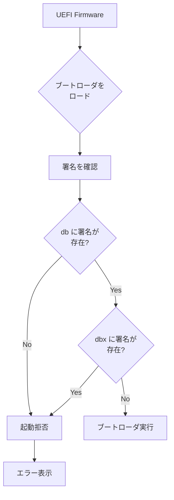
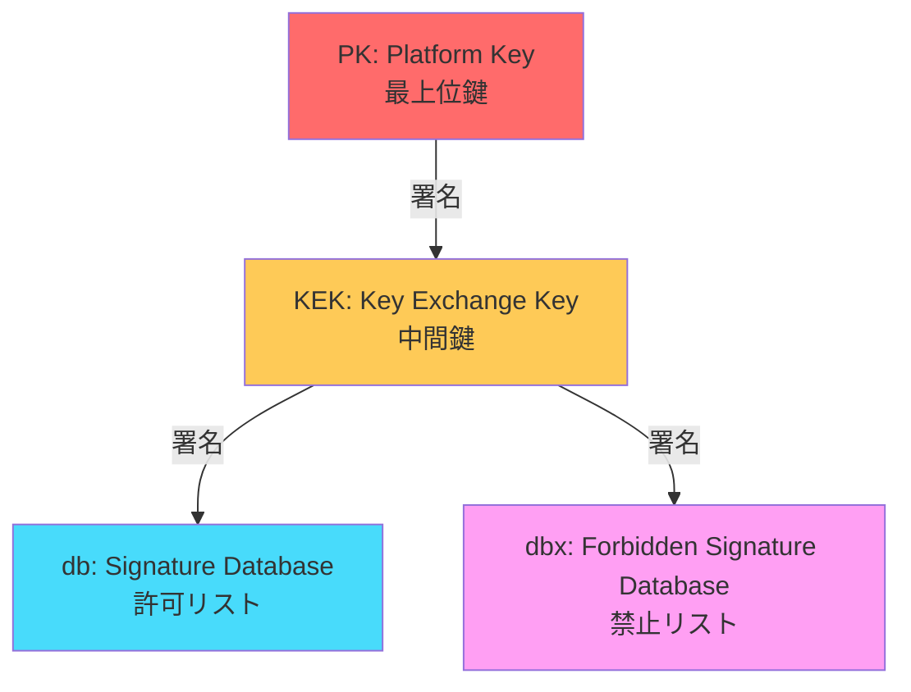
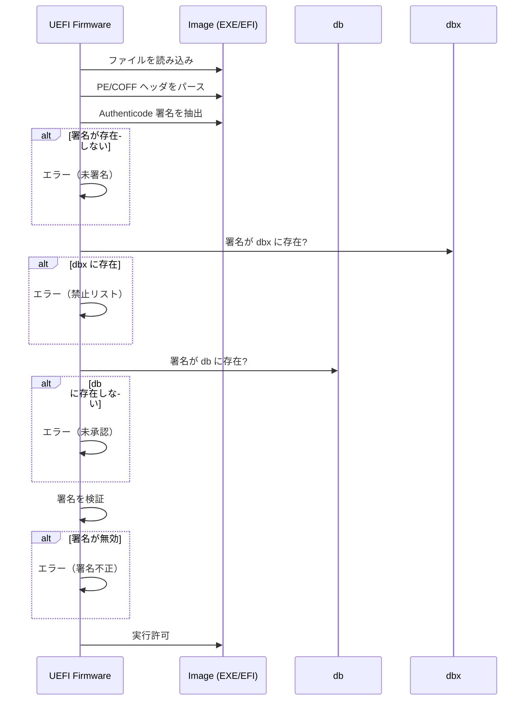
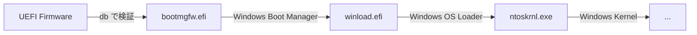
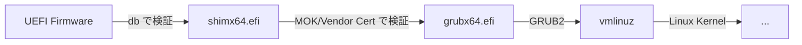
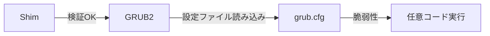

# UEFI Secure Boot の仕組み

<!-- Status: completed -->
<!-- Last Updated: 2025-10-05 -->

🎯 **この章で学ぶこと**
- UEFI Secure Boot のアーキテクチャと目的
- 鍵階層（PK、KEK、db、dbx）の役割と関係性
- 署名データベースの構造と検証プロセス
- Windows と Linux における Secure Boot の実装の違い
- Shim ブートローダと MOK（Machine Owner Keys）の仕組み
- Secure Boot の設定・管理方法
- Secure Boot バイパス手法と対策

📚 **前提知識**
- [Part IV Chapter 2: 信頼チェーンの構築](./02-chain-of-trust.md)
- デジタル署名と公開鍵暗号の基礎
- UEFI ブートプロセスの理解

---

## UEFI Secure Boot とは

### Secure Boot の目的

**UEFI Secure Boot** は、ファームウェアレベルで実装されるセキュリティ機構で、以下の目的を持ちます：

1. **未署名コードの実行防止**: 信頼されていないブートローダやドライバの実行をブロック
2. **ブートキット対策**: OS 起動前のマルウェア（ブートキット）の侵入を防ぐ
3. **信頼チェーンの確立**: ファームウェア → ブートローダ → OS の信頼チェーンを構築
4. **改ざん検出**: ブートコンポーネントの改ざんを検出

> **Note**: Secure Boot は Windows 8 以降で必須要件となり、現在ではほぼすべての PC で有効化されています。

### Secure Boot の動作原理

Secure Boot は**デジタル署名検証**に基づいて動作します：



**検証の流れ**：
1. ブートローダのバイナリから署名を抽出
2. 署名が **db（許可リスト）** に含まれるか確認
3. 署名が **dbx（禁止リスト）** に含まれないか確認
4. 両方の条件を満たせば実行、そうでなければ拒否

---

## Secure Boot の鍵階層

### 4層の鍵構造

UEFI Secure Boot は階層的な鍵管理システムを採用しています：



### PK（Platform Key）

**役割**：
- Secure Boot の**ルート鍵**
- KEK の更新権限を持つ
- OEM（PC メーカー）が所有

**特徴**：
- システムに**1つだけ**存在
- PK の所有者がプラットフォームの「オーナー」
- PK を削除すると Secure Boot が無効化される

**格納場所**：
- UEFI 変数: `PK` (グローバル GUID: `EFI_GLOBAL_VARIABLE`)

### KEK（Key Exchange Key）

**役割**：
- db と dbx の更新権限を持つ
- OS ベンダーやハードウェアベンダーが所有

**特徴**：
- **複数の KEK** を登録可能
- 典型的には以下の KEK が登録される：
  - Microsoft Corporation KEK
  - OEM（Dell、HP など）の KEK
  - OS ベンダー（Canonical、Red Hat など）の KEK

**格納場所**：
- UEFI 変数: `KEK` (グローバル GUID: `EFI_GLOBAL_VARIABLE`)

### db（Signature Database）

**役割**：
- **許可された署名**のリスト
- ブートローダや UEFI ドライバの署名を格納

**内容**：
- X.509 証明書
- SHA-256 ハッシュ
- RSA-2048/3072 公開鍵

**典型的なエントリ**：
- **Microsoft Windows Production PCA**: Windows ブートローダ用
- **Microsoft Corporation UEFI CA**: サードパーティ UEFI ドライバ用
- **Canonical Ltd. Master CA**: Ubuntu の Shim 用
- **Red Hat Secure Boot CA**: Red Hat/Fedora の Shim 用

**格納場所**：
- UEFI 変数: `db` (グローバル GUID: `EFI_IMAGE_SECURITY_DATABASE_GUID`)

### dbx（Forbidden Signature Database）

**役割**：
- **禁止された署名**のリスト
- 脆弱性が発見されたブートローダを失効させる

**内容**：
- 失効した証明書のハッシュ
- 脆弱なブートローダのハッシュ

**実例**：
- **BootHole（CVE-2020-10713）**: GRUB2 の脆弱性
- **BlackLotus**: UEFI ブートキットマルウェア
- **脆弱な shim バージョン**

**格納場所**：
- UEFI 変数: `dbx` (グローバル GUID: `EFI_IMAGE_SECURITY_DATABASE_GUID`)

**更新メカニズム**：
- **DBX Update**: Microsoft が定期的に dbx の更新を配布
- Windows Update 経由で自動更新

---

## 署名データベースの構造

### EFI_SIGNATURE_LIST 構造体

db と dbx は `EFI_SIGNATURE_LIST` 構造体の配列として格納されます：

```c
typedef struct {
  EFI_GUID          SignatureType;      // 署名タイプ（証明書/ハッシュ）
  UINT32            SignatureListSize;  // このリストのサイズ
  UINT32            SignatureHeaderSize;// ヘッダサイズ
  UINT32            SignatureSize;      // 個々の署名のサイズ
  // 続いて SignatureHeader と SignatureData の配列
} EFI_SIGNATURE_LIST;
```

### 署名タイプ

| SignatureType GUID | 説明 | 用途 |
|-------------------|------|------|
| `EFI_CERT_SHA256_GUID` | SHA-256 ハッシュ | バイナリのハッシュ値 |
| `EFI_CERT_RSA2048_GUID` | RSA-2048 公開鍵 | 公開鍵そのもの |
| `EFI_CERT_X509_GUID` | X.509 証明書 | 証明書チェーン |
| `EFI_CERT_SHA1_GUID` | SHA-1 ハッシュ（非推奨） | 互換性のため |

### EFI_SIGNATURE_DATA 構造体

```c
typedef struct {
  EFI_GUID    SignatureOwner;  // 署名の所有者（OS ベンダーなど）
  UINT8       SignatureData[]; // 実際の署名データ
} EFI_SIGNATURE_DATA;
```

### 署名データベースの読み取り

実際に db を読み取るコード例：

```c
#include <Uefi.h>
#include <Guid/ImageAuthentication.h>
#include <Library/UefiRuntimeServicesTableLib.h>

/**
  Secure Boot の db を列挙

  @retval EFI_SUCCESS  成功
**/
EFI_STATUS
EnumerateSignatureDatabase (
  VOID
  )
{
  EFI_STATUS           Status;
  UINT8                *Data;
  UINTN                DataSize;
  EFI_SIGNATURE_LIST   *CertList;
  EFI_SIGNATURE_DATA   *Cert;
  UINTN                Index;
  UINTN                CertCount;

  // 1. db 変数のサイズを取得
  DataSize = 0;
  Status = gRT->GetVariable (
                  EFI_IMAGE_SECURITY_DATABASE,
                  &gEfiImageSecurityDatabaseGuid,
                  NULL,
                  &DataSize,
                  NULL
                  );
  if (Status != EFI_BUFFER_TOO_SMALL) {
    return Status;
  }

  // 2. バッファを確保
  Data = AllocatePool (DataSize);
  if (Data == NULL) {
    return EFI_OUT_OF_RESOURCES;
  }

  // 3. db 変数を読み取り
  Status = gRT->GetVariable (
                  EFI_IMAGE_SECURITY_DATABASE,
                  &gEfiImageSecurityDatabaseGuid,
                  NULL,
                  &DataSize,
                  Data
                  );
  if (EFI_ERROR (Status)) {
    FreePool (Data);
    return Status;
  }

  // 4. EFI_SIGNATURE_LIST を走査
  CertList = (EFI_SIGNATURE_LIST *) Data;
  while ((UINTN) CertList < (UINTN) (Data + DataSize)) {
    Print (L"SignatureType: %g\n", &CertList->SignatureType);
    Print (L"SignatureListSize: %d\n", CertList->SignatureListSize);

    // 署名データの数を計算
    CertCount = (CertList->SignatureListSize - sizeof (EFI_SIGNATURE_LIST) - CertList->SignatureHeaderSize) / CertList->SignatureSize;

    // 各署名を走査
    Cert = (EFI_SIGNATURE_DATA *) ((UINT8 *) CertList + sizeof (EFI_SIGNATURE_LIST) + CertList->SignatureHeaderSize);
    for (Index = 0; Index < CertCount; Index++) {
      Print (L"  [%d] SignatureOwner: %g\n", Index, &Cert->SignatureOwner);

      // X.509 証明書の場合は詳細を表示
      if (CompareGuid (&CertList->SignatureType, &gEfiCertX509Guid)) {
        // 証明書のパース処理（省略）
        Print (L"      Certificate Data (size: %d bytes)\n", CertList->SignatureSize - sizeof (EFI_GUID));
      }

      // 次の署名へ
      Cert = (EFI_SIGNATURE_DATA *) ((UINT8 *) Cert + CertList->SignatureSize);
    }

    // 次の SignatureList へ
    CertList = (EFI_SIGNATURE_LIST *) ((UINT8 *) CertList + CertList->SignatureListSize);
  }

  FreePool (Data);
  return EFI_SUCCESS;
}
```

---

## 署名検証プロセス

### ブートローダの検証フロー

UEFI ファームウェアがブートローダをロードする際の検証プロセス：



### 実装コード: 署名検証

```c
#include <Library/SecurityManagementLib.h>

/**
  イメージの Authenticode 署名を検証

  @param[in] AuthenticationStatus  認証ステータス
  @param[in] File                   ファイルハンドル
  @param[in] FileBuffer             ファイルバッファ
  @param[in] FileSize               ファイルサイズ
  @param[in] BootPolicy             ブートポリシー

  @retval EFI_SUCCESS               検証成功
  @retval EFI_ACCESS_DENIED         検証失敗
**/
EFI_STATUS
EFIAPI
DxeImageVerificationHandler (
  IN  UINT32                           AuthenticationStatus,
  IN  CONST EFI_DEVICE_PATH_PROTOCOL   *File,
  IN  VOID                             *FileBuffer,
  IN  UINTN                            FileSize,
  IN  BOOLEAN                          BootPolicy
  )
{
  EFI_STATUS                 Status;
  BOOLEAN                    IsVerified;
  WIN_CERTIFICATE            *WinCert;
  WIN_CERTIFICATE_EFI_PKCS   *PkcsCert;
  UINT8                      *ImageHash;

  // 1. Secure Boot が無効ならスキップ
  if (!IsSecureBootEnabled ()) {
    return EFI_SUCCESS;
  }

  // 2. PE/COFF イメージから Authenticode 署名を抽出
  Status = GetImageAuthenticodeCertificate (
             FileBuffer,
             FileSize,
             &WinCert
             );
  if (EFI_ERROR (Status)) {
    // 署名なし → 拒否
    Print (L"Image is not signed. Access denied.\n");
    return EFI_ACCESS_DENIED;
  }

  // 3. dbx（禁止リスト）をチェック
  Status = IsSignatureFoundInDatabase (
             EFI_IMAGE_SECURITY_DATABASE1,  // "dbx"
             WinCert
             );
  if (!EFI_ERROR (Status)) {
    // dbx に存在 → 拒否
    Print (L"Signature found in dbx. Access denied.\n");
    return EFI_ACCESS_DENIED;
  }

  // 4. db（許可リスト）をチェック
  Status = IsSignatureFoundInDatabase (
             EFI_IMAGE_SECURITY_DATABASE,   // "db"
             WinCert
             );
  if (EFI_ERROR (Status)) {
    // db に存在しない → 拒否
    Print (L"Signature not found in db. Access denied.\n");
    return EFI_ACCESS_DENIED;
  }

  // 5. 署名の暗号学的検証
  PkcsCert = (WIN_CERTIFICATE_EFI_PKCS *) WinCert;
  IsVerified = Pkcs7Verify (
                 PkcsCert->CertData,
                 PkcsCert->Hdr.dwLength - sizeof (PkcsCert->Hdr),
                 FileBuffer,
                 FileSize
                 );

  if (!IsVerified) {
    Print (L"Signature verification failed. Access denied.\n");
    return EFI_ACCESS_DENIED;
  }

  // 6. 検証成功
  return EFI_SUCCESS;
}
```

### PE/COFF Authenticode 署名の構造

Windows 実行ファイル（PE/COFF）の署名は **Authenticode** 形式で埋め込まれます：

```
+----------------------------+
| DOS Header                 |
+----------------------------+
| PE Header                  |
+----------------------------+
| Optional Header            |
|   - Certificate Table RVA  | ← 署名の位置を指す
|   - Certificate Table Size |
+----------------------------+
| Sections (.text, .data...) |
+----------------------------+
| Certificate Table          |
|   +----------------------+ |
|   | WIN_CERTIFICATE      | |
|   |   - dwLength         | |
|   |   - wRevision        | |
|   |   - wCertificateType | |
|   +----------------------+ |
|   | PKCS#7 SignedData    | |
|   |   - Content Info     | |
|   |   - Certificates     | |
|   |   - Signer Info      | |
|   +----------------------+ |
+----------------------------+
```

---

## Windows と Linux の Secure Boot 実装の違い

### Windows の Secure Boot

**特徴**：
- **Microsoft が署名**: すべての Windows ブートローダは Microsoft が署名
- **db に直接登録**: Windows ブートローダの証明書が db に存在
- **シンプルな検証**: ファームウェア → Windows Boot Manager (`bootmgfw.efi`) → `winload.efi` → カーネル

**ブートチェーン**：


**証明書**：
- **Microsoft Windows Production PCA 2011**: Windows 10/11 用
- **Microsoft Corporation UEFI CA 2011**: サードパーティドライバ用

### Linux の Secure Boot（Shim 方式）

**課題**：
- Linux ディストリビューションは**多数存在**（Ubuntu、Fedora、Debian など）
- すべてのディストリビューションの鍵を db に登録するのは非現実的

**解決策: Shim ブートローダ**

**Shim** は Microsoft が署名した小さなブートローダで、以下の役割を持ちます：

1. **Microsoft の署名を持つ**: db で検証される
2. **MOK（Machine Owner Key）をサポート**: ユーザーが独自の鍵を追加可能
3. **GRUB2 を検証**: Shim が GRUB2 の署名を検証

**ブートチェーン**：


**Shim の検証ロジック**：
```c
EFI_STATUS
verify_buffer (
  UINT8  *Data,
  UINTN  DataSize,
  UINT8  *Signature,
  UINTN  SigSize
  )
{
  EFI_STATUS Status;

  // 1. まず MOK（Machine Owner Key）で検証
  Status = AuthenticodeVerify (Data, DataSize, Signature, SigSize, mok, mok_size);
  if (!EFI_ERROR (Status)) {
    return EFI_SUCCESS;
  }

  // 2. 次にベンダー証明書で検証
  Status = AuthenticodeVerify (Data, DataSize, Signature, SigSize, vendor_cert, vendor_cert_size);
  if (!EFI_ERROR (Status)) {
    return EFI_SUCCESS;
  }

  // 3. 最後に db で検証（フォールバック）
  Status = AuthenticodeVerify (Data, DataSize, Signature, SigSize, NULL, 0);
  return Status;
}
```

### MOK（Machine Owner Key）

**MOK の役割**：
- ユーザーが**自分の鍵を追加**できる仕組み
- カスタムカーネルやドライバに署名可能

**MOK の管理**：
- **MokManager**: Shim に含まれる MOK 管理ツール
- 起動時に特定のキーを押すと MokManager が起動
- MOK は UEFI 変数 `MokList` に格納

**MOK の追加手順**：

```bash
# 1. 鍵ペアを生成
openssl req -new -x509 -newkey rsa:2048 -keyout MOK.priv -outform DER -out MOK.der -days 36500 -subj "/CN=My MOK/"

# 2. MOK を登録
sudo mokutil --import MOK.der

# 3. 再起動して MokManager で承認
# （再起動時に MOK の登録を確認する画面が表示される）
```

**カーネルへの署名**：

```bash
# カスタムカーネルに MOK で署名
sbsign --key MOK.priv --cert MOK.der --output vmlinuz-signed vmlinuz
```

### Shim のセキュリティ上の利点

| 利点 | 説明 |
|------|------|
| **柔軟性** | ディストリビューションごとの鍵を MOK で管理 |
| **ユーザー制御** | ユーザーが独自の鍵を追加可能 |
| **Microsoft の信頼** | Shim 自体は Microsoft が署名 |
| **セキュリティ** | db を汚染せずに鍵を追加 |

---

## Secure Boot の設定と管理

### Secure Boot の有効化/無効化

**UEFI Setup での設定**：
1. PC 起動時に `F2` / `Del` / `F10` などを押して UEFI Setup に入る
2. **Security** タブを選択
3. **Secure Boot** の項目を探す
4. **Enabled** / **Disabled** を選択

**Linux からの確認**：

```bash
# Secure Boot の状態を確認
mokutil --sb-state

# 出力例:
# SecureBoot enabled

# EFI 変数から直接確認
sudo efivar -n 8be4df61-93ca-11d2-aa0d-00e098032b8c-SecureBoot
```

**Windows からの確認**：

```powershell
# PowerShell で Secure Boot の状態を確認
Confirm-SecureBootUEFI

# True: 有効
# False: 無効
```

### 鍵の管理

#### PK の設定

```bash
# 1. PK を生成
openssl req -new -x509 -newkey rsa:2048 -keyout PK.key -out PK.crt -days 3650 -subj "/CN=My Platform Key/"

# 2. DER 形式に変換
openssl x509 -in PK.crt -outform DER -out PK.der

# 3. PK を EFI 変数として登録（要 UEFI Setup または特権ツール）
# Linux の efi-updatevar ツールを使用:
sudo efi-updatevar -f PK.der PK
```

> **Warning**: PK を変更すると Secure Boot の設定がリセットされます。PK の秘密鍵は**厳重に保管**してください。

#### db への署名追加

```bash
# 1. 証明書を生成
openssl req -new -x509 -newkey rsa:2048 -keyout db.key -out db.crt -days 3650 -subj "/CN=My DB Key/"

# 2. EFI Signature List 形式に変換
cert-to-efi-sig-list -g $(uuidgen) db.crt db.esl

# 3. KEK で署名
sign-efi-sig-list -k KEK.key -c KEK.crt db db.esl db.auth

# 4. db 変数を更新
sudo efi-updatevar -a -f db.auth db
```

#### dbx への失効署名追加

```bash
# 1. 失効させたいファイルのハッシュを計算
sha256sum malicious-bootloader.efi > hash.txt

# 2. ハッシュを EFI Signature List 形式に変換
hash-to-efi-sig-list malicious-bootloader.efi dbx.esl

# 3. KEK で署名
sign-efi-sig-list -k KEK.key -c KEK.crt dbx dbx.esl dbx.auth

# 4. dbx 変数を更新
sudo efi-updatevar -a -f dbx.auth dbx
```

### Setup Mode と User Mode

UEFI Secure Boot には2つのモードがあります：

| モード | 説明 | PK の状態 | 鍵の変更 |
|--------|------|-----------|---------|
| **Setup Mode** | 初期設定モード | 未設定 | 自由に変更可能 |
| **User Mode** | 通常運用モード | 設定済み | PK/KEK の署名が必要 |

**Setup Mode への移行**：
- PK を削除すると Setup Mode に戻る
- Setup Mode では鍵を自由に設定可能（セキュアでない）

```bash
# PK を削除して Setup Mode に移行
sudo efi-updatevar -d PK
```

---

## Secure Boot のバイパス手法と対策

### 1. Setup Mode への移行

**攻撃手法**：
- UEFI Setup に物理的にアクセス
- PK を削除して Setup Mode に移行
- Secure Boot を無効化

**対策**：
- **BIOS パスワード設定**: UEFI Setup へのアクセスを制限
- **物理セキュリティ**: ケースロック、サーバルームの施錠

### 2. UEFI 変数の直接書き換え

**攻撃手法**：
- OS から `efi-updatevar` などのツールで UEFI 変数を書き換え
- Setup Mode に移行させる

**対策**：
- **Runtime Variable Write Protection**: OS からの UEFI 変数書き込みを制限
- UEFI 仕様では `EFI_VARIABLE_AUTHENTICATED_WRITE_ACCESS` 属性が必須

**実装例**：

```c
// UEFI 変数の属性チェック
UINT32 RequiredAttributes = EFI_VARIABLE_NON_VOLATILE |
                            EFI_VARIABLE_BOOTSERVICE_ACCESS |
                            EFI_VARIABLE_RUNTIME_ACCESS |
                            EFI_VARIABLE_TIME_BASED_AUTHENTICATED_WRITE_ACCESS;

// SetVariable で認証付き書き込みを強制
Status = gRT->SetVariable (
                L"PK",
                &gEfiGlobalVariableGuid,
                RequiredAttributes,
                DataSize,
                Data
                );
```

### 3. Shim の脆弱性を利用

**実例: BootHole（CVE-2020-10713）**

**概要**：
- GRUB2 の設定ファイルパーサに**バッファオーバーフロー**脆弱性
- Shim は GRUB2 の設定ファイルを検証しない
- 任意のコードを実行可能

**攻撃フロー**：


**対策**：
- **Shim と GRUB2 の更新**: 脆弱性が修正されたバージョンに更新
- **dbx の更新**: 古い Shim のハッシュを dbx に追加

### 4. デバイスからの DMA 攻撃

**攻撃手法**：
- Thunderbolt や PCIe 経由で DMA 攻撃
- メモリ上の Secure Boot 関連データを改ざん

**対策**：
- **Intel VT-d / AMD-Vi（IOMMU）**: DMA を仮想化して保護
- **Kernel DMA Protection**: Windows 10/11 の機能

---

## Secure Boot の実践例

### カスタムブートローダへの署名

独自のブートローダを Secure Boot 環境で動作させる手順：

```bash
# 1. 証明書と秘密鍵を生成
openssl req -new -x509 -newkey rsa:2048 -keyout mykey.key -out mykey.crt -days 3650 -nodes -subj "/CN=My Custom Bootloader/"

# 2. ブートローダに署名
sbsign --key mykey.key --cert mykey.crt --output bootloader-signed.efi bootloader.efi

# 3. 証明書を db に追加（前述の手順）
cert-to-efi-sig-list -g $(uuidgen) mykey.crt db.esl
sign-efi-sig-list -k KEK.key -c KEK.crt db db.esl db.auth
sudo efi-updatevar -a -f db.auth db

# 4. 署名されたブートローダを ESP にコピー
sudo cp bootloader-signed.efi /boot/efi/EFI/BOOT/BOOTX64.EFI
```

### Secure Boot 無効化せずに Linux カーネルをビルド

カスタムカーネルを Secure Boot 環境で動かす方法：

**方法1: MOK を使用**

```bash
# 1. MOK を生成（前述）
openssl req -new -x509 -newkey rsa:2048 -keyout MOK.priv -outform DER -out MOK.der -days 36500 -subj "/CN=My Kernel MOK/" -nodes

# 2. カーネルをビルド
make -j$(nproc)

# 3. カーネルとモジュールに署名
sudo /usr/src/linux-headers-$(uname -r)/scripts/sign-file sha256 MOK.priv MOK.der arch/x86/boot/bzImage
sudo /usr/src/linux-headers-$(uname -r)/scripts/sign-file sha256 MOK.priv MOK.der drivers/mydriver.ko

# 4. MOK を登録
sudo mokutil --import MOK.der

# 5. 再起動して MOK を承認
reboot
```

**方法2: Shim + GRUB2 のチェーンローディング**

```bash
# Shim と GRUB2 を使う（Shim は Microsoft が署名済み）
sudo grub-install --target=x86_64-efi --efi-directory=/boot/efi --bootloader-id=GRUB --modules="normal part_gpt ext2" --no-nvram

# カーネルは Shim が検証
```

---

## トラブルシューティング

### Q1: Secure Boot が有効なのにブートローダが起動しない

**原因**：
- ブートローダが署名されていない
- db に証明書が登録されていない
- dbx に署名が失効登録されている

**確認方法**：

```bash
# 署名の有無を確認
sbverify --list bootloader.efi

# db の内容を確認
sudo efi-readvar -v db

# dbx の内容を確認
sudo efi-readvar -v dbx
```

**解決策**：
- ブートローダに適切な証明書で署名
- db に証明書を追加
- dbx から署名を削除（非推奨）

### Q2: MOK を登録したのにカーネルモジュールがロードできない

**原因**：
- MOK の登録が完了していない
- カーネルモジュールが未署名

**確認方法**：

```bash
# MOK の状態を確認
mokutil --list-enrolled

# カーネルモジュールの署名を確認
modinfo mydriver.ko | grep sig

# カーネルログを確認
sudo dmesg | grep -i 'module verification failed'
```

**解決策**：

```bash
# すべてのモジュールに署名
find /lib/modules/$(uname -r) -name "*.ko" -exec /usr/src/linux-headers-$(uname -r)/scripts/sign-file sha256 MOK.priv MOK.der {} \;
```

### Q3: dbx の更新後にブートしなくなった

**原因**：
- 使用中のブートローダやドライバが dbx に追加された
- 脆弱性修正のため古いバージョンが失効

**解決策**：

1. **UEFI Setup から Secure Boot を一時的に無効化**
2. **ブートローダを最新版に更新**：
   ```bash
   sudo apt update && sudo apt upgrade shim-signed grub-efi-amd64-signed
   ```
3. **Secure Boot を再有効化**

---

## 💻 演習

### 演習 1: Secure Boot の状態確認

**目標**: システムの Secure Boot 設定を確認する

**手順**：

```bash
# 1. Secure Boot の有効/無効を確認
mokutil --sb-state

# 2. PK を確認
sudo efi-readvar -v PK

# 3. KEK を確認
sudo efi-readvar -v KEK

# 4. db のエントリ数を確認
sudo efi-readvar -v db | grep -c "BEGIN CERTIFICATE"

# 5. dbx のエントリ数を確認
sudo efi-readvar -v dbx | wc -l
```

**期待される結果**：
- Secure Boot の状態が表示される
- PK, KEK, db, dbx の内容が確認できる

### 演習 2: カスタム証明書で db を更新

**目標**: 独自の証明書を db に追加する

**手順**：

```bash
# 1. Setup Mode に移行（テスト環境のみ）
sudo efi-updatevar -d PK

# 2. 証明書を生成
openssl req -new -x509 -newkey rsa:2048 -keyout test.key -out test.crt -days 365 -nodes -subj "/CN=Test Certificate/"

# 3. EFI Signature List に変換
cert-to-efi-sig-list -g $(uuidgen) test.crt test.esl

# 4. db に追加
sudo efi-updatevar -a -f test.esl db

# 5. db を確認
sudo efi-readvar -v db
```

> **Warning**: 本番環境では Setup Mode への移行は厳禁です。

### 演習 3: UEFI アプリケーションに署名

**目標**: 独自の UEFI アプリに署名して Secure Boot 環境で動かす

**手順**：

```bash
# 1. 簡単な UEFI アプリをビルド（Part II の Hello World を使用）
cd ~/edk2
build -a X64 -t GCC5 -p MdeModulePkg/MdeModulePkg.dsc -m MdeModulePkg/Application/HelloWorld/HelloWorld.inf

# 2. アプリに署名
sbsign --key test.key --cert test.crt --output HelloWorld-signed.efi Build/MdeModule/DEBUG_GCC5/X64/HelloWorld.efi

# 3. 署名を確認
sbverify --cert test.crt HelloWorld-signed.efi

# 4. QEMU で実行（Secure Boot 有効）
qemu-system-x86_64 -bios /usr/share/ovmf/OVMF.fd -global driver=cfi.pflash01,property=secure,value=on -drive file=fat:rw:.,format=raw
```

---

## まとめ

この章では、UEFI Secure Boot の仕組みを詳しく学びました：

### ✅ 重要なポイント

1. **階層的な鍵管理**:
   - **PK**: 最上位鍵（プラットフォームオーナー）
   - **KEK**: 中間鍵（OS ベンダー）
   - **db**: 許可リスト
   - **dbx**: 禁止リスト（失効）

2. **署名検証プロセス**:
   - ブートローダロード → 署名抽出 → dbx チェック → db チェック → 暗号検証

3. **Windows vs Linux**:
   - Windows: Microsoft が直接署名
   - Linux: Shim ブートローダ + MOK で柔軟性を確保

4. **MOK（Machine Owner Key）**:
   - ユーザーが独自の鍵を追加可能
   - カスタムカーネル・モジュールに署名

5. **セキュリティ対策**:
   - BIOS パスワード設定
   - Runtime Variable Write Protection
   - IOMMU による DMA 保護

### 🔒 セキュリティのベストプラクティス

| 項目 | 推奨事項 |
|------|---------|
| **PK 管理** | 秘密鍵を厳重に保管、バックアップ必須 |
| **dbx 更新** | 定期的に Microsoft の dbx 更新を適用 |
| **物理セキュリティ** | UEFI Setup へのアクセスを制限 |
| **カスタムカーネル** | MOK を使用して署名 |
| **ベンダー更新** | ファームウェアを最新に保つ |

---

次章では、**TPM（Trusted Platform Module）と Measured Boot** について学びます。Secure Boot が「検証」であるのに対し、Measured Boot は「測定と記録」を行います。両者を組み合わせることで、より強固なセキュリティを実現できます。

📚 **参考資料**
- [UEFI Specification v2.10 - Section 32: Secure Boot and Driver Signing](https://uefi.org/specifications)
- [Microsoft: Secure Boot Overview](https://learn.microsoft.com/en-us/windows-hardware/design/device-experiences/oem-secure-boot)
- [The Linux Foundation: Shim Bootloader](https://github.com/rhboot/shim)
- [ArchWiki: Unified Extensible Firmware Interface/Secure Boot](https://wiki.archlinux.org/title/Unified_Extensible_Firmware_Interface/Secure_Boot)
- [UEFI Plugfest: Secure Boot Key Management](https://uefi.org/sites/default/files/resources/UEFI_Plugfest_SecureBoot_KeyManagement.pdf)
- [CVE-2020-10713: BootHole Vulnerability](https://nvd.nist.gov/vuln/detail/CVE-2020-10713)
